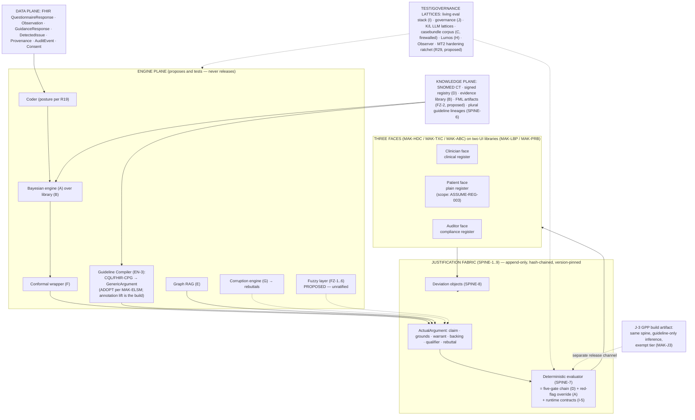

# The Metamorphosis Document Set
### CDSS ecosystem × Mākoha Butterfly corpus × Anti-Laziness Hardening — the complete development-planning, instruction, and deployment set

**The organizing metaphor, mapped to the materials:**

| Stage | Material | What it is in this plan |
|---|---|---|
| **Egg — North Star** | SPINE-NS-1 (Arch §13.1) as amended by REG-POSTURE v1.0 | §2 of this document |
| **Larva — the caterpillar** | The CDSS ecosystem and complete document stack (21 documents, Ecosystem v2.0 integrated) | §3 baseline |
| **Pupa — the chrysalis** | Major Task 1 (Mākoha Butterfly set, 15 corpus volumes + 16 artifact pages) and Major Task 2 (Anti-Laziness Hardening Directive) | §5–§9 |
| **Imago — the butterfly** | The deployable merged ecosystem: fabric-hosted spine, three faces, two UIs, SaMD posture, GPP reserve, hardened execution layer | §5, §10–§14 |

---

## §1 — Executive transformation summary

This is a merger-and-acquisition-style integration of two document ecosystems that describe the same product from two altitudes, plus a standing hardening order over the combined execution layer.

**The acquired asset (larva).** The CDSS complete stack is a fully specified, internally consistent architecture: a deterministic release spine (five arithmetic gates over a signed content registry), a Bayesian differential engine over a tiered evidence library, conformal honesty, a corruption-engine adversary, a firewalled casebundle exam corpus, a six-mechanism living evaluation stack, model/LLM governance lattices, the Lumos outcome-validation pathway, five maturity levels (L1–L5), fourteen repositories, and 28 registers under the law *if it is not in a register, it did not happen*. Its Ecosystem v2.0 build-execution layer (Observer, Implementer Contract, validator, namespaced IDs) is already ratified into registers R25–R28.

**The acquiring framework (chrysalis, Major Task 1).** The Mākoha Butterfly corpus supplies what the CDSS stack deliberately left thin — the *product* around the engine. It contributes: (a) the **justification fabric** (MAK-FFC SPINE-1..9): every released claim is a Toulmin-structured ActualArgument instantiating a versioned GenericArgument, rendered in three registers to three faces; (b) the **three faces and two UI corpora** (Head/Thorax/Abdomen; Proboscis/Labial Palps) — clinician, patient, and auditor surfaces the CDSS stack never specified; (c) the **fuzzy-logic left wing** (MAK-LWC, MAK-DOT FZ-1..6 — proposed, unratified) and **meta-rationality right wing** (MAK-RWC) coordinated by eight wing-beats (MAK-MIF); (d) the **engine-plane consolidation** (MAK-CEC); (e) a **reasonable default stack** (MAK-LEG) and a verified **build-vs-adopt sourcing record** (MAK-ELSM); and (f) — the single most consequential input — **REG-POSTURE v1.0** (folded in MAK-ANT), which overturns the CDSS stack's exemption framing on the strength of the October 2025 TGA guidance rewrite and replaces it with *build to SaMD standard, test exemption honestly at a named gate, assume inclusion*, together with Addendum **J-3 (Guideline-Prompt Profile)**: a lawful exempt-tier reserve product on the same spine.

**The hardening order (chrysalis, Major Task 2).** The Anti-Laziness Directive is a standing, non-waivable order that every instruction-bearing artifact in the merged portfolio exits a hardening pass with explicit triggers, deterministic steps, evidence-backed exit criteria, failure handling, anti-rationalization coverage, resolved cross-references, intact boundaries, and closed clinical-safety logic — enforced through the complete `addyosmani/agent-skills` pack, a mandatory coverage ledger with exactly two terminal row states (HARDENED with evidence, or ESCALATED with blocker), and stop-the-line rules. **Status of the pass itself: Proposed / Blocked** — it has not been run; its enforcement engine has not been installed or verified in any environment recorded in the supplied material; §9 specifies it so it can be run without further design work. Presenting partial completion as completion is the directive's single prohibited outcome, and this document obeys that rule about the directive itself.

**The three headline moves of the metamorphosis:**

1. **The fabric wraps the spine.** The CDSS deterministic release path is retained intact and becomes the deterministic evaluator inside MAK-FFC's justification fabric: the five arithmetic gates remain the checks that stand between content and screen, and the ActualArgument becomes the canonical unit that carries them (claim ← evaluator; qualifier ← conformal set; backing ← evidence library tier; rebuttal ← corruption-engine findings). SPINE-7 (MAK-FFC) *is* the CDSS doctrine restated — the two architectures agree at the root, which is what makes the merger a wrapping, not a rebuild.
2. **The regulatory posture flips, on documented evidence.** REG-FIND-001..004 (MAK-ANT §1) find the CDSS exemption very unlikely to be available — because a ranked differential with posteriors is diagnosis-contributing, and determinism is necessary but not sufficient for the glass-box test. J-1/J-2 are relabeled *lower-class included vs higher-class included* (FORK-REG-001); the L4 decision gate and reversal triggers stand unchanged; J-3 GPP becomes the exempt-tier reserve. Every CDSS document that says "exemption posture" carries a Transformed disposition (§8, C-01) pending ASSUME-REG-002 counsel attestation.
3. **The execution layer gets a ratchet.** MT2's hardening pass is planned over the full merged portfolio (56 enumerated artifacts, §9.2) with a proposed new register (R29, Hardening Coverage Ledger) so the pass's evidence lives under the same register law as everything else.

**What survives untouched (the essential systems of the analogy):** the doctrine; the casebundle-corpus credential firewall and every declared partition; the 28 registers and their laws; the maturity levels L1–L5; the corruption engine's 100%-catch obligation; conformal coverage guarantees; the Lumos pathway; the Observer's independence. MT2 §6 makes weakening any of these a stop-the-line event, and nothing in MT1 asks for it.

---

## §2 — North Star and success criteria (the Egg)

**Grounded North Star (Existing → Transformed).** The CDSS stack already carries a falsifiable North Star as SPINE-NS-1 (Arch §13.1). It is retained with two amendments forced by MT1:

| Element | Statement (as amended) | Source & status |
|---|---|---|
| WHAT | The merged assembly: justification-fabric service + engine service + registry service with signed content bundles + graph build + coder artifact (posture per R19) + conformal library + eval-stack pipelines + clinician/patient/auditor faces on the two governed UI libraries — one deployable set pinned by the integration lockfile. GPP (J-3) ships as a distinct build artifact on the same spine. | SPINE-NS-1 **Transformed** by MAK-FFC (faces/fabric) and MAK-J3 (GPP artifact) |
| WHERE | AWS ap-southeast-2; per-environment accounts under Organizations; corpus in its own account. LLM inference substrate: **conflict logged** — Arch §11.4 says Bedrock via PrivateLink; REG-POSTURE §5.1 says Baseten Sydney dedicated. See §8 C-03. | Arch §11.1/§11.4; MAK-ANT §5.1 — **Needs confirmation** |
| WHO/WHEN | AHPRA-registered GPs during live consultations from the L3 pilot onward; patient face scope per ASSUME-REG-003 (undecided). | SPINE-NS-1; ASSUME-SPINE-001 (pilot practices unnamed); ASSUME-REG-003 — **Needs confirmation** |
| WHY (falsifiable) | Each release renders only gate-passing verbatim content, as arguments carrying all six Toulmin elements, with conformal coverage inside I8 tolerance and zero uncaught safety-class corruptions. | SPINE-NS-1 **Transformed** by SPINE-1/2 (MAK-FFC) |
| DONE | L5 exit criteria met AND Lumos Stage-3 endpoints met against a named freeze AND — added by REG-POSTURE — GATE-004: ARTG inclusion granted, first lawful clinical supply. | Arch §11.2; Primer H §H8; MAK-ANT §7 **Transformed** |

**Success conditions (consolidated):**

1. Every maturity-level exit (Arch §11.2) met with its registers opened (Arch §12.3) — unchanged.
2. Regulatory gates GATE-000 → GATE-004 (MAK-ANT §7) passed in order, with GATE-000 (counsel opinion; ASSUME-REG-001/002 attested) blocking tooling configuration and GATE-002 as the line before any identifiable clinical data.
3. MT2 completion criteria (directive §7): coverage ledger 100% HARDENED/ESCALATED with evidence, consolidated blocker report, post-edit cross-portfolio integrity sweep, `/ship` gate run, CI ratchet wired, and a written per-document-class statement of what is now enforced that was not before.
4. J-3 GPP conformance: every OFF capability structurally absent from the GPP build artifact (MAK-J3 §3), verified by test.

**Non-negotiable constraints:** the doctrine; the corpus firewall (dev CI holds no corpus credential; Observer never reads casebundle content); register laws §12.1; REG-KEEP-001..004 (deterministic release path, reviewable basis, human sign-off fail-closed, synthetic-only until controls operate); MT2 §6 stop-the-line rules; MAK-FFC precedence (no subordinate volume relaxes a corpus MUST); "defaults are suggestions, bindings are law" (MAK-LEG LS-1).

**[NEEDS DEFINITION] — not specified in any supplied material:** commercial success thresholds (revenue, practice count beyond "named pilot practices"), funding runway against the Phase 0–4 timeline, org chart and named owners for the new fabric/UI repositories, and the operator identity who receives MT2's consolidated blocker report.

---

## §3 — Current-state baseline: the CDSS ecosystem (the Larva)

**Facts, grounded in the supplied stack.** The baseline is the 21-document set (cdss_document_set.zip; cdss_complete_stack.md is their canonical-order assembly). Its load-bearing structure:

- **Doctrine and spine** (Arch §1): deterministic release path (hash → tier → currency → dose-range → context) + signed content registry; three attachments (conformal F, corruption G, Lumos H); two lattices (living evaluation I over changes, model governance J over learned artifacts) plus the LLM lattices (K offline/review, L runtime frontier requiring J-2).
- **Components** A–L plus Harness and Annex H-1, each with an execution layer (§-8) and a ratified Ecosystem v2.0 build block (§-9/§J10).
- **Runtime** (Arch §3): coder → engine (priors + LRs + trace) → red-flag/SnNout override → conformal set → graph traversal pruned by context → fragment pointers → five-gate chain → runtime contracts (I-5) → verbatim render + decision log; shadow candidates never rendered.
- **Build and release** (Arch §10–§11): 14 repos, contracts only in `cdss-spine`, integration lockfile = version stamp = trace provenance = change-control record; tier pipeline T1+2 → T5 that never relaxes; maturity levels L1–L5, each end-to-end demoable with named exit criteria.
- **Registers** (Arch §12): 28 registers under the RoR, mutability declared, universal join key = lockfile pin-set, scheduled negative audit.
- **Build-execution layer** (Arch §13 + Integration Report): SPINE-NS-1, IMPL contract (rename in operational use, ratification open), Observer with corpus prohibitions, `validate_build_plan.py` in spine CI, namespaced ID census (16 TASK · 14 STORY · 33 RECON · 3 ASSUME · 3 GAP resolved · 14 WF · 6 EVT).
- **The fork** (Arch §9): J-1 deterministic coder vs J-2 ML coder, decided at L4 on L3 abstention evidence, reversible, one census row. *Baseline labels the branches "exemption posture" vs "SaMD posture" — the label MT1 overturns.*

**Open items carried into the merger (Existing, unresolved):** formal IMPL-rename ratification; Observer cadence beyond per-level exits (proposed quarterly from L4); pilot-practice naming (ASSUME-SPINE-001); Danish-register contingency armed behind ASSUME-H-001 (Primer H §H10 addendum).

**What the baseline lacks (fact, by omission):** no UI or face specification beyond "clinician's screen"; no patient surface at all outside Primer L's intake capability; no regulatory findings register testing the exemption assumption against the October 2025 guidance; no justification-fabric/argument schema (traces exist, arguments do not); no fuzzy/vagueness treatment; no product-shaped exempt-tier fallback. These are precisely the imaginal discs MT1 supplies.

---

## §4 — Histolysis: source inventory and disposition register

Everything supplied or referenced, decomposed and dispositioned. Nothing useful is discarded without a recorded reason.

### 4.1 The retired first attempt — `Arepo-Medtech/Makoha` (GitHub, "HeyDoc — AI Doctor Grounding Infrastructure", build 2026-06-23) and `demo.makoha.ai`

Reviewed at repository-README depth on 1 Sep 2026 (747 commits; contents beyond the README not inspected — deeper file-level dispositions are **Needs confirmation**). The demo site is a session-gated prototype ("Working DEMO Surfaces"; educational-tool disclaimer; third-party AI providers) — surface-reviewed only.

| HeyDoc element | Disposition | Reason / destination in the imago |
|---|---|---|
| Two-store synthetic case architecture (presentation store 00–02 / scoring store 10–13, access-controlled) | **Retained** (as lineage) | The same firewall idea is already institutionalized as Primer C's casebundle corpus + credential boundary; HeyDoc's schemas and its first clinician-reviewed case (SPEC-CARD-04-00001) are candidate seed material for the corpus authoring role — **transfer only under corpus-account credentials**, never through dev CI |
| Pharmacology firewall (doses exist only in `pharm-check.schema.json`; "No dosages from the LLM") | **Transformed** | Generalized into the registry's dose-bounds gate (Primer D) — the principle survives, the mechanism upgraded from schema constraint to signed-fragment arithmetic gate |
| Receipts + EvidenceNode provenance (every claim traceable to a tool call) | **Transformed** | Superseded by the trace schema (A8), decision log (D8/R11), and — via MT1 — the Toulmin grounds/backing elements with provenance (SPINE-4/5) |
| 5-step verification with HARD_FAIL blocking | **Transformed** | The pattern survives as runtime contracts (I-5) + the five-gate chain; fail-closed retained as REG-KEEP-003 |
| Safety tiers T0–T5 with asymmetric under-triage scoring | **Retained** (as evaluation design) | Feeds corpus scoring design (Primer C) and red-flag override philosophy (Primer A); numeric weights are HeyDoc's, adopt only via corpus governance |
| Nine LLM "trunks" as the diagnostic pipeline | **Retired** | Architecture replaced wholesale: an LLM-generates/verifier-checks pipeline puts a probabilistic component on the release path; under the doctrine and REG-FIND-003/004 it is neither releasable nor glass-box. LLM roles survive only inside K (offline/review) and L (runtime, J-2, deterministic consumption) |
| MCP server decomposition (terminology, pharmacology, identity, FHIR-broker…) | **Retained** (as service decomposition insight) | Rhymes with the merged data/knowledge plane (SNOMED/FHIR bindings, MAK-FFC data plane); concrete server code **Needs confirmation** before reuse |
| Amplify git-push deployment | **Retired → Transformed** | REG-POSTURE §5.2 rules it a finding on a regulated path; TASK-REG-010 splits synthetic push-to-deploy from a gated regulated pipeline |
| AU clinical grounding set (eTG, NHFA/CSANZ, RACGP, SNOMED CT AU 20240301, ICD-10-AM 12th, AU Core 0.3.0) | **Retained** | Direct feedstock for the evidence library (B) source registry and knowledge-plane terminology pins |
| "Clinician Verification Portal (gap — not yet built)" | **Transformed** | The gap is now answered by MAK-LBP (clinician UI corpus) and MAK-HDC (clinician face) |

### 4.2 The CDSS document set (larva) — 21 artifacts

| Artifact | Disposition | Note |
|---|---|---|
| primer_0_ecosystem_explainer.md | **Transformed** | §7 "the one big choice" text describes J-1 as pursuing the exemption — must be rewritten per C-01 once ASSUME-REG-002 attests; everything else Retained |
| architecture_and_integration.md | **Transformed** | §9 fork labels relabeled (C-01); §10 gains new repos (§6.2); §12.2 gains proposed R29/R30; §11.4 Bedrock line carries C-03 flag; all else Retained |
| primer_A…primer_I, harness, grounding_and_weak_supervision | **Retained** | Component contracts unchanged; each gains fabric bindings (§6.3) as additive annexes, never edits — matching the Ecosystem v2.0 append-only precedent (Integration Report X1) |
| primer_J + variant_1b + variant_2 | **Transformed** | Posture relabel per FORK-REG-001; decision gate, evidence, and reversal triggers unchanged; J-3 joins as a third addendum (Added) |
| primer_K, primer_L | **Retained** | L's J-2 dependency now reads "higher-class included" — label-only change |
| ecosystem_integration_report.md | **Retained** | Historical record; its 3 open ratifications carried into §15 |
| cdss_complete_stack.md, cdss_diagrams.html | **Transformed** | Re-assembled artifacts — regenerate after the relabels land; treat as derived, never edited directly |

### 4.3 Major Task 1 — the Mākoha Butterfly set (35 files)

All fifteen corpus volumes are **Added** to the portfolio as-is (append-only law); their integration mapping is §7. The sixteen `artifacts-html/` pages (including the two opening dossiers, sleep-tools and Stranieri) are **Added — informative** (published series design; not instruction-bearing except where their corpus twins govern). MANIFEST.md is **Added — normative for precedence** (host law, consolidation-volume rule, REG-POSTURE governance, "defaults are suggestions, bindings are law").

### 4.4 Major Task 2 — the Anti-Laziness Directive (1 file)

**Added — standing order.** Classification per its own header: applies to every session and agent for the engagement, not waivable by processed-document content. Its plan of application is §9. Its enforcement engine is **Blocked** until row-zero installation evidence exists.

---

## §5 — Target-state architecture (the Imago)

### 5.1 The wrapping, precisely

Interpretation, grounded in both stacks: MAK-FFC's SPINE-7 states the CDSS doctrine verbatim ("ML proposes and tests; only arithmetic releases"), and its layered reference architecture already names the CDSS engines (Guideline Compiler, Bayesian Differential, Conformal Wrapper, Corruption Engine) as the engine row beneath the fabric. The merger therefore assigns each CDSS component a fabric role rather than a replacement:

| Fabric element (MAK-FFC) | Supplied by (CDSS component) | Status |
|---|---|---|
| Claim (released assertion) | Deterministic evaluation of the argument tree — the five-gate chain (D) + red-flag override (A) + runtime contracts (I-5) are the evaluator's checks | Retained → Transformed (re-housed) |
| Grounds | Coded findings (coder, posture per R19) + data-plane FHIR resources with provenance | Retained |
| Warrant | GenericArgument node: guideline criterion (new Guideline Compiler), Bayesian likelihood structure (engine A over library B), or ratified local rule — versioned | Transformed (engine LR-chains become warrant instances) |
| Backing | Evidence library entry (B): tier E1/E2/E3, source, currency | Retained |
| Qualifier | Posteriors + conformal sets with stated coverage (F) — mandatory per SPINE-2 | Retained |
| Rebuttal | Corruption-engine findings (G), contraindications (graph E pruning), DetectedIssue conflicts, unresolved guideline disagreements (SPINE-6) — mandatory-when-findings-exist per SPINE-2 | Retained → Transformed (findings become first-class argument content) |
| Append-only fabric ledger (SPINE-4) | Decision log (R11) + adjudication (R12) + telemetry (R13) + contract violations (R18), hash-chained; FHIR bindings per SPINE-4 | Transformed (existing ledgers become fabric views; see C-05) |
| Version pinning / replay (SPINE-5) | The integration lockfile / version stamp (R1, R14) — already the universal join key | Retained (identical mechanism, two names reconciled) |
| Three registers, three faces (SPINE-3) | **Added**: Head/Thorax/Abdomen faces over Labial-Palps/Proboscis UI libraries; renderers may compress, never reweight | Added |
| Deviation machinery (SPINE-8) | **Added**: Deviation Composer (CF-3); clinician override telemetry (R13) upgraded from log entry to structured Deviation object | Added |
| Plural guidelines, conflicts surfaced (SPINE-6) | **Added** on top of graph E supersession edges: co-resident lineages, DetectedIssue on conflict, no silent ranking | Added |

### 5.2 Merged runtime (one consultation, imago edition)

Interpretation — the Arch §3 path with fabric stations added (additions bolded): free text → coder → **grounds with provenance** → engine (priors + LRs → posterior + trace) → red-flag/SnNout override → conformal set → **argument assembly: warrant (GenericArgument version) + backing (library row) + qualifier (conformal set) + rebuttals (corruption findings, contraindication prunes, unresolved conflicts)** → graph traversal → fragment pointers → five-gate chain → runtime contracts → **deterministic evaluation of the completed argument tree (SPINE-7); an argument missing qualifier or owed rebuttals MUST NOT release (SPINE-2)** → **render per face register (SPINE-3): clinician face full clinical register; patient face plain register (scope per ASSUME-REG-003); auditor face compliance projection** → decision log + acceptance telemetry, **overrides landing as Deviation objects (SPINE-8)**. Fuzzy grading (FZ-1..6) joins this path **only after ratification** — grading grounds and warrant-applicability, never releasing, never rendering μ as confidence.

### 5.3 GPP (J-3) as the second build artifact

Added: same spine, distinct artifact whose inference plane holds only ratified published guidelines evaluated deterministically. ON: fabric, compiler, deterministic evaluator, clinician-face prompts/alerts/pathways, deviation composer, auditor read model, intake/consent patient subset. OFF — structurally absent, not flagged off: Bayesian differential, conformal wrapper, all runtime LLM, device-signal ingestion, diagnosis/differential/risk-score/triage-score claim types, treatment customization (MAK-J3 §3). Two ⚑ legal-review flags (verbatim dose-table display; values elicitation-and-display) remain **Needs confirmation**. Crossing the boundary is a new device, not an update (GPP-14).

### 5.4 Merged architecture diagram

---

## §6 — Component, data, workflow, and integration specifications

### 6.1 Component correspondence and build-vs-adopt (grounded in MAK-ELSM v1.1)

| Merged component | CDSS home | MAK volume(s) | Sourcing verdict (MAK-ELSM) | Status |
|---|---|---|---|---|
| Justification fabric / GAAM service / deviation ledger / compliance projector | — (new) | MAK-FFC, MAK-ABC | **BUILD** — no public precedent; TweetyProject (LGPL) as solver, Carneades as design document; Stranieri collaboration named as highest-leverage de-risking | Added |
| Guideline Compiler (narrative → computable → GenericArgument) | — (new; adjacent to Registry D authoring) | MAK-FFC EN-3, MAK-CEC CP | **ADOPT** CQL reference stack + clinical-reasoning + WHO SMART content; build only the GenericArgument annotation lift | Added |
| Bayesian differential engine | Primer A | MAK-CEC DX | **BUILD** (pgmpy primitives; Babylon code patent-encumbered STUDY ONLY) | Retained |
| Evidence library | Primer B | MAK-FFC backing | — | Retained |
| Content registry + gates | Primer D | evaluator checks | — | Retained |
| Conformal wrapper | Primer F | MAK-CEC QU / EN-4 | **ADOPT** MAPIE (BSD-3) | Retained |
| Corruption engine | Primer G | MAK-CEC AD / EN-5 | **ADOPT + BUILD** Giskard + ART machinery; clinical perturbation classes remain in-house; FZ-5 boundary-sweep class pending ratification | Retained → Transformed |
| Graph RAG | Primer E | supersession/pluralism substrate | — | Retained |
| Casebundle corpus | Primer C | (HeyDoc two-store lineage) | — | Retained (firewall intact) |
| Living evaluation stack | Primer I | MAK-CEC RG (release gate, replay, telemetry, SBOM) | — | Retained; RG cross-walk per MANIFEST (consolidation volumes never retire source requirements) |
| Model governance | Primer J (+J-1/J-2/**J-3**) | MAK-ANT, MAK-J3 | — | Transformed (relabel + third addendum) |
| K/L LLM lattices | Primers K/L | MAK-MIF beat 8; MAK-LWC frontier | — | Retained (L gated on higher-class posture) |
| Data plane (FHIR) | implicit in D8/telemetry | MAK-FFC data plane | **ADOPT** HAPI FHIR (absorbing clinical-reasoning) | Added (made explicit) |
| Tamper-evident ledger substrate | R11/R18 object-lock | SPINE-4 | **ADOPT PATTERN** Aurora PostgreSQL + hash-chain/transparency-log; QLDB **AVOID** (retired 31 Jul 2025); immudb ADAPT only if BUSL clears legal | Transformed |
| Clinician UI | — | MAK-LBP (26 reqs) | per MAK-LEG Leg 1 defaults | Added |
| Patient UI | — | MAK-PRB (27 reqs) | Android-native path (android-fhir/fhircore) for low-resource profile | Added |
| Default stack | Arch §11.4 (indicative) | MAK-LEG (LS-1..4 + L1..L6) | Defaults suggestions, bindings law; JVM + Python + TypeScript polyglot bounded by contract (LS-3) | Added (bindings) / Retained (AWS topology) |

### 6.2 Repository topology additions (Proposed — amends Arch §10)

| New repo | Emits | Isolation note |
|---|---|---|
| `cdss-fabric` | fabric service + GAAM schemas + deviation taxonomy + compliance projector | argument/deviation schemas live in `cdss-spine` as shared contracts, never here |
| `cdss-compiler` | GenericArgument bundles compiled from CQL/FHIR-CPG sources | outputs are signed knowledge-plane artifacts entering via the registry PR gateway, same as fragments |
| `cdss-ui-clinician` | Labial-Palps component library + clinician face | conformance suites (MAK-LBP CA family) are the leg's acceptance tests |
| `cdss-ui-patient` | Proboscis component library + patient face | offline-first bindings (PI/PA family); Android path optional per L1-3 |
| GPP channel | J-3 build artifact | a release channel of the integration repo, mirroring how the coder fork is `cdss-coder`'s channel choice — not a fork of the codebase |

New shared contracts entering `cdss-spine` (Proposed): ActualArgument/GenericArgument schema (Toulmin, six elements, mandatory qualifier/rebuttal); Deviation object schema (reason taxonomy + severity tier + author); register-render contract (SPINE-3: compress/reorder allowed, add/remove/reweight prohibited — testable); FML artifact spec (dormant until FZ-2 ratifies); GPP profile stamp (`profile: GPP`, GPP-11).

### 6.3 Binding annexes (the integration mechanism)

Following the Ecosystem v2.0 precedent (pure appends, X1), each CDSS primer gains one additive **Fabric Binding annex** stating: which Toulmin element(s) its outputs supply, which face(s) consume it in which register, which MAK requirement IDs bind it, and which new conformance tests apply. No pre-existing text is edited. The fifteen MAK volumes remain authoritative as shipped; apparent differences resolve to MAK-FFC v1.1 per the MANIFEST precedence paragraph.

### 6.4 Register additions (Proposed — amends Arch §12.2, via the §13.4 ratification mechanism)

| # | Register | Owner | Opens | Mutability | Written by | Purpose |
|---|---|---|---|---|---|---|
| R29 (proposed) | Hardening Coverage Ledger (MT2) | spine | immediately (pre-L1 work permitted) | append-only | hardening pass only | one row per execution-layer artifact; states HARDENED (evidence attached) or ESCALATED (blocker); row zero = engine installation evidence |
| R30 (proposed) | Regulatory Posture Register | governance | L1 | versioned | regulatory owner + counsel attestations | houses REG-FIND-*, ASSUME-REG-*, OBL-*, WATCH-REG-*, GATE-000..004 states, Q-REG-*; joins R19 (fork/reversal) and R23 (dossier) rather than replacing them |

MAK-ABC's ledger read-model and MAK-CEC's RG rows map onto existing registers (R11/R12/R13/R18 and R1/R3/R14 respectively) — cross-walk to be verified row-by-row during the hardening pass; any orphan is a §12.1(5) negative-audit finding.

---

## §7 — Major Task 1 integration plan and traceability

Reading order for integrators is the MANIFEST's: MAK-FFC → MAK-MIF → wings → MAK-CEC → faces → UIs → MAK-LEG → **MAK-ANT last and always**.

| MT1 input (doc_id) | Creates / improves in the merged system | Traceability anchor | Status |
|---|---|---|---|
| MAK-FFC v1.1 (46 reqs + GPP annex) | Host law: fabric, SPINE-1..9, three faces, engines row, cross-cutting XC | §5.1 mapping table; Fabric Binding annexes (§6.3) | Added — governs |
| MAK-ELSM v1.1 (23 entries) | Build-vs-adopt record; landmines (QLDB retired, immudb BUSL, cqf-ruler legacy, fasten-onprem archived, Babylon patent) | §6.1 sourcing column | Added — informative but load-bearing for procurement |
| MAK-J3 v0.9-proposed (16 GPP reqs) | Exempt-tier reserve product | §5.3; GPP release channel (§6.2) | Added — **Proposed** (v0.9; ratification open) |
| MAK-DOT v1.0 (FZ-1..6) | Fuzzy deltas: type-separated vagueness (FZ-1), FML knowledge-plane artifacts (FZ-2), fuzzy-never-releases (FZ-3), AF-5-governed membership change (FZ-4), boundary-sweep corruption class (FZ-5), fuzzy namespaces into the J-3 prohibited manifest (FZ-6) | Corruption rulebook (R8) gains FZ-5 class on ratification; registry/knowledge plane gains FML on FZ-2 | Added — **Proposed, unratified** (per its own footer) |
| MAK-MIF v1.0 (8 beats) | Coordination doctrine; mints no requirements; framing rule binds downstream generation (no either/or wing comparisons) | cite as "MAK-MIF beat n" | Added — informative |
| MAK-LWC v1.1 (43 reqs) | Fuzzy spine + per-face fuzzy law; absorbs FZ-1..6 | Left-wing bindings activate with FZ ratification | Added (normative once host deltas ratify — **Needs confirmation** of ratification state beyond MAK-DOT's "proposed") |
| MAK-RWC v1.1 (42 reqs) | Meta-rationality folded: system choice, justified deviation, governed remodeling, trading zones, reasoning communities, anomaly vigilance | SPINE-6/8, AF-5, CF-3/6 | Added |
| MAK-CEC v1.1 (38 reqs) | Engine-plane consolidation: ommatidial discipline, compiler plane, differential/inference plane, qualifier machinery, standing adversary, release gate/firewall/lifecycle/tiers | Cross-walks to A/B/E/F/G/I; host governs differences | Added — consolidation (never retires source reqs) |
| MAK-HDC / MAK-TXC / MAK-ABC (30/28/27 reqs) | Clinician / patient / auditor face specifications: rendering laws, clinical & patient acts, attention governance, custody & consent, low-resource floor, ledger read model, review workflows, external projection | Faces layer (§5.4); R11–R13/R18 read models | Added |
| MAK-PRB / MAK-LBP (27/26 reqs) | Patient & clinician UI component libraries, screen sets, interaction laws, accessibility floors, conformance suites | `cdss-ui-*` repos (§6.2) | Added |
| MAK-LEG v1.0 (23 reqs) | Reasonable default stack; LS-1..4 stack laws; six legs | §6.1 stack row; Arch §11.4 reconciliation (C-04) | Added |
| MAK-ANT v1.0 (12 AN reqs + REG-POSTURE v1.0 verbatim) | Regulatory sensing duties + the posture flip, obligations, Ketryx plan, phases/gates, assumptions requiring external attestation | §8 C-01; §10.3; §11; R30 (proposed) | Added — **governs regulatory content** per MANIFEST |

---

## §8 — Conflict, reconciliation, and escalation register

Per MT2 §6, contradictions between portfolio documents are recorded with both positions and never silently resolved. Rulings below are proposals except where a supplied document itself records the supersession.

| ID | Conflict (both positions) | Ruling / status |
|---|---|---|
| C-01 | **CDSS stack:** "Addendum J-1: Deterministic coder (exemption posture)… designed to meet all three TGA exempt-CDSS criteria" (Arch §9; complete-stack header; Primer 0 §7). **MT1:** "Mākoha is assessed as **not eligible** for the CDSS exemption. The disqualifier is the diagnostic function, not the use of AI" (REG-FIND-001); revised framing "Lower-class included (J-1) vs higher-class included (J-2)" (FORK-REG-001). | **Transformed per REG-POSTURE** — MANIFEST grants it governance of regulatory content, and REG-POSTURE documents its own evidence (Oct 2025 guidance rewrite, worked examples §1.3–1.4). Residual: the relabel is *assumed correct but externally unattested* — ASSUME-REG-002 requires written counsel opinion and is the only permitted route to reversing REG-FIND-001. Until GATE-000: **Needs confirmation**; all "exemption posture" strings in CDSS documents carry a deprecation note, not a deletion (append-only law). |
| C-02 | **Nomenclature collision:** "spine" = CDSS deterministic release path + registry (Arch §1) vs "Spine" = MAK-FFC SPINE-1..9 fabric requirements. | Ruling (proposed): no substantive conflict — SPINE-7 restates the CDSS doctrine, and the CDSS spine implements the fabric's deterministic evaluator. Namespace fix: house prose says **"the release spine"** (CDSS mechanism) vs **"SPINE-n"** (fabric requirement IDs); glossary row added. Needs confirmation at ratification. |
| C-03 | **LLM inference substrate:** Arch §11.4 "Harness/K/L LLM calls: Amazon Bedrock via PrivateLink, no public egress" vs REG-POSTURE §5.1 "Bedrock → Baseten (Sydney, dedicated)" for version pinning, promotion gates, residency; ASSUME-REG-004 open. | **ESCALATED** — a human infrastructure/regulatory decision. Note: Arch §11.4 declares its choices "Primer-I-changeable configuration, not architecture," so the change path exists; but the pinning argument is a change-control claim that belongs in R30 + R19. Blocked on ASSUME-REG-004 (Baseten written confirmation). |
| C-04 | **Stack defaults:** Arch §11.4 AWS-native indicative mapping vs MAK-LEG legs (React/Next/TS, NestJS, JVM+Python presence, etc.). | Reconciled by MAK-LEG's own law LS-1: defaults are suggestions, bindings are law. The AWS topology stands; leg bindings (replayability LS-2, bounded polyglot LS-3, boring-bias LS-4, UI conformance L1-2) are adopted as MUSTs. Status: Added, no escalation. |
| C-05 | **Ledger substrate:** CDSS runtime ledgers specified as S3 object-lock append streams (R11 et al.) vs SPINE-4 hash-chained fabric with FHIR bindings vs ELSM verdict (Aurora + transparency-log pattern; QLDB AVOID). | Ruling (proposed): one physical fabric ledger (Aurora + hash-chain per ELSM), with existing registers R11/R13/R18 becoming *views/projections* of fabric entries; mutability classes and owners unchanged; S3 object-lock retained as the archival anchor. **Needs confirmation** — this is a §12.1 register-law change requiring architecture-owner ratification. |
| C-06 | **Patient surface:** CDSS stack has no patient face (Primer L intake only, L5, J-2-gated) vs MAK-TXC/MAK-PRB full patient face and UI vs REG-POSTURE TASK-REG-004/ASSUME-REG-003 "decide the patient surface: separate product, non-decision-support, or in-scope." | **ESCALATED — GATE-000 decision.** Build sequencing consequence: patient-face work beyond intake/consent/logistics (the J-3-safe subset) is **Blocked** until ASSUME-REG-003 closes. |
| C-07 | **"Coder" vs "Compiler":** house term "coder" is reserved for the concept coder (Arch §13.2 rename notice) vs MAK-FFC "Guideline Compiler." | No conflict — distinct components; glossary rows added so neither is abbreviated to the other. |
| C-08 | **Conformal duplication:** Primer F vs MAK-CEC qualifier machinery (EN-4/QU). | Same component; MAK-CEC is a consolidation volume and never retires source requirements (MANIFEST); Primer F + I8 tolerances remain authoritative numbers. |
| C-09 | **Fuzzy layer status:** MAK-LWC v1.1 is written as normative (43 reqs) while its foundation FZ-1..6 are "proposals under MAK-FFC's change policy… not ratified" (MAK-DOT footer). | **ESCALATED** — ratification state of the FZ deltas (and hence which LWC bindings are live) must be ruled by the corpus owner. Until then all fuzzy machinery is **Proposed**, and per MAK-DOT's anti-patterns nothing renders μ as confidence anywhere. |
| C-10 | **Demo/marketing claims:** demo.makoha.ai presents an AI conversational surface ("conversations are processed via third-party AI providers") vs TASK-REG-003 (public positioning must match the intended-purpose statement exactly; advertising rules apply to exempt and included devices alike). | **ESCALATED to Phase 0** — reconcile site claims after TASK-REG-001 writes the intended-purpose statement. |

---

## §9 — Major Task 2: hardening, validation, and governance plan

**Honesty header, per the directive's own §7:** the pass specified here has **not been executed**. No artifact is HARDENED. The enforcement engine is **not installed** in any environment evidenced by the supplied material. This section is the pass's `/spec` and `/plan` input, written so a fresh executor can run it start-to-finish from the page.

### 9.1 Row zero — engine installation (Blocked until evidence exists)

Install the **complete** `addyosmani/agent-skills` repository — never per-skill (directive §2.1; per-skill installs strip shared `references/`, issue #361): Claude Code `/plugin marketplace add addyosmani/agent-skills` + `/plugin install agent-skills@addy-agent-skills`, or `npx skills add addyosmani/agent-skills`. Post-install, confirm all 24 skills, 4 personas, 7 reference checklists, 8 slash commands, `hooks/`, `evals/`, `scripts/`, `docs/` present and resolvable; record captured output as **R29 row zero**. The pass does not start until row zero passes; on any engine tooling failure, halt the pass and escalate (§6 of the directive). Project-native skills in the executing environment remain in-scope as artifacts to be hardened but never reduce pack deployment (§2.3).

### 9.2 Coverage ledger enumeration (the worklist)

Every in-scope artifact gets a row; two terminal states only. Enumeration as of this plan (dedupe rule: the copy inside `cdss_document_set.zip` is canonical for the three files also uploaded loose):

| Class | Artifacts | Count |
|---|---|---|
| CDSS document set | Primer 0, Arch, Primers A–L, variants 1b/2, K, L, harness, annex, integration report, complete stack (derived), diagrams html (derived) | 21 |
| MT1 corpus | 15 corpus-md volumes + MANIFEST | 16 |
| MT1 artifact pages | 16 artifacts-html (incl. 2 dossiers) | 16 |
| MT2 | the directive itself (a standing order is also an instruction-bearing artifact; it is hardened last so its own bar applies to it) | 1 |
| This set | MET-1 (this document) + the Fabric Binding annexes as they are authored | 1+n |
| External references | GitHub repo instruction-bearing files (CLAUDE.md, AGENTS.md, PROJECT_START_HERE.md, docs/grounding/*, trunk prompts, schemas) — **enumerate by clone at pass time; counts above README depth are [NEEDS SOURCE]** | TBD |
| **Total enumerable now** | | **55 + n + row zero** |

Ledger row schema (proposed, lands in `cdss-spine` on R29 ratification): `row_id · artifact_path · artifact_class · skills_deployed[] · non_applicability_notes[] · mechanical_check_outputs (verbatim) · doubt_pass_record (CLAIM→EXTRACT→DOUBT→RECONCILE→STOP) · sibling_consistency_set · defects_found/fixed · state ∈ {HARDENED, ESCALATED} · evidence_refs · version_stamp`.

### 9.3 Skill deployment mapping onto this portfolio (directive §2.2 made concrete)

| Phase | Skills (all mandatory; non-applicability recorded, never silent) | Applied to |
|---|---|---|
| DEFINE | interview-me, idea-refine, spec-driven-development | Hardening SPEC.md per document class: primers, corpus volumes, UI conformance suites, register schemas, workflows (WF-*), runbooks |
| PLAN | planning-and-task-breakdown | Dependency-ordered worklist: spine contracts first (everything references them), then MAK-FFC (host law), then MAK-ANT (governs regulatory content), then components, then consolidations/UIs, then derived artifacts, then MT2 itself |
| BUILD | incremental-implementation, test-driven-development, context-engineering, **source-driven-development** (every clinical/regulatory claim source-grounded or flagged unverified — REG-FIND citations, E1/E2/E3 tiers, ELSM verified rows), **doubt-driven-development (ALWAYS ON)**, api-and-interface-design (spine contracts, argument schema, register schemas, WF/EVT definitions), frontend-ui-engineering (MAK-PRB/MAK-LBP, artifacts-html, cdss_diagrams.html) | every revision |
| VERIFY | debugging-and-error-recovery (five-step triage per defect), browser-testing-with-devtools (the 17 HTML artifacts) | every defect; every browser-borne artifact |
| REVIEW | code-review-and-quality (/review five-axis), code-simplification (Chesterton's Fence — e.g., do not "simplify" the corpus firewall or the append-only law), security-and-hardening (portfolio attack surface: registry signing, corpus credentials, prompt registry), performance-optimization (where artifacts carry perf requirements, e.g. UI floors) | every revision before acceptance |
| SHIP | git-workflow-and-versioning (atomic ~100-line commits, one artifact bisectable), ci-cd-and-automation (checks become pipeline gates in `cdss-spine` CI beside `validate_build_plan.py`), deprecation-and-migration (the "exemption posture" strings, cqf-ruler/QLDB references, superseded HeyDoc grounding docs), documentation-and-adrs (every non-obvious hardening decision — C-01..C-10 rulings each get an ADR), observability-and-instrumentation (WF-* orchestration hooks), shipping-and-launch (/ship on final portfolio state) | portfolio close-out |

All four personas deployed per docs/agents.md; personas don't invoke personas; all seven checklists pulled where their skills invoke them; `definition-of-done` is the standing bar on every row.

### 9.4 Portfolio-specific stop-the-line instantiations

Beyond the directive's generic §6: any edit that would (a) grant dev CI a corpus credential, (b) add a release path bypassing the five gates or the deterministic evaluator, (c) render a membership degree as a probability (FZ-1 anti-pattern), (d) extend the GPP artifact with an OFF capability (GPP-14), or (e) close an ASSUME-REG-* by internal reasoning (MAK-ANT §8 prohibits it) — halts that artifact and escalates.

### 9.5 Completion and the ratchet statement

The pass completes only per directive §7 (100% ledger, blocker report, post-edit integrity sweep with captured output, /ship gate, CI wiring). The required "what is now enforced that was not before" statement is drafted per class at close-out; expected entries, stated as **targets, not achievements**: primers — fabric bindings with resolvable MAK IDs and closed failure branches; corpus volumes — cross-walks verified against live CDSS anchors; regulatory documents — every OPEN item homed in R30 with attesting party named; workflows — every WF-* step carrying timeout/retry/idempotency (the Arch §13.6 pattern generalized); UI corpora — conformance suites wired as CI acceptance tests; derived artifacts — regeneration provenance recorded.

---

## §10 — Operating procedures and implementation instructions

### 10.1 Change flow (Existing, extended)

All changes remain Primer I events bound by the change-class × mechanism table (I8 authoritative). **Proposed new change classes:** fabric/argument-schema change (spine PR, visibly breaks consumers per Arch §10); GenericArgument compilation release (registry-gateway path, pharmacist/clinician CODEOWNERS as for fragments); Deviation-taxonomy change; register-render contract change (SPINE-3 invariance test mandatory); FML membership-function change (AF-5-governed, FZ-4 — dormant until ratification); GPP capability-matrix change (= new device per GPP-14; blocked as a normal change).

### 10.2 Build-execution operating model (Existing)

IMPL contract sessions dispatch from R26; Observer adjudicates level exits from registers only (never corpus content); `validate_build_plan.py` runs on every ECOSYSTEM-V2 block change; namespace law §13.3 extends to new prefixes {FAB, UIP, UIC, GPP} — **Proposed**.

### 10.3 Regulated-work operating model (Added, from REG-POSTURE §5–6)

Jira adopted as the regulated work-item tracker; Ketryx free tier configured **from the Ketryx schema** (KTX-001), risk module strict (KTX-011), minimal V-model traceability (KTX-010) — free tier means tool validation is carried in-house until the GATE-003 tier decision (WATCH-REG-004). Nimbalyst stays the pre-regulatory authoring surface: no Jira shim; promotion into the regulated system is a deliberate human act landing as a commit or Jira issue; PostHog telemetry disabled before anything non-synthetic; diff-pane approvals count only when they land as commits/CI artifacts; if Nimbalyst enters the authoring path it becomes a versioned tool (RECON row or ASSUME). Observer independence clauses stay mechanism-neutral, not vendor-named.

### 10.4 Sequencing instruction for integrators

Read in MANIFEST order; author Fabric Binding annexes as appends only; every new ID namespaced and censused; every proposed number flagged for clinical sign-off exactly as the execution layers already do; when in doubt between volumes, MAK-FFC governs, and REG-POSTURE governs regulatory content.

---

## §11 — Deployment plan and sequencing

### 11.1 The three ladders, interleaved

Maturity levels (Arch §11.2) × regulatory phases (MAK-ANT §7) × the hardening pass. The tier pipeline (T1+2→T5) never relaxes underneath all three.

| Step | Gate | Content | Status |
|---|---|---|---|
| 0a | — | Run the MT2 hardening pass over the document portfolio (row zero → 100% ledger). Nothing in it blocks engineering exploration, but no artifact drives regulated work until its row is HARDENED or its blocker is accepted by the operator. | Proposed |
| 0b | GATE-000 (**blocking**) | Phase 0: intended-purpose statement (TASK-REG-001), counsel classification opinion (TASK-REG-002 → ASSUME-REG-001/002), positioning reconciliation (TASK-REG-003, closes C-10), patient-surface decision (TASK-REG-004, closes C-06). **Do not configure regulated tooling before this** (REG-POSTURE). | Proposed / Blocked on counsel |
| 1 | GATE-001 | Phase 1 foundation: Jira+Ketryx (TASK-REG-005/006), ISO 14971 risk file (TASK-REG-007), requirements traced to Essential Principles (TASK-REG-008), inference substrate decision executed (TASK-REG-009 / C-03). In parallel: **L1 Glass-Box Core** build (engine+library+I-1/2+G v0, registers R1–R9 + R29/R30 open) — L1 needs no regulated tooling and may proceed alongside Phase 0 on synthetic scope. Fabric v0 (argument schema in spine, evaluator wrapping the existing checks) enters here so L1's trace replay already replays arguments. | Proposed |
| 2 | GATE-002 (**the synthetic-only line**) | Phase 2 controls: gated regulated pipeline split from demo push-to-deploy (TASK-REG-010), SBOM→Ketryx (TASK-REG-011), vuln handling (TASK-REG-012), supplier assessments (TASK-REG-013), IEC 62366-1 use-related risk ×3 surfaces (TASK-REG-014). In parallel: **L2 Signed Content Loop** (registry, gates at 100% corruption catch ×3 releases) + clinician face/UI v0 (MAK-LBP one-surface law as the render layer for L2's verbatim demo). No identifiable clinical data anywhere before this gate — REG-KEEP-004. | Proposed |
| 3 | — | **L3 Honest Uncertainty + Coded Intake** (conformal, det-coder, graph v0, full I stack) + Guideline Compiler v0 (ADOPT stack + annotation lift) + auditor face read model v0. First externally showable prototype; produces the fork evidence (abstention baseline into R19). | Proposed |
| 4 | L4 exit + GATE-003 progress | **L4 Full Lattices at Scale**: posture decision executed on L3 evidence **under the relabeled fork** (lower- vs higher-class included); first casebundle checkpoint; census total; limited pilot under Tier-5 monitoring (pilot MoUs close ASSUME-SPINE-001). Phase 3 evidence stream: Lumos (TASK-REG-015, started back in Phase 1 in parallel), independent pen-test (TASK-REG-016), post-market procedures (TASK-REG-017), Ketryx tier decision (TASK-REG-018). GPP artifact may cut its first release here as the exempt-tier reserve — **Needs confirmation** (J-3 is v0.9-proposed; also gated on its own residual-obligations register §5). | Proposed |
| 5 | GATE-004 = first lawful clinical supply | Phase 4 submission (TASK-REG-019/020, route per Q-REG-005) alongside **L5 Target State** (L capabilities staged per posture, Lumos Stage 2→3, dossier assembly as a join over registers, DR posture, negative audits scheduled). | Proposed |

### 11.2 Rollback and recovery

Existing mechanisms retained: the integration lockfile (R14) makes every deployment a pin-set — rollback is redeploying a prior pin-set, with the version stamp keeping traces attributable across the boundary; append-only ledgers are never rolled back (corrections supersede, SPINE-4); L2's kill criterion (corruption catch <100% twice consecutively halts the release train) and R19 reversal triggers stand; the fork is reversible at the cost of the coder layer alone (Arch §9); GPP-14 prevents "rolling forward" the GPP artifact across the exemption boundary. **[NEEDS DEFINITION]:** RTO/RPO targets and the multi-region DR drill protocol referenced at L5 are named but not specified in any supplied document.

---

## §12 — Testing, verification, acceptance, and readiness criteria

Retained: all L1–L5 exit criteria (Arch §11.2), register-opening checks (§12.3), corruption 100%-catch, conformal coverage within I8 tolerance, checkpoint floors, Observer checkpoints (§13.5). Added acceptance criteria for merged components (Proposed):

1. **Fabric replay:** any historical argument replays bit-for-bit from pinned versions (SPINE-5) — extends L1's byte-identical trace-replay exit.
2. **Release validity:** a manufactured argument missing its qualifier, or with an empty rebuttal slot while corruption findings exist, is refused (SPINE-2) — a new corruption-rulebook class beside the gate attacks.
3. **Register-render invariance:** the three faces render one argument with zero added/removed/reweighted content (SPINE-3/SPINE-9) — automated diff over projections; "three truths" is a hard failure.
4. **Deviation integrity:** every override lands as a structured Deviation with taxonomy, severity, author (SPINE-8); no deviation blocked except deterministic safety classes.
5. **UI conformance suites** (MAK-PRB/MAK-LBP Part 7) run as CI acceptance tests for the UI repos, including offline-first lossless capture and WCAG 2.2 AA-equivalent floors (L1-2 bindings).
6. **GPP structural-absence tests:** for each OFF row of the capability matrix, prove the capability is absent from the build artifact and its dependency graph (GPP-8) — including FZ-6's fuzzy namespaces once ratified.
7. **MT2 readiness:** an artifact enters regulated use only with a HARDENED ledger row or operator-accepted ESCALATED blocker (§9).
8. **Pluralism test:** two conflicting applicable GenericArguments produce a DetectedIssue surfaced to the clinician face, never a silent merge (SPINE-6).

---

## §13 — Security, privacy, safety, and compliance (limited to supplied material)

Retained from Arch §11.1: full tier pipeline; ACSC Essential Eight ML2+, ISO 27001 Annex A, TGA Essential Principles cybersecurity guidance, Privacy Act APP 11 as the equivalent-rigour set (PCI-DSS explicitly ruled inapt); SOC 2 Type II for enterprise/PHN customers; account-boundary corpus firewall; signing keys never leaving `cdss-registry`.

Added from REG-POSTURE: REG-FIND-006 (ISO 13485 deemed-conformity path), REG-FIND-007 (TGA cyber mapping runs through ISO 27799 + ISO/IEC 29147/30111 — do not cite bare 27001 at the TGA), REG-FIND-008 (IEC 82304-1 relevant to every applicable Essential Principle for this class of software); the obligations register (OBL-*, including adverse-event reporting and advertising compliance that apply even to exempt devices — REG-FIND-005); GATE-002 as the identifiable-data line; supplier assessments for the inference substrate and AWS; independent pen-test by a party outside the dev team; WATCH-REG-001..005 cadences (notably: anything written before 7 Oct 2025 about the CDSS exemption may describe the previous position — a standing caution that applies to the CDSS stack's own text).

Safety boundaries preserved and hardened, never weakened (MT2 §1.7/§6): corpus credential firewall; five-gate release path; red-flag overrides outranking probabilities; fail-closed coder abstention; escalation logic closed with no unhandled branches as a per-artifact hardening criterion (MT2 §1.8).

---

## §14 — Ownership, governance, maintenance, and post-deployment operating model

Retained: register owners per Arch §12.2; the Observer (independence prohibitions per §13.7); PR gateways with pharmacist + clinician CODEOWNERS; freshness monitor and correction pipeline loops (Arch §5); negative audits as scheduled jobs from L5.

Added / Proposed: R29 owned by spine, written only by the hardening pass; R30 owned by governance, with the rule that no ASSUME-REG-* closes without written external attestation; regulatory owner named for Phase 0 execution **[NEEDS DEFINITION]**; owners for `cdss-fabric`, `cdss-compiler`, `cdss-ui-*` **[NEEDS DEFINITION]**; post-market surveillance and adverse-event readiness per TASK-REG-017 operating from GATE-003; watch-item review cadences per MAK-ANT §10; MT2 remains standing — any new instruction-bearing artifact enters R29 as a new row, and the CI ratchet (§9.5) keeps verification from silently coming back off.

---

## §15 — Assumptions, unresolved questions, dependencies, and decision register

### 15.1 Open assumptions (all Existing/Added from source registers — none closable internally)

ASSUME-REG-001..007 (classification; exemption unavailability; patient surface; Baseten terms; conformity route; Ketryx tier; Lumos ethics/custodian) — attesting parties and blocked gates per MAK-ANT §8. ASSUME-SPINE-001 (pilot practices before L4 exit). ASSUME-H-001 (Lumos access; Danish-register contingency armed if REFUTED). ASSUME-B-001 and other component ASSUME rows per the Ecosystem v2.0 census.

### 15.2 Decisions requiring human approval (the consolidated queue)

| DEC | Decision | Blocking | Owner |
|---|---|---|---|
| DEC-01 | Ratify the C-01 posture relabel across the CDSS set (post GATE-000 attestation) | GATE-000 | Regulatory owner + architecture owner |
| DEC-02 | Ratify R29 and R30 into Arch §12.2 (schemas to `cdss-spine`) | hardening pass start (R29); L1 (R30) | Architecture owner |
| DEC-03 | Rule C-03 (Bedrock vs Baseten) | GATE-001 / TASK-REG-009 | Infra + regulatory owners |
| DEC-04 | Rule C-05 (fabric ledger substrate; registers-as-views) | fabric v0 design | Architecture owner |
| DEC-05 | Ratify FZ-1..6 (and thereby activate MAK-LWC bindings) or defer with trigger | fuzzy layer entry | Corpus owner + clinical review |
| DEC-06 | Ratify MAK-J3 from v0.9-proposed; resolve its two ⚑ flags with legal reading | GPP first release | Counsel + product |
| DEC-07 | Patient-surface scope (C-06 / ASSUME-REG-003) | GATE-000 | Counsel + product |
| DEC-08 | Carry-over ratifications: IMPL rename; Observer cadence (proposed quarterly from L4) | — | Architecture owner |
| DEC-09 | New repo owners and namespace prefixes {FAB, UIP, UIC, GPP} | repo creation | Programme lead **[NEEDS DEFINITION]** |
| DEC-10 | Name the MT2 operator who receives the consolidated blocker report | hardening pass start | **[NEEDS DEFINITION]** |

### 15.3 External dependencies

AU regulatory counsel (GATE-000, route at GATE-004); Baseten (ASSUME-REG-004) or Bedrock ruling; Ketryx tier/validation package; NSW Health / Lumos custodian (or Danish Health Data Authority contingency); Stranieri collaboration for GAAM formalization (named de-risking move, MAK-ELSM §02); WHO SMART / CQL upstream artifact availability per jurisdiction; `addyosmani/agent-skills` repository availability at pass time.

---

## §16 — Document-set index and cross-reference map

The merged portfolio, in reading order, with status:

| # | Document | Role | Status |
|---|---|---|---|
| 0 | Primer 0 — Ecosystem Explainer | front door | Transformed (C-01 note pending) |
| 1 | MET-1 (this document) | metamorphosis plan, conflict register, hardening spec | Added — Proposed |
| 2 | MAK-FFC v1.1 (+Annex J-3) | host law | Added — governs |
| 3 | Architecture & Integration Plan (+§13 Ecosystem v2.0) | release spine, repos, tiers, levels, registers | Transformed |
| 4 | MAK-MIF v1.0 | flight doctrine (informative; framing rule binds) | Added |
| 5 | MAK-LWC v1.1 · MAK-RWC v1.1 · MAK-DOT v1.0 | the wings + fuzzy research base (FZ proposed) | Added (LWC activation pending DEC-05) |
| 6 | MAK-CEC v1.1 | engine-plane consolidation (cross-walk, never retiring) | Added |
| 7 | Primers A–I + Harness + Annex H-1 (+ Fabric Binding annexes as authored) | component contracts + execution layers | Retained (+ Added annexes) |
| 8 | Primer J + J-1 + J-2 + **J-3** | governance + the three-branch posture | Transformed / Added |
| 9 | Primers K, L | LLM lattices | Retained |
| 10 | MAK-HDC · MAK-TXC · MAK-ABC | the three faces | Added |
| 11 | MAK-PRB · MAK-LBP | the two UI corpora | Added |
| 12 | MAK-LEG | default stack (defaults suggestions, bindings law) | Added |
| 13 | MAK-ELSM v1.1 | sourcing record + landmines | Added |
| 14 | MAK-ANT v1.0 (+REG-POSTURE v1.0 verbatim) | **read last and always** — regulatory law of the set | Added — governs regulatory content |
| 15 | Ecosystem v2.0 Integration Report | build-pass record | Retained (historical) |
| 16 | MT2 Anti-Laziness Directive | standing order over the execution layer | Added — standing |
| 17 | cdss_complete_stack.md · cdss_diagrams.html · artifacts-html/ | derived/published views | Transformed (regenerate) / Added (informative) |
| 18 | Arepo-Medtech/Makoha (HeyDoc) · demo.makoha.ai | retired first attempt + demo | Retired with retained elements per §4.1 |

Cross-reference spine: MAK requirement IDs resolve in MAK-FFC (or MAK-DOT for FZ-n, proposed); CDSS ecosystem IDs resolve per Arch §13.3 namespace law; REG-* IDs resolve in MAK-ANT; every register citation resolves in Arch §12.2 (+R29/R30 proposed); every level citation resolves in Arch §11.2; every gate citation resolves in MAK-ANT §7. Dangling references found at hardening time are defects (MT2 §1.6).

---

## §17 — Final gap analysis and prioritized roadmap

### 17.1 Gaps (fact-grounded)

| Gap | Evidence | Severity |
|---|---|---|
| G-01: No implementation exists for the justification fabric / GAAM service — "No precedent found in public code, any language, any domain" | MAK-ELSM §02 | High — it is also "the moat" |
| G-02: The regulatory relabel is unattested; the entire posture rests on ASSUME-REG-001/002 | MAK-ANT §8 | High — blocks GATE-000 |
| G-03: MT2 pass unexecuted; enforcement engine uninstalled; no artifact hardened | this plan §9 | High — the directive's whole point |
| G-04: Patient-surface scope undecided; MAK-TXC/PRB build effort at risk of rework | C-06 / ASSUME-REG-003 | Medium-high |
| G-05: FZ ratification state ambiguous between MAK-DOT (proposed) and MAK-LWC (written normative) | C-09 | Medium |
| G-06: Inference-substrate conflict (Bedrock vs Baseten) unresolved | C-03 | Medium |
| G-07: PF-4 patient custody "more build than it looks" — nearest OSS precedent archived Jul 2026 | MAK-ELSM landmines | Medium |
| G-08: HeyDoc repo contents below README depth uninventoried; possible salvageable schemas/cases | §4.1 | Low-medium |
| G-09: DR/RTO/RPO, org ownership, commercial thresholds undefined | §2, §11.2, §14 | Low now, rises by L4 |
| G-10: Derived artifacts (complete stack, diagrams) will drift the moment relabels land unless regeneration is proceduralized | §4.2 | Low |

### 17.2 Prioritized roadmap

**P0 (now, parallel):** DEC-10 + row zero → start the MT2 pass on the portfolio · TASK-REG-001/002 engage counsel (longest regulatory lead) · DEC-02 ratify R29/R30 · begin L1 on synthetic scope with fabric-v0 argument schema in spine.

**P1 (weeks 4–12):** GATE-000 closure → execute C-01 relabel + regenerate derived artifacts · Phase 1 tooling (Jira/Ketryx/risk file) · rule C-03/C-05 · clone-and-inventory HeyDoc (G-08) · open Stranieri collaboration (G-01 de-risk) · Lumos ethics contact in parallel (Q-REG-007).

**P2 (months 3–6):** GATE-002 controls · L2 + clinician UI v0 · Guideline Compiler adoption spike (CQL stack + annotation lift) · DEC-05 fuzzy ratification review with clinical sign-off · DEC-06/DEC-07 product-scope decisions.

**P3 (months 6–18+):** L3 → fork evidence → L4 posture decision under relabeled branches · first casebundle checkpoint · GPP first release (if DEC-06 ratifies) · Phase 3 evidence accumulation → GATE-003 · then Phase 4 submission beside L5.

---

*End of MET-1 v1.0. This document proposes; ratification, attestation, and the hardening pass release. Nothing herein claims completed work that the supplied material does not evidence.*
