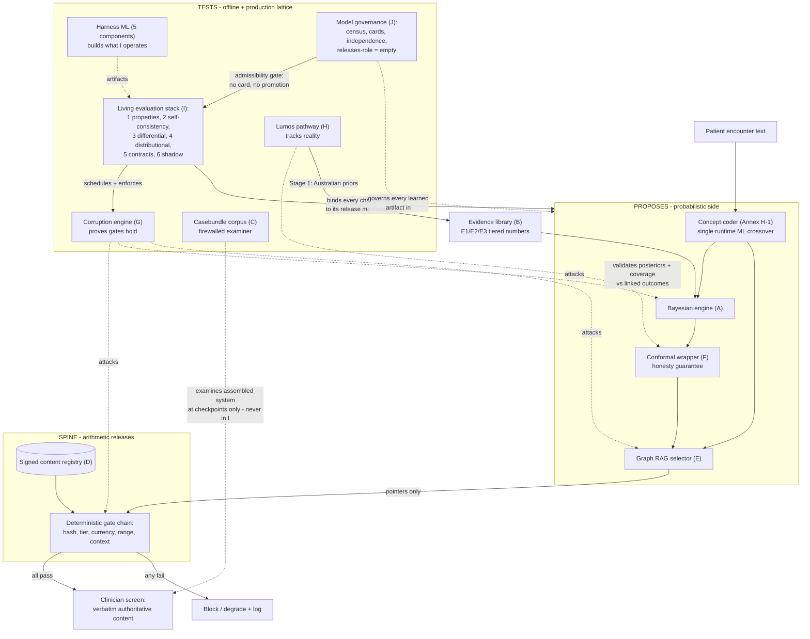
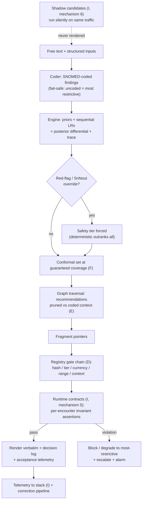
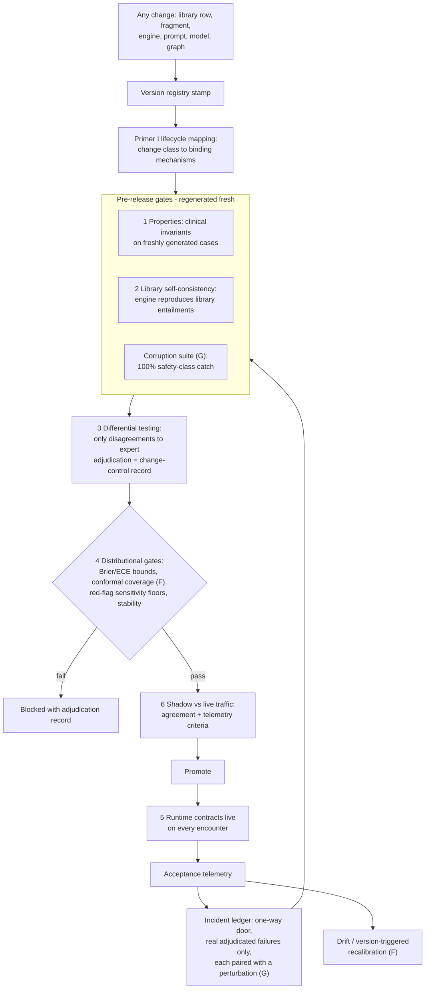
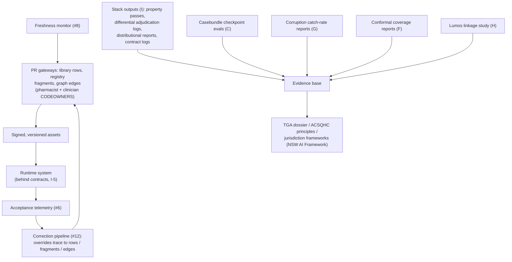
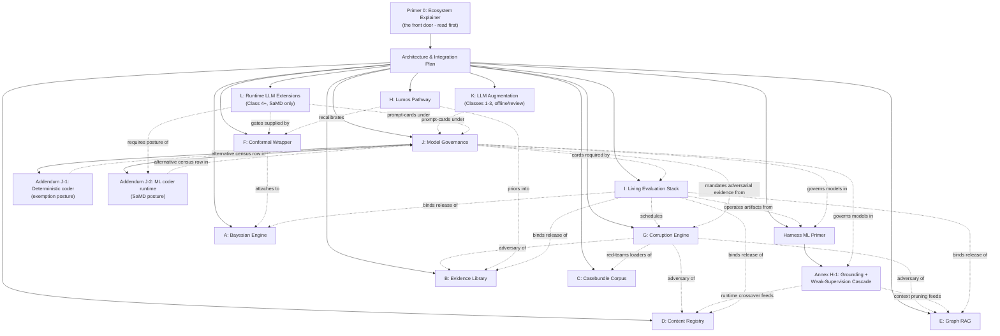
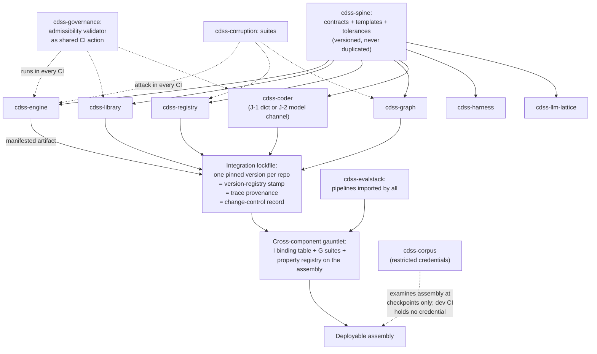
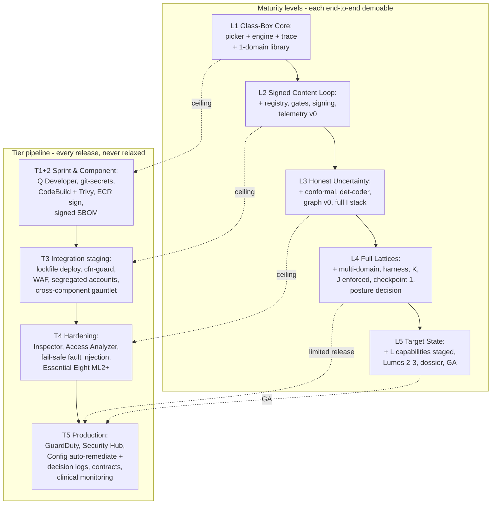
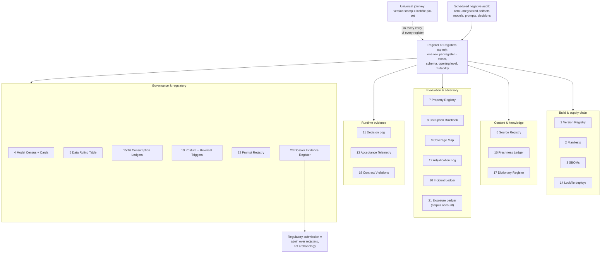

# Architecture & Integration Plan
### The spine, its three attachments, the living evaluation lattice, and how the components assemble

## 1. The spine

The architecture is not a collection of tools with a doctrine attached — the doctrine *is* the architecture:

> **ML proposes and tests; only arithmetic releases.**

Concretely, the spine is two things welded together: the **deterministic release path** (hash match → tier policy → currency dates → dose-in-range → context policy; every gate a same-input-same-answer check) and the **signed content registry** those gates check against. Everything probabilistic — the Bayesian engine, Graph RAG traversal, the concept coder, every harness model — sits on the *proposes-and-tests* side of that line. Nothing probabilistic ever stands between authoritative content and the screen.

Three attachments raise the spec of the spine rather than compete with it:

- **Conformal prediction (Primer F)** makes the probabilistic side *honest* — the proposer's output carries a mathematical coverage guarantee, not a hope.
- **The corruption engine (Primer G)** proves the deterministic side *holds* — every gate must catch 100% of manufactured safety-class violations, per release, forever.
- **The Lumos pathway (Primer H)** shows the whole assembly *tracks reality* — the one validation source connecting Australian GP presentations to real outcomes.

And one lattice runs the length of the spine: the **living evaluation stack (Primer I)** — the six-mechanism replacement for archival golden-case regression. Properties (1) + library self-consistency (2) as pre-release gates; differential testing (3) as the change-review mechanism; distributional metrics (4) as the release criterion; runtime contracts (5) + shadow evaluation (6) as the production layer. Every mechanism regenerates from living sources — library, properties, traffic — so nothing fossilises; the incident ledger is the single sanctioned archival exception, grown only from real adjudicated failures and paired case-for-case with corruption-engine perturbations.

A second lattice runs beside it: the **model governance contract (Primer J)** — I governs *changes*, J governs *learned artifacts*. A third governs language models specifically: **Primer K** disciplines LLM use everywhere the regulator never looks (offline authoring, harness enrichment, review assistance — twenty points, no classification impact, every proposer with a named verifier), and **Primer L** specifies the frontier that the SaMD posture purchases — nine runtime LLM capabilities (elicitation, narration, sentinel, critic, composer, intake, counterfactual exploration) each consumed by deterministic checks or human confirmation, each a separable dossier line-item. Every model in the system carries a signed card (pinned identity, licence-clean training manifest, independence-sourced scorecard with mandatory corruption-adversarial evidence, declared fail-safes, named I-mechanism bindings), may propose and test different things but never verify anything whose errors it is positioned to share, and the *releases* role is verified empty — which is the doctrine restated as an auditable invariant.

## 2. System architecture diagram



## 3. Runtime release path (per encounter)



## 4. The living evaluation stack (per change, per release)



## 5. Governance & evidence loops



## 6. Document map



## 7. Sequencing (what the spine implies about order)

The spine and the lattice together dictate the order: **registry schema + gate chain first** (the spine must exist before anything attaches); **living evaluation stack mechanisms 1–4 stood up alongside the first engine build** — they are not a later addition; they *are* the test infrastructure that would otherwise have been written as a frozen suite; **corruption engine second-parallel** (nothing goes live unattacked, and the stack schedules it); **coder + engine + library flowing third** with every change already passing through the stack; **conformal wrapper** as soon as the calibration machinery is proven external; **mechanism 5 (contracts)** ships with the first registry render and **mechanism 6 (shadow)** activates at first live traffic; **Graph RAG** once one registry domain is deep enough to traverse; **Lumos Stage 1 immediately in parallel** (library data-entry, not engineering). The casebundle corpus authors continuously and is touched only at checkpoints — the stack's existence is what makes that discipline cheap to keep, because the dev loop never lacks a legitimate test to run. The model governance contract (J) stands up with the first trained artifact — census registration precedes the first training run, so licence class is checked before data is consumed. Every fold-in in every primer is an artifact crossing a contract; the moment any proposal shares a data store, loads an EVAL-tagged asset, releases a change through no stack mechanism, runs a model without a card, or operates an LLM proposer without a named verifier (K/L), it is by definition off-plan.

## 8. Execution-layer index

Each component document now closes with an **Execution layer** section carrying its schemas, worked examples, and proposed numbers — the sprint-ready material beneath the strategy. The load-bearing artifacts and their authoritative homes: engine trace schema, API and first properties (A8); library validator invariants, worked row, review-budget arithmetic (B8); EVAL tag, loader refusal, exposure ledger, checkpoint protocol (C8); fragment schema, OPA gate policy, CODEOWNERS, decision log (D8); node/edge table, worked traversals, determinism test (E8); nonconformity choices, stratum minimums, exchangeability protocol (F8); **the starter meaning-boundary rulebook, 18 perturbation rows ready for clinician red-pen (G8)**; Lumos extraction targets, pre-registration endpoints, governance timeline with durations (H8); **the change-class × mechanism binding table, 20 seeded properties, authoritative tolerances, incident-ledger schema (I8)**; model-card template, seeded census, dataset ruling table (J8); coder API, artifact manifest, silo exit criteria (Harness §8); LF spec and linker gold-standard protocol (Annex §8); prompt-card template, injection rulebook rows, flagship point-specs (K8); the VOI selector and realisation contracts for engine-chosen/LLM-spoken dialogue (L8). Where the same numbers appear twice (A8/I8 tolerances), I8 is the authoritative copy and says so. All proposed clinical numbers are flagged for sign-off — they are starting positions, not decisions.

## 9. The runtime-coder fork (Variants 1b and 2)

One census row carries the system's entire regulatory posture: whether findings are coded at runtime by a deterministic dictionary-and-rules artifact or by the ML coder. Two fully specified variants exist as Addenda J-1 and J-2 to Primer J, sharing everything else in this set:

- **Variant 1b — deterministic runtime coder (exemption posture):** no learned artifact at inference; MedCAT mines dictionaries offline; dictionary releases become a Primer I change class; designed to meet all three TGA exempt-CDSS criteria under the strictest glass-box reading. Trade: recall/abstention ceiling, monitored as the pre-registered trigger to reconsider.
- **Variant 2 — ML coder at runtime (SaMD posture):** frozen MedCAT/MetaCAT live, clinician confirmation step on coded findings, full dossier mapping from the existing evidence stack; accepts ARTG inclusion and conformity assessment. Trade: regulatory overhead and permanent in-clinic monitoring, with the confirmation-step correction rate as the pre-registered trigger to reconsider.

Both variants keep the doctrine intact — in 1b it is applied one level deeper (*the ML proposes dictionary entries; only string-matching runs live*); in 2 the single crossover stands, consumed by deterministic checks as always. Downstream of coding, the two runtimes are identical, so the fork is reversible in either direction at the cost of the coder layer alone — which is precisely why it was isolated as a single census row in the first place.

## 10. Repository topology

The build structure is the document map made literal: one repository per primer plus a spine repository, combined through version pins rather than merges. The governing rule restated for repos: **every fold-in is an artifact crossing a contract, never a shared data store** — so combination later is a lockfile, not a migration.

**The spine repo (`cdss-spine`)** holds the architecture document and, critically, every **shared contract**: coded-finding schema, fragment schema (with dose-bounds block), trace schema, artifact manifest format, model-card and prompt-card templates, EVAL/DEV provenance tag spec, and the metric-tolerance configuration (I8's authoritative numbers). Contracts live here once, versioned; component repos consume `cdss-spine@vX` as a pinned dependency. A contract change is a spine PR that visibly breaks consumers in CI — differential-testing philosophy applied to interfaces. Nothing is duplicated into component repos, ever; duplication is where drift begins.

**Repository list and what each emits:**

| Repo | Primer | Emits (via manifest) | Isolation note |
|---|---|---|---|
| `cdss-spine` | Architecture | contracts, templates, tolerances | consumed by all |
| `cdss-engine` | A | stateless compute container + trace emitter | no clinical numbers of its own |
| `cdss-library` | B | versioned data releases + validator | answers to sources, never scores |
| `cdss-corpus` | C | checkpoint results (aggregate) only | **separate repo + restricted credentials = the firewall enforced by permissions; dev-side CI holds no credential for it** |
| `cdss-registry` | D | signed fragment bundles + OPA policy | signing keys never leave |
| `cdss-graph` | E | deterministic graph builds (hashable) | rebuild = f(registry version) |
| `cdss-conformal` | F | wrapper library + calibration reports | pure math, no data retained |
| `cdss-corruption` | G | suites as data + rulebook | rulebook clinician-reviewable in isolation |
| `cdss-lumos` | H | protocol, SAP, extraction rows | **no data ever enters this repo** |
| `cdss-evalstack` | I | pipeline/CI definitions others import | operates, does not author |
| `cdss-governance` | J | admissibility validator (shared CI action), census | runs in every repo's CI |
| `cdss-coder` | J-1/J-2 | det-coder + dictionary, or ml-coder container | the fork is this repo's release channel choice |
| `cdss-harness` | Harness/H-1 | coder learners, checker, cascade tooling | EVAL-refusing loaders proven here |
| `cdss-llm-lattice` | K/L | prompt registry, orchestration, L capability services | prompt changes are I events |

**Combination:** an **integration repo** (or the spine itself) carries the lockfile — e.g. `engine 1.4.0 + library 2026.08.1 + dictionary 0.7 + policy 12 + graph g-2026.08 + conformal c-2026-07` — and runs the cross-component gauntlet on any pin change: I's binding table, G's cross-cutting suites, the property registry against the assembled system. That lockfile is the same artifact as the version-registry stamp in every trace (tool #7): one object serving build reproducibility, runtime provenance, and dossier change-control simultaneously.

**Pin-flow diagram:**



**Pragmatic phasing:** for a small-team phase, three repos are load-bearing from day one — `cdss-spine` (contracts must never fork), `cdss-corpus` (the firewall is a permission boundary), and `cdss-registry` (key custody) — while the remaining components may begin as folders in one working repo *provided the manifest discipline is observed anyway*, splitting out as they mature. The repo count can grow with the team; the contracts-in-spine rule cannot wait.

## 11. Production topology — phased tiers and maturity levels

Two orthogonal ladders govern production. The **tier pipeline** is the security-and-compliance gauntlet every release of every level passes through (adapted from the five-tier AWS blueprint, Tiers 1–2 grouped). The **maturity levels** are five progressively complete versions of the product, each a workable end-to-end system in its own right — the step-wise path from working prototype to full target state. Levels climb the tiers as they mature; the tiers never relax as levels advance.

### 11.1 The tier pipeline (AWS, ap-southeast-2 for data residency)

**Tier 1+2 — Sprint & Component (local, commit, CodeBuild).** Amazon Q Developer in IDEs; `git-secrets` pre-commit; mandatory PR templates carrying the SOC 2 CC7.1 change-management fields — which in this architecture are *already* the Primer I adjudication records and J/K cards, so compliance is a by-product, not a parallel process. CodeBuild runs each repo's own gauntlet (validator, G suite, properties) plus Trivy scans; ECR scan-on-push with image signing; signed SBOM (Syft/CycloneDX) per artifact manifest, meeting NIST SP 800-161/SSDF supply-chain expectations — the SBOM simply joins the manifest fields the harness already mandates.

**Tier 3 — Integration staging (CodePipeline).** The integration repo's lockfile drives deployment of the assembled system to an isolated staging VPC; CloudFormation Guard / cdk-nag validate IaC pre-deploy; WAF fronts staging services; the cross-component gauntlet (I bindings, G cross-suites, property registry on the assembly) runs here as the pipeline's functional gate alongside the security one. ISO 27001:2022 A.8.20 segregation is enforced structurally: separate accounts per environment under AWS Organizations, no network path staging→production, verified by automated reachability analysis.

**Tier 4 — Hardening (pre-prod, production clone).** Amazon Inspector scans; IAM Access Analyzer with zero-tolerance on public/cross-account findings; fault-injection of every declared fail-safe (coder abstention, gate outage, LLM timeout) — the J-card fail-safe declarations become the pen-test script. One correction to the source blueprint: **PCI-DSS v4.0 is not the apt yardstick here** (no cardholder data in scope); the equivalent-rigour substitutes for an Australian clinical SaMD are the **ACSC Essential Eight at Maturity Level 2+**, **ISO 27001 Annex A** technical controls, the **TGA Essential Principles cybersecurity guidance**, and **Privacy Act APP 11** security-of-information obligations. SOC 2 Type II remains for enterprise/PHN customers; HIPAA/GDPR mappings only if and when offshore markets are pursued.

**Tier 5 — Production (live).** GuardDuty, Security Hub (single pane, AWS Foundational Security Best Practices standard as the continuous evidence feed), AWS Config with conformance packs and auto-remediation; CloudTrail organisation trail as the immutable audit spine. Clinical-runtime additions the blueprint doesn't know about but this architecture requires: the decision-log stream (D8), contract-violation alarms (I-5), and in-clinic model monitoring (J-2/L) are first-class production telemetry beside the security feeds — Security Hub watches the infrastructure; the living evaluation stack watches the clinical behaviour.

### 11.2 The five maturity levels

Each level is end-to-end demoable, ships through the full tier pipeline available to it, and is the reduced-functionality product of everything below it — no level borrows from a component that hasn't formally entered.

**Level 1 — Glass-Box Core** *(tier ceiling: 1+2; single dev/staging account).* One clinical domain (adult respiratory as the worked exemplar). Structured SNOMED picker input only — no coder of any kind. Components live: engine (A) with trace + red-flag overrides; library (B) single-domain with validator; properties + self-consistency (I-1/2) in CI; G v0 attacking the validator and engine. **Demo:** pick findings → ranked differential + safety tier + fully replayable trace. **Exit:** zero safety-property violations; trace replay byte-identical; library E3 count baselined.

**Level 2 — Signed Content Loop** *(tier ceiling: 3).* Adds the spine made real: registry (D) single-domain with fragment schema, dose bounds, PR gateway, OPA gate chain, signing (KMS/cosign); verbatim render; decision logs; freshness monitor; acceptance telemetry v0 (accept/modify/reject). G suite vs gates at 100% becomes a hard CI gate. **Demo:** differential → relevant guideline/dose fragment rendered verbatim through all five gates, with the decision log shown. **Exit:** 100% corruption catch sustained across three consecutive releases; first differential-testing adjudication of a real source delta completed.

**Level 3 — Honest Uncertainty + Coded Intake** *(tier ceiling: 4).* Adds F (conformal wrapper, machinery proven on DDXPlus first, then internal calibration slice), the J-1 det-coder (free text → chips with picker fallback; dictionary as signed content), and Graph RAG v0 (first-line + contraindication + supersession edges, one domain, deterministic rebuild). Full I stack operating: differential testing, distributional gates, shadow mode plumbing, runtime contracts. **Demo:** free-text presentation → coded chips → conformal set with stated coverage → contraindication-pruned recommendation → gated render. This is the **first externally showable clinical prototype** — everything a pilot clinician touches is present in reduced scope. **Exit:** coverage within tolerance on both external and internal data; abstention+picker-correction rate baselined against the pre-registered J-1 ceiling; graph rebuild determinism proven.

**Level 4 — Full Lattices at Scale** *(tier ceiling: 5, limited release).* Breadth and governance: multi-domain library/registry/graph; full harness online (checker in reviewer-assist mode, cascade producing training sets); Primer K flagship points active (K3.2 dose-bounds extraction, K2.4 pre-annotation, K2.7 semantic corruptions) with prompt-cards; J census + admissibility validator enforced in every repo's CI; incident ledger live; **first formal casebundle checkpoint (C)** against a frozen version; Lumos Stage 1 rows in the library; posture decision (J-1 vs J-2) executed on the Level-3 abstention evidence. **Demo:** the reviewer's day — LLM-assisted fragment queue, delta adjudication, checkpoint aggregate report — alongside the clinical flow. **Exit:** checkpoint metrics meet pre-set floors; exposure ledger opened; census provably total; limited pilot (named practices) under Tier-5 monitoring.

**Level 5 — Target State** *(tier ceiling: 5, general availability).* The posture's full expression: under J-2, Primer L capabilities staged per L5's five stages (narration + counterfactual explorer first, elicitation flagship later, intake last); Lumos Stage 2 governance underway with Stage 3 scheduled against a named freeze; complete dossier assembly from the evidence streams that have been accumulating since Level 1; multi-region DR posture; the negative audits (releases-role empty, no card-less model, no verifier-less proposer, no frozen dev test set but the ledger) running as scheduled jobs. **Demo:** the full consult — dialogue-elicited history (engine-chosen/LLM-spoken), confirmed chips, conformal set, critic challenge, gated content, provenance-locked letter — with the audit trail for every element one click away. **Exit is the programme's definition of done.**

### 11.3 Level × capability matrix (what enters when)

| Capability | L1 | L2 | L3 | L4 | L5 |
|---|---|---|---|---|---|
| Engine + trace + overrides (A) | ● | ● | ● | ● | ● |
| Library (B) | 1 domain | 1 domain | 1 domain | multi | full |
| Registry + gates (D) | — | ● | ● | multi | full |
| Conformal (F) | — | — | ● | ● | ● |
| Coder | picker only | picker | det-coder (J-1) | posture decision | per posture |
| Graph RAG (E) | — | — | v0 | multi | full |
| Eval stack (I) | 1,2 | +3, G-gate | full | full | full |
| Corruption engine (G) | v0 | gates 100% | +graph rows | +injection/K rows | +runtime-LLM rows |
| Harness/cascade (H-1) | — | — | gold standard | full | full |
| Corpus checkpoints (C) | — | — | — | first | scheduled |
| K lattice | — | — | — | flagships | full |
| L capabilities | — | — | — | — | staged |
| Lumos (H) | — | — | — | Stage 1 | Stage 2→3 |
| Governance (J) | manifests | +cards | +validator | enforced | audited |

### 11.4 AWS reference mapping (indicative, ap-southeast-2)

Engine/conformal/coder: ECS Fargate stateless services (Lambda acceptable at L1–2 scale). Registry artifacts: S3 (versioned, object-lock) + KMS signing + cosign; policy via OPA sidecar (or Verified Permissions/Cedar if preferred managed). Graph: Aurora PostgreSQL at L3 scale, Neptune when multi-domain traversal load justifies it. Decision logs/telemetry: Kinesis → S3 + Athena; dashboards QuickSight. Harness/K/L LLM calls: Amazon Bedrock via PrivateLink, no public egress, prompts from the signed registry. CI/CD: CodeBuild/CodePipeline per §11.1; artifacts in ECR with scan+sign. Accounts: Organizations with per-environment and per-sensitivity separation — the corpus repo/store lives in its own account, which is the firewall as an account boundary. All indicative: service choices are Primer-I-changeable configuration, not architecture.

### 11.5 Production topology diagram



## 12. Register topology — the register of registers

Production at every level and in every repository is tracked through named registers (28 as of the Ecosystem-v2.0 ratification; R25–R28 entered by ratification recorded in the Integration Report). The principle, stated as law: **if it is not in a register, it did not happen** — every artifact, decision, exposure, incident, and release is an entry somewhere, keyed by the version stamp, so any regulator or engineer answers any "what/when/who/under-what-version" question by query, not archaeology. The **Register of Registers (RoR)** lives in `cdss-spine` and is itself versioned: one row per register, carrying owner, schema reference, opening level, and mutability class.

### 12.1 Register laws

1. **Ownership:** every register has exactly one owning repo; its schema lives in `cdss-spine`, never duplicated.
2. **Mutability declared and enforced:** each register is either *append-only* (S3 object-lock / one-way doors — ledgers of events that happened) or *versioned* (PR-governed configuration — registries of what currently holds). No third class exists.
3. **Opening level:** each register names the maturity level (§11.2) at which it must be open and populated — and a level's exit criteria include its registers opened. An unopened register at its level is a release blocker.
4. **The universal join key:** the version stamp (lockfile pin-set) appears in every entry of every register — build reproducibility, runtime provenance, change control, and dossier citation are the same key used four ways.
5. **The negative audit:** a scheduled RoR reconciliation job proves no untracked artifact, model, prompt, fragment, or decision path exists outside its register — the same audit pattern as J's census-totality and the doctrine's releases-role-empty checks, generalised.
6. **Registers are dossier feedstock:** the Dossier Evidence Register maps every register to the submission sections it substantiates, so regulatory assembly is a join, not a project.

### 12.2 The master register table

| # | Register | Owner repo | Opens | Mutability | Written by | Primary readers |
|---|---|---|---|---|---|---|
| 1 | Version Registry (tool #7) | spine | L1 | versioned | every release | all; every trace |
| 2 | Artifact Manifest Register | spine | L1 | append | every silo emit | loaders, CI |
| 3 | SBOM Register (T1+2) | per repo CI | L1 | append | every build | supply-chain audit |
| 4 | Model Census + Cards (J) | governance | L1 manifests / L2 cards | versioned | J validator flow | every repo CI |
| 5 | Training-Data Ruling Table (J8) | governance | L1 | versioned | owner + counsel | all training pipelines |
| 6 | Source Registry (B / evidence pass) | library | L1 | versioned | citation verification | validator, freshness |
| 7 | Property Registry (I) | evalstack | L1 | versioned | clinical review | all pre-release CI |
| 8 | Corruption Rulebook (G) | corruption | L1 v0 | versioned | clinician sign-off | suite generator |
| 9 | Coverage Map (C) | corpus | L1 | versioned | authoring role | checkpoint planning |
| 10 | Freshness Ledger (B/#8) | library | L2 | versioned | monitor jobs | review queue |
| 11 | Decision Log (D8) | registry runtime | L2 | append (object-lock) | every render attempt | telemetry, audit |
| 12 | Adjudication Log (I-3) | evalstack | L2 | append | expert adjudication | change control, dossier |
| 13 | Acceptance Telemetry Register (#6) | runtime | L2 v0 | append | clinician actions | correction pipeline (#12) |
| 14 | Integration Lockfile Register | integration | L2 | append | pipeline deploys | rollback, provenance |
| 15 | Calibration-Slice Consumption Ledger (F) | conformal | L3 | append | recalibration events | F refresh law |
| 16 | Gold-Asset Consumption Ledgers (Annex/J) | harness | L3 | append | tuning exposures | refresh triggers |
| 17 | Dictionary Register (J-1) | coder | L3 | versioned + signed | mining PRs | det-coder builds |
| 18 | Contract-Violation Log (I-5) | runtime | L3 | append | runtime assertions | alarms, dossier |
| 19 | Posture & Reversal-Trigger Register | spine | L3 baseline / L4 decision | append | fork decision, trigger arming | governance, board |
| 20 | Incident Ledger (I8) | evalstack | L4 | append, one-way | adjudicated failures | all suites; G pairing |
| 21 | Exposure Ledger (C8) | corpus (own account) | L4 | append | evaluation role only | checkpoint planning |
| 22 | Prompt Registry + Cards (K8) | llm-lattice | L4 | versioned | prompt PRs | K/L pipelines, I |
| 23 | Dossier Evidence Register | governance | L4 | versioned | regulatory owner | submission assembly |
| 24 | RoR (this table) | spine | L1 | versioned | architecture owner | the negative audit |
| 25 | Build Evidence & Assumptions Ledger *(ratified from Ecosystem §13.4)* | spine | L1 | versioned | recon + IMPL reports | all build CI |
| 26 | Build Work Register *(ratified from Ecosystem §13.4)* | spine | L1 | versioned | planning passes + Observer stubs | IMPL dispatch |
| 27 | Build Drift & Adjudication Register *(ratified from Ecosystem §13.4)* | spine | L2 | append-only | Observer only | planning, dossier |
| 28 | Checkpoint Aggregate Mirror *(ratified from GAP-C-001)* | spine | L4 | append-only mirror of R21 aggregates | corpus-account replication job | Observer, checkpoint planning |

Registers 1–9 plus 25–26 open with **L1** — a working prototype without its books open is off-plan from the first level. Runtime-fed ledgers (11, 13, 18) open with the level that creates their events. The corpus registers (9, 21) live inside the corpus account boundary with the same credential firewall as the cases themselves.

### 12.3 Phased and per-repo registration

**Per level:** each §11.2 level exit now formally includes a register check — L1: rows 1–9 open; L2: +10–14; L3: +15–19; L4: +20–23; L5: RoR negative audit running as a scheduled job with zero orphans. **Per repository:** every repo's CI carries two register duties on every merge — *write* (its manifest, SBOM, and any owned-register deltas) and *prove* (the J validator + RoR check that nothing it emits is unregistered). The register duties travel in the shared CI actions (`cdss-governance`), so a new repo inherits them by importing the pipeline, not by remembering.

### 12.4 Register topology diagram



<!-- ECOSYSTEM-V2-BLOCK: SPINE v1.0 -->
## 13. Build Execution Extension Index (Ecosystem v2.0)

*Doctrine classification: the validator, DoD evidence checks, and register reconciliations in this extension are arithmetic; the Observer, the Implementer Contract sessions, and every planning aid are propose/test. No mechanism introduced here releases clinical content.*

### 13.1 Global North Star Block (SPINE-NS-1)
| Element | Statement | Evidence |
|---|---|---|
| WHAT | The CDSS assembly: engine service, registry service + signed content bundles, graph build, coder artifact (posture per R19), conformal library, eval-stack pipelines — one deployable set pinned by the integration lockfile. | E:DOC Arch §10, §12.2 R14 |
| WHERE | AWS ap-southeast-2; per-environment AWS accounts under Organizations; corpus in its own account. | E:DOC Arch §11.1, §11.4 |
| WHO/WHEN | AHPRA-registered GPs during live consultations, from the L3 pilot onward. | E:DOC Primer 0 §1; ASSUME-SPINE-001 (pilot practices unnamed; risk-if-wrong: WHO/WHEN unverifiable at L4; verification path: pilot MoUs before L4 exit) |
| WHY (falsifiable) | Each release renders only gate-passing verbatim content, with conformal coverage inside I8 tolerance and zero uncaught safety-class corruptions. | E:DOC Primer I §I8 (numbers under their clinical sign-off flag; referenced, not restated) |
| DONE | L5 exit criteria met AND Lumos Stage-3 endpoints met against a named freeze. | E:DOC Arch §11.2; Primer H §H8 |

### 13.2 Rename notice
`coder_contract.md` is adopted under the name **Implementer Contract (IMPL)**. Rationale: "coder" is a reserved house term — the clinical concept coder, subject of the J-1/J-2 fork (Arch §9). All fourteen blocks use IMPL; the source file's content is unchanged, only its house name.

### 13.3 Namespace law
Ecosystem IDs are component-namespaced: `TASK-<PFX>-nnn`, `STORY-<PFX>-nnn`, `RECON-<PFX>-nnn`, `ASSUME-<PFX>-nnn`, `GAP-<PFX>-nnn`, `WF-<PFX>-n`, `EVT-<PFX>-n`, `DRIFT-<PFX>-n`, with PFX in {SPINE, A, B, C, D, E, F, G, H, I, J, K, L, HX}. Cross-references use full namespaced IDs. Declared here once per register law §12.1(1); schema file lands in `cdss-spine` on ratification of §13.4.

### 13.4 Register mapping (ecosystem ledgers → house registers)
| Ecosystem ledger | House home | Status |
|---|---|---|
| Evidence + Assumptions Ledgers (I10/I11; engineering claims only) | **Proposed R25 — Build Evidence & Assumptions Ledger** · owner `cdss-spine` · opens L1 · versioned · writers: recon/IMPL reports · readers: all build CI | **RATIFIED → R25** |
| Work Register (STORY/TASK tickets) | **Proposed R26 — Build Work Register** · owner `cdss-spine` · opens L1 · versioned · writers: planning passes + Observer stubs · readers: IMPL dispatch | **RATIFIED → R26** |
| Drift Register + Observer adjudications + GAP rows | **Proposed R27 — Build Drift & Adjudication Register** · owner `cdss-spine` · opens L2 (first lockfile deploy) · append-only · writer: Observer only · readers: planning, dossier | **RATIFIED → R27** |
| Milestones | Existing: maturity levels L1–L5 (Arch §11.2) — no new ledger | mapped |
| Kill criteria | Existing: R19 — the Observer becomes the named checker of armed triggers | mapped |
Clinical numbers remain solely under E1/E2/E3 and their sign-off flags; `E:*` tags ground engineering claims only. Negative-audit law §12.1(5) now extends to ecosystem IDs (R25–R27 ratified): an unregistered TASK or DRIFT is a finding.

### 13.5 Roadmap concordance (milestones = levels; Observer checkpoints attached)
| Level (exit per Arch §11.2) | Observer checkpoint verifies (build, not clinic) | Kill/reversal criterion (checker: Observer, via R19) |
|---|---|---|
| L1 | Registers R1–R9 open; trace replay byte-identical from CI evidence; zero safety-property violations in run logs | none armed |
| L2 | 100% corruption catch across 3 consecutive releases (R11/R12 evidence); first source-delta adjudication filed | catch below 100% twice consecutively → release train halts |
| L3 | Coverage-in-tolerance report filed (F); abstention+picker-correction baseline recorded in R19; graph rebuild hash equality | none — L3 produces the fork evidence |
| L4 | Posture decision recorded in R19 with trigger armed; census provably total (R4 vs repo scan); checkpoint-1 aggregates present | J-1 abstention ceiling or J-2 correction floor, as armed |
| L5 | RoR negative audit scheduled with zero orphans; Lumos Stage-3 scheduled against a named freeze (R1) | per-capability L reversal triggers (R19) |
Primer C checkpoints and Primer I mechanisms adjudicate the clinical system; the Observer adjudicates the build against this plan. Both run; neither substitutes.

### 13.6 Orchestration hooks
```yaml
WF-SPINE-1: # lockfile assembly
  steps:
    - pin: {timeout: 5m, retry: {max: 2, backoff: 30s..120s, jitter: 20pct}, idempotent: by pin-set hash}
    - cross_gauntlet: {timeout: 60m, retry: 1, idempotent: re-runnable, on_fail: no compensation — assembly never partially promotes}
    - sign_and_record: {timeout: 5m, retry: 2, idempotent: by content hash, writes: R14}
WF-SPINE-2: # spine contract release
  steps:
    - schema_diff_ci: {timeout: 15m, retry: 1, idempotent: yes, effect: consumer CI breaks visibly per Arch §10}
EVT-SPINE-1: {name: lockfile.pinned, schema: pin-set + hash, producer: WF-SPINE-1, consumers: [deploy, R14, trace stamping], delivery: at-least-once, dedup: content hash}
```

### 13.7 Observer instantiation (CDSS-specific)
Admissible evidence: registers R1–R24 plus proposed R25–R27; CI artifacts; checkpoint aggregate results; deployment records. Prohibitions: the Observer never holds EVAL credentials, never reads casebundle content, and rules from R21/R9 aggregate rows only; an adjudication that touched corpus content is void. Cadence: one adjudication per level exit plus a standing quarterly review from L4; each adjudication names its successor date and required evidence (protocol: `observer_adjudication.md`).

### 13.8 Validator wiring
`validate_build_plan.py` (stdlib, deterministic — doctrine-side: arithmetic) runs in `cdss-spine` CI on every change to any ECOSYSTEM-V2 block, applying its fragment-applicable checks: V13 lexicon, V12 purpose chains, V8 ranged estimates, ID resolution. It is the planning-artifact sibling of the library validator (B8) and shares the corruption engine's philosophy: manufactured violations prove the gate (G8 rows 23–25 seed its fixtures).

### 13.9 Extension index
Component blocks: A→§A9 · B→§B9 · C→§C9 · D→§D9 · E→§E9 · F→§F9 · G→§G9 · H→§H9 · I→§I9 · J→§J10 · K→§K9 · L→§L9 · Harness→§9 (HX) · Annex→§9 (HX pointer). Primer 0 is exempt by charter and carries one pointer sentence only.

<!-- MET-1 METAMORPHOSIS ANNEX — APPENDED 2026-09-01. Pure append; zero edits to pre-existing text. -->
## 14. Metamorphosis Extension (MET-1 pass — Mākoha Butterfly integration + MT2 hardening)

*Doctrine classification: every mechanism this extension proposes on the release path is arithmetic (argument-tree evaluation over the existing gate chain); the fabric's authoring aids, the compiler's LLM-assist points, and the hardening pass are propose/test. Status of this entire section: **Proposed** — ratification queue in MET-2 (DEC-01..DEC-10).*

### 14.1 Nomenclature ruling (resolves conflict C-02, proposed)
House prose distinguishes **"the release spine"** (this document's §1 mechanism: deterministic release path + signed registry) from **"SPINE-n"** (MAK-FFC fabric requirement IDs). SPINE-7 (MAK-FFC) restates §1's doctrine verbatim; the release spine is the fabric's deterministic evaluator made concrete. No substantive conflict; the glossary rows land in Primer 0 §11.

### 14.2 Repository topology additions (amends §10 table — Proposed)
| Repo | Emits (via manifest) | Isolation note |
|---|---|---|
| `cdss-fabric` | fabric service + compliance projector + deviation machinery | argument/deviation schemas live in `cdss-spine`, never here; ledger substrate per DEC-04 |
| `cdss-compiler` | GenericArgument bundles compiled from CQL / FHIR-CPG / WHO SMART sources | outputs enter through the registry PR gateway (pharmacist + clinician CODEOWNERS), same as fragments |
| `cdss-ui-clinician` | Labial-Palps component library + clinician face | MAK-LBP conformance suite = CI acceptance tests |
| `cdss-ui-patient` | Proboscis component library + patient face | scope beyond intake/consent/logistics **Blocked** on ASSUME-REG-003 |
| *(channel, not repo)* GPP | J-3 build artifact | a release channel of the integration repo, mirroring the coder fork's channel pattern; GPP-14: crossing the capability boundary is a new device |

New shared contracts entering `cdss-spine`: ActualArgument/GenericArgument schema; Deviation object schema; register-render contract (SPINE-3 invariance, testable); FML artifact spec (**dormant until FZ-2 ratifies**); GPP profile stamp (`profile: GPP`). Specs: `05_registers-and-contracts/`.

### 14.3 Register additions (amends §12.2 via the §13.4 ratification mechanism — Proposed)
| # | Register | Owner | Opens | Mutability | Written by | Primary readers |
|---|---|---|---|---|---|---|
| R29 | Hardening Coverage Ledger (MT2) | spine | pre-L1 (immediately) | append-only | hardening pass only | operator, all build CI |
| R30 | Regulatory Posture Register | governance | L1 | versioned | regulatory owner + external attestations | R19/R23 joins, dossier |
Register laws §12.1 apply unchanged; the negative audit extends to REG-* and hardening-row IDs on ratification.

### 14.4 Namespace law extension (amends §13.3 — Proposed)
PFX set gains {FAB, UIC, UIP, GPP}. MAK requirement IDs (SPINE-n, CF/PF/AF/EN/XC, FZ-n, GPP-n, HW/TW/AL…, PV/CV…, LS/L1..L6, AN, REG-*) resolve in their owning Mākoha volume per its MANIFEST; they are cited, never re-minted here.

### 14.5 Level × capability matrix — additional rows (amends §11.3 — Proposed)
| Capability | L1 | L2 | L3 | L4 | L5 |
|---|---|---|---|---|---|
| Fabric (argument schema + evaluator wrap) | v0 schema | evaluator wrap live | deviation composer | compliance projector | full |
| Guideline Compiler (EN-3 lift) | — | — | v0 (ADOPT stack) | multi-domain | full |
| Clinician face + UI (MAK-HDC/LBP) | — | v0 (verbatim render surface) | one-surface law | team modes | full |
| Patient face + UI (MAK-TXC/PRB) | — | — | intake/consent subset¹ | per ASSUME-REG-003 | per posture |
| Auditor face (MAK-ABC) | — | — | read model v0 | review workflows | external projection |
| Fuzzy layer (FZ-1..6) | — | — | — | per DEC-05 ratification | per DEC-05 |
| GPP artifact (J-3) | — | — | — | first release² | maintained reserve |
¹ the J-3-safe subset only. ² Needs confirmation — J-3 is v0.9-proposed.

### 14.6 Regulatory concordance (levels × REG-POSTURE gates)
GATE-000 (counsel opinion) blocks regulated-tooling configuration but not L1 synthetic-scope engineering; GATE-001 lands with Phase-1 foundation beside L1/L2; GATE-002 is the identifiable-data line and must precede any non-synthetic input at any level (REG-KEEP-004); GATE-003 evidence accumulates through L3–L4; GATE-004 (ARTG inclusion) joins L5's definition of done. §11.4's Bedrock line carries conflict flag C-03 (Baseten Sydney per REG-POSTURE §5.1) — an infrastructure decision under Primer-I change control, **ESCALATED** (DEC-03).

### 14.7 MT2 wiring
`validate_build_plan.py` gains a sibling duty on ratification: R29 row-completeness check on every merge touching an instruction-bearing artifact (the CI ratchet, directive §7(4)). The hardening pass itself: spec `04_hardening/HARDEN-2`, worklist `HARDEN-3`, ledger seed `HARDEN-1` — **not yet executed; row zero Blocked** pending engine installation evidence.
