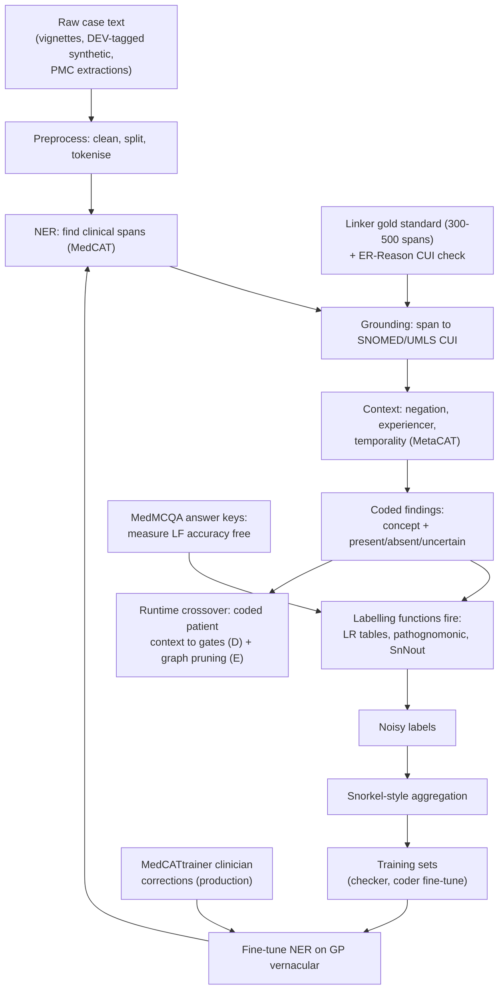

# Annex H-1 — Tool #18 and the Positive Cascade
### Terminology grounding, weak supervision, and the datasets and tooling that make them work

> **Architecture spine.** The project's spine is the deterministic-release doctrine plus the signed content registry: *ML proposes and tests; only arithmetic releases* — with conformal prediction (F), the corruption engine (G) and the Lumos pathway (H) as its three attachments. Everything in this annex sits on the proposes-and-tests side; its artifacts are exercised by the living evaluation stack (Primer I) and carry model cards under the governance contract (Primer J).
>
> **Position in the document set.** Implementation annex to the **Harness ML Primer**: the design spec for harness component 1 (concept coding service — §1, §2, §5 here) and component 4 (weak-supervision cascade — §3, §4). §6 expands the harness silo build order, steps 1–4 and 6. Cross-references: the coded-finding format defined here is the **Bayesian engine's** (Primer A) entire input contract; the labelling functions are **evidence library** (Primer B) rows made executable — one-way consumption, cascade results never tune library numbers; the runtime context coding feeds **Graph RAG** (Primer E) contraindication pruning and the **registry's** (Primer D) context gates — the single runtime ML crossover, fail-safe per those primers. The **casebundle corpus** (Primer C) is never an input to anything in this annex. Lattice relations: the cascade trains the entailment checker whose mandatory hard negatives come from the **corruption engine** (Primer G); every model this annex produces carries a card under **Primer J** and promotes only through **Primer I** mechanisms; the coder it ships feeds the engine whose honesty layer is the **conformal wrapper** (Primer F).

---

## 1. The core problem: rules live in concept space, text lives in lexical space

The labelling functions available to this project — LR table rows, pathognomonic rules, SnNout logic — are written against *concepts*. An LR row says "fever present → LR+ 2.1 for X"; a SnNout rule says "no dyspnoea → rules out Y." They reference fever and dyspnoea as clinical ideas, not as strings.

The case text those rules need to fire on lives in *lexical space*: "febrile," "T 38.4°C," "hot and sweaty overnight," "denies feeling feverish," "SOB," "puffed walking to the letterbox," "dyspnoeic." A labelling function written as a string match on "fever" misses most of these surface forms and — worse — fires wrongly on "denies fever."

**NER + terminology grounding (tool #18) is the bridge.** It converts raw text into the same concept vocabulary the rules are written in: every surface variant of shortness-of-breath resolves to one SNOMED/UMLS concept, and negation and uncertainty are detected ("denies fever" → fever: *absent* — which is itself evidence for SnNout logic, not noise). Only then can the LR tables and pathognomonic rules execute mechanically over the normalised output.

ER-Reason demonstrates the pattern at benchmark scale: it maps concepts in both model outputs and physician gold rationales to UMLS CUIs spanning ICD, SNOMED CT, RxNorm and LOINC, so lexical variants like "CAD" and "Coronary Artery Disease" resolve to the same concept. That normalisation step is exactly what lets a single rule cover every lexical variant. In this stack the target vocabulary is SNOMED CT (already connected), plus a negation/context layer — NegEx/ConText-style, available off the shelf in ScispaCy/medspaCy.

---

## 2. Anatomy of the NLP coding pipeline

Tool #18 is two stations on a longer assembly line. The full **NLP coding pipeline** takes raw clinical text ("puffed walking to the letterbox, denies chest pain, ex-smoker") and produces structured, coded data the engine can compute on:

1. **Preprocessing** — cleaning, sentence splitting, tokenising
2. **NER** — finding the clinically meaningful spans
3. **Terminology grounding** — mapping each span to a code
4. **Context detection** — negation, uncertainty, experiencer, timing ("denies chest pain" → chest pain, *absent*; "mother had breast cancer" → family history, not patient)
5. **Relation/attribute extraction** — linking severity, duration, laterality to the right finding
6. **Output assembly** — the final structured record, e.g. `SNOMED 267036007 (dyspnoea): present, on exertion`, fed to the LR tables

**NER (step 2)** locates and classifies spans — it draws boxes. "Puffed walking to the letterbox" is a SYMPTOM mention; "ex-smoker" is a RISK-FACTOR mention. It says *there's a finding here and what kind*, but not *which* finding in any formal sense.

**Terminology grounding (step 3)** resolves each box to a canonical concept: the boxed phrase → SNOMED CT *dyspnoea on exertion*; "SOB," "breathless," "puffed" all → the same code. This is the step the rules engine actually depends on, because the LR tables are written against concepts, not phrases.

Analogy: NER is highlighting the important words in a document; grounding is looking each highlighted word up in the official dictionary and writing its catalogue number in the margin; the pipeline is the entire clerk's job from receiving the letter to filing the index card.

**Why the distinction matters in practice** — the steps fail differently and are fixed differently:

- NER failures are *misses* (didn't spot the symptom mention at all) — fixed by fine-tuning on vernacular text.
- Grounding failures are *mis-links* (spotted "cold" but mapped the illness to the temperature concept) — fixed by better disambiguation plus a small gold-standard eval of the linker.
- Step 4 (context/negation) is where silent label poisoning lives: a pipeline with perfect NER and grounding but no negation handling will confidently code "denies fever" as fever-present.

When a vendor says "our NLP codes clinical notes," the quality questions are always about steps 3 and 4 — step 2 is largely commoditised.

---

## 3. The positive cascade: weak supervision

**Weak supervision / programmatic labelling (Snorkel-style)** is the force multiplier. The project's LR tables, pathognomonic rules and SnNout logic are exactly the kind of labelling functions (LFs) weak supervision consumes, generating large noisy-labelled training sets from unlabelled case text without archival annotation projects — directly serving the "no long archival periods" constraint.

The full cascade:

> **raw case text → NER/grounding → concept-level findings (present/absent/uncertain) → labelling functions fire → noisy labels → Snorkel-style aggregation → training set**

Grounding is the dependency that makes this work at all. Without it, the LFs have low coverage (miss paraphrases) and low precision (fire on negations) — and weak supervision degrades roughly in proportion to LF quality, so the whole force-multiplier collapses back to string-matching brittleness.

**Two nuances to hold onto:**

1. **Grounding errors propagate.** A mis-link makes every downstream label silently wrong, so the grounding component deserves its own small gold-standard eval before anything built on top is trusted.
2. **A virtuous loop is available.** Once weak supervision produces a decent training set, some of it can fine-tune the NER itself on GP-vernacular text, which improves grounding, which improves the LFs. Bootstrap in that order: off-the-shelf grounding first, rules second, refinement loop last.

---

## 4. Fuel for the cascade: the datasets that fit

The cascade's step 1 isn't "any medical raw text" — it's **case-presentation-like text**: narratives where findings are present/absent in a patient, because that's what the LFs can fire on to emit a diagnosis label. Knowledge assertions ("What are the symptoms of gout?" → a paragraph) don't have that shape. Two public datasets earn a place:

**MedMCQA — the first rung of the cascade.** A large share of its 194k medical entrance-exam questions are clinical vignettes: a compressed patient presentation (demographics, findings, sometimes labs) with a diagnosis as the answer key. Run NER/grounding over the vignette, fire the LFs — and the exam's answer key provides a free sanity check, letting LF accuracy be measured against ground truth, a rare luxury in weak supervision. MIT-licensed, commercially clean. The in-scope selection is real work: filter to relevant clinical domains and vignette-style items (a classifier or keyword heuristics can triage), discard pure knowledge-recall questions.

**MIRIAD — routed to the entailment checker (tool #10), not the cascade.** Its ~5.8M pairs are grounded in literature passages — no patients in them, so nothing for the LFs to fire on — but each response–passage pair is essentially a pre-made claim–source pair at scale for training the checker.

**The layering caveat:** MedMCQA vignettes are textbook-clean. "A 45-year-old male presents with pleuritic chest pain" teaches the grounding layer nothing about "puffed walking to the letterbox." The cascade therefore runs in layers — MedMCQA vignettes bootstrap the concept-level machinery cheaply and measurably; the vernacular load is carried by **purpose-generated synthetic GP-register text** — produced by the same generation pipeline as the casebundles but authored explicitly for development, tagged DEV, and never drawn from the firewalled evaluation corpus (Primer C prohibition, loader-enforced) — supplemented by commercial-use PMC case-report extraction for real-world narrative variety and, once live, MedCATtrainer corrections from production text. The public sets start the cascade; they can't finish it.

---

## 5. Tooling and evaluation: MedCAT and ER-Reason

They slot into different roles: **MedCAT is the engine, ER-Reason is the exam.** One does the work; the other tells you whether the work is any good — and they speak the same language (UMLS CUIs), which makes the pairing clean.

**MedCAT (pipeline steps 2–4).** An open-source toolkit implementing exactly this stack: NER to find spans, linking to ground them in UMLS/SNOMED CT, and MetaCAT models for the context step — negation, experiencer (patient vs family), temporality. Its distinctive trick is self-supervised training: pointed at a large pile of *unlabelled* clinical text, it improves disambiguation from usage patterns; MedCATtrainer then gives clinicians a lightweight UI to correct annotations, and the corrections become fine-tuning data. That is the GP-vernacular adaptation path without an archival annotation project — squarely inside the rapid-prototyping constraint. MedCAT operationalises tool #18.

**ER-Reason (the shared measuring stick).** Its design choice was mapping every clinical concept — in model outputs *and* physician-authored gold rationales — to UMLS CUIs, then scoring by concept overlap rather than string match. Because MedCAT grounds to the same CUI space, the two compose with no translation layer.

**Three concrete combinations:**

1. **Validate the MedCAT configuration.** Run MedCAT over ER-Reason's case narratives; compare extracted CUI sets against the gold annotations. A ready-made, externally-authored eval for the grounding layer — precision/recall on real clinical language before the project's own data touches it. (Same logic as DDXPlus for the calibration machinery: the external benchmark de-risks the component.)
2. **Adopt the scoring method for internal evals.** ER-Reason's concept-overlap metric — did the output contain the *concepts* the gold answer contains, regardless of wording — is how to score the engine's differentials and history-taking against golden rationales without exact-match brittleness. MedCAT is the normaliser on *both* sides: it CUI-codes the engine's output and the reference, then the sets are compared. Pairs naturally with the H-DDx hierarchical idea and MedAESQA's statement-level schema.
3. **Power the weak-supervision cascade.** MedCAT is the concrete tool for the pipeline in §3: raw text → MedCAT (concepts + present/absent flags) → LR/SnNout labelling functions → noisy labels. ER-Reason then serves as one of the external corpora the cascade is sanity-checked on.

**Caveats before committing:** MedCAT moved from Apache to the Elastic License 2.0 in later versions — fine for internal use, but check current terms against the deployment model (or pin an older Apache-licensed version). Full SNOMED CT/UMLS models require the respective licences — SNOMED CT is covered in Australia via the national licence; UMLS needs a free NLM account. ER-Reason is built from de-identified ER records — verify access terms, and note the register mismatch: emergency-department language isn't GP vernacular, so treat it as component validation, not final proof — the same "validates the machinery, not the epidemiology" division of labour as DDXPlus.

---

## 6. Build order (the whole thing in one sequence)

1. **Stand up off-the-shelf grounding** — MedCAT with SNOMED CT-AU + a NegEx/ConText-style context layer.
2. **Gold-standard the linker** — small internal eval so grounding errors are measured before anything is built on top; validate against ER-Reason's CUI annotations as the external check.
3. **Encode the rules as labelling functions** — LR tables, pathognomonic rules, SnNout logic over concept-level findings.
4. **Run the cascade on a filtered MedMCQA slice** — measure LF accuracy against the exam answer key.
5. **Extend to vernacular text** — DEV-tagged purpose-generated GP-register synthetic cases and commercial-use PMC case-report extractions carry the register the public sets lack (never the firewalled evaluation corpus).
6. **Close the loop** — weak-supervised output fine-tunes NER on GP vernacular; clinician corrections via MedCATtrainer feed the same loop; adopt CUI-overlap scoring for all downstream evals.

## 7. Internal operations diagram

## 8. Execution layer

**Interfaces this annex owes the rest of the system:** the coder API and artifact manifest are specified in the Harness Primer §8 (authoritative there; consumed here). The coded-finding record `{cui, status, experiencer, span}` is the engine's input contract (A8 trace `findings` block) — field-for-field identical by rule.

**Labelling-function spec (one file per LF):** `{lf_id, source_row_ref: LIB:…, trigger:{cui, status}, emits:{dx, direction, weight_hint}, version}` — LFs are generated from library rows mechanically; a hand-written LF requires the same PR review as a library row, because it is one.

**Linker gold-standard protocol (the 300–500 span purchase, made procedural):** stratified sampling frame — symptoms 40%, medications 20%, negations 20%, family-history/experiencer traps 10%, abbreviations 10%; two clinician annotators on a 20% overlap slice; report κ; disagreements adjudicated, not averaged; the frozen set is J-governed (consumption ledger — it is spent by tuning exposure like any gold asset). Refresh trigger: coder fine-tune events, per J's refresh law.

## Production topology annotation

*Per Architecture §11:* The linker gold-standard protocol executes at **L3**; the cascade and MedMCQA measurement run at **L4**; dictionary-mining duty begins as soon as L3 production text accumulates.

## Register topology annotation

*Per Architecture §12 (register numbers R1–R28):* **Writes:** the linker gold standard registers in R16 with its consumption ledger from first tuning exposure; LF versions register as library-row derivatives via R6 refs; cascade training sets carry R5 rulings in their manifests (R2). **Reads:** R17 mining duty from L3.

<!-- ECOSYSTEM-V2-BLOCK: HX-ANNEX v1.0 -->
## 9. Build Execution Extension (Ecosystem v2.0 — pointer)
This annex build work registers under the Harness block (Harness §9, prefix HX): TASK-HX-001 executes this annex §8 gold-standard protocol; cascade and LF tickets namespace under HX. No separate ID space exists here; the annex remains the implementation contract those tickets cite (E:DOC Annex §8).

<!-- MET-1 METAMORPHOSIS & HARDENING ANNEX — APPENDED 2026-09-01. Pure append per X1 discipline; zero edits to pre-existing text above. Status: Proposed; R29 hardening state of this document: PENDING. -->
## 10. Metamorphosis & Hardening Annex — grounds-provenance binding

**One binding.** The coding pipeline's output — SNOMED-coded findings — is the fabric's **grounds** element, and the fabric demands provenance on grounds (MAK-FFC: "the patient-specific data the claim rests on… each with provenance and capture context"). The cascade's existing artifact manifests already carry the needed lineage; the annex-level change is a field mapping, not a mechanism: coded-finding schema (spine contract) gains provenance/capture-context fields aligned to the FHIR data plane (`Provenance`, `QuestionnaireResponse`), consumed unchanged by the engine. HeyDoc lineage acknowledged: its Receipt/EvidenceNode pattern was this idea's first draft; the trace/manifest machinery is its governed successor (disposition per MET-1 §4.1). All build-order, tooling (MedCAT, ER-Reason), and cascade content above stands. Execution fields: as Harness §10 (this annex shares the harness's block; its Build Execution Extension remains the §9 pointer to HX).
