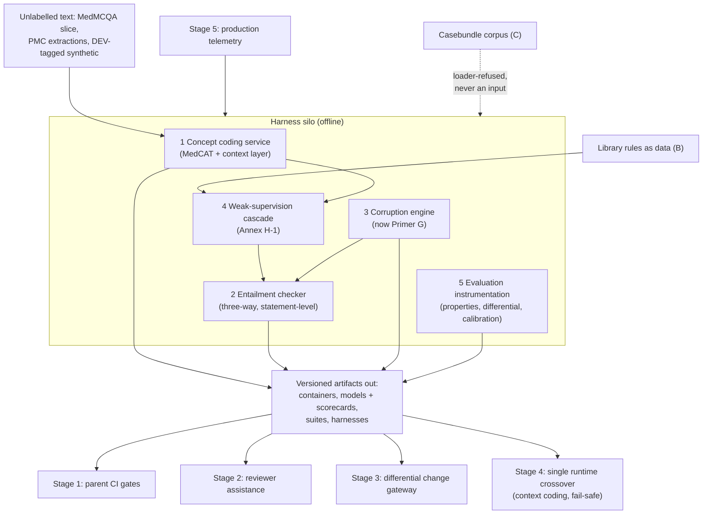

# Harness ML Primer
### Planner / Developer / Implementer introduction to the ML workstream for a deterministic-release CDSS content system

> **Architecture spine.** The project's spine is the deterministic-release doctrine plus the signed content registry: *ML proposes and tests; only arithmetic releases.* Three spine attachments raise the spec: **conformal prediction** (Primer F), the **corruption engine** (Primer G), and the **Lumos validation pathway** (Primer H). This primer's position: the offline proving ground for the spine — it hosts the corruption engine (G, elevated to its own primer), builds the measurement pipelines the conformal wrapper (F) depends on, and its five components remain the ML that proposes and tests, never releases. The six-mechanism **living evaluation stack** (Primer I) replaces archival golden-case regression throughout: properties + library self-consistency pre-release, differential testing for change review, distributional gates for promotion, runtime contracts + shadow evaluation in production — regenerating from living sources so nothing fossilises. The **model governance contract** (Primer J) is the second lattice, peer to I: I governs changes, J governs learned artifacts — no model trains on ungoverned data, acts without a card, or verifies anything whose errors it is positioned to share.


---

## 1. What this is

This primer defines a self-contained ML workstream whose products never make release decisions. The operating doctrine, in one line:

> **ML proposes and tests; only arithmetic releases.**

The release path — everything standing between the authoritative content registry and a clinician's screen — is deterministic: hash match, evidence-tier filter, currency date, dose-in-range, context policy. The ML described here lives entirely in the **validation harness**: the offline machinery that proves those gates work, screens content before it is admitted to the registry, codes text into concepts, and manufactures adversarial test material. Its fallibility is spent where a failure costs a bug ticket, never where it costs a patient.

This placement is the project's central safety argument and its central regulatory argument. It must be preserved through every design decision that follows.

**Audience.** Planners (scoping, sequencing, resourcing), developers (component contracts, datasets, models), implementers (integration, CI, operations). It assumes the parent CDSS exists as a separate programme with its own Bayesian engine, evidence library (E1/E2/E3 tiers), casebundle evaluation corpus (firewalled), and content registry with signed, versioned fragments.

---

## 2. Scope

**In scope — the five harness components:**

1. **Concept coding service** (NER + terminology grounding + context detection). Turns free text into SNOMED CT-AU/UMLS-coded findings with present/absent/uncertain flags. The one component with a runtime role — it codes patient context so deterministic gates can condition on it — but it selects and describes; it never verifies.
2. **Entailment / provenance checker.** Judges claim-against-source support at the statement level (supported / contradicted / topically-relevant-but-not-supporting). Used to pre-screen content updates and candidate registry fragments for human reviewers, and to audit generated prose elsewhere in the CDSS.
3. **Corruption engine** *(elevated to Primer G, which is now the authoritative contract; retained here only as a silo workstream: guaranteed-wrong test material from clinician-authored meaning-boundary perturbations, labels true by construction — see G for rulebook, taxonomy, and catch-rate law).*
4. **Weak-supervision cascade.** Coded text → labelling functions (LR tables, pathognomonic rules, SnNout logic) → noisy labels → aggregation → training sets. The factory that makes the other components trainable without archival annotation projects.
5. **Evaluation instrumentation** *(built here, operated by the living evaluation stack, Primer I)*. Concept-overlap scoring (CUI sets, both sides normalised by the coding service), property/metamorphic test generation, differential-testing tooling for version deltas, calibration/conformal measurement pipelines.

**Explicitly out of scope:**

- Any model that generates clinical content shown to users.
- Any probabilistic component in the release decision for authoritative content.
- The parent CDSS's diagnostic engine itself (the harness tests it; it does not build it).
- The firewalled casebundle evaluation corpus as a development input — the harness may be *evaluated against it* at formal checkpoints by the parent programme, but the silo never trains on it, tunes against it, or seeds test suites from it.

---

## 3. Breadth and depth of content required

Each component's appetite, with realistic floor quantities for a first working version:

**Concept coding service.**
- *Terminologies:* SNOMED CT-AU + AMT (national licence), UMLS (free NLM account), mapping tables to ICD-10-AM.
- *Bootstrap corpora:* filtered MedMCQA vignette slice (thousands of items, MIT-licensed) for measurable first-rung accuracy; commercial-use PMC case-report extractions for narrative variety; the project's own accumulated free text for self-supervised MedCAT training (unlabelled — volume matters more than labels; tens of thousands of documents is a useful start).
- *Gold standard:* a small internal linker eval — 300–500 clinician-adjudicated span→concept judgments over GP-register text, stratified across symptoms, medications, negations, family-history traps. This is the one unavoidable expert-annotation purchase; budget ~2–3 clinician-days.
- *External check:* ER-Reason CUI annotations as an independently authored exam (ED register — component validation only).

**Entailment checker.**
- *Public pretraining:* MedNLI-class and SciFact-class sets for general medical entailment (research-licence quarantine rules apply — training a shipped checker uses permissive sets; NC sets stay eval-only), MIRIAD response–passage pairs as claim–source structure at scale.
- *Domain pairs:* a few hundred claim–source pairs from the parent system's own outputs, labelled three-way by a clinician (seconds per pair; an afternoon's work), refreshed on model/prompt/library version changes.
- *Hard negatives:* unlimited, supplied by the corruption engine — this is the dependency that makes the checker trainable at all.

**Corruption engine.**
- *The corruption rulebook:* the critical asset. Per claim type: which field is load-bearing, and what edit crosses a clinical meaning boundary (LR crossing 1; dose crossing registry min/max; sensitivity crossing the SnNout floor; population/route/unit swaps). A few hours of clinician time, encoded once as perturbation functions, then infinite yield.
- *Substrate:* verified registry fragments and validated entailed pairs — it only needs known-good input.

**Weak-supervision cascade.**
- *Labelling functions:* the parent project's LR tables, pathognomonic and SnNout rules — already authored; the work is mechanical translation into executable LFs over coded findings.
- *Unlabelled text:* the same corpora as the coding service; the cascade's value scales with text volume, not annotation.
- *Accuracy anchor:* MedMCQA answer keys as free ground truth for LF accuracy measurement.

**Evaluation instrumentation.**
- *Calibration machinery validation:* DDXPlus (CC-BY, 1.3M synthetic cases) to prove pipelines, never epidemiology.
- *Property registry:* 20–40 clinical invariants derived from the Bayesian structure (red-flag monotonicity, LR-direction monotonicity, paraphrase invariance, pathognomonic rank-1).
- *Approval-record schema:* MedAESQA-style statement-level, three-way, reviewer-attributed verdicts.

Depth summary: the expensive-looking parts (checker training data, test cases) are manufactured or free; the genuinely scarce inputs are **~3–5 clinician-days** (linker gold standard, corruption rulebook, domain-pair labelling) and the **unlabelled text pile**. Plan procurement around those two.

---

## 4. Building in a silo

The silo is not just organisationally convenient — it is what preserves the two firewalls (eval-corpus independence; ML-free release path). Rules of the silo:

**Interfaces in, artifacts out.** The silo receives from the parent programme only: schemas (registry fragment format, coded-finding format, E/V-tier vocabulary), the rule assets (LR tables, SnNout logic) as data, and unlabelled text. It ships back only versioned artifacts: a coding service container with a fixed API, a checker model with a scorecard, corruption suites as data files, property/differential test harnesses as CI-runnable code. No shared databases, no reaching into the parent's stores.

**The silo never touches:** the casebundle eval corpus (machine-enforced — eval-tagged assets carry provenance metadata and silo tooling refuses to load them; the firewall must be structural, not disciplinary, because convenience gradients defeat discipline), production patient data, or the release registry's signing keys.

**Own everything needed to iterate fast:** own repos, own CI, own cloud project, public datasets, synthetic data. Every component has a scorecard metric that can be driven without any parent-system dependency: linker precision/recall on the gold standard; checker sensitivity on manufactured contradictions (SnNout-tuned — high sensitivity, human adjudicates flags); LF accuracy on MedMCQA keys; corruption-suite catch rate on a reference gate implementation.

**Build order inside the silo** (dependencies run downhill):
1. Coding service, off-the-shelf configuration (MedCAT + SNOMED CT-AU + NegEx/ConText layer) → gold-standard it.
2. Corruption rulebook + engine (needs only registry schema and clinician hours).
3. Labelling functions over coded findings → cascade on MedMCQA slice → measure.
4. Checker: public pretraining + cascade output + manufactured negatives + small domain-pair set.
5. Instrumentation: properties, differential tooling, calibration pipelines proven on DDXPlus.
6. Refinement loop: cascade output fine-tunes the coder on GP vernacular; clinician corrections via MedCATtrainer feed the same loop.

---

## 5. Folding it in

Integration is staged so that each fold-in point is an artifact crossing a contract boundary — never a merger of codebases or data stores.

**Stage 1 — CI adoption (lowest risk, first value; these run as Primer I pre-release gates, mechanisms 1–2 plus the G suite).** The parent programme's release pipeline imports the corruption suites and property harnesses as gates: every content promotion and engine change must pass them. The silo's outputs are now load-bearing but still entirely offline. Success metric: 100% catch rate on safety-class corruptions, sustained across releases.

**Stage 2 — Reviewer assistance.** The checker pre-screens content updates and candidate fragments, routing statement-level flags to the pharmacist/clinician approval queue (the Git PR flow). Humans remain the approvers; the ML changes their reading order, not their authority. Success metric: reviewer time per fragment down, missed-defect rate (caught later by any gate or telemetry) not up.

**Stage 3 — Differential testing as the change gateway (Primer I, mechanism 3).** On every guideline/monograph version delta, the harness diffs old-vs-new rendered outputs across a sampled presentation stream; only disagreements go to human sign-off, and the adjudication log becomes the change-control record. Success metric: expert review concentrated on actual behaviour changes; zero safety-relevant regressions among adjudicated deltas.

**Stage 4 — The single runtime crossover.** The coding service deploys into the live path *for context coding only* — feeding the deterministic scope/context gates. Contract: its output selects and describes; every verification gate downstream of it remains arithmetic. It ships with its scorecard, version-pinned, and its runtime errors fail safe (uncoded context → most-restrictive gate behaviour).

**Stage 5 — Telemetry closes the loop (feeding Primer I mechanisms 5–6 and the incident ledger).** Production acceptance/override events flow back to the silo as the ongoing validation stream: dismissed checker flags recalibrate the checker; adjudicated production corrections graduate into permanent tripwires (the incident ledger — the one sanctioned form of archival test, grown only from real failures); drift in override rates triggers re-validation, keyed to the version registry rather than the calendar.

**Governance at every stage:** artifacts are signed; scorecards travel with models; any silo artifact touching Stage 2+ carries a documented intended-use statement and known-failure-modes note — the same statement-level discipline demanded of the content itself.

---

## 6. Definition of done, per component

- **Coder:** precision/recall targets met on internal gold standard *and* ER-Reason external check; negation/experiencer error rate below agreed floor; vernacular fine-tune demonstrably better than off-the-shelf on GP-register text.
- **Checker:** sensitivity ≥ agreed floor on manufactured contradiction classes; three-way labelling agreement with clinician sample; refresh procedure documented and version-triggered.
- **Corruption engine:** rulebook signed off by a clinician; suite catches 100% of safety-class violations against the reference gates; regenerates fresh material per run (nothing fossilises).
- **Cascade:** LF accuracy measured against MedMCQA keys; label-noise bounds estimated by stratified expert sampling; documented as inputs to every model card downstream.
- **Instrumentation:** property registry reviewed clinically; calibration pipeline reproduces known results on DDXPlus before touching internal data; differential tooling produces reviewer-ready delta reports.

The programme-level definition of done is the doctrine holding under audit: a reviewer can trace every rendered authoritative fragment to a deterministic gate chain, and every ML component to an offline role with a scorecard — with the one runtime exception (context coding) explicitly bounded and fail-safe.

## 7. Internal operations diagram




## 8. Execution layer

**Coder service API (the silo boundary's most important contract):** `POST /v1/code` — body `{text, context_hint}`; response `{findings:[{cui, label, status: present|absent|uncertain, experiencer, span, confidence}], coder_version, abstentions:[spans]}`. Typed errors only; `abstentions` is a first-class output (unknown spans are reported, never guessed — property 18). p99 ≤ 400 ms/document at runtime profile.

**Artifact manifest (everything crossing the silo boundary ships with one):** `{artifact, type: container|model|suite|harness, version, sha256, j_card_ref, scorecard_ref, built_from:{repo, commit}, intended_stage: [I-mechanism or fold-in stage]}` — the parent's loaders refuse artifacts without a manifest, mirroring D's hash gate and J's admissibility validator.

**Scorecard minimums per component (silo exit criteria, concrete):** coder — linker P/R on internal gold ≥ agreed floor per entity class, negation/experiencer F1 reported separately, ER-Reason external check reported; checker — sensitivity on G safety-class ≥ 0.98 at operating point, three-way agreement vs clinician sample κ reported, near-miss class separation reported; cascade — LF accuracy vs MedMCQA keys per LF, label-noise bound from stratified expert sample; instrumentation — DDXPlus reproduction within published tolerances before internal use.

## Production topology annotation

*Per Architecture §11:* Gold-standard purchase at **L3** (det-coder needs the linker eval); the full harness — checker in reviewer-assist, cascade producing training sets — comes online at **L4**; all silo work rides Tiers 1+2 regardless of the product level.

## Register topology annotation

*Per Architecture §12 (register numbers R1–R28):* **Owns:** Gold-Asset Consumption Ledgers (R16, L3) and the silo-side manifest discipline feeding R2/R3. **Writes:** every boundary-crossing artifact into R2 with card refs into R4. **Reads:** R5 as the gate before any training run; never R21/R9 (corpus registers are credential-fenced).

<!-- ECOSYSTEM-V2-BLOCK: HX v1.0 -->
## 9. Build Execution Extension (Ecosystem v2.0)

**1. Mini-North-Star.** WHAT: the silo five component builds + manifest tooling per Harness §8, with Annex H-1 as the coder/cascade implementation detail. WHY: everything here proposes and tests; artifacts cross only by manifest. Endpoint: gold standard at L3; full harness at L4. Derives from and cites SPINE §13.1.

**2. Doctrine classification.** Manifest checks and scorecard floors are arithmetic; every model built here proposes or tests, per the J census.

**3. Scoped recon register.**
| ID | Verify | Tag |
|---|---|---|
| RECON-HX-001 | MedCAT release + licence in effect (Elastic 2.0 vs pinned Apache) | E:WEB |
| RECON-HX-002 | MedMCQA slice filter criteria + hash of the filtered set | E:REPO |
| RECON-HX-003 | Gold-standard sampling frame signed (Annex §8) | E:USER (clinician) |

**4. Work register seed (Release-1-equivalent; schema per master v2 Phase 6; estimates ranged with confidence).**
```yaml
TASK-HX-001:
  story: STORY-HX-001 (the engine inputs are trusted concepts)
  component: coder-gold
  title: Execute the Annex §8 linker gold-standard protocol
  purpose_chain: {what: "300–500 adjudicated spans + kappa report + the R16 ledger opened at zero", why: "the coder scorecard needs human-true ground truth before anything trains on its output", endpoint_ref: "L3 exit; SPINE-NS WHY"}
  evidence_refs: [E:DOC Annex §8; RECON-HX-003]
  definition_of_ready: ["two annotators booked", "sampling frame drawn"]
  steps: ["stratified draw", "dual-annotate the 20pct overlap", "adjudicate disagreements", "freeze + ledger"]
  test_plan: "kappa reported; frozen-set hash recorded; consumption ledger opened at zero"
  observability: "R16 entries; kappa metric"
  definition_of_done: ["frozen set in R16", "kappa filed"]
  estimate: {optimistic: 3d, likely: 5d, pessimistic: 8d, confidence: medium}
  depends_on: []
```

**5. Orchestration hooks.** `WF-HX-1` artifact emit: build → scorecard vs floors (Harness §8) → manifest + card → boundary publish (idempotent by sha; a floor miss is a hard stop, not a warning).

**6. Observer checkpoint spec.** The Observer verifies every boundary-crossed artifact carries manifest + card with floors met from CI evidence, and that no EVAL-tagged asset appears in any training manifest (cross-checked against the C alarms). Admissible: R2, R4, R16, CI artifacts.

**7. Implementer Contract binding.** This component's tickets execute under IMPL (SPINE §13.2). HALT trigger: any ticket whose training manifest lacks an R5 ruling per source → HALT: DOR-FAIL.

**8. Gaps and register proposals.** None new; the Annex receives a pointer block only.

<!-- MET-1 METAMORPHOSIS & HARDENING ANNEX — APPENDED 2026-09-01. Pure append per X1 discipline; zero edits to pre-existing text above. Status: Proposed; R29 hardening state of this document: PENDING. -->
## 10. Metamorphosis & Hardening Annex — posture-neutral duties + dormant fuzzy-namespace note

**Unchanged in substance; two notes.** (1) The harness's duties are posture-neutral by design and survive the relabel untouched: coder learners feed whichever branch R19 records (J-1's offline dictionary mining or J-2's frozen runtime model), the checker stays reviewer-assist, the cascade keeps manufacturing training sets, and the EVAL-refusing loaders remain the firewall's proven mechanism. (2) **Dormant fuzzy-namespace note:** if FZ-6 ratifies (DEC-05), the fuzzy inference namespaces (`skfuzzy`, `simpful`, `pyfuzzylite`, `pyit2fls` and equivalents) join the J-3 prohibited-namespace manifest — a *GPP build* constraint, not a harness constraint; the harness may still use them offline for boundary-sweep suite generation (FZ-5) under normal K discipline.

| Execution field | Content |
|---|---|
| Execution purpose | Keep all offline ML in the workshop: propose and test, never release |
| Inputs / prerequisites | Coder API, artifact manifest, silo exit criteria (§8); Annex H-1 cascade; J census rows before any training run |
| Steps | per component: 1 census + ruling-table check → 2 train in silo → 3 manifest emit → 4 EVAL-refusal proven → 5 artifacts cross contracts into consumers (never shared stores) |
| Tools / repos / environments | `cdss-harness`; MedCAT/MetaCAT lineage per Annex H-1 |
| Outputs & acceptance | Manifested artifacts; acceptance = silo exit criteria (§8) + gold-asset consumption ledgers (R16) current |
| Dependencies / handoffs | Feeds coder (per posture), checker to review queues, cascade sets to training; governed by J; operated artifacts enter I |
| Failure handling / rollback | EVAL-tag load attempt → refusal + incident; consumption-ledger breach → asset refresh trigger |
| Ownership & status | Repo: `cdss-harness`; owner [NEEDS DEFINITION]. Status: Retained; FZ-6 note Dormant/Proposed |
| Source & research traceability | Harness §1–§8; Annex H-1; MAK-DOT FZ-5/FZ-6; MAK-J3 GPP-8 |
