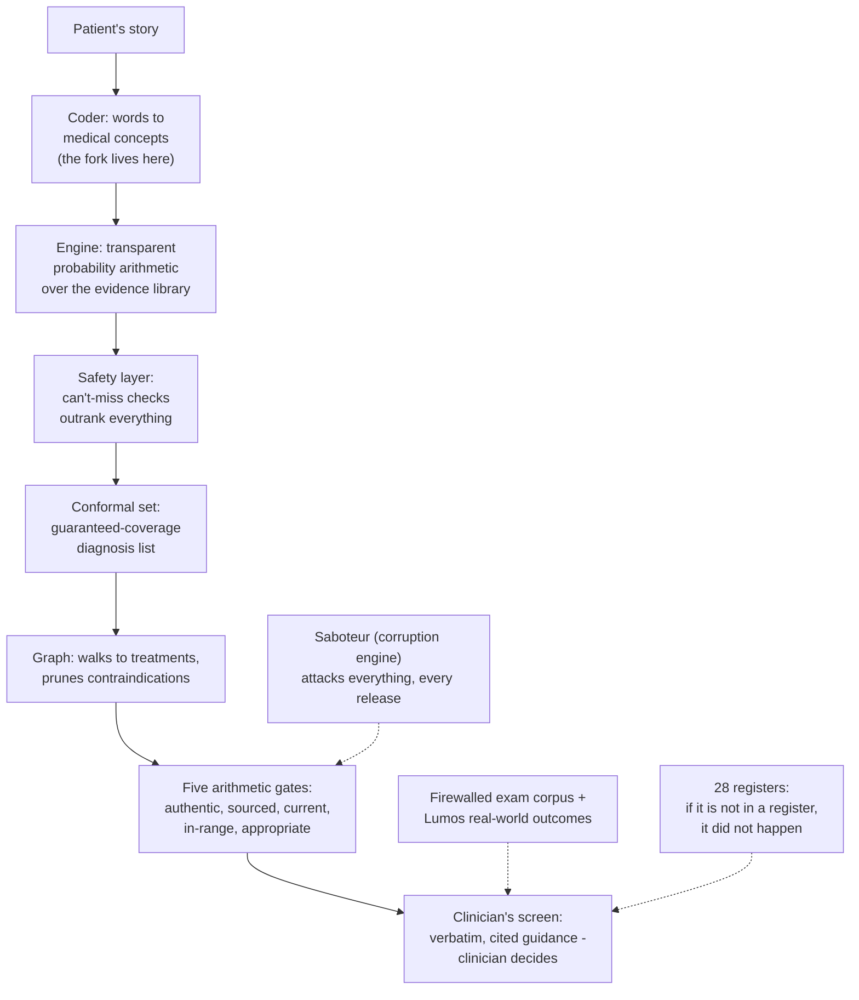

# Primer 0 — The Ecosystem Explainer
### What this project is, what every piece does, and how they fit together — in plain language, before any other document

*This is the front door. Every other document in the set assumes you have read it. It contains no schemas, no numbers to sign off, and no obligations — only understanding.*

---

## 1. What this project is

A clinical decision support system for Australian general practice. A clinician describes a patient's presentation; the system returns a ranked list of possible diagnoses with honest probabilities, flags anything dangerous that must not be missed, and then shows the relevant authoritative treatment guidance — word-for-word from trusted sources, never composed by an AI. The clinician always decides; the system informs, explains itself completely, and keeps receipts for everything.

## 2. The one rule

Everything in this project descends from a single sentence:

> **ML proposes and tests; only arithmetic releases.**

In plain words: machine learning and AI are allowed to *suggest* things and to *test* things, but the final checks that stand between any content and the clinician's screen are simple, inspectable arithmetic — does the hash match, is the source current, is the dose inside its published range, does the patient context permit it. A wrong suggestion gets caught by a check; a check can never be wrong in a way no one can explain. That is why regulators call systems like this "glass box" rather than "black box": every decision can be opened up and read.

## 3. The cast — every piece in a few sentences

**The Bayesian engine (Primer A)** is the reasoning core. It takes the patient's findings and does transparent probability arithmetic — starting from how common each condition is, adjusting for each finding using published evidence numbers — and produces a ranked differential. Every step is logged, so any output can be replayed and audited exactly.

**The evidence library (Primer B)** is where all the clinical numbers live: how common conditions are, how much each symptom shifts the odds, which findings rule things out. Every number carries a quality grade (E1 strong, E2 moderate, E3 estimate) and a citation. The engine owns no numbers of its own — it is a calculator over this library.

**The content registry (Primer D)** holds the treatment guidance, medication information, and dosages — as small, signed, versioned fragments taken from authoritative sources. Content only reaches a screen if it passes five arithmetic gates: authentic (hash), well-sourced (tier), current (dates), in-range (dose bounds), and appropriate for this patient (context). Nothing generated ever enters it.

**Graph RAG (Primer E)** is the smart librarian over the registry. It's a knowledge map connecting conditions to treatments, treatments to contraindications and interactions, old guidance to what superseded it. Given a diagnosis and a patient's context, it walks the map, prunes anything contraindicated, and hands back *pointers* to registry fragments — which the gates then verify. It selects; it never releases.

**The conformal wrapper (Primer F)** makes the probabilities honest. Instead of "we think it's 70% X," it produces a set with a mathematical guarantee: "the true diagnosis is in this list 95% of the time." That guarantee holds regardless of how imperfect the underlying model is — it's bought with held-out data, not with optimism.

**The concept coder (Annex H-1, and the fork)** turns free text into coded findings — "puffed walking upstairs" becomes the medical concept *dyspnoea on exertion, present*. It's the bridge between how people talk and how the engine computes. Whether the runtime version uses machine learning or pure dictionary rules is the project's one big open choice (see §7).

**The corruption engine (Primer G)** is the in-house saboteur. It takes known-good content and deliberately breaks it in clinically meaningful ways — a dose multiplied by ten, a unit swapped, a contraindication link silently deleted — and then verifies the safety gates catch every single one. Because the breakage is deliberate, the right answer is known for free. Nothing goes live without surviving it.

**The casebundle corpus (Primer C)** is the independent final exam: a bank of authored clinical cases the system is tested against at formal checkpoints — and *only* then. It is firewalled behind its own credentials, because an exam the developers can study from stops measuring anything. This discipline is enforced by machines, not memos.

**The living evaluation stack (Primer I)** is how changes get released. Instead of a frozen museum of old test cases, six living mechanisms regenerate their tests fresh every time: clinical invariants that must always hold, consistency with the current library, expert review of exactly what changed between versions, population-level quality gates, per-patient runtime safety assertions, and silent trial runs against live traffic before promotion.

**Model governance (Primer J)** is the passport office for anything learned. Every model carries a card: what it was trained on (and under what licence), how good it is (proven against independent evidence, never its own opinion), what it must never do, and what happens when it fails. No card, no deployment. Its two addenda, J-1 and J-2, are the two candidate answers to the coder question.

**The LLM lattices (Primers K and L)** govern large language models. K covers the twenty places LLMs help *behind the scenes* — drafting library rows, extracting dose limits from documents for a pharmacist to confirm, manufacturing clever test cases — always as a proposer with a named checker, never affecting the product's regulatory status. L covers the frontier: LLMs in the live consultation (asking history questions the engine chose, narrating the arithmetic, drafting referral letters where every sentence must trace to a source) — available only under the full medical-device posture.

**The Lumos pathway (Primer H)** is the long-game reality check: NSW's linkage of GP records to hospital and mortality outcomes — the only Australian data connecting "what the patient presented with" to "what actually happened." It supplies Australian prevalence numbers now, and eventually the flagship validation study proving the system's probabilities match the real world.

**The harness (Harness ML Primer)** is the workshop where all the offline machine learning lives — the coder's training, the fact-checking model, the labelling factory that turns the library's rules into training data. Its models test and propose; none of them release.

## 4. One consultation, start to finish

A patient describes breathlessness. The coder turns the words into coded findings, which the clinician confirms as chips on screen. The engine runs the arithmetic: prevalence, then each finding shifting the odds, producing a ranked differential — and a hard-coded safety layer checks nothing dangerous is being missed, outranking the probabilities if it fires. The conformal wrapper turns the result into a guaranteed-coverage set. Graph RAG walks from the leading diagnoses to treatment recommendations, pruning anything contraindicated by this patient's allergies or kidney function. The surviving pointers hit the registry's five gates; only fragments that pass render — verbatim, cited, tiered. The clinician reads, decides, accepts or overrides; that choice is logged. Behind the scenes, every step was stamped with the exact versions of everything involved, so the entire encounter can be replayed years later, number for number.

## 5. How it stays safe and honest

Four ideas, layered: the **spine** (only arithmetic releases — the checks at the door are simple and inspectable); the **saboteur** (the corruption engine proves the door actually stops intruders, every release, forever); the **honest wrapper** (conformal prediction converts model confidence into mathematical guarantees); and the **outside world** (the firewalled exam corpus and, ultimately, Lumos-linked real outcomes — because a system that only ever passes its own tests has proven consistency, not correctness). And beneath all four, the registers: twenty-eight ledgers recording every artifact, decision, exposure, and incident, on the principle that *if it is not in a register, it did not happen*.

## 6. How it gets built and grows

**Repositories:** one per component plus a spine repo holding every shared contract; components combine by pinning versions in a lockfile, never by merging code — so pieces are built independently and assembled deliberately. **Maturity levels:** five progressively complete products, each demoable end-to-end — L1 is the glass-box core with picker input; L2 adds signed content through the gates; L3 adds honest uncertainty, free-text coding, and the treatment graph (the first prototype a pilot clinician touches); L4 goes multi-domain with the full governance machinery and the first formal exam; L5 is the target state. **Tiers:** every release at every level passes the same security-and-compliance pipeline, which never relaxes.

## 7. The one big choice

Australian regulation offers an exemption for transparent decision-support software — but current guidance says AI-enabled systems don't qualify. This project's only runtime AI candidate is the coder. Hence the fork, decided at Level 4 on Level 3's evidence: **J-1** keeps runtime purely deterministic (dictionary rules live, ML improving the dictionary offline) and pursues the exemption; **J-2** runs the ML coder live behind a clinician-confirmation step, accepts full medical-device classification, and unlocks the Primer L frontier. Downstream of coding the two systems are identical, so the choice is reversible — and it is recorded, with pre-agreed conditions for changing it, like everything else.

## 8. Where to start, by who you are

**New engineer:** this document → Architecture §1–2 and §10 (repos) → the primer for your component → its execution layer. **Clinician advisor:** this document → Primer A §A1 and B §B1 → the corruption rulebook (G8 — it wants your red pen) → Primer C. **Regulator or regulatory consultant:** this document → Architecture §1 → Primers D and I → the fork (§7 here, Addenda J-1/J-2) → the Register Topology (§12) and Dossier Evidence Register. **Investor or partner:** this document → Architecture §11 (the five levels are the roadmap) → Primer H (the moat: Australian outcome validation). **Builders:** the Build-execution extensions and their index live in Architecture §13, with each component's block at its §-9.

## 9. Glossary of house vocabulary

**Spine** — the deterministic release path plus the signed registry; the architecture's core. **Glass box** — a system whose internal logic a clinician can inspect (the regulator's term; this project's design goal). **LR (likelihood ratio)** — how much a finding shifts the odds of a diagnosis; the library's working currency. **Conformal set** — a diagnosis list with a mathematical coverage guarantee. **Casebundle** — one authored exam case in the firewalled corpus. **Corruption / perturbation** — a deliberate, label-guaranteed breakage used to prove the gates work. **Lattice** — a governance layer running across all components (I: changes, J: models, K/L: LLMs). **Register** — a ledger; there are 28; if it's not in one, it didn't happen. **Fork / posture** — the J-1 vs J-2 coder decision. **Level** — one of five progressively complete versions of the product. **Fragment** — one signed, statement-level piece of authoritative content in the registry. **Trace** — the replayable arithmetic record of one engine run. **Abstention** — a component saying "I don't know" instead of guessing; always a legal output here.

## 10. The whole system in one picture

---

<!-- MET-1 METAMORPHOSIS ANNEX — APPENDED 2026-09-01. Additive per the Ecosystem v2.0 X1 discipline: zero edits to any pre-existing text above this line. Primer 0 is charter-exempt from build-execution blocks (Arch §13.9); this annex therefore carries only an erratum notice, a pointer, and glossary additions. -->

## 11. Metamorphosis notice (MET-1 pass, additive)

**Erratum notice on §7 — status: Needs confirmation, pending GATE-000.** §7 above describes J-1 as pursuing the Australian CDSS exemption. REG-POSTURE v1.0 (MAK-ANT Annex 1, which governs regulatory content per the Mākoha MANIFEST) assesses Mākoha as **not eligible** for that exemption (`REG-FIND-001`): the disqualifier is the diagnostic function itself — a ranked differential with posteriors is new diagnostic information contributing to diagnosis (`REG-FIND-002`) — and determinism is necessary but not sufficient for the glass-box test (`REG-FIND-003`). The fork survives with new labels (`FORK-REG-001`): **J-1 = lower-class included**, **J-2 = higher-class included**; the L4 decision point and reversal triggers are unchanged. A third branch, **J-3 (Guideline-Prompt Profile)**, is the lawful exempt-tier reserve product — same spine, guideline-only inference, no differential. §7's original text is preserved above unedited; this notice supersedes its regulatory framing once `ASSUME-REG-002` (written counsel opinion) is ATTESTED, and is withdrawn if counsel refutes `REG-FIND-001`.

**Pointer.** The metamorphosed ecosystem — three faces, two UI corpora, the justification fabric wrapping this spine, the hardening ratchet, and the full imago document repository — is indexed in `00_MANIFEST.md` and planned in `MET-1_metamorphosis_plan` (v1.0 + v1.1).

**Glossary additions (house vocabulary, new this pass):** **Fabric** — the justification layer (MAK-FFC): every released claim is a Toulmin-structured argument, append-only and hash-chained. **Argument (ActualArgument)** — the canonical release unit: claim, grounds, warrant, backing, qualifier, rebuttal. **Face** — one of three role surfaces (clinician, patient, auditor) rendering the same argument in its own register. **Register-render law** — renderers may compress or reorder, never add, remove, or reweight (SPINE-3). **Deviation** — a clinician's structured, first-class departure from a recommendation (SPINE-8). **GPP** — the J-3 exempt-tier build artifact (guideline prompts only; diagnosis-contributing capabilities structurally absent). **Release spine** — house term for this project's deterministic release path + signed registry, to distinguish it from the fabric's SPINE-n requirement IDs. **Wing-beat** — one of eight fuzzy × meta-rationality coordination patterns (MAK-MIF beat n).
