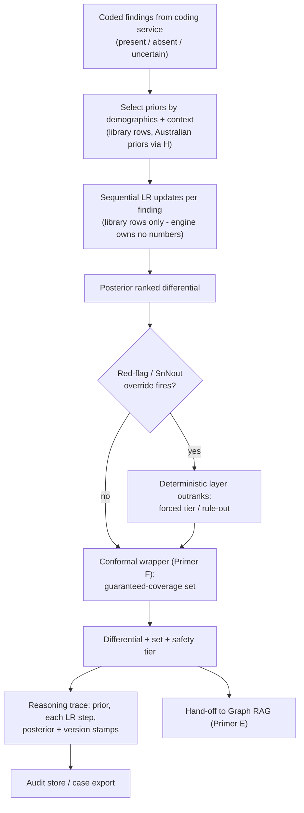

# Primer A — Bayesian Differential Engine

> **Architecture spine.** The project's spine is the deterministic-release doctrine plus the signed content registry: *ML proposes and tests; only arithmetic releases.* Three spine attachments raise the spec: **conformal prediction** (Primer F) makes the probabilistic side honest, the **corruption engine** (Primer G) proves the deterministic side holds, and the **Lumos validation pathway** (Primer H) shows the whole assembly tracks reality. This primer's position: the principal probabilistic proposer. Its honesty is delivered by the conformal wrapper (F), its override layer is proven under corruption attack (G), and its truth-claim is ultimately settled against linked outcomes (H). The six-mechanism **living evaluation stack** (Primer I) replaces archival golden-case regression throughout: properties + library self-consistency pre-release, differential testing for change review, distributional gates for promotion, runtime contracts + shadow evaluation in production — regenerating from living sources so nothing fossilises. The **model governance contract** (Primer J) is the second lattice, peer to I: I governs changes, J governs learned artifacts — no model trains on ungoverned data, acts without a card, or verifies anything whose errors it is positioned to share.

## A1. What this is

The reasoning core: takes coded findings (present/absent/uncertain) and produces a ranked differential with explicit probabilities, by applying priors and likelihood ratios from the evidence library. Its defining property is that every output is *reconstructible arithmetic*: prior → finding → LR applied → posterior, loggable per step. It is deliberately not a learned diagnostic model — the explicit Bayesian structure is the explainability and regulatory strategy, not a placeholder for one.

## A2. Scope

**In scope:** prior selection by demographic/context; sequential LR updating; the four presentation variants per condition (acuity × complexity quadrants); deterministic red-flag/SnNout override layer that outranks probabilistic output; conformal wrapper producing guaranteed-coverage differential sets; structured reasoning-trace emission for every run; version stamping of every output (engine + library + prompt versions).

**Out of scope:** any content generation shown to users; treatment/medication recommendation (that is registry + Graph RAG territory — the engine ends at the differential and its safety tier); learning weights from data at runtime (all clinical numbers come from the library, updated only through its governance); free-text interpretation (the coding service's job — the engine consumes concepts only).

## A3. Breadth and depth of content required

- **From the evidence library:** per-condition priors, LR tables per finding, pathognomonic and rule-out entries, tier metadata — the engine holds *no clinical numbers of its own*; it is a calculator over library rows. Depth requirement is therefore inherited, not owned.
- **Calibration data:** DDXPlus (CC-BY) to prove the calibration/conformal machinery; a held-out calibration slice for conformal quantiles; ultimately Australian outcome-linked data (Lumos-derived statistics for priors; a future linkage study for posterior honesty). Floor for a first pass: machinery proven external, calibration curves produced on a few hundred internal cases.
- **Property registry:** 20–40 invariants derived from the engine's own mathematics (red-flag monotonicity, LR-direction monotonicity, evidence-removal widens conformal sets, pathognomonic rank-1, paraphrase invariance via the coder).
- **Trace schema:** one agreed structure for the audit log — the cheapest asset with the highest downstream value (tools #2, #11).

## A4. Building in a silo

The engine silo receives the library *as versioned data* and the coded-finding schema; it ships a stateless compute service with a fixed API (findings in → differential + trace + conformal set + tier out). It can be driven to done with zero real patients: DDXPlus for machinery, synthetic presentations generated from the library itself for self-consistency ("does the engine reproduce what the library entails?" — the regenerating test that replaces archived cases). Internal build order: core updater → override layer → trace emission → calibration/conformal wrapper → property suite. The silo never sees the casebundle corpus; its pre-release testing is properties + library self-consistency + differential testing between engine versions (Primer I, mechanisms 1–3).

## A5. Folding it in

Stage 1: harness CI gates adopted (properties, self-consistency, corruption-fed inputs must produce sane behaviour). Stage 2: shadow mode behind any existing engine version against sampled traffic; promotion gated on distributional metrics (Brier/ECE bounds, conformal coverage tolerance, red-flag-class sensitivity floor with CIs) — never on case-level pass rates (Primer I, mechanisms 6 then 4). Stage 3: live, with runtime contracts (Primer I, mechanism 5) asserting the invariants per encounter and the trace flowing to the audit store. Stage 4: telemetry (override rates by diagnosis class) feeds recalibration review, keyed to version changes.

## A6. Definition of done

Every output carries a complete, replayable trace; calibration curves and conformal coverage within agreed tolerance on both external and internal data; 100% property-suite pass on safety-class invariants; the override layer demonstrably outranks the probabilistic layer under corruption-engine attack; any historical output reproducible from version stamps alone.

## A7. Internal operations diagram




## A8. Execution layer

**Trace schema (one record per engine run):**

```json
{
  "trace_id": "uuid", "encounter_ref": "opaque",
  "versions": {"engine":"1.4.0","library":"2026.08.1","coder":"medcat-au-0.9.2","conformal_calib":"c-2026-07"},
  "context": {"age_band":"50-59","sex":"F","setting":"GP","flags":["ex-smoker"]},
  "findings": [{"cui":"267036007","label":"dyspnoea","status":"present","source_span":"puffed on exertion"}],
  "steps": [{"dx":"PE","prior":0.02,"finding":"267036007","lr":1.9,"post":0.0374,"row_ref":"LIB:PE:dyspnoea:v2026.08.1"}],
  "posterior": [{"dx":"PE","p":0.11},{"dx":"CAP","p":0.34}],
  "overrides": [{"rule":"SNOUT-PE-01","fired":false}],
  "conformal_set": {"coverage":0.95,"members":["CAP","PE","IECOPD"],"stratum":"resp-adult"},
  "tier": "urgent-same-day"
}
```

Every `row_ref` resolves to a library row version; every number in `steps` is recomputable from that row — that is the replayability contract.

**API contract:** `POST /v1/differential` — body `{findings[], context{}, options{coverage_level}}`; response = trace record above; errors are typed (`UNCODED_CONTEXT` → caller applies most-restrictive behaviour; `LIBRARY_VERSION_MISMATCH` → hard fail). Stateless; version pins in every response; p99 latency budget 800 ms excluding coder.

**First executable properties (seed for the I registry, engine-owned subset):** (1) ∀ case: adding a finding with LR+>1 for dx never decreases p(dx). (2) ∀ case: adding any red-flag finding never lowers acuity tier. (3) Removing any finding never shrinks the conformal set. (4) A pathognomonic finding for dx ⇒ rank(dx)=1. (5) Paraphrase of a finding span (same CUI, same status) ⇒ identical posterior vector. (6) Findings order-permutation ⇒ identical posterior (updater is commutative). (7) status=absent for a SnNout finding ⇒ dx excluded or flagged, never silently retained above threshold. (8) Output tier is monotone non-decreasing in the set of fired override rules.

**Proposed tolerances (flag: clinical sign-off required):** ECE ≤ 0.05 overall; Brier within +0.02 of previous release; conformal coverage 95% ±1.5pp overall, ≥98% red-flag stratum; red-flag class sensitivity ≥ 0.995 lower CI bound on the distributional batch; override-rate drift band ±20% relative between releases.

## Production topology annotation

*Per Architecture §11:* Live from **L1** (the level's centrepiece with picker input); conformal attachment at L3; distributional promotion gates bind from L3; unchanged thereafter — the engine is the one component present at every level.

## Register topology annotation

*Per Architecture §12 (register numbers R1–R28):* **Owns:** none (pure compute). **Writes:** every trace carries the Version Registry stamp (R1); property additions to R7. **Reads:** R1, library releases via R14. Opens with its L1 duties: trace-stamping from the first release.

<!-- ECOSYSTEM-V2-BLOCK: A v1.0 -->
## A9. Build Execution Extension (Ecosystem v2.0)

**1. Mini-North-Star.** WHAT: the stateless engine service emitting the A8 trace record, plus its property suite. WHY: the principal proposer whose every output must replay as arithmetic. Endpoint: enters at L1; conformal attachment at L3 (Production topology annotation). Derives from and cites SPINE §13.1.

**2. Doctrine classification.** Property/self-consistency checks and trace replay verification are arithmetic; the engine itself proposes; nothing here releases.

**3. Scoped recon register.**
| ID | Verify | Tag |
|---|---|---|
| RECON-A-001 | Pinned runtime + container base for ECS Fargate class in ap-southeast-2 | E:WEB required at ticket start |
| RECON-A-002 | Spine contract version for coded-finding + trace schemas | E:REPO (cdss-spine tag) |
| RECON-A-003 | Library release format (B) consumed as data | E:DOC B8; E:REPO on first release |

**4. Work register seed (Release-1-equivalent; schema per master v2 Phase 6; estimates ranged with confidence).**
```yaml
TASK-A-001:
  story: STORY-A-001 (clinician receives a replayable differential)
  component: engine-core
  title: Implement sequential LR updater over library rows
  purpose_chain: {what: "updater module + unit and property tests", why: "L1 walking skeleton requires posterior computation", endpoint_ref: "L1 exit: zero safety-property violations; SPINE-NS WHY"}
  evidence_refs: [E:DOC A8, B8; RECON-A-002]
  definition_of_ready: ["spine schemas pinned", "library exemplar row available"]
  steps: ["load rows", "prior selection by context", "commutative LR fold", "posterior emit"]
  test_plan: "unit + property (I-registry star-1, star-2, 11–13 engine subset); failure case: unknown row_ref hard-fails"
  observability: "per-run structured log with version stamps; counter engine.runs; latency histogram"
  definition_of_done: ["properties green", "trace replays byte-identical", "typed errors only"]
  estimate: {optimistic: 2d, likely: 4d, pessimistic: 7d, confidence: medium}
  depends_on: []
```
```yaml
TASK-A-002:
  story: STORY-A-001
  component: engine-api
  title: Expose /v1/differential per A8 contract
  purpose_chain: {what: "HTTP service + typed error taxonomy", why: "the trace record is the audit product", endpoint_ref: "L1 exit; SPINE-NS WHAT"}
  evidence_refs: [E:DOC A8; RECON-A-001]
  definition_of_ready: ["TASK-A-001 done"]
  steps: ["request validation vs spine schema", "UNCODED_CONTEXT + LIBRARY_VERSION_MISMATCH paths", "p99 budget test 800ms"]
  test_plan: "contract tests including both typed errors; load smoke at budget"
  observability: "request logs with trace_id; alert on error-rate above 1pct over 5m"
  definition_of_done: ["contract tests green", "budget met in CI perf stage"]
  estimate: {optimistic: 2d, likely: 3d, pessimistic: 5d, confidence: high}
  depends_on: [TASK-A-001]
```

**5. Orchestration hooks.** `WF-A-1` release: build → properties/self-consistency (I mechanisms 1–2) → G suite → manifest emit (idempotent by artifact hash; retry 1; timeout 30m). Emits `EVT-A-1 engine.release`, consumed by WF-SPINE-1.

**6. Observer checkpoint spec.** At L1 exit: trace-replay equality evidenced from CI artifacts; property runs show zero star-class violations. At L3: coverage report reference (F) present in the R23 feed. Admissible: R1, R7 run outputs, CI artifacts.

**7. Implementer Contract binding.** This component's tickets execute under IMPL (SPINE §13.2). Component HALT trigger: any ticket that would author or alter a clinical number → HALT: CHAIN-BREAK (numbers are B territory, under sign-off flags).

**8. Gaps and register proposals.** GAP-A-001 → RESOLVED by ratification: engine property-run outputs home in **R25** (Arch §12.2).

<!-- MET-1 METAMORPHOSIS & HARDENING ANNEX — APPENDED 2026-09-01. Pure append per X1 discipline; zero edits to pre-existing text above. Status of this annex: Proposed (ratification via MET-2 decision queue); Hardening state of this document: PENDING in R29 (seed row in HARDEN-1) — nothing here is HARDENED. -->
## A10. Metamorphosis & Hardening Annex — fabric binding + updated execution block

**Fabric binding (MAK-FFC).** The engine supplies **warrant instantiations** (its LR-chain over library rows is the Bayesian-likelihood warrant class) and the raw material of the **qualifier** (posteriors, wrapped by F into conformal sets). Its red-flag/SnNout override emits safety-class claims that the deterministic evaluator ranks above every probabilistic input. The A8 trace becomes the argument's evaluation record; SPINE-5 replay and L1's byte-identical trace-replay exit are the same test with a new name. Coordination doctrine: MAK-MIF beats 1 and 4 (graded criterion fit routes to judgment; conflicts acquire a shape and stay visible).

| Execution field | Content |
|---|---|
| Execution purpose | Run the engine as the fabric's warrant/qualifier-input supplier — same arithmetic, argument-shaped output envelope |
| Inputs / prerequisites | Library release pin (B); coded findings as grounds with provenance (coder per R19; data plane); `cdss-spine` contracts: trace schema (A8), ActualArgument schema (CONTRACT-ARG-1, proposed) |
| Steps | 1 ingest grounds → 2 select priors → 3 sequential LR updates, logged per A8 → 4 evaluate red-flag/SnNout overrides → 5 emit posterior + trace → 6 assemble warrant-instantiation payload referencing GenericArgument version + library row IDs → 7 hand to F |
| Tools / repos / environments | `cdss-engine` (stateless compute container, no clinical numbers of its own); pgmpy-class primitives (MAK-ELSM verdict: engine is BUILD; Babylon code STUDY ONLY, patent-encumbered) |
| Outputs & acceptance | Trace + argument payload; acceptance = L1 exits (zero safety-property violations; byte-identical replay) **plus** fabric-replay test and SPINE-2 refusal test (a payload without qualifier inputs cannot proceed) |
| Dependencies / handoffs | Upstream: B, coder. Downstream: F (qualifier), graph E (leading diagnoses), evaluator. Contract changes are spine PRs that visibly break this consumer |
| Evidence to collect | R1 version stamps on every trace; R25 property-run outputs (I-1/2); adjudication records for any engine change (R12) |
| Failure handling / rollback | Abstention is a legal output; engine unavailable → picker-only degrade + I-5 contract violation logged + alarm; rollback = redeploy prior lockfile pin (R14) |
| Ownership & status | Repo: `cdss-engine`; component owner [NEEDS DEFINITION]. Status: Retained (contract) + Transformed (argument envelope, Proposed) |
| Source & research traceability | Primer A §A1–A8 (Existing); MAK-FFC Part 2 warrant/qualifier rows, Part 6 engines; MAK-CEC DX plane (consolidation — never retires A's requirements); MAK-ELSM §03 |
