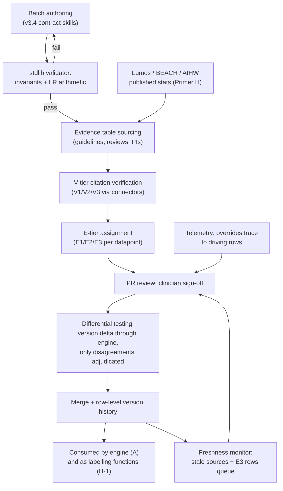

# Primer B — Evidence Library (E1/E2/E3)

> **Architecture spine.** The project's spine is the deterministic-release doctrine plus the signed content registry: *ML proposes and tests; only arithmetic releases.* Three spine attachments raise the spec: **conformal prediction** (Primer F) makes the probabilistic side honest, the **corruption engine** (Primer G) proves the deterministic side holds, and the **Lumos validation pathway** (Primer H) shows the whole assembly tracks reality. This primer's position: the source of every number the proposer computes over. It answers to sources, never to downstream scores; Lumos/BEACH/AIHW-derived Australian priors (H, Stage 1) enter here as tiered, freshness-monitored rows. The six-mechanism **living evaluation stack** (Primer I) replaces archival golden-case regression throughout: properties + library self-consistency pre-release, differential testing for change review, distributional gates for promotion, runtime contracts + shadow evaluation in production — regenerating from living sources so nothing fossilises. The **model governance contract** (Primer J) is the second lattice, peer to I: I governs changes, J governs learned artifacts — no model trains on ungoverned data, acts without a card, or verifies anything whose errors it is positioned to share.

## B1. What this is

The single source of clinical truth for the engine: the structured differential-diagnosis knowledge base (the v3.4 contract — per-condition priors, presentation variants, discriminating findings with sensitivity/specificity/LRs, patient-facing questions, pathognomonic and rule-out findings, safety guidance) plus the sourced evidence table behind every number. Every datapoint carries an evidence tier: **E1** (traceable to high-quality published sources), **E2** (attributed but weaker/indirect), **E3** (unsourced/consensus estimate). The tiers are not documentation — they are executable metadata consumed by gates, display, and review prioritisation.

## B2. Scope

**In scope:** the CSV/structured contract and its schema; the evidence table with citations; tier assignment and the V1/V2/V3 citation-verification pass; the stdlib validator enforcing invariants and LR arithmetic; the ingest primer for downstream consumers; authoring and review workflow; version history of every row.

**Out of scope:** treatment/medication/dosage content (registry territory — the library ends at diagnosis-relevant evidence); runtime computation (engine's job); citation *retrieval* infrastructure (Graph RAG/registry concern). The library is data + validation + governance, never a service.

## B3. Breadth and depth of content required

- **Coverage breadth:** driven by intended-use presentation mix — Australian GP encounter epidemiology (BEACH historical, AIHW prevalence, Lumos-derived utilisation) defines which condition domains matter first and what the priors should be. Depth per condition is fixed by the contract (27 columns, four variants, KSKS anatomy), so the planning variable is *domains × conditions*, not fields.
- **Source corpus:** licensed guidelines (eTG-class), TGA PIs where diagnosis-relevant, systematic reviews/meta-analyses for LR figures; grey literature only at E2/E3 with explicit tiering.
- **Verification inputs:** the literature connectors (PubMed etc.) for the V-tier pass; the source registry as the canonical citation store.
- **Review capacity:** the scarce input — clinician hours for E3→E1 upgrades and freshness review. Plan a standing review budget, prioritised by tier × usage frequency (telemetry tells you which rows actually fire).

## B4. Building in a silo

The library silo is an authoring pipeline: generation (skill-driven batches) → validator → evidence-table sourcing → V-tier verification → tier assignment → merge. It needs only the contract, the source corpus, and the connectors — no engine, no patients. Every increment retires prior versions cleanly (the established four-file bundle discipline). Self-consistency is the internal test: the validator enforces arithmetic; sampled rows get independent re-derivation. The silo must never tune rows to make the *engine's* outputs look better on any evaluation — library numbers answer to sources, not to downstream scores; that separation is what keeps a library update from being a covert engine patch.

## B5. Folding it in

Library releases are content promotions through the same gateway pattern as the registry: PR flow with clinician/reviewer sign-off, CI running the validator + corruption suite (tampered LRs must be caught) + **differential testing** — every library version delta is diffed through the engine across a sampled presentation stream, and only behavioural disagreements go to human adjudication, which becomes the change-control record. Freshness monitoring (tool #8) runs against the merged library; E3 rows and stale sources queue for review. Telemetry closes the loop: overridden recommendations trace back to the rows that drove them.

## B6. Definition of done (per release)

Validator: zero violations. Every row tiered; every E1/E2 citation resolves in the source registry; V3 count below agreed ceiling and trending down; delta-adjudication complete with no unexplained safety-relevant behaviour changes; freshness ledger current; full row-level version history reproducible.

## B7. Internal operations diagram




## B8. Execution layer

**Validator invariants, enumerated (release-blocking):** (1) every LR pair internally consistent with stated sens/spec (LR+ = sens/(1−spec), LR− = (1−sens)/spec, tolerance ±2%); (2) LR+ ≥ 1 ≥ LR− per discriminating-finding row, or the row is explicitly typed contrarian with justification; (3) all four quadrant variants present per condition; (4) every patient-facing question interrogative; (5) every E1/E2 datapoint carries a resolvable source-registry ID; (6) SNout entries carry SELF/ALT typing; (7) priors per domain sum sanely against declared "other" mass (0.9 ≤ Σ ≤ 1.0); (8) no field empty that the contract marks mandatory; (9) DX-3 members exist as conditions in-library or are explicitly external-flagged; (10) row version increments on any value change (hash-checked).

**Worked-row sketch (CAP, abbreviated to the load-bearing fields):** prior(GP, adult) 0.04 [E1: src-0042]; pathognomonic — none (field: NONE-known); discriminators — fever LR+ 1.8/LR− 0.6 [E1 src-0042], focal crackles LR+ 2.3/LR− 0.8 [E2 src-0107]; SNout — normal CXR (ALT, imaging) sens 0.95 [E1 src-0009]; safety divergence — "if hypoxic, treat as severe regardless of probability"; questions — "Have you had fevers or shakes?"; DX-3: IECOPD, PE, viral LRTI. A fully populated exemplar row ships with the contract bundle and is the template for authoring review.

**Review-budget arithmetic:** quarterly clinician-hours ≈ Σ over rows of (fire-rate weight × tier weight × minutes), with tier weights E3=3, E2=1, E1=0.25 (freshness-triggered only) and fire-rate from telemetry deciles. Worked example: 1,200 active rows, 15% E3, telemetry-weighted → ≈ 40–60 h/quarter at steady state; E3 backlog burn-down budgeted separately as a one-off. The formula is the planning artifact; the weights are the reviewable policy.

## Production topology annotation

*Per Architecture §11:* Single-domain from **L1** (the worked respiratory exemplar); PR gateway + freshness at L2; multi-domain expansion is the defining work of **L4**; Lumos Stage-1 rows enter at L4.

## Register topology annotation

*Per Architecture §12 (register numbers R1–R28):* **Owns:** Source Registry (R6), Freshness Ledger (R10). **Writes:** row versions into R1; review outcomes into R12. **Reads:** telemetry (R13) for fire-rate weighting; R5 for source licence class. R6 opens at L1; R10 at L2.

<!-- ECOSYSTEM-V2-BLOCK: B v1.0 -->
## B9. Build Execution Extension (Ecosystem v2.0)

**1. Mini-North-Star.** WHAT: the v3.4 data releases plus the stdlib validator wired to CI. WHY: the single source of clinical numbers, answering to sources never scores. Endpoint: single-domain at L1; multi-domain is L4 defining work. Derives from and cites SPINE §13.1.

**2. Doctrine classification.** The validator is arithmetic; authoring (including K-class assistance) proposes; PR reviewers decide.

**3. Scoped recon register.**
| ID | Verify | Tag |
|---|---|---|
| RECON-B-001 | Current v3.4 contract + validator version in repo | E:REPO |
| RECON-B-002 | Source-licence scope for eTG-class redisplay of derived figures | E:DOC R5; E:USER counsel |
| RECON-B-003 | Telemetry fire-rate feed for review weighting | E:REPO from L2, or ASSUME-B-001: uniform weights until L2 (risk-if-wrong: review hours misallocated; verify at L2 exit) |

**4. Work register seed (Release-1-equivalent; schema per master v2 Phase 6; estimates ranged with confidence).**
```yaml
TASK-B-001:
  story: STORY-B-001 (reviewer trusts every number provenance)
  component: library-ci
  title: Wire validator + G suite as merge-blocking checks
  purpose_chain: {what: "CI job failing on any B8 invariant or tampered-row corruption", why: "rows must be arithmetically consistent before human review spends time", endpoint_ref: "L1 exit: E3 count baselined; SPINE-NS WHY"}
  evidence_refs: [E:DOC B8; E:DOC G8 rows 1–5 and 16–17; RECON-B-001]
  definition_of_ready: ["validator present", "G v0 fixtures available"]
  steps: ["invariants 1–10 as CI", "corruption fixtures run", "row-hash version bump check"]
  test_plan: "fixture set including deliberately broken rows — all must fail CI"
  observability: "CI status per rule id; weekly E3-count metric"
  definition_of_done: ["broken fixtures all red", "clean exemplar green"]
  estimate: {optimistic: 1d, likely: 2d, pessimistic: 4d, confidence: high}
  depends_on: []
```

**5. Orchestration hooks.** `WF-B-1` row release: author → validate → source/V-tier → PR → differential test via engine (I mechanism 3) → merge (steps idempotent by row hash; timeout 20m; retry 1). `EVT-B-1 library.release` → WF-SPINE-1, engine, LF generation (HX).

**6. Observer checkpoint spec.** At each level exit: freshness ledger (R10) shows zero overdue E1 rows; delta adjudications (R12) exist for every version bump. Admissible: R6, R10, R12, CI artifacts.

**7. Implementer Contract binding.** This component's tickets execute under IMPL (SPINE §13.2). HALT triggers: any ticket restating a clinical value as decided → HALT: CHAIN-BREAK to the sign-off flag; any LLM-drafted row lacking a K prompt-card ref → HALT: DOR-FAIL.

**8. Gaps and register proposals.** None — ledgers map to existing R6/R10/R12; build assumptions home in **R25** (ratified, Arch §12.2).

<!-- MET-1 METAMORPHOSIS & HARDENING ANNEX — APPENDED 2026-09-01. Pure append per X1 discipline; zero edits to pre-existing text above. Status of this annex: Proposed (ratification via MET-2 decision queue); Hardening state of this document: PENDING in R29 (seed row in HARDEN-1) — nothing here is HARDENED. -->
## B10. Metamorphosis & Hardening Annex — fabric binding + updated execution block

**Fabric binding.** Library rows are the **backing** element: why a warrant deserves trust — tier (E1/E2/E3), source, currency. The source registry (R6) is the knowledge-plane citation surface the auditor face projects. Boundary kept explicit: fuzzy membership functions are **not** library rows — under FZ-2 (proposed, unratified) they are separate FML knowledge-plane artifacts ratified through the compiler path; the library's numbers stay probabilistic evidence, type-separated from vagueness per FZ-1.

| Execution field | Content |
|---|---|
| Execution purpose | Publish versioned, validated evidence releases whose rows are citable as argument backing |
| Inputs / prerequisites | Verified sources (R6); validator invariants (B8); review-budget arithmetic (B8); Lumos Stage-1 prevalence rows when available (H) |
| Steps | 1 citation verification → 2 row authoring with tier + source + currency → 3 validator run (captured output) → 4 PR gateway (clinician CODEOWNERS) → 5 versioned release + manifest → 6 freshness monitor (R10) schedules re-review |
| Tools / repos / environments | `cdss-library` (answers to sources, never scores); validator per B8 |
| Outputs & acceptance | Data release + validator report; acceptance = B6 definition of done per release; E3 count baselined at L1 and trending down |
| Dependencies / handoffs | Downstream: engine A (calculator over this library), backing citations in every released argument; I-2 self-consistency regenerates from each release |
| Evidence to collect | Validator outputs (R25); source registry deltas (R6); freshness ledger entries (R10); differential-testing adjudications on source deltas (R12) |
| Failure handling / rollback | Validator failure blocks release; a stale-currency row trips the currency gate downstream (fail-closed); rollback = prior release pin |
| Ownership & status | Repo: `cdss-library`; owner [NEEDS DEFINITION]. Status: Retained; FML boundary note Added (dormant pending DEC-05) |
| Source & research traceability | Primer B §B1–B8; MAK-FFC backing row; MAK-DOT FZ-1/FZ-2 (proposed); MAK-ANT REG-KEEP-002 (reviewable basis) |
