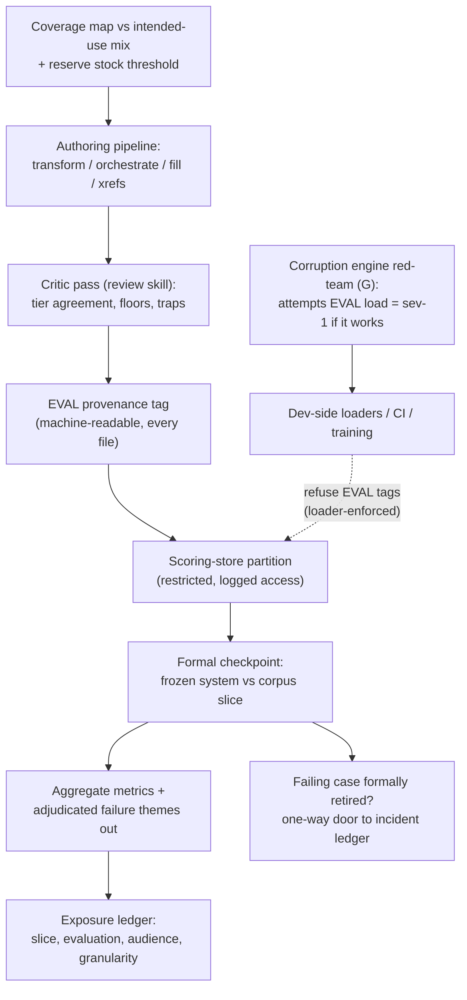

# Primer C — Casebundle Evaluation Corpus (Firewalled)

> **Architecture spine.** The project's spine is the deterministic-release doctrine plus the signed content registry: *ML proposes and tests; only arithmetic releases.* Three spine attachments raise the spec: **conformal prediction** (Primer F) makes the probabilistic side honest, the **corruption engine** (Primer G) proves the deterministic side holds, and the **Lumos validation pathway** (Primer H) shows the whole assembly tracks reality. This primer's position: the independent examiner of the assembled spine, firewalled from all development flows; the corruption engine (G) red-teams its loader enforcement, never its cases. The six-mechanism **living evaluation stack** (Primer I) replaces archival golden-case regression throughout: properties + library self-consistency pre-release, differential testing for change review, distributional gates for promotion, runtime contracts + shadow evaluation in production — regenerating from living sources so nothing fossilises. The **model governance contract** (Primer J) is the second lattice, peer to I: I governs changes, J governs learned artifacts — no model trains on ungoverned data, acts without a card, or verifies anything whose errors it is positioned to share.

## C1. What this is

The independent examination instrument: authored synthetic case bundles (eight-node structure, ground truth, conversational policy, management plan, safety netting) whose *entire value is that the systems under test have never learned from them*. It answers one question at formal checkpoints — "how does the assembled system actually perform?" — and must be spent on nothing else. This session itself demonstrated the threat model: the corpus is the most *convenient* seed for dev-side test suites precisely because it resembles the thing under test, and convenience defeats discipline. The firewall must therefore be structural.

## C2. Scope

**In scope:** corpus authoring pipeline (transform/orchestrate/fill/xrefs/review roles); the scoring-store partition (00/01/02 vs 10/11/12/13 split); provenance tagging of every asset as EVAL; the evaluation protocol (when, what metrics, who sees results at what granularity); corpus versioning and coverage mapping against the intended-use presentation mix.

**Out of scope — absolutely:** any development use. Not regression seeds, not training data, not prompt-tuning references, not corruption-engine substrate, not "just to debug this one thing." Dev-side needs are met by DDXPlus, PMC extractions, library-generated synthetic cases, and purpose-written material — never this corpus.

## C3. Breadth and depth of content required

- **Coverage:** cases distributed across the quadrant model and the intended-use condition domains, deliberately over-weighted on can't-miss presentations and commission traps (encoded negatively); coverage gaps tracked as a first-class metric.
- **Ground truth quality:** the review/critic pass (tier-plan agreement, floors exceeded not merely met, unresolved items answered) plus eventual clinician attestation for the subset used in formal claims.
- **Independence hygiene:** authorship provenance recorded per case; where generation shared infrastructure with the system under test, that shared-DNA caveat is documented and offset by externally sourced eval material at validation time (blind-spot correlation is the known residual risk).
- **Refresh stock:** cases *are* spent — each formal evaluation whose results inform development consumes independence. Maintain an unexposed reserve and an authoring cadence that outpaces consumption.

## C4. Building in a silo

The corpus programme already is a silo by design; the additions are enforcement and accounting. Enforcement: EVAL provenance tags machine-readable in every file; dev-side tooling (CI, harness loaders, training pipelines) *refuses* eval-tagged assets at the loader level; access to the scoring partition restricted and logged. Accounting: an exposure ledger — which corpus slices have been used in which evaluations, seen by whom, at what result granularity (aggregate metrics can be shared widely; per-case results only to the evaluation role). Authoring proceeds against the coverage map, independent of engine/library release cadence.

## C5. Folding it in

The corpus never folds *into* the development flow — the fold-in is the evaluation protocol around it. Formal checkpoints (pre-release milestones, regulatory evidence generation) run the frozen system against a designated corpus slice; results return as aggregate metrics + adjudicated failure themes; individual failing cases either stay quarantined or are formally *retired* from the eval corpus into the incident ledger (a one-way door, logged). Validation dossiers cite corpus evaluations alongside external benchmarks — the pairing ("methodology proven on public data, performance shown on independent internal corpus") is the credibility structure.

## C6. Definition of done

Firewall is technically enforced and has survived a deliberate red-team attempt to load eval assets dev-side; exposure ledger complete; coverage map meets the intended-use mix with can't-miss over-weighting; reserve stock above threshold; every case carries provenance, review verdicts, and (for claim-bearing slices) attestation status.

## C7. Internal operations diagram




## C8. Execution layer

**EVAL provenance tag (embedded in every corpus file):**

```json
{"provenance":{"class":"EVAL","corpus":"breath-ezy","case_id":"SPEC-0417","authored":"2026-07-29",
 "pipeline_version":"casedough-2.1","shared_dna":{"generator_family":"same-as-SUT","offset":"external-eval-material"},
 "partition":"scoring-store","exposure_ids":[]}}
```

**Loader refusal (pseudocode, mandatory in every dev-side loader):**

```
def load(path):
    meta = read_provenance(path)
    if meta.class == "EVAL": raise FirewallViolation(path)  # sev-1, alarmed, logged
    if meta.class not in {"DEV","PUBLIC","PROD-DEID"}: raise UnknownProvenance(path)
    return parse(path)
```

**Exposure-ledger record (one per evaluation event):** `{eval_id, date, corpus_slice, system_version, protocol_ref, audience:{aggregate:[roles], per_case:[roles]}, results_granularity, cases_retired:[ids], independence_cost_note}`. The ledger is append-only and reviewed at every checkpoint planning session — a slice's accumulated exposure is an input to whether it can carry the next formal claim.

**Checkpoint protocol (numbered):** 1. Freeze and name the system version (all pins). 2. Evaluation role selects the slice against the coverage map and exposure ledger; development roles are not consulted on selection. 3. Run; raw per-case results land only in the scoring partition. 4. Evaluation role produces aggregate metrics + adjudicated failure themes. 5. Failure cases: quarantine, or formally retire to the incident ledger (one-way, logged, perturbation-paired per G). 6. Ledger updated; reserve-stock check; authoring backlog adjusted against coverage gaps.

**Coverage targets (initial, per clinical domain in scope):** ≥ 8 cases per quadrant (HALC/HAHC/LALC/LAHC), of which ≥ 3 can't-miss presentations and ≥ 2 commission traps per domain; reserve threshold = one full unexposed replacement per claim-bearing slice. Targets are policy, versioned, and revised from telemetry-observed presentation mix.

## Production topology annotation

*Per Architecture §11:* Authoring proceeds continuously from L1, firewalled throughout; the corpus store lives in its own AWS account from day one (firewall as account boundary); **first formal checkpoint at L4** against a frozen version; scheduled checkpoints from L5.

## Register topology annotation

*Per Architecture §12 (register numbers R1–R28):* **Owns:** Coverage Map (R9, L1) and Exposure Ledger (R21, L4) — both inside the corpus account boundary. **Writes:** retirements into the Incident Ledger (R20, one-way). **Reads:** R1 to name frozen versions at checkpoints. The credential firewall applies to its registers exactly as to its cases.

<!-- ECOSYSTEM-V2-BLOCK: C v1.0 -->
## C9. Build Execution Extension (Ecosystem v2.0)

**1. Mini-North-Star.** WHAT: the corpus-account loader-refusal library, exposure-ledger service, and checkpoint runner — build artifacts only, zero case content. WHY: the independent examiner stays independent by construction. Endpoint: registers open L1; first checkpoint L4. Derives from and cites SPINE §13.1.

**2. Doctrine classification.** Loader refusal and ledger writes are arithmetic; authoring pipelines propose and sit outside this block scope. Mandate met: this block was authored without EVAL credentials.

**3. Scoped recon register.**
| ID | Verify | Tag |
|---|---|---|
| RECON-C-001 | Corpus AWS account boundary; zero dev-CI credentials, from IAM policy dump | E:REPO (infra) |
| RECON-C-002 | EVAL tag schema version in spine | E:REPO |

**4. Work register seed (Release-1-equivalent; schema per master v2 Phase 6; estimates ranged with confidence).**
```yaml
TASK-C-001:
  story: STORY-C-001 (the evaluator trusts the wall)
  component: corpus-infra
  title: Implement loader refusal per C8 pseudocode as shared library
  purpose_chain: {what: "refusal library + sev-1 alarm path", why: "the firewall must be code, not memo", endpoint_ref: "L1 exit (R9 open); SPINE-NS WHY"}
  evidence_refs: [E:DOC C8; RECON-C-002]
  definition_of_ready: ["tag schema pinned"]
  steps: ["provenance parse", "EVAL raise + alarm", "unknown-class raise"]
  test_plan: "unit + red-team fixture: an EVAL-tagged file must raise in every dev loader (G stage-3 run)"
  observability: "FirewallViolation alarm to on-call; counter by loader"
  definition_of_done: ["red-team load raises", "alarm fired in test"]
  estimate: {optimistic: 1d, likely: 2d, pessimistic: 3d, confidence: high}
  depends_on: []
```

**5. Orchestration hooks.** `WF-C-1` checkpoint: freeze-name → slice-select (evaluation role) → run → aggregate → R21 append (idempotent by eval_id; no retry mid-run — a partial checkpoint is void and restarted whole).

**6. Observer checkpoint spec.** The Observer verifies from R21/R9 aggregate rows only — never case content; it holds no corpus credentials; an adjudication that touched content is void (the firewall restated as the Observer own prohibition). Admissible: R21 aggregates, R9 coverage counts, alarm logs.

**7. Implementer Contract binding.** This component's tickets execute under IMPL (SPINE §13.2). HALT trigger: any ticket requiring EVAL credentials in a dev context → HALT: SPEC-CONFLICT to spine.

**8. Gaps and register proposals.** GAP-C-001 → RESOLVED by ratification: the spine-replicated aggregate view is **R28 — Checkpoint Aggregate Mirror** (Arch §12.2); the Observer reads R28, never the corpus account.

<!-- MET-1 METAMORPHOSIS & HARDENING ANNEX — APPENDED 2026-09-01. Pure append per X1 discipline; zero edits to pre-existing text above. Status of this annex: Proposed (ratification via MET-2 decision queue); Hardening state of this document: PENDING in R29 (seed row in HARDEN-1) — nothing here is HARDENED. -->
## C10. Metamorphosis & Hardening Annex — fabric binding, HeyDoc seed intake, hardening boundary

**Boundary reaffirmed, twice.** (1) The credential firewall is untouched by this pass: dev CI holds no corpus credential; the Observer rules from R21/R9 aggregates only; MT2 §6 makes any weakening a stop-the-line event. (2) The hardening pass itself must respect the firewall: corpus-side artifacts are enumerated in R29 by *path and class only*; their hardening is executed by the evaluation-role holder inside the corpus account, with evidence exported as aggregates through the R28 mirror pattern — the pass never opens casebundle content.

**HeyDoc seed intake (histolysis transfer — Proposed).** The retired repo's two-store case architecture (presentation store 00–02 / scoring store 10–13) is this corpus's direct lineage, and its first clinician-reviewed case (`SPEC-CARD-04-00001`, atypical NSTEMI) plus its schemas are candidate seed material. Intake rule: transfer occurs **only** under corpus-account credentials by the authoring role; provenance (source repo, commit, clinician-review flag) is recorded in the Coverage Map (R9); the T0–T5 asymmetric under-triage scoring design is adopted as authoring-role input, with its numeric weights re-ratified through corpus governance rather than inherited.

| Execution field | Content |
|---|---|
| Execution purpose | Keep the independent exam independent while absorbing the retired attempt's exam assets lawfully |
| Inputs / prerequisites | Corpus-account credentials (authoring/evaluation roles); C8 EVAL tag + loader-refusal machinery; HeyDoc clone (G-08 inventory pending) |
| Steps | 1 authoring role clones HeyDoc case + schemas into the corpus account → 2 provenance rows in R9 → 3 re-ratify scoring weights → 4 continue continuous authoring → 5 checkpoints only at L4+ per C8 protocol → 6 exposure logged (R21), aggregates mirrored (R28) |
| Tools / repos / environments | `cdss-corpus` in its own AWS account (the firewall as an account boundary) |
| Outputs & acceptance | Checkpoint aggregate results only; acceptance = C6 definition of done; checkpoint metrics meet pre-set floors at L4 |
| Dependencies / handoffs | Consumes frozen assembly versions at checkpoints; hands aggregates to Observer via R28; never participates in Primer I mechanisms |
| Evidence to collect | R9 coverage rows (incl. seed provenance); R21 exposure entries; R28 mirrored aggregates |
| Failure handling / rollback | EVAL-tagged asset loaded outside the account → loader refuses + incident (R20); any dev-side credential appearance → halt + escalate (MT2 §6) |
| Ownership & status | Repo/account: `cdss-corpus`; corpus custodian [NEEDS DEFINITION]. Status: Retained (firewall) + Added (seed-intake procedure, Proposed) |
| Source & research traceability | Primer C §C1–C8; HeyDoc README (fetched 1 Sep 2026 — below-README contents [NEEDS SOURCE]); MT2 §1(7)/§6; Arch §12.2 R9/R21/R28 |
