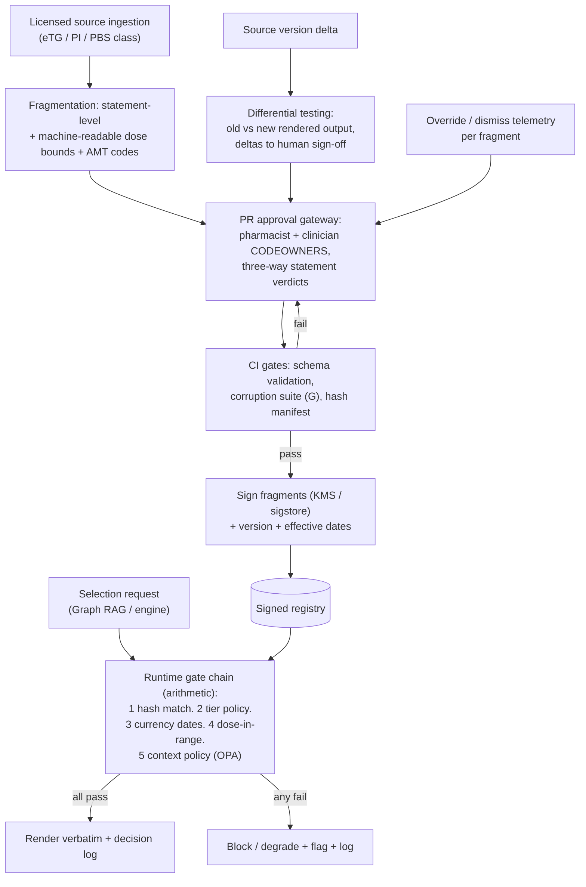

# Primer D — Content Registry (Signed, Versioned Fragments)

> **Architecture spine.** The project's spine is the deterministic-release doctrine plus the signed content registry: *ML proposes and tests; only arithmetic releases.* Three spine attachments raise the spec: **conformal prediction** (Primer F) makes the probabilistic side honest, the **corruption engine** (Primer G) proves the deterministic side holds, and the **Lumos validation pathway** (Primer H) shows the whole assembly tracks reality. This primer's position: the spine made concrete — signed fragments and arithmetic gates standing between authoritative content and the screen; the corruption engine (G) is its standing adversary with a 100% safety-class catch requirement. The six-mechanism **living evaluation stack** (Primer I) replaces archival golden-case regression throughout: properties + library self-consistency pre-release, differential testing for change review, distributional gates for promotion, runtime contracts + shadow evaluation in production — regenerating from living sources so nothing fossilises. The **model governance contract** (Primer J) is the second lattice, peer to I: I governs changes, J governs learned artifacts — no model trains on ungoverned data, acts without a card, or verifies anything whose errors it is positioned to share.

## D1. What this is

The authoritative store for everything rendered verbatim to clinicians — treatment guidance, medication information, dosages — as structured fragments, each carrying: content hash, source identity, source version, effective/review dates, evidence/verification tier, jurisdiction, and a cryptographic signature. The registry is the object the deterministic release gates check *against*: a fragment renders only if its hash matches a signed entry, its tier passes policy, its dates are current, and its values sit inside its own declared bounds. Nothing generative ever writes to it; nothing renders except from it.

## D2. Scope

**In scope:** fragment schema (including machine-readable dose bounds per agent/route/age-band, AMT coding of every medication); the content-as-code repo and PR approval gateway (CODEOWNERS: pharmacist + clinician; branch protection; signed commits); CI release gates (schema validation, corruption suite, hash-manifest generation, artifact signing); the runtime policy layer (OPA/Rego or cloud equivalent) expressing tier/currency/context rules; the serving API with per-request gate evaluation and full decision logging.

**Out of scope:** deciding *which* fragment is relevant (Graph RAG/engine selection); authoring clinical content de novo (fragments derive from licensed authoritative sources under their terms); diagnosis-side evidence (library territory).

## D3. Breadth and depth of content required

- **Source licences first:** the registry's breadth is bounded by what is licensed for redisplay (eTG/AMH-class content, TGA PIs/CMIs, PBS data). Licence scope-of-use is a planning-critical input, not an afterthought.
- **Fragment granularity:** statement/recommendation-level, not document-level — the MedAESQA lesson: approval, verification, and rendering all operate per statement.
- **Structured bounds:** every dosage fragment must carry its own min/max/units/route/age-band machine-readably — this is what makes runtime range-checking arithmetic. Extracting these bounds from prose sources is the main data-engineering effort.
- **Coding:** AMT for medications, SNOMED CT-AU for conditions/contexts, so context gates and Graph RAG edges are deterministic joins.
- **Depth floor for v1:** one clinical domain end-to-end (all fragments, bounds, tiers, policies) beats broad shallow coverage — the gate machinery is domain-agnostic once proven.

## D4. Building in a silo

The registry silo is buildable almost entirely with commodity parts: Git + CI + OPA + a signing service (cosign/KMS) + a thin serving layer. Internal development runs against a synthetic fragment set plus the corruption engine as the adversary — done, silo-side, means the reference gate stack catches 100% of safety-class corruptions (tampered hashes, out-of-bounds doses, stale versions, context mismatches) before any real licensed content enters. Real content onboarding is then a data pipeline exercise: source ingestion → fragmentation → bounds extraction → statement-level three-way review in the PR queue → tier assignment → merge.

## D5. Folding it in

Stage 1: registry serves a single domain to the display layer with the full gate chain live and every decision logged. Stage 2: Graph RAG and engine outputs begin *selecting* registry fragments (selection probabilistic, verification arithmetic — the boundary holds). Stage 3: differential testing becomes the update gateway — source version deltas (new PI, revised guideline) are diffed as rendered output across sampled presentations; adjudicated deltas are the change-control record. Stage 4: telemetry on the treatment-content class (override/dismiss per fragment) feeds the correction pipeline back into the PR flow; superseded-source alerts from the freshness monitor auto-open review items.

## D6. Definition of done

Every rendered fragment traceable to a signed registry entry byte-for-byte; gate chain wholly deterministic and independently auditable; corruption catch rate 100% on safety class, sustained per release; approval records statement-level and reviewer-attributed; update latency from source revision to reviewed registry change within agreed SLO; complete per-request decision logs.

## D7. Internal operations diagram




## D8. Execution layer

**Fragment schema (statement-level):**

```json
{"fragment_id":"frag-amox-cap-ad-001","statement":"Amoxicillin 1 g orally, 8-hourly for 5 days",
 "kind":"dose_regimen","codes":{"amt":"AMT-xxxxxx","condition_snomed":"233604007"},
 "bounds":{"dose_min_mg":250,"dose_max_mg":1000,"interval_h":[8,12],"route":"oral","age_band":"adult",
  "renal_adjust_ref":"frag-amox-renal-001"},
 "source":{"id":"src-etg-2026-resp","version":"2026.2","effective":"2026-03-01","review_by":"2027-03-01"},
 "tier":{"E":"E1","V":"V1"},"jurisdiction":"AU",
 "approval":{"pharmacist":"…","clinician":"…","verdicts":"statement-level, three-way"},
 "hash":"sha256:…","signature":"cosign:…"}
```

**OPA gate skeleton (the five checks as policy):**

```rego
default render := false
render if { hash_valid; tier_ok; current; in_bounds; context_ok }
hash_valid if input.fragment.hash == data.registry[input.fragment.fragment_id].hash
tier_ok    if input.fragment.tier.E == "E1"; input.fragment.tier.V == "V1"
current    if time.now_ns() < time.parse_rfc3339_ns(input.fragment.source.review_by)
in_bounds  if input.render.dose_mg >= input.fragment.bounds.dose_min_mg
              input.render.dose_mg <= input.fragment.bounds.dose_max_mg
context_ok if not data.exclusions[input.context.age_band][input.fragment.fragment_id]
```

**CODEOWNERS (verbatim pattern):** `content/fragments/** @clinical-reviewers @pharmacist-reviewers` with branch protection requiring both, signed commits, and CI (schema check, G suite, hash manifest) as required status checks.

**Decision-log record (per render attempt):** `{ts, encounter_ref, fragment_id, fragment_hash, gates:{hash,tier,currency,bounds,context}→pass/fail each, policy_version, outcome:render|block|degrade, latency_ms}` — append-only, queryable by fragment for telemetry joins.

## Production topology annotation

*Per Architecture §11:* Enters at **L2** as the level's centrepiece — schema, PR gateway, OPA chain, KMS/cosign signing, decision logs; multi-domain at L4; S3 object-lock + per-environment accounts per §11.4.

## Register topology annotation

*Per Architecture §12 (register numbers R1–R28):* **Owns:** Decision Log (R11, append/object-lock, L2). **Writes:** fragment versions to R1; source deltas to R12 via differential testing. **Reads:** R6 (source identities), R5 (licence class), R22 (if K assists the PR queue). Every render attempt is an R11 entry including blocks.

<!-- ECOSYSTEM-V2-BLOCK: D v1.0 -->
## D9. Build Execution Extension (Ecosystem v2.0)

**1. Mini-North-Star.** WHAT: the registry service, gate chain, signing path, and decision-log stream per D8. WHY: the spine made concrete. Endpoint: enters at L2 as that level centrepiece. Derives from and cites SPINE §13.1.

**2. Doctrine classification.** All five gates, signing, and logs are arithmetic; fragment authoring and K pre-screening propose.

**3. Scoped recon register.**
| ID | Verify | Tag |
|---|---|---|
| RECON-D-001 | OPA version + Rego semantics for the D8 skeleton | E:WEB at ticket start |
| RECON-D-002 | KMS/cosign signing flow in target accounts | E:REPO (infra) |
| RECON-D-003 | Source licence scope-of-use for the first domain | E:DOC R5; E:USER |

**4. Work register seed (Release-1-equivalent; schema per master v2 Phase 6; estimates ranged with confidence).**
```yaml
TASK-D-001:
  story: STORY-D-001 (clinician sees only verified verbatim content)
  component: gate-chain
  title: Implement five-gate evaluation per D8 Rego
  purpose_chain: {what: "gate service + per-request decision record", why: "no render without a full arithmetic pass", endpoint_ref: "L2 exit (100pct catch x3); SPINE-NS WHY"}
  evidence_refs: [E:DOC D8; RECON-D-001]
  definition_of_ready: ["fragment schema pinned", "G rows 6–12 fixtures ready"]
  steps: ["hash gate", "tier gate", "currency gate", "bounds gate", "context gate", "R11 append including blocks"]
  test_plan: "G rows 6–12 all caught; near-miss row 2 passes clinical-fidelity mode; block-path latency test"
  observability: "R11 stream; alert on any gate-eval error"
  definition_of_done: ["G catch 100pct", "decision log complete for blocks"]
  estimate: {optimistic: 3d, likely: 5d, pessimistic: 8d, confidence: medium}
  depends_on: []
```

**5. Orchestration hooks.** `WF-D-1` fragment promotion: PR (dual CODEOWNERS) → CI (schema + G + manifest) → sign → publish (idempotent by fragment hash; timeout 30m; retry 1; a failed sign compensates by revoking the publish-intent record). `EVT-D-1 fragment.published` → graph rebuild (E) and WF-SPINE-1.

**6. Observer checkpoint spec.** At L2 exit: three consecutive releases at 100pct safety-class catch, evidenced from R11 + CI; delta sign-offs in R12 for every source version change. Admissible: R11, R12, CI artifacts, signing logs.

**7. Implementer Contract binding.** This component's tickets execute under IMPL (SPINE §13.2). HALT trigger: any ticket proposing a model inside the gate path → HALT: SPEC-CONFLICT (doctrine breach), routed to spine.

**8. Gaps and register proposals.** None new; build assumptions home in **R25** (ratified, Arch §12.2).

<!-- MET-1 METAMORPHOSIS & HARDENING ANNEX — APPENDED 2026-09-01. Pure append per X1 discipline; zero edits to pre-existing text above. Status of this annex: Proposed (ratification via MET-2 decision queue); Hardening state of this document: PENDING in R29 (seed row in HARDEN-1) — nothing here is HARDENED. -->
## D10. Metamorphosis & Hardening Annex — fabric binding + updated execution block

**Fabric binding.** The five-gate chain is the deterministic evaluator's content-release check-set (SPINE-7 made concrete); a passing fragment renders **verbatim inside the argument's claim**, cited and tiered. The register-render law (SPINE-3) never alters fragment text — faces may compress argument scaffolding, never the authoritative words. GPP interaction: fragments carrying `profile: GPP` stamps (GPP-11) are the only content the J-3 artifact serves, and its gate chain refuses probabilistic qualifiers by type (GPP-9).

| Execution field | Content |
|---|---|
| Execution purpose | Remain the signed source of truth for authoritative content; expose the gates as evaluator checks |
| Inputs / prerequisites | Fragment schema + dose-bounds block (D8); OPA gate policy (D8); signing (KMS/cosign); CODEOWNERS (pharmacist + clinician) |
| Steps | 1 fragment authored from source → 2 PR gateway review → 3 sign + version → 4 runtime: pointer arrives from graph → 5 gate chain: hash / tier / currency / range / context → 6 all pass → verbatim render into claim + decision log (R11); any fail → block/degrade + log |
| Tools / repos / environments | `cdss-registry` (signing keys never leave); OPA sidecar or managed equivalent (Arch §11.4) |
| Outputs & acceptance | Signed fragment bundles + per-render decision-log entries; acceptance = L2 exit (100% corruption catch across three consecutive releases) sustained forever after |
| Dependencies / handoffs | Upstream: compiler-adjacent authoring, K3.2 dose-bounds extraction (proposer with pharmacist verifier); downstream: evaluator, faces, GPP channel |
| Evidence to collect | R11 decision log (append, object-lock); G catch-rate reports; SBOMs (R3) |
| Failure handling / rollback | Fail-closed on any gate; degraded mode = most-restrictive; key-custody incident → halt + R20; rollback = prior bundle pin |
| Ownership & status | Repo: `cdss-registry`; owner [NEEDS DEFINITION]. Status: Retained; GPP stamp handling Added (Proposed, pending DEC-06) |
| Source & research traceability | Primer D §D1–D8; MAK-FFC SPINE-3/7; MAK-J3 GPP-9/11; MAK-CEC RG rows (cross-walk duty in I10) |
