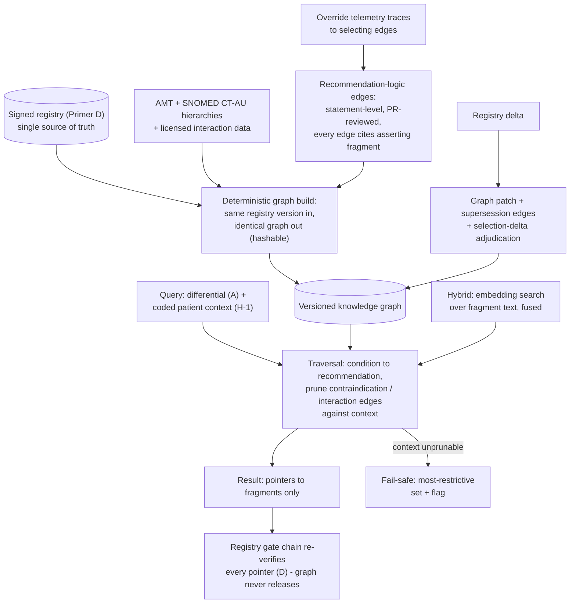

# Primer E — Graph RAG (Treatment / Medication / Dosage Evidence and Recommendations)

> **Architecture spine.** The project's spine is the deterministic-release doctrine plus the signed content registry: *ML proposes and tests; only arithmetic releases.* Three spine attachments raise the spec: **conformal prediction** (Primer F) makes the probabilistic side honest, the **corruption engine** (Primer G) proves the deterministic side holds, and the **Lumos validation pathway** (Primer H) shows the whole assembly tracks reality. This primer's position: the most sophisticated selector in the system, and still only a selector — every traversal result is re-verified by the registry's deterministic gate chain before rendering. The six-mechanism **living evaluation stack** (Primer I) replaces archival golden-case regression throughout: properties + library self-consistency pre-release, differential testing for change review, distributional gates for promotion, runtime contracts + shadow evaluation in production — regenerating from living sources so nothing fossilises. The **model governance contract** (Primer J) is the second lattice, peer to I: I governs changes, J governs learned artifacts — no model trains on ungoverned data, acts without a card, or verifies anything whose errors it is positioned to share.

## E1. What this is

The relationship-aware retrieval layer over the registry: a knowledge graph whose **nodes** are registry-anchored entities (conditions, medications as AMT concepts, dose regimens, contraindications, interactions, monitoring requirements, guideline recommendations, source documents) and whose **typed edges** carry the clinical structure flat retrieval loses — *first-line-for*, *second-line-after-failure-of*, *contraindicated-in*, *interacts-with*, *dose-adjusted-by* (renal function, age, weight), *superseded-by*, *evidence-for*. Retrieval becomes traversal: "treatment for condition X in a patient with context Y" walks condition → recommendation edges, prunes by contraindication/interaction edges against the coded patient context, and returns *pointers to registry fragments* — which then render verbatim through the full gate chain. Under the doctrine: **the graph selects; the registry verifies; arithmetic releases.** Graph RAG is the most sophisticated selector in the system and still never holds the door.

## E2. Scope

**In scope:** graph schema (node/edge types, mandatory registry-fragment anchoring — no free-floating clinical assertions); construction pipeline from registry fragments + coded terminologies; traversal/query service (context-conditioned retrieval, contraindication pruning, interaction surfacing); hybrid retrieval (graph traversal + embedding search over fragment text, fused); provenance on every edge (which fragment/source asserts this relationship, at what tier); graph versioning locked to registry versions.

**Out of scope:** rendering content (registry/display); generating recommendations not present as registry fragments (an edge may only exist if an authoritative fragment asserts it); dose calculation or individualisation (out of scope for the whole system unless/until separately validated as its own SaMD function — the graph surfaces the authoritative regimen and its adjustment rules verbatim, it does not compute a patient's dose); diagnosis (engine territory — the graph starts from the differential the engine hands it).

## E3. Breadth and depth of content required

- **Substrate:** the registry itself — the graph is a *derived index*, never a second source of truth. Every edge cites its asserting fragment; registry updates trigger graph rebuild/patch.
- **Terminology backbone:** AMT + SNOMED CT-AU relationship structure gives a large share of edges for free (ingredient/form/strength hierarchies, condition hierarchies); licensed interaction datasets add the *interacts-with* layer (licence scope again planning-critical).
- **Relationship extraction effort:** the human-priced input is encoding recommendation logic (line-of-therapy, context adjustments) from guideline prose into edges — statement-level, reviewed in the same PR flow as fragments, since a wrong edge is a wrong clinical claim even when every node is authentic.
- **Evaluation material:** manufactured graph corruptions (dropped contraindication edge, inverted line-of-therapy, stale edge surviving a registry supersession) as the corruption engine's graph-flavoured extension; a clinician-authored query gold set (context-conditioned questions with expected fragment sets) — a few hundred queries, scored by fragment-set overlap.

## E4. Building in a silo

Build against a synthetic registry slice first: schema, construction pipeline, traversal service, hybrid fusion, all proven with manufactured content and corruptions before licensed data enters. Managed graph infrastructure keeps this rapid (Neptune/Cosmos Gremlin, or Postgres+pgRouting at prototype scale); the differentiating work is schema discipline and edge provenance, not database operations. Silo-side scorecards: recall/precision of retrieved fragment sets against the query gold set; 100% catch of safety-class graph corruptions (a pruned contraindication must never fail silently); rebuild determinism (same registry version in → identical graph out, hashable).

## E5. Folding it in

Stage 1: shadow selector — the graph answers alongside the existing flat retrieval; deltas adjudicated (differential testing again, now over selection). Stage 2: live selector behind the registry gate chain; runtime contract that every returned pointer resolves to a currently-signed, currently-valid fragment and that contraindication pruning ran against the coded context (fail-safe: unprunable context → most-restrictive result set + flag). Stage 3: registry update integration — source deltas propagate as graph patches with their own diff-adjudication; *superseded-by* edges keep retired guidance findable-but-blocked rather than silently vanished. Stage 4: telemetry — clinician overrides on surfaced recommendations trace to the edges that selected them, feeding edge review the same way fragment overrides feed content review.

## E6. Definition of done

Every edge fragment-anchored, tiered, and provenance-complete; no traversal result can surface content the registry gates would not independently pass; query gold-set targets met; graph corruption catch rate 100% on safety class; rebuild deterministic and version-locked to the registry; selection-delta adjudication operating as the standing change gateway.

## E7. Internal operations diagram




## E8. Execution layer

**Node/edge type table (initial):**

| Element | Type | Mandatory fields |
|---|---|---|
| Node | Condition | snomed_ct, label |
| Node | Medication | amt_code, label |
| Node | DoseRegimen | fragment_ref (D), bounds_ref |
| Node | Recommendation | fragment_ref, line_of_therapy |
| Node | SourceDoc | src_id, version |
| Edge | first_line_for | asserting_fragment, tier, effective/review dates |
| Edge | second_line_after_failure_of | asserting_fragment, predecessor_ref |
| Edge | contraindicated_in | asserting_fragment, context_snomed, severity |
| Edge | interacts_with | asserting_fragment or licensed-interaction-src, severity |
| Edge | dose_adjusted_by | asserting_fragment, parameter (eGFR/age/weight), adjustment_fragment_ref |
| Edge | superseded_by | old_fragment, new_fragment, date |

Rule restated as schema law: **no edge without `asserting_fragment` (or licensed interaction source)** — an unanchored edge fails the build.

**Worked traversal 1 (clean):** query {condition: CAP, context: adult, no flags} → `first_line_for` → Recommendation(frag-amox-cap-ad-001) → DoseRegimen → pointers `[frag-amox-cap-ad-001]` → registry gates → render. **Worked traversal 2 (pruned):** same query, context includes `penicillin allergy (SNOMED 91936005)` → `contraindicated_in` edge fires on the amoxicillin branch → branch pruned → `second_line_after_failure_of` path surfaces doxycycline recommendation → pointers → gates. If the allergy context is present but *uncodeable* to a known concept: fail-safe → most-restrictive set (both branches suppressed, flag raised) per E5.

**Rebuild determinism test (per release):** build twice from the same registry version on independent workers; canonical-serialise (sorted nodes/edges); compare SHA-256. Mismatch = release-blocking defect. Graph version string = `registry_version + build_toolchain_version`.

## Production topology annotation

*Per Architecture §11:* Enters at **L3** as v0 (first-line, contraindication, supersession edges; one domain; Aurora-pg acceptable); multi-domain at L4 (Neptune when load justifies); NL query (L4 capability of Primer L) only at L5.

## Register topology annotation

*Per Architecture §12 (register numbers R1–R28):* **Owns:** none — the graph is a derived index; its build hash registers in R2 and its version locks to the registry version in R1. **Writes:** selection-delta adjudications to R12. **Reads:** R11-adjacent telemetry for edge review.

<!-- ECOSYSTEM-V2-BLOCK: E v1.0 -->
## E9. Build Execution Extension (Ecosystem v2.0)

**1. Mini-North-Star.** WHAT: deterministic graph build + traversal service per E8. WHY: the most sophisticated selector, still only a selector. Endpoint: v0 at L3; multi-domain at L4. Derives from and cites SPINE §13.1.

**2. Doctrine classification.** Build-determinism check and pointer re-verification are arithmetic; traversal and hybrid ranking propose.

**3. Scoped recon register.**
| ID | Verify | Tag |
|---|---|---|
| RECON-E-001 | Aurora pg version + extension set for L3 scale | E:WEB |
| RECON-E-002 | AMT/SNOMED CT-AU release consumed, by drop date | E:REPO |
| RECON-E-003 | Interaction-data licence scope | E:DOC R5; E:USER |

**4. Work register seed (Release-1-equivalent; schema per master v2 Phase 6; estimates ranged with confidence).**
```yaml
TASK-E-001:
  story: STORY-E-001 (clinician sees only context-safe recommendations)
  component: graph-build
  title: Deterministic build with unanchored-edge failure
  purpose_chain: {what: "build job whose output hash is a function of the registry version", why: "an unanchored edge is a wrong clinical claim", endpoint_ref: "L3 exit (rebuild hash equality); SPINE-NS WHY"}
  evidence_refs: [E:DOC E8; RECON-E-002]
  definition_of_ready: ["registry v1 domain published", "edge PRs merged"]
  steps: ["ingest fragments + terminology", "edge anchor check with build-fail on miss", "canonical serialise + hash"]
  test_plan: "double-build hash equality in CI; G row 13 (dropped contraindication) must fail the pruning test loudly"
  observability: "build-hash metric per registry version; alert on mismatch"
  definition_of_done: ["hashes equal", "row-13 fixture loud-fails"]
  estimate: {optimistic: 3d, likely: 5d, pessimistic: 8d, confidence: medium}
  depends_on: []
```

**5. Orchestration hooks.** `WF-E-1` rebuild on `EVT-D-1` (idempotent by registry version; timeout 45m; retry 2; supersession edges verified before swap; on verification failure the previous graph stays live — compensation = no-swap).

**6. Observer checkpoint spec.** At L3: rebuild determinism evidenced; selection-delta adjudications (R12) filed for the first registry delta. Admissible: build hashes in R2, R12, CI artifacts.

**7. Implementer Contract binding.** This component's tickets execute under IMPL (SPINE §13.2). HALT trigger: any ticket creating an edge without an asserting-fragment ref → HALT: DOR-FAIL (schema law).

**8. Gaps and register proposals.** None new.

<!-- MET-1 METAMORPHOSIS & HARDENING ANNEX — APPENDED 2026-09-01. Pure append per X1 discipline; zero edits to pre-existing text above. Status of this annex: Proposed (ratification via MET-2 decision queue); Hardening state of this document: PENDING in R29 (seed row in HARDEN-1) — nothing here is HARDENED. -->
## E10. Metamorphosis & Hardening Annex — fabric binding + updated execution block

**Fabric binding.** Two promotions. (1) Contraindication prunes become **rebuttal content**: what the graph removed, and why, is recorded on the argument rather than silently absent — the rebuttal slot is mandatory when findings exist (SPINE-2). (2) The supersession edges become the substrate for **plural guideline lineages** (SPINE-6): when two applicable GenericArguments conflict, the graph materializes a `DetectedIssue` attached to both and surfaces it to the clinician face; it never silently ranks, merges, or suppresses one side. Coordination doctrine: MAK-MIF beat 4 (graded applicability gives the conflict a shape; the clinician's choice between systems is recorded as the meta-rational act it is).

| Execution field | Content |
|---|---|
| Execution purpose | Select, prune, and now *explain the pruning* — pointers plus rebuttals plus surfaced conflicts |
| Inputs / prerequisites | Registry version (rebuild = f(registry version)); node/edge table + worked traversals + determinism test (E8); coded patient context |
| Steps | 1 deterministic rebuild from registry pin → 2 hash the build → 3 runtime traversal from conformal-set diagnoses → 4 prune vs coded context, emitting rebuttal records → 5 detect co-applicable conflicting recommendations → DetectedIssue → 6 emit fragment pointers only |
| Tools / repos / environments | `cdss-graph`; Aurora PostgreSQL at L3 scale, Neptune when justified (Arch §11.4) |
| Outputs & acceptance | Hashable graph builds; pointers + rebuttal records + DetectedIssues; acceptance = rebuild determinism (hash equality, L3 exit) + new pluralism test (§12.8 of MET-1 v1.0: conflict surfaces, never merges) |
| Dependencies / handoffs | Upstream: D (its version is the rebuild input); downstream: gate chain, clinician face conflict UI (MAK-LBP) |
| Evidence to collect | Build hashes in R1; traversal records in traces; DetectedIssue counts in telemetry (R13) |
| Failure handling / rollback | Non-deterministic rebuild = release blocker; traversal timeout → degrade to safety-tier content only + I-5 violation log |
| Ownership & status | Repo: `cdss-graph`; owner [NEEDS DEFINITION]. Status: Retained + Transformed (rebuttal/pluralism promotion, Proposed) |
| Source & research traceability | Primer E §E1–E8; MAK-FFC SPINE-2/6, rebuttal row; MAK-RWC system-choice fold-in; MAK-MIF beat 4 |
