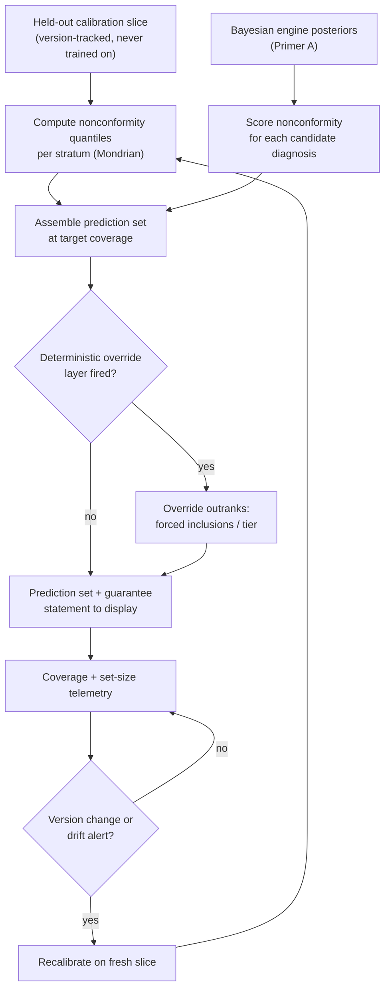

# Primer F — Conformal Prediction Wrapper

> **Architecture spine.** The project's spine is the deterministic-release doctrine plus the signed content registry: *ML proposes and tests; only arithmetic releases.* Three spine attachments raise the spec: **conformal prediction (this primer)** makes the probabilistic side honest, the **corruption engine** (Primer G) proves the deterministic side holds, and the **Lumos validation pathway** (Primer H) shows the whole assembly tracks reality. This primer's position: the honesty layer bolted onto the principal proposer (Primer A) — it turns the engine's soft probabilities into sets with mathematical coverage guarantees, without touching the engine itself. The six-mechanism **living evaluation stack** (Primer I) replaces archival golden-case regression throughout: properties + library self-consistency pre-release, differential testing for change review, distributional gates for promotion, runtime contracts + shadow evaluation in production — regenerating from living sources so nothing fossilises. The **model governance contract** (Primer J) is the second lattice, peer to I: I governs changes, J governs learned artifacts — no model trains on ungoverned data, acts without a card, or verifies anything whose errors it is positioned to share.

## F1. What this is

A distribution-free wrapper around the Bayesian engine that converts its posterior scores into **prediction sets with guaranteed coverage**: "the true diagnosis is in this set X% of the time," where X is chosen, not hoped for. The guarantee holds regardless of how imperfect the underlying model is — it is purchased with a modest held-out calibration slice, not with model quality. It upgrades three things simultaneously: the clinician-facing product (an honest set to narrow from beats a ranked list with soft numbers), the safety case (coverage guarantees on the can't-miss class are the strongest uncertainty statement currently available to a CDSS), and the regulatory dossier (a distribution-free guarantee is a claim a reviewer can independently verify).

## F2. Scope

**In scope:** nonconformity score definition over engine posteriors; calibration-slice management (held out, never trained on, version-tracked); class-conditional / Mondrian calibration so coverage is guaranteed *per stratum* — most importantly a higher coverage level for the red-flag class than the overall target; set-size monitoring (a guarantee met with absurdly large sets is clinically useless — set size is the efficiency metric coverage is traded against); production coverage monitoring; recalibration triggers keyed to the version registry (engine, library, or population change), never the calendar.

**Out of scope:** modifying the engine or its numbers; replacing the deterministic SnNout/override layer (conformal supplements it — the override outranks everything, including the set); treatment content (the wrapper ends where the differential ends); any claim of per-patient probability correctness (the guarantee is marginal/per-stratum coverage, and documentation must say so precisely).

## F3. Breadth and depth of content required

- **Calibration slice:** a few hundred to a few thousand cases with confirmed outcomes, held out from all development — sourced from DEV-tagged synthetic generation initially, upgraded to real adjudicated cases as telemetry matures, ultimately to outcome-linked data (Primer H). The slice is consumed by version: recalibration on a system change requires fresh or re-partitioned data.
- **Machinery proof:** DDXPlus (CC-BY) end-to-end before internal data — coverage empirically verified against known ground truth at scale.
- **Stratification schema:** clinically agreed strata (red-flag class, age bands, presentation quadrants) — each stratum needs enough calibration cases for its own quantile, which is the real constraint on how fine the strata can be.
- **Coverage targets:** set clinically and documented (e.g., 95% overall, higher for can't-miss), with the exchangeability assumption and its limits stated in the same document.

## F4. Building in a silo

The wrapper is a small, stateless library: engine scores + calibration quantiles in, prediction set out. It is drivable to done with zero internal data — DDXPlus proves coverage and set-size behaviour; synthetic library-generated cases prove stratum handling. Silo scorecards: empirical coverage within tolerance per stratum; average and tail set sizes; behaviour under deliberate exchangeability violations (population shift injected — the known failure mode, tested, documented, and wired to the drift monitor rather than assumed away).

## F5. Folding it in

Stage 1: offline — conformal sets computed alongside every engine output in shadow, coverage reports generated per release. Stage 2: display — sets surface in the clinician UI with the guarantee stated plainly; override layer visibly outranks the set. Stage 3: gating — distributional release gates (Primer A, stage 2) adopt conformal coverage tolerance as a promotion criterion. Stage 4: telemetry — production coverage tracked against adjudicated outcomes; version-registry changes trigger recalibration; drift alerts route to the same review loop as calibration curves.

## F6. Definition of done

Coverage within tolerance overall and per stratum on external and internal data; red-flag stratum at its elevated target; set sizes clinically workable (agreed ceiling, monitored); calibration slice provenance and consumption ledger complete; recalibration procedure documented and version-triggered; the guarantee statement, its assumptions, and its limits written in regulator-legible form.

## F7. Internal operations diagram




## F8. Execution layer

**Nonconformity candidates and trade-offs:** (a) `1 − p(true dx)` — simplest, matches the engine's own scale, sensitive to calibration drift; (b) rank-based (position of true dx) — robust to score miscalibration, coarser sets; (c) cumulative-mass (APS-style: mass above the true dx) — best set-size efficiency at equal coverage, slightly more machinery. Recommendation: start (a) for transparency, evaluate (c) once DDXPlus baselines exist; the choice is recorded on the wrapper's J-card with both results.

**Stratum table (initial; min calibration-n per stratum before that stratum gets its own quantile — below n, fall back to parent stratum):**

| Stratum | Target coverage | Min n |
|---|---|---|
| Overall | 95% | 500 |
| Red-flag class | 98% | 300 |
| Paediatric contexts (if in scope) | 98% | 300 |
| Per quadrant (4) | 95% | 200 each |

**Dashboard spec:** rolling empirical coverage per stratum with CI bands vs target line; set-size distribution (median, p90) per stratum; drift markers at every version-registry event; abstention/override overlay. One page, per release and rolling-30-day views.

**Exchangeability-violation protocol:** deliberately inject population shift (age-band resampling; domain-mix skew) into a held-out stream; measure realised coverage degradation; document the observed sensitivity ("under shift X, coverage fell to Y") on the J-card; wire the same shift signatures into the drift monitor so the known failure mode pages before it costs coverage in production.

## Production topology annotation

*Per Architecture §11:* Enters at **L3** — DDXPlus machinery proof is an L3 entry criterion, internal calibration its exit criterion; coverage joins the distributional gates from L3 onward; Lumos Stage-3 revalidation at L5.

## Register topology annotation

*Per Architecture §12 (register numbers R1–R28):* **Owns:** Calibration-Slice Consumption Ledger (R15, L3). **Writes:** coverage reports into R23 (dossier feed); recalibration events into R15 keyed to R1 triggers. **Reads:** R1 for version-keyed refresh; H results at L5.

<!-- ECOSYSTEM-V2-BLOCK: F v1.0 -->
## F9. Build Execution Extension (Ecosystem v2.0)

**1. Mini-North-Star.** WHAT: the wrapper library + calibration pipeline + coverage reporting per F8. WHY: the honesty guarantee on the proposer. Endpoint: enters at L3; the DDXPlus proof is its entry criterion. Derives from and cites SPINE §13.1.

**2. Doctrine classification.** Quantile computation and coverage measurement are arithmetic end-to-end; nothing in F proposes.

**3. Scoped recon register.**
| ID | Verify | Tag |
|---|---|---|
| RECON-F-001 | DDXPlus official figshare release + hash (official source only, per the J9 ruling table) | E:WEB |
| RECON-F-002 | Calibration-slice provenance (DEV-tagged) and R15 opened | E:REPO |

**4. Work register seed (Release-1-equivalent; schema per master v2 Phase 6; estimates ranged with confidence).**
```yaml
TASK-F-001:
  story: STORY-F-001 (clinician reads a guaranteed set)
  component: conformal-lib
  title: Implement nonconformity (a) with Mondrian strata per F8 table
  purpose_chain: {what: "stateless library + per-stratum quantiles", why: "the guarantee is the product", endpoint_ref: "L3 exit (coverage in tolerance); SPINE-NS WHY"}
  evidence_refs: [E:DOC F8; RECON-F-001]
  definition_of_ready: ["DDXPlus fetched + hashed", "strata min-n table signed"]
  steps: ["score function (a)", "stratum quantiles with parent fallback", "set assembly", "coverage report to the R23 feed"]
  test_plan: "empirical coverage on DDXPlus within tolerance per stratum; the exchangeability-violation protocol run and documented"
  observability: "coverage + set-size metrics per stratum; drift markers on R1 events"
  definition_of_done: ["external coverage report filed", "violation sensitivity documented on the J-card"]
  estimate: {optimistic: 3d, likely: 4d, pessimistic: 7d, confidence: medium}
  depends_on: []
```

**5. Orchestration hooks.** `WF-F-1` recalibration on an R1 trigger: fresh-slice partition → quantiles → shadow-compare → promote (idempotent by slice id; consumption appended to R15; no retry across a consumed slice — a burned slice is compensated by replacement).

**6. Observer checkpoint spec.** At L3: coverage report present and inside I8 tolerance (numbers referenced under their sign-off flag, not restated). Admissible: R15, R23 feed, CI artifacts.

**7. Implementer Contract binding.** This component's tickets execute under IMPL (SPINE §13.2). HALT trigger: any ticket training on the calibration slice → HALT: ASSUMPTION-REFUTED (held-out law).

**8. Gaps and register proposals.** None new.

<!-- MET-1 METAMORPHOSIS & HARDENING ANNEX — APPENDED 2026-09-01. Pure append per X1 discipline; zero edits to pre-existing text above. Status: Proposed; R29 hardening state of this document: PENDING. -->
## F10. Metamorphosis & Hardening Annex — fabric binding + updated execution block

**Fabric binding.** The conformal set **is the qualifier** — mandatory on every released argument (SPINE-2: an argument without a stated qualifier MUST NOT be released; this becomes a manufactured-violation test class, see G10). Uncertainty is a first-class schema element, not a footnote. Type separation per FZ-1 (proposed): posteriors and conformal sets own the Qualifier; membership degrees, if ever ratified, attach to grounds and warrant-applicability only and are never rendered as probability in any register.

| Execution field | Content |
|---|---|
| Execution purpose | Supply the guaranteed-coverage qualifier to every argument; keep the guarantee honest under drift |
| Inputs / prerequisites | Engine posteriors; calibration slices external to training (F8 exchangeability protocol); nonconformity choices + stratum minimums (F8); I8 authoritative tolerances |
| Steps | 1 machinery proven on DDXPlus (per L3 plan) → 2 internal calibration slice → 3 per-encounter set at stated coverage → 4 attach as Qualifier with coverage statement → 5 consumption logged (R15) → 6 drift/version-triggered recalibration |
| Tools / repos / environments | `cdss-conformal` (pure math, no data retained); MAPIE (BSD-3) per MAK-ELSM ADOPT verdict |
| Outputs & acceptance | Wrapper library + calibration reports; acceptance = coverage within I8 tolerance on both external and internal data (L3 exit); SPINE-2 refusal test passes |
| Dependencies / handoffs | Upstream: engine A; downstream: graph traversal (set members), argument assembly, Lumos recalibration (H validates posteriors + coverage vs linked outcomes) |
| Evidence to collect | Coverage reports (dossier feed, Arch §5); R15 calibration-slice consumption ledger |
| Failure handling / rollback | Coverage breach → distributional gate M4 blocks promotion with adjudication record; stale calibration → refuse qualifier → argument cannot release (fail-closed by construction) |
| Ownership & status | Repo: `cdss-conformal`; owner [NEEDS DEFINITION]. Status: Retained (mechanism identical); SPINE-2 mandatory-qualifier wiring Added (Proposed) |
| Source & research traceability | Primer F §F1–F8; MAK-FFC SPINE-2, qualifier row; MAK-CEC QU (consolidation); MAK-DOT FZ-1 (proposed); MAK-ELSM §03 |
