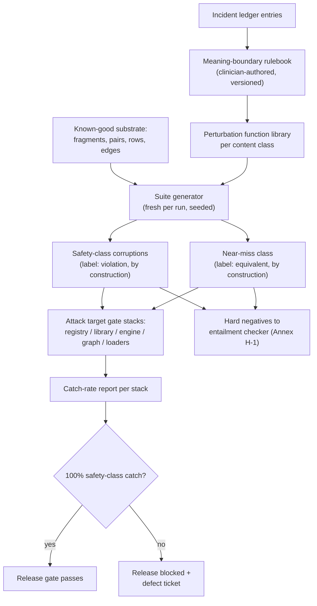

# Primer G — Corruption Engine

> **Architecture spine.** The project's spine is the deterministic-release doctrine plus the signed content registry: *ML proposes and tests; only arithmetic releases.* Three spine attachments raise the spec: **conformal prediction** (Primer F) makes the probabilistic side honest, the **corruption engine (this primer)** proves the deterministic side holds, and the **Lumos validation pathway** (Primer H) shows the whole assembly tracks reality. This primer's position: the standing adversary — the manufactured-attack factory that every gate, checker, and firewall in the system must survive before and after release. The six-mechanism **living evaluation stack** (Primer I) replaces archival golden-case regression throughout: properties + library self-consistency pre-release, differential testing for change review, distributional gates for promotion, runtime contracts + shadow evaluation in production — regenerating from living sources so nothing fossilises. The **model governance contract** (Primer J) is the second lattice, peer to I: I governs changes, J governs learned artifacts — no model trains on ungoverned data, acts without a card, or verifies anything whose errors it is positioned to share.

## G1. What this is

A generator of **guaranteed-wrong test material**: it takes known-good content and breaks it along clinically meaningful boundaries, so the label is true *by construction* — no expert needed to confirm that a ×10 dose, a swapped unit, or an LR flipped across 1 is a violation, because the engine made the violation deliberately. This solves the two problems that make validation slow everywhere else: genuine errors are rare (class imbalance) and expensive to confirm (expert bottleneck). Its outputs serve double duty — as the proof mechanism for the deterministic side (gates must catch 100% of the safety class) and as unlimited hard-negative training data for the entailment checker.

## G2. Scope

**In scope:** the **meaning-boundary rulebook** — per claim type, which field is load-bearing and what edit crosses a clinical meaning boundary (LR crossing 1; dose crossing registry min/max; sensitivity crossing the SnNout floor; unit, route, population, age-band swaps; version staleness; single-character content tampering against the hash; graph-flavoured corruptions — dropped contraindication edges, inverted line-of-therapy, stale edges surviving supersession); perturbation-function libraries per content class; fresh suite generation every run with deterministic seeds for reproducibility; catch-rate reporting per gate stack; the three-way output taxonomy including the **misquoted-but-equivalent near-miss class** (e.g. 7.4→7.5 — inside rounding noise, *not* a contradiction) used to train the checker's boundary between typo and danger rather than mislabel it.

**Out of scope:** generating any content for display; hunting naturally occurring errors (telemetry's job); substituting for human review of real content; corrupting the firewalled eval corpus (its red-team role against Primer C targets the *loaders*, not the cases).

## G3. Breadth and depth of content required

- **The rulebook — the scarce input:** a few clinician hours per content class, encoding load-bearing fields and boundary definitions. This is the asset; everything downstream is mechanical yield. It is versioned, signed off, and extended per new content class rather than rebuilt.
- **Known-good substrate:** verified registry fragments, validated entailed pairs, library rows, graph edges — the engine needs only material already trusted, which the system produces as a by-product of normal operation.
- **Target inventory:** the reference gate stacks it attacks (registry chain, library validator, engine override layer, graph traversal, eval-asset loaders) with their expected-catch specifications.

## G4. Building in a silo

Pure functions over schemas — the most silo-friendly component in the system. It needs the fragment/row/edge schemas, the rulebook, and a reference implementation of each gate stack to attack; no patients, no licensed content (synthetic substrate suffices to prove the machinery). Silo scorecards: 100% catch of safety-class corruptions by each reference gate stack; near-miss class correctly *passed* by clinical-fidelity gates and *flagged* by strict-provenance mode (the dual standard, tested explicitly); reproducibility (same seed → same suite); rulebook coverage audit (every load-bearing field in every schema has at least one perturbation function).

## G5. Folding it in

Stage 1: CI adversary — every registry promotion, library release, engine change, and graph rebuild must survive its fresh suite; catch-rate is a hard gate. Stage 2: checker feedstock — manufactured contradictions and near-misses flow into entailment-checker training under Annex H-1. Stage 3: firewall red-team — periodic deliberate attempts to load EVAL-tagged assets through dev-side loaders (Primer C's enforcement test); a successful load is a sev-1. Stage 4: standing service — new content classes and new gates register with it as a precondition of going live; the rulebook grows by clinician review, and adjudicated production incidents (the incident ledger) get corresponding perturbation functions so no real failure lacks a manufactured twin thereafter.

## G6. Definition of done

Rulebook clinician-signed and coverage-audited; 100% sustained safety-class catch across all target gate stacks per release; near-miss dual-standard behaviour verified; suites regenerate fresh (nothing fossilises) with seeded reproducibility; firewall red-team scheduled and passing; every incident-ledger entry paired with a perturbation function.

## G7. Internal operations diagram




## G8. Execution layer — the starter rulebook

The table below is the first draft of the meaning-boundary rulebook, ready for clinician red-pen rather than description. Every row = one perturbation function. Label column is the truth-by-construction guarantee.

| # | Claim type | Load-bearing field | Boundary that must be crossed | Perturbation | Label |
|---|---|---|---|---|---|
| 1 | LR claim | LR value | crosses 1 (update direction flips) | 7.4 → 0.74 | contradicted |
| 2 | LR claim | LR value | stays same side of 1, within rounding | 7.4 → 7.5 | equivalent (near-miss) |
| 3 | LR claim | direction word | "raises" ↔ "lowers" with unchanged number | swap verb | contradicted |
| 4 | SNout claim | sensitivity | crosses SnNout floor (e.g. 0.95 → 0.75) | degrade sens | contradicted |
| 5 | SNout claim | SELF/ALT type | swap type, same values | SELF → ALT | contradicted |
| 6 | Dose regimen | dose | crosses registry min/max (×10, ÷10) | 1 g → 10 g | contradicted |
| 7 | Dose regimen | unit | mg ↔ mcg, mg ↔ g | unit swap | contradicted |
| 8 | Dose regimen | interval | outside bounds interval set | 8-hourly → 48-hourly | contradicted |
| 9 | Dose regimen | route | oral ↔ IV with unchanged dose | route swap | contradicted |
| 10 | Any clinical claim | population | adult ↔ paediatric / pregnancy | population swap | contradicted |
| 11 | Fragment | content byte | any byte, post-signature | flip one char | contradicted (hash gate must catch) |
| 12 | Fragment | source version | current → superseded version string | stale substitute | contradicted (currency gate) |
| 13 | Graph edge | contraindicated_in | edge silently removed | drop edge | contradicted (pruning must fail loudly) |
| 14 | Graph edge | line_of_therapy | first ↔ second line inverted | invert | contradicted |
| 15 | Graph edge | superseded_by | supersession edge removed, old edge live | drop edge | contradicted |
| 16 | Prior claim | prevalence | order-of-magnitude shift | 0.04 → 0.4 | contradicted |
| 17 | Prior claim | prevalence | within stated CI of source | 0.04 → 0.043 | equivalent (near-miss) |
| 18 | Citation | source ID | points at real but non-asserting source | swap src ref | contradicted (topically-relevant-not-supporting) |

Row 18 deliberately manufactures the third label class — the plausible-but-hollow citation — so the checker learns it as a distinct verdict, not a soft "supported."

**Function contract:** `perturb(item, rule_id, seed) → (corrupted_item, expected_label, expected_catching_gate)`. The third return value is what makes catch-rate reporting per-gate mechanical. **Rulebook governance:** versioned file, clinician sign-off per row, one row minimum per load-bearing field per schema (coverage audit in G4), new row mandatory per incident-ledger admission.

## Production topology annotation

*Per Architecture §11:* v0 at **L1** (validator + engine attack); the 100%-catch CI gate is L2's exit criterion; graph rows at L3; injection family (K) at L4; runtime-LLM family (rows 26–30) at L5.

## Register topology annotation

*Per Architecture §12 (register numbers R1–R28):* **Owns:** Corruption Rulebook (R8, versioned, clinician-signed, L1 v0). **Writes:** catch-rate reports into R23; new rows on every R20 admission (the pairing law). **Reads:** R20 (incident-to-perturbation), all target schemas via spine.

<!-- ECOSYSTEM-V2-BLOCK: G v1.0 -->
## G9. Build Execution Extension (Ecosystem v2.0)

**1. Mini-North-Star.** WHAT: perturbation library + suite generator + catch-rate reporter per G8 rows 1–30. WHY: the standing adversary proving the deterministic side holds. Endpoint: v0 at L1; families grow with levels. Derives from and cites SPINE §13.1.

**2. Doctrine classification.** Boundary-check label certification and catch-rate arithmetic release the verdicts; K2.7 LLM proposals propose and are certified before admission. Kinship, per mandate: this engine is to the clinical gates what `validate_build_plan.py` is to planning artifacts — siblings, cross-referenced (SPINE §13.8), never merged.

**3. Scoped recon register.**
| ID | Verify | Tag |
|---|---|---|
| RECON-G-001 | Rulebook current signed rows + coverage-audit result | E:REPO |
| RECON-G-002 | Target gate stacks reachable in CI (registry, library, engine, graph, loaders) | E:REPO |

**4. Work register seed (Release-1-equivalent; schema per master v2 Phase 6; estimates ranged with confidence).**
```yaml
TASK-G-001:
  story: STORY-G-001 (release trains trust the adversary)
  component: suite-gen
  title: Seeded generator with per-gate expected-catch reporting
  purpose_chain: {what: "generator implementing (item, rule, seed) → (corrupt, label, catching_gate)", why: "labels are true by construction only when the boundary check certifies", endpoint_ref: "L1 and L2 exits; SPINE-NS WHY"}
  evidence_refs: [E:DOC G8 function contract; RECON-G-001]
  definition_of_ready: ["rulebook rows 1–18 signed"]
  steps: ["perturbation functions rows 1–18", "deterministic seeding", "certifier recompute", "catch report per stack"]
  test_plan: "same seed yields identical suite; certifier rejects a planted uncertifiable proposal; near-miss dual-standard test (rows 2 and 17)"
  observability: "catch-rate metric per stack per release"
  definition_of_done: ["reproducible", "certifier rejection demonstrated", "dual-standard verified"]
  estimate: {optimistic: 2d, likely: 4d, pessimistic: 6d, confidence: medium}
  depends_on: []
```

**5. Orchestration hooks.** `WF-G-1` per-release suite: generate → attack all registered stacks → report → gate (idempotent by release + seed; timeout 40m; a stack absent from the target registry is itself a finding). `EVT-G-1 suite.report` → the I distributional stage and the R23 feed.

**6. Observer checkpoint spec.** At every level exit: 100pct safety-class catch across registered stacks; from L4, every incident-ledger entry has its paired rule row. Admissible: suite reports, R20, R8 version history.

**7. Implementer Contract binding.** This component's tickets execute under IMPL (SPINE §13.2). HALT trigger: any ticket admitting an uncertified label → HALT: SPEC-CONFLICT (the guarantee is the point).

**8. Gaps and register proposals.** None new.

<!-- MET-1 METAMORPHOSIS & HARDENING ANNEX — APPENDED 2026-09-01. Pure append per X1 discipline; zero edits to pre-existing text above. Status: Proposed; R29 hardening state of this document: PENDING. -->
## G10. Metamorphosis & Hardening Annex — fabric binding, new suite classes, updated execution block

**Fabric binding.** Corruption findings are promoted from private evidence to **published rebuttals** every face can see (EN-5 alignment: "the standing adversary… publishes what it kills as rebuttals"). Two new suite classes are proposed for the rulebook (R8), both label-guaranteed by construction:

- **ARG-class (argument validity):** manufactured arguments with (a) missing qualifier, (b) empty rebuttal slot while findings exist, (c) register-render outputs that add/remove/reweight content across faces. The evaluator and render layer must catch 100%.
- **FZ-5 boundary-sweep class (dormant — activates only on DEC-05 ratification):** cliff-effect and boundary-instability cases derived from ratified membership supports, findings published as rebuttals on affected warrants. The left wing hands the adversary a hunting map (MAK-MIF beat 7).

| Execution field | Content |
|---|---|
| Execution purpose | Prove the merged release path holds — gates, evaluator, and render law alike — every release, forever |
| Inputs / prerequisites | Rulebook (G8 starter 18 rows, clinician red-pen invited) + proposed ARG rows; known-good assemblies; I scheduling |
| Steps | 1 generate suites from rulebook → 2 attack gates, engine, graph, evaluator, render layer → 3 verify 100% safety-class catch → 4 publish caught-item records as rebuttals → 5 pair every incident-ledger entry case-for-case (R20 law) → 6 report catch rates to dossier |
| Tools / repos / environments | `cdss-corruption` (suites as data; rulebook clinician-reviewable in isolation); Giskard + ART machinery per MAK-ELSM (clinical perturbation classes remain in-house) |
| Outputs & acceptance | Suites + catch-rate reports; acceptance = 100% catch sustained (L2 exit and thereafter); ARG-class at 100% before fabric v1 promotes |
| Dependencies / handoffs | Scheduled and enforced by I; adversary of B, D, E per document map; supplies mandatory adversarial evidence to J cards |
| Evidence to collect | Catch-rate reports per release; rulebook sign-off records; incident↔perturbation pairing in R20 |
| Failure handling / rollback | Catch below 100% twice consecutively → release train halts (Arch §13.5 kill criterion); an uncatchable manufactured violation is a design defect, never a tolerance |
| Ownership & status | Repo: `cdss-corruption`; owner [NEEDS DEFINITION]. Status: Retained + Added (ARG-class Proposed; FZ-5 Dormant/Proposed) |
| Source & research traceability | Primer G §G1–G8; MAK-FFC rebuttal row, SPINE-2/3; MAK-CEC AD; MAK-DOT FZ-5; MAK-MIF beat 7 |
