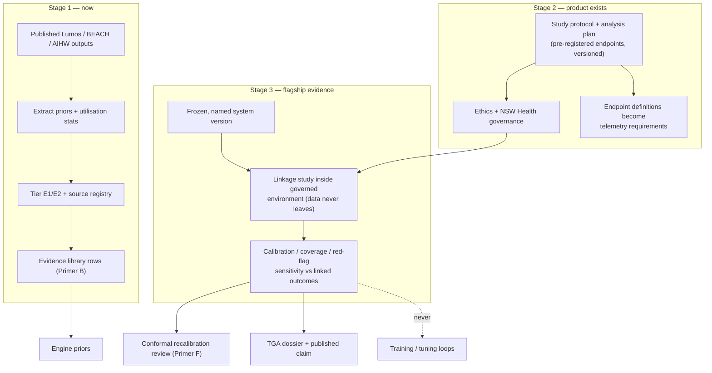

# Primer H — Lumos Validation Pathway

> **Architecture spine.** The project's spine is the deterministic-release doctrine plus the signed content registry: *ML proposes and tests; only arithmetic releases.* Three spine attachments raise the spec: **conformal prediction** (Primer F) makes the probabilistic side honest, the **corruption engine** (Primer G) proves the deterministic side holds, and the **Lumos validation pathway (this primer)** shows the whole assembly tracks reality. This primer's position: the truth anchor — everything else validates machinery; this pathway validates whether the machinery's outputs match what actually happens to Australian GP patients. The six-mechanism **living evaluation stack** (Primer I) replaces archival golden-case regression throughout: properties + library self-consistency pre-release, differential testing for change review, distributional gates for promotion, runtime contracts + shadow evaluation in production — regenerating from living sources so nothing fossilises. The **model governance contract** (Primer J) is the second lattice, peer to I: I governs changes, J governs learned artifacts — no model trains on ungoverned data, acts without a card, or verifies anything whose errors it is positioned to share.

## H1. What this is

A staged programme — not a codebase — anchoring the system's core claim ("our posteriors match reality") to the only asset that can settle it: **Lumos**, the NSW Ministry of Health linkage of general-practice records to hospital, ED and mortality data (6.8M+ de-identified patient journeys), run under CHeReL's separation principle. Every other validation source discussed is a proxy: DDXPlus is synthetic acute-care, MIMIC is the wrong country and setting, the casebundle corpus is authored. Lumos is presentation→outcome for the intended-use population. It is also the one roadmap item engineering effort cannot compress — governance and study timelines dominate — which is precisely why it starts now, cheap, and escalates.

## H2. Scope

**In scope, staged:** *Stage 1 (now):* ingestion of **published** Lumos outputs, alongside BEACH-era encounter epidemiology and AIHW prevalence, as E1/E2-gradable Australian priors and utilisation statistics into the evidence library. *Stage 2 (when the product exists):* partnership and governance groundwork — relationship with NSW Health, ethics pathway, and a versioned study protocol drafted early (endpoints: calibration curves against linked outcomes, conformal coverage against real diagnoses, red-flag-class sensitivity against ED/admission/mortality signals). *Stage 3 (flagship evidence):* the formal linkage validation study, analyses run inside the governed environment, results packaged as the centrepiece of the TGA dossier and any published validation claim.

**Out of scope:** raw data access assumptions (Lumos is a governed asset — analyses go to the data, the data never comes to the dev environment); any training use whatsoever (this pathway is validation-only, or its evidentiary value is spent the same way the casebundle firewall protects against); overclaiming geographic generalisation — clinical priors and LR-driven relationships transfer across state lines (same species, same likelihood ratios), service-utilisation patterns transfer with caution because they partly reflect NSW's system rather than NSW's humans, and the dossier says so explicitly.

## H3. Breadth and depth of content required

- **Stage 1 assets (available today):** published Lumos reports and the 2025 data-quality cohort study (completeness, representativeness, consistency — the asset's credibility is already established and citable, including its known gaps from non-participating practices); BEACH and AIHW as complements. The work is extraction, tiering, and library ingestion — days, not months.
- **Stage 2 assets:** a statistical analysis plan versioned alongside the system (pre-registered endpoints so the study cannot be accused of metric-shopping); governance and ethics artifacts; the version-registry discipline that lets a frozen system version be named in a protocol.
- **Stage 3 requirements:** a frozen, versioned system; the calibration and conformal measurement pipelines already proven external (Primers A and F) so the study measures the product, not the plumbing; sample-size calculations per red-flag class driven off Stage 1 prevalence figures.

## H4. Building in a silo

The silo here is programmatic: the study protocol, analysis plan, and evidence-packaging templates are drafted, versioned and internally reviewed years before data contact, entirely decoupled from engineering sprints. The one hard rule mirrors the corpus firewall: no artifact from this pathway enters the development loop — Stage 1 priors enter through the evidence library's normal sourced-and-tiered governance (they are published statistics, not privileged data), and Stage 3 results feed *recalibration review and the dossier*, never model tuning against the linked data itself.

## H5. Folding it in

Stage 1 folds in immediately as library rows (Primer B pipeline, E1/E2 tiers, freshness-monitored like any source). Stage 2 folds into programme planning: the protocol's endpoint definitions become requirements on the telemetry and measurement pipelines (if the study will need it measured, production must already measure it). Stage 3 folds into the release and regulatory calendar as the flagship evidence event; its results trigger the conformal recalibration path (Primer F) and set the public claim ceiling — the sentence "calibration methodology verified on the largest public DDx benchmark, then validated against linked Australian GP outcomes" is the credibility structure the whole validation stack builds toward.

## H6. Definition of done

Stage 1: Lumos/BEACH/AIHW-derived rows live in the library, tiered and freshness-tracked. Stage 2: protocol and analysis plan versioned, endpoints pre-registered, governance pathway mapped with named counterparts. Stage 3: study executed against a named frozen version; calibration, coverage and red-flag sensitivity endpoints met or deviations adjudicated and published; evidence package regulator-submitted; generalisation limits stated. Programme-level: at no point has pathway data touched a training or tuning loop.

## H7. Internal operations diagram




## H8. Execution layer

**Stage-1 extraction targets (source → library fields):**

| Source (published) | Extract | Populates |
|---|---|---|
| Lumos analytics pack (latest) | GP presentation mix, ED-transfer rates by presentation class | domain prioritisation; utilisation context fields |
| Lumos 2025 data-quality cohort study | representativeness + known gaps | dossier citation; generalisation-limits text |
| BEACH final datasets (to 2016) | encounter reasons per 100 encounters by age/sex | condition priors (E2, dated — pair with AIHW trend check) |
| AIHW prevalence collections | condition prevalence, AU population | priors (E1 where methodology strong) |
| PBS/MBS statistics | prescribing/investigation base rates | plausibility cross-checks on management-side content |

Each extraction lands as normal library rows: sourced, tiered, freshness-dated — no special pathway.

**Draft Stage-3 endpoints (pre-registration skeleton):** E1: calibration — ECE of engine posteriors vs linked confirmed outcomes ≤ 0.05 per major domain. E2: conformal coverage — realised coverage within ±1.5pp of nominal overall, ≥ target in red-flag stratum. E3: red-flag sensitivity — for each named can't-miss class, sensitivity vs linked ED/admission/mortality signal ≥ pre-registered floor (per-class floors set from Stage-1 prevalence with power calc; classes below feasible n declared descriptive-only in advance). Analysis population, exclusions, and outcome-window definitions fixed in the SAP before any data contact.

**Governance sequence (named steps, realistic durations):** 1. NSW Health/Lumos team engagement + scoping (1–3 mo). 2. Protocol + SAP finalised and internally reviewed (parallel). 3. Ethics submission (HREC) and site governance (3–6 mo elapsed). 4. Data-custodian approvals + CHeReL linkage scheduling (3–6 mo, overlapping). 5. Analyses executed in governed environment against the frozen version (2–4 mo). 6. Results adjudication, dossier packaging, publication pathway (2–3 mo). Total realistic wall-clock ≈ 12–22 months — which is the argument, stated with numbers, for starting step 1 the quarter a validatable product exists.

## Production topology annotation

*Per Architecture §11:* Stage 1 (published-output extraction into library rows) lands at **L4**; Stage 2 governance opens with L5; Stage 3 executes against a named L5 freeze — the 12–22-month wall-clock in H8 is why Stage-2 steps begin the quarter L3 proves out.

## Register topology annotation

*Per Architecture §12 (register numbers R1–R28):* **Owns:** its protocol/SAP versions register within R23's regulatory section. **Writes:** Stage-1 extractions enter as R6-sourced library rows; Stage-3 results into R23 against a named R1 freeze. **Reads:** nothing from runtime — the never-trains rule extends to register access: read-only on R1 for freeze naming.

<!-- ECOSYSTEM-V2-BLOCK: H v1.0 -->
## H9. Build Execution Extension (Ecosystem v2.0)

**1. Mini-North-Star.** WHAT: Stage-1 extraction tickets plus protocol/SAP versioning per H8 — a programme expressed as build work; no data artifact exists here by law. WHY: the truth anchor. Endpoint: Stage 1 at L4; Stage 2 opens with L5. Derives from and cites SPINE §13.1.

**2. Doctrine classification.** Extraction lands as B rows through the B validator (arithmetic); protocol drafting proposes; nothing here touches runtime.

**3. Scoped recon register.**
| ID | Verify | Tag |
|---|---|---|
| RECON-H-001 | Current published Lumos pack + 2025 DQ study citations | E:WEB |
| RECON-H-002 | R23 regulatory-section schema for protocol versions | E:REPO |

**4. Work register seed (Release-1-equivalent; schema per master v2 Phase 6; estimates ranged with confidence).**
```yaml
TASK-H-001:
  story: STORY-H-001 (the library carries Australian priors)
  component: stage1-extract
  title: Extract H8 target-table rows into the B pipeline
  purpose_chain: {what: "sourced, tiered candidate rows per the H8 table", why: "priors must be Australian before L4 claims population fit", endpoint_ref: "L4 exit; SPINE-NS DONE (partial)"}
  evidence_refs: [E:DOC H8; RECON-H-001]
  definition_of_ready: ["B pipeline live", "R6 accepting"]
  steps: ["per-source extraction", "tier assignment E1/E2", "freshness dates", "PR submission"]
  test_plan: "every row citation resolves in R6; validator green"
  observability: "rows-landed count by source"
  definition_of_done: ["rows merged via WF-B-1", "zero unsourced values"]
  estimate: {optimistic: 2d, likely: 3d, pessimistic: 5d, confidence: high}
  depends_on: []
```

**5. Orchestration hooks.** No orchestration beyond WF-B-1 participation; Stage-2 steps are calendar governance (H8 durations) tracked as L5 milestones, Observer-checked.

**6. Observer checkpoint spec.** The Observer verifies Stage-1 rows exist in R6 with tiers, and from L5 that protocol/SAP versions in R23 predate any data contact — the never-trains rule as an auditable ordering. Admissible: R6, R23, R1 freeze names.

**7. Implementer Contract binding.** This component's tickets execute under IMPL (SPINE §13.2). HALT trigger: any ticket routing pathway data toward a training or tuning pipeline → HALT: SPEC-CONFLICT (the H firewall).

**8. Gaps and register proposals.** None new.

## H10. Contingency pathway — Danish national health registers (fallback)

**Trigger, recorded in advance.** ASSUME-H-001: Lumos access is attainable through NSW Health engagement (H8 governance step 1). Risk-if-wrong: Stages 2–3 blocked and the flagship Australian outcome validation with them. Verification path: step-1 engagement outcome within its 1–3-month window. **If refuted, this contingency activates** — it is a pre-registered alternative, not a mid-programme improvisation.

**The alternative.** The Danish national health registers, accessed via the Danish Health Data Authority's Research Services (english.sundhedsdatastyrelsen.dk/health-data-and-registers/research-services). Verified against the current source (E:WEB, this revision): access is provided through **The Secure Research Platform** — remote online access in a secure environment; data access is granted **only to a Danish authority responsible for data control**, so an international applicant collaborates with **a Danish research institution that takes on data responsibility** and issues the MitID login the platform requires. The governed-enclave discipline of H5 therefore transfers intact: data never leaves the platform; analyses execute inside; only aggregate results and the dossier exit — the never-trains rule and the register-access posture (read-only on R1 for freeze naming) apply unchanged.

**Why Denmark is the strongest fallback.** Decades-deep national registers with person-level linkage across primary care contact, hospital episodes, prescriptions, and mortality — the same presentation-to-outcome shape Lumos offers — inside a healthcare system whose **GP-gatekeeping structure resembles Australian general practice** more closely than most alternatives. The three-stage architecture of this primer survives with substitutions: Stage 1 (published outputs into library rows) draws on Danish register publications as E2 context rather than Australian priors; Stage 2 becomes the Danish institutional collaboration + Research Services application; Stage 3's pre-registered endpoints (E1–E3, H8) transfer with re-derived per-class floors from Danish prevalence.

**Honest costs, stated now.** (1) **Priors do not transfer** — Danish prevalence and service patterns are not Australian; under this contingency the library's priors lean on AIHW/BEACH/PBS sources alone, and the validation claim becomes *"calibration and discrimination validated against a comparable gatekeeping system"* rather than *"against Australian outcomes"* — a real reduction in dossier weight, to be stated plainly to the TGA, with LRs and discrimination expected to travel far better than base rates (the same homo-sapiens argument as NSW/Perth, one step wider). (2) **Coding translation** — ICD-10/ATC mappings to the library's SNOMED CT-AU/AMT vocabulary become a defined, versioned artifact (a spine contract addition), built once and G-attacked like any mapping. (3) **Partnership dependency** — a Danish academic collaborator is a hard prerequisite, so the contingency's step 1 is collaborator identification, not data application. (4) **Timeline is not shorter** — application, agreements, and platform onboarding land in the same 12–22-month order as H8; the contingency changes feasibility risk, not calendar.

**Build hooks (namespace-continuous with §H9).** RECON-H-003: current Research Services requirements-and-permits page + fee schedule, E:WEB at activation. RECON-H-004: candidate Danish partner institutions with register-research groups, E:USER + E:WEB. TASK-H-002 (dormant until ASSUME-H-001 is REFUTED): draft the Danish-variant protocol/SAP deltas — endpoint floors re-derived, coding-translation artifact specified, R23 regulatory section updated with the applicability argument. The Observer's H checkpoint gains one row: at each adjudication from L4, rule ASSUME-H-001 CONFIRMED / REFUTED / STILL-OPEN from the engagement evidence, and on REFUTED verify TASK-H-002 activation — so the fallback fires by ruling, never by drift.

<!-- MET-1 METAMORPHOSIS & HARDENING ANNEX — APPENDED 2026-09-01. Pure append per X1 discipline; zero edits to pre-existing text above. Status: Proposed; R29 hardening state of this document: PENDING. -->
## H11. Metamorphosis & Hardening Annex — regulatory concordance + updated execution block

**What changes: nothing clinical; one concordance.** The pathway, endpoints, pre-registration, and the H10 Danish contingency stand exactly as written. New wiring only: the linkage study is REG-POSTURE's `TASK-REG-015` ("longest lead item in the programme; started in parallel from Phase 1, not sequentially"), its ethics/custodian prerequisites are `ASSUME-REG-007`/`Q-REG-007` beside the existing ASSUME-H-001, and its outputs feed GATE-003's clinical-evidence bar in addition to the dossier joins already specified.

| Execution field | Content |
|---|---|
| Execution purpose | Australian priors now; the flagship outcome-validation study later; GATE-003 clinical evidence throughout |
| Inputs / prerequisites | Extraction targets, pre-registration endpoints, governance timeline with durations (H8); custodian + ethics engagement (ASSUME-REG-007, external attestation only) |
| Steps | 1 open custodian/ethics contact in Phase 1 (parallel) → 2 Stage 1 prevalence rows into library (data entry, not engineering) → 3 Stage 2 governance → 4 Stage 3 against a named freeze (R1) → 5 endpoints vs pre-registration |
| Tools / repos / environments | `cdss-lumos` — **no data ever enters this repo** (isolation note retained verbatim) |
| Outputs & acceptance | Protocol, SAP, extraction rows, study results; acceptance = H8 endpoints met against the named freeze; L5 DONE includes this |
| Dependencies / handoffs | Priors → B; posterior/coverage validation → F recalibration; evidence → R23 dossier register and GATE-003 |
| Failure handling / rollback | ASSUME-H-001 REFUTED at an Observer adjudication → H10 Danish contingency activates (TASK-H-002 wakes), with the honest costs already recorded (priors non-transfer, coding-translation artifact, partnership prerequisite) |
| Ownership & status | Repo: `cdss-lumos`; study owner [NEEDS DEFINITION]. Status: Retained; regulatory concordance Added |
| Source & research traceability | Primer H §H1–H10; MAK-ANT §7 TASK-REG-015, §8 ASSUME-REG-007; Integration Report post-pass addendum 1 |
