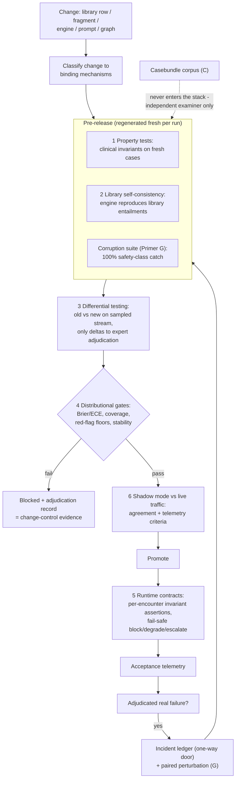

# Primer I — Living Evaluation Stack

> **Architecture spine.** The project's spine is the deterministic-release doctrine plus the signed content registry: *ML proposes and tests; only arithmetic releases.* Three spine attachments raise the spec: **conformal prediction** (Primer F) makes the probabilistic side honest, the **corruption engine** (Primer G) proves the deterministic side holds, and the **Lumos pathway** (Primer H) shows the assembly tracks reality. This primer's position: the **verification lattice** woven along the whole lifecycle — the six-mechanism replacement for archival golden-case regression, through which every change to every component passes. It regenerates all of its test material from living sources (library, properties, traffic), so nothing fossilises; the incident ledger is its single, deliberate archival exception. The **model governance contract** (Primer J) is the second lattice, peer to I: I governs changes, J governs learned artifacts — no model trains on ungoverned data, acts without a card, or verifies anything whose errors it is positioned to share.

## I1. What this is

The project's answer to the question "how do we know a change is safe?" — deliberately *not* a museum of frozen test cases. Fixed-case regression was rejected as anachronistic for a probabilistic clinical engine: cases drift out of sync with the living evidence library, get tested because they exist rather than because they map to patient risk, and quietly invite eval-corpus contamination as the convenient seed. In its place, six mechanisms, each anchored to a living source:

1. **Metamorphic / property-based testing** — assert clinical invariants, not answers, over freshly generated cases every run: adding a red-flag finding never lowers acuity; a finding with LR+ > 1 never decreases its diagnosis's posterior; removing evidence widens, never narrows, the conformal set; paraphrase never changes the differential; a pathognomonic finding ranks its diagnosis first.
2. **Library self-consistency** — regenerate test presentations *from the current library* each release and confirm the engine reproduces what the library mathematically entails. The test set rebuilds from the source of truth, so library updates update the tests by construction.
3. **Differential testing** — run old and new versions over the same sampled stream; ignore agreement; route only *disagreements* to expert adjudication. Expert time lands exactly where behaviour changed; the adjudication log is the change-control record.
4. **Distributional acceptance gates** — promotion decided on population metrics over a fresh sampled batch: calibration bounds (Brier/ECE), conformal coverage tolerance, red-flag-class sensitivity floor with confidence intervals, override-rate stability. The release question is "is the system safe in aggregate," not "does it still ace its old exam."
5. **Runtime contracts** — the safety invariants pushed into per-encounter assertions at inference time: violations block or escalate *that case* and alarm engineering. The guarantee travels with every patient encounter; production is the test.
6. **Continuous shadow evaluation** — candidate versions run silently against live traffic before promotion; promotion gates on agreement, delta adjudication (mechanism 3 applied to shadow), and acceptance telemetry after exposure. Evaluation is a flow, not an event.

Plus the sanctioned exception: the **incident ledger** — a tiny fixed set of named catastrophes, grown *only* from real adjudicated failures (one-way door from telemetry and retired eval cases), each paired with a corruption-engine perturbation function (Primer G) so no real failure ever lacks a manufactured twin.

## I2. Scope

**In scope:** the property registry and its clinical review; the self-consistency generator; sampled-stream management for differential and distributional runs; metric definitions, tolerances and floors as versioned configuration; the runtime-contract assertion library and its fail-safe semantics; shadow-mode infrastructure and promotion criteria; the incident ledger and its admission criteria; the mechanism-to-lifecycle mapping (which gate binds which change class); ownership of the *pass/fail decision plumbing* for every release in the system.

**Out of scope:** authoring clinical content or numbers (it verifies; B owns numbers, D owns fragments); the corruption suites themselves (Primer G supplies them; this stack schedules and enforces them); the casebundle corpus (Primer C stays the independent examiner *because* this stack exists — the living mechanisms are the dev-side answer that makes reaching for eval assets unnecessary, which is the contamination defence stated positively); harness component construction (the stack consumes harness artifacts — properties, differential tooling, calibration pipelines are built there, operated here).

## I3. Breadth and depth of content required

- **Property registry:** 20–40 invariants derived from the Bayesian structure and safety logic, clinician-reviewed, versioned; each tagged safety-class (zero-violation gate) or soft (tolerance gate). The cheapest high-leverage asset in the stack.
- **Sampled streams:** presentation generators seeded from the library (self-consistency) and, once live, de-identified production sampling for differential/shadow runs — plus DEV-tagged synthetic streams pre-launch. Never the eval corpus.
- **Metric configuration:** clinically agreed tolerances — Brier/ECE bounds, coverage tolerance per stratum (with F), red-flag sensitivity floors per class (sample-sized from H Stage 1 prevalence), override-rate stability bands. Written down, versioned, changed only by review.
- **Contract assertions:** the registry gate chain (D) plus engine invariants (A) expressed as per-request checks with defined fail-safe behaviour (block, degrade to most-restrictive, escalate, log).
- **Incident ledger criteria:** what admits a case (adjudicated real failure of defined severity), what each entry must carry (frozen inputs, expected behaviour, owning perturbation function, version of first failure).

## I4. Building in a silo

The stack is CI/CD plus observability over commodity infrastructure — pipelines (GitHub Actions/CodePipeline class), a metrics store, a shadow-routing layer, an assertion library. Silo-buildable against a reference engine + synthetic library slice: scorecards are mechanical — property runs produce zero false gate-passes on corruption-seeded inputs (G as the silo's adversary); self-consistency divergence detection catches planted library/engine mismatches; differential tooling produces reviewer-ready delta reports; distributional gates reproduce known DDXPlus results; contract assertions fire correctly under fault injection; shadow plumbing demonstrably isolates candidates from users. None of this needs patients, licensed content, or the parent's data stores.

## I5. Folding it in

The fold-in *is* the lifecycle mapping — every change class binds to its mechanisms:

- **Library row change (B):** self-consistency (2) + differential (3) + corruption suite (G) → distributional (4) → merge.
- **Registry fragment / source delta (D):** corruption suite (G) + differential over rendered output (3) → human sign-off of deltas → sign + release; contracts (5) stand behind every render.
- **Engine / prompt / model change (A, H-1):** properties (1) + self-consistency (2) + differential (3) → distributional (4) → shadow (6) → promote; contracts (5) live thereafter.
- **Graph rebuild/patch (E):** determinism check + graph corruptions (G) + selection-delta adjudication (3) → live behind contracts (5).
- **Any adjudicated production failure:** telemetry → incident ledger → paired perturbation (G) → permanent tripwire in every subsequent run.

Sequencing: mechanisms 1–4 exist from the first engine build (they replace the test suite that would otherwise be written); 5 ships with the first registry render; 6 activates at first live traffic. The stack is therefore not a later fold-in at all — it is the standing order in which everything else folds in.

## I6. Definition of done

Every change class in the system mapped to its binding mechanisms with no unmapped release path; safety-class properties at zero violations per release, sustained; self-consistency divergence below threshold; 100% of promotions carrying differential-adjudication records; distributional tolerances met with documented confidence; contract assertions covering every runtime gate with verified fail-safe behaviour; shadow promotion criteria executed for every engine-class change; incident ledger complete, one-way, and perturbation-paired; and the negative check — no frozen case set anywhere in the development loop except the ledger, verified by audit.

## I7. Internal operations diagram




## I8. Execution layer

**Change-class × mechanism binding table (the §I5 mapping as configuration):**

| Change class | 1 Props | 2 Self-consist | G suite | 3 Differential | 4 Distributional | 6 Shadow | 5 Contracts after |
|---|---|---|---|---|---|---|---|
| Library row (B) | — | ✅ | ✅ | ✅ (via engine) | ✅ | — | ✅ |
| Registry fragment / source delta (D) | — | — | ✅ | ✅ (rendered output) | — | — | ✅ |
| Engine / prompt / model (A, H-1, J-carded) | ✅ | ✅ | ✅ | ✅ | ✅ | ✅ | ✅ |
| Graph rebuild / edge change (E) | determinism | — | ✅ (graph rules 13–15) | ✅ (selection deltas) | — | optional | ✅ |
| Conformal recalibration (F) | — | — | — | ✅ (set deltas) | ✅ (coverage) | — | ✅ |
| Policy change (OPA, tolerances) | — | — | ✅ | ✅ (gate-decision deltas) | — | — | ✅ |

Unmapped change class = off-plan by definition (architecture §7).

**Seeded property registry (first 20; safety-class marked ★ = zero-violation gate):** ★1 red-flag finding never lowers tier. ★2 LR+>1 finding never lowers p(dx). ★3 pathognomonic ⇒ rank 1. ★4 SnNout-absent ⇒ excluded/flagged, never silently retained. ★5 evidence removal never shrinks conformal set. ★6 override layer outranks probabilistic output in final tier. ★7 no render without full gate-chain pass (contract form). ★8 uncoded context ⇒ most-restrictive behaviour. ★9 every returned graph pointer resolves to a signed, current fragment. ★10 contraindication pruning ran, or result is most-restrictive + flag. 11 paraphrase (same CUIs/status) ⇒ identical posterior. 12 finding-order permutation ⇒ identical posterior. 13 posterior vector sums ≤ 1 + other-mass. 14 tier monotone in fired overrides. 15 trace replays to identical numbers from pinned versions. 16 conformal set size ≥ 1 always. 17 duplicate finding idempotent. 18 unknown CUI ⇒ typed abstention, never guess. 19 stale library pin ⇒ hard fail, not degraded answer. 20 decision log written for every render attempt, including blocks.

**Proposed tolerances (flagged: clinical sign-off required — same numbers as A8, held here as the authoritative copy):** ECE ≤ 0.05; Brier drift ≤ +0.02/release; coverage 95% ±1.5pp overall, ≥98% red-flag; red-flag sensitivity lower-CI ≥ 0.995 on the distributional batch; override-rate band ±20% relative; shadow agreement ≥ 97% on non-adjudicated stream before promotion.

**Incident-ledger entry schema:** `{incident_id, date, severity, frozen_inputs, observed_behaviour, expected_behaviour, adjudication_ref, first_failing_version, owning_perturbation:G-rule-ref, tripwire_status}` — append-only; admission requires adjudicated real failure at defined severity; every entry's G-pairing verified at write time.

## Production topology annotation

*Per Architecture §11:* Mechanisms 1–2 from **L1**; mechanism-3 + the G hard gate at L2; the full stack including contracts and shadow at L3; the binding table becomes the release law for all repos from L3 onward; incident ledger opens at L4.

## Register topology annotation

*Per Architecture §12 (register numbers R1–R28):* **Owns:** Property Registry (R7, L1), Adjudication Log (R12, L2), Contract-Violation Log (R18, L3), Incident Ledger (R20, L4, one-way). **Writes:** distributional gate outcomes into R23. **Reads:** everything — the stack is the largest register consumer; its binding table is itself spine-versioned configuration.

<!-- ECOSYSTEM-V2-BLOCK: I v1.0 -->
## I9. Build Execution Extension (Ecosystem v2.0)

**1. Mini-North-Star.** WHAT: the six-mechanism CI/CD + observability layer per I8, imported by every repo. WHY: the release law. Endpoint: mechanisms 1–2 at L1; the full stack at L3. Derives from and cites SPINE §13.1.

**2. Doctrine classification.** Gates, tolerances, and contract assertions are arithmetic; delta-triage assistance (K3.5) proposes. Division of labour, per mandate: I adjudicates the clinical system per change; the Observer adjudicates the build per level — complementary, both mandatory, neither substitutes.

**3. Scoped recon register.**
| ID | Verify | Tag |
|---|---|---|
| RECON-I-001 | Pipeline substrate versions (Actions/CodeBuild) | E:WEB |
| RECON-I-002 | I8 binding table current in spine config | E:REPO |

**4. Work register seed (Release-1-equivalent; schema per master v2 Phase 6; estimates ranged with confidence).**
```yaml
TASK-I-001:
  story: STORY-I-001 (no unmapped release path exists)
  component: stack-ci
  title: Encode the I8 binding table as pipeline configuration
  purpose_chain: {what: "machine-readable binding config + enforcement job", why: "a change class outside the table is off-plan by definition", endpoint_ref: "L3 exit; SPINE-NS WHY"}
  evidence_refs: [E:DOC I8 table; RECON-I-002]
  definition_of_ready: ["spine schema for bindings ratified"]
  steps: ["table as config", "classifier per change type", "unmapped-change hard fail"]
  test_plan: "fixture: an invented change class must fail CI; every §11.2 class routes correctly"
  observability: "per-mechanism pass metrics; unmapped-change alarm"
  definition_of_done: ["fixture red", "all classes green"]
  estimate: {optimistic: 2d, likely: 3d, pessimistic: 5d, confidence: high}
  depends_on: []
```

**5. Orchestration hooks.** `WF-I-1` per change: classify → bound mechanisms → report (idempotent by change hash + mechanism; timeouts per mechanism per I8). `EVT-I-1 gate.verdict` → R12/R23 feeds and WF-SPINE-1.

**6. Observer checkpoint spec.** Observer checkpoints consume the I outputs (R12, verdict events) as evidence about the build conformance to plan; they never re-run clinical adjudication. Admissible: R7, R12, R18, verdict events.

**7. Implementer Contract binding.** This component's tickets execute under IMPL (SPINE §13.2). HALT trigger: any ticket weakening a star-class property without a clinical sign-off ref → HALT: CHAIN-BREAK.

**8. Gaps and register proposals.** GAP-I-001 → RESOLVED by ratification: Observer verdicts home in **R27 — Build Drift & Adjudication Register** (Arch §12.2).

<!-- MET-1 METAMORPHOSIS & HARDENING ANNEX — APPENDED 2026-09-01. Pure append per X1 discipline; zero edits to pre-existing text above. Status: Proposed; R29 hardening state of this document: PENDING. -->
## I10. Metamorphosis & Hardening Annex — new change classes, RG cross-walk duty, ratchet wiring

**Three additions, no relaxations.** (1) **New change classes** enter the binding table (I8 remains the authoritative copy): fabric/argument-schema change (spine PR; consumers break visibly); GenericArgument compilation release (registry-gateway class); deviation-taxonomy change; register-render contract change (SPINE-3 invariance test mandatory); FML membership-function change (AF-5-governed per FZ-4 — dormant until DEC-05); GPP capability-matrix change (**not a change class at all**: per GPP-14 it is a new device, and any PR attempting it is halted). (2) **RG cross-walk duty:** MAK-CEC's release-gate rows (single gate/no second path, bit-for-bit replay, unified telemetry, tier manifests with SBOM diffs — RG-1/4/5/6) map onto this stack's existing mechanisms; the hardening pass verifies the cross-walk row-by-row, and any orphan is a §12.1(5) negative-audit finding. (3) **Ratchet wiring (MT2):** on R29 ratification, the pipeline definitions this repo emits gain the row-completeness check — an instruction-bearing artifact merging without a current R29 row is a CI failure, so the hardening ratchet cannot silently come back off (directive §7(4)).

| Execution field | Content |
|---|---|
| Execution purpose | Keep governing every change in the merged system, including the fabric's own artifacts |
| Inputs / prerequisites | I8 binding table + tolerances + 20 seeded properties + incident schema; new class definitions above (Proposed) |
| Steps | per change: 1 version-registry stamp → 2 class → bound mechanisms → 3 pre-release gates regenerated fresh (properties, self-consistency, G suites incl. ARG-class) → 4 differential testing on deltas → 5 distributional gates → 6 shadow → promote → contracts live → telemetry → incident ledger one-way door |
| Tools / repos / environments | `cdss-evalstack` (operates, does not author); pipelines imported by all repos |
| Outputs & acceptance | Pipeline/CI definitions; adjudication records; acceptance = every release of every component passes through its bound mechanisms — zero unmapped change classes at the negative audit |
| Dependencies / handoffs | J admissibility gate upstream of promotion; G scheduling; R29 check downstream of DEC-02 |
| Evidence to collect | R7 property registry, R12 adjudications, R18 contract violations, R20 incidents, distributional reports |
| Failure handling / rollback | M4 fail → blocked with adjudication record; contract violation in production → block/degrade + alarm; unmapped change class discovered → halt that change, escalate (MT2 §6 pattern) |
| Ownership & status | Repo: `cdss-evalstack`; owner [NEEDS DEFINITION]. Status: Retained + Added (classes/duties Proposed) |
| Source & research traceability | Primer I §I1–I8; MAK-CEC Part 7 RG family; MAK-DOT FZ-4; MAK-J3 GPP-14; MT2 §7 |
