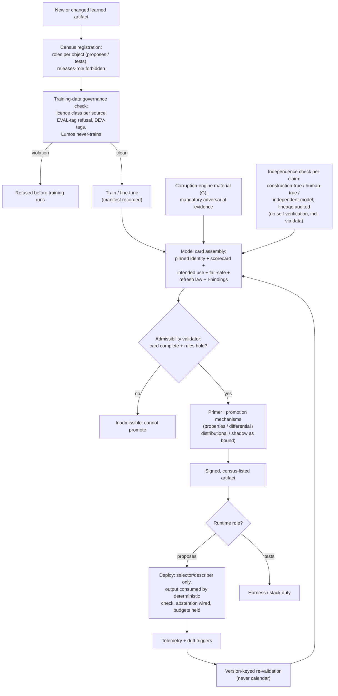

# Primer J — Model Governance & the ML Contract

> **Architecture spine.** The project's spine is the deterministic-release doctrine plus the signed content registry: *ML proposes and tests; only arithmetic releases.* Three spine attachments raise the spec: **conformal prediction** (Primer F) makes the probabilistic side honest, the **corruption engine** (Primer G) proves the deterministic side holds, and the **Lumos pathway** (Primer H) shows the assembly tracks reality. The six-mechanism **living evaluation stack** (Primer I) replaces archival golden-case regression throughout. This primer's position: the second cross-cutting lattice, peer to I — **I governs changes; J governs learned artifacts.** The two meet at promotion: no model promotes without a J-compliant model card passing I's mechanisms. Where the component primers answer "what does X do?", this primer answers "what must be true of *any* learned artifact for it to be admissible anywhere in the system?"

## J1. What this is

The engineering discipline for the ML itself — the census of every learned artifact in the architecture, the contract each must carry, the governance of what it may be trained on, the rules for where it may act, and the independence requirements on how it is judged. The existing primers scatter these as fragments ("with a scorecard," "version-pinned, fail-safe," "SnNout-tuned," "refresh keyed to the version registry"); this primer is their single authoritative statement — the ML equivalent of what the registry primer (D) does for content: nothing learned operates anywhere without a signed, versioned, verified identity.

Its central rule, compressed: **role-sharing is per-artifact-per-object — any model may propose and test different things; no model may verify anything whose errors it is positioned to share; and every scorecard claim names its independence source.**

## J2. Scope

**In scope — four bodies of law:**

**(a) The model census.** An explicit, maintained inventory of every learned artifact: embedding models (retrieval/hybrid ranking), the MedCAT coder and MetaCAT context models, the entailment checker, calibrated classifiers, cascade aggregation models, any Graph RAG reranker, and any LLM component used for selection or screening. Each entry tagged with its functional roles per object acted on: **proposes** (runtime selection/description — the coder's context coding, retrieval ranking), **tests** (harness and stack duty), and the prohibited class **releases** — which is empty by doctrine and stated as a standing invariant, not an observation. Dual-role artifacts are legitimate and recorded as such (MedCAT proposes at runtime and tests in the harness — same weights, same pin, and the sameness is a feature: divergence between dev-side and runtime coding would itself be a defect).

**(b) The model contract — admissibility properties every artifact carries:**
- **Pinned identity:** weights hash; training-data manifest with licence class per source; base-model provenance and licence; build reproducibility reference.
- **Scorecard:** metrics on named eval sets, per-stratum where safety-relevant; known failure modes written down; adversarial results against corruption-engine material (mandatory, not exemplary — G's outputs are required scorecard evidence for every model, stated here as rule); calibration status wherever the artifact emits scores or confidences.
- **Intended use:** what it acts on, what inputs are out of scope, and which side(s) of the propose/test line each function sits on.
- **Fail-safe semantics:** what downstream does when the model abstains, errors, times out, or emits low confidence — the coder's "uncoded context → most-restrictive gate behaviour" generalised to a mandatory declared behaviour per artifact, with abstention always a legal output.
- **Refresh law:** drift triggers and re-validation procedure keyed to the version registry (model, prompt, library, or population change), never the calendar; the labels-have-a-shelf-life rule applied to every dependent dataset.
- **Promotion binding:** which Primer I mechanisms gate this artifact's release, by name.

**(c) Training-data governance — the single authoritative table** consolidating rules currently spread across four documents: licence classes (permissive → trainable and shippable; NC → internal evaluation only, never training, never shipped artifacts; DUA/credentialed (MIMIC, n2c2, emrQA) → research sandbox quarantine); the EVAL-tag refusal rule (loaders reject casebundle-corpus assets, enforced and red-teamed per C and G); DEV-tagging of purpose-generated synthetic text; the Lumos never-trains rule (H); and provenance recording sufficient to answer, for any model, "what is in you and under what right?"

**(d) Runtime admissibility.** The hard constraints for any model acting live: only selectors and describers at runtime; every runtime ML output is consumed by a deterministic check before anything renders (the coder feeds gates, never bypasses them); mandatory abstention paths wired and tested; latency and availability budgets declared so fail-safe is real rather than theoretical; runtime errors alarmed and logged with version identity.

**Out of scope:** the components' own designs (their primers); change-release plumbing (Primer I — J supplies the artifact's card, I supplies the gauntlet); content governance (D); the corruption suites' construction (G — J only mandates their consumption).

## J3. Breadth and depth of content required

- **The independence-source taxonomy** — the intellectual core. Every scorecard claim must name where its ground truth comes from, drawn from three acceptable classes in descending strength: **deterministic construction** (corruption-engine material — labels true by fiat, immune to any model's blind spots); **human adjudication** (gold standards, PR review verdicts, delta sign-offs); or a **genuinely independent model** — different architecture *and* different training data. Explicitly inadmissible as sole evidence: a second copy or sibling fine-tune of the model under test; an LLM judging an LLM trained on similar corpora; and — the subtle one — evaluation sets whose labels were *produced by* an upstream model in the artifact's own lineage (the checker trained partly on cascade output inherits the coder's blind spots through the data, which is precisely why its card requires construction-true negatives and human-true domain pairs rather than cascade-derived evaluation alone). Correlation enters through data as easily as through weights; the taxonomy exists to catch both.
- **The census itself:** one row per artifact, maintained as versioned configuration, reviewed whenever a component primer adds a model.
- **Card templates and gold assets:** the model-card schema; the small human-adjudicated gold sets each artifact class needs (linker gold standard, checker domain pairs, query gold set) with their consumption ledgers — gold sets are spent by exposure just as calibration slices are.
- **Licence/provenance records:** per-source entries sufficient for the training-data table; counsel's standing guidance on the NC-for-eval question incorporated by reference.

## J4. Building in a silo

J is governance-as-code, buildable without touching any model's internals: the census schema, card template, and admissibility checker (a validator that refuses any artifact lacking a complete card — the registry's hash-gate pattern applied to models) are pure tooling. Silo scorecards: the validator rejects every deliberately incomplete or rule-violating card in a constructed test set (missing manifest, NC source in a training list, scorecard claim with no independence source, runtime role without fail-safe declaration, self-verification pairing); census coverage is total against a repo scan for model artifacts; and the independence checker catches planted lineage violations (a card citing evaluation labels produced by the artifact's own upstream). The corruption engine's discipline applied to paperwork: manufacture the violations, prove the gate catches them.

## J5. Folding it in

Stage 1: **census and cards retrofitted** to existing artifacts — MedCAT/MetaCAT first (dual-role, richest card), then checker, embeddings, classifiers; gaps found become the initial defect list. Stage 2: **admissibility as a hard gate** — Primer I's promotion mechanisms refuse any artifact without a valid card; the card joins the version-registry stamp as required promotion metadata. Stage 3: **runtime enforcement** — deployment tooling loads only census-listed, card-valid, signed artifacts (the D pattern: models become signed fragments of a kind); fail-safe behaviours fault-injected and verified per release. Stage 4: **standing review** — new models enter through census registration before first training run (so licence class is checked *before* data is consumed, not after); drift triggers wired to telemetry; the training-data table is freshness-monitored like any source. Governance loop: card updates travel through PR review like content, with the independence-source column receiving the same scrutiny a citation receives in the evidence table.

## J6. Definition of done

Census complete and provably total (repo-scan reconciliation); every artifact carrying a valid card with pinned identity, licence-clean manifest, independence-sourced scorecard including mandatory corruption-adversarial results, declared fail-safes, and named I-mechanism bindings; the releases-role invariant verified empty; no self-verification pairing anywhere (audited against the lineage graph, including data-mediated lineage); runtime loaders refusing card-less artifacts, fault-injection-tested; gold-set consumption ledgers current; and the negative audit — no learned artifact discoverable in the system that the census does not know.

## J7. Addenda and the LLM lattices

**Addendum J-1 (Variant 1b)** and **Addendum J-2 (Variant 2)** are attached to this primer: they are the two specified fillings of the runtime-coder census row, and everything else in the architecture is invariant across them. LLM use is governed by two further primers under this contract: **Primer K** (Classes 1–3 — offline and review-assist LLM augmentation, no classification impact; every LLM+prompt pairing a census row with a prompt-card and named verifier) and **Primer L** (Class 4+ — runtime LLM extensions, available only under Addendum J-2's posture, each a dossier line-item). The J invariants extend unchanged: an LLM may hold *proposes* and *tests* roles, never *releases*; and no LLM verifies output whose failure modes it shares.

## J8. Internal operations diagram




## J9. Execution layer

**Model card template (fillable):**

```yaml
artifact: {name, weights_sha256, build_ref}
roles: [{function, object_acted_on, side: proposes|tests}]   # "releases" is not a legal value
training_data: [{source, licence_class: PERMISSIVE|NC-EVAL-ONLY|DUA-QUARANTINE, in_training: bool, manifest_ref}]
scorecard:
  - {claim, metric, value, eval_set, stratum, independence_source: CONSTRUCTION|HUMAN|INDEPENDENT_MODEL, lineage_checked: bool}
adversarial: {g_suite_version, results_ref}                  # mandatory
calibration: {applicable: bool, method, report_ref}
intended_use: {inputs, out_of_scope, abstention_output}
fail_safe: {on_abstain, on_error, on_timeout, downstream_behaviour}
budgets: {p99_latency_ms, availability}
refresh: {triggers: [version-registry events], procedure_ref}
promotion_bindings: [I-mechanism ids]
signoff: {owner, reviewer, date, signature}
```

**Seeded census (initial rows):**

| Artifact | Roles (side) | Notes |
|---|---|---|
| MedCAT coder + MetaCAT | context coding (proposes — Variant 2 only); cascade + eval normalisation + dictionary mining (tests) | dual-role; runtime role is the Variant 1b/2 fork — under 1b the runtime slot is filled by `det-coder`, a signed content artifact, not a model |
| Entailment checker | fragment pre-screen, output audit (tests) | scorecard must include G negatives + human domain pairs; cascade-derived eval inadmissible as sole source |
| Embedding model(s) | retrieval/hybrid ranking (proposes) | output always consumed by registry gates |
| Calibrated classifiers (if deployed) | risk scoring (proposes) | calibration report mandatory |
| Cascade label aggregator | training-set construction (tests) | never runtime |
| Graph reranker (if adopted) | selection ordering (proposes) | selection-only; E5 contract applies |

**Training-data ruling table (as triaged this programme):** DDXPlus — PERMISSIVE (CC-BY, official figshare source only). MedMCQA, PubMedQA, MedQA — PERMISSIVE (MIT). MIRIAD — check current terms before training use; eval pending ruling. PMC-Patients, MedCalc-Bench — NC-EVAL-ONLY (CC BY-NC-SA); rebuild from PMC Commercial-Use subset for trainable equivalent. SciFact — NC-EVAL-ONLY. MedNLI, MIMIC-*, n2c2, emrQA — DUA-QUARANTINE (research sandbox; never training for shipped artifacts). ER-Reason — verify access terms; component-validation use. Huatuo-26M — excluded. Casebundle corpus — EVAL-tagged, refused by loaders, never any model use. Lumos-derived data — validation-only (H), never training. DEV-tagged synthetic — trainable. Production text — trainable post-consent/de-identification policy, manifest-recorded.

## Production topology annotation

*Per Architecture §11:* Manifests from **L1**; cards from L2; the admissibility validator enforced in every repo's CI at L4 (census provably total is an L4 exit criterion); the posture decision (Addendum J-1 vs J-2) is executed at L4 on L3's abstention evidence; negative audits run as scheduled jobs at L5.

## Register topology annotation

*Per Architecture §12 (register numbers R1–R28):* **Owns:** Model Census + Cards (R4), Training-Data Ruling Table (R5), and the Dossier Evidence Register (R23). **Writes/enforces:** the RoR negative audit is the J census-totality audit generalised. **Reads:** R2 (manifests), R3 (SBOMs), R22 (prompt-cards as census rows). The admissibility validator refuses any artifact absent from R4.

<!-- ECOSYSTEM-V2-BLOCK: J v1.0 -->
## J10. Build Execution Extension (Ecosystem v2.0)

**1. Mini-North-Star.** WHAT: census service + admissibility validator + card tooling per J9, serving both addenda symmetrically. WHY: J governs learned artifacts; this block builds the passport office. Endpoint: manifests L1, cards L2, enforced L4. Derives from and cites SPINE §13.1.

**2. Doctrine classification.** The admissibility validator is arithmetic; card drafting (K3.8) proposes.

**3. Scoped recon register.**
| ID | Verify | Tag |
|---|---|---|
| RECON-J-001 | Card YAML schema version in spine | E:REPO |
| RECON-J-002 | Dataset ruling table (J9) reconciled against R5 | E:REPO |

**4. Work register seed (Release-1-equivalent; schema per master v2 Phase 6; estimates ranged with confidence).**
```yaml
TASK-J-001:
  story: STORY-J-001 (no card, no deployment)
  component: admissibility
  title: Validator refusing incomplete or rule-violating cards
  purpose_chain: {what: "shared CI action per Arch §10", why: "a constructed-violation test set is its own G-style proof (J4 discipline)", endpoint_ref: "L4 exit (census provably total); SPINE-NS WHY"}
  evidence_refs: [E:DOC J4 and J9; RECON-J-001]
  definition_of_ready: ["card schema ratified"]
  steps: ["schema check", "NC-in-training refusal", "independence-source presence", "lineage self-verification check", "releases-role emptiness"]
  test_plan: "constructed violation set: every planted breach refused"
  observability: "refusal metrics by rule"
  definition_of_done: ["all planted breaches refused", "clean seed cards pass"]
  estimate: {optimistic: 2d, likely: 4d, pessimistic: 6d, confidence: medium}
  depends_on: []
  posture: both
```
```yaml
TASK-J-002:
  story: STORY-J-002 (the fork stays a decision, not a drift)
  component: census
  title: Posture-neutral census rows for the coder slot
  purpose_chain: {what: "census rows for det-coder (content-governed) and ml-coder (carded), both present, neither active until R19 records the L4 decision", why: "no build step may presuppose the fork", endpoint_ref: "L4 exit; SPINE-NS WHAT"}
  evidence_refs: [E:DOC Arch §9; E:DOC J7]
  definition_of_ready: ["R19 open"]
  steps: ["dual rows", "activation bound to the R19 entry"]
  test_plan: "activation test: absent an R19 decision, both rows stay inert"
  observability: "census-diff audit log"
  definition_of_done: ["inert until R19", "activation flips only on the recorded decision"]
  estimate: {optimistic: 1d, likely: 2d, pessimistic: 3d, confidence: high}
  depends_on: [TASK-J-001]
  posture: both
```

**5. Orchestration hooks.** `WF-J-1` on any model-artifact event: card check → census reconcile → verdict (idempotent by weights hash). Runs inside every repo CI per Arch §10.

**6. Observer checkpoint spec.** The Observer verifies census totality (R4 vs repo scan) and that any fork decision exists as an R19 entry with an armed trigger — never as an inference from merged code. Admissible: R4, R5, R19, repo scans.

**7. Implementer Contract binding.** This component's tickets execute under IMPL (SPINE §13.2). HALT triggers: any ticket presupposing J-1 or J-2 without a posture field → HALT: CHAIN-BREAK; any training manifest citing an NC source → HALT: SPEC-CONFLICT to R5.

**8. Gaps and register proposals.** None new; both addenda served symmetrically per mandate.

<!-- MET-1 METAMORPHOSIS & HARDENING ANNEX — APPENDED 2026-09-01. Pure append per X1 discipline; zero edits to pre-existing text above. Status: Proposed; R29 hardening state of this document: PENDING. -->
## J11. Metamorphosis & Hardening Annex — the three-branch posture + updated execution block

**The fork becomes a trident (labels only, mechanism intact).** Per REG-POSTURE `FORK-REG-001` (which governs regulatory content by MANIFEST precedence): **J-1 = lower-class included** (deterministic runtime), **J-2 = higher-class included** (ML coder live), and **J-3 = exempt-tier reserve** (Guideline-Prompt Profile — a distinct build artifact, not a Mākoha configuration; addendum carried in the Mākoha corpus as MAK-J3 v0.9-proposed and folded verbatim as MAK-FFC Annex 1). The L4 decision point, the L3 abstention evidence, and the pre-registered reversal triggers (R19) are unchanged. Everything here is **Needs confirmation** until `ASSUME-REG-002` is ATTESTED by written counsel opinion — which REG-POSTURE names as the *only* permitted route to reversing `REG-FIND-001`. Governance note on the fabric: the deterministic evaluator carries no learned parameters, so it needs no model card — and the census negative audit is precisely what proves that claim (releases-role verified empty, generalized).

| Execution field | Content |
|---|---|
| Execution purpose | Govern every learned artifact across three posture branches without presupposing the L4 decision |
| Inputs / prerequisites | Model-card template, seeded census, dataset ruling table (J8/J9); R30 (proposed) for REG-* rows; counsel engagement (TASK-REG-002) |
| Steps | 1 census registration precedes first training run → 2 licence class checked before data consumed → 3 card: pinned identity, licence-clean manifest, independence-sourced scorecard with mandatory G-adversarial evidence, declared fail-safes, named I-mechanism bindings → 4 admissibility validator in every repo CI: no card, no promotion → 5 posture decision at L4 recorded in R19 with trigger armed |
| Tools / repos / environments | `cdss-governance` (validator as shared CI action, runs in every repo) |
| Outputs & acceptance | Census + cards + validator; acceptance = census provably total (L4 exit); releases-role verified empty as a scheduled negative audit |
| Dependencies / handoffs | Gates I promotion; governs harness, coder, K/L prompt-cards; joins R19/R30 for posture state |
| Evidence to collect | R4 census/cards; R5 ruling table; R19 posture + trigger rows; counsel attestations into R30 |
| Failure handling / rollback | Card-less model found → promotion blocked + finding; posture reversal per armed trigger = coder-layer swap only (fork isolated to one census row by design) |
| Ownership & status | Repo: `cdss-governance`; regulatory owner [NEEDS DEFINITION]. Status: Transformed (labels, Proposed pending GATE-000); mechanism Retained |
| Source & research traceability | Primer J §J1–J9; Addenda J-1/J-2 (below, with their own annexes); MAK-J3; MAK-ANT §1/§3/§8 |
