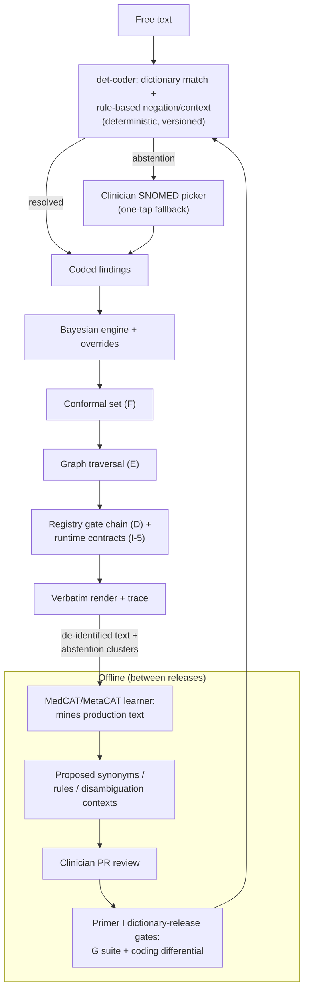

# Addendum J-1 (Variant 1b) — Deterministic Runtime Coder (Exemption Posture)
*Addendum to Primer J — Model Governance & the ML Contract: the fork lives in one census row; this addendum specifies the deterministic filling of it.*

> **Fork record.** This variant and Variant 2 share the entire architecture — spine, three attachments, both lattices, all primers — and differ in exactly one census row: **how findings get coded at runtime.** Here, no learned artifact runs at inference; the doctrine is applied one level deeper: *the ML proposes dictionary entries; only string-matching runs live.* Regulatory posture: designed to satisfy all three TGA exempt-CDSS criteria, including the glass-box requirement in its strictest reading.

## 1. Posture summary

Runtime is 100% deterministic end-to-end: dictionary-coded findings → Bayesian arithmetic → conformal quantile lookup → graph traversal (deterministic over a signed graph) → registry gate chain → verbatim render. Every step is same-input-same-output, replayable, and displayable to the clinician — the TGA's "logic used by the CDSS displayed to enable verification" test is met by construction, not by explanation features. All ML in the system is offline: harness, cascade, checker, and — the change this variant makes — the coder's learning half.

## 2. The runtime coder, specified

**Component: `det-coder`** — a compiled artifact, not a model:

- **Matcher:** exact + bounded-fuzzy (edit distance ≤ 1 on tokens ≥ 6 chars; none below) dictionary lookup against SNOMED CT-AU + AMT plus a **project synonym dictionary** (the vernacular layer: "puffed" → dyspnoea, versioned entries with provenance).
- **Context:** rule-based NegEx/ConText — regex trigger sets and scope windows for negation, experiencer, temporality. Fully enumerable; the rule file ships with the artifact.
- **Disambiguation:** hand-written context rules for the known ambiguous set (abbreviation tables with required context tokens). Anything unresolved → **typed abstention**, never a guess (property 18), surfaced to the clinician as an uncoded span with a one-tap SNOMED picker fallback.
- **Determinism law:** same text + same dictionary version → identical findings, hashable. The dictionary is **content, not a model** — it releases through the registry pattern: signed, versioned, PR-reviewed (clinician CODEOWNERS on synonym entries), corruption-suite attacked (G rows extended: poisoned synonym, scope-window tamper), differential-tested (mechanism 3 over a sampled text stream: old vs new dictionary, coding deltas adjudicated).

## 3. The offline improvement loop (where the ML now lives)

MedCAT + MetaCAT remain in the harness silo at full strength, with one added duty: **dictionary mining.** Between releases, the ML runs over accumulated de-identified production text and DEV-tagged synthetic, and *proposes* — candidate synonyms, missed-span reports (abstention clusters), new disambiguation contexts, rule-gap analyses. Every proposal lands as a PR against the dictionary; clinician review approves; Primer I's new change class ("dictionary release") gates promotion. The ML improves the rules between releases, never at inference. Abstention-rate per entity class becomes the loop's driving telemetry metric: it is the recall gap made visible, and its trend line is the evidence the loop is working.

## 4. Primer deltas (everything not listed is unchanged)

| Document | Delta |
|---|---|
| Annex H-1 | Runtime crossover section replaced: crossover is now the *dictionary artifact*, not a model. Cascade, gold standard, MedCATtrainer loop unchanged; add dictionary-mining duty. |
| Harness Primer | Stage 4 rewritten: no model deploys to runtime; the coder container ships as the deterministic artifact + its dictionary. Coder API contract (§8) unchanged in shape; `confidence` field dropped, `abstentions` promoted. |
| Primer J | Census row splits: `medcat-offline-learner` (roles: tests + proposes-dictionary-entries; never runtime) and `det-coder` (not a learned artifact — governed under D's content pattern; J records it only to verify the *releases-role-empty* and *no-runtime-ML* invariants now both hold system-wide). |
| Primer I | New change class row: **Dictionary release** → G suite (synonym/scope corruptions) + differential (coding deltas) + contracts after. |
| Primer G | Rulebook rows added: 19 poisoned synonym entry (maps vernacular to wrong CUI) → contradicted; 20 negation scope-window widened/narrowed across a boundary → contradicted. |
| Primer A | Unchanged — input contract identical; expect higher abstention inputs, already handled (property 8). |
| Primers D/E/F/C/H | Unchanged. |

## 5. Regulatory pathway (exempt CDSS)

Criteria mapping: (a) sole purpose = recommendations to health professionals — unchanged; (b) no device image/signal processing — unchanged by design; (c) clinical judgement retained — unchanged (sets, traces, accept/override). Glass-box: no runtime component learns; every runtime decision is enumerable rules + arithmetic; the "display the logic" obligation is met by the trace, the cited library rows, and the dictionary/rule files being inspectable. Obligations that remain despite exemption: TGA notification within 30 working days of supply; adverse-event reporting; advertising rules; essential principles including cybersecurity; and the standing duty to **reassess exemption status on any update** — which Primer I's change-class table now operationalises (any proposal to move ML into runtime is, by definition, a reclassification event, not a feature).

## 6. Trade-offs, stated honestly

Costs: recall on unseen vernacular (bounded by the mining loop's cadence); disambiguation coverage limited to the hand-ruled set; more clinician micro-interactions (picker fallbacks on abstentions). Gains: the cleanest possible regulatory posture; a runtime with zero model-drift surface; dictionary releases as cheap, reviewable, reversible content changes; and the strongest form of the project's own doctrine. The metric that decides whether the trade holds: abstention + picker-correction rate below an agreed ceiling per encounter — if the deterministic coder cannot get there after N mining cycles, that is the evidence-based trigger to reconsider Variant 2, recorded in advance.

## 7. Runtime diagram (Variant 1b)

## Production topology annotation

*Per Architecture §11:* The det-coder is **L3's coder** — every maturity path passes through it; the L3 abstention/picker-correction baseline is the pre-registered evidence on which L4's posture decision is made.

## Register topology annotation

*Per Architecture §12 (register numbers R1–R28):* **Owns:** Dictionary Register (R17, versioned + signed, L3). **Writes:** dictionary releases into R1; mining proposals through PR into R17. **Reads:** abstention clusters from R13. Under this posture R4 records `det-coder` as content-governed, and R19 holds the armed reversal trigger (abstention ceiling).

<!-- MET-1 METAMORPHOSIS & HARDENING ANNEX — APPENDED 2026-09-01. Pure append per X1 discipline; zero edits to pre-existing text above. Status: Proposed; R29 hardening state of this document: PENDING. -->
## 8. Metamorphosis & Hardening Annex — posture relabel notice (C-01)

**Relabel notice — Needs confirmation pending GATE-000.** This addendum's title and §5 frame the deterministic runtime as the **exemption posture**. REG-POSTURE v1.0 finds the exemption very unlikely to be available to Mākoha regardless of the coder choice (`REG-FIND-001`: the disqualifier is the diagnostic function; `REG-FIND-002`: a ranked differential with posteriors is diagnosis-contributing; `REG-FIND-003`: determinism ≠ transparency). Under `FORK-REG-001` this branch is relabeled **J-1 — lower-class included posture**. Everything mechanical in §1–§4 and §6–§7 stands unchanged, and its rationale is *strengthened*, not stranded: per `REG-KEEP-001`, the deterministic release path "no longer exemption-motivated; remains correct safety architecture and strengthens the Essential Principles case." §5 ("Regulatory pathway (exempt CDSS)") is superseded by REG-POSTURE §4 obligations once `ASSUME-REG-002` is ATTESTED; the original text is preserved above unedited per the append-only law, carrying this deprecation notice per the `deprecation-and-migration` discipline of the hardening pass. The pre-registered reconsideration trigger (recall/abstention ceiling) is unchanged and remains armed in R19. The exempt tier itself is not abandoned — it is re-homed in **J-3 (GPP)**, which ships guideline prompts without a differential and therefore *can* satisfy criteria (a)(b)(c) by structural absence.
