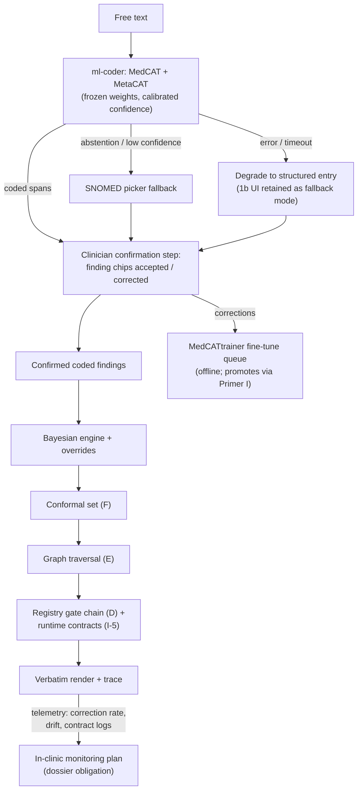

# Addendum J-2 (Variant 2) — ML Coder at Runtime (SaMD Posture)
*Addendum to Primer J — Model Governance & the ML Contract: the fork lives in one census row; this addendum specifies the ML filling of it, and is the posture Primer L requires.*

> **Fork record.** This variant and Variant 1b share the entire architecture — spine, three attachments, both lattices, all primers — and differ in exactly one census row: **how findings get coded at runtime.** Here, the MedCAT/MetaCAT coder runs live as the single runtime ML crossover, exactly as the primers currently describe. Regulatory posture: the system is accepted as an **included software-based medical device** (ARTG inclusion, conformity assessment), and the whole evidence stack is aimed at winning that classification rather than avoiding it.

## 1. Posture summary

Runtime contains one learned artifact — the coder — whose output is *selection and description only* and is consumed by deterministic checks before anything renders. Everything downstream of the coder is identical to Variant 1b: arithmetic engine, conformal quantiles, signed graph, registry gates, verbatim render. The classification consequence is accepted knowingly: current TGA guidance holds that an AI-enabled CDSS does not meet the exemption criteria, so this variant does not argue the exemption — it builds the dossier. Classification is assessed on intended purpose; a decision-support device informing (not making) diagnosis for clinicians lands in the included-device classes, with the exact class confirmed against the software classification rules at submission — a determination for the regulatory consultant, planned for rather than presumed here.

## 2. The runtime coder, specified

**Component: `ml-coder`** — MedCAT (dictionary + learned disambiguation embeddings) + MetaCAT (negation, experiencer, temporality), deployed frozen:

- **Version freeze law:** weights hash pinned per release; no online learning, no runtime adaptation — the model changes only through Primer I's engine-class gauntlet. "Deployed frozen, improved offline" is the SaMD change-management story regulators recognise.
- **Confidence + abstention:** calibrated per-span confidence; below-threshold spans are typed abstentions surfaced with the same one-tap SNOMED picker fallback as 1b. Thresholds are J-card configuration, version-controlled.
- **Clinician confirmation step (the load-bearing mitigation):** coded findings render for confirmation *before* the engine consumes them — the clinician sees "dyspnoea (present), chest pain (denied), ex-smoker" as chips, corrects or accepts. This keeps criterion-(c) substance intact regardless of classification (judgement is exercised on the inputs, not just the outputs), converts every correction into MedCATtrainer fine-tuning data, and bounds the blast radius of any mis-code to a reviewable UI element rather than a silent posterior shift.
- **Fail-safe:** coder error/timeout/unavailability degrades the encounter to structured entry (the 1b picker UI is retained as the fallback mode) — the product never has a hard dependency on the model being up.

## 3. Regulatory pathway (included SaMD)

What inclusion buys and costs: ARTG entry via conformity assessment against the Essential Principles; a certified QMS (ISO 13485-class); clinical evidence proportionate to classification; cybersecurity and post-market obligations; and — for the AI component specifically — the TGA's AI-guidance expectations of transparency over training data, validation, and ongoing in-clinic performance monitoring. The architecture was built as if this were the destination, so the dossier mapping is direct:

| Evidence expectation | Supplied by |
|---|---|
| Algorithm transparency / clinician reviewability | Engine trace (A8), displayed library rows + tiers (B), verbatim registry rendering (D) |
| Training-data transparency | J-card manifests + dataset ruling table (J8); DEV/EVAL/quarantine provenance regime |
| Validation | DDXPlus machinery proofs, linker gold standard + ER-Reason external check, corpus checkpoint evaluations (C), conformal coverage reports (F) |
| Ongoing performance monitoring | Acceptance telemetry (#6), coder-correction rates from the confirmation step, drift monitors, contract-violation logs (I-5) |
| Change control | Version registry + Primer I mechanism bindings + differential-testing adjudication logs as the change-control record |
| Clinical outcome evidence | Lumos pathway Stage 3 (H) as the flagship |
| Adversarial robustness | Corruption catch-rate reports (G), including coder-targeted rows |

Synthetic data caveat, planned for: regulator guidance treats synthetic data as supplementary — it will generally not replace clinical data for safety/performance claims. Hence the corpus and DDXPlus prove machinery, the confirmation-step telemetry and Lumos supply the clinical-data core of the claim.

## 4. Primer deltas (everything not listed is unchanged)

| Document | Delta |
|---|---|
| Annex H-1 / Harness | As currently written — Stage 4 runtime crossover stands; add the confirmation-step UI to the crossover contract and its correction stream to the MedCATtrainer loop. |
| Primer J | Census as currently seeded; `ml-coder` card gains: calibrated-confidence report, abstention thresholds as config, confirmation-step correction-rate as a mandatory ongoing scorecard metric, in-clinic monitoring plan reference. |
| Primer I | Coder changes bind to the full engine-class row (already true); add coder-correction-rate to the distributional gate metrics and its drift band to tolerances. |
| Primer G | Rulebook rows added: 21 adversarial span (text engineered to force a plausible wrong CUI) → contradicted, coder must abstain or the confirmation step must catch; 22 negation-evasion phrasing → contradicted. |
| Primer C | Checkpoint protocol notes the confirmation step: corpus evaluations run both auto-accepted and clinician-corrected input modes, reported separately. |
| Primers A/B/D/E/F/H | Unchanged — the deterministic downstream is identical across variants. |

## 5. Trade-offs, stated honestly

Gains: full free-text convenience; best recall on vernacular from day one; the correction loop compounds (every confirmation click is training signal); no abstention-ceiling anxiety. Costs: conformity assessment timeline and QMS overhead before first supply; every coder update is a regulated change (mitigated by the predetermined change-control style already native to Primer I); the marketing sentence "no AI in the runtime" is unavailable; and the system carries a permanent in-clinic model-monitoring obligation. The decision metric mirroring 1b's: if the confirmation step shows sustained correction rates low enough that structured entry would cost little, the expensive posture is buying convenience the clinicians aren't using — the pre-registered trigger to reconsider 1b.

## 6. Runtime diagram (Variant 2)

## Production topology annotation

*Per Architecture §11:* Available only from **L4** (posture decision) onward; its confirmation-step UI is retained at L3 as the picker fallback, so adopting J-2 at L4 is a coder swap, not a UI rebuild; prerequisite for every Primer L capability at L5.

## Register topology annotation

*Per Architecture §12 (register numbers R1–R28):* **Owns:** the in-clinic monitoring plan entries within R23. **Writes:** correction-rate telemetry into R13; every coder version into R1/R4 with full card. **Reads:** R19 — this posture exists as a recorded L4 decision with its own armed reversal trigger (correction-rate floor).

<!-- MET-1 METAMORPHOSIS & HARDENING ANNEX — APPENDED 2026-09-01. Pure append per X1 discipline; zero edits to pre-existing text above. Status: Proposed; R29 hardening state of this document: PENDING. -->
## 7. Metamorphosis & Hardening Annex — posture relabel notice (C-01)

**Relabel notice — Needs confirmation pending GATE-000.** Under `FORK-REG-001` this branch is relabeled **J-2 — higher-class included posture**. It was already the ARTG-inclusion path, so the delta is smallest here: the framing changes from "the branch that accepts classification" to "the higher of two classifications both branches now expect." §3's regulatory pathway reads correctly under the new frame; the clinician-confirmation step, the dossier mapping from the existing evidence stack, the in-clinic monitoring obligation, and the pre-registered correction-rate reversal trigger (R19) all stand unchanged. Primer L's dependency line ("requires posture of J-2") now reads "requires the higher-class included posture" — label-only. Classification rule and class remain external questions (`ASSUME-REG-001`, `Q-REG-001`, counsel-attested only).
