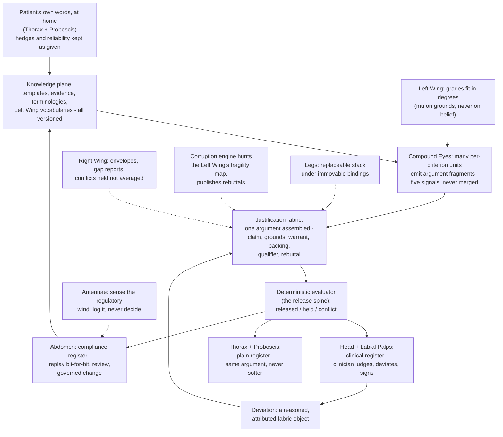

# Primer 0 — The Butterfly Explainer
### What the butterfly is, what every piece does, and how they fit together — in plain language, before any other document in this set

> **Justification fabric.** The butterfly's body is the justification fabric plus the deterministic evaluator: *every claim is an argument; only arithmetic releases.* One argument object renders in three registers to three faces; the fabric is append-only, hash-chained, and version-pinned so any decision replays bit-for-bit. Two wings paint the body — the **Left Wing** (MAK-LWC) senses in degrees, the **Right Wing** (MAK-RWC) judges in systems — and their coordination is the flight (MAK-MIF). The host is **MAK-FFC v1.1**: no primer here relaxes a corpus MUST. Regulatory content is governed by **REG-POSTURE v1.0** via **MAK-ANT** — assume inclusion, glass-box as the design target, ASSUME-REG-001..007 open pending counsel. This primer's position: *the front door — read before any other document in this set.*

*This is the front door. Every other document in the butterfly set assumes you have read it. It contains no schemas, no numbers to sign off, and no obligations — only understanding. Requirement IDs appear here only as signposts to where a thing is defined, never as rules.*

---

## 1. What this project is

The same clinical decision support system the 02_ Primer 0 describes — Australian general practice, a ranked differential with honest probabilities, verbatim guidance from trusted sources, the clinician always deciding — seen one layer up. The 02_ stack is the **arithmetic core**: an engine that does transparent probability sums, a signed content registry with five gates, a saboteur that attacks the gates, and a firewalled exam. The **butterfly** is the argument-shaped layer wrapped around that core. It is not a second product and not a rewrite; it is the same machine with one added commitment: nothing the system says to anyone is ever a bare number or a bare alert. Every recommendation, every warning, every suppressed warning, every override, and every release is a small, complete **argument** — here is the claim, here is the patient data it rests on, here is the rule that licenses the step, here is why that rule deserves trust, here is how sure we are, and here is what would make it wrong.

That argument object is called the **justification fabric**, and it is the butterfly's body. Three **faces** read the body — a clinician's face, a patient's face, and an auditor's face — each seeing the *same* argument rendered in its own language. Two **wings** move the body: the Left Wing lets the system speak in degrees ("borderline", "a little high", "fairly sure") without lying about it, and the Right Wing lets the system know when a guideline does not quite fit, hold two guidelines that disagree without pretending they agree, and record a clinician's departure from a rule as something reasoned rather than as a violation.

How does the butterfly relate to the 02_ stack in one sentence? The 02_ "release spine" — the deterministic release path plus the signed registry — *is* the fabric's deterministic evaluator made concrete (the Architecture's §14.1 nomenclature ruling). The arithmetic that already stood between content and screen now also has to check a whole argument tree, not just a fragment. Same door; a fuller passport.

## 2. The one rule

> **Every claim is an argument; only arithmetic releases.**

The second half is the 02_ rule, word for word: machine learning and AI may *propose* and *test*, but the final check before anything reaches a face is simple, inspectable arithmetic. The first half is the butterfly's one added clause — what the arithmetic checks is no longer a fragment's hash and date alone but a completed argument, with its uncertainty stated and its known failure conditions filled in; an argument missing either is not released, however good its score.

## 3. The cast — every piece in a few sentences

The butterfly is drawn as an insect, and each primer is named for the body part it plays. The anatomy is a memory aid, not a metaphor to be pushed.

**The Left Wing — fuzzy logic (PRM-LWC).** A governed dictionary of vague clinical words — "elderly", "elevated", "severe" — each with a curve saying *how much* a value counts as that word, versioned and ratified like any other content. It grades how well a patient's data fits a criterion (a **μ** of 0.6 means "sixty per cent of the way to elevated"), and it can decode results back into plain words a patient owns. Its cardinal law: fuzzy machinery grades *meaning*, never *belief* — probabilities and confidence live elsewhere. It has no learned parameters, so it sits inside the deterministic runtime. It is structurally absent from the exempt-tier product (§7).

**The Right Wing — meta-rationality (PRM-RWC).** The judgment-of-systems layer. It cannot decide whether a guideline fits a patient — no algorithm can — but it can *detect the occasions* when a human should decide, and record what the human did. It keeps an **applicability envelope** for every formal element (who it was validated on, where it is known to fail), invites **gap reports** when the map has run out, materialises conflicts between guidelines instead of ranking them away, and runs every change to the system's categories through one governed lifecycle. Doctrine in a line: *computerise the occasions of meta-rational judgment, never the judgment.*

**The Compound Eyes — engines (PRM-CEC).** The engine plane: many small per-criterion decision units (each an *ommatidium* — one facet of the compound eye) that emit argument *fragments*, never released claims. Five kinds of signal travel through it and never merge — posterior, coverage, membership, reliability, fit. One compiler is the only way clinical logic enters (guideline text → computable template); one adversary attacks it with three target maps; one five-stage release gate, with a fixed order, decides *released / held / conflict*. No single unit sees the patient; the fabric assembles the mosaic and the evaluator alone releases it.

**The Head — Clinician Face (PRM-HDC).** Where the whole evidentiary machine concentrates into one clinician's judgment. It performs no inference of its own: every widget is a read of evaluator-released arguments and nothing else (the *one-surface law*). Its few writes are all evidentiary — sign-off, deviation, gap report, fit-judgment, conflict navigation — and the sign-off is fail-closed: nothing diagnostic reaches a patient without an attributed clinician signature.

**The Thorax — Patient Face (PRM-TXC).** Where nearly all the patient data originates, captured before the encounter in the words patients actually use — hedges, "between X and Y", "not sure" — stored as given, never rounded to a point. It reflects a patient's own observations back at once, but anything diagnostic waits for the clinician's signature (the *bright line*). What it shows is the same argument the clinician signed, translated to plain language — never a softer version. The patient keeps custody of their record and can see who read it.

**The Abdomen — Auditor Face (PRM-ABC).** The keystone no prior system built: a read model over evidence the system produces natively, not a surveillance layer bolted on. It cannot write into clinical data; its only writes are review states, dispute records, and change proposals — each itself an argument. It reframes "non-compliance" as "documented rational intent", and it is where regulatory obligations stop being assertions and become generated evidence. House line: *the face that judges the system must be the most judged surface in it.*

**The Proboscis — Patient UI (PRM-PRB).** The pixels and taps that realise the Patient Face: nine screens, ten governed components, a plain design language, and an accessibility floor that is the release gate. Its test: a tired person with a cheap phone, low literacy and thirty seconds of patience can answer honestly, see their data reflected, and never be lied to by simplification. It computes nothing clinical.

**The Labial Palps — Clinician UI (PRM-LBP).** The pixels and keystrokes that realise the Clinician Face inside a nine-minute consultation. A single component library with an *identity sheet* compiled in, so each of the five signals has exactly one look and one vocabulary and they never wear each other's clothes. Ninety seconds to the picture, one interaction to the basis, one interaction to disagree.

**The Legs — the default stack (PRM-LEG).** Six legs — frontend, backend, database, cache and queue, storage, infrastructure — chosen for boringness and hireability. Its one structural law: *defaults are suggestions; bindings are law.* The bindings restate series law at stack level (pins that replay, one gate to the faces, tamper-evident ledger storage). The moat is the fabric, not the stack.

**The Antennae — regulatory sensing (PRM-ANT).** A watch-and-log component: one regulatory citation surface, a log of external signals with their assessed bearing, a map of which volume carries which obligation, and the state of seven open assumptions awaiting counsel. Cardinal rule: *the antennae sense; they never decide.* No document in this set — and no AI working from it — may close a regulatory assumption.

**Five volumes with no primer of their own.** *MAK-FFC* is the host law every primer answers to — you read it, you do not implement it separately. *MAK-ELSM* is the sourcing map: a record of which external components were verified and when, consumed by every primer's asset table. *MAK-MIF* is the flight doctrine — informative synthesis, minting no requirements. *MAK-DOT* is the Left Wing's research base, fully absorbed into MAK-LWC. *MAK-J3* is the exempt-tier addendum, folded into MAK-FFC as an annex; its requirements land provisionally inside PRM-CEC, because the exempt product is exactly the engine plane with everything probabilistic removed.

## 4. One consultation, start to finish — through the butterfly

A woman in her late sixties with kidney disease, mild heart failure and new breathlessness fills in the intake at home the evening before. The Patient Face asks in plain words; she answers "worse than last month, but I'm not sure how much" and "sleep has been poor — fairly sure about that." The Thorax stores exactly that: a graded answer, a hedge, and a stated reliability (a Z-number, in the Left Wing's vocabulary), not a forced score. Her own answers reflect straight back to her screen; nothing diagnostic does.

In the consultation the Compound Eyes get to work. Each per-criterion unit reads her data and the pinned guideline template and emits a fragment. The Left Wing grades the fit: she satisfies the heart-failure pathway's criteria to degree 0.6 — borderline, and the edge is *measured*, not hidden (MAK-MIF beat 1). The Bayesian engine supplies a ranked differential as candidate claims with posteriors; the conformal wrapper supplies the qualifier — a set with stated coverage; the evidence library supplies backing; the corruption engine's standing findings and her kidney function supply rebuttals. The fabric assembles these into one argument tree. The deterministic evaluator walks the tree against the template: qualifier present, rebuttals filled, pins complete, content signed — *released*.

Two guidelines both claim her. The Right Wing does not pick one. It materialises the conflict and shows how much each guideline claims her (beat 4); the clinician's choice between them will be recorded as the systems-judgment it is. Where the community itself disagrees about where "elderly" begins, the system holds the band rather than the point (beat 5).

The Head shows the picture in ninety seconds: differential, coverage, fit, the conflict, the five signals each in their own clothes. The clinician judges that the pathway's dose recommendation does not fit her kidneys and departs from it. That departure is not an exception outside the system — the Deviation Composer makes it a structured, reasoned, attributed object linked to the argument, and the clinician signs.

Now one argument object renders three times. The Head has already shown the clinical register. The Thorax decodes the *same* argument into the plain register — "your heart medicine is being adjusted because of your kidneys; here is why" — with the uncertainty and the deviation intact, never softened (beat 2). The Abdomen renders the compliance register: the argument, the departure localised to the exact rule node, the pinned versions, the evaluator's stage trace.

A year later an auditor asks why. The Abdomen replays the encounter bit-for-bit from its pins — old guideline version, old membership curves, old evidence snapshot — and the same argument comes out. Her deviation, aggregated with others like it, has meanwhile become a change proposal against the guideline template; the ontology metabolised what the clinic learned (beat 3).

## 5. How it stays safe and honest

The 02_ Primer 0 layered four ideas: the **spine** (only arithmetic releases), the **saboteur** (the corruption engine proves the gates work), the **honest wrapper** (conformal guarantees), and the **outside world** (the firewalled exam and real outcomes). The butterfly does not replace any of them; it adds four of its own, each layered onto one of the originals.

**Argument-native** sits on the spine: the arithmetic now checks a complete argument, so a claim with no stated uncertainty or an empty rebuttal slot cannot pass, however confident the model. **The append-only ledger** sits on the saboteur's evidence and the 02_ registers: every argument, deviation, gap report and release is a hash-chained entry; corrections are new entries that supersede, never edits. **The deterministic evaluator** is the honest wrapper's guarantee extended to the whole tree: versioned, testable, free of learned parameters — the conformal set is one *input* to it. **Three registers from one object** is the outside world brought inside: because the patient, clinician and auditor read the same argument, the system cannot drift into three truths, and the auditor's replay is an independent check on what everyone else was told.

Beneath all eight, the ledger registers — thirty now, with R29 (hardening coverage) and R30 (regulatory posture) joining the original twenty-eight — on the unchanged principle that *if it is not in a register, it did not happen*. And across all of it, the Antennae's discipline: the regulatory posture is cited, never paraphrased, and never closed by anyone but counsel.

## 6. How it gets built and grows

The five maturity levels are unchanged from the 02_ Architecture — L1 glass-box core, L2 signed content, L3 honest uncertainty and coded intake (the first prototype a pilot clinician touches), L4 full governance at scale, L5 target state. The butterfly enters level by level (Architecture §14.5):

**L1** — the fabric's argument schema, version zero: arguments exist as objects even before anything renders them.
**L2** — the evaluator wrap goes live: the existing release path now evaluates argument trees; the Clinician Face appears as v0, a verbatim render surface.
**L3** — the Deviation Composer; the Guideline Compiler v0 (narrative guideline → computable template); the Clinician Face's one-surface law enforced; the Patient Face and UI in their intake-and-consent subset only; the Auditor Face's read model v0.
**L4** — the compliance projector; multi-domain compiler; clinician team modes; the Fuzzy layer, *if and when* its ratification decision (DEC-05) passes; the first GPP release, provisionally; the Patient Face's wider scope decided by the counsel answer on ASSUME-REG-003.
**L5** — everything full; the Auditor Face's external projection; the GPP a maintained reserve.

Repositories follow the 02_ pattern — one per component, shared contracts in the spine repo, assembly by pinned versions — with four newcomers: `cdss-fabric`, `cdss-compiler`, `cdss-ui-clinician`, `cdss-ui-patient`; the GPP is a release channel, not a repo. The discipline throughout is **additive-only**: no volume relaxes a host MUST, requirement IDs are cited never re-minted, retired IDs are never reused, and every change to this set — including to this document — is an appended entry, never an edit to what stands.

## 7. The one big choice

The 02_ fork asked whether the runtime coder is deterministic (J-1) or learned (J-2). The regulatory posture then found that the fork's original framing did not hold: the differential itself — new diagnostic information — is what the Australian exemption cannot accommodate, so both J-1 and J-2 are *included* products, at a lower and a higher class. That is a finding awaiting written counsel; this document does not render an opinion on it.

The butterfly restates the fork as a question about what may be *rendered*. The exempt tier — **J-3, the Guideline-Prompt Profile (GPP)** — is the body with the diagnostic organs structurally absent: the compiler and evaluator remain; warrants may only be guideline rules; the only permitted qualifier is a plain statement of which population a prompt applies to. It cannot render a differential, a posterior, a conformal set, a membership grade, or anything that reads as diagnosis, screening or monitoring, and the evaluator refuses drafts that carry them and logs the refusal. Crossing that boundary is a new device, never an upgrade.

What classification buys is the whole butterfly in flight: the differential with its honest uncertainty, the Left Wing's graded reading of the borderline patient, the Right Wing's conflict-holding and deviation machinery — and, under the higher class, the Primer L frontier that MAK-FFC's engine part describes as the LLM on a leash: reading the patient's narrative into fuzzy predicates the symbolic layer verifies, narrating the arithmetic, drafting letters where every sentence traces — the model proposing, the argument tree deciding, never holding the pen that signs (beat 8). Downstream of the fork the three products share one codebase and one fabric, so the choice is recorded, reversible, and made on Level 3's evidence at Level 4, as before.

## 8. Where to start, by who you are

**New engineer:** this document → MAK-MIF §01–03 (the doctrine in twenty minutes) → MAK-FFC Part 2 (the argument object and the engine contract) → PRM-CEC → the primer for your component → PRM-LEG for the stack bindings. **Clinician advisor:** this document → MAK-MIF beats 1, 4 and 5 → PRM-HDC §HDC1 and PRM-LBP §LBP1 (the screen you will sit at) → PRM-RWC §RWC1 (deviation as a first-class object — it wants your red pen) → PRM-LWC §LWC1 (the words and their curves). **Regulator or regulatory consultant:** this document → MAK-FFC Thesis and Part 1 → PRM-ANT (the citation surface and the open assumptions) → PRM-ABC (where obligations become generated evidence) → §7 here → MAK-FFC Annex 1 (the GPP). **Investor or partner:** this document → MAK-MIF "Why coordination, in one breath" → Architecture §11 and §14.5 (the roadmap) → PRM-LEG §LEG1 ("the moat is the fabric, not the stack") → PRM-TXC §TXC1 (the patient as auditor of their own record). **Builders:** every primer's build block is at its §-9 and its findings at §-10; the Architecture §14 extension and the MANIFEST precedence paragraph govern conflicts.

## 9. Glossary of house vocabulary

**Fabric (justification fabric)** — the append-only, hash-chained, version-pinned store of arguments that every component writes to and every face reads from; the butterfly's body. **Argument** — the unit of everything released: claim, grounds, warrant, backing, qualifier, rebuttal (Toulmin's six). **GenericArgument / ActualArgument** — the community-ratified *template* of admissible data, rules and claims, versus the *instance* a specific patient's case fills in; a deviation is an actual argument whose warrant departs from its template, on the record. **Register (rendering)** — one of the *three* ways an argument is spoken: clinical, plain-language, compliance. Renderers may compress or reorder; they may never add, remove or reweight. **Register (ledger)** — one of the *thirty* house ledgers (R1–R30) in which every artifact, decision, exposure and incident is recorded; "if it is not in a register, it did not happen." The two senses share a word and nothing else; context always tells which. **Face** — one of three role surfaces (clinician, patient, auditor) reading the fabric in its own rendering register. **Wing** — the Left Wing (fuzzy logic: semantics of degree) or the Right Wing (meta-rationality: judgment of systems). **Beat** — one of eight coordination patterns in MAK-MIF in which the left wing senses, the right wing judges, and the body records; cited as "MAK-MIF beat n". **μ / gradedness** — membership: how far a value counts as a word, from 0 to 1; grades meaning, never belief, and is never a probability. **Codebook** — the ratified vocabulary a rendering register may speak; all three derive from the same linguistic variables so translation cannot reweight. **Envelope (applicability envelope)** — the recorded population, context and known gaps within which a formal element has warrant; data, not prose. **Gap report** — a face-side report that the map has run out; a fabric object that feeds remodeling. **Deviation** — a clinician's structured, reasoned, attributed departure from a template, linked to the argument; first-class, never blocked except by a deterministic safety class. **Trading zone** — a chartered place where different expertise (clinical, patient, compliance) negotiates shared meaning; the pidgin is engineered, not hoped for. **Evaluator (deterministic evaluator)** — the versioned, learned-parameter-free arithmetic that walks a completed argument tree and returns released, held, or conflict; the 02_ "release spine" made concrete. **Ommatidium** — one per-criterion engine unit; a stateless function that emits an argument draft. **Five signals** — posterior, coverage, membership, reliability, fit: never merged, never rendered in each other's clothes. **One-surface law** — every clinician widget renders evaluator-released arguments and nothing else. **Bright line** — the patient sees their own data at once; anything diagnostic waits for a clinician's signature. **Identity sheet** — the versioned design artifact giving each signal one look and one vocabulary. **Signal (regulatory)** — an external regulatory event, logged with date, source and bearing; it never amends the posture. **GPP** — the Guideline-Prompt Profile: the J-3 exempt-tier build artifact, with diagnosis-contributing capability structurally absent. **J-1 / J-2 / J-3** — deterministic runtime (lower-class included) / learned coder live (higher-class included) / exempt-tier reserve. **DEC-n** — an item in the Metamorphosis ratification queue (DEC-01..DEC-10); DEC-05 decides the Fuzzy layer's entry. **ASSUME-REG-n** — one of seven regulatory assumptions open until counsel's written attestation. **Release spine** — the 02_ term for the deterministic release path plus signed registry, kept distinct from the fabric's SPINE-n requirement IDs.

## 10. The whole system in one picture

*The body carries the argument; the wings give it flight; the faces read one truth in three tongues; and the Antennae listen without ever holding the pen.*
