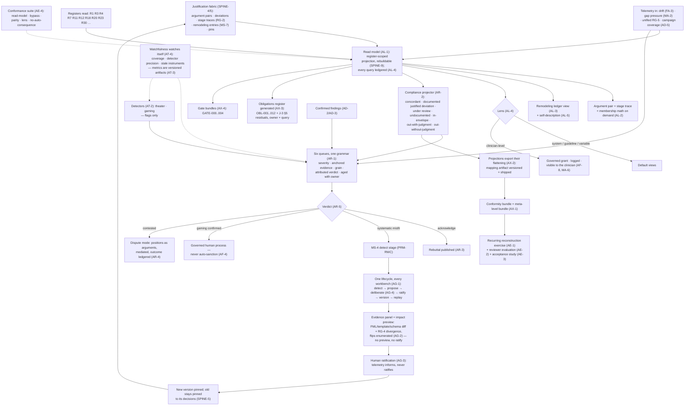

# Primer ABC — The Auditor Face

> **Justification fabric.** The butterfly's body is the justification fabric plus the deterministic evaluator: *every claim is an argument; only arithmetic releases.* One argument object renders in three registers to three faces; the fabric is append-only, hash-chained, and version-pinned so any decision replays bit-for-bit. Two wings paint the body — the **Left Wing** (MAK-LWC) senses in degrees, the **Right Wing** (MAK-RWC) judges in systems — and their coordination is the flight (MAK-MIF). The host is **MAK-FFC v1.1**: no primer here relaxes a corpus MUST. Regulatory content is governed by **REG-POSTURE v1.0** via **MAK-ANT** — assume inclusion, glass-box as the design target, ASSUME-REG-001..007 open pending counsel. This primer's position: *the abdomen — the read model that metabolises every register the body keeps into review, governed change and conformity evidence; read-only toward care, argued in every write, honest about every flattening, and the surface where the posture's obligations stop being assertions and become generated evidence.*

## ABC1. What this is

The auditor face is the third register of the one argument object (MAK-FFC SPINE-3) and, by the host's own founding finding, the face with no precedent to copy (MAK-FFC Part 5). Its constitution is the read-model law: no write path into clinical data, arguments, deviations, curves, envelopes or templates; its only writes are review states, dispute records and governed change proposals, each an argued, attributed fabric entry (AL-1, carrying MAK-FFC AF-1). Everything else the face does is reading — argument pairs with departures localised to warrant nodes, extended by the evaluator's stage trace and the full membership math on demand (AL-2); the remodeling ledger reconstructing the ontology's history for any element at any date (AL-3); the system's self-description at audit grain (AL-5) — and then metabolising what it reads into three outputs: one review grammar over six queues (AR-1..5), one governed-change lifecycle behind every workbench (AG-1..4), and projections that ship their own flattening (AX-1..4), watched by instruments that watch themselves (AT-1..5) and validated by a recurring reconstruction exercise (AE-1..4). The defining property, in the corpus's own words: *the face that judges the system must be the most judged surface in it* (MAK-ABC Part 1). Under assume-inclusion this face is not back office; it is the conformity evidence factory — REG-KEEP-002's reviewable basis, REG-FIND-004's glass box, the OBL register and the GATE evidence all render here (MAK-ABC Part 0, Part 6).

*Trace: MAK-ABC Thesis; Part 0; Part 1 four face-level laws (i)–(iv); AL-1, AL-2, AL-3, AL-5, AR-1, AG-1, AT-4, AX-2, AE-1; MAK-FFC Part 5, AF-1, SPINE-3.*

## ABC2. Scope

**In scope** — the six MAK-ABC requirement families this primer owns:

- **AL-1..5 · Ledger read model.** The read-model law with negative tests (AL-1); argument pairs + RG-2 stage trace + FA-1 membership math (AL-2); the remodeling ledger view (AL-3); ledgered queries and governed-grant lens discipline (AL-4); the self-description view generated from fabric data (AL-5).
- **AR-1..5 · Review workflows.** One review grammar for every queue — severity-ranked, evidence-anchored, verdicts at the correct grain, aged with owners (AR-1); the consolidated compliance vocabulary including the reframing and the three envelope states (AR-2); boundary-sweep and campaign findings reviewed like deviations, elevated to MUST (AR-3); dispute mode as structured ODR (AR-4); deterministic feed-forward of verdicts (AR-5).
- **AG-1..4 · Governed change.** Every workbench an instance of the MS-4 lifecycle with no side door (AG-1); proposals carrying evidence panel + impact preview, ratification invalid without a current preview (AG-2); change pressure through the loop, never around it, nothing auto-ratifies (AG-3); deliberation stages as chartered trading zones (AG-4).
- **AT-1..5 · Watchfulness.** Drift telemetry alongside gap pressure and the cross-wing joint review (AT-1); theater and gaming detection producing flags for governed human review only (AT-2); every face metric a versioned, argued artifact changed only via AG-1 (AT-3); watchfulness watching itself — campaign coverage, detector precision, stale instruments (AT-4); anytime-valid monitoring as preferred mathematics (AT-5).
- **AX-1..4 · External projection.** Self-contained conformity bundles extended with the meta-level bundle, elevated to MUST (AX-1); every projection exports its flattening as a ratified versioned artifact (AX-2); the obligations register evidenced from the fabric — OBL-001..012 and MAK-J3 §5 residuals with owners and standing queries (AX-3); gate evidence assembled by standing bundle definitions for GATE-000..004 (AX-4).
- **AE-1..4 · Evaluation.** Recurring reconstruction by an external reviewer (AE-1); measured reviewer-facing evaluation including reframing fidelity (AE-2); the institutional-acceptance study (AE-3); the face's conformance suite as release gate (AE-4).

**Out of scope** — each exclusion names its owner:

- Producing verdicts, stage traces, replay divergence reports, unified telemetry and campaign-coverage telemetry (PRM-CEC — RG-1/2/4/5, AD-5). This face reads them (AL-2, AG-2, AT-1, AT-4); it never evaluates or releases.
- The remodeling lifecycle's definition and its meta-rational fabric objects — RemodelingProposal, GapReport, ApplicabilityEnvelope, ConflictRecord (PRM-RWC — MS-1/2/4/5/7). This face hosts the workbenches as *instances* of MS-4 (AG-1) and renders the ledger (AL-3).
- Computing semantic drift telemetry per LinguisticVariable, the membership math trace, FML diffs and flip previews, and the curve-change workbench's fuzzy evidence panels (PRM-LWC — FA-1, FA-3, FA-5, FE-8). This face consumes them (AL-2, AT-1, AG-2) and hosts the ratification stages (AG-1). See finding ABC-F5 and PRM-LWC's GAP-LWC-001.
- Adversary campaign machinery and perturbation content (PRM-CEC AD-1/AD-4; Primer G rulebook R8). This face queues confirmed findings for review (AR-3) and renders coverage (AT-4).
- Engineering change control — the adjudication log (R12), incident ledger (R20), contract violations (R18), properties (R7) (Primer I §I2, register annotation). This face reads them as evidence; AR-1 verdicts are clinical-governance acts, not build adjudications — see finding ABC-F2.
- Model census, cards, dossier evidence register ownership (Primer J — R4, R5, R23). This face writes bundle definitions and conformity artifacts *into* R23 (AX-1, AX-4) under J's register ownership.
- Decision-log production (Primer D — R11, D8) and the fabric/ledger substrate itself (`cdss-fabric` per Arch §14.2; ledger substrate per DEC-04; MAK-LEG storage bindings). The face is SPINE-9's register-scoped projection over it, never a second database.
- Clinician and patient face rendering (PRM-HDC, PRM-TXC) and their UI component libraries (PRM-LBP, PRM-PRB). MAK-ABC Part 0 states no separate UI volume exists for this face; interaction stays at behaviour level here — see finding ABC-F1 for the repo consequence.
- Patient-initiated dispute entry and the plain-register ODR view (PRM-TXC TA-5); values-mapping proposals and the patient-council stage (PRM-TXC TA-2, TA-4). This face receives them into AR-4 and AG-1/AG-4.
- Regulatory classification, the posture's findings, watch items and signal log (PRM-ANT — AN-1..12; REG-POSTURE). This face produces the evidence the carrier map assigns to it (MAK-ANT Part 3: OBL → AX-3; GATE → AX-4; Q-REG packets → AN-10 + AX-4); it never argues classification.
- Lifecycle system-of-record tooling bindings (MAK-RWC MX-4; PRM-CEC RG-7; MAK-LEG) — Ketryx-on-Jira is a default contingent on ASSUME-REG-006, not this face's architecture.

*Trace: MAK-ABC Part 0 consolidation discipline; LLM usage contract rules 2–4; Part 7 consolidation map; MAK-ANT Part 3 carrier map; Arch §14.2.*

## ABC3. Breadth and depth of content required

Twenty-seven requirements (AL 5 · AR 5 · AG 4 · AT 5 · AX 4 · AE 4; 21 MUST, 6 SHOULD, 0 MAY), consolidating 22 source requirements from three corpora (MAK-FFC AF-1..8, MAK-LWC FA-1..7, MAK-RWC MA-1..7 — MAK-ABC Part 7 map, complete; two elevations SHOULD→MUST: FA-6→AR-3, MA-5→AX-1). The three source component inventories enumerate **eighteen named components**: seven host (Justification Ledger, Deviation Review Workbench, Compliance Projector, Theater Detector, Guideline Feedback Loop, Dispute Mode, Regulator Export — MAK-FFC Part 5), five fuzzy (Membership Math View, Curve-Change Workbench, Semantic Drift Telemetry, Boundary-Sweep Findings, Graded-State Compliance Projector — MAK-LWC Part 5), six meta-rational (Remodeling Ledger, Gap Analytics, Goodhart Guard, Envelope Compliance Monitor, Regulator Trading Zone, Cross-Wing Review — MAK-RWC Part 5). Consolidation collapses these into **six review streams** under one grammar (deviations, gap reports, boundary-sweep findings, drift alerts, gaming/theater flags, envelope anomalies — MAK-ABC Part 3), **five workbench classes** under one lifecycle (guideline feedback, curve change, values mappings, metric definitions, envelope changes — AG-1), **four standing instruments** (drift telemetry, theater detection, gaming detection, campaign coverage — MAK-ABC Part 5), and **four projection artefact classes** (conformity bundle + meta-level bundle, flattening mappings, obligations register over 12 OBL IDs + six MAK-J3 §5 residuals, five GATE bundle definitions — AX-1..4).

To be real rather than a viewer, the face needs: **a fabric with content to read** — MAK-FFC's P2 gate is an external reviewer reconstructing a month of decisions from exports alone, which presupposes P0 fabric and P1 clinician deviations exist; **a compliance vocabulary ratified with its projection** — the seven consolidated states (AR-2) and the mapping artifact that flattens them (AX-2) must be ratified together or the reframing is betrayed at export (AE-2); **charters for the trading zones** each change class deliberates in (AG-4, MAK-RWC MS-8) — without charters, AG-1 has stages but no legitimate ratifiers; **seeded cases for reviewer consistency** (AE-2) and a **golden reconstruction fixture** (AE-1). The corpus is explicit about what the field does not know: institutional acceptance of "documented justified deviation" as compliant is unstudied and remains the face's highest-stakes open validation (AE-3; MAK-FFC open research agenda); detector-precision economics for clinical justification ledgers is unstudied — AE-2 produces the first evidence (MAK-ABC Part 8); anytime-valid monitoring is candidate mathematics, not a shipped method (AT-5; MAK-RWC Part 9). Depth constraint: the face is a projection over the ledger, rebuildable from it (MAK-FFC SPINE-9) — nothing it computes may become a second truth.

*Trace: MAK-ABC Appendix A; Parts 3–8; Part 7 consolidation map; MAK-FFC Part 7 phasing P2/P4 and open research agenda; MAK-RWC MS-8.*

## ABC4. Building in a silo

The face is a read model plus three governed write classes, so most of it builds against a synthetic fabric fixture with no upstream primer delivered:

- **Read-model queries** (AL-1, AL-2, AL-4). Inputs mockable: a fixture ledger of GenericArgument/ActualArgument pairs with Deviation objects and RG-2-shaped stage traces (hand-authored to the PRM-CEC pipeline stage vocabulary). Stub: `cdss-fabric`'s serving API — read from a local hash-chained store with the SPINE-4 binding shapes (Provenance/AuditEvent). Every query emits an AuditEvent into the same fixture (AL-4) — testable as a property.
- **Compliance projector with exported flattenings** (AR-2, AX-2). A pure function from fabric states to the seven consolidated states and from those to external vocabularies via a versioned mapping artifact; projection-parity tests compare outputs to the mapping (AE-4). No upstream needed beyond the state vocabulary.
- **One-grammar review system** (AR-1, AR-3, AR-5). A state machine over review items with grain rules (warrant node / element / case set), severity ranking, owner assignment, ageing telemetry, and deterministic routing of verdicts (acknowledge → rebuttal publication; systematic misfit → remodeling detection; gaming → governed process). Fixture: six synthetic queues. Routing is arithmetic and property-testable.
- **Workbench lifecycle shell** (AG-1, AG-2, AG-3). The six MS-4 stages as a generic state machine with per-class evidence-panel and impact-preview slots; the "ratification without a current preview is invalid" rule as a hard check. Stub: impact previews as fixture diffs and divergence reports in the RG-4 shape.
- **Detectors' harness** (AT-2, AT-4). Boilerplate-similarity, duplication-cluster, temporal-anomaly and taxonomy/free-text divergence heuristics over a synthetic justification ledger with planted theater; detector-precision telemetry computed from planted ground truth; staleness alarms. Machinery per MAK-ELSM ELSM-15/16 (Giskard/ART class), content ours.
- **Bundle assembler and obligations generator** (AX-1, AX-3, AX-4). Bundle definitions as versioned configuration; standing evidence queries over fixture registers (SBOM fixture for OBL-004; incident chain fixture for OBL-002); obligation status *generated*, never entered by hand. Stub: register fixtures shaped to Arch §12.2 rows.
- **Conformance suite** (AE-4). Read-model negative tests (every attempted write to clinical/knowledge-plane content fails structurally), workbench-bypass negative tests, projection-parity, lens-discipline, no-auto-consequence tests. Build first; it is the face's own antibody.

What cannot be built in the silo: real stage traces and replay divergence (PRM-CEC RG-2/RG-4); the remodeling ledger's content — MS-7 entries are written by PRM-RWC's machinery, this face only renders (AL-3); drift telemetry series (PRM-LWC FA-3 — and its register home is open, GAP-LWC-001); campaign coverage rows (PRM-CEC AD-5); governed-grant roles and trading-zone charters (governance decisions, AG-4); Ketryx bindings (ASSUME-REG-006 open); anything touching identifiable data — GATE-002 governs (REG-KEEP-004; MAK-ANT AN-7). These are ABC5 edges.

*Trace: MAK-ABC AL-1, AR-1, AR-5, AG-1, AG-2, AT-2, AT-4, AX-2, AX-3, AE-4; MAK-CEC RG-2/RG-4 shapes; MAK-ELSM ELSM-15/16; MAK-ANT AN-7.*

## ABC5. Folding it in

Integration contract — consumes and emits, with the counterpart edge named and checked.

**Consumes**

| From | What | Interface | Counterpart edge |
|---|---|---|---|
| `cdss-fabric` (fabric service; Arch §14.2) | The append-only, hash-chained ledger: GenericArgument/ActualArgument pairs, Deviation objects, pins (SPINE-4/5); the register-scoped read API (SPINE-9) | Fabric read API; FHIR Provenance/AuditEvent/DetectedIssue bindings | MAK-FFC SPINE-4/5/9; Arch §14.2 `cdss-fabric` row. **Checked:** the fabric ledger has no row in Arch §12.2 or §14.3 — see finding ABC-F2 / GAP-ABC-001 |
| PRM-CEC (engine plane) | Verdict stage traces (RG-2); replay divergence reports per change class (RG-4); unified telemetry (RG-5) rendered only on this face's system lens; campaign-coverage rows (AD-5); confirmed findings as rebuttals (AD-2) routed by type (AD-3) | Ledger entries (RG-2); RG-4 report artifact; RG-5 versioned schema; AD-5 telemetry | MAK-CEC RG-2 ("stage trace is argument content, renderable per register"), RG-5 ("rendered only on the auditor face's system lens"), AD-3 (gaming/theater → human-review-only queues), AD-5 ("renders on the auditor system lens"). **Checked:** consistent with AL-2, AT-2, AT-4 |
| PRM-LWC (fuzzy spine) | Membership math traces (FA-1); drift telemetry per LinguisticVariable (FA-3); FML diffs + flip previews (FA-5); the graded-state projection mapping (FA-4); boundary-sweep findings (FE-8 → FA-6) | Read model over fabric + telemetry (PRM-LWC §LWC5 Emits row "PRM-ABC") | PRM-LWC §LWC5 names this edge and this face's AL/AR/AG families. **Checked:** PRM-LWC computes the FA-3 series (BUILD row "Membership-credibility & drift telemetry") and records GAP-LWC-001 (no register home). MAK-ABC AT-1 says the telemetry "runs continuously" without naming the computing component — see finding ABC-F5 |
| PRM-RWC (meta-rational spine) | Remodeling ledger entries with full MS-4 lifecycle provenance (MS-7 → MA-1); gap analytics with equity lens (MA-2); envelope states from ME-1 enforcement records (MA-4); self-description content (MS-6); trading-zone charters (MS-8) | Fabric entries (MS-7); MS-6 generated content | MAK-RWC MA-1 ("any auditor can reconstruct why the ontology is what it is"), MA-4 ("derives from ME-1's enforcement records, never from retrospective inference"), MS-6. **Checked:** AL-3, AR-2, AL-5 carry them unchanged |
| Primer I (living evaluation) | Adjudication log (R12), incident ledger (R20), contract-violation log (R18), property registry (R7) as evidence | Register reads | Primer I register annotation ("Owns R7, R12, R18, R20"). **Checked:** I's R12 is engineering delta adjudication; this face's AR-1 verdicts are a different grain — finding ABC-F2 |
| Primer J (model governance) | Model census + cards (R4) for the AX-1 pinned-version evidence and the AX-3 SBOM/census obligations; dossier evidence register (R23) structure | Register reads | Primer J register annotation (Owns R4, R5, R23). **Checked:** J11 notes the deterministic evaluator needs no card and the census negative audit proves it — AX-1 cites that audit |
| Primer D (registry) | Decision log (R11, D8) — every render attempt including blocks | R11 read | Primer D register annotation (Owns R11). **Checked:** R11 is render-attempt grain, not argument grain; AL-2's argument pairs come from the fabric, not R11 |
| Per-repo CI (Arch §11.1) | SBOMs (R3) for OBL-004 evidence; tier-manifest diff results (MAK-CEC RG-6) | R3 read | Arch §12.2 R3; MAK-CEC RG-6/RG-8 |
| PRM-ANT (regulatory sensing) | Posture register (R30, Proposed): REG-FIND/KEEP status, ASSUME-REG open/closed, OBL owner assignments, GATE definitions | R30 read | MAK-ANT AN-5 carrier map (OBL → AX-3; GATE → AX-4; Q-REG → AN-10 + AX-4); Arch §14.3 R30. **Checked:** consistent |
| PRM-TXC (patient face) | Patient-initiated dispute entries (TA-5) into AR-4; values-mapping proposals (TA-2) into AG-1; patient-council stage records (TA-4) into AG-4; completion-metric hazards (TA-3) into AT-3 | Fabric entries; workbench proposal objects | MAK-TXC TA-2 ("pass the full remodeling lifecycle with the patient as a party"), TA-4, TA-5 ("routed to the auditor face's dispute mode (MAK-FFC AF-6)"). **Checked:** resolves |
| PRM-HDC (clinician face) | Deviation objects with reason taxonomy (SPINE-8, via fabric); interruption-class hazards (HG-4) into AT-3 | Fabric entries | MAK-HDC HG-4 cites MA-3 Goodhart guard. **Checked:** resolves |

**Emits**

| To | What | Interface | Counterpart edge |
|---|---|---|---|
| Fabric (`cdss-fabric`) | Review states and verdicts (AR-1, AR-5), dispute records (AR-4), governed change proposals and stage records (AG-1..3), lens-grant records (AL-4) — each an argued, attributed, append-only fabric entry (AL-1) | Fabric write API restricted to these three classes; AuditEvent-bound | MAK-FFC AF-1; MAK-RWC MS-7 (meta-rational acts ledgered). **Checked:** SPINE-2 makes Qualifier and Rebuttal mandatory on every argument; no signal type in MAK-CEC OM-3's five-signal registry fits a governance verdict — finding ABC-F3 |
| PRM-CEC / Primer G (adversary) | Acknowledgment → rebuttal published (AR-3, AR-5); coverage-floor breaches and stale-instrument anomalies as owned items (AT-4) | Rebuttal object bound to defeated element (AD-2); anomaly with owner | MAK-CEC AD-2/AD-3; Primer G rulebook R8. **Checked:** AD-3 says "no finding class auto-changes any artifact" — AR-5 routes, never sanctions |
| PRM-RWC (remodeling detection) | Systematic-misfit verdicts and clustered gap/drift evidence into the MS-4 detect stage (AR-5, AG-3, AT-1) | RemodelingProposal-shaped evidence | MAK-RWC MS-4 detect stage; MA-2; MA-7. **Checked:** resolves |
| PRM-LWC (curve-change workbench) | Ratification-stage records, proposals with FA-5 preview attached (AG-1, AG-2) | Workbench instance of MS-4; FML version emitted by PRM-LWC | MAK-LWC FA-2 ("no face, role, or configuration path can alter a curve outside this flow"); PRM-LWC §LWC7 node WB. **Checked:** AG-1's "no side door" restates FA-2 at face scope |
| `cdss-compiler` / Primer D gateway (guideline feedback) | Change proposals against GenericArgument nodes carrying deviation aggregates (AG-3, AF-5) → ratified → new template version via the registry PR gateway | Proposal → compiler → EN-3 gateway | MAK-FFC AF-5, EN-3; Arch §14.2 `cdss-compiler` ("outputs enter through the registry PR gateway"). **Checked:** consistent; PRM-LWC's LWC-F2 (artifact type at the gateway) applies equally to template versions |
| Primer J (R23 dossier evidence register) | Conformity bundles + meta-level bundle (AX-1); bundle definitions for GATE-000..004 (AX-4); AE-4 suite results as conformity-file artifacts | R23 entries under J's ownership | Arch §12.1(6) "registers are dossier feedstock"; Primer J register annotation. **Checked:** J owns; this face writes |
| Version registry (R1) | Flattening-mapping artifacts (AX-2) and metric definitions (AT-3) as versioned, pinned artifacts | R1 version stamps | Arch §12.2 R1; MAK-LWC FA-4 precedent. **Checked:** versioned class per §12.1(2) |
| PRM-ANT (R30; AN-5/AN-6/AN-10) | Generated obligation status per OBL-001..012 and MAK-J3 §5 residual (AX-3); Q-REG evidence packets' gate bundles (AX-4); sourcing signals for the watch log (this run: findings ABC-F7, ABC-F8) | R30 read/write per governance ownership; AN-6 signal entries | MAK-ANT AN-5 ("MAK-ABC AX-3 as the runtime twin"), AN-10 ("MAK-ABC AX-4 gate bundles"). **Checked:** resolves both ways |
| PRM-HDC (clinician face) | Visibility of any clinician-level lens grant to the affected clinician (AL-4); rebuttals face-visible where warrants fire (AD-2) | Fabric-rendered notice in clinical register | MAK-FFC AF-8 ("visible to the affected clinician"); MAK-RWC MA-6. **Checked:** resolves |
| PRM-TXC (patient face) | ODR workflow state for patient-initiated disputes (AR-4) | Plain-register rendering of dispute state | MAK-TXC TA-5 ("ODR workflow's state visible to the patient"). **Checked:** resolves |
| External reviewer / regulator | Self-contained conformity bundles (AX-1) with their flattening mappings (AX-2); the AE-1 reconstruction exercise inputs | Export bundle (FHIR bulk-export class machinery, MAK-ABC Part 8) | MAK-FFC AF-7; REG-KEEP-002; REG-FIND-004 (cited, not reproduced) |

**Fabric binding (MAK-FFC).** This component supplies *no slot of any clinical argument* — it reads all six Toulmin slots of every released, held or flagged argument (SPINE-1/2) and never touches the Qualifier, the Claim, or the release (AL-1; SPINE-7). Its own writes are arguments too: a review verdict's Claim is the verdict, its Grounds the anchored evidence (argument pair, finding, telemetry extract), its Warrant the ratified review policy or trading-zone charter (AG-4), its Backing the charter's authority, its Rebuttal the dispute path (AR-4) — with the Qualifier type an open ruling (finding ABC-F3). Coordination doctrine: MAK-MIF beat 3 (meaning under governance — drift telemetry feeds the workbench, ratification versions, old meanings replay: AT-1, AG-1..3), beat 4 (conflict with a metric — conflict navigations reviewable, projections never resolve by fiat: AR-2, AX-2), beat 7 (the adversary's map — findings queued with review discipline, coverage of the attack surface rendered: AR-3, AT-4). MAK-ABC's own beat map (Part 7) names exactly these three.

*Trace: MAK-ABC Part 7 beat map and consolidation map; AL-1, AL-4, AR-3, AR-4, AR-5, AG-1..3, AT-1, AT-4, AX-1..4; MAK-FFC AF-1/5/7/8, SPINE-1/2/4/5/7/9, EN-3; MAK-CEC RG-2/4/5, AD-2/3/5; MAK-RWC MS-4/6/7/8, MA-1/2/4/6/7; MAK-LWC FA-1..5; MAK-TXC TA-2/4/5; MAK-HDC HG-4; MAK-ANT AN-5/6/10; Primer I/J/D register annotations; Arch §12.1, §12.2, §14.2, §14.3.*

## ABC6. Definition of done

Per release, all of:

1. **Read-model law proven negatively** — the AE-4 suite attempts every write class into clinical data, arguments, deviations, curves, envelopes and templates and every attempt fails structurally; the only successful writes are review states, dispute records and governed change proposals, each attributed and argued (AL-1; MAK-FFC AF-1).
2. **Argument pair complete** — every reviewable decision renders GenericArgument-at-pinned-version versus ActualArgument with departures at warrant nodes, the RG-2 stage trace, and — where graded — the FA-1 membership math recomputable by hand from the pinned FML artifacts (AL-2).
3. **Ontology history reconstructible** — for a sampled set of elements and dates, the remodeling ledger view returns the complete MS-4 lifecycle record including decisions pinned to superseded versions (AL-3).
4. **Every query ledgered; lens discipline holds** — a fixture run finds an AuditEvent for every face query; no clinician-level lens opens without a governed grant, a log entry, and a notice to the affected clinician (AL-4; AE-4 lens tests).
5. **One grammar, no orphan queue** — all six review streams route through the same state machine; no item lacks severity, anchored evidence, correct grain, or a named owner; queue ageing renders as a monitored anomaly (AR-1); boundary-sweep and campaign findings resolve only by acknowledgment or the AG-1 path (AR-3).
6. **Compliance states first-class and derived** — the seven consolidated states exist as typed values; the three envelope states derive from ME-1 records, never inference; "documented justified deviation" projects as compliant (AR-2; AE-2 reframing-fidelity check).
7. **Verdicts feed forward deterministically** — fixture verdicts produce the mandated route (rebuttal publication / remodeling detection / governed human process) and the route is recorded on the item; no route reaches sanction, downgrade or ratification (AR-5; AE-4 no-auto-consequence tests; AT-2).
8. **No side door** — workbench-bypass negative tests show no governed artifact (curve, template, mapping, metric, envelope) changes outside its AG-1 instance, including temporary, per-site or emergency paths; ratification with a missing or stale impact preview is refused (AG-1, AG-2).
9. **Nothing auto-ratifies** — telemetry-generated proposals carry evidence but require the human ratify stage; a fixture with overwhelming drift telemetry produces a proposal and no version change (AG-3; MAK-LWC FA-3).
10. **Metrics are artifacts** — a static check finds every face-computed metric (compliance rates, queue ages, drift indices, detector precision) with a version, stated purpose, known failure modes, and an AG-1 change record (AT-3).
11. **Watchfulness watches itself** — campaign coverage renders on the system lens; detector precision is computed from review outcomes; a planted stale detector and a planted silent telemetry series both surface as owned anomalies (AT-4).
12. **Projections ship their flattening** — every external output is accompanied by the ratified, versioned mapping that produced it, and projection-parity tests pass (AX-2; AE-4).
13. **Bundles self-contained; obligations generated** — the AX-1 bundle (decision set, pins, replay attestation, argument transparency, deviation and envelope states, adverse-event linkage, meta-level extract, pinned self-description) assembles from registers alone; each OBL-001..012 and MAK-J3 §5 residual has an owner and a standing query whose result is the status (AX-1, AX-3).
14. **Reconstruction exercise passes** — an external reviewer with exports only reconstructs the sampled month, recomputes a graded evaluation by hand, and reconstructs an element's history (AE-1; MAK-FFC P2 gate carried as recurring).
15. **Reviewer evaluation recorded** — verdict consistency on seeded cases, time-to-verdict by queue class, flag-precision curves per detector, reframing fidelity — measured and filed per release (AE-2).

*Trace: MAK-ABC AL-1..4, AR-1/2/3/5, AG-1/2/3, AT-2/3/4, AX-1/2/3, AE-1/2/4; MAK-FFC AF-1/8, P2 gate; MAK-LWC FA-3; MAK-RWC MA-4/ME-1.*

## ABC7. Internal operations diagram



## ABC8. Execution layer

**Executable contract from the corpus.** MAK-ABC v1.0 gives no code-shaped contract; its executable content is the compliance-state vocabulary (AR-2), the routing law (AR-5), the lifecycle stage order it inherits (AG-1 → MAK-RWC MS-4), and the conformance-suite test classes (AE-4). The shapes this face reads are pinned by neighbours: the RG-2 stage trace and RG-4 divergence report (MAK-CEC Part 7 pipeline, verbatim there), the MS-7 fabric entry (MAK-RWC), the FA-1 math trace and FA-5 diff (MAK-LWC). The review-item shape below is **this primer's proposal**, not corpus text, and is flagged for spine ratification (RECON-ABC-001):

```text
// PROPOSED — review-item shape for the one-grammar queue (AR-1); not a corpus contract
ReviewItem {
  stream:    deviation | gap_report | boundary_finding | drift_alert | gaming_flag | envelope_anomaly
  severity:  ratified class                      // per criticality class, AT-3-governed metric
  evidence:  ArgumentPairRef | FindingRef | TelemetryExtractRef   // anchored, pinned (SPINE-5)
  grain:     warrant_node | element | case_set  // AR-1: deviations/findings → warrant node; drift → element; gaming → case set
  owner:     principal                          // never empty; ageing without owner = anomaly
  opened_at, aged_state
  verdict?:  { kind: acknowledge | systematic_misfit | gaming_confirmed | dismissed_with_grounds,
               author, argument: FabricEntryRef,             // AL-1: an argued, attributed fabric entry
               route: rebuttal_published | ms4_detect | governed_human_process,   // AR-5, deterministic from kind
               recorded_on_item: true }
}
// Prohibited by construction: kind=dismissed_with_grounds on stream ∈ {boundary_finding} (AR-3 — acknowledgment or AG-1 only)
```

**First executable properties (seed for the I registry, auditor subset):** (1) ∀ face request: the set of successful write targets ⊆ {review_state, dispute_record, change_proposal} — any other target fails (AL-1). (2) ∀ query: exactly one AuditEvent with the querying principal and lens level (AL-4). (3) ∀ clinician-level lens: grant record exists ∧ notice to affected clinician exists before first row returns (AL-4). (4) ∀ verdict: route is a pure function of verdict kind; route ∉ {sanction, downgrade, ratify} (AR-5, AT-2). (5) ∀ external output: a mapping artifact version is attached and re-applying the mapping to the fabric states reproduces the output byte-for-byte (AX-2 parity). (6) ∀ ratification: impact preview present ∧ preview.pins == proposal.pins (AG-2). (7) ∀ governed artifact version change: exists an AG-1 lifecycle record with all six stages (AG-1 no-side-door). (8) ∀ envelope state in a projection: derives from an ME-1 record reference, never computed from grounds retrospectively (AR-2; MAK-RWC MA-4). (9) ∀ obligation row: status == result of its standing query at bundle time; no hand-entered status field exists (AX-3).

**Asset library** — every requirement family maps to at least one row. Seeded from MAK-ABC Part 8 (consolidated view, statuses carried from MAK-ELSM v1.1 2026-08-29 and MAK-RWC/MAK-LWC Part 9 refreshes 2026-08-30/09-01) and MAK-ELSM v1.1; **eleven load-bearing rows re-verified this run by direct page fetch, 2026-09-02**; carried rows say so. Verdict vocabulary per MAK-ELSM: ADOPT / ADAPT / STUDY / BUILD / WATCH; **DEAD-REPLACE** for archived or superseded assets.

| Asset | Type | Satisfies | Licence | Currency | Verified (method · date) | Verdict |
|---|---|---|---|---|---|---|
| Aurora PostgreSQL + transparency-log pattern (ELSM-19) | pattern + store | AL-1, AL-3 (ledger substrate the read model projects) | Apache-2.0 reference designs | pattern current; see Trillian/Rekor/Tessera rows for the reference implementations | MAK-ELSM §04 (2026-08-29); reference repos fetched · 2026-09-02 | **ADOPT PATTERN** (substrate owner: `cdss-fabric`, DEC-04) |
| [google/trillian](https://github.com/google/trillian) | reference impl. | ELSM-19 design source | Apache-2.0 | **v1.7.3 (30 Mar 2026); README: "maintenance mode … recommend Tessera"** | GitHub fetched · 2026-09-02 | **STUDY — design document only; DEAD-REPLACE as a dependency (successor Tessera)** — finding ABC-F7 |
| [transparency-dev/tessera](https://github.com/transparency-dev/tessera) | library (Go) | ELSM-19 tile-based log successor | Apache-2.0 | v0.2.0 beta; "production ready since the Beta release" | GitHub fetched · 2026-09-02 | **WATCH/STUDY — tlog-tiles design reference for the hash-chain anchoring** |
| [sigstore/rekor](https://github.com/sigstore/rekor) | reference impl. | ELSM-19 design source; AX-1 replay-attestation anchoring pattern | Apache-2.0 | **v1.5.2 (26 May 2026)**; v1 maintenance, v2 on Tessera | GitHub fetched · 2026-09-02 | **STUDY (design)** |
| [codenotary/immudb](https://github.com/codenotary/immudb) (ELSM-17) | store | AL-1, AL-3 alternative substrate | **BUSL-1.1** | v1.9.5; active (4,894 commits; structured audit logging, SQL DIFF added) | GitHub fetched · 2026-09-02 | **ADAPT — legal reading of BUSL redistribution for SaMD stands (landmine unchanged)** |
| [hapifhir/hapi-fhir-jpaserver-starter](https://github.com/hapifhir/hapi-fhir-jpaserver-starter) (ELSM-20) | server | AL-4 (AuditEvent), AL-2 (Provenance lineage), AX-1 export machinery | Apache-2.0 | **v8.10.0-1 (26 May 2026)**; README: ships no security implementation | GitHub fetched · 2026-09-02 | **ADOPT (data plane); security hardening is ours** |
| [HL7 FHIR Bulk Data Access IG](https://hl7.org/fhir/uv/bulkdata/) | standard (IG) | AX-1 bundle export mechanics | HL7 | **v3.0.0, STU 3, FHIR R4** | hl7.org fetched · 2026-09-02 | **ADOPT as export transport; bundle content is ours** |
| [TweetyProjectTeam/TweetyProject](https://github.com/TweetyProjectTeam/TweetyProject) (ELSM-07) | library (Java) | AR-1, AR-4 argument-evaluation support | LGPL-3.0 (≥1.6; GPL-3.0 before) | **v1.31 (14 Jul 2026)**; active | GitHub fetched · 2026-09-02 | **ADAPT — pin ≥1.6** |
| [carneades/carneades-4](https://github.com/carneades/carneades-4) (ELSM-08) | design source | AR-4 structured-argument evaluation design | MPL-2.0 | dormant since 2017 | carried from MAK-ELSM §02 (2026-08-29) | **STUDY** |
| Stranieri ODR lineage (Re-Consider 2008 → medical ODR 2020; MAK-FFC Part 8 sources) | literature | AR-4 workflow design | — | published | carried from MAK-ABC Part 7 sources; MAK-FFC Part 8 | **STUDY — design source; dispute mode is BUILD** |
| [openregulatory/templates](https://github.com/openregulatory/templates) (ELSM-R04) | templates | AG-1 document-layer records; AX-4 gate bundle scaffolding | **CC BY-NC-SA 4.0 — non-commercial only** (LICENSE.md fetched) | 159★; active | GitHub + LICENSE.md fetched · 2026-09-02 | **STUDY — downgraded from ADAPT; commercial-manufacturer use needs a legal reading** — finding ABC-F6 |
| Ketryx-on-Jira (KTX-001..012) | commercial SaaS | AG-1 lifecycle system of record; AX-4 gate evidence; AX-3 SBOM via KTX-012 | commercial | pricing page lists Free / Startup / Business / Enterprise; free tier for pre-market <$2M; limits not stated on page | ketryx.com/pricing fetched · 2026-09-02 | **ADAPT (default per MAK-RWC MX-4 / MAK-CEC RG-7), contingent on ASSUME-REG-006; WATCH-REG-004** — finding ABC-F8 |
| IEEE 1855-2016 FML + [sotillo19/JFML](https://github.com/sotillo19/JFML) | standard + library | AG-2 FML diff substrate (via PRM-LWC FA-5) | IEEE / per repo | revision under discussion (StandICT) | carried forward from PRM-LWC §LWC8 (verified 2026-09-02) | **ADOPT as format; WATCH revision** (PRM-LWC owns) |
| [evidentlyai/evidently](https://github.com/evidentlyai/evidently) (ELSM-R02) | library (Python) | AT-1, AT-4 telemetry/drift scaffolding | Apache-2.0 | 7.8k★; 2,795 commits; active | GitHub fetched · 2026-09-02 | **ADOPT (machinery); argument-aware content is BUILD** |
| [SeldonIO/alibi-detect](https://github.com/SeldonIO/alibi-detect) (ELSM-R01) | library (Python) | AT-1 drift/outlier detectors behind the joint review (MA-7) | **BUSL-1.1** since v0.11.5 (Jan 2024) — ELSM-R01 records Apache-2.0; erratum per RWC-F2 / CEC-F8 | **v0.13.0 (11 Dec 2025)**; active | GitHub fetched · 2026-09-02; licence cross-checked against PRM-RWC / PRM-CEC findings at set close | **ADAPT — licence review before any CI dependency; evidently (Apache-2.0) is the ADOPT default for AT-1** |
| Giskard (ELSM-15) · ART (ELSM-16) | harness libraries | AT-2 detector experiments; AE-4 negative-test scaffolding | open source / MIT | active | carried from MAK-ELSM §03 (2026-08-29); MAK-RWC Part 9 | **ADOPT (CI-only per MAK-CEC AD-4)** |
| Anytime-valid monitoring literature (WCTM — Prinster 2025; Timans 2025; D3M — Nguyen 2025) | research | AT-5 | — | 2025 | carried from MAK-RWC Part 9 (2026-09-01) | **STUDY — candidate mathematics; no shipped implementation named** |
| [CycloneDX/cyclonedx-cli](https://github.com/CycloneDX/cyclonedx-cli) | tool | AX-3 OBL-004 SBOM evidence (diff/merge/validate); RG-6 tier-manifest evidence read | Apache-2.0 | **v0.32.0 (14 May 2026)**; active | GitHub fetched · 2026-09-02 | **ADOPT (evidence tooling; CI-side)** |
| **Read model: argument pairs + stage traces + math view + remodeling history** | build | AL-1..5 | — | no precedent (MAK-ELSM ELSM-11; MAK-ABC Part 8) | MAK-ABC Part 8 confirmed | **BUILD** |
| **One-grammar review system over six queues** | build | AR-1, AR-3, AR-5 | — | no precedent | MAK-ABC Part 8 | **BUILD** |
| **Compliance projector with exported flattenings** | build | AR-2, AX-2 | — | no precedent (ELSM-11) | MAK-ABC Part 8; MAK-LWC §9.6 (graded projector) | **BUILD** |
| **Dispute mode (ODR)** | build | AR-4 | — | literature only | MAK-ABC Part 8 | **BUILD** |
| **Workbench lifecycle instances (curve · guideline · values · metric · envelope)** | build | AG-1..4 | — | no precedent (MAK-LWC §9.6; MAK-RWC Part 9 build list) | MAK-ABC Part 8 | **BUILD — "the moat's governance floor"** |
| **Theater/gaming detector content + reflexive coverage view** | build | AT-2, AT-4 | — | machinery adoptable; clinical content and reflexive view are ours | MAK-ABC Part 8 | **BUILD** |
| **Conformity bundles · obligations-register generator · gate-bundle definitions** | build | AX-1, AX-3, AX-4 | — | no precedent | MAK-ABC Part 8 | **BUILD** |
| **Face conformance suite + reconstruction-exercise harness + reviewer-evaluation instrument** | build | AE-1, AE-2, AE-4 | — | MAK-CEC RG-8 / MAK-J3 GPP-10 pattern | this primer ABC4 | **BUILD** |
| Auditor-acceptance study with a real payer | research protocol | AE-3 | — | no published precedent (MAK-ABC Part 8) | MAK-FFC open research agenda | **STUDY — design the protocol; do not schedule against availability** |

**Coverage check (P5):** AL-1..5 → Aurora/transparency-log pattern (Trillian/Tessera/Rekor as design), immudb, HAPI FHIR, read-model build. AR-1..5 → TweetyProject, Carneades, ODR literature, review-system build, projector build, dispute build. AG-1..4 → openregulatory (STUDY), Ketryx (ADAPT, contingent), IEEE 1855/JFML via PRM-LWC, workbench build. AT-1..5 → evidently, alibi-detect, Giskard/ART, WCTM literature, detector-content build. AX-1..4 → HAPI bulk export + Bulk Data IG, CycloneDX CLI, bundle/obligations/gate builds. AE-1..4 → conformance-suite build, reconstruction harness, reviewer instrument, acceptance-study protocol. **27/27 covered; 8 rows are BUILD.** MAK-ABC Part 8's verdict stands and is sharpened by this run: nothing here is buyable beyond storage, semantics and telemetry machinery — and one of the "buyable" document-layer aids (openregulatory) is not commercially licensed.

**Sourcing landmines carried forward, with this run's status:** immudb BUSL-1.1 redistribution review — *unchanged*; QLDB retired 2025-07-31 — *unchanged, carried*; Carneades dormant — *unchanged*; Ketryx commercial, no OSS equivalent with validated-status claims — *unchanged; pricing page tiers now read Free/Startup/Business/Enterprise, see ABC-F8*; **new:** Trillian in maintenance mode with Tessera as recommended successor (ELSM-19 reference set should read Tessera/Rekor-v2); **new:** openregulatory/templates is CC BY-NC-SA 4.0 (non-commercial); **new:** the Bulk Data IG is at STU 3 v3.0.0 targeting R4 — bundle export must state its FHIR version in pins.

**Proposed tolerances (flag: governance sign-off required; none is a corpus number):** queue ageing anomaly at > 14 days without owner action for severity classes ≥ "high", > 45 days otherwise (AR-1); detector flag-precision floor ≥ 0.60 per detector after the first 200 adjudicated flags, below which the detector is itself a queued anomaly (AT-4); reconstruction exercise cadence quarterly on a randomly sampled month, with ≥ 3 graded evaluations and ≥ 3 element histories per exercise (AE-1); reviewer verdict consistency κ ≥ 0.70 on seeded cases (AE-2); reframing fidelity 100% — zero documented-justified-deviations projected as non-compliant in any external output, a release blocker not a tolerance (AE-2, AX-2).

*Trace: MAK-ABC Part 8 consolidated view and build list; AR-1, AR-2, AR-5, AG-1, AG-2, AX-2, AX-3, AE-1, AE-2, AE-4; MAK-CEC Part 7 pipeline, RG-2/RG-4/RG-8; MAK-ELSM verdict vocabulary and ELSM-07/08/11/15/16/17/19/20; MAK-RWC Part 9 ELSM-R01/R02/R04; external verification as tabled, 2026-09-02.*

## Production topology annotation

*Per Architecture §11 and §14.5 (MET-1, Proposed):* the "Auditor face (MAK-ABC)" row enters at **L3 as read model v0**, adds **review workflows at L4**, and **external projection at L5**; the companion "Fabric" row places the compliance projector at L4. Reconciled with the corpus's own sequencing: MAK-FFC's phased plan puts `P2 · Auditor read` (Justification Ledger, Deviation Review Workbench, Compliance Projector, theater detector in shadow mode) with the gate "an external reviewer reconstructs a month of decisions from exports alone (AF-7 dry run)" — so an *export* exists at P2 — and `P4 · Loops & pluralism` (AF-5 feedback loop, dispute mode). Proposed alignment: L3 = AL-1/AL-2/AL-4 read model v0 + AE-4 suite v1 + theater detector shadow (synthetic data only — GATE-002 governs identifiable data, MAK-ANT AN-7); L4 = AR-1..5 queues, AR-2 projector, AG-1..3 workbenches, AT-1..4 live, **AX-1/AX-2 bundles v0 for GATE-003 evidence assembly**; L5 = external-facing projection to regulator, AX-4 GATE-004 application set, AE-3 study. The §14.5 row's "external projection L5" is too late for GATE-003 evidence if read literally — see finding ABC-F4. Tier pipeline applies in full from first release (Arch §11.1); Tier-5 clinical telemetry (decision-log stream, contract alarms, model monitoring — §11.1) is exactly the system lens this face renders (RG-5). J-tier: the face is ON in every tier; in J-3 it operates as internal QA + conformity evidence (MAK-FFC Annex 1 §3 capability matrix; §7 delta: AF-1..3/7/8 apply; AF-4 shadow-mode only ⚑; GPP-16 flags deviation-pattern analytics) — see finding ABC-F10.

## Register topology annotation

*Per Architecture §12 (R1–R28) and §14.3 (R29–R30, Proposed).* The auditor face is the architecture's human reader: register law §12.1 says "any regulator or engineer answers any what/when/who/under-what-version question by query, not archaeology," and this face is where that query runs. **Owns:** none — the face is a projection (SPINE-9) and its writes are fabric entries; ownership of any new register below is proposed for `cdss-fabric` or governance, not the face. **Writes:** R1 (AX-2 mapping artifact versions; AT-3 metric definition versions); R23 (AX-1 bundles, AX-4 bundle definitions, AE-4 suite results — under Primer J's ownership); R25 (this run's verification table); R30 (AX-3 obligation evidence-query definitions and generated status snapshots, with the regulatory owner); proposed R31/R32 below. **Reads (the richest set in the primer set):**

| Register | Read for | Face requirement |
|---|---|---|
| R1 Version Registry | pins on every argument pair, bundle, mapping | AL-2, AX-1, AX-2 |
| R2 Artifact Manifest | which silo emitted what, for bundle provenance | AX-1 |
| R3 SBOM | OBL-004 evidence; RG-6 tier-manifest diffs | AX-3 |
| R4 Model Census + Cards | pinned model identity in bundles; census negative audit as glass-box evidence | AX-1 |
| R5 Training-Data Ruling Table | provenance answers in regulator queries | AX-1 |
| R6 Source Registry | backing/evidence references in argument transparency | AL-2, AX-1 |
| R7 Property Registry | auditor-subset properties (ABC8) as conformity evidence | AE-4 |
| R8 Corruption Rulebook | which perturbation class produced a queued finding | AR-3, AT-4 |
| R9 Coverage Map | attack-surface enumeration behind AD-5 coverage | AT-4 |
| R10 Freshness Ledger | backing currency in argument pairs | AL-2 |
| R11 Decision Log (D8) | render attempts incl. blocks, joined to arguments | AL-2, AX-1 |
| R12 Adjudication Log (I-3) | source-delta and curve-change adjudications as change-control evidence | AL-3, AG-2 |
| R13 Acceptance Telemetry | override clustering feeding drift telemetry and theater detection | AT-1, AT-2 |
| R14 Integration Lockfile | deployment provenance in bundles | AX-1 |
| R15 / R16 Consumption Ledgers | calibration and gold-asset exposure evidence for GATE-003 | AX-4 |
| R17 Dictionary Register | coder version pins where grounds were coded | AL-2 |
| R18 Contract-Violation Log | runtime violations into incident and adverse-event chains | AX-3 (OBL-002) |
| R19 Posture & Reversal Triggers | posture state and armed triggers in self-description | AL-5 |
| R20 Incident Ledger | adverse-event linkage in bundles; OBL-002 evidence | AX-1, AX-3 |
| R21 / R28 Exposure Ledger / Checkpoint Mirror | aggregate rows only — never casebundle content (Arch §13.7 prohibition applies to this face as to the Observer) | AX-4 |
| R22 Prompt Registry | authoring-time LLM provenance where a template was LLM-assisted (EN-6) | AL-3 |
| R23 Dossier Evidence Register | the bundle → submission-section join | AX-1, AX-4 |
| R24 RoR | negative-audit results as the "nothing is unregistered" evidence | AX-1, AE-1 |
| R25 / R26 / R27 Build ledgers | Observer adjudications and drift rows in the meta-level bundle | AX-1 |
| R29 Hardening Coverage Ledger | hardening state of instruction-bearing artifacts in GATE-002 controls evidence | AX-4 |
| R30 Regulatory Posture Register | REG-FIND/ASSUME-REG status; OBL owners; GATE definitions | AX-3, AX-4, AL-5 |

**Gap proposals.** GAP-ABC-001 — the justification fabric ledger itself (arguments, deviations, review states, dispute records, proposals — SPINE-4) has no row in §12.2/§14.3; propose **R31 Justification Fabric Ledger** (owner `cdss-fabric`; opens L2 with the evaluator wrap per §14.5; append-only; written by evaluator + faces' governed writes; read by all three faces). GAP-ABC-002 — the remodeling ledger (AL-3, MAK-RWC MA-1) and this face's review/dispute records are governance-grain entries distinct from Primer I's engineering-grain R12; propose **R32 Remodeling & Review Ledger** (owner `cdss-fabric` or governance; opens L4; append-only; MS-7 entries, AR verdicts, AR-4 outcomes, AG stage records) — or ratify PRM-LWC's alternative of extending R12, with a grain discriminator; operator ruling (finding ABC-F2). GAP-ABC-003 — telemetry streams (FA-3 drift, MA-2 gap pressure, RG-5 unified, AD-5 coverage) have no register; aligns with GAP-LWC-001; propose the RG-5 schema as the artifact and an **append-only Telemetry Register** or an R13 extension — operator decision. GAP-ABC-004 — AT-3 metric definitions and AX-2 mapping artifacts are versioned configuration; R1 stamps them but no register holds their purpose/failure-mode text; propose a **Metric & Mapping Definitions Register** (versioned, governance) or a typed section of R30.

<!-- ECOSYSTEM-V2-BLOCK: ABC v1.0 -->
## ABC9. Build Execution Extension (Ecosystem v2.0)

**1. Mini-North-Star.** WHAT: the read model (argument pair + stage trace + math view + remodeling view), the one-grammar review system with deterministic routing, the compliance projector with exported flattenings, the workbench lifecycle shell, the bundle/obligations/gate assemblers, and the AE-4 conformance suite. WHY: the face that turns the fabric's evidence into review, governed change and conformity evidence — the conformity evidence factory under assume-inclusion. Endpoint: read model v0 at L3; review workflows + bundles v0 at L4; external projection at L5 (Production topology annotation; finding ABC-F4). Derives from and cites SPINE §13.1 and MAK-FFC AF-1..8.

**2. Doctrine classification.** Read-model queries, projections, routing, parity tests and the conformance suite are arithmetic; theater/gaming detectors and telemetry-generated proposals *propose* (flags and proposals for governed human review — AT-2, AG-3); nothing here releases clinical content, and the face's writes are governance arguments under human ratification (AL-1). Ratification itself is a human act, never a mechanism of this extension (AG-3; MAK-FFC AF-5).

**3. Scoped recon register.**
| ID | Verify | Tag |
|---|---|---|
| RECON-ABC-001 | `cdss-spine` schemas for review-item, verdict, dispute record and change proposal as fabric-entry types; qualifier type for governance entries (finding ABC-F3) | E:REPO (cdss-spine); E:DOC MAK-CEC OM-3, MAK-J3 GPP-9 |
| RECON-ABC-002 | Repo home for the auditor face and PFX allocation (finding ABC-F1) — `cdss-fabric` module vs `cdss-ui-auditor` | E:DOC Arch §14.2/§14.4; MET-2 queue |
| RECON-ABC-003 | Register rulings GAP-ABC-001..004 (R31/R32; telemetry; definitions) and GAP-LWC-001 alignment | E:DOC Arch §12.2/§13.4; MET-2 |
| RECON-ABC-004 | openregulatory/templates licence reading for a commercial manufacturer (CC BY-NC-SA 4.0 fetched 2026-09-02) | E:WEB; counsel |
| RECON-ABC-005 | Ketryx tier/limits/validation package against REG-POSTURE §6.1 description; log as AN-6 signal (WATCH-REG-004, ASSUME-REG-006) | E:WEB; PRM-ANT |
| RECON-ABC-006 | ELSM-19 reference set: Trillian maintenance mode → Tessera; confirm `cdss-fabric` anchoring design (DEC-04) | E:WEB (fetched 2026-09-02); E:DOC Arch §14.2 |
| RECON-ABC-007 | Trading-zone charters (AG-4, MAK-RWC MS-8) exist per change class before first L4 ratification | E:DOC governance records; R30 |

**4. Work register seed (L3-entry-equivalent; schema per master v2 Phase 6; estimates ranged with confidence).**
```yaml
TASK-ABC-001:
  story: STORY-ABC-001 (an auditor sees exactly what was decided, under which template version, by which gate stage — and cannot change any of it)
  component: auditor-readmodel
  title: Read model v0 — argument pair + RG-2 stage trace + FA-1 math view, with ledgered queries and lens discipline
  purpose_chain: {what: "register-scoped projection over the fabric with per-query AuditEvent and lens gating", why: "AL-1/AL-2/AL-4 are the face's constitution; every other family reads through this", endpoint_ref: "L3 exit: read model v0; SPINE-NS WHY (every released render reviewable)"}
  evidence_refs: [E:DOC MAK-ABC AL-1, AL-2, AL-4; MAK-FFC AF-1/2/8, SPINE-9; MAK-CEC RG-2; MAK-LWC FA-1; RECON-ABC-001, RECON-ABC-003]
  definition_of_ready: ["fabric fixture with ≥200 argument pairs, deviations, and RG-2-shaped traces", "lens roles defined (system / guideline / variable / clinician-level)", "GAP-ABC-001 ruling or local placeholder recorded"]
  steps: ["projection queries over fixture ledger", "argument-pair renderer with warrant-node departure localisation", "stage-trace and math-view panels (data only, behaviour-level)", "AuditEvent per query", "governed-grant gate + clinician notice for individual lenses", "negative tests: every write target outside the three classes fails"]
  test_plan: "properties ABC8 (1)–(3); fixture: 30 forbidden writes all fail; 0 queries without AuditEvent; individual lens without grant returns nothing"
  observability: "counter audit.queries by lens level; grant.issued / grant.notified; forbidden_write.attempts (should be 0 in prod, >0 in tests)"
  definition_of_done: ["negative suite green", "pair + trace + math render byte-identical on replay from pins", "typed errors only"]
  estimate: {optimistic: 6d, likely: 10d, pessimistic: 16d, confidence: medium}
  depends_on: []
```
```yaml
TASK-ABC-002:
  story: STORY-ABC-002 (every reviewable item, from any pipe, gets the same discipline and a deterministic consequence)
  component: auditor-review
  title: One-grammar review system over six queues with deterministic routing and ageing telemetry
  purpose_chain: {what: "review-item state machine (ABC8 proposed shape), grain rules, severity ranking, owners, ageing anomalies, AR-5 routing", why: "reviewer capacity is the scarcest resource; six bespoke workflows guarantee six disciplines (MAK-ABC Part 3)", endpoint_ref: "L4 exit: review workflows; AR-1/AR-3/AR-5"}
  evidence_refs: [E:DOC MAK-ABC AR-1, AR-3, AR-5, AT-4; MAK-CEC AD-3; MAK-FFC AF-4; RECON-ABC-001]
  definition_of_ready: ["review-item schema ratified or placeholder recorded", "severity classes ratified (AT-3 artifact)", "six fixture streams incl. planted boundary findings"]
  steps: ["state machine + grain rules", "routing as pure function of verdict kind", "boundary_finding: dismissal prohibited by construction (AR-3)", "ageing + owner telemetry as AT-3 versioned metrics", "route recorded on item"]
  test_plan: "property (4); fixture: no route reaches sanction/downgrade/ratify; a dismissed boundary finding is a type error; aged ownerless item surfaces as anomaly"
  observability: "queue.age histogram by stream; anomaly.ownerless; route.counts by kind"
  definition_of_done: ["all six streams route", "zero prohibited routes", "metrics registered as versioned artifacts (AT-3)"]
  estimate: {optimistic: 5d, likely: 8d, pessimistic: 14d, confidence: medium}
  depends_on: [TASK-ABC-001]
```
```yaml
TASK-ABC-003:
  story: STORY-ABC-003 (nothing leaves the fabric flattened without the mapping that flattened it)
  component: auditor-projection
  title: Compliance projector with exported flattenings + projection-parity tests
  purpose_chain: {what: "seven-state projector (AR-2) and versioned mapping artifacts to external vocabularies, shipped with outputs and parity-tested", why: "the reframing is worthless if the projection betrays it (AE-2); FA-4 generalised (AX-2)", endpoint_ref: "L4 exit: projector live; bundles v0 for GATE-003 (finding ABC-F4)"}
  evidence_refs: [E:DOC MAK-ABC AR-2, AX-2, AE-2, AE-4; MAK-FFC AF-3; MAK-RWC MA-4; MAK-LWC FA-4]
  definition_of_ready: ["state vocabulary typed in spine schema", "one external vocabulary chosen for v0 (e.g. an accreditation quality-metric set) with its mapping drafted for ratification via AG-1"]
  steps: ["typed states; envelope states from ME-1 record refs only", "mapping artifact schema + R1 versioning", "projector as pure function", "parity test: re-apply mapping → byte-equal", "reframing-fidelity check: documented justified deviation never projects non-compliant"]
  test_plan: "properties (5), (8); fixture: 100 states × mapping → parity; 0 fidelity violations"
  observability: "projection.parity_failures (alarm on >0); mapping.version on every export"
  definition_of_done: ["parity green", "fidelity check green", "mapping ratified through an AG-1 instance (no side door)"]
  estimate: {optimistic: 4d, likely: 6d, pessimistic: 10d, confidence: medium-high}
  depends_on: [TASK-ABC-001]
```

**5. Orchestration hooks.** `WF-ABC-1` release: build → AE-4 conformance suite (read-model negatives, bypass negatives, parity, lens, no-auto-consequence) → auditor property subset (R7) → manifest emit (idempotent by artifact hash; retry 1; timeout 30m) → `EVT-ABC-1 auditor.release`, consumed by WF-SPINE-1. `WF-ABC-2` bundle assembly (scheduled + on GATE request): register joins → mapping attach → replay attestation (RG-4) → bundle hash → R23 write (idempotent by pin-set hash; timeout 60m; never partially publishes) → `EVT-ABC-2 conformity.bundle.published`, consumed by R23, PRM-ANT AN-10 packets. `WF-ABC-3` review routing: on verdict → route → fabric entry → downstream event (`EVT-ABC-3 review.verdict.routed`, consumers: PRM-CEC/G rebuttal publisher, PRM-RWC MS-4 detect, governed-process queue; delivery at-least-once; dedup by verdict hash).

**6. Observer checkpoint spec.** At L3 exit: AE-4 negative-suite results and AuditEvent-per-query evidence from CI artifacts; zero forbidden writes in fixture runs. At L4 exit: six queues routing with zero prohibited routes; first AG-1 ratification with its impact preview attached (R12/R32); first AX-1 bundle v0 in R23 with mapping version; first AE-1 reconstruction exercise filed. At L5: AE-2 metrics per release; AX-4 GATE-004 bundle definition present. Admissible: R1, R7 run outputs, R12/R32 records, R23 entries, CI artifacts — aggregate rows only from R21/R28 (Arch §13.7).

**7. Implementer Contract binding.** Tickets execute under IMPL (SPINE §13.2). Component HALT triggers: any ticket that would (a) add a write path from the face into clinical data, arguments, deviations, curves, envelopes or templates → HALT: AL-1 / MAK-FFC AF-1; (b) let any detector or telemetry output reach sanction, metric downgrade, clinician flagging or ratification without the governed human step → HALT: AT-2 / AG-3 / MAK-FFC AF-4; (c) change a governed artifact outside its AG-1 instance, including "temporary" or per-site paths → HALT: AG-1 / MAK-LWC FA-2; (d) export a compliance state without its versioned mapping → HALT: AX-2 / MAK-LWC FA-4; (e) open a clinician-level lens without grant, log and notice → HALT: AL-4 / MAK-FFC AF-8; (f) resolve a plural-guideline conflict in any projection → HALT: MAK-FFC SPINE-6 (anti-requirement); (g) enter an obligation status by hand → HALT: AX-3; (h) render any μ, activation or math-view signal as confidence → HALT: MAK-CEC OM-3 / MAK-LWC FS-3 (anti-requirement, carried).

**8. Gaps and register proposals.** GAP-ABC-001 (fabric ledger register, R31), GAP-ABC-002 (remodeling & review ledger, R32 or R12 extension), GAP-ABC-003 (telemetry register, aligned with GAP-LWC-001), GAP-ABC-004 (metric & mapping definitions) as in the Register topology annotation. GAP-ABC-005 — Architecture §14.4 PFX set gains {FAB, UIC, UIP, GPP} but no auditor-face prefix; propose **ABC** (TASK-ABC-n used here as interim). GAP-ABC-006 — Architecture §14.2 has no repo for the auditor face; propose `cdss-ui-auditor` (behaviour-level surface, MAK-ABC Part 0) with the read model as a `cdss-fabric` module, since the compliance projector is already assigned there (finding ABC-F1).

<!-- MET-1 METAMORPHOSIS & HARDENING ANNEX — APPENDED 2026-09-02. Pure append per X1 discipline. Status: Proposed (ratification via MET-2 decision queue); Hardening state: PENDING in R29 — nothing here is HARDENED. -->
## ABC10. Metamorphosis & Hardening Annex — fabric binding + validity findings + updated execution block

**Fabric binding (MAK-FFC).** Restated from ABC5: this component supplies no slot of any clinical argument; it reads all six slots of every argument and writes only review states, dispute records and governed change proposals, themselves argued fabric entries. Coordination doctrine: MAK-MIF beats 3, 4, 7.

**Validity findings (P4 — recorded, not resolved; host law governs; operator decides).**

- **ABC-F1 · Repo and namespace home (P4-e, Architecture ↔ MAK-ABC).** Arch §14.2 adds `cdss-fabric` ("fabric service + compliance projector + deviation machinery"), `cdss-ui-clinician`, `cdss-ui-patient` — and no repository for the auditor face; §14.4's PFX extension has no auditor prefix. MAK-ABC Part 0 says no separate UI volume exists for this face and interaction stays at behaviour level. Not a contradiction — but AR-1/AR-4/AG-1 are interactive workflows that must live somewhere. Default proposal: read model + projector + assemblers as a `cdss-fabric` module (the projector is already there); a thin `cdss-ui-auditor` for the behaviour-level surface; PFX **ABC**. *Cites: Arch §14.2, §14.4; MAK-ABC Part 0.* Operator ruling requested (RECON-ABC-002).
- **ABC-F2 · Register homes and grain (P4-i, Architecture ↔ MAK-ABC ↔ Primer I ↔ PRM-LWC).** The fabric ledger (SPINE-4) has no §12.2/§14.3 row (GAP-ABC-001). The remodeling ledger (AL-3) and this face's verdicts/dispute records are governance-grain entries; Primer I's R12 is engineering-grain source-delta adjudication ("the adjudication log is the change-control record" — Primer I §I1) and PRM-LWC proposes writing curve-change ratifications there. Mixing grains blurs I's change-control record and this face's reconstruction duty (AE-1). Default proposal: R31 + R32 as in the Register annotation; if R12 is extended instead, a mandatory grain discriminator. *Cites: Arch §12.2 R12; Primer I §I1, register annotation; PRM-LWC register annotation; MAK-ABC AL-3, AR-1, AE-1.*
- **ABC-F3 · Qualifier type for governance entries (P4-e, MAK-FFC ↔ MAK-CEC ↔ MAK-ABC).** SPINE-2 makes Qualifier and Rebuttal mandatory on every argument; AL-1 makes every face write an argued fabric entry; MAK-CEC OM-3's five-signal registry (posterior, coverage, membership, reliability, fit) has no type for a review verdict's strength, and OM-3 forbids presenting anything as generic "confidence." Default proposal: governance entries carry the deterministic `applicability`-class qualifier MAK-J3 GPP-9 already defines (which charter/policy applies and under what authority), Rebuttal = the open dispute path (AR-4). *Cites: MAK-FFC SPINE-2; MAK-ABC AL-1; MAK-CEC OM-3; MAK-J3 GPP-9.* PRM-CEC/spine ruling requested (RECON-ABC-001).
- **ABC-F4 · Level alignment of external projection (P4-e, Architecture ↔ MAK-ABC ↔ REG-POSTURE gates).** Arch §14.5 places "external projection" at L5; §14.6 says GATE-003 evidence accumulates through L3–L4 and GATE-004 joins L5's definition of done; MAK-FFC's P2 gate already presumes an export (AF-7 dry run); AX-4 names standing bundle definitions for GATE-003 (clinical-evidence and testing records) and GATE-004. If bundles first exist at L5, GATE-003 reads archaeology, which AX-4 exists to prevent. Default proposal: AX-1/AX-2 bundles v0 at L4 (internal, GATE-003 assembly); regulator-facing projection and the GATE-004 application set at L5. *Cites: Arch §14.5 row "Auditor face", §14.6; MAK-FFC Part 7 P2; MAK-ABC AX-1, AX-4; REG-POSTURE GATE-003/004 (by ID).*
- **ABC-F5 · Drift telemetry ownership (P4-e, MAK-ABC ↔ MAK-LWC ↔ MAK-CEC).** AT-1 says semantic drift telemetry "runs continuously" on this face; MAK-LWC FA-3 says it "feeds the workbench as evidence"; PRM-LWC lists the telemetry as its own BUILD and emits it to this face; MAK-CEC RG-5 folds "drift streams (curve drift …)" into the unified telemetry schema "rendered only on the auditor face's system lens." Three volumes touch one stream and none names a register (GAP-LWC-001; GAP-ABC-003). Not a contradiction — computation (PRM-LWC), schema (PRM-CEC RG-5), scheduled joint review and rendering (this face, AT-1/MA-7) are separable — but the ownership must be pinned or the joint review has no producer of record. Default proposal: PRM-LWC computes; RG-5 is the schema; this face owns the MA-7 schedule; register per GAP-ABC-003. *Cites: MAK-ABC AT-1; MAK-LWC FA-3; PRM-LWC §LWC5, GAP-LWC-001; MAK-CEC RG-5; MAK-RWC MA-7.*
- **ABC-F6 · Sourcing licence (P4-x, MAK-RWC Part 9 ↔ this run).** MAK-RWC's ELSM-R04 row records openregulatory/templates as ADAPT with "license per repo LICENSE.md." LICENSE.md, fetched 2026-09-02, is CC BY-NC-SA 4.0 — non-commercial only. Arepo Medtech Pty Ltd is a commercial manufacturer producing conformity documentation; use of these templates in that documentation is plausibly commercial use. Verdict here: STUDY pending legal reading (RECON-ABC-004); MAK-RWC's row should be updated additively. *Cites: MAK-RWC Part 9 ELSM-R04, Appendix C; LICENSE.md fetch 2026-09-02.*
- **ABC-F7 · Sourcing currency (P4-x, MAK-ELSM ↔ this run).** ELSM-19's pattern row cites "google/trillian, sigstore/rekor designs." Trillian's README (fetched 2026-09-02) states it is in maintenance mode and recommends Tessera for new logs; Rekor v1 is in maintenance with v2 built on Tessera. The ADOPT PATTERN verdict is unchanged; the reference set should read Tessera / Rekor v2, and `cdss-fabric`'s anchoring design (DEC-04) should not target Trillian APIs. *Cites: MAK-ELSM §04 ELSM-19; Trillian, Rekor, Tessera fetches 2026-09-02.*
- **ABC-F8 · Regulatory-tooling signal (P4-x, REG-POSTURE ↔ this run; route via MAK-ANT AN-6, never as amendment).** REG-POSTURE §6.1 (cited by ID: WATCH-REG-004, ASSUME-REG-006, KTX-001..012) describes a Ketryx free tier with specific limits and an "Essentials" tier holding validated-out-of-the-box status. The vendor pricing page fetched 2026-09-02 lists Free / Startup / Business / Enterprise, states free-tier eligibility (pre-market, under $2M raised) without the stated limits, and says validation evidence is provided on request. This may be page scope rather than a change; it is logged here as a signal for PRM-ANT's Part 4 (AN-6), bearing "potential enrichment," and does not close or alter anything (AN-3). *Cites: MAK-ANT AN-3, AN-6; REG-POSTURE WATCH-REG-004, ASSUME-REG-006; ketryx.com/pricing fetch 2026-09-02.*
- **ABC-F9 · Elevations recorded, not relaxed (P4-e, MAK-ABC ↔ MAK-LWC/MAK-RWC).** MAK-ABC elevates FA-6 → AR-3 and MA-5 → AX-1 from SHOULD to MUST at the consolidated face (Part 7 map). Elevation is permitted by the corpus's own check 6 and by the host precedence rule; recorded here so no downstream reader treats FA-6/MA-5 SHOULD as licence at this face. No action.
- **ABC-F10 · J-3 tier consequence (P4-e, MAK-FFC Annex 1 ↔ MAK-ABC).** In the J-3 artifact, AF-4 theater detection "SHOULD run in shadow mode only ⚑" and GPP-16 flags deviation-pattern analytics for legal reading; MAK-ABC AT-1/AT-2 are MUSTs for the consolidated face. Not a contradiction — J-3 is a distinct supplied artifact (GPP-1, GPP-14) and MAK-ABC governs the main line — but any J-3 build of this face must carry the shadow-mode posture and the GPP-16 flag, and PRM-CEC's RG-6 tier manifest should record which AT analytics are compiled into a GPP build. *Cites: MAK-FFC Annex 1 §3, §7, GPP-16; MAK-ABC AT-1, AT-2; MAK-CEC RG-6.*

| Execution field | Content |
|---|---|
| Execution purpose | Run the auditor face as the fabric's read model and conformity evidence factory — read-only toward care, argued in every write, one review grammar, one governed-change lifecycle, projections that ship their flattening, watchfulness that watches itself |
| Inputs / prerequisites | Fabric read API and ledger (`cdss-fabric`; GAP-ABC-001 ruling); RG-2 stage traces, RG-4 divergence reports, RG-5 telemetry, AD-5 coverage (PRM-CEC); MS-7 remodeling entries, MA-2 gap analytics, ME-1 envelope records, MS-6 self-description, MS-8 charters (PRM-RWC); FA-1/FA-3/FA-5/FA-4 (PRM-LWC); R1–R30 register reads; spine schemas for review-item / verdict / proposal with qualifier type (RECON-ABC-001); trading-zone charters per change class (RECON-ABC-007); GATE-002 before any identifiable data (AN-7) |
| Steps | 1 project the fabric (AL-1) → 2 ledger every query, gate lenses (AL-4) → 3 render pair + stage trace + math (AL-2), remodeling view (AL-3), self-description (AL-5) → 4 project compliance states, envelope states from ME-1 records (AR-2) → 5 queue six streams under one grammar (AR-1, AR-3) → 6 verdict → deterministic route (AR-5); disputes via ODR (AR-4) → 7 proposals into the workbench lifecycle with evidence panel + impact preview (AG-1, AG-2); human ratification only (AG-3, AG-4) → 8 watch: drift + gap joint review (AT-1), detectors flag-only (AT-2), metrics as artifacts (AT-3), reflexive coverage/precision/staleness (AT-4), anytime-valid methods (AT-5) → 9 export: bundles + meta bundle (AX-1) with mappings (AX-2), generated obligations (AX-3), gate bundles (AX-4) → 10 evaluate: reconstruction exercise (AE-1), reviewer metrics (AE-2), acceptance study (AE-3), conformance suite gating release (AE-4) |
| Tools / repos / environments | Proposed `cdss-fabric` read-model/projector/assembler module + `cdss-ui-auditor` (finding ABC-F1); substrate per DEC-04 (Aurora + transparency-log pattern with Tessera/Rekor-v2 references, or immudb after BUSL review); HAPI FHIR + Bulk Data IG v3.0.0 for export transport; TweetyProject ≥1.6 for argument-evaluation support; evidently / alibi-detect / Giskard / ART as CI-side machinery; CycloneDX CLI for OBL-004 evidence; Ketryx-on-Jira as lifecycle system of record contingent on ASSUME-REG-006; openregulatory templates STUDY only pending licence reading. J-3 build: shadow-mode AF-4, GPP-16 flag, tier manifest records compiled analytics (RG-6) |
| Outputs & acceptance | Read-model views; review items and verdicts as fabric entries; dispute records; change proposals and stage records; versioned mappings and metric definitions (R1); conformity bundles, gate bundles, generated obligations register (R23/R30); AE-4 suite results as conformity-file artifacts. Acceptance = ABC6 items 1–15 **plus** the AE-1 reconstruction exercise passed by a reviewer with exports only and the reframing-fidelity check at zero violations |
| Dependencies / handoffs | Upstream: `cdss-fabric`, PRM-CEC, PRM-RWC, PRM-LWC, Primers D/I/J registers, PRM-ANT R30, PRM-TXC TA-2/4/5, PRM-HDC. Downstream: PRM-CEC/G rebuttal publication, PRM-RWC MS-4 detect, PRM-LWC curve workbench, `cdss-compiler`/Primer D gateway for template versions, Primer J R23, PRM-ANT AN-5/6/10 packets, external reviewer/regulator. Spine schema changes are PRs that visibly break this consumer |
| Evidence to collect | AuditEvent per query (AL-4); R7 auditor property runs; R12/R32 verdicts and ratification records with previews; R23 bundles with mapping versions; R30 obligation status snapshots; AE-1 exercise reports; AE-2 metrics per release; AE-4 suite results; R25 this run's verification table |
| Failure handling / rollback | Forbidden write attempted → structural failure + contract-violation entry (R18) + queued anomaly; detector output reaching a consequence path → HALT (b) + AE-4 failure; missing/stale impact preview → ratification refused (AG-2); parity failure → export blocked, alarm; ownerless ageing → anomaly with escalation owner (AR-1); telemetry silent on active elements → stale-instrument anomaly (AT-4); rollback of any governed artifact = redeploy prior pinned version (R14) — old versions remain pinned to their decisions (SPINE-5, AG-3); "under review" is a legal compliance state (AR-2), never a blocker to care |
| Ownership & status | Repo: `cdss-fabric` module + `cdss-ui-auditor` (proposed); component owner [NEEDS DEFINITION]; regulatory owner for AX-3/AX-4 [NEEDS DEFINITION] (R30). Status: New (Proposed) — read model v0 at L3, workflows + bundles v0 at L4, external projection at L5 |
| Source & research traceability | MAK-ABC v1.0 Parts 0–8 and Appendices A–B (all 27 IDs); MAK-FFC v1.1 Part 5 AF-1..8, SPINE-1..9, EN-3/5/8/9, XC-1, Part 7 phasing P2/P4, Annex 1 GPP-1/2/9/10/14/16 and §5; MAK-LWC v1.1 FA-1..7, FE-8, FS-3; MAK-RWC v1.1 MS-1/2/4/5/6/7/8, MA-1..7, ME-1/5, MX-1/2/4; MAK-CEC v1.1 OM-3, AD-1..5, RG-1..8; MAK-MIF beats 3/4/7; MAK-ANT AN-3/5/6/7/10, REG-POSTURE IDs by reference (REG-FIND-004, REG-KEEP-002/004, OBL-001..012, GATE-000..004, TASK-REG, KTX-001..012, ASSUME-REG-006, WATCH-REG-004); MAK-ELSM v1.1 ELSM-07/08/11/15/16/17/19/20 and verdict vocabulary; MAK-RWC Part 9 ELSM-R01/R02/R04; MAK-TXC TA-2/3/4/5; MAK-HDC HG-4; Primers D/I/J register annotations; Architecture §11, §12.1–12.3, §13.7, §14.2–14.6; PRM-LWC §LWC5/§LWC8, GAP-LWC-001; external verification 2026-09-02 as tabled in ABC8 |

---

## Appendix A — ID census (additive)

Declared by MAK-ABC v1.0 Appendix A: **27** (21 MUST + 6 SHOULD + 0 MAY). Mapped in this primer: **27**.

| Family | Declared | Mapped in | Gap |
|---|---|---|---|
| AL-1..5 | 5 | ABC2 in-scope; ABC4; ABC5 (consumes/emits; fabric binding); ABC6 items 1–4; ABC7; ABC8 (properties 1–3; assets); ABC9 tasks 001 | none |
| AR-1..5 | 5 | ABC2; ABC4; ABC5; ABC6 items 5–7; ABC7; ABC8 (review-item shape, property 4, assets); ABC9 task 002 | none |
| AG-1..4 | 4 | ABC2; ABC4; ABC5; ABC6 items 8–9; ABC7; ABC8 (properties 6–7, assets); ABC9 HALT (c), RECON-ABC-007 | none |
| AT-1..5 | 5 | ABC2; ABC4; ABC5; ABC6 items 7, 10–11; ABC7; ABC8 (assets incl. WCTM row for AT-5); findings ABC-F5, ABC-F10 | none |
| AX-1..4 | 4 | ABC2; ABC4; ABC5; ABC6 items 12–13; ABC7; ABC8 (properties 5, 9; assets); ABC9 task 003, WF-ABC-2; finding ABC-F4 | none |
| AE-1..4 | 4 | ABC2; ABC3; ABC4; ABC6 items 1, 14–15; ABC7; ABC8 (assets); Production topology annotation | none |

Every ID appears in ABC2 in-scope; every MUST appears in ABC6; every family has ≥1 ABC8 asset row. Source IDs (AF/FA/MA) are cited through MAK-ABC's Part 7 map and their host volumes; none is re-minted. Elevations FA-6→AR-3 and MA-5→AX-1 are recorded (finding ABC-F9).

## Appendix B — Self-audit checks (additive) — run 2026-09-02

1. **Section skeleton** — all eleven exemplar sections present in order (ABC1–ABC8, Production topology, Register topology, ABC9, ABC10) plus Appendices A/B and Assumptions. **Pass.**
2. **Epigraph** — CG-1 text verbatim, position clause varied only in the final sentence. **Pass.**
3. **ID census parity** — 27 declared, 27 mapped (Appendix A); MUST/SHOULD split 21/6 matches MAK-ABC Appendix A. **Pass.**
4. **Scope-out ownership** — every ABC2 exclusion names an owner (a 02_ primer, another PRM-, a repo, or MAK-LEG). **Pass** (11 exclusions, 11 owners).
5. **Trace presence** — every section ABC1–ABC8 ends with a trace line or carries inline IDs. **Pass.**
6. **Asset coverage** — every family has ≥1 ABC8 row; every row has a verification method and date; 11 rows fetched this run, remainder marked carried with source and date. **Pass** (27 rows; 8 BUILD).
7. **Anti-requirement compliance** — no affordance in this document edits clinical or knowledge-plane content, auto-sanctions, auto-ratifies, exposes individuals by default, resolves plural conflicts, or exports a state without its mapping; no μ/activation described as confidence (MAK-ABC anti-requirements applied to the primer). **Pass** — ABC8 tolerances use "floor", "cadence", "blocker", never "confidence".
8. **Subordination and regulatory precedence** — no statement relaxes a MAK-FFC or MAK-ABC MUST; elevations named (ABC-F9); REG-POSTURE cited by ID only, no text reproduced; no ASSUME-REG described as closed; the Ketryx observation is routed as an AN-6 signal, not an amendment (ABC-F8). **Pass.**
9. **Cross-doc resolution** — every MAK-FFC, MAK-LWC, MAK-RWC, MAK-CEC, MAK-MIF, MAK-ANT, MAK-J3, MAK-ELSM, MAK-TXC, MAK-HDC ID cited resolves in its volume (checked against staged files: TA-2/3/4/5, TL-5, HG-4, MS-4/6/7/8, MA-1..7, ME-1/5, RG-1..8, AD-1..5, OM-3, AN-3/5/6/7/10, GPP-1/2/9/10/14/16); every Primer D/I/J section and register cited exists; Arch §11–14 sections exist. **Pass.**
10. **Additive discipline** — v1.0; no prior text. Change policy states additive-only. **Pass.**

## Assumptions & confidence

- **Assumed:** the auditor face's repo home resolves as a `cdss-fabric` module plus `cdss-ui-auditor`, with PFX ABC (ABC-F1). *Confidence: medium* — the projector's placement in `cdss-fabric` (Arch §14.2) makes this the path of least change; the UI split is a proposal.
- **Assumed:** new registers R31/R32 (or an R12 grain-discriminated extension) are ratified before L4 so that AR verdicts and MS-7 entries have a home (ABC-F2). *Confidence: low-medium* — either shape is coherent; the default is stated.
- **Assumed:** governance entries adopt the `applicability`-class qualifier per GPP-9 (ABC-F3). *Confidence: medium* — it is the only deterministic qualifier type already in the corpus; PRM-CEC may prefer a new type.
- **Assumed:** AX-1/AX-2 bundles v0 are accepted at L4 for GATE-003 assembly (ABC-F4). *Confidence: medium-high* — MAK-FFC's P2 gate and AX-4's purpose both require it; only the §14.5 row wording resists.
- **X8 verdicts:** HAPI FHIR, Bulk Data IG, TweetyProject, evidently, CycloneDX CLI, immudb *high* (fetched this run); alibi-detect ADAPT *high* on licence (BUSL-1.1 confirmed by two sibling primers), corrected at set close; Trillian/Rekor/Tessera *high* on status, *medium* on the anchoring-design recommendation (DEC-04 pending); openregulatory STUDY *high* on licence text, *medium* on whether counsel deems the use commercial; Ketryx ADAPT *medium* — commercial terms unverifiable beyond the public page, ASSUME-REG-006 open; Giskard/ART/Carneades/WCTM *medium* — carried, not re-fetched; all BUILD verdicts *high* — MAK-ELSM's absence finding for fabric/ledger/projector and both wings' annexes agree, bounded by MAK-ELSM's methodology hedge.
- **Tolerances in ABC8** are proposals flagged for governance sign-off; none is a corpus number. The reframing-fidelity item is stated as a blocker, not a tolerance, because AE-2 makes fidelity the condition of the face's existence.
- **AE-3** (acceptance study) is treated as a protocol-design deliverable, not a build; its outcome could change AR-2's external mapping and is the highest-stakes open question this primer inherits.
