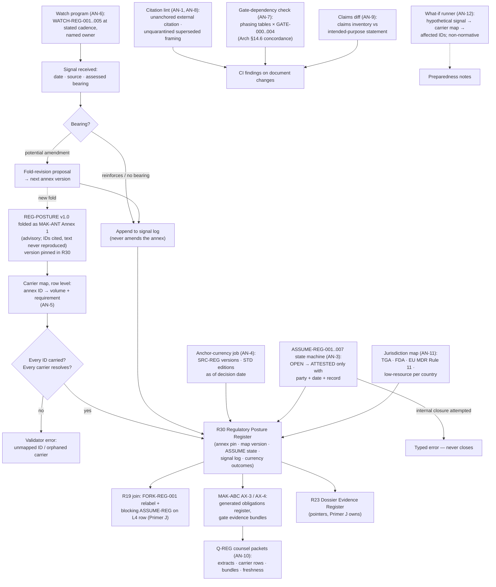

# Primer ANT — Regulatory Sensing

> **Justification fabric.** The butterfly's body is the justification fabric plus the deterministic evaluator: *every claim is an argument; only arithmetic releases.* One argument object renders in three registers to three faces; the fabric is append-only, hash-chained, and version-pinned so any decision replays bit-for-bit. Two wings paint the body — the **Left Wing** (MAK-LWC) senses in degrees, the **Right Wing** (MAK-RWC) judges in systems — and their coordination is the flight (MAK-MIF). The host is **MAK-FFC v1.1**: no primer here relaxes a corpus MUST. Regulatory content is governed by **REG-POSTURE v1.0** via **MAK-ANT** — assume inclusion, glass-box as the design target, ASSUME-REG-001..007 open pending counsel. This primer's position: *the sensing organ — a governed watch-and-log component that keeps one regulatory citation surface, notices when the wind changes, and routes every received signal into the registers without ever ruling on it.*

## ANT1. What this is

Regulatory sensing is one governance component inside the MAK-FFC architecture: the machinery that keeps the document set and the build bound to a single regulatory citation surface (AN-1) while the environment moves. Its unit of work is the **signal** — an external regulatory event received after the annex's currency date, logged additively with date, source and assessed bearing (AN-6) — and its standing artifacts are the **carrier map** (which volume and requirement carries each annex obligation, standard, task, Ketryx element and gate — AN-5), the **assumption ledger state** for ASSUME-REG-001..007 (never self-closed — AN-3), the **anchor-currency check** run before any commitment (AN-4), and the **claims inventory** diffed against the intended-purpose statement per release (AN-9). Its defining property, and the corpus's cardinal rule: **the antennae sense; they never decide.** The folded posture is advisory per its own authority line; a signal never amends it; a finding reverses only through the annex's own attestation route (AN-2, AN-3); an LLM never marks an assumption closed or treats a watch signal as having changed the posture (MAK-ANT LLM usage contract rule 3). The component therefore holds no regulatory opinion of its own — it holds the log, the map, the state machine and the checks, and it emits evidence to the registers that the auditor face (MAK-ABC AX-3/AX-4) and the dossier (R23) consume.

*Trace: MAK-ANT Thesis; Part 0 (two layers, two authorities); Part 1 (binding, discipline, listening); AN-1, AN-2, AN-3, AN-4, AN-5, AN-6, AN-9; LLM usage contract rules 1, 3, 4.*

## ANT2. Scope

**In scope** — the single MAK-ANT requirement family, grouped here by sensing duty (the grouping is this primer's, not a re-minting):

- **AN-1, AN-2, AN-3, AN-8 · Citation discipline.** One citation surface — every regulatory claim cites an annex ID or a Part 4 signal entry, and direct external citation without an anchor is a conformance violation whose fix is to log or fold, never bypass (AN-1); flag-and-route on divergence, with reversal only through the annex's route (AN-2); assumptions never self-closed, closure record in the ledger, dependence carried until closure (AN-3); superseded framings quarantined behind update notes naming the superseding ID, with a series search-and-audit as a release check (AN-8).
- **AN-4, AN-6 · Currency and watch.** Anchor currency re-verified as of any decision date, check and outcome ledgered (AN-4); the watch program runs at stated cadence by a named owner, signals logged additively with bearing — reinforces / no bearing / potential amendment, the last raising a fold-revision proposal (AN-6).
- **AN-5, AN-7 · Carrier map and gate governance.** The carrier map maintained row-level, unmapped annex IDs and orphaned carriers as validator errors, re-run before any fold completes (AN-5); gates govern series phasing — no volume schedules work its gate position forbids, every phasing table marks gate dependencies (AN-7).
- **AN-9, AN-10, AN-11 · Claims, counsel and jurisdiction.** Claims inventory versioned and diffed against the intended-purpose statement per release (AN-9); counsel-interface evidence packets per Q-REG question, freshness per AN-4 (AN-10); the jurisdiction map (MAK-J3 GPP-15's artifact) maintained under the watch program, reviewed annually and before any new-market supply (AN-11).
- **AN-12 · What-if.** Regulatory scenario exercises traced through the carrier map, logged as non-normative preparedness notes (AN-12).

**Out of scope** — each exclusion names its owner:

- The regulatory posture itself — findings, assumptions, obligations, standards stack, fork, gates, tasks, Ketryx schema, watch items, questions, sources (REG-POSTURE v1.0, folded verbatim as MAK-ANT Annex 1; advisory; changes only by folding a new version). This primer cites its IDs and specifies the component that watches it; it renders no regulatory opinion.
- Producing the obligations register and gate evidence bundles from the fabric (PRM-ABC — MAK-ABC AX-3 as the generated register, AX-4 as gate bundles). This component supplies the carrier map, signal log and assumption state those bundles cite; it does not generate conformity evidence.
- The Dossier Evidence Register and model-governance registers (Primer J — owns R4, R5, R23; joins R19/R30 for posture state). This component writes to R30 and cross-references R19; it never owns R23.
- Stack bindings that carry STD/TASK-REG/KTX consequences — SBOM in CI, split pipeline, pinned inference substrate (PRM-LEG bindings; MAK-CEC RG-6/RG-7; MAK-RWC MX-4). This component checks that each carrier row resolves; it does not build the stack.
- The glass-box discipline and update notes on earlier framings (PRM-RWC — MAK-RWC MX-1, MX-2, Part 7). AN-2 and AN-8 carry MX-1 series-wide; the discipline's clinical content is the Right Wing's.
- The exempt-tier reserve's own boundary machinery and reassessment records (MAK-J3 GPP-1..16, provisional in PRM-CEC). AN-11 maintains GPP-15's jurisdiction map under the watch program; GPP-3 reassessment records are J-3's.
- Intended-purpose authoring, counsel engagement, patient-surface decision (TASK-REG-001/002/004 — programme tasks with owners in the annex's plan; PRM-TXC TL-5 carries the patient-surface consequence). AN-9 diffs claims against the statement once written; AN-10 readies packets for the engagement; neither performs the task.
- Build-plan validation generally (`validate_build_plan.py`, Arch §13.8 — spine). This component contributes AN-specific checks to that validator or a sibling; it does not own it.

*Trace: MAK-ANT Part 0; Part 2 AN-1..12; Part 3 carrier map; Annex 1 §0.1 (advisory), §0.3 (ID scheme); MAK-ABC AX-3/AX-4; Primer J register topology; Arch §13.8, §14.3.*

## ANT3. Breadth and depth of content required

Twelve requirements (AN 12; 9 MUST, 2 SHOULD, 1 MAY — MAK-ANT Appendix A), of which the wrapper's Parts 3–4 enumerate the component's **standing artifacts**: the carrier map at family grain (15 rows in Part 3; the maintained artifact tracks row level per AN-5 — 103 annex IDs per Annex 1 §12.1, each needing a carrier or an explicit "wrapper-carried" row), the signal log (3 entries at v1.0: S-1 PCCP, S-2 TGA AI guidance, S-3 FDA CDS carried), the assumption state (7 items, all OPEN), the watch schedule (5 items with cadences: quarterly, once-then-annually, standing, at GATE-002, annually), and the question set (7 items with owners).

To be real rather than a checklist, the component needs: **a row-level carrier map with a validator** — every annex ID resolves to a carrier requirement that itself resolves in its host volume (AN-5; MAK-ANT Appendix B check 7); **a signal log with an enforced format** — date, source, bearing, and the rule that no entry claims to amend the annex (AN-6; Appendix B check 8); **an ASSUME-REG state machine** whose only closing transition requires an attestation record with party and date (AN-3; Annex 1 §0.4 vocabulary and §0.5 checks 5 and 8); **an anchor-currency job** that re-verifies guidance versions and standards editions as of a decision date and ledgers the result (AN-4) — the load-bearing runtime of this primer, because the annex's currency date is 2026-08-31 and three signals already post-date it (Part 4; this primer's X8 adds three more); **a citation lint** over the document set for unanchored external regulatory citations and unquarantined superseded framings (AN-1, AN-8); **a gate-dependency check** over every volume's phasing table (AN-7); and **a claims diff** once TASK-REG-001 yields an intended-purpose statement (AN-9 — until then the diff has no baseline and the check reports "no statement").

Depth constraint from the corpus: the annex is a snapshot with a sensing apparatus; the wrapper's job is to keep that apparatus alive without editing the snapshot (Part 1). The component must therefore be **append-only for signals and versioned for maps** — the same two mutability classes the register laws permit (Arch §12.1 law 2) — and the two must not be conflated (see finding ANT-F4).

*Trace: MAK-ANT Appendix A; Part 3; Part 4; Annex 1 §0.4, §0.5, §8, §9, §10, §12.1 (cited by structure, not reproduced); Arch §12.1.*

## ANT4. Building in a silo

Everything in the sensing component proper is tooling over documents and registers, buildable with no dependency on any clinical component:

- **Carrier-map schema + validator** (AN-5). Inputs mockable: the 15-row family map from Part 3, expanded to row level by reading each annex definition table's ID column (IDs only — no annex text is copied into the map). Stub: host-volume ID resolution against the staged corpus files' Appendix A censuses (every volume ships one).
- **Signal log service** (AN-6). An append-only store with the Part 4 entry shape: `id, logged, source{title,url,date}, bearing ∈ {reinforces, no-bearing, potential-amendment}, affects[annex IDs], note`. Property: an entry can never carry `amends: true`. Silo-testable against Part 4's three entries plus this primer's X8 WATCH rows.
- **ASSUME-REG state machine** (AN-3). States from Annex 1 §0.4 for assumption items — OPEN / ATTESTED / SUPERSEDED only; transition to ATTESTED requires `{party, date, record_ref}`; any other closing path is a typed error. Fixture: seven items, all OPEN; attempted internal closure rejected.
- **Anchor-currency job** (AN-4). Given a decision date and the SRC-REG / STD anchor list (IDs and the currency strings the annex records), fetch or record each anchor's current version/date and emit a ledgered outcome `{anchor, recorded_currency, observed_currency, delta, method, date}`. Stub: a fixture of observed values; the real run is this primer's X8 table.
- **Citation lint** (AN-1, AN-8). Regex-and-context pass over the corpus for external regulatory references (TGA/FDA/MDR/standards designations) lacking an annex or S-n anchor within the same block, and for quarantined phrases ("exempt J-1", Bedrock-runtime, pre-October-2025 exemption commentary) outside an update note naming FORK-REG-001 / TASK-REG-009 / WATCH-REG-003. Fixture: MAK-RWC Part 7 update notes (must pass), a planted unquarantined phrase (must fail).
- **Gate-dependency check** (AN-7). Parses phasing tables in every volume, requires a gate column or gate annotation per phase, and flags any phase scheduling identifiable-data work before GATE-002 or regulated-tooling configuration before GATE-000 (Arch §14.6 concordance as the mapping).
- **Claims diff** (AN-9). Diffs a versioned claims inventory (site copy, marketing, in-product strings) against the intended-purpose statement; until TASK-REG-001 lands, emits "no baseline" — a legal, visible state.
- **Jurisdiction map** (AN-11) and **what-if runner** (AN-12). Data artifacts: the GPP-15 map (TGA, FDA, EU MDR Rule 11, low-resource per-country) with review records; the what-if runner takes a hypothetical signal and traces it through the carrier map to affected requirement IDs, labelled non-normative.

What cannot be built in the silo: the runtime twin of the obligations register and gate bundles (MAK-ABC AX-3/AX-4 read the fabric and registers), R30's join to R19 posture state (Primer J's L4 decision row), the R23 dossier feed (Primer J owns R23), counsel packets' content (AN-10 needs the volumes' extracts and AX-4 bundles), and the claims inventory's source (site, marketing, in-product copy from PRM-LBP/PRM-PRB). These are ANT5 edges.

*Trace: MAK-ANT Part 3; Part 4 format; AN-1, AN-3, AN-4, AN-5, AN-6, AN-7, AN-8, AN-9, AN-11, AN-12; Annex 1 §0.4/§0.5 (structure only); Arch §14.6.*

## ANT5. Folding it in

Integration contract — consumes and emits, with the counterpart edge named.

**Consumes**

| From | What | Interface | Counterpart edge |
|---|---|---|---|
| REG-POSTURE (via MAK-ANT Annex 1) | The annex at its stated version: ID tables (REG-FIND, REG-KEEP, ASSUME-REG, OBL, STD, FORK-REG, GATE, TASK-REG, KTX, WATCH-REG, Q-REG, SRC-REG), statuses, cadences | Read-only; a new version arrives only as a new fold (MAK-ANT change_policy) | MAK-ANT Part 0 (annex governs regulatory content, advisory); LLM contract rule 2 (a standalone REG-POSTURE file, if maintained, is canonical). **Checked:** no standalone file is present in the staged corpus — the annex is the only copy; see ANT-F6 |
| External regulators and standards bodies | Signals: guidance revisions, consultations, standards editions | Watch program at WATCH-REG cadences (AN-6); anchor-currency fetches (AN-4) | Sources are the annex's SRC-REG rows plus new instruments logged as S-n pending fold |
| Every series volume | Phasing tables (AN-7), regulatory citations (AN-1/AN-8), carrier requirements (AN-5) | Corpus files + Appendix A censuses | MAK-RWC Part 7 update notes (MX-1 carried); MAK-LEG L6 bindings; MAK-CEC RG-3/RG-6; MAK-TXC TL-5; MAK-HDC HA-1 — all resolve (checked against staged files 2026-09-02) |
| Primer J (`cdss-governance`) | R19 posture and reversal-trigger rows; R23 dossier section map | Register reads | Primer J register topology: owns R4/R5/R23, "joins R19/R30 for posture state"; J11 execution table names "counsel attestations into R30". **Checked:** consistent — J writes attestations, this component holds their state; see ANT-F7 on repo ownership |
| PRM-ABC (auditor face) | AX-4 gate evidence bundles (for AN-10 packets); AX-3 obligation status (for what-if impact) | Read model over fabric + registers | MAK-ABC AX-3 (generated obligations register, "runtime twin" per AN-5 rationale), AX-4 (gate bundles) |
| PRM-LBP / PRM-PRB / programme marketing | Claims inventory sources: in-product copy, site copy | Versioned claims inventory (AN-9) | MAK-J3 GPP-1 (intended-purpose statement as claims boundary) — pattern at series scope per AN-9 rationale |
| Primer I (living evaluation) | Nothing at runtime. Gate bundles cite I's evidence streams (R7, R12, R18, R20) through AX-4, not through this component | — | Primer I register topology (owns R7, R12, R18, R20; writes R23). No direct edge; recorded to close the P4-e check |

**Emits**

| To | What | Interface | Counterpart edge |
|---|---|---|---|
| R30 (Regulatory Posture Register, Proposed — Arch §14.3) | Annex version pin; ASSUME-REG state rows; signal log entries; anchor-currency check outcomes; carrier map version; jurisdiction-map review records | Register writes keyed by version stamp (Arch §12.1 law 4) | Arch §14.3 R30 row: owner governance, opens L1, versioned, written by "regulatory owner + external attestations", read by "R19/R23 joins, dossier". **Mismatch:** signal log is append-only; R30 is versioned — finding ANT-F4 |
| R19 (Posture & Reversal-Trigger Register) | Cross-reference only: the FORK-REG-001 relabel and blocking ASSUME-REG IDs attached to the L4 decision row | Join, not write (R19 is spine-owned, append) | Arch §12.2 R19; §13.5 L4 row "posture decision recorded in R19"; Primer J §J10 task binding activation to R19 |
| R23 (Dossier Evidence Register, Primer J) | Pointers: which R30 rows substantiate which submission sections (anchor-currency outcomes, attestation records) | Row references, never copies | Arch §12.1 law 6 (registers are dossier feedstock); Primer J owns R23 |
| PRM-ABC (AX-3, AX-4) | Carrier map rows; signal bearings; assumption state — so obligation status and gate bundles cite current posture state | Read model | MAK-ABC AX-3/AX-4 |
| PRM-RWC / every volume | Validator findings: unanchored citation (AN-1), contradiction of a REG-FIND without an update note naming it (AN-2), unquarantined framing (AN-8), missing gate annotation (AN-7), orphaned carrier (AN-5) | CI findings on document changes | MAK-ANT Appendix B checks 7–8; MAK-RWC MX-1 (AN-2 carries it series-wide) |
| Counsel interface (TASK-REG-002 engagement) | Q-REG evidence packets (AN-10): volume extracts, carrier rows, AX-4 bundles, freshness stamp | Packet bundle per Q-REG ID | Annex Q-REG-001..007 and TASK-REG-002 (cited, not reproduced) |
| MAK-ANT next fold | Fold-revision proposals when a signal is assessed "potential amendment" (AN-6); re-run carrier map before fold completes (AN-5) | Proposal record | MAK-ANT change_policy (annex changes only by folding a new version) |
| Preparedness notes (AN-12) | What-if impact traces, labelled non-normative | Notes, never register rows with normative weight | AN-12 (MAY) |

**Fabric binding (MAK-FFC).** This component supplies no argument slot — it is governance tooling beside the fabric, not inside it. Its binding is evidentiary: SPINE-4's append-only ledger discipline is the model for the signal log, and SPINE-5's version pinning is the model for annex-version and anchor-currency pins; AF-7's regulator export consumes what it records (via MAK-ABC AX-3/AX-4); XC-1's classification honesty is the host requirement its citation discipline enforces series-wide, updated per MAK-RWC Part 7 note 1 (MX-1). Coordination doctrine: MAK-MIF beat 3 (meaning under governance — ratified change, old versions pinned, applied here to regulatory anchors) and beat 8 (the LLM on a leash — an LLM may draft a signal entry or packet; it never closes an assumption, per MAK-ANT LLM contract rule 3 and EN-6).

*Trace: MAK-ANT Part 0, Part 3, Part 4, AN-1..12; Arch §12.1, §12.2 R19/R23, §14.3 R30; Primer J register topology and §J11; Primer I register topology; MAK-ABC AX-3/AX-4; MAK-FFC SPINE-4/5, AF-7, XC-1, EN-6; MAK-MIF beats 3, 8.*

## ANT6. Definition of done

Per release of the document set or the governance repo, all of:

1. **Carrier map total** — every annex ID (103 per Annex 1 §12.1) has a carrier row or an explicit wrapper-carried row; every carrier requirement resolves in its host volume; zero orphans (AN-5; MAK-ANT Appendix B check 7).
2. **Citation lint clean** — no regulatory claim in any series document lacks an annex-ID or S-n anchor; no unquarantined superseded framing; no contradiction of a REG-FIND without an update note naming it (AN-1, AN-2, AN-8; Appendix B check 5 analogue applied to the set).
3. **Assumption state honest** — ASSUME-REG-001..007 hold only OPEN / ATTESTED / SUPERSEDED; no ATTESTED row lacks party and date; no series document, generated artifact or LLM output describes one as closed (AN-3; Annex 1 §0.5 checks 5, 8 — structure cited).
4. **Signal log disciplined** — every entry dated, sourced, bearing-assessed; no entry amends the annex; every "potential amendment" has a fold-revision proposal record (AN-6; Appendix B check 8).
5. **Watch cadence met** — each WATCH-REG item shows a check within its cadence by its named owner; missed cadence is a finding (AN-6).
6. **Anchor currency ledgered** — for any submission, supply decision or external claim, an anchor-currency outcome exists dated on or after the decision date, covering SRC-REG-001..004 versions and STD-001..012 editions (AN-4; WATCH-REG-005).
7. **Gates annotated** — every volume's phasing table marks gate dependencies; no phase schedules identifiable-data work before GATE-002 or regulated-tooling configuration before GATE-000 (AN-7; Arch §14.6).
8. **Claims diff run** — per release, the claims inventory version is diffed against the intended-purpose statement; zero unreconciled deltas, or "no baseline" recorded while TASK-REG-001 is open (AN-9).
9. **Fold re-run** — on any new annex version, the carrier map is re-run and validated before the fold completes; the prior annex version remains pinned to prior decisions (AN-5; MAK-ANT change_policy).
10. **Packets and map fresh** (SHOULD-level, release-gating only where a GATE-000 engagement or new-market supply is scheduled) — Q-REG packets carry a freshness stamp within AN-4's check; jurisdiction map reviewed within 12 months and before any new-market supply, record ledgered (AN-10, AN-11).

*Trace: MAK-ANT Part 2 AN-1..11; Appendix B checks 5, 7, 8; Annex 1 §0.5, §12.1 (structure); Arch §14.6.*

## ANT7. Internal operations diagram



## ANT8. Execution layer

**Signal entry contract** (derived from MAK-ANT Part 4's entry format and AN-6; the corpus gives prose, not a schema — this shape is proposed):

```text
SignalEntry {
  id:        "S-<n>"                                   // additive; never reused
  logged:    date                                      // ≥ annex guidance_currency_date
  source:    { title, url, instrument_date, retrieved } // primary where available
  bearing:   "reinforces" | "no-bearing" | "potential-amendment"
  affects:   AnnexID[]                                 // REG-FIND / WATCH-REG / STD / ... IDs only
  note:      text                                      // assessed bearing; never annex text
  amends_annex: false                                  // constant; any true is a validator error
  fold_proposal_ref?: string                           // required iff bearing = potential-amendment
}
```

**Assumption state contract** (states per Annex 1 §0.4 for assumption items; transition rule per AN-3): `ASSUME-REG-nnn: {status: OPEN | ATTESTED | SUPERSEDED, attesting_party, blocking_gate, attestation?: {party, date, record_ref}, superseded_by?}` — `ATTESTED` requires `attestation` complete; `SUPERSEDED` requires `superseded_by`; no other writer than the regulatory owner recording an external attestation.

**Anchor-currency outcome:** `{anchor: SRC-REG-nnn | STD-nnn, recorded_currency, observed_currency, observed_on, method, delta: none | newer-edition | newer-revision | unverifiable}` — ledgered in R30; `unverifiable` is a legal outcome that blocks a commitment until resolved (AN-4).

**First executable properties (seed for the governance CI, AN subset):** (1) ∀ annex ID in Annex 1 §12.1's census: exactly one carrier-map row (AN-5). (2) ∀ carrier row: its requirement ID resolves in the named volume's Appendix A (AN-5). (3) ∀ SignalEntry: `amends_annex = false` and `logged ≥ 2026-08-31` (AN-6). (4) ∀ ASSUME-REG item: status ∈ {OPEN, ATTESTED, SUPERSEDED}; ATTESTED ⇒ attestation.date present (AN-3). (5) ∀ regulatory citation in the set: an annex ID or S-n appears in the same block (AN-1). (6) ∀ occurrence of a quarantined framing: an update note naming FORK-REG-001 / TASK-REG-009 / WATCH-REG-003 encloses it (AN-8). (7) ∀ phasing table: a gate column exists and no row violates the §14.6 concordance (AN-7). (8) The what-if runner's output carries the non-normative label and writes no register row (AN-12).

**Asset library** — every requirement group maps to at least one row. Seeded from MAK-ANT Part 4 and Annex 1 §11 (SRC-REG rows, currency as recorded 2026-08-31), MAK-RWC v1.1 Part 9 regulatory-instrument rows (verified 2026-09-01), and MAK-ELSM v1.1; **every external row re-verified this run, 2026-09-02**, method stated. Verdict vocabulary per MAK-ELSM: ADOPT / ADAPT / STUDY / BUILD / WATCH; **DEAD-REPLACE** for archived assets. Regulatory anchors carry **WATCH** by default — the operator decides a signal's weight (AN-6); this table records what was found.

| Asset | Type | Satisfies | Licence | Currency | Verified (method · date) | Verdict |
|---|---|---|---|---|---|---|
| TGA — Understanding clinical decision support system software regulation ([tga.gov.au](https://www.tga.gov.au/resources/guidance/understanding-clinical-decision-support-system-software-regulation)) | regulatory anchor (SRC-REG-001) | AN-1 anchor; AN-4 | Crown © | Recorded: rev. 7 Oct 2025. **Not re-fetched** — tga.gov.au disallows automated fetch; page present in search index | WebSearch index · 2026-09-02; last-updated date carried from MAK-FFC Part 8 (retrieved 29 Aug 2026) | **ADOPT as anchor; WATCH — manual last-updated check required before any commitment (AN-4)** |
| TGA consultation — Proposed clarification of how CDSS software is regulated ([consultations.tga.gov.au](https://consultations.tga.gov.au/tga/clarification-of-how-clinical-decision-support-sys/)) | consultation record (WATCH-REG-001 subject) | AN-6 watch | Crown © | Opened 12 Mar 2024, closed 6 May 2024; outcome published, page updated 10 Feb 2025; 35 responses; legislative definition + transparency-condition amendments proposed | WebFetch · 2026-09-02 | **WATCH (quarterly per WATCH-REG-001) — no legislative amendment located since 2026-09-01; guidance rewrite of 7 Oct 2025 is the visible outcome so far** |
| TGA — Artificial intelligence (AI) and medical device software regulation (guidance, Feb 2026) ([tga.gov.au](https://www.tga.gov.au/products/medical-devices/software-and-artificial-intelligence-ai/manufacturing/artificial-intelligence-ai-and-medical-device-software-regulation)) | regulatory anchor (WATCH-REG-002 subject; S-2) | AN-6, AN-7 (synthetic-data reading), AN-11 | Crown © | Published Feb 2026 (practitioner analyses: Mallesons 17 Feb 2026; Allens 22 Apr 2026; Clayton Utz 24 Jul 2026). Confirms: functional updates are pre-deployment regulatory events; transparency over training data / validation / monitoring; synthetic data generally will not replace clinical data | WebFetch of [Allens](https://www.allens.com.au/insights-news/insights/2026/04/same-rules-smarter-tools-what-the-tgas-ai-guidance-means-for-ai-and-medical-devices/), [Mallesons](https://pulse.mallesons.com/ip-whiteboard/new-tga-guidance-on-the-regulation-of-ai-based-software-medical-devices/), [Clayton Utz](https://www.claytonutz.com/insights/2026/july/healthcare-software-tga-clarifies-when-ai-will-be-regulated-as-a-medical-device) · 2026-09-02; TGA page itself not fetchable | **ADOPT as S-2 anchor (existence and content confirmed); WATCH annually per WATCH-REG-002** |
| FDA — Clinical Decision Support Software, revised final guidance ([fda.gov](https://www.fda.gov/regulatory-information/search-fda-guidance-documents/clinical-decision-support-software)) | regulatory anchor (S-3) | AN-11 jurisdiction map; MAK-J3 GPP-15 | US Gov | Issued 6 Jan 2026; **re-issued 29 Jan 2026** (docket FDA-2017-D-6569); FDA town hall 11 Mar 2026 with slides + transcript ([fda.gov event page](https://www.fda.gov/medical-devices/medical-devices-news-and-events/town-hall-clinical-decision-support-software-final-guidance-03112026)) | WebFetch fda.gov guidance page + town-hall page · 2026-09-02 | **ADOPT as anchor; WATCH — series cites 6 Jan 2026 only; re-issue date and town-hall materials are un-logged signals (see ANT-F1; WATCH row W-1)** |
| FDA — PCCP for AI-enabled device software functions, final guidance ([Federal Register 2024-28361](https://www.federalregister.gov/documents/2024/12/04/2024-28361/marketing-submission-recommendations-for-a-predetermined-change-control-plan-for-artificial)) | regulatory anchor (S-1) | AN-11 (US-only change-control instrument) | US Gov | Availability notice 4 Dec 2024 — matches S-1 | WebSearch (Federal Register hit) · 2026-09-02 | **ADOPT as S-1 anchor; no newer PCCP signal found** |
| ISO 13485:2016 (STD-001) | standard | AN-4 currency | ISO | 2016 edition current; ISO systematic review cycle noted for 2026 — no DIS/FDIS located | WebFetch [URM Consulting](https://www.urmconsulting.com/blog/iso-13485-and-beyond-key-updates-shaping-the-medical-device-regulatory-landscape) · 2026-09-02 | **ADOPT (current); WATCH annually per WATCH-REG-005** |
| IEC 62304 (STD-002) | standard | AN-4 currency | IEC | Ed.1 2006 + A1:2015 current as recorded. **Ed.2 in final coordination; publication expected Aug–Sep 2026** (Quickbird 19 Jun 2026; URM). Publication **not confirmed** this run | WebFetch [Quickbird](https://quickbirdmedical.com/en/news/iec-62304-edition-2-august-2026/); WebSearch for "IEC 62304:2026" (no publication record found) · 2026-09-02 | **WATCH — high: an edition change lands inside the anchor-currency window; AN-4 check mandatory before citing STD-002 in any commitment (ANT-F3; WATCH row W-2)** |
| ISO 14971 (STD-003), IEC 62366-1 (STD-004), IEC 82304-1 (STD-005), BS/AAMI 34971 (STD-006), ANSI/AAMI SW96 (STD-007), IEC 81001-5-1 (STD-008), ISO/IEC 29147 / 30111 (STD-009), ISO 27799 (STD-010), IEC 80001 series (STD-011), UL 2900-2-1 (STD-012) | standards | AN-4 currency | various SDOs | Editions as the annex records at 2026-08-31; **not individually re-verified this run** | Carried forward from MAK-ANT Annex 1 §4.3 / §10 WATCH-REG-005 (currency 2026-08-31) | **WATCH — carried; each edition re-verified by the AN-4 job before any submission or supply decision** |
| TGA — Standards for software-based medical devices (SRC-REG-002); TGA — Complying with medical device cyber security requirements (SRC-REG-003); TGA — CAS-QMS Order 2019 guidance (SRC-REG-004) | regulatory anchors | AN-4 | Crown © | Recorded: 5 Feb 2026; 2 Oct 2025; June 2019 v1.0. Pages present in search index; **not re-fetched** (robots) | WebSearch index · 2026-09-02; currency carried from Annex 1 §11 | **ADOPT as anchors; WATCH — manual date check per AN-4** |
| Ketryx pricing and documentation ([ketryx.com/pricing](https://www.ketryx.com/pricing)) (SRC-REG-007/008; KTX-001..012; WATCH-REG-004; ASSUME-REG-006) | vendor SaaS | AN-4 (KTX carrier currency), AN-6 | commercial | Free tier still stated for pre-market companies under $2M funding; **tier names on the page now read Free / Startup / Business / Enterprise**; page states "validation evidence is provided upon request" and does not name an "Essentials" tier | WebFetch · 2026-09-02 | **WATCH — vendor page has moved since the annex's August 2026 access; WATCH-REG-004's tier wording needs re-reading at GATE-002 (ANT-F2; WATCH row W-3). ASSUME-REG-006 remains OPEN** |
| [openregulatory/templates](https://github.com/openregulatory/templates) (SRC-REG-010; MAK-RWC ELSM-R04) | templates (Markdown) | AN-10 packet scaffolding; STD-001..004 document-layer records (via PRM-LEG / PRM-RWC MX-4) | per repo LICENSE.md | 159★; active; ISO 13485 / IEC 62304 / ISO 14971 / IEC 62366 | WebFetch GitHub · 2026-09-02 | **ADAPT — document-layer complement to Ketryx; licence file to be read before reuse** |
| Baseten deployment/region/compliance documentation (SRC-REG-009; ASSUME-REG-004) | vendor documentation | AN-4 (TASK-REG-009 carrier currency) | commercial | Recorded: accessed Aug 2026 | Not re-fetched this run — PRM-LEG's binding L6 carries it; no new signal sought | **WATCH — carried; ASSUME-REG-004 OPEN; C-03 ESCALATED (Arch §14.6 / DEC-03)** |
| `validate_build_plan.py` (Arch §13.8; `cdss-spine`) | validator (stdlib, deterministic) | AN-1, AN-5, AN-7, AN-8 checks as sibling duties | house | Arch §13.8; §14.7 already extends it for R29 | Arch document read · 2026-09-02 | **ADAPT — add AN check module or a sibling `validate_regulatory_sensing.py`** |
| **Carrier-map schema + validator** | build | AN-5 | — | no precedent; Part 3 gives the family grain | this primer ANT4 | **BUILD** |
| **Signal log service (append-only)** | build | AN-6 | — | Part 4 gives the format; SPINE-4 pattern | this primer ANT4/ANT8 | **BUILD** |
| **ASSUME-REG state machine** | build | AN-3 | — | Annex 1 §0.4/§0.5 give the states and checks (structure) | this primer ANT8 | **BUILD** |
| **Anchor-currency job** | build | AN-4 | — | no precedent; this run's table is the first manual execution | this primer ANT8 | **BUILD** |
| **Citation lint + superseded-framing audit** | build | AN-1, AN-8 | — | MAK-RWC Part 7 update notes as the positive fixture | this primer ANT4 | **BUILD** |
| **Gate-dependency check** | build | AN-7 | — | Arch §14.6 concordance as mapping | this primer ANT4 | **BUILD** |
| **Claims diff** | build | AN-9 | — | baseline absent until TASK-REG-001 | this primer ANT4 | **BUILD — ships in "no baseline" state** |
| **Q-REG packet builder** | build | AN-10 | — | consumes AX-4 bundles (PRM-ABC) | this primer ANT5 | **BUILD (SHOULD)** |
| **Jurisdiction map artifact + review records** | build (data) | AN-11 | — | MAK-J3 GPP-15 §2.3 as seed | MAK-FFC Annex 1 GPP-15 | **BUILD (SHOULD)** |
| **What-if runner** | build | AN-12 | — | carrier map traversal | this primer ANT4 | **BUILD (MAY) — lowest priority** |

**Post-currency WATCH rows (signals found this run, after MAK-ANT's currency date 2026-09-01; logged here as candidates for Part 4 — the operator assesses bearing, per AN-6):**

| W | Signal | Date | URL | Retrieved | Proposed bearing (operator decides) |
|---|---|---|---|---|---|
| W-1 | FDA CDS guidance shows a **re-issue date of 29 Jan 2026** and a town hall (11 Mar 2026) with transcript; the series anchors 6 Jan 2026 | 2026-01-29 / 2026-03-11 (pre-currency but un-logged) | [FDA town hall page](https://www.fda.gov/medical-devices/medical-devices-news-and-events/town-hall-clinical-decision-support-software-final-guidance-03112026) | 2026-09-02 | no bearing on TGA findings; enrichment of S-3 anchor date (AN-11 jurisdiction map) |
| W-2 | **IEC 62304 Ed.2** reported in final coordination, publication expected Aug–Sep 2026; not confirmed published | 2026-06-19 (report); publication pending | [Quickbird Medical](https://quickbirdmedical.com/en/news/iec-62304-edition-2-august-2026/) | 2026-09-02 | potential amendment of STD-002 edition on publication (WATCH-REG-005); no bearing on REG-FIND |
| W-3 | **Ketryx pricing page** tier vocabulary now Free / Startup / Business / Enterprise; "Essentials" not shown | observed 2026-09-02 | [ketryx.com/pricing](https://www.ketryx.com/pricing) | 2026-09-02 | potential amendment of WATCH-REG-004 wording; ASSUME-REG-006 unchanged (OPEN) |
| W-4 | **TGA AI guidance** further practitioner analysis (Clayton Utz, 24 Jul 2026) — SaMD named a TGA enforcement priority 2026–27; ARTG list of AI-enabled devices published Feb 2026 | 2026-07-24 | [Clayton Utz](https://www.claytonutz.com/insights/2026/july/healthcare-software-tga-clarifies-when-ai-will-be-regulated-as-a-medical-device) | 2026-09-02 | reinforces S-2; no bearing on findings |

**Coverage check (P5):** AN-1/2/3/8 (citation discipline) → citation lint build, ASSUME state machine build, `validate_build_plan.py` ADAPT, TGA CDSS guidance anchor. AN-4/6 (currency and watch) → anchor-currency job build, signal log build, every regulatory-anchor and standards row, Ketryx row, Baseten row. AN-5/7 (carrier map and gates) → carrier-map validator build, gate-dependency check build, `validate_build_plan.py` ADAPT. AN-9/10/11 (claims, counsel, jurisdiction) → claims diff build, packet builder build, openregulatory templates ADAPT, jurisdiction map build, FDA CDS + PCCP anchors. AN-12 → what-if runner build. **12/12 covered; 10 rows are BUILD (all small governance tooling); 0 DEAD-REPLACE.**

**Sourcing landmines carried forward, with this run's status:** tga.gov.au blocks automated fetch — anchor last-updated dates for SRC-REG-001..004 must be checked manually or via a permitted client, *new this run*; the annex's vendor-interest caution on SRC-REG-007..009 (Annex 1 §11 source caution) — *unchanged*, and W-3 shows vendor pages move; MAK-RWC Part 9 refresh landmine that PCCP confers nothing at the TGA — *unchanged*; Arch §11.4's Bedrock line vs TASK-REG-009 (C-03, DEC-03 ESCALATED) — *unchanged*, an AN-8 quarantine candidate inside the architecture document (ANT-F5).

**Proposed tolerances (flag: regulatory-owner sign-off required):** watch-cadence grace ≤ 14 days past the stated cadence before a missed-cadence finding; anchor-currency outcome validity ≤ 90 days for a submission, ≤ 30 days for a supply decision; jurisdiction-map review ≤ 12 months (AN-11's "annually" made a number); claims-diff zero-delta requirement at every regulated release, advisory at synthetic/demo releases.

*Trace: MAK-ANT Part 4 format; AN-1..12; Annex 1 §0.4, §0.5, §4.3, §10, §11, §12.1 (structure and IDs only); MAK-RWC v1.1 Part 9 regulatory-instrument rows; MAK-ELSM verdict vocabulary; Arch §13.8, §14.6; external verification as tabled.*

## Production topology annotation

*Per Architecture §11, §14.3 and §14.6 (Proposed):* the sensing component has no row of its own in §14.5 — it is governance tooling, not a capability that "enters" a level. Its register, **R30, opens at L1** (§14.3), so the carrier map, signal log, assumption state and first anchor-currency outcome exist from L1. The §14.6 concordance is the component's level mapping: GATE-000 blocks regulated-tooling configuration but not L1 synthetic-scope engineering — so this component's own build (validators, log, state machine) is lawful pre-GATE-000 and is in fact the material GATE-000 reads (AN-10 packets); GATE-001 lands beside L1/L2; GATE-002 precedes any non-synthetic input at any level (REG-KEEP-004 carried via AN-7); GATE-003 evidence accumulates L3–L4; GATE-004 joins L5's definition of done. Tier pipeline: the component's artifacts are documents and register rows — they pass Tier 1+2 (PR templates, signed manifests) and carry no runtime; no Tier 3–5 presence except as R30 rows read by Security Hub-adjacent evidence feeds (§11.1 Tier 5 note is the security stack's; not this component's). **J-tier:** tier-agnostic and outside every supplied artifact — the component governs J-1, J-2 and J-3 alike (FORK-REG-001 relabel carried via MAK-CEC RG-6; GPP-15's jurisdiction map under AN-11) and is never part of a supplied build's SBOM (MAK-J3 GPP-8 denylist irrelevant here by construction). See finding ANT-F5 on the §11.4 Bedrock line.

## Register topology annotation

*Per Architecture §12 (R1–R28) and §14.3 (R29–R30, Proposed):* **Owns (content duties):** R30 — the annex version pin, ASSUME-REG state rows, signal log, anchor-currency outcomes, carrier-map version, jurisdiction-map review records; the **owning repo is `cdss-governance`** per §14.3's owner column ("governance"), shared with Primer J's R4/R5/R23 — see ANT-F7. **Writes:** R30 (as above); R25 (build evidence — this run's verification table and W-1..W-4); R27 (drift rows when a signal is assessed "potential amendment" and a fold is proposed — Observer-written per §13.4; this component raises, the Observer records). **Reads:** R19 (posture decision row and armed triggers, for the FORK-REG-001 join), R23 (dossier section map, for pointer emission), R3 (SBOM register — OBL-004 evidence status via AX-3, read-only), R14 (lockfile pins — the universal join key, §12.1 law 4). **Gap proposals:** GAP-ANT-001 — R30 is declared *versioned* (§14.3) but AN-6's signal log is *additive* and Arch §12.1 law 2 permits no mixed class; propose R30 as versioned (annex pin, map, state, review records) plus an **append-only signal sub-ledger** either as an R30 annex with its own mutability declaration or as R31 "Regulatory Signal Log"; operator decision (ANT-F4). GAP-ANT-002 — Arch §14.4's PFX set gains {FAB, UIC, UIP, GPP} but no regulatory-sensing prefix; propose **ANT** for build IDs (TASK-ANT-n used here as interim). GAP-ANT-003 — the claims inventory (AN-9) has no register home; propose an R30 versioned sub-table `claims_inventory@version` diffed per release. GAP-ANT-004 — anchor-currency outcomes are per-decision evidence; confirm they live in R30 (versioned, superseding) rather than R25 (build evidence), since they substantiate supply decisions, not builds.

<!-- ECOSYSTEM-V2-BLOCK: ANT v1.0 -->
## ANT9. Build Execution Extension (Ecosystem v2.0)

**1. Mini-North-Star.** WHAT: the R30 register schema and its four writers — carrier-map validator, append-only signal log, ASSUME-REG state machine, anchor-currency job — plus the citation lint and gate-dependency check wired into governance CI. WHY: one regulatory citation surface, every assumption labelled, every signal logged, every volume bound by name (MAK-ANT Part 1 doctrine sentence) — so a posture revision propagates by checklist and no document quietly drifts from the wind. Endpoint: R30 open at L1 (Arch §14.3); GATE-000 packets ready before counsel engagement (TASK-REG-002). Derives from and cites SPINE §13.1 and Arch §14.6.

**2. Doctrine classification.** Map validation, log append, state transitions, currency comparison, lint and gate checks are arithmetic (deterministic over documents and registers). Bearing assessment, fold-revision proposals, packet composition and what-if traces propose. Nothing here releases clinical content; nothing here closes an assumption — attestation is an external human act recorded, never computed (AN-3).

**3. Scoped recon register.**
| ID | Verify | Tag |
|---|---|---|
| RECON-ANT-001 | R30 ratification status and mutability ruling (versioned + append-only signal sub-ledger, or R31) — GAP-ANT-001 / ANT-F4 | E:DOC Arch §14.3; MET-2 queue |
| RECON-ANT-002 | Whether a standalone REG-POSTURE file exists anywhere in the document ecosystem (MAK-ANT LLM contract rule 2 makes it canonical if so; none staged) — ANT-F6 | E:DOC MANIFEST; E:REPO document set |
| RECON-ANT-003 | Row-level carrier expansion: 103 annex IDs vs 15 family rows — which TASK-REG rows (per Part 3 "per-row in the maintained map") lack a named carrier | E:DOC MAK-ANT Part 3; Annex 1 §7 tables (IDs only) |
| RECON-ANT-004 | tga.gov.au last-updated dates for SRC-REG-001..004 via a permitted client (automated fetch refused this run) | E:WEB manual |
| RECON-ANT-005 | IEC 62304 Ed.2 publication status and date (W-2); on publication, AN-4 outcome `newer-edition` for STD-002 | E:WEB at ticket start |
| RECON-ANT-006 | Ketryx tier structure and validation-package terms vs WATCH-REG-004 wording (W-3); feeds Q-REG-006 packet | E:WEB; vendor contact |
| RECON-ANT-007 | Owning repo for the sensing component: `cdss-governance` module vs new `cdss-antennae` — ANT-F7 | E:DOC Arch §10, §14.2, §14.3 |

**4. Work register seed (L1-equivalent; schema per master v2 Phase 6; estimates ranged with confidence).**
```yaml
TASK-ANT-001:
  story: STORY-ANT-001 (every annex ID has a named carrier, and every carrier resolves)
  component: regulatory-sensing
  title: Row-level carrier map schema + validator (AN-5)
  purpose_chain: {what: "carrier map artifact + CI validator", why: "posture revision must propagate by checklist, not archaeology (MAK-ANT Part 1)", endpoint_ref: "R30 open at L1; AN-5; Appendix B check 7"}
  evidence_refs: [E:DOC MAK-ANT Part 3, AN-5, Annex 1 §12.1 census; RECON-ANT-003]
  definition_of_ready: ["Annex 1 ID census parsed (IDs only, no text)", "every volume's Appendix A census available for resolution"]
  steps: ["expand 15 family rows to 103 ID rows", "resolve each carrier requirement against its host volume census", "emit unmapped / orphan findings", "version the map; pin annex version"]
  test_plan: "fixture: planted unmapped OBL and planted orphan carrier both fail; full map passes; zero annex prose in the artifact (lint)"
  observability: "counter ant.map.unmapped, ant.map.orphans; map version in every R30 row"
  definition_of_done: ["103/103 mapped or wrapper-carried", "validator in governance CI", "map version recorded in R30"]
  estimate: {optimistic: 2d, likely: 4d, pessimistic: 7d, confidence: medium}
  depends_on: []
```
```yaml
TASK-ANT-002:
  story: STORY-ANT-002 (a received signal is logged, dated, sourced, assessed — and amends nothing)
  component: regulatory-sensing
  title: Append-only signal log + ASSUME-REG state machine (AN-6, AN-3)
  purpose_chain: {what: "SignalEntry store with format enforcement; assumption state with attestation-only closure", why: "the antennae sense; they never decide", endpoint_ref: "R30 open at L1; DoD items 3–4"}
  evidence_refs: [E:DOC MAK-ANT Part 4, AN-3, AN-6, Annex 1 §0.4/§0.5 (structure); RECON-ANT-001]
  definition_of_ready: ["R30 mutability ruling recorded or interim append-only sub-ledger declared"]
  steps: ["SignalEntry schema (ANT8) with amends_annex constant false", "seed S-1..S-3 from Part 4 and W-1..W-4 as candidates pending operator bearing", "ASSUME state machine: OPEN→ATTESTED requires party+date+record; internal closure typed error", "R30 write path keyed by version stamp"]
  test_plan: "entry with amends_annex true rejected; potential-amendment without fold_proposal_ref rejected; ATTESTED without date rejected; LLM-drafted entry cannot transition state"
  observability: "ant.signals.logged by bearing; ant.assume.state gauge (7 OPEN at seed)"
  definition_of_done: ["seed loaded", "all rejection fixtures rejected", "R30 rows carry version stamp"]
  estimate: {optimistic: 2d, likely: 3d, pessimistic: 5d, confidence: high}
  depends_on: [TASK-ANT-001]
```
```yaml
TASK-ANT-003:
  story: STORY-ANT-003 (no commitment rests on a stale anchor)
  component: regulatory-sensing
  title: Anchor-currency job + citation lint (AN-4, AN-1, AN-8)
  purpose_chain: {what: "scheduled job emitting AnchorCurrencyOutcome per SRC-REG/STD; document lint for unanchored citations and unquarantined framings", why: "the annex's currency date is fixed; the world is not (WATCH-REG-005; Part 4)", endpoint_ref: "DoD items 2, 6; GATE-000 packet freshness (AN-10)"}
  evidence_refs: [E:DOC AN-1, AN-4, AN-8; this primer ANT8 table; RECON-ANT-004, RECON-ANT-005]
  definition_of_ready: ["anchor list (SRC-REG-001..010, STD-001..012) with recorded currency strings", "permitted fetch path for tga.gov.au or manual-entry mode"]
  steps: ["anchor list + recorded currency", "observe (fetch or manual) → delta classification incl. unverifiable", "ledger outcome to R30", "lint: external regulatory reference without annex-ID/S-n anchor in block; quarantined phrases outside update note", "positive fixture MAK-RWC Part 7; negative planted fixtures"]
  test_plan: "this run's ANT8 table reproduced as the first outcome set; unverifiable blocks a mock supply decision; lint zero false-positives on staged corpus, catches planted violations"
  observability: "ant.anchor.delta by class; ant.lint.findings by rule"
  definition_of_done: ["first outcome set in R30", "lint in governance CI on document changes", "unverifiable → blocking state demonstrated"]
  estimate: {optimistic: 3d, likely: 5d, pessimistic: 8d, confidence: medium}
  depends_on: [TASK-ANT-002]
```

**5. Orchestration hooks.** `WF-ANT-1` document-change: lint (AN-1/AN-8) → gate-dependency check (AN-7) → carrier-map validate (AN-5) → findings (idempotent by document hash; retry 1; timeout 10m). `WF-ANT-2` watch tick: per WATCH-REG cadence → anchor-currency observe → log outcome → if delta ≠ none emit `EVT-ANT-1 regulatory.signal.received` (schema: SignalEntry; consumers: R30 writer, PRM-ABC read model, Observer for R27 drift row when bearing = potential-amendment; delivery at-least-once; dedup by source URL + instrument_date). `EVT-ANT-2 regulatory.fold.proposed` emitted on potential-amendment; consumed by MET-2 decision queue. Consumed: `EVT-SPINE-1 lockfile.pinned` (stamp for R30 rows).

**6. Observer checkpoint spec.** At L1 exit: R30 open with annex pin, 103/103 carrier rows, 7 ASSUME-REG rows OPEN, signal log seeded (S-1..S-3, W-1..W-4 with operator bearings), first anchor-currency outcome set present. At GATE-000 engagement: Q-REG packets carry freshness stamps within tolerance. At any level exit: zero lint findings on the document set; every volume's phasing table gate-annotated. Admissible: R30 rows, R25 verification table, CI artifacts. Prohibited: the Observer never assesses bearing or closes an assumption — it verifies the records exist and conform (AN-3; §13.7 pattern).

**7. Implementer Contract binding.** Tickets execute under IMPL (SPINE §13.2). Component HALT triggers: any ticket that would (a) copy annex text into an artifact rather than cite its ID → HALT: AN-1 / MAK-ANT LLM contract rule 4; (b) write `status: ATTESTED` or otherwise close an ASSUME-REG item without an external attestation record → HALT: AN-3; (c) treat a signal as having changed the posture (edit the annex, bypass the fold) → HALT: AN-6 / change_policy; (d) cite "exempt J-1" or a Bedrock-runtime assumption outside an update note → HALT: AN-8; (e) schedule identifiable-data work before GATE-002 in any phasing table → HALT: AN-7 / REG-KEEP-004; (f) publish or alter a claim not reconciled to the intended-purpose statement → HALT: AN-9.

**8. Gaps and register proposals.** GAP-ANT-001 (R30 mutability / signal sub-ledger), GAP-ANT-002 (PFX ANT), GAP-ANT-003 (claims inventory home), GAP-ANT-004 (anchor-currency outcome home) as in the Register topology annotation. GAP-ANT-005 — MAK-ANT Part 3 carries TASK-REG-001..020 "per-row in the maintained map" but the maintained map does not yet exist; RECON-ANT-003 produces it and the first fold re-run validates it. GAP-ANT-006 — no register or artifact holds WATCH-REG owners by name (AN-6 "named owner"); propose an R30 `watch_schedule` sub-table {WATCH-REG id, cadence, owner, last_checked}.

<!-- MET-1 METAMORPHOSIS & HARDENING ANNEX — APPENDED 2026-09-02. Pure append per X1 discipline. Status: Proposed (ratification via MET-2 decision queue); Hardening state: PENDING in R29 — nothing here is HARDENED. -->
## ANT10. Metamorphosis & Hardening Annex — fabric binding + validity findings + updated execution block

**Fabric binding (MAK-FFC).** Restated from ANT5: this component supplies no argument slot; it is governance tooling whose discipline mirrors SPINE-4 (append-only signals) and SPINE-5 (pinned anchors), whose output AF-7 exports consume via MAK-ABC AX-3/AX-4, and whose citation law enforces XC-1 series-wide as updated by MAK-RWC MX-1. Coordination doctrine: MAK-MIF beats 3 and 8.

**Validity findings (P4 — recorded, not resolved; host law governs; operator decides).**

- **ANT-F1 · FDA CDS anchor date (P4-x, external ↔ MAK-FFC / MAK-ANT).** MAK-FFC v1.1 Part 8, MAK-J3 frontmatter and MAK-ANT S-3 anchor the FDA revised CDS guidance at 6 Jan 2026. The FDA's town-hall page records the guidance as issued 6 Jan 2026 and **re-issued 29 Jan 2026**, with an 11 Mar 2026 town hall (slides, transcript). Not a contradiction of any finding — the instrument is the same — but the anchor string is incomplete and the town-hall materials are un-logged. Default proposal: log as S-4 with bearing "no bearing; enrichment of S-3 anchor" (WATCH row W-1); AN-11 jurisdiction map cites both dates. *Cites: MAK-FFC Part 8 sources; MAK-ANT Part 4 S-3; [fda.gov town-hall page](https://www.fda.gov/medical-devices/medical-devices-news-and-events/town-hall-clinical-decision-support-software-final-guidance-03112026) (retrieved 2026-09-02).*
- **ANT-F2 · Ketryx tier wording (P4-x, external ↔ Annex 1 WATCH-REG-004).** The annex's watch item names an "Essentials" tier as the validated-out-of-the-box tier; the vendor's pricing page on 2026-09-02 lists Free / Startup / Business / Enterprise and states validation evidence is provided on request. The annex cannot be edited (change_policy); the correct handling is a signal (W-3) with bearing "potential amendment" of WATCH-REG-004's wording, and a Q-REG-006 packet item. ASSUME-REG-006 remains OPEN regardless. *Cites: MAK-ANT Annex 1 §6.1 / §10 WATCH-REG-004 (by ID); [ketryx.com/pricing](https://www.ketryx.com/pricing) (retrieved 2026-09-02).*
- **ANT-F3 · IEC 62304 edition change inside the currency window (P4-x, external ↔ STD-002 / WATCH-REG-005).** Practitioner sources dated June 2026 report Ed.2 in final coordination with publication expected Aug–Sep 2026; no publication record was found this run. If it publishes, STD-002's edition changes after the annex's currency date and before any GATE-001 work — exactly the case AN-4 and WATCH-REG-005 exist for. Default proposal: RECON-ANT-005 at every ticket start touching STD-002; on publication, AN-4 outcome `newer-edition`, signal bearing "potential amendment" (edition string), and PRM-LEG's L6 bindings re-read. *Cites: MAK-ANT AN-4; Annex 1 STD-002, WATCH-REG-005 (by ID); [Quickbird Medical 19 Jun 2026](https://quickbirdmedical.com/en/news/iec-62304-edition-2-august-2026/) (retrieved 2026-09-02).*
- **ANT-F4 · R30 mutability vs the additive signal log (P4-e, MAK-ANT ↔ Architecture §14.3).** AN-6 makes the signal log additive; Arch §14.3 declares R30 *versioned*; Arch §12.1 law 2 forbids a third or mixed class. Default proposal: R30 versioned for annex pin / map / state / review records, with an append-only signal sub-ledger declared separately (or R31). GAP-ANT-001; RECON-ANT-001. *Cites: MAK-ANT AN-6, Part 4; Arch §12.1 law 2, §14.3 R30 row.*
- **ANT-F5 · Superseded framing inside the architecture (P4-e, MAK-ANT AN-8 ↔ Architecture §11.4).** Arch §11.4 states harness/K/L LLM calls run via Amazon Bedrock; REG-POSTURE moves runtime inference to Baseten Sydney dedicated deployment (TASK-REG-009, contingent on ASSUME-REG-004); Arch §14.6 already flags this as conflict C-03, ESCALATED to DEC-03. Under AN-8 the Bedrock line is a quarantined framing that may be cited only through an update note naming TASK-REG-009. Not a silent contradiction — the flag exists — but the note is not yet attached to §11.4 itself. Default proposal: on DEC-03 ruling, an additive update note at §11.4 naming TASK-REG-009 and ASSUME-REG-004; until then the citation lint whitelists §11.4 by reference to C-03. *Cites: MAK-ANT AN-8; Arch §11.4, §14.6; MAK-RWC Part 7 update note 4.*
- **ANT-F6 · Single citation surface vs host law's direct citations (P4-e, MAK-ANT AN-1 ↔ MAK-FFC Part 8).** AN-1 makes direct external citation without an annex or signal anchor a conformance violation. MAK-FFC v1.1 Part 8 and MAK-J3 cite TGA and FDA guidance directly — they predate MAK-ANT. The host is not edited (subordination); the anchors exist: the TGA Oct 2025 guidance is SRC-REG-001, the FDA guidance is S-3 ("carried … logged here so the wrapper's signal log is complete from series inception"). Default proposal: the citation lint treats pre-MAK-ANT host citations as anchored through SRC-REG-001 / S-3 by a dated whitelist; new text must anchor explicitly. Also recorded: no standalone REG-POSTURE file is staged — the annex is the only copy, so LLM contract rule 2's canonical-file clause is currently vacuous (RECON-ANT-002). *Cites: MAK-ANT AN-1, Part 4 S-3, LLM contract rule 2; MAK-FFC Part 8; MAK-J3 frontmatter regulatory_anchors.*
- **ANT-F7 · Owning repo (P4-i, Architecture §14.3 ↔ this primer).** R30's owner is "governance" — the repo Primer J names as `cdss-governance` for R4/R5/R23. This primer specifies a component distinct from model governance but sharing that repo. Not a conflict — a repo may own several registers — but the sensing component's module boundary must be explicit so J's admissibility validator and ANT's lint do not entangle. Default proposal: `cdss-governance/regulatory-sensing/` module; new repo only if MET-2 rules PFX ANT warrants one (GAP-ANT-002; RECON-ANT-007). *Cites: Arch §14.3 R30 row; Primer J register topology and §J11 execution table.*
- **ANT-F8 · Consultation still open-ended (P4-x, WATCH-REG-001).** The TGA consultation closed 6 May 2024 with outcome published (page updated 10 Feb 2025); the 7 Oct 2025 guidance rewrite is the visible consequence. No legislative definition of CDSS or amended exemption conditions was located this run. Bearing: reinforces WATCH-REG-001's standing; quarterly cadence unchanged. *Cites: MAK-ANT Annex 1 WATCH-REG-001 (by ID); [consultations.tga.gov.au](https://consultations.tga.gov.au/tga/clarification-of-how-clinical-decision-support-sys/) (retrieved 2026-09-02).*

| Execution field | Content |
|---|---|
| Execution purpose | Run the regulatory sensing organ — one citation surface, a maintained carrier map, an append-only signal log, attestation-only assumption closure, ledgered anchor currency, gate-annotated phasing, a diffed claims boundary — without ever rendering a regulatory opinion |
| Inputs / prerequisites | MAK-ANT Annex 1 at its pinned version (IDs and tables' structure); every volume's Appendix A census; Arch §14.6 concordance; R30 ratified or interim declared (RECON-ANT-001); WATCH-REG owners named (GAP-ANT-006); intended-purpose statement when TASK-REG-001 lands (AN-9 baseline) |
| Steps | 1 pin annex version → 2 expand and validate carrier map (AN-5) → 3 seed signal log and assumption state (AN-6, AN-3) → 4 run anchor-currency job; ledger outcomes (AN-4) → 5 wire lint and gate check into governance CI (AN-1, AN-7, AN-8) → 6 on each watch tick: observe, log, assess bearing (operator), propose fold if potential amendment → 7 on each release: claims diff (AN-9), packet freshness (AN-10) → 8 annually / pre-supply: jurisdiction map review (AN-11) → 9 what-if on request, non-normative (AN-12) → 10 on new fold: re-run map before fold completes |
| Tools / repos / environments | `cdss-governance/regulatory-sensing/` (proposed module, ANT-F7); `validate_build_plan.py` sibling checks (Arch §13.8); openregulatory/templates for packet document scaffolding (ADAPT); Ketryx-on-Jira as the lifecycle system of record for TASK-REG items (KTX-001..012; ASSUME-REG-006 OPEN — never described as settled); no runtime, no supplied-artifact presence in any tier |
| Outputs & acceptance | R30 rows (pin, map version, state, signals, currency outcomes, review records); CI findings; Q-REG packets; preparedness notes. Acceptance = ANT6 items 1–9 **plus** the refusal tests: an ATTESTED write without attestation record fails; a signal with `amends_annex: true` fails; an LLM-drafted state change fails |
| Dependencies / handoffs | Upstream: MAK-ANT fold (annex), every volume (phasing tables, citations), external regulators/SDOs (signals). Downstream: R19 join (Primer J), R23 pointers (Primer J), MAK-ABC AX-3/AX-4 (PRM-ABC), MET-2 decision queue (fold proposals), counsel engagement (TASK-REG-002 packets). Contract changes to SignalEntry or state schema are governance PRs that visibly break AX-3/AX-4 readers |
| Evidence to collect | R30 rows keyed by version stamp; R25 this run's verification table and W-1..W-4; R27 drift rows on fold proposals; CI lint/gate/map run artifacts; watch-cadence compliance record per WATCH-REG item |
| Failure handling / rollback | `unverifiable` anchor → commitment blocked, visible (AN-4); missed cadence → finding, not silent; unmapped annex ID after a fold → fold does not complete (AN-5); a signal misfiled as amending → rejected at write; rollback = prior annex version and map version remain pinned to prior decisions (change_policy; SPINE-5 pattern) — nothing is edited in place |
| Ownership & status | Module: `cdss-governance/regulatory-sensing/` (proposed); regulatory owner [NEEDS DEFINITION — also the R30 writer per Arch §14.3]. Status: New (Proposed) — R30 opens L1; GATE-000 packets are its first external deliverable |
| Source & research traceability | MAK-ANT v1.0 Parts 0–4, AN-1..12, Appendices A–B; Annex 1 cited by ID and structure only (§0.3 ID scheme, §0.4 states, §0.5 checks, §12.1 census; REG-FIND-001..008, REG-KEEP-001..004, ASSUME-REG-001..007, OBL-001..012, STD-001..012, FORK-REG-001, GATE-000..004, TASK-REG-001..020, KTX-001..012, WATCH-REG-001..005, Q-REG-001..007, SRC-REG-001..010); MAK-FFC v1.1 SPINE-4/5/7, AF-7, EN-6, XC-1..4, Part 8, Annex 1 GPP-1/2/3/15; MAK-RWC v1.1 MX-1/2/4, Part 7 notes 1–5, Part 9 regulatory-instrument rows; MAK-ABC AX-1/3/4; MAK-CEC RG-1/3/6/7; MAK-TXC TL-5; MAK-HDC HA-1/HR-3; MAK-LEG L6 bindings; MAK-MIF beats 3, 8; MAK-ELSM verdict vocabulary; Primer J §J2/§J10/§J11 and register topology; Primer I register topology and §I10; Architecture §11.1–11.4, §12.1–12.2 (R3, R14, R19, R23, R25, R27), §13.4–13.8, §14.2–14.7; external verification 2026-09-02 as tabled in ANT8 |

---

## Appendix A — ID census (additive)

Declared by MAK-ANT v1.0 Appendix A: **12**. Mapped in this primer: **12**.

| Family | Declared | Mapped in | Gap |
|---|---|---|---|
| AN-1..12 | 12 | ANT2 in-scope (all 12); ANT4 (AN-1, 3, 4, 5, 6, 7, 8, 9, 11, 12); ANT5 (AN-1, 2, 3, 5, 6, 7, 8, 9, 10, 11, 12); ANT6 items 1–10 (AN-1..11); ANT8 properties and asset rows (all 12) | none |

Every ID appears in ANT2 in-scope; release-testable MUSTs (AN-1..9) appear in ANT6 items 1–9; SHOULDs (AN-10, AN-11) in item 10; the MAY (AN-12) in ANT4/ANT5/ANT8 with its non-normative label. Annex 1 IDs are cited, never censused here (MAK-ANT Appendix A rule); none is re-minted, and no annex text is reproduced.

## Appendix B — Self-audit checks (additive) — run 2026-09-02

1. **Section skeleton** — all eleven exemplar sections present in order (ANT1–ANT8, Production topology, Register topology, ANT9, ANT10). **Pass.**
2. **Epigraph** — confirmed text verbatim, position clause present. **Pass.**
3. **ID census parity** — 12 declared, 12 mapped (Appendix A). **Pass.**
4. **Scope-out ownership** — every ANT2 exclusion names an owner. **Pass** (8 exclusions, 8 owners).
5. **Trace presence** — every section ANT1–ANT8 ends with a trace line or carries inline IDs. **Pass.**
6. **Asset coverage** — every requirement group has ≥1 ANT8 row; every external row has a verification method and date from this run or an explicit "carried" marker. **Pass** (24 rows; 10 BUILD; 4 WATCH signal rows).
7. **Annex non-reproduction** — no REG-POSTURE sentence is reproduced; annex content appears only as IDs, table-structure references, and the wrapper's own descriptors (MAK-ANT LLM contract rule 4; brief rule). **Pass** — checked by reading every annex mention; the only quoted string is from the wrapper (Part 4 S-3 phrase, ANT-F6).
8. **Assumption honesty** — no ASSUME-REG item is described as closed; all seven stated OPEN; no Q-REG resolved; no WATCH-REG signal treated as having changed the posture (LLM contract rule 3). **Pass.**
9. **Cross-doc resolution** — every MAK-ANT, MAK-FFC, MAK-RWC, MAK-ABC, MAK-CEC, MAK-TXC, MAK-HDC, MAK-LEG, MAK-MIF, MAK-J3 ID cited resolves in its volume; every Primer J / Primer I section cited exists; every Arch section cited exists. **Pass** (checked against staged files 2026-09-02).
10. **Additive discipline** — v1.0; no prior text. Change policy states additive-only. **Pass.**

## Assumptions & confidence

- **Assumed:** R30 ratifies substantially as Arch §14.3 proposes (owner governance, opens L1), with the signal-log mutability resolved per GAP-ANT-001. *Confidence: medium* — R30 is Proposed; the mutability conflict is real and needs a ruling.
- **Assumed:** the sensing component lives as a module in `cdss-governance` rather than a new repo (ANT-F7). *Confidence: medium* — either is coherent; default stated.
- **Assumed:** no standalone REG-POSTURE file exists outside the fold (RECON-ANT-002). *Confidence: medium* — none staged; MAK-ANT's own rule anticipates one.
- **External verification limits:** tga.gov.au refused automated fetch this run, so SRC-REG-001..004 last-updated dates are carried from the annex and MAK-FFC (retrieved 29 Aug 2026), and the TGA AI guidance is confirmed through three dated practitioner analyses rather than the primary page. *Confidence: medium-high* for existence and content; *medium* for exact last-updated dates. FDA anchors were fetched from fda.gov and the Federal Register directly — *high*. IEC 62304 Ed.2 status rests on practitioner reports of June 2026 with no publication record found — *medium*; treat W-2 as pending. Ketryx tier observation is a single fetch of a vendor page — *high* for what the page showed, *low* for what it means contractually (ASSUME-REG-006 OPEN). Standards other than ISO 13485 and IEC 62304 were not re-verified — *carried*, flagged WATCH.
- **X8 verdicts:** regulatory anchors are ADOPT-as-anchor with WATCH by default because AN-6 reserves bearing assessment to the operator; this primer proposes bearings for W-1..W-4 and decides none. All BUILD verdicts *high* — the artifacts are small governance tooling with no OSS precedent sought or needed beyond `validate_build_plan.py` and the openregulatory templates.
- **Tolerances in ANT8** are proposals flagged for regulatory-owner sign-off; none is a corpus number.
