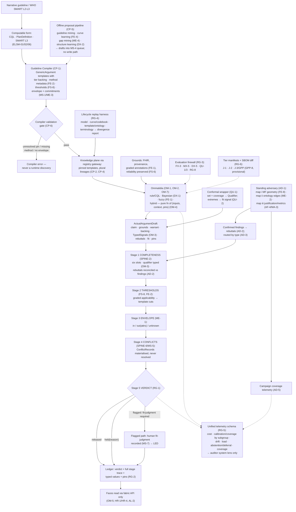

# Primer CEC — The Engine Plane

> **Justification fabric.** The butterfly's body is the justification fabric plus the deterministic evaluator: *every claim is an argument; only arithmetic releases.* One argument object renders in three registers to three faces; the fabric is append-only, hash-chained, and version-pinned so any decision replays bit-for-bit. Two wings paint the body — the **Left Wing** (MAK-LWC) senses in degrees, the **Right Wing** (MAK-RWC) judges in systems — and their coordination is the flight (MAK-MIF). The host is **MAK-FFC v1.1**: no primer here relaxes a corpus MUST. Regulatory content is governed by **REG-POSTURE v1.0** via **MAK-ANT** — assume inclusion, glass-box as the design target, ASSUME-REG-001..007 open pending counsel. This primer's position: *the compound eye — many criterion-grain ommatidia behind one contract, one compiler as the only door, one adversary with three maps, one five-stage gate with a normative order, and one replay harness for every change; the plane, not the engines, owns the image, and the exempt-tier profile (GPP, provisional) is this plane with everything probabilistic structurally absent.*

## CEC1. What this is

The engine plane is the layer of the MAK-FFC architecture between the knowledge plane and the justification fabric: the components that consume versioned grounds and template context and emit *argument fragments, never released claims* (MAK-FFC EN-1). MAK-CEC consolidates what three corpora each specified as a facet of it — the host's output contract and criterion-grain decomposition (EN-1, EN-2), the left wing's semantics of degree (FE-1..9, FS-3, FS-8), the right wing's judgment of systems (ME-1..8, MS-1, MS-9) — and states the plane law no single corpus held: **five signal types that never merge** (OM-3: posterior, coverage, membership, reliability, fit), **one compiler as the only way clinical logic enters** (CP-1), **one adversary with three target maps** (AD-1), **one release gate with a fixed five-stage pipeline** (RG-1), and **one lifecycle replay across every change class** (RG-4). Its unit is the *Ommatidium* — a stateless pure function of inputs, context and pins (OM-4) bound to one criterion or declared cluster (OM-1), emitting an `ActualArgumentDraft` with all six Toulmin elements, typed signals, a fit report and full pins (OM-2). Its defining property is the corpus's Thesis: *no ommatidium sees the patient; the mosaic is assembled by the fabric and released, held or flagged by the deterministic evaluator alone* (OM-5, RG-1; MAK-FFC SPINE-7). This primer additionally holds MAK-J3's GPP-1..16 as provisional owned IDs, because the J-3 exempt-tier reserve is exactly this plane reduced to evaluator + compiler with warrant type `guideline-rule` (RG-6; GPP-9) — every GPP citation here is **provisional, v0.9-proposed**, pending MAK-J3 ratification.

*Trace: MAK-CEC Thesis; Part 0; Part 1 "What consolidation adds" (i)–(v); OM-1..5; CP-1; AD-1; RG-1; RG-4; RG-6; MAK-FFC EN-1, SPINE-7; MAK-J3 §1, GPP-9 (provisional, v0.9-proposed).*

## CEC2. Scope

**In scope** — the six MAK-CEC requirement families this primer owns, plus the provisional GPP family:

- **OM-1..7 · Ommatidial discipline.** Criterion-grain decomposition with declared clusters (OM-1); the unified engine contract for every engine class (OM-2); the five-signal registry as non-coercible plane law (OM-3); stateless purity with all learning offline (OM-4); no engine path to a face, verified by negative tests (OM-5); machine-readable per-engine metadata feeding MAK-RWC MS-6 (OM-6); heterogeneous runtimes behind one contract (OM-7).
- **CP-1..6 · Compiler plane.** One compilation path narrative → computable → GenericArgument templates with tiers, method metadata, thresholds and envelopes (CP-1); every pin resolved before knowledge-plane entry (CP-2); recompilation at ommatidial grain with diff and impact preview (CP-3); plural lineages co-reside, never merged (CP-4); one offline proposal pipeline with one ratification interface for all learning and LLM assistance (CP-5); compiler output validation as a gate (CP-6).
- **DX-1..7 · Differential and inference.** Decomposed Bayesian differential with likelihoods as warrants and posteriors as qualifier inputs (DX-1); model structure as ratified knowledge-plane content (DX-2); per-parameter evidence backing (DX-3); fuzzy-probabilistic coupling law carried from MAK-LWC FE-5 (DX-4); calibration as a release property with blocking drift (DX-5); abstention as first-class output and FORK-REG-001 evidence (DX-6); no LLM in runtime inference (DX-7).
- **QU-1..5 · Qualifier machinery.** Conformal qualifier on every probabilistic claim (QU-1); typed conformal double duty — coverage vs fit (QU-2); group-conditional coverage per ratified subgroup schema, release-blocking (QU-3); selective prediction with cost-aware deferral (QU-4); qualifier telemetry to the auditor system lens (QU-5).
- **AD-1..5 · Standing adversary.** One corruption program, three target maps (AD-1); confirmed findings as face-visible rebuttals inheriting the release bar (AD-2); deterministic routing by finding type (AD-3); maintained harness machinery with Mākoha-owned content, CI-only (AD-4); the adversary itself measured — campaign coverage (AD-5).
- **RG-1..8 · Release gate, firewall, lifecycle, tiers.** The single five-stage deterministic evaluator with normative stage order (RG-1); every verdict ledgered with its stage trace (RG-2); the absolute evaluation firewall hosting every resident suite (RG-3); one lifecycle replay harness for every change class (RG-4); one telemetry schema (RG-5); tier placement as a build-time SBOM property (RG-6); substrate bindings following REG-POSTURE (RG-7); the plane-level conformance suite (RG-8).
- **GPP-1..16 · Guideline-Prompt Profile — provisional, v0.9-proposed.** Distinct artifact and intended-purpose statement (GPP-1); exempt-tier obligations register (GPP-2); reassessment on change (GPP-3); health-professional-only rendering (GPP-4); claim-type whitelist compiled in (GPP-5); device-origin refusal at the API boundary (GPP-6); independently verifiable basis as release gate (GPP-7); build-time exclusion with SBOM diff (GPP-8); schema-level enforcement — warrant `guideline-rule`, qualifier `applicability` (GPP-9); GPP-CONF suite (GPP-10); runtime attestation and boundary monitor (GPP-11); single-codebase, byte-identical templates (GPP-12); evidence-vehicle doctrine (GPP-13); tier-promotion protocol — crossing is a new device (GPP-14); maintained jurisdiction map (GPP-15); Deviation Composer retained (GPP-16). Held here because GPP-8/9/10/12 are engine-plane enforcement of the CP-1/RG-1/RG-6/RG-8 machinery this primer owns; PRM-ANT owns the regulatory *sensing* around them (GPP-2/3/15 obligations and jurisdiction currency cite PRM-ANT AN-7 and the REG-POSTURE gates by ID).

**Out of scope** — each exclusion names its owner:

- The Bayesian engine's arithmetic — prior selection, sequential LR updating, the four presentation variants, the red-flag/SnNout override layer, the A8 trace schema and `/v1/differential` contract (Primer A §A2, §A8). DX-1..7 state the *plane constraints* on that engine; MAK-CEC is a consolidation and never retires A's requirements (Primer A §A10 "never retires A's requirements"; MANIFEST precedence). Differences are recorded in CEC10 as findings, not resolved here.
- Conformal mechanics — nonconformity score choice, stratum minimums, calibration-slice custody (R15), recalibration triggers (Primer F §F2, §F8). QU-1..5 state what the qualifier must satisfy at the plane; F owns how.
- Perturbation rulebook content, seeded suite generation, catch-rate reporting, the near-miss dual standard (Primer G §G2, §G8; R8). AD-1..5 state the program shape and its coverage duty; G owns the machinery and the rows.
- Graph traversal, contraindication pruning, fragment pointers, rebuild determinism (Primer E §E2, §E8). E's rebuttal and DetectedIssue outputs (E10) enter this plane's stage 1 and stage 4 as content; E does not evaluate or release.
- Evidence-library rows, tiers E1/E2/E3, the library validator (Primer B §B1, §B8) — DX-3's backing refs resolve there. Fragment schema, registry PR gateway, OPA gate chain, decision log (Primer D §D2, §D8) — the compiler's output enters the knowledge plane through D's gateway (Arch §14.2 `cdss-compiler` row); the gate-chain relationship to RG-1 is finding CEC-F6.
- The fuzzification service, LinguisticVariables, codebooks, the CWW decoder, PIS profiles (PRM-LWC; MAK-LWC FS-1..9, FE-1, FE-6, FE-7). This plane consumes graded applicability at RG-1 stage 2 and reads FS-8 thresholds from the templates it compiles; FE-6/FE-7 "remain MAK-LWC-governed" (MAK-CEC Part 8).
- ApplicabilityEnvelope authoring, GapReports, the MS-4 remodeling lifecycle, trading zones (PRM-RWC; MAK-RWC MS-1..8). This plane enforces envelopes at RG-1 stage 3 and compiles commitments (CP-1, ME-3); it does not run the lifecycle.
- Face rendering of verdicts, stage traces and the five signals (PRM-HDC HR-1/HR-2/HR-4; PRM-TXC TR family; PRM-ABC AL-2/AR-3/AR-5/AG-2/AT-4) and their UIs (PRM-LBP, PRM-PRB). RG-2 makes the stage trace argument content; the faces render it.
- Change governance mechanisms 1–6 and the incident ledger (Primer I §I1, §I10). RG-4/RG-8 cross-walk to I's mechanisms (Primer I §I10 "RG cross-walk duty"); I operates the pipeline.
- Regulatory classification, REG-POSTURE text and its ASSUME-REG closures (PRM-ANT; MAK-ANT AN-1..12). RG-6/RG-7 and GPP-1..3/15 cite FORK-REG-001, REG-KEEP-001, TASK-REG-009/010/011, KTX-001..012, ASSUME-REG-004/006 by ID only.
- Stack defaults — languages, hosting, queues, caches (PRM-LEG; MAK-LEG L-family bindings cite CP-1, RG-1, RG-5, RG-6, OM-2/3/5/7 as their law).

*Trace: MAK-CEC Part 0 consolidation discipline; Part 8 consolidation map (FE-6/FE-7/ME-8 "carried in host"); Appendix A census; MAK-J3 Appendix A (provisional); Primer A §A2, §A10; Primer E §E2; Primer F §F2; Primer G §G2; Primer D §D2; Primer I §I10; Arch §14.2.*

## CEC3. Breadth and depth of content required

Thirty-eight MAK-CEC requirements (OM 7 · CP 6 · DX 7 · QU 5 · AD 5 · RG 8; 31 MUST, 6 SHOULD, 1 MAY) plus sixteen provisional GPP requirements (13 MUST, 2 SHOULD, 1 MAY). The corpus inventories no named UI components — this plane has no face — but it names **six plane-level builds with no public precedent** (MAK-CEC Part 9 build list): the five-stage evaluator with normative stage order; the unified engine contract with typed five-signal output; the decomposed Bayesian differential with per-parameter backing; the unified lifecycle replay harness parameterised by change class; the campaign-coverage model for a standing clinical adversary; and the tier-manifest SBOM discipline generalised from MAK-J3 GPP-8. Around them the corpus's Part 9 sourcing view maps each of the six parts to adopt/adapt rows (CQL stack, clinical-reasoning, WHO SMART, pgmpy, PyMC, MAPIE, crepes, netcal, alibi-detect, Giskard, ART, Aurora/immudb, evidently, openregulatory, Ketryx).

To be real rather than a demo, the plane needs: **one clinical domain compiled end to end** through CP-1 into templates carrying tiers, method metadata, FS-8 thresholds and envelopes, with CP-6 validation and a working CP-3 impact preview (CE-P1 exit); **the first rule/CQL ommatidia passing contract conformance** and the OM-3 non-coercion tests (CE-P0 exit); **stages 3–5 complete** so that out-of-envelope release is impossible without a recorded fit-judgment (CE-P2 exit); **ratified calibration bounds met on the firewalled corpus** with abstention telemetry flowing (CE-P3 exit); **a ratified subgroup schema** — demographics, site class, deployment profile at minimum — before QU-3 can block anything (QU-3; Open research agenda "Subgroup schema governance"); and **a defensible attack-surface enumeration** (warrants × curves × envelopes × cohorts) with a staleness model before AD-5's coverage floors mean anything (Open research agenda "Campaign-coverage metrics"). The corpus is explicit that no adoptable open-source differential engine exists (Part 4; MAK-ELSM §03 gap note), that mosaic assembly when ommatidia disagree has no formal semantics beyond conflict materialisation (Open research agenda), and that whether clinicians can read five typed signals without conflation is unanswered (Open research agenda; MAK-HDC HR-2 is where it is measured).

Depth constraint from the corpus: the plane's coherence "lives in the contract, not in implementation homogeneity" (OM-7) — every ommatidium may be JVM CQL, Python inference or a native fuzzy runtime, so the contract layer and the RG-8 suite carry the whole burden of coherence and must be specified before any second engine class is admitted. GPP depth (provisional): the J-3 artifact is the same codebase diverging by exclusion only (GPP-12), so nothing GPP-specific is authored — depth is in the denylist manifest and GPP-CONF negative tests (GPP-8, GPP-10), not in content.

*Trace: MAK-CEC Appendix A; Part 4 opening; Part 7 phased plan CE-P0..P5; Part 9 build list and sourcing view; Open research agenda; OM-7; QU-3; AD-5; MAK-J3 GPP-8/10/12 (provisional).*

## CEC4. Building in a silo

The plane law is mostly schema and arithmetic, and can be built and proven with no clinical content, no patients and no dependency on any neighbour's output:

- **Unified engine contract + five-signal schema** (OM-2, OM-3). Types `Posterior`, `Coverage`, `Membership`, `Reliability`, `Fit` as distinct, non-coercible schema types; `ActualArgumentDraft` with six Toulmin slots, `TypedSignals`, `FitReport`, `VersionSet`. Stub: `cdss-spine` CONTRACT-ARG-1 (Primer A §A10, Proposed) — until pinned, author locally and record the pin as a placeholder (RECON-CEC-001). Non-coercion is a property suite: any attempt to sum, cast or relabel across types fails at schema validation.
- **Five-stage evaluator** (RG-1, RG-2). Pure function `evaluate(draft, template) → verdict + stage trace`, stages 1–5 in normative order, no learned parameters. Mockable inputs: hand-authored drafts and templates covering every stage's pass/hold/flag branch. Stage 4 conflict semantics can be stubbed with a local ConflictRecord materialiser before any TweetyProject binding. Negative tests: a second entry point to face-visible content must fail structurally (RG-8).
- **Compiler skeleton** (CP-1, CP-2, CP-6). Ingest one hand-authored CQL/PlanDefinition fixture → GenericArgument template with placeholder tier, method metadata, threshold and envelope fields → CP-6 schema validation → CP-2 pin resolution (unresolved pin = compiler error). WHO SMART sample IGs (ELSM-06) are public fixtures. Stub: the registry PR gateway (Primer D §D2) — write to a local signed directory with the same hash-manifest shape (as PRM-LWC LWC4 does).
- **Recompilation grain + impact preview** (CP-3). Diff two template versions; replay a fixture sentinel set through the evaluator under both; enumerate affected verdicts. Needs only two fixtures.
- **Lifecycle replay harness** (RG-4). Parameterise the CP-3 replay by change class (model / curve-codebook / template-ontology / terminology); emit a divergence report. Silo-testable with synthetic sentinels.
- **RG-8 suite v1**: contract conformance, purity (identical inputs+pins → byte-identical draft, OM-4), signal non-coercion, single-gate negative tests, replay determinism. Tier-boundary negative tests (GPP-CONF pattern, GPP-10 provisional) run against a stub manifest.
- **Tier manifests + SBOM diff** (RG-6; GPP-8 provisional). Seed denylist from MAK-ELSM §08 (`mapie`, `pgmpy`, PGM/Bayesian runtimes, LLM runtime SDKs incl. Bedrock and — per MAK-RWC Part 9 — Baseten client namespaces, device-ingest libraries, conformal/counterfactual packages) plus PyMC namespaces on J-1 and J-3 (MAK-CEC Part 9 refresh note) plus fuzzy-inference namespaces on J-3 (MAK-LWC FX-2). CI job: Syft/CycloneDX SBOM → diff → fail on match. Silo-testable on a toy build.
- **Telemetry schema** (RG-5) as a versioned artifact; **campaign-coverage model** (AD-5) as a data structure over a synthetic surface enumeration.

What cannot be built in the silo: the differential's likelihood warrants and calibration (needs Primer A's engine and Primer B's library releases); the conformal wrapper and subgroup coverage (Primer F, plus a ratified subgroup schema from governance); the three target maps' clinical content (Primer G's rulebook plus MAK-LWC MF artifacts and MAK-RWC envelopes); envelope checks with real envelopes (PRM-RWC MS-1 data); the verdict ledger substrate (DEC-04 per Arch §14.2); the Baseten/Ketryx bindings (RG-7 — contingent on ASSUME-REG-004/006). These are CEC5 edges.

*Trace: MAK-CEC Part 2 contract; Part 7 release pipeline; OM-2/3/4; CP-1/2/3/6; RG-1/2/4/5/6/8; AD-5; MAK-ELSM §08 manifest seed; MAK-RWC Part 9 refresh landmine (Baseten namespaces); MAK-LWC FX-2; MAK-J3 GPP-8/10 (provisional); Primer A §A10; Primer D §D2; Arch §14.2.*

## CEC5. Folding it in

Integration contract — consumes and emits, with the counterpart edge named and checked.

**Consumes**

| From | What | Interface | Counterpart edge |
|---|---|---|---|
| Primer A (engine) | Posteriors as qualifier inputs; LR-chain warrant instantiations; red-flag/SnNout override claims; abstention ("insufficient grounds") | `ActualArgumentDraft` per OM-2 (A's trace record is the evaluation record) | Primer A §A8 trace schema: `qualifier` carries posterior only; no `fit`, `backing` or `rebuttals` slots; `findings[].status ∈ {present,absent,uncertain}` with no graded field; `tier` emitted by the engine. **Checked:** A §A10 says the argument envelope is "Transformed (Proposed)" — see findings CEC-F1, CEC-F2 |
| Primer F (conformal) | Prediction set + stated coverage as the Qualifier (QU-1); nonconformity extremes and large sets as *fit* signals (QU-2) | `TypedSignals.coverage` and `FitReport.signals` | Primer F §F2 in-scope: Mondrian strata (red-flag, age band, quadrant); F10 "the conformal set is the qualifier". **Checked:** F emits no typed fit signal and its strata are clinical-class, not QU-3's demographic/site/deployment schema — finding CEC-F4 |
| Primer E (Graph RAG) | Contraindication prunes as rebuttal content; supersession/plural-lineage conflicts as DetectedIssue material (E10) | Stage 1 rebuttal reconciliation; stage 4 ConflictRecords | Primer E §E10 fabric binding (rebuttals, SPINE-6 conflicts). **Checked:** E's pointers are verified by Primer D's OPA gate chain before render — a deterministic gate outside RG-1's five stages — finding CEC-F6 |
| Primer G (corruption) | Confirmed findings by type (cliff, misfit, calibration/coverage, gaming) | Rebuttal objects bound to warrants/curves/envelopes (AD-2); routing per AD-3 | Primer G §G8 rulebook rows 1–18 (content corruptions); §G10 ARG-class + dormant FZ-5 sweep class. **Checked:** no rows for AD-1 map ii (ontology edges, ME-2) or map iii (justification/metrics, AF-4/MA-3); no AD-5 coverage telemetry — finding CEC-F5 |
| Primer B (library) via Primer A | Per-parameter backing: tier (E1/E2/E3), source, currency (DX-3) | `EvidenceTierRef` resolving to R6 | Primer B §B1 tiers as executable metadata; §B10 "library rows are the backing element". Consistent |
| PRM-LWC (fuzzy spine) | Graded warrant-applicability content and encoding traces (FE-3); FS-8 thresholds and FE-2 method metadata read *from the template* | RG-1 stage 2 | PRM-LWC LWC5 emits "graded warrant-applicability … PRM-CEC evaluator applies FS-8 thresholds". Consistent; the template schema holding FS-8/FE-2/FE-5 fields is this primer's build (LWC-F3 counterpart — see CEC8) |
| PRM-RWC (meta-rational spine) | ApplicabilityEnvelopes (MS-1) per template; commitments (ME-3) compiled by CP-1; recorded fit-judgments (MS-7) for flagged releases | RG-1 stage 3; RG-2 trace | MAK-RWC fit-enforcement contract `EnvelopeCheckedRelease` (Part 6) — RG-1 stage 3 is its consolidation (MAK-CEC Part 8: ME-1 → RG-1 stage 3). Consistent |
| Knowledge plane (Primer D gateway; `cdss-compiler`) | Pinned GenericArgument templates; plural lineages (CP-4) | Registry serving API; pins from R1 | Arch §14.2 `cdss-compiler` "outputs enter through the registry PR gateway … same as fragments". **Checked:** D §D2 admits *fragments*; a GenericArgument template is a new artifact type — PRM-LWC finding LWC-F2 applies with equal force to templates; this primer adopts LWC-F2's default (artifact-type discriminator in D) |
| PRM-ANT | Tier labels (FORK-REG-001), gate positions (GATE-000..004), open assumptions (ASSUME-REG-004/006) | R30 reads | MAK-ANT AN-7 (gates govern phasing); REG-KEEP-001 → RG-1 row in MAK-ANT's concordance table. Consistent |

**Emits**

| To | What | Interface | Counterpart edge |
|---|---|---|---|
| Justification fabric (`cdss-fabric`) | Verdicts — released / held(reason) / flagged(fit-judgment required) — each with its complete stage trace, typed values and pins (RG-1, RG-2) | Append-only ledger entries; stage trace as argument content | MAK-FFC SPINE-4/5; Arch §14.5 "Fabric (argument schema + evaluator wrap)" — the evaluator lives inside `cdss-fabric`. Consistent; verdict-ledger register home is GAP-CEC-001 |
| PRM-HDC / PRM-TXC / PRM-ABC | Evaluator-released argument objects with stage traces; the five typed signals unblended | Fabric register API (SPINE-9) | MAK-HDC HR-1 (one-surface law citing RG-1/2), HR-2 (five identities citing OM-3), HR-4 (verdict fidelity: held content never renders); MAK-ABC AL-2 (stage trace on the argument pair), AR-3/AR-5 (AD-2/AD-3 findings and routing), AG-2 (RG-4 divergence report), AT-4 (AD-5 coverage on the system lens); MAK-TXC TE-2 (RG-5 telemetry). **Checked:** all resolve; the faces cite exactly the RG-1/2, OM-3, AD-2/3/5, RG-4/5 edges this primer emits |
| Primer G (corruption) | Attack surface enumeration and staleness model (AD-5); the three target maps' content ownership (AD-1) | R8 rulebook rows in G's `perturb(item, rule_id, seed)` shape | Primer G §G8 function contract. Consistent in shape; rows missing per CEC-F5 |
| Primer I (living evaluation) | RG-4 divergence reports as adjudication inputs; RG-8 suite results; new change classes (GenericArgument compilation release; template/ontology version) | R12; R7 | Primer I §I10: "GenericArgument compilation release (registry-gateway class)" already listed; "RG cross-walk duty" names RG-1/4/5/6. Consistent |
| PRM-ABC (auditor face) and PRM-RWC (MA-7) | Unified telemetry (RG-5): cost/latency, calibration and coverage by subgroup, drift streams, circumrational load, abstention/deferral, campaign coverage | Versioned telemetry-schema artifact; auditor system lens only | MAK-FFC AF-8/EN-9; MAK-ABC AT-4; MAK-RWC MA-7. Consistent |
| REG posture (PRM-ANT, R30, dossier R23) | RG-8 suite results and SBOM/tier-manifest diffs as conformity-file artifacts; DX-6 abstention rates as FORK-REG-001 Level-3 evidence | R23 dossier feed; R19 posture register | MAK-ANT concordance rows FORK-REG-001 → RG-6, REG-KEEP-001 → RG-1; Arch §13.5 L3 "produces the fork evidence". Consistent |
| GPP channel (provisional) | The J-3 artifact: evaluator + compiler, warrant `guideline-rule`, qualifier `applicability`, denylist-clean SBOM, `profile: GPP` stamps, GPP-CONF results | Integration-repo release channel (Arch §14.2 "channel, not repo") | MAK-J3 §3 capability matrix; GPP-8/9/10/11 (provisional). **Checked:** `applicability` is not one of OM-3's five signal types — finding CEC-F7 |

**Fabric binding (MAK-FFC).** This plane supplies the fabric's *release* — the only path by which a draft becomes a Claim that crosses a face boundary (SPINE-1, SPINE-7) — and the Qualifier's typing discipline (SPINE-2 via OM-3): posterior and coverage are the Qualifier's content; membership, reliability and fit are typed apart from it and never rendered as confidence. It supplies the Warrant's compiled form (GenericArgument templates via CP-1 — MAK-FFC's Warrant row "a GenericArgument node … always versioned"), the Rebuttal slot's adversarial content (AD-2 — MAK-FFC's Rebuttal row "corruption-engine findings"), and the stage trace as argument content (RG-2). It never supplies grounds gradedness (PRM-LWC), envelopes (PRM-RWC) or backing rows (Primer B). Coordination doctrine: all eight MAK-MIF beats couple mechanically here (MAK-CEC Part 8 beat map) — beat 1 graded fit measured at stage 2 then governed at stages 3/5; beat 2 encoding traces in, evaluator traces out; beat 3 curve versions replay through RG-4; beat 4 graded applicability shapes the conflicts stage 4 materialises; beat 5 plural lineages compile side by side (CP-4); beat 6 reliability passes through typed (OM-3); beat 7 three maps, one program, measured coverage (AD-1/AD-5); beat 8 one proposal pipeline, no runtime presence (CP-5/DX-7).

*Trace: MAK-CEC Part 2 contract; Part 7 pipeline; Part 8 consolidation map and beat map; OM-2/3; QU-1/2/3; AD-1/2/3/5; RG-1/2/4/5/6/8; Primer A §A8/§A10; Primer E §E10; Primer F §F2/§F10; Primer G §G8/§G10; Primer B §B10; Primer D §D2/§D8; Primer I §I10; MAK-HDC HR-1/2/4; MAK-ABC AL-2/AR-3/AR-5/AG-2/AT-4; MAK-TXC TE-2; MAK-ANT AN-7 and concordance table; Arch §14.2, §14.5; MAK-J3 §3, GPP-8..11 (provisional).*

## CEC6. Definition of done

Per release, all of:

1. **Contract conformance green** — every ommatidium version passes the unified-contract and purity suites: all six Toulmin slots populated, typed signals, fit report, full pins; identical inputs + context + pins → byte-identical draft (OM-2, OM-4, RG-8; CE-P0 exit).
2. **Signal non-coercion holds end to end** — no schema field, aggregation or render path converts, sums or relabels posterior, coverage, μ, reliability or fit; fixture set of mixed-type arguments rejected with zero passes; cross-signal use only via template-declared mappings leaving a trace (OM-3, DX-4).
3. **Single gate proven by negative tests** — every attempt to reach a face bypassing the evaluator fails structurally: no cache, notification, digest or preview path serves un-evaluated or held content; stage order completeness → thresholds → envelope → conflicts → verdict is enforced and unskippable (OM-5, RG-1, RG-8; anti-requirement "never a second gate"; CE-P2 exit).
4. **Every verdict ledgered with its stage trace** — which stage produced the verdict, typed evaluated values, pins in force, and for flagged releases the recorded human fit-judgment; out-of-envelope release impossible without a recorded judgment (RG-2; MAK-RWC ME-1/MS-7; CE-P2 exit).
5. **Compiler is the only door** — a static check finds no hand-coded runtime clinical rule outside CP-1 output in any tier; every template passes CP-6 (six slots representable, method metadata present, thresholds ratified, envelope and commitments present, pins resolved, tier markings valid); a template with an unresolved pin never enters the knowledge plane (CP-1, CP-2, CP-6; CE-P1 exit).
6. **Recompilation at grain with impact preview** — a local guideline change recompiles only affected warrant nodes and produces a diff plus affected-sentinel preview entering the ratification record; a whole-plane recompile for a local change is an alarm (CP-3); plural lineages remain unmerged with cross-lineage conflicts surfacing at stage 4 (CP-4).
7. **Differential release bar** — likelihoods as versioned warrants with per-parameter backing (a parameter without backing fails compilation); structure as ratified content with no runtime structure learning; calibration tested on the firewalled corpus within ratified bounds; abstention output present and its rate in telemetry; no LLM in posterior computation, ranking or release (DX-1, DX-2, DX-3, DX-5, DX-6, DX-7; CE-P3 exit).
8. **Qualifier bar** — every probabilistic claim carries a conformal set and stated coverage from a wrapper validated per version; nonconformity extremes route as typed fit signals never as low confidence; coverage validated and monitored per ratified subgroup with gaps beyond bounds blocking release; deferral thresholds are template metadata; qualifier telemetry flows to the auditor system lens (QU-1, QU-2, QU-3, QU-4, QU-5; CE-P4 exit).
9. **Adversary complete and measured** — one campaign cycle on all three target maps; confirmed findings published as rebuttals with unacknowledged findings blocking the affected version; routing deterministic by finding type with no auto-sanction; harness CI-only with no adversary component in any supplied artifact; campaign-coverage telemetry shows never-attacked and stale surface with ratified floors per criticality class (AD-1, AD-2, AD-3, AD-4, AD-5; CE-P4 exit).
10. **Firewall, replay, telemetry** — every reported figure reproducible by a party without engine write access; the fuzzy harness (FX-3), two-wing suite (MX-5), calibration/coverage validation and contract conformance all run inside the firewall; a change of each class (model, curve/codebook, template/ontology, terminology) replayed with a divergence report attached to its ratification record; one telemetry schema versioned and emitted by every engine and the evaluator (RG-3, RG-4, RG-5; CE-P5 exit).
11. **Tier evidence** — every build's SBOM diffs clean against its tier manifest in CI; J-3 build (provisional) has Bayesian, conformal, fuzzy-inference-over-patient-data, LLM-runtime and device-ingest modules structurally absent, GPP-CONF negative tests pass, `profile: GPP` stamps and startup attestation present, prohibited claim and qualifier types unrepresentable; per-engine metadata queryable (RG-6, RG-8, OM-6; GPP-5, GPP-6, GPP-8, GPP-9, GPP-10, GPP-11, GPP-12 — provisional).
12. **Substrate and profile obligations recorded, never assumed closed** — RG-7 bindings (Baseten dedicated deployment, split pipeline, Ketryx linkage) are recorded as defaults contingent on ASSUME-REG-004/006; for any J-3 supply (provisional) the intended-purpose statement, obligations register with owners, reassessment records, jurisdiction map review, health-professional-only rendering and tier-promotion protocol are ledgered (RG-7; GPP-1, GPP-2, GPP-3, GPP-4, GPP-7, GPP-13, GPP-14, GPP-15, GPP-16 — provisional; MAK-ANT AN-7).

*Trace: MAK-CEC Part 7 phased plan exit gates CE-P0..P5; anti-requirements; OM-2..6; CP-1..4, CP-6; DX-1..7; QU-1..5; AD-1..5; RG-1..8; MAK-J3 GPP-1..16 (provisional); MAK-RWC ME-1/MS-7; MAK-LWC FX-3; MAK-ANT AN-7.*

## CEC7. Internal operations diagram



## CEC8. Execution layer

**Unified engine contract** (verbatim from MAK-CEC Part 2, the executable spec):

```text
// Consolidates MAK-FFC EN-1, MAK-LWC's fuzzification/annotation contract,
// and MAK-RWC's fit-enforcement contract into the plane contract.
interface Ommatidium {
  binding: CriterionRef            // exactly which GenericArgument node(s), pinned
  inputs:  Grounds[]               // FHIR-sourced, provenance-bearing,
                                   // graded annotations attached (FE-1), reliability preserved (FS-6)
  context: GenericArgument         // template at pinned version, with method metadata (FE-2),
                                   // thresholds (FS-8), envelope + commitments (MS-1/ME-3)
  propose(): ActualArgumentDraft {
    claim:     Assertion           // candidate only — never released content
    grounds:   Grounds[]           // what it actually used, with encoding traces
    warrant:   WarrantRef          // versioned; type per tier rules (RG-6)
    backing:   EvidenceTierRef
    qualifier: TypedSignals        // per the five-signal registry (OM-3)
    rebuttals: Defeater[]          // applicable confirmed adversary findings (AD-2)
    fit:       FitReport           // envelope status + typed fit-signals (ME-1/ME-7)
    pins:      VersionSet          // model, config hash, terminology, template, codebook, MF versions
  }
}
// Purity: propose() is a pure function of (inputs, context, pins) — no state, no learning,
// no side channels (OM-4). Release is not an engine capability (OM-5, RG-1).
```

**The release pipeline** (verbatim from MAK-CEC Part 7):

```text
// The single gate (RG-1). Deterministic, versioned, learned-parameter-free.
evaluate(draft: ActualArgumentDraft, template: GenericArgument) →
  stage 1  COMPLETENESS   all six Toulmin elements present; qualifier typed (OM-3);
                          rebuttal slot reconciled against confirmed findings (AD-2)     [SPINE-2]
  stage 2  THRESHOLDS     graded applicability → ratified template thresholds (FS-8);
                          method metadata honoured (FE-2)                                 [MAK-LWC]
  stage 3  ENVELOPE       grounds vs warrant envelope; in / out(attrs) / unknown (ME-1)   [MAK-RWC]
  stage 4  CONFLICTS      co-applicable template conclusions reconciled into
                          ConflictRecords — materialized, never resolved (SPINE-6/MS-5)
  stage 5  VERDICT        released | held(reason) | flagged(fit-judgment required)
                          — every verdict ledgered with its full stage trace (RG-2)
// No stage is skippable; no component other than this evaluator produces verdicts.
```

**GenericArgument template schema — proposed field set (this primer's build; the corpus states the fields, not a serialisation):** per warrant node — `criterion_binding` (OM-1 cluster declaration with cohesion justification), `warrant_type` (`guideline-rule` | `bayesian-likelihood` | `fuzzy-precondition` | `local-rule`; J-3 admits only the first, GPP-9 provisional), `evidence_tier_ref` (DX-3, Primer B tiers), `method_metadata` (MAK-LWC FE-2: inference family, defuzzifier; type-reduction if FE-7 triggered), `thresholds` (MAK-LWC FS-8: α-cuts, activation floors, similarity floors), `coupling_map` (MAK-LWC FE-5 / DX-4: which graded grounds inform which likelihood inputs; crisp-or-graded exclusivity), `deferral_thresholds` (QU-4), `envelope` (MAK-RWC MS-1), `commitments` (MAK-RWC ME-3: source exclusions + accepted gaps), `pins` (CP-2: guideline lineage, terminology release, evidence snapshot, codebook/FML versions, envelope version, compiler version), `tier_markings` (RG-6), `profile` (`GPP` stamp, GPP-9 provisional), `lineage` (CP-4 sibling lineage id). This schema is the natural home for the two counterpart edges PRM-LWC raised: LWC-F3's coupling map lives in `coupling_map`, and the `graded: {term, mu, fml_version}` extension to Primer A's `findings[]` is the grounds-side mirror of that field; LWC-F2's artifact-type discriminator at the D gateway applies to templates as much as to FML — both are proposed in CEC10.

**First executable properties (seed for the I registry, plane-owned subset — RG-8, OM-3, OM-4, RG-1):** (1) ∀ ommatidium: `propose(inputs, context, pins)` is byte-identical across two independent workers and across dates (OM-4). (2) ∀ draft: no two fields typed from {posterior, coverage, membership, reliability, fit} share a slot, and any arithmetic across two types fails schema validation (OM-3). (3) ∀ draft: `evaluate` visits stages in order 1→2→3→4→5 and a fixture that fails stage n never reaches stage n+1 (RG-1). (4) A draft with a missing qualifier or an empty rebuttal slot while confirmed findings exist yields `held` at stage 1, never `released` (SPINE-2, AD-2). (5) A draft whose grounds fall outside the warrant envelope or whose envelope is unknown never yields `released` without a recorded fit-judgment (ME-1, RG-2). (6) Two co-applicable templates with conflicting conclusions yield a ConflictRecord and never a single ranked winner (SPINE-6, CP-4). (7) A fixture posterior whose version lacks current calibration evidence cannot satisfy stage 1's qualifier check (DX-5, QU-1). (8) Any path to face-visible content that does not pass through `evaluate` fails structurally in the negative-test build (OM-5, RG-8). (9) ∀ build: SBOM ∩ tier-denylist = ∅, and the J-3 build (provisional) cannot construct a `diagnosis` claim type or a `posterior` qualifier at compile time (RG-6, GPP-5/8/9). (10) Replaying a sentinel set under two pinned versions yields exactly the divergence set the RG-4 report enumerated.

**Asset library** — every requirement family maps to at least one row. Seeded from MAK-CEC Part 9 (ELSM-E01..E04 verified 2026-09-01), MAK-ELSM v1.1 (verified 2026-08-29), MAK-RWC Part 9 (ELSM-R01..R04 verified 2026-09-01) and PRM-LWC LWC8 (2026-09-02); **load-bearing rows re-verified this run, 2026-09-02**, method stated; carried rows say so. GitHub's API was not reachable from this environment, so verification used PyPI's JSON API (version, upload date, licence classifier), GitHub release pages via fetch, and LICENSE files by raw fetch. Verdict vocabulary per MAK-ELSM: ADOPT / ADAPT / STUDY / BUILD / WATCH; DEAD-REPLACE added for archived assets.

| Asset | Type | Satisfies | Licence | Currency | Verified (method · date) | Verdict |
|---|---|---|---|---|---|---|
| [cqframework/clinical_quality_language](https://github.com/cqframework/clinical_quality_language) (ELSM-01) | library (Kotlin/Java) — CQL→ELM translator + runtime | CP-1, OM-7, GPP-9 (provisional) | Apache-2.0 | **CQL 5.0.0 · 30 Jun 2026** — major version; "all non-null CQL values" now a sealed `Value` interface (API change since the 4.x line ELSM described) | GitHub releases page fetched · 2026-09-02 | **ADOPT; WATCH 5.x migration** — pin 4.9.0 or 5.0.0 deliberately and record in R14 |
| [cqframework/clinical-reasoning](https://github.com/cqframework/clinical-reasoning) (ELSM-02) | library (Java) — PlanDefinition `$apply`, measure eval | CP-1, OM-1 rule/CQL ommatidia | Apache-2.0 | v4.7.0 · 11 May 2026 (matches ELSM-02) | GitHub releases page fetched · 2026-09-02 | **ADOPT** |
| WHO SMART Guidelines IGs (ELSM-06) | content (FHIR IGs) | CP-1 source material, CP-4 national layers | CC/Apache mix | active program | carried forward from MAK-ELSM §01 (verified 2026-08-29) | **ADOPT** |
| HAPI FHIR jpaserver-starter (ELSM-20) | server (Java) | OM-2 grounds substrate; RG-2 Provenance/AuditEvent bindings (SPINE-4) | Apache-2.0 | very active; absorbing clinical-reasoning | carried forward from MAK-ELSM §04 (verified 2026-08-29) | **ADOPT** |
| [pgmpy/pgmpy](https://github.com/pgmpy/pgmpy) (ELSM-E01) | library (Python) — PGM construction/inference | DX-1, DX-2 primitives | MIT | **1.1.2 · 30 Apr 2026** | PyPI JSON API · 2026-09-02 | **ADOPT** (the differential itself remains BUILD) |
| [pymc-devs/pymc](https://github.com/pymc-devs/pymc) (ELSM-E02) | library (Python) — probabilistic programming | DX-3 elicitation checks, DX-5 calibration studies — **offline/CP-5 only** | Apache-2.0 | **6.3.1 · 16 Aug 2026** (CEC recorded 6.0.1 May 2026 — cadence confirmed active) | PyPI JSON API · 2026-09-02 | **ADAPT (offline)**; namespaces on J-1 and J-3 denylists (RG-6; MAK-CEC Part 9 refresh note) |
| babylonhealth/counterfactual-diagnosis (ELSM-13) | repo (Python) | DX-5 evaluation baseline | GPL-3.0 · patent application | dormant | carried forward from MAK-ELSM §03 (verified 2026-08-29) | **STUDY ONLY — never ship** |
| [scikit-learn-contrib/MAPIE](https://github.com/scikit-learn-contrib/MAPIE) (ELSM-12) | library (Python) — conformal sets, risk control | QU-1, QU-3 (Mondrian), QU-4 | BSD-3-Clause (PyPI `license_expression`) | **1.5.0 · 5 Aug 2026** | PyPI JSON API · 2026-09-02 | **ADOPT** |
| [henrikbostrom/crepes](https://github.com/henrikbostrom/crepes) (ELSM-E03) | library (Python) — conformal classifiers/regressors/predictive systems | QU-1, QU-3 cross-implementation check; RG-3 | BSD-3-Clause | **0.9.1 · 12 Jun 2026** (matches CEC) | PyPI JSON API · 2026-09-02 | **ADOPT** — dual-implementation discipline with MAPIE (MAK-CEC Part 9 refresh note) |
| [EFS-OpenSource/calibration-framework](https://github.com/EFS-OpenSource/calibration-framework) — netcal (ELSM-E04) | library (Python) — calibration metrics + recalibration | DX-5, QU-5 | Apache-2.0 | **1.4.0 · 16 Apr 2026** — **CEC's "slow-moving; v1.3.6 Aug 2024" landmine is resolved: maintenance resumed** | PyPI JSON API · 2026-09-02 | **ADOPT** (upgraded from CEC's ADAPT; vendoring contingency no longer needed) |
| [SeldonIO/alibi-detect](https://github.com/SeldonIO/alibi-detect) (ELSM-R01) | library (Python) — OOD/drift/adversarial detection | QU-2 OOD signals (ME-7) | **Business Source License 1.1** (Change License Apache-2.0, four years per version) — **MAK-RWC ELSM-R01 records Apache-2.0; this is wrong** | 0.13.0 · 11 Dec 2025 | PyPI JSON API + raw LICENSE file fetched · 2026-09-02 | **ADAPT — licence review before any use in a supplied artifact** (finding CEC-F8); downgraded from RWC's ADOPT |
| [evidentlyai/evidently](https://github.com/evidentlyai/evidently) (ELSM-R02) | library (Python) — evaluation/monitoring framework | RG-5, QU-5 telemetry scaffolding | Apache-2.0 | 0.7.21 · 10 Mar 2026 | PyPI JSON API · 2026-09-02 | **ADOPT** — schema and fabric coupling remain BUILD (MAK-RWC refresh landmine) |
| [Giskard-AI/giskard](https://github.com/Giskard-AI/giskard) (ELSM-15) | library (Python) — ML/LLM test harness | AD-4 harness machinery | Apache-2.0 | **3.0.0 · 26 Aug 2026** — major version, 7 days old | PyPI JSON API · 2026-09-02 | **ADOPT; WATCH 3.x breaking changes** |
| [Trusted-AI/adversarial-robustness-toolbox](https://github.com/Trusted-AI/adversarial-robustness-toolbox) (ELSM-16) | library (Python) — adversarial example generation | AD-4 perturbation ammunition | MIT | 1.20.1 · 7 Jul 2025 — **14 months since last release** | PyPI JSON API · 2026-09-02 | **ADOPT; WATCH cadence** — confirm activity before CE-P4 dependency freeze |
| [TweetyProjectTeam/TweetyProject](https://github.com/TweetyProjectTeam/TweetyProject) (ELSM-07) | library (Java) — Dung/ASPIC+/ABA semantics | RG-1 stage 4 conflict semantics; Open research agenda "mosaic assembly" | LGPL-3.0 (≥1.6; GPL-3.0 before — MAK-RWC Part 9) | v1.31 · 14 Jul 2026 | GitHub releases page fetched · 2026-09-02 | **ADAPT (evaluator only; no probabilistic argumentation modes in J-3 — MAK-ELSM §08)** |
| carneades/carneades-4 (ELSM-08) | repo (Go) | RG-1 evaluator design | MPL-2.0 | dormant since 2017 | carried forward from MAK-ELSM §02 (verified 2026-08-29) | **STUDY** |
| Aurora PostgreSQL + transparency-log pattern (ELSM-19) / codenotary/immudb (ELSM-17) | pattern / database | RG-2 verdict ledger | Apache-2.0 refs / **BUSL-1.1** | active / active | carried forward from MAK-ELSM §04 (verified 2026-08-29); DEC-04 pending (Arch §14.2) | **ADOPT PATTERN / ADAPT (BUSL review)** |
| [anchore/syft](https://github.com/anchore/syft) + CycloneDX | tool — SBOM generation | RG-6 tier manifests; GPP-8 (provisional) SBOM diff | Apache-2.0 | Syft v1.46.0 · 26 Jun 2026 (adds SPDX 3) | GitHub releases page fetched · 2026-09-02 | **ADOPT** — already mandated by Arch §11.1 Tier 1+2 |
| [openregulatory/templates](https://github.com/openregulatory/templates) (ELSM-R04) | templates (ISO 13485 / IEC 62304 / ISO 14971) | RG-7 document layer; GPP-2 (provisional) obligations evidence | per repo LICENSE.md | active | carried forward from MAK-RWC Part 9 (verified 2026-09-01) | **ADAPT** |
| Ketryx on Jira (KTX-001..012) | commercial SaaS — lifecycle system of record | RG-7; GPP-2/GPP-3 (provisional) records | commercial | — | carried from REG-POSTURE via MAK-ANT; **ASSUME-REG-006 open** | **ADAPT — contingent default, never architecture** (RG-7) |
| Baseten Sydney dedicated deployments (TASK-REG-009) | managed inference substrate | RG-7 | commercial | — | carried from REG-POSTURE via MAK-ANT; **ASSUME-REG-004 open**; Arch §14.6 conflict C-03 ESCALATED (DEC-03) | **ADAPT — contingent default** |
| CLArg-group/argumentative-llms (ELSM-09) + ArgTumour pattern | research code | CP-5 guideline-mining proposal pipeline | see repo | research-grade | carried forward from MAK-ELSM §02/§05 (verified 2026-08-29) | **ADAPT (authoring-time only; no runtime presence — CP-5, DX-7)** |
| pyfuzzylite / simpful (fuzzy runtimes) | libraries (Python) | OM-7 fuzzy ommatidia; RG-1 stage 2 inputs | GPL-3.0 + commercial / AFL-3.0 | v8.0.6 / maintained | carried forward from PRM-LWC LWC8 (verified 2026-09-02) | **ADAPT / ADOPT per PRM-LWC RECON-LWC-003 licence ruling** |
| TGA, *Understanding clinical decision support system software regulation* (rev. 7 Oct 2025) | regulatory guidance | GPP-1..7, GPP-15 (provisional); RG-6 tier language via FORK-REG-001 | — | **tga.gov.au pages not fetchable this run (robots.txt disallow)**; secondary sources (Clayton Utz Jul 2026; TGA AI guidance Feb/Apr 2026 per MAK-RWC Part 9) show no change to exemption criteria (a)(b)(c) and name SaMD as a 2026–27 enforcement priority | WebSearch + secondary fetch · 2026-09-02 | **ADOPT as anchor; WATCH via PRM-ANT** — re-verify at GATE-000 (MAK-ANT AN-7) |
| FDA, *Clinical Decision Support Software* — final guidance (Jan 2026) | regulatory guidance | GPP-15 (provisional) jurisdiction map | — | Final; issue date January 2026; fda.gov page updated 29 Jan 2026 | fda.gov page fetched · 2026-09-02 | **ADOPT as anchor** (US relevance only — MAK-J3 §2.3) |
| **Five-stage deterministic evaluator with stage trace** | build | RG-1, RG-2, OM-5 | — | no public precedent (MAK-CEC Part 9 build list) | MAK-CEC Part 9; targeted search this run found none | **BUILD** |
| **Unified engine contract + five-signal schema + non-coercion validator** | build | OM-2, OM-3 | — | no public precedent | MAK-CEC Part 9 | **BUILD** (shares the type registry with PRM-LWC TASK-LWC-002) |
| **GenericArgument template schema + compiler annotation lift** | build | CP-1, CP-2, CP-6; FS-8/FE-2/FE-5 fields; MS-1/ME-3 fields | — | "the argument annotation, not the execution machinery" (MAK-ELSM §01 integration note) | MAK-ELSM §01; MAK-CEC Part 9 | **BUILD** |
| **Recompilation-grain differ + impact preview** | build | CP-3 | — | pattern precedent MAK-LWC FA-5 | MAK-CEC CP-3 trace | **BUILD** |
| **Decomposed Bayesian differential** (likelihood warrants, per-parameter backing, calibration harness, abstention) | build (Primer A's `cdss-engine`, plane-constrained) | DX-1..6 | — | no adoptable OSS differential (MAK-ELSM §03 gap note; confirmed MAK-CEC Part 9) | MAK-CEC Part 9 refresh note | **BUILD** |
| **Subgroup-coverage governance + typed double-duty router** | build | QU-2, QU-3 | — | Kwon 2026 supplies the method, not the governance | MAK-CEC Part 9 sourcing view | **BUILD** |
| **Three target maps' content + campaign-coverage model** | build (rows in Primer G's R8) | AD-1, AD-5 | — | no precedent for governed clinical campaign coverage (Open research agenda) | MAK-CEC Part 9 | **BUILD** |
| **Unified lifecycle replay harness** | build | RG-4 | — | no public precedent | MAK-CEC Part 9 | **BUILD** |
| **Tier manifests, prohibited-namespace denylist, GPP-CONF suite, profile attestation + boundary monitor** | build | RG-6, RG-8; GPP-8, GPP-10, GPP-11 (provisional) | — | manifest seed in MAK-ELSM §08 | MAK-ELSM §08; MAK-CEC Part 9 | **BUILD** |
| **Engine metadata service** | build | OM-6 | — | — | MAK-CEC OM-6 | **BUILD (SHOULD-level; CE-P5)** |

**Coverage check (P5):** OM-1..7 → clinical-reasoning, HAPI, pgmpy, fuzzy runtimes, TweetyProject; contract/schema build; metadata build. CP-1..6 → CQL translator, clinical-reasoning, WHO SMART, argumentative-llms (CP-5); template-schema build; differ build. DX-1..7 → pgmpy, PyMC (offline), Babylon (study), netcal; differential build. QU-1..5 → MAPIE, crepes, netcal, alibi-detect (licence review), evidently; subgroup-governance build. AD-1..5 → Giskard, ART; maps + coverage-model build. RG-1..8 → TweetyProject, Carneades, Aurora/immudb, Syft/CycloneDX, openregulatory, Ketryx, Baseten, evidently; evaluator, replay-harness and tier-manifest builds. GPP-1..16 (provisional) → TGA and FDA anchors, Syft/CycloneDX, CQL stack (GPP-9 `guideline-rule`), openregulatory/Ketryx (GPP-2/3), GPP-CONF/attestation build. **38/38 + 16/16 covered; 10 rows are BUILD.**

**Sourcing landmines carried forward, with this run's status:** netcal slow-moving (MAK-CEC Part 9) — *resolved: 1.4.0 released Apr 2026*; PyMC runtime placement — *unchanged: offline only, denylisted J-1/J-3*; immudb BUSL — *unchanged*; QLDB retired — *unchanged, AVOID*; Babylon patent encumbrance — *unchanged*; Carneades dormancy — *unchanged*; TweetyProject pre-1.6 GPL — *unchanged, pin ≥1.6*; Bedrock → Baseten migration and Baseten client namespaces on the J-3 denylist (MAK-RWC Part 9) — *unchanged, ASSUME-REG-004 open*; Ketryx commercial with no OSS equivalent — *unchanged, ASSUME-REG-006 open*. **New this run:** alibi-detect is BUSL-1.1, not Apache-2.0 (CEC-F8); CQL translator 5.0.0 is a major API change (pin deliberately); Giskard 3.0.0 is seven days old (pin 2.x or validate 3.x before CE-P4); ART is 14 months without a release; tga.gov.au blocks automated fetch — regulatory currency checks must go through PRM-ANT's method.

**Proposed tolerances (flag: clinical sign-off required; none is a corpus number):** RG-1 evaluator p99 ≤ 50 ms per draft excluding I/O, budgeted inside RG-5 with MAK-LWC FE-9's fuzzy budget as a component; DX-5 calibration acceptance ECE ≤ 0.05 overall per Primer A §A8 tolerances (referenced, not restated as authoritative — Primer I §I8 holds the numbers); QU-3 subgroup coverage gap ≤ 2.0 percentage points below target per ratified subgroup (Kwon 2026 reports 1.4 pp under shift — the bar should be no looser than the literature's demonstrated result); AD-5 campaign-coverage floor: every critical-class warrant/curve/envelope attacked within 90 days, no surface older than 180 days on any map; RG-4 sentinel set ≥ 500 decisions plus a change-class-specific affected sample; DX-6 abstention profile pre-registered before L4 (Open research agenda "Abstention economics").

*Trace: MAK-CEC Part 2 contract; Part 7 pipeline; Part 9 sourcing view, build list, refresh table and notes; Appendix C; MAK-ELSM §01–§04, §06, §08, Appendix A; MAK-RWC Part 9 refresh and landmines; PRM-LWC LWC8; Primer A §A8; Primer I §I8; Arch §11.1, §14.2, §14.6; MAK-J3 §2.3 (provisional); external verification as tabled, 2026-09-02.*

## Production topology annotation

*Per Architecture §11 and §14.5 (MET-1, Proposed):* the plane has no single row — it is spread across §11.3's engine (A, L1), conformal (F, L3), corruption (G, v0 L1) rows and §14.5's **Fabric (argument schema v0 at L1; evaluator wrap live at L2; deviation composer L3; compliance projector L4)**, **Guideline Compiler (EN-3 lift: v0 on the ADOPT stack at L3; multi-domain L4)** and **GPP artifact (first release L4, "needs confirmation — J-3 is v0.9-proposed")** rows. MAK-CEC's phased plan CE-P0..P5 is component-internal and not level-aligned; reconcile as follows: CE-P0 (contract, five-signal schema, evaluator stages 1–2, RG-8 v1) lands with the L1 argument schema v0 and the L2 evaluator wrap; CE-P1 (compiler lift, one domain) is the L3 compiler v0; CE-P2 (stages 3–5, stage traces, flagged path) completes at L3 alongside the deviation composer; CE-P3 (DX-1..6 conformance of the engine that has run since L1) binds at L3 exit with F's coverage report; CE-P4 (QU-1/3, AD-1 three maps, AD-5) spans L3–L4 with G's graph rows and K rows; CE-P5 (RG-4 all classes, RG-5, RG-6 tier builds, RG-7 bindings) is L4 — the posture decision (FORK-REG-001, decided at Maturity Level 4 on Level 3 abstention evidence per MAK-ANT §3.1) is the RG-6 tier-manifest event, and the first GPP artifact release is L4 per §14.5 footnote 2. Tier pipeline applies in full from first release (§11.1); SBOM signing at Tier 1+2 is RG-6's substrate. Gate dependencies per MAK-ANT AN-7: everything through CE-P2 is lawful synthetic-only engineering pre-GATE-002; DX-5 calibration on non-synthetic data and QU-3 subgroup validation wait for GATE-002; RG-7's regulated-tooling configuration waits for GATE-000. J-tier per RG-6: evaluator, compiler, fuzzy layer and rule/CQL ommatidia J-1; Bayesian differential, conformal wrappers, OOD detectors J-2 — see finding **CEC-F3** on the J-1 placement of the Bayesian differential versus Architecture §9; J-3 evaluator + compiler only (GPP-5/6/8/9, provisional).

## Register topology annotation

*Per Architecture §12 (R1–R28) and §14.3 (R29–R30, Proposed):* **Owns:** none as a plane — the evaluator lives in `cdss-fabric`, the compiler in `cdss-compiler`, the differential in `cdss-engine`, the wrapper in `cdss-conformal`, the adversary in `cdss-corruption`; ownership is per repo (§12.1 law 1). **Writes:** R1 (pins on every draft and verdict — CP-2, OM-2); R2 (compiled template bundle manifests); R3 (SBOMs per build — RG-6); R7 (the ten plane properties above — RG-8); R11 (verdicts with stage traces, if the Decision Log is extended — see GAP-CEC-001); R12 (CP-3 impact previews and RG-4 divergence reports as adjudication inputs); R18 (OM-4 purity and OM-3 non-coercion contract violations at runtime); R23 (RG-8 suite results and tier diffs as conformity evidence); R25 (this run's verification table). **Reads:** R1, R6 (DX-3 backing resolution), R8 (AD-1 rulebook rows), R14 (lockfile pins), R15 (QU-1 calibration currency), R19 (posture → RG-6 manifests), R30 (regulatory posture — RG-7 contingencies). **Gap proposals:** GAP-CEC-001 — the verdict ledger (RG-2) has no register home; R11 Decision Log (D8, "every render attempt", append, object-lock) is the nearest — propose extending R11's schema to carry evaluator verdicts and stage traces, or a new append-only Verdict Ledger owned by `cdss-fabric`; operator decision. GAP-CEC-002 — campaign-coverage telemetry (AD-5) has no register; propose a versioned Campaign Coverage Register owned by `cdss-corruption` beside R8. GAP-CEC-003 — the prohibited-namespace tier manifests (RG-6; GPP-8 provisional) are versioned configuration, not append-only SBOMs; R3 is append — propose the manifests live as `cdss-spine` contracts stamped in R1, diffed against R3 entries in CI. GAP-CEC-004 — the unified telemetry schema (RG-5) as a versioned artifact needs a `cdss-spine` contract home (same mechanism). GAP-CEC-005 — the GPP obligations register (GPP-2, provisional) with named owners has no home; propose an R30 extension owned by governance, since REG-POSTURE's OBL-* items already live there per MAK-ANT.

<!-- ECOSYSTEM-V2-BLOCK: CEC v1.0 -->
## CEC9. Build Execution Extension (Ecosystem v2.0)

**1. Mini-North-Star.** WHAT: the unified engine contract with five-signal types and non-coercion validator; the five-stage deterministic evaluator emitting verdicts with stage traces; the compiler's GenericArgument template schema with CP-6 validation and CP-3 impact preview; the RG-8 conformance suite with tier-manifest negative tests. WHY: the plane law that makes heterogeneous engines one mosaic and guarantees only arithmetic releases. Endpoint: contract + evaluator wrap at L1/L2, compiler v0 at L3, tier builds at L4 (Production topology annotation). Derives from and cites SPINE §13.1 and MAK-FFC EN-1/EN-3/SPINE-7.

**2. Doctrine classification.** The evaluator, the compiler's validation gate, the non-coercion validator, replay and SBOM diffs are arithmetic (learned-parameter-free — RG-1). Ommatidia propose (OM-5). The CP-5 proposal pipeline proposes and never touches runtime. Nothing here releases except the evaluator, and the evaluator is the release.

**3. Scoped recon register.**
| ID | Verify | Tag |
|---|---|---|
| RECON-CEC-001 | `cdss-spine` CONTRACT-ARG-1 pinned with OM-2 slots (typed signals, fit report, pins) and the five non-coercible signal types | E:REPO (cdss-spine tag); E:DOC Primer A §A10 |
| RECON-CEC-002 | Primer A `findings[]` and trace schema extension: `graded` field, `fit`/`backing`/`rebuttals` slots, `tier` as claim not verdict (findings CEC-F1/F2; PRM-LWC LWC-F3) | E:DOC A8; E:REPO cdss-engine |
| RECON-CEC-003 | Registry gateway admits a GenericArgument template artifact type (LWC-F2 counterpart) and the D gate chain's relationship to RG-1 stages (CEC-F6) | E:DOC D2, D8, Arch §14.2; E:REPO cdss-registry |
| RECON-CEC-004 | Primer F emits a typed fit signal (QU-2) and its stratum schema is extensible to QU-3's ratified subgroups (CEC-F4) | E:DOC F8; E:REPO cdss-conformal |
| RECON-CEC-005 | Primer G rulebook rows for AD-1 maps ii and iii, and an AD-5 coverage telemetry hook (CEC-F5) | E:DOC G8/G10; E:REPO R8 |
| RECON-CEC-006 | RG-6 J-1 composition vs Architecture §9 ("downstream of coding, the two runtimes are identical") — operator ruling (CEC-F3) | E:DOC Arch §9, §11.3; MAK-CEC RG-6; MAK-ANT §3.1 |
| RECON-CEC-007 | alibi-detect BUSL-1.1 terms for CI-only vs supplied-artifact use; ART maintenance status; Giskard 3.x breaking changes; CQL 5.0.0 migration scope | E:WEB required at ticket start |
| RECON-CEC-008 | DEC-04 ledger substrate for the verdict ledger (GAP-CEC-001); DEC-05 (fuzzy entry) for stage 2 activation; DEC-03 (Baseten vs Bedrock) for RG-7 | E:DOC Arch §14.2, §14.5, §14.6; MET-2 queue |
| RECON-CEC-009 | MAK-J3 ratification status and naming (J-3 "provisional pending ratification"); GPP `applicability` qualifier's place in OM-3 (CEC-F7) | E:DOC MAK-J3 frontmatter, GPP-9; MAK-CEC OM-3 |

**4. Work register seed (CE-P0-equivalent; schema per master v2 Phase 6; estimates ranged with confidence).**
```yaml
TASK-CEC-001:
  story: STORY-CEC-001 (five signals stay five signals from schema to render)
  component: engine-contract
  title: Unified Ommatidium contract + five-signal type registry + non-coercion validator
  purpose_chain: {what: "cdss-spine schema for ActualArgumentDraft (OM-2) with Posterior/Coverage/Membership/Reliability/Fit as distinct non-coercible types (OM-3), plus a validator that rejects any mixed-type or cross-type-arithmetic object", why: "the plane's coherence lives in the contract, not in implementation homogeneity (OM-7); signal soup at the seams is the named risk", endpoint_ref: "CE-P0 exit: contract conformance green on first rule/CQL ommatidia; non-coercion tests pass; SPINE-NS WHY"}
  evidence_refs: [E:DOC MAK-CEC Part 2 contract, OM-2, OM-3, OM-4; RECON-CEC-001; PRM-LWC TASK-LWC-002 (shared type registry)]
  definition_of_ready: ["CONTRACT-ARG-1 draft in cdss-spine or local placeholder recorded", "type registry names agreed with PRM-LWC (μ, activation, Z-reliability) and PRM-RWC (fit)"]
  steps: ["schema: six Toulmin slots + TypedSignals + FitReport + VersionSet", "type registry with non-coercible types", "validator: reject mixed slots, reject cross-type arithmetic, reject generic 'confidence' field", "purity harness: two-worker byte-identity (OM-4)", "fixture set 40+ (clean + mixed)"]
  test_plan: "zero false-accepts on mixed fixtures; zero false-rejects on clean; property CEC8 (1), (2)"
  observability: "validator rejection log with offending field path; counter contract.rejections by type"
  definition_of_done: ["fixture suite green", "schema published as cdss-spine contract with version", "consumers (engine, conformal, fuzzy, fabric) break visibly on change per Arch §10"]
  estimate: {optimistic: 3d, likely: 5d, pessimistic: 8d, confidence: medium}
  depends_on: []
```
```yaml
TASK-CEC-002:
  story: STORY-CEC-002 (only the evaluator releases, and it says why)
  component: evaluator
  title: Five-stage deterministic evaluator with normative stage order and stage trace (RG-1, RG-2)
  purpose_chain: {what: "pure fn evaluate(draft, template) → released | held(reason) | flagged, visiting COMPLETENESS→THRESHOLDS→ENVELOPE→CONFLICTS→VERDICT, ledgering typed values + pins per stage", why: "order ambiguity is where a second release path would hide (MAK-CEC Part 7); the stage trace is what faces render (HR-4, AL-2)", endpoint_ref: "CE-P0 exit (stages 1–2); CE-P2 exit (stages 3–5; out-of-envelope release impossible without recorded judgment)"}
  evidence_refs: [E:DOC MAK-CEC Part 7 pipeline, RG-1, RG-2, OM-5; MAK-LWC FS-8/FE-2; MAK-RWC ME-1/MS-5/MS-7; RECON-CEC-001, RECON-CEC-008]
  definition_of_ready: ["TASK-CEC-001 done", "template schema fields for thresholds, method metadata, envelope available as fixtures", "ConflictRecord shape agreed with PRM-RWC"]
  steps: ["stage 1 completeness + qualifier typing + rebuttal reconciliation", "stage 2 threshold application from template only (never code/config)", "stage 3 envelope check in/out(attrs)/unknown", "stage 4 ConflictRecord materialiser (local; TweetyProject binding later)", "stage 5 verdict + trace emit", "negative-test build: no second entry point to face-visible content"]
  test_plan: "properties CEC8 (3)–(6), (8); fixture per stage branch; flagged path requires recorded fit-judgment fixture"
  observability: "verdict counter by class; stage-fail histogram; latency vs proposed budget"
  definition_of_done: ["stage order unskippable by construction", "every verdict carries full trace", "single-gate negative tests green", "learned-parameter-free attested (no model artifacts in the evaluator's SBOM)"]
  estimate: {optimistic: 5d, likely: 9d, pessimistic: 15d, confidence: medium}
  depends_on: [TASK-CEC-001]
```
```yaml
TASK-CEC-003:
  story: STORY-CEC-003 (a guideline enters the plane through one door, fully pinned)
  component: compiler
  title: GenericArgument template schema + CP-6 validation gate + CP-3 recompilation differ
  purpose_chain: {what: "cdss-compiler emitting templates with evidence tier, method metadata (FE-2), thresholds (FS-8), coupling map (FE-5/DX-4), envelope + commitments (MS-1/ME-3), full pins (CP-2), tier markings, lineage; CP-6 schema gate; per-node differ with sentinel impact preview", why: "the lift Mākoha builds is the argument annotation on top of artifacts the ecosystem already ships (MAK-ELSM §01); every threshold and method choice must live here, not in code (FS-8, FE-2)", endpoint_ref: "CE-P1 exit: one domain compiled end-to-end, every template enveloped, impact preview works"}
  evidence_refs: [E:DOC CP-1, CP-2, CP-3, CP-4, CP-6; MAK-LWC FS-8, FE-2, FE-5; MAK-RWC MS-1, ME-3; MAK-ELSM §01 integration note; RECON-CEC-003]
  definition_of_ready: ["one guideline domain's CQL/PlanDefinition fixture (WHO SMART sample or Primer B's respiratory exemplar)", "LWC-F2/CEC-F6 gateway ruling recorded or local signed-directory stub in place", "pinned CQL translator version (4.9.0 or 5.0.0) recorded in R14"]
  steps: ["ingest CQL/PlanDefinition via ELSM-01/02", "annotation lift per warrant node", "CP-6 gate: six slots representable, method present, thresholds ratified, envelope + commitments present, pins resolved, tier markings valid", "CP-2 pin resolver hard-fails on unresolved pin", "differ + sentinel replay preview (CP-3)", "emit bundle manifest to R2; hand to registry gateway"]
  test_plan: "fixture templates with each CP-6 failure class rejected; a local change recompiles only affected nodes (whole-plane recompile fixture alarms); preview enumerates exactly the flipped sentinels"
  observability: "compile errors by class; recompile-scope metric (nodes touched / nodes total) — whole-plane spikes alarm per CP-3"
  definition_of_done: ["one domain end-to-end", "CP-6 failures are compiler errors never runtime discoveries", "templates byte-identical across J-1/J-2/J-3 for the same version (GPP-12, provisional)"]
  estimate: {optimistic: 8d, likely: 14d, pessimistic: 25d, confidence: low}
  depends_on: [TASK-CEC-001]
```

**5. Orchestration hooks.** `WF-CEC-1` template release: compile → CP-6 gate → CP-3 diff + preview → RG-4 replay (template/ontology class) → registry gateway PR → R2 manifest (idempotent by template bundle hash; retry 1; timeout 45m). Emits `EVT-CEC-1 template.released`, consumed by PRM-LWC's template-pin refresh (LWC9 hook 5), Primer I's "GenericArgument compilation release" class (I10) and WF-SPINE-1. `WF-CEC-2` plane release: RG-8 suite (contract, purity, non-coercion, single-gate negatives, tier-boundary negatives, replay determinism) → SBOM → tier-manifest diff → conformity artifact to R23 (idempotent by lockfile pin-set; on any RG-8 failure no compensation — the plane never partially promotes). Emits `EVT-CEC-2 plane.conformance`, consumed by WF-SPINE-1's cross-gauntlet and, for the GPP channel (provisional), by the GPP-CONF gate (GPP-10).

**6. Observer checkpoint spec.** At L2 exit (evaluator wrap live): stages 1–2 verdicts with traces in CI artifacts; non-coercion fixture run shows zero false-accepts; single-gate negative build present. At L3 exit: one domain compiled with CP-6 evidence; stage 3–5 traces; a flagged-path fixture with recorded fit-judgment; F's coverage report cross-referenced from stage 1's qualifier check. At L4: RG-6 SBOM diffs for every tier build including the first GPP artifact (provisional); one RG-4 replay per change class filed in R12; AD-5 coverage series flowing to the auditor lens. Admissible: R1, R2, R3, R7 run outputs, R11/verdict ledger, R12, R23, CI artifacts.

**7. Implementer Contract binding.** Tickets execute under IMPL (SPINE §13.2). Component HALT triggers: any ticket that would (a) add a path by which engine output reaches a face without `evaluate` — cache, digest, preview, notification → HALT: OM-5/RG-1; (b) sum, cast, relabel or render any two of the five signals as one value or as "confidence" → HALT: OM-3; (c) place clinical logic, a threshold or a method choice in engine code or configuration rather than a compiled template → HALT: CP-1/FS-8/FE-2; (d) make an ommatidium stateful or admit runtime learning → HALT: OM-4/DX-2; (e) skip or reorder an evaluator stage → HALT: RG-1; (f) ship a proposal-pipeline, adversary, PyMC or probabilistic namespace in a supplied artifact of a tier that denylists it → HALT: RG-6/CP-5/AD-4 (GPP-8, provisional); (g) describe an ASSUME-REG item as closed or bind RG-7 as architecture → HALT: RG-7/MAK-ANT AN-3; (h) enable an excluded capability in a J-3 deployment by flag or config → HALT: GPP-8/GPP-14 (provisional; Primer I §I10 treats this as a new device, not a change class).

**8. Gaps and register proposals.** GAP-CEC-001 (verdict ledger home), GAP-CEC-002 (campaign-coverage register), GAP-CEC-003 (tier manifests as spine contracts), GAP-CEC-004 (telemetry schema as spine contract), GAP-CEC-005 (GPP obligations register in R30) as in the Register topology annotation. GAP-CEC-006 — Architecture §14.4's PFX set gains {FAB, UIC, UIP, GPP} but the plane law spans `cdss-fabric`, `cdss-compiler`, `cdss-engine`, `cdss-conformal`, `cdss-corruption`; propose **CEC** as the build-ID prefix for plane-level tickets (TASK-CEC-n used here as interim) and **CMP** for `cdss-compiler`-local tickets, since §14.2 names the repo but §14.4 gives it no prefix. GAP-CEC-007 — Architecture §14.5 has no row for the evaluator as such (it is folded into "Fabric … evaluator wrap") and no row for RG-6 tier builds before the L4 GPP release; propose an additive erratum naming CE-P0..P5 against L1–L4 as reconciled in the Production topology annotation.

<!-- MET-1 METAMORPHOSIS & HARDENING ANNEX — APPENDED 2026-09-02. Pure append per X1 discipline. Status: Proposed (ratification via MET-2 decision queue); Hardening state: PENDING in R29 — nothing here is HARDENED. -->
## CEC10. Metamorphosis & Hardening Annex — fabric binding + validity findings + updated execution block

**Fabric binding (MAK-FFC).** Restated from CEC5: this plane supplies the fabric's release (the Claim's only entry — SPINE-1/7), the Qualifier's typing discipline (SPINE-2 via OM-3), the compiled Warrant (CP-1), the adversarial Rebuttal content (AD-2) and the stage trace as argument content (RG-2); never grounds gradedness, envelopes or backing rows. Coordination doctrine: all eight MAK-MIF beats per MAK-CEC Part 8's beat map.

**Validity findings (P4 — recorded, not resolved; host law governs; MAK-CEC is a consolidation and never retires A/E/F/G requirements — MANIFEST precedence; operator decides).**

- **CEC-F1 · Draft shape at the engine boundary (P4-e, MAK-CEC ↔ Primer A).** OM-2 requires every ommatidium to emit an `ActualArgumentDraft` with six Toulmin slots, `TypedSignals`, a `FitReport` and full pins. Primer A §A8's trace record carries `posterior`, `conformal_set`, `overrides`, `tier` and `findings[]` with `status ∈ {present, absent, uncertain}` — no `backing`, `rebuttals` or `fit` slots and no graded ground (PRM-LWC LWC-F3's edge). Not a contradiction — A §A10 already marks the "argument envelope" Transformed (Proposed) and says CEC "never retires A's requirements" — but CONTRACT-ARG-1 must carry OM-2's slots, and A's `findings[]` needs the optional `graded: {term, mu, fml_version}` extension whose template-side mirror is this primer's `coupling_map` field (DX-4/FE-5). *Cites: MAK-CEC OM-2, OM-3, DX-4; Primer A §A8, §A10; MAK-LWC FE-5; PRM-LWC LWC-F3.* Default proposal: A8's record becomes the `pins`/evaluation-record payload inside the OM-2 draft; the six slots wrap it; `graded` added to `findings[]`.
- **CEC-F2 · Override rules and the compiler's single door (P4-e, MAK-CEC ↔ Primer A/B).** CP-1 prohibits hand-coded runtime rules outside the compilation path in every tier; EN-3 (host) says the compiler is the only path by which clinical logic enters the engine plane. Primer A's deterministic red-flag/SnNout override layer (§A2, `SNOUT-PE-01` in §A8) is rule logic sourced from library rows (Primer B SNout entries, §B8 invariant 6), not from GenericArgument templates compiled via CP-1; A §A10 says its safety-class claims are ranked by the evaluator "above every probabilistic input", and A8 emits a `tier` that reads as a verdict. Not a contradiction if the override rules are represented as compiled warrant nodes (warrant type `local-rule` or `guideline-rule` in the proposed template schema) and `tier` is a claim the evaluator releases — but today no text says so. *Cites: MAK-CEC CP-1, OM-5, RG-1; MAK-FFC EN-3; Primer A §A2, §A8, §A10; Primer B §B8.* Default proposal: the compiler ingests library SNout/red-flag rows as warrant nodes with E-tier backing, so the override layer becomes CP-1 output the engine evaluates and the evaluator ranks; `tier` becomes a claim type, never an engine verdict.
- **CEC-F3 · J-1 composition (P4-e, MAK-CEC ↔ Architecture §9 / Primer A / Primer F).** RG-6 places the Bayesian differential and conformal wrappers in **J-2 only** ("J-2 … adds the Bayesian differential, conformal wrappers, OOD detectors"). Architecture §9 defines the J-1/J-2 fork as the *runtime coder* — "downstream of coding, the two runtimes are identical" — with the engine present at every level (§11.3) and Primer A classifying itself as reconstructible arithmetic with no learned parameters (§A1, §A9 §2) and Primer F as "arithmetic end-to-end" (§F9 §2). REG-POSTURE's FORK-REG-001 (via MAK-ANT §3.1) defines J-1 only as "deterministic runtime with a lower expected classification". This is a substantive difference: under RG-6 a J-1 build has no differential; under Arch §9 it does. Host law (MAK-FFC) is silent on tier composition; REG-POSTURE governs tier *labels* not module lists. Not resolved here. *Cites: MAK-CEC RG-6; Arch §9, §11.3; Primer A §A1, §A9; Primer F §F9; MAK-ANT §3.1 FORK-REG-001.* Default proposal for the operator: read RG-6's J-2 list as "ML runtime" components in REG-POSTURE's sense — a library-parameterised Bayesian calculator and a conformal quantile are deterministic arithmetic and belong in J-1 alongside the evaluator — and file an argued deviation against RG-6's wording via MAK-CEC's change policy; until ruled, this primer builds to RG-6 as filed and blocks CE-P5's tier manifests on RECON-CEC-006.
- **CEC-F4 · Qualifier interface (P4-e, MAK-CEC ↔ Primer F).** QU-2 requires nonconformity extremes and large sets to route as *typed fit signals*; QU-3 requires group-conditional coverage over a governance-ratified subgroup schema (demographics, site class, deployment profile at minimum) that blocks release on gaps. Primer F emits only the set + coverage (F10 "the conformal set is the qualifier") and stratifies on red-flag class, age band and quadrant (§F8). Not a contradiction — QU-2/3 are marked *(new)* plane law — but F's interface needs a `fit_signal` output and its stratum table must be extensible to QU-3's schema, with min-n fallbacks that governance ratifies. *Cites: MAK-CEC QU-2, QU-3; MAK-RWC ME-7, MA-2; Primer F §F2, §F8, §F10.*
- **CEC-F5 · Adversary coverage (P4-e, MAK-CEC ↔ Primer G).** AD-1 requires one program with three target maps; AD-5 requires campaign-coverage telemetry per warrant/curve/envelope/engine version. Primer G's rulebook (§G8) covers content corruptions; §G10 adds the ARG-class and the map-i boundary-sweep class (dormant until DEC-05). No rows exist for map ii (ontology edges — MAK-RWC ME-2) or map iii (justification and metrics theater — MAK-FFC AF-4, MAK-RWC MA-3), and G's "coverage audit" is field coverage of the rulebook, not attack-surface staleness. Not a contradiction — G10's status is Proposed — but CE-P4's exit ("first campaign cycle complete on all three maps") cannot be met from G as written. *Cites: MAK-CEC AD-1, AD-5; Primer G §G4, §G8, §G10; MAK-RWC ME-2, MA-3; MAK-FFC AF-4.* Default proposal: rows for maps ii/iii authored by PRM-RWC and PRM-ABC respectively into R8 in G's `perturb` shape; AD-5 telemetry as GAP-CEC-002.
- **CEC-F6 · The registry gate chain and the single gate (P4-e, MAK-CEC ↔ Primer D / Primer E).** RG-1 makes the five-stage evaluator "the sole path by which any draft becomes face-visible content"; the anti-requirement forbids any second gate. Primer D §D8's OPA chain (hash, tier, currency, bounds, context) releases fragments to verbatim render, and Primer E's pointers are "re-verified by the registry's deterministic gate chain before rendering" (E1, E7). Architecture §14.1 rules the release spine and SPINE-7 are one mechanism by nomenclature — but structurally RG-1's five stages contain no registry-gate stage, and a fragment rendered through OPA alone would be face-visible content that never passed `evaluate`. *Cites: MAK-CEC RG-1, anti-requirement "never a second gate"; Primer D §D8; Primer E §E1, §E7, §E10; Arch §14.1.* Default proposal: D's five checks execute *inside* stage 1 (hash/tier/currency of the warrant and backing refs are completeness of the Warrant/Backing slots; bounds/context are envelope facts consumed at stage 3), so the OPA policy becomes a stage-1/stage-3 sub-evaluator invoked by `evaluate`, and E's pointers become argument slot references — one gate, D's policy retained verbatim. Operator ruling requested; this also settles LWC-F2's artifact-type question for templates.
- **CEC-F7 · GPP `applicability` qualifier vs the five-signal registry (P4-e, MAK-CEC ↔ MAK-J3, provisional).** GPP-9 admits only qualifier type `applicability` — "a deterministic statement of which guideline population/conditions the prompt applies to" — and the evaluator must refuse `posterior`/`conformal`. OM-3 names exactly five signal types; `applicability` is none of them, and MAK-LWC FX-2 excludes fuzzy inference over patient data from J-3, so it cannot be a membership degree. *Cites: MAK-CEC OM-3, RG-6; MAK-J3 GPP-9 (provisional, v0.9-proposed); MAK-LWC FX-2.* Default proposal: `applicability` is a crisp envelope statement — an instance of OM-3's **Fit** type (in / out(attrs) / unknown) with no OOD signals — so the J-3 draft carries `qualifier: {fit: …}` and nothing else; record in MAK-J3's ratification queue (RECON-CEC-009) rather than mint a sixth type.
- **CEC-F8 · External currency — licence (P4-x, MAK-RWC Part 9).** ELSM-R01 records alibi-detect as Apache-2.0, verdict ADOPT. PyPI's classifier and the repository LICENSE file (fetched 2026-09-02) state **Business Source License 1.1** (Change License Apache-2.0, four years per version). For a component that may ship in a J-2 supplied artifact this is the immudb situation (MAK-ELSM landmine). *Cites: MAK-RWC ELSM-R01 / Appendix C; MAK-CEC QU-2, Part 9 sourcing view; MAK-ELSM §06 landmines.* Verdict here: ADAPT with legal review; propose an additive correction to MAK-RWC Appendix C.
- **CEC-F9 · External currency — versions (P4-x).** netcal 1.4.0 (Apr 2026) resolves MAK-CEC's "slow-moving" landmine — ADOPT. CQL translator 5.0.0 (Jun 2026) is a major API change since ELSM-01's row — pin deliberately. Giskard 3.0.0 (26 Aug 2026) is seven days old — validate before CE-P4. ART's last release is Jul 2025 — WATCH. tga.gov.au disallows automated fetch; the TGA CDSS guidance's currency was checked only through secondary sources this run — PRM-ANT's method governs regulatory re-verification at GATE-000 (MAK-ANT AN-7). MAK-CEC cites ELSM-R01/R02/R04 as if in MAK-ELSM; they resolve in MAK-RWC Part 9 / Appendix C — a citation-surface note, not an error.

| Execution field | Content |
|---|---|
| Execution purpose | Run the engine plane as the fabric's release: heterogeneous ommatidia behind one contract, one compiler door, one five-stage gate with stage traces, one adversary with measured coverage, one replay harness — five signals never merged, nothing released except by arithmetic |
| Inputs / prerequisites | CONTRACT-ARG-1 with OM-2 slots (RECON-CEC-001); pinned GenericArgument templates via the knowledge-plane gateway (CEC-F6/LWC-F2 ruling); grounds with provenance and graded annotations (PRM-LWC, PRM-TXC/PRB intake); envelopes and commitments (PRM-RWC MS-1/ME-3); library backing (Primer B, R6); Primer F sets + fit signals (CEC-F4); Primer G findings and rows (CEC-F5); ratified subgroup schema (QU-3); tier manifests seeded from MAK-ELSM §08 + MAK-RWC Baseten note + MAK-LWC FX-2 |
| Steps | 1 compile guideline → templates (CP-1) → 2 CP-6 gate, CP-2 pins → 3 registry gateway → 4 ommatidia propose drafts (OM-2/OM-4) → 5 wrapper attaches coverage + fit signals (QU-1/2) → 6 `evaluate` stages 1–5 (RG-1) → 7 ledger verdict + stage trace (RG-2) → 8 faces read via fabric API only (OM-5) → 9 adversary campaigns on three maps, findings → rebuttals, coverage telemetry (AD-1/2/5) → 10 any change replays through RG-4 → 11 telemetry to auditor lens (RG-5) → 12 SBOM diff vs tier manifest per build (RG-6) |
| Tools / repos / environments | `cdss-fabric` (evaluator + verdict ledger), `cdss-compiler` (CP-1..6), `cdss-engine` (DX, Primer A), `cdss-conformal` (QU, Primer F), `cdss-corruption` (AD, Primer G), `cdss-spine` (contract, template schema, telemetry schema, tier manifests); ELSM-01/02/06 CQL stack (pin 4.9.0 or 5.0.0), pgmpy, MAPIE + crepes, netcal, evidently, Giskard + ART (CI-only), TweetyProject ≥1.6 (stage 4), Syft/CycloneDX; PyMC offline only; alibi-detect pending licence review. GPP channel (provisional): same repos, denylist-clean build, `profile: GPP` |
| Outputs & acceptance | Verdicts with stage traces; compiled template bundles with manifests; RG-8 conformity artifacts; SBOM/tier diffs; RG-4 divergence reports; AD-5 coverage series; RG-5 telemetry. Acceptance = CEC6 items 1–12 **plus** fabric-replay test (verdict + trace byte-identical from pins) and the two refusal tests: a mixed-type draft cannot proceed (OM-3), a draft cannot reach a face except through `evaluate` (OM-5/RG-1) |
| Dependencies / handoffs | Upstream: knowledge plane (D gateway / `cdss-compiler`), Primer A/E/F/G drafts and findings, PRM-LWC graded content, PRM-RWC envelopes, Primer B backing. Downstream: `cdss-fabric` ledger → PRM-HDC/TXC/ABC via SPINE-9; Primer I (R12 inputs, RG cross-walk); PRM-ANT/R23 (conformity evidence, FORK-REG-001 abstention evidence); GPP channel (provisional). Contract changes are spine PRs that visibly break every consumer |
| Evidence to collect | R1 pins on every draft/verdict; R2 template manifests; R3 SBOMs; R7 plane properties; verdict ledger (GAP-CEC-001); R12 previews and divergence reports; R18 purity/non-coercion violations; R23 RG-8 results and tier diffs; R25 this run's verification table |
| Failure handling / rollback | `held(reason)` and `flagged` are legal verdicts, never errors; abstention is a legal engine output (DX-6); unresolved pin → compiler error, template never enters (CP-2/CP-6); mixed-pin draft → refused at stage 1 (risk register "mosaic incoherence"); stale calibration → qualifier refused → cannot release (DX-5/QU-1, fail-closed); evaluator unavailable → no face content (there is no degrade that bypasses the gate — RG-1); rollback = redeploy prior lockfile pin (R14), old versions remain replayable (RG-4, SPINE-5); catch below 100% twice → release train halts (Arch §13.5) |
| Ownership & status | Repos as above; plane owner [NEEDS DEFINITION]; compiler owner [NEEDS DEFINITION]. Status: New (Proposed) for evaluator/compiler/contract; Retained + Transformed for A/E/F/G edges; GPP channel Proposed pending MAK-J3 ratification |
| Source & research traceability | MAK-CEC v1.1 Parts 0–9 and Appendices A–C (all 38 IDs); MAK-J3 v0.9-proposed GPP-1..16 (provisional) and §3 matrix; MAK-FFC v1.1 SPINE-1/2/4/5/6/7/9, EN-1..9, AF-4/5/7/8, XC-1/2/4; MAK-LWC FE-1..9, FS-3/6/8, FX-2/3, FA-5/6; MAK-RWC MS-1/4/5/6/7/9, ME-1..8, MA-2/3/7, MX-4/5; MAK-MIF beats 1–8; MAK-ELSM §01–§08, Appendices A/C; MAK-ANT AN-3/AN-7, §3.1 FORK-REG-001, REG-KEEP-001/004, TASK-REG-009/010/011, KTX-001..012, ASSUME-REG-004/006, GATE-000..004 (by ID); Primer A §A1/A2/A8/A9/A10; Primer B §B1/B8/B10; Primer D §D2/D8; Primer E §E1/E2/E7/E10; Primer F §F2/F8/F9/F10; Primer G §G4/G8/G10; Primer I §I1/I8/I10; Architecture §9, §10, §11.1–11.3, §12.1–12.2, §13.1–13.5, §14.1–14.6; MAK-HDC HR-1/2/4; MAK-ABC AL-2, AR-3/5, AG-2, AT-4; MAK-TXC TE-2; PRM-LWC LWC4/5/8/10 (LWC-F2, LWC-F3); external verification 2026-09-02 as tabled in CEC8 |

---

## Appendix A — ID census (additive)

Declared by MAK-CEC v1.1 Appendix A: **38** (31 MUST + 6 SHOULD + 1 MAY). Declared by MAK-J3 v0.9-proposed Appendix A: **16** (13 MUST + 2 SHOULD + 1 MAY), held provisionally. Mapped in this primer: **38 + 16**.

| Family | Declared | Mapped in | Gap |
|---|---|---|---|
| OM-1..7 | 7 | CEC2 in-scope; CEC4; CEC5; CEC6 items 1, 2, 3, 11; CEC8 | none |
| CP-1..6 | 6 | CEC2; CEC4; CEC5 (consumes); CEC6 items 5, 6; CEC8 | none |
| DX-1..7 | 7 | CEC2; CEC5 (A edge); CEC6 item 7; CEC8 | none |
| QU-1..5 | 5 | CEC2; CEC5 (F edge); CEC6 item 8; CEC8 | none |
| AD-1..5 | 5 | CEC2; CEC5 (G edge); CEC6 item 9; CEC8 | none |
| RG-1..8 | 8 | CEC2; CEC4; CEC5; CEC6 items 3, 4, 10, 11, 12; CEC8 | none |
| GPP-1..16 (provisional, v0.9-proposed) | 16 | CEC2; CEC5 (GPP channel emit); CEC6 items 11, 12; CEC8 | none — every citation marked provisional |

Every ID appears in CEC2 in-scope; every release-testable MUST appears in CEC6; every family has at least one CEC8 asset row. Source EN/FE/ME IDs are cited via MAK-CEC Part 8 and their host volumes only; nothing re-minted; nothing described as retired or relaxed.

## Appendix B — Self-audit checks (additive) — run 2026-09-02

1. **Section skeleton** — all eleven exemplar sections present in order (CEC1–CEC8, Production topology, Register topology, CEC9, CEC10). **Pass.**
2. **Epigraph** — confirmed text verbatim, position clause varied only. **Pass.**
3. **ID census parity** — 38 declared / 38 mapped; 16 provisional GPP declared / 16 mapped (Appendix A). **Pass.**
4. **Scope-out ownership** — every CEC2 exclusion names an owner. **Pass** (11 exclusions, 11 owners).
5. **Trace presence** — every section CEC1–CEC8 ends with a trace line or carries inline IDs. **Pass.**
6. **Asset coverage** — every requirement family has ≥1 CEC8 row; every row has a verification method and date; load-bearing rows (13) verified this run, carried rows say so. **Pass** (35 rows; 10 BUILD).
7. **Five-signal compliance** — nothing in this document renders posterior, coverage, μ, reliability or fit as generic confidence; tolerances use "bound", "floor", "budget" (OM-3 applied to the primer). **Pass.**
8. **Subordination and consolidation discipline** — no statement relaxes a MAK-FFC, MAK-CEC, MAK-LWC, MAK-RWC or MAK-J3 MUST; no A/E/F/G requirement described as retired; differences are findings CEC-F1..F9 with both citations and default proposals. **Pass.**
9. **Cross-doc resolution** — every OM/CP/DX/QU/AD/RG ID resolves in MAK-CEC Appendix A; every GPP ID in MAK-J3 Appendix A (marked provisional); every SPINE/CF/PF/AF/EN/XC ID in MAK-FFC Appendix B; FE/FS/FX/FA in MAK-LWC; MS/ME/MA/MX in MAK-RWC; ELSM-01..23 in MAK-ELSM Appendix A, ELSM-R01..R04 in MAK-RWC Appendix C, ELSM-E01..E04 in MAK-CEC Appendix C; REG-POSTURE IDs in MAK-ANT by ID only, never reproduced; every Primer A/B/D/E/F/G/I section and Architecture § cited exists. **Pass** (checked against staged files).
10. **Additive discipline** — v1.0; change policy states additive-only; GPP IDs held provisionally with a stated release condition (MAK-J3 ratification). **Pass.**

## Assumptions & confidence

- **Assumed:** MAK-J3 ratifies substantially as v0.9-proposed and its GPP IDs remain in this primer; if PRM-ANT or a ratified MAK-J3 takes ownership, the GPP rows here move to a retired-citations list. *Confidence: medium.*
- **Assumed:** CEC-F6 resolves by folding Primer D's gate checks into RG-1 stages 1 and 3 rather than by declaring the OPA chain a parallel gate. *Confidence: medium* — Arch §14.1's nomenclature ruling points this way; the structural text does not yet.
- **Assumed:** CEC-F3 resolves toward Architecture §9 (Bayesian differential and conformal wrapper deterministic, J-1-eligible) by an argued deviation against RG-6's wording; until then this primer builds to RG-6 as filed. *Confidence: low-medium* — the operator may instead read RG-6 literally and accept a J-1 without a differential.
- **Assumed:** the evaluator lives in `cdss-fabric` per Arch §14.5's "evaluator wrap" row, not in a separate repo. *Confidence: medium.*
- **X8 verdicts:** pgmpy, MAPIE, crepes, netcal, PyMC, evidently, clinical-reasoning, Syft *high* (version and licence fetched this run); CQL translator ADOPT *high*, 5.x migration scope *unverified*; Giskard *medium* (3.0.0 seven days old); ART *medium* (14 months stale); alibi-detect ADAPT *high* on licence, *unverified* on BUSL terms for CI-only use; TweetyProject *high*; carried MAK-ELSM rows (WHO SMART, HAPI, Babylon, Carneades, Aurora/immudb, argumentative-llms) *medium* — four days old, not re-fetched; Ketryx/Baseten *low* until ASSUME-REG-006/004 close; TGA anchor *medium* — primary page unfetchable, secondary sources only; FDA anchor *high*; all BUILD verdicts *high* — MAK-CEC's, MAK-ELSM's and this run's targeted searches found no precedent.
- **Tolerances in CEC8** are proposals flagged for clinical sign-off; none is a corpus number; Primer I §I8 remains the authoritative home for any adopted figure.
