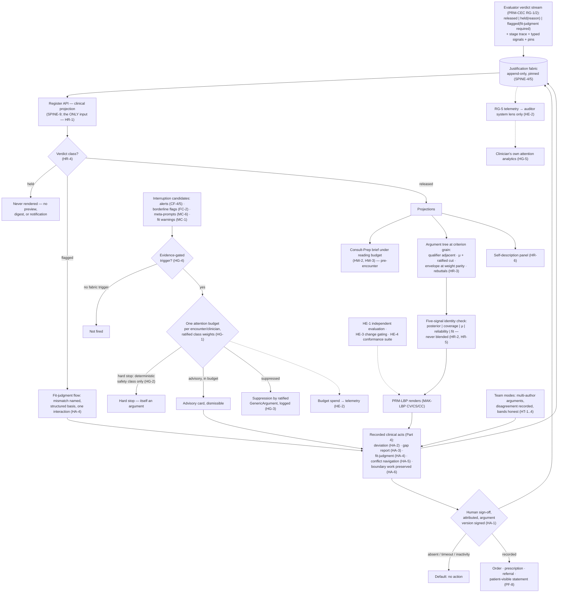

# Primer HDC — The Clinician Face

> **Justification fabric.** The butterfly's body is the justification fabric plus the deterministic evaluator: *every claim is an argument; only arithmetic releases.* One argument object renders in three registers to three faces; the fabric is append-only, hash-chained, and version-pinned so any decision replays bit-for-bit. Two wings paint the body — the **Left Wing** (MAK-LWC) senses in degrees, the **Right Wing** (MAK-RWC) judges in systems — and their coordination is the flight (MAK-MIF). The host is **MAK-FFC v1.1**: no primer here relaxes a corpus MUST. Regulatory content is governed by **REG-POSTURE v1.0** via **MAK-ANT** — assume inclusion, glass-box as the design target, ASSUME-REG-001..007 open pending counsel. This primer's position: *the face where the fabric concentrates into one clinician's judgment — a projection of evaluator-released arguments and nothing else, five signals never blended, one attention budget, and a fail-closed human sign-off that is itself the last argument in the chain.*

## HDC1. What this is

The Clinician Face is the surface where the system's whole evidentiary machinery concentrates into one register for one judgment — the clinician's — and it performs no inference of its own (MAK-HDC Thesis). Its unit is the *projection*: every clinician-facing display element is a read of evaluator-released argument objects — verdicts with stage traces per MAK-CEC RG-1/2 — through the fabric's register API (MAK-FFC SPINE-9), and nothing else feeds a widget (HR-1, the one-surface law). Its rendering grammar is the five-signal identity: posterior, coverage, μ, reliability, and fit each keep a distinct visual and verbal identity from schema to pixel (HR-2, the face-level end of MAK-CEC OM-3). Its writes are few and all evidentiary: sign-off (HA-1), deviation (HA-2), gap report (HA-3), fit-judgment (HA-4), conflict navigation (HA-5), and preserved boundary work (HA-6) — each a fabric entry with the argument version it acted on. Its economy is one attention budget across four interruption classes (HG-1). The face law that no source corpus stated and this one does: the clinician's sign-off is fail-closed because the regulatory posture demands it (REG-KEEP-003), not because an exemption is being protected (MAK-HDC Part 1). It consolidates rather than invents: 22 source requirements from three hosts are carried, consolidated, or elevated (MAK-HDC Part 7 map); genuinely new face law is marked *(new)* in the corpus.

*Trace: MAK-HDC Thesis; Part 0; Part 1 "What consolidation adds" (i)–(iv); HR-1, HR-2, HA-1..6, HG-1; Part 7 consolidation map; MAK-CEC RG-1/2, OM-3; MAK-FFC SPINE-9.*

## HDC2. Scope

**In scope** — the six MAK-HDC requirement families this primer owns:

- **HW-1..5 · Workflow placement.** Blake placement law — capture before, synthesis before, read-and-decide inside; in-consultation input confined to the Part 4 acts (HW-1); the Consult-Prep brief as a server-side fabric projection with every element one interaction from its argument (HW-2); the ratified reading budget as a conformance property (HW-3); handover and referral narratives generated from the fabric, marked derived, clinician text preserved distinctly (HW-4); offline-first graceful degradation inside XC-3 and MX-3 (HW-5).
- **HR-1..6 · The rendering law.** One-surface law (HR-1); five signals as five identities, design-review checklist item (HR-2); full argument tree within one interaction at criterion grain — qualifier adjacent, graded degree with ratified cut, envelope at weight parity, confirmed rebuttals reachable (HR-3); verdict fidelity — released as content, flagged only via the fit-judgment flow, held never, stage traces on demand (HR-4); accessibility floor and prohibited-vocabulary lint over all five identities (HR-5); the self-description panel reachable from every screen (HR-6).
- **HA-1..6 · Clinical acts.** Fail-closed human sign-off as the terminal act, no action on timeout or implied consent (HA-1); Deviation Composer friction law with borderline flags offering it directly (HA-2); Gap Reporter one interaction from any screen, deviate-versus-gap rendered plainly (HA-3); the fit-judgment flow for flagged content (HA-4); conflict navigation as a recorded meta-rational act, never pre-ranked (HA-5); boundary work captured, not corrected (HA-6).
- **HG-1..5 · Attention governance.** One attention budget across alerts, borderline flags, meta-prompts, fit warnings with ratified class weights; new class or weight change is an MS-4 governed change (HG-1); hard stops reserved for the deterministic safety class (HG-2); governed suppression, meta-prompt rules under the same machinery (HG-3); interruptions evidence-gated by construction (HG-4); the clinician's own interruption analytics visible to the clinician (HG-5).
- **HT-1..4 · Team modes.** Multi-author actual arguments, disagreement recorded as disagreement — CF-6 elevated to MUST (HT-1); type-2 community bands rendered honestly in team views (HT-2); per-author positions preserved in group conflict navigation (HT-3); asynchronous team modes with identity, register, and pins on every contribution (HT-4).
- **HE-1..4 · Evaluation and telemetry.** The consolidated independent-evaluator program including the five-signal conflation rate (HE-1); face telemetry under the unified MAK-CEC RG-5 schema, auditor system lens only (HE-2); rendering changes ship behind an HE-1-class measure (HE-3); the face conformance suite as a release gate producing conformity-file artifacts (HE-4).

**Out of scope** — each exclusion names its owner:

- Pixel- and keystroke-level specification — the identity sheet, screen set, component library, interaction laws, density, embedding, and accessibility mechanics (PRM-LBP / MAK-LBP CV/CS/CC/CI/CA). This primer states what the face does; MAK-LBP LLM-contract rule 2 states that the UI realizes it. Where this primer states a rendering duty, PRM-LBP says how it looks (MAK-HDC LLM-contract rule 4).
- Producing verdicts, stage traces, thresholds, envelope checks, or ConflictRecords (PRM-CEC — MAK-CEC RG-1/2; the face consumes and never evaluates, OM-5). The five-signal type discipline in schema and transport (PRM-CEC, OM-3); this primer owns only its survival at the pixel (HR-2).
- Graded chips' mathematics, codebooks, borderline-band geometry, and the CWW render path (PRM-LWC — MAK-LWC FC-1/2, FS-4/5, FE-6); this primer renders through the single render path and never implements private linguistic logic (PRM-LWC LWC5 emit row to PRM-HDC).
- Envelope computation, GapReport and ConflictRecord object schemas, the MS-4 remodeling lifecycle, and the trading zones (PRM-RWC — MAK-RWC MS-1/2/4/5/8); the ratification workbenches for suppression and meta-prompt rules (PRM-ABC — MAK-ABC AG-1; MAK-LBP Part 7 row HG-3 agrees: "governance out of UI scope").
- Verbatim authoritative content — fragments, dose bounds, signing, the five-gate chain (Primer D §D1–D2); this face renders a gate-passing fragment *inside the argument's claim* (Primer D §D10 fabric binding) and never alters its text (SPINE-3).
- Any LLM output reaching this face at runtime — narration, composer, critic, sentinel, elicitation (Primer L §L2, posture-gated at L5); offline and review LLM assistance (Primer K §K2). See findings HDC-F3 and HDC-F4 for the edges.
- Patient-side capture that feeds Consult-Prep — intake instruments, self-monitoring, consent (PRM-TXC / PRM-PRB; MAK-FFC PF-1/PF-4); the patient register rendering of the same argument (PRM-TXC, PF-2).
- Auditor-face analytics, league tables, peer comparisons, individual performance surfacing (PRM-ABC; MAK-FFC AF-8; MAK-RWC MA-6) — prohibited inside this face by the consolidated anti-requirements.
- Regulatory classification, intended-purpose wording, and the J-tier build manifests (PRM-ANT; PRM-CEC RG-6; MAK-J3 GPP-5/9). This primer records the J-tier consequence for what the face may render; it does not argue the classification.
- Frontend technology defaults (MAK-LEG L1-1..3 — PRM-LEG); only MAK-LEG L1-2's bindings bear on this primer, and they cite MAK-LBP CA-5/CA-2, not HDC directly.

*Trace: MAK-HDC Part 0 scope and LLM-contract rules 2–4; MAK-LBP LLM-contract rules 2–4 and Part 7 realization map; MAK-CEC OM-3/OM-5; Primer D §D2/§D10; Primer L §L2; Primer K §K2; MAK-LEG L1-2; Appendix A census.*

## HDC3. Breadth and depth of content required

Thirty requirements (HW 5 · HR 6 · HA 6 · HG 5 · HT 4 · HE 4; 23 MUST, 6 SHOULD, 1 MAY — MAK-HDC Appendix A). The face's component set is the union of three host inventories, which the consolidation map makes explicit: the host's six (Consult-Prep Composer, Differential Board, Deviation Composer, Alert Governor, MDT / Group Mode, Argument Renderer — MAK-FFC Part 3), the left wing's five (Graded Criterion Chips, Borderline Flag, Applicability Column, Trend Descriptors, MDT Band View — MAK-LWC Part 3), and the right wing's six (Envelope Renderer, Gap Reporter, Conflict Workbench, Self-Description Panel, Boundary-Work Capture, Meta-Prompt Governor — MAK-RWC Part 3) — seventeen components before de-duplication, which MAK-LBP's screen set (ten screens) and component library (ten components) realize.

To be real rather than a demo the face needs: **one clinical pathway's verdict stream** flowing from PRM-CEC with stage traces (MAK-FFC P1 gate: "Consult-Prep, Differential Board, Deviation Composer, Alert Governor on one clinical pathway"); **a ratified encounter-class taxonomy** carrying a reading budget per class (HW-3) and an interruption budget with class weights per class and per clinician (HG-1) — neither number exists in any corpus (see HDC8 tolerances); **the fabric's register API live** (SPINE-9 — a SHOULD in the host, but HR-1 makes it this face's only lawful input); **the six act schemas** — sign-off, Deviation (SPINE-8's object: reason taxonomy + free text + severity + identity), GapReport (MS-2), fit-judgment (MS-7), conflict navigation (MS-7), boundary-work capture (MS-3) — as fabric entries; and **an independent evaluator panel** (HE-1: never co-designers, n materially greater than the design panel) with instruments for measures the literature has not built — μ-misreading rate, five-signal conflation rate, gap-report elicitation quality (MAK-HDC Part 8 "face-relevant research plane": "remain unmeasured in the literature; HE-1 produces the first evidence"; MAK-CEC open agenda "cross-signal display research").

Depth constraint from the corpus: adding a wing's signal class never grows the default brief beyond budget — signals compete for the budget through governed layout, not accretion (HW-3); a new interruption class or raised weight is an MS-4 change, never a product decision (HG-1). The face's growth axis is therefore governance, not surface area.

*Trace: MAK-HDC Appendix A; Part 7 consolidation map; MAK-FFC Part 3 component inventory and Part 7 phased plan P1; MAK-LWC/RWC Part 3 inventories; MAK-LBP Parts 3–4; HW-3, HG-1, HE-1; MAK-HDC Part 8 research plane.*

## HDC4. Building in a silo

Most of the face is buildable against fixtures because HR-1 makes its only input a typed stream of verdicts:

- **Projection reader over a verdict fixture** (HR-1, HR-4). Input mockable: a fixture ledger of RG-2 verdict records — released, held, flagged — with stage traces and pins in MAK-CEC's shape. Stub: the SPINE-9 register API (owned by `cdss-fabric`, Arch §14.2) as a local read-only store with the same projection semantics. The one-surface negative tests (HE-4) are writable now: any code path that reads anything but the projection fails the build.
- **Five-signal identity conformance** (HR-2, HR-5). Fixture arguments carrying all five OM-3 types; a lint that rejects any render, aggregate, or copy string blending two types, and the prohibited-vocabulary list (MAK-LWC FC-6 extended). The identity sheet itself is PRM-LBP's artifact (MAK-LBP CV-1); the face-side test consumes it.
- **Act writers** (HA-1..6). Six write paths producing fabric entries against a local append-only store with the argument version pinned; unit tests: no act without an identity, no sign-off without an argument version, no release action after timeout (HA-1), a case can carry both deviation and gap (HA-3), fit-judgment recorded in the same interaction pattern as deviation (HA-4).
- **Attention budget governor** (HG-1..4). A pure function over (encounter class, clinician, fired interruptions by class, class weights) → admit / defer / suppress-with-log; fixtures for each of the four classes; property: budget spend is itself a telemetry record (HE-4). Suppression and meta-prompt rules enter as GenericArgument fixtures (HG-3) — the ratification workflow is PRM-ABC's.
- **Consult-Prep composer** (HW-2, HW-3). A server-side assembler from fixture fabric content under a reading-budget parameter; property: overflow collapses behind drill-down, default brief never exceeds budget for its class.
- **Conformance suite v1** (HE-4): one-surface negative tests, verdict-fidelity tests (held unreachable in every projection including digest and notification), signal-identity lint, act-record completeness, budget enforcement — all runnable against fixtures.

What cannot be built in the silo: the live verdict stream and its stage traces (PRM-CEC), the actual rendering (PRM-LBP), suppression-rule ratification (PRM-ABC AG-1), envelope and ConflictRecord content (PRM-RWC), graded chips' μ and cuts (PRM-LWC), Consult-Prep's patient-side inputs (PRM-TXC/PRB), EHR embedding against a real host (CDS Hooks / SMART sandbox is the nearest silo substitute — HDC8), and the HE-1 evaluation itself, which needs independent clinicians. These are HDC5 edges.

*Trace: HR-1, HR-2, HR-4, HR-5, HA-1..6, HG-1..4, HW-2/3, HE-4; MAK-CEC RG-2; MAK-FFC SPINE-9; Arch §14.2 `cdss-fabric`.*

## HDC5. Folding it in

Integration contract — consumes and emits, with the counterpart edge named and checked.

**Consumes**

| From | What | Interface | Counterpart edge |
|---|---|---|---|
| PRM-CEC (engine plane → evaluator) | Verdicts — released / held / flagged — with complete stage traces, typed signals, pins, and for flagged releases the recorded fit-judgment (RG-2); ConflictRecords materialized at stage 4 | Read through the fabric's register API, never from engines (HR-1; OM-5) | MAK-CEC RG-1 "sole path by which any draft becomes face-visible content"; RG-2 "stage trace is argument content, renderable per register"; anti-requirement "never a second gate … preview path". **Checked:** consistent — HR-1 is RG-1/OM-5 restated at the face |
| `cdss-fabric` (MAK-FFC spine) | Register-scoped projection of ActualArguments, Deviations, GenericArgument versions; self-description content (envelopes, confirmed findings, drift notices, remodeling ledger) | SPINE-9 read API; CONTRACT-ARG-1 schema (Primer A §A10, proposed) | MAK-FFC SPINE-9 is SHOULD; HR-1 makes it this face's only lawful input. **Checked:** no conflict — a SHOULD in the host becomes load-bearing here; recorded as RECON-HDC-002 |
| Primer D (content registry) | Gate-passing verbatim fragments rendered inside the argument's claim, with source id/version, effective/review dates, tier {E,V} | D8 fragment schema + decision-log record; render decision arrives as part of the released claim | Primer D §D10 "renders verbatim inside the argument's claim, cited and tiered"; §D8 tier `{"E":"E1","V":"V1"}`. **Checked:** HR-3 requires backing "evidence tier" reachable (MAK-FFC Argument Renderer row); D's E/V tier vocabulary and the fabric's evidence-tier backing are not the same field — see finding HDC-F2 |
| PRM-LWC (linguistic layer) | Register words and μ graphics via the single CWW render path; graded degree + ratified cut per criterion; borderline-flag arguments with distance-to-threshold; ratified trend descriptors | Decoder call per FE-6; flag as fabric argument (FC-2) | PRM-LWC LWC5 emit row "Face renderers call the decoder; they never implement private linguistic logic". **Checked:** consistent with HR-3/HA-2 |
| PRM-RWC (meta-rational spine) | Envelope status in / out(attrs) / unknown per recommendation; applicable confirmed rebuttals and drift notices; ConflictRecords with both envelopes | Fabric entries (MS-1, MS-5, MS-6); fit status inside the RG-2 verdict | MAK-RWC MC-1 weight parity, MC-4 no default ordering, MC-5 one-interaction rebuttals. **Checked:** carried into HR-3, HA-4, HA-5 without relaxation |
| PRM-TXC / PRM-PRB (patient face) | Intake, monitoring, history as data-plane grounds feeding Consult-Prep (HW-2) | FHIR QuestionnaireResponse / Observation via the data plane (SPINE-4) | MAK-FFC PF-1 "before the encounter"; CF-1 pairing. **Checked:** consistent |
| PRM-ABC (auditor face) | Ratified suppression and meta-prompt rules as versioned GenericArguments; class-weight changes (HG-1/HG-3) | Knowledge-plane artifacts, versioned, pinned | MAK-ABC AG-1 "every workbench is an instance of the one lifecycle … no side door"; MAK-LBP Part 7 row HG-3. **Checked:** consistent — this face applies rules, never ratifies them |
| Primer L (runtime LLM, L5 only) | Narration (L3), what-if narration (L9), composed documents (L7), critic challenge (L6), sentinel flag pairs (L5), unconfirmed chips (L1/L8) | Every output consumed by a deterministic check or human confirmation before render (Primer L §L1) | Primer L §L10 "narration … is a register renderer … bound by SPINE-3"; L6/L5 produce interruptions. **Checked:** narration is HR-1-compatible only if it renders *from* the released argument; L6 critic and L5 sentinel are interruption classes HG-1 does not name — see findings HDC-F3 and HDC-F4 |
| Primer K | Nothing at runtime (Primer K §K2 out-of-scope: "any LLM output reaching an encounter"). | — | **Checked:** consistent; K's outputs reach this face only as ratified knowledge-plane content |

**Emits**

| To | What | Interface | Counterpart edge |
|---|---|---|---|
| `cdss-fabric` (MAK-FFC spine) | Sign-off records with argument version signed (HA-1); Deviation objects (HA-2; SPINE-8); GapReports (HA-3; MS-2); fit-judgments (HA-4; MS-7); conflict navigations with reasons and residue (HA-5; MS-7); boundary-work text preserved verbatim (HA-6; MS-3); multi-author contributions with identity (HT-1/3) | Append-only, attributed, version-pinned fabric entries (SPINE-4/5; MS-7) | MAK-RWC MS-7 "meta-rational acts are ledgered with the same discipline as rational ones"; MAK-FFC SPINE-8 Deviation object. **Checked:** consistent; the fabric ledger has no numbered register — GAP-HDC-002 |
| PRM-CEC (evaluator, flagged path) | The recorded human fit-judgment the evaluator's flagged verdict requires before out-of-envelope content proceeds (HA-4) | RG-2 flagged-verdict record completion | MAK-CEC RG-2 "for flagged releases, the recorded human fit-judgment (MS-7)"; MAK-RWC ME-1. **Checked:** consistent |
| PRM-ABC (auditor read model) | Act records for the argument-pair review (MAK-ABC AL-2); compliance states derived from sign-off, deviation, and fit-judgment records (MAK-RWC MA-4 "never from retrospective inference"); interruption-budget spend by class, act latencies, drill-down depth, reading-budget adherence — system lens only (HE-2) | Fabric entries + RG-5 telemetry schema | MAK-ABC AL-2 extends AF-2 with the stage trace this face renders; MA-6 no individual performance management. **Checked:** consistent — HE-2 forbids exactly what MA-6 forbids |
| PRM-LBP (clinician UI) | The lawful specification the UI renders: which projections exist, which acts exist, the reading and interruption budgets, the verdict-fidelity rules, the identity separation checklist | MAK-LBP realization map (Part 7) — 30/30 HDC IDs realized | MAK-LBP Appendix B check 6 "every MAK-HDC requirement appears in the Part 7 realization map". **Checked:** complete; HW-4 realized as an "export affordance" only — see HDC-F3 |
| PRM-TXC (patient face) | Nothing directly; diagnostic claims reach patients only after this face's sign-off names the releasing clinician (HA-1 → MAK-FFC PF-8) | Sign-off record → patient-register projection | MAK-FFC PF-8 "after clinician release … with the releasing clinician identified". **Checked:** HA-1 is PF-8's precondition |
| Primer I / PRM-CEC firewall | HE-1 measures (justified-override rate, alert PPV, time-in-consult delta, comprehension, μ-misreading, borderline-flag utility, gap-report rate and disposition, reliance calibration, conflict-navigation quality, five-signal conflation rate); HE-4 conformance results as conformity-file artifacts | Firewalled evaluation (MAK-CEC RG-3); R7 property rows; conformity file | MAK-FFC CF-7, MAK-LWC FC-7, MAK-RWC MC-7 consolidated in HE-1; MAK-CEC RG-8 pattern in HE-4. **Checked:** consistent |
| EHR hosts (delivery vectors) | CDS Hooks cards and SMART-app surfaces carrying argument links, envelope badge, identity styling — never a naked recommendation string | CDS Hooks 2.0.1 STU2 R2 cards; SMART App Launch | MAK-LBP CA-2 embedding floor ("reduced to a link-out rather than a lawless summary"). **Checked:** consistent with HR-1/HR-3 under embedding |

**Fabric binding (MAK-FFC).** This component supplies no Toulmin slot of the argument that reaches it — it is the consumer of released claims (SPINE-1/3/9) and the author of the fabric's *terminal and meta-rational entries*: the sign-off that turns a released claim into an act (HA-1; REG-KEEP-003), the Deviation object at every recommendation point (HA-2; SPINE-8), and the GapReport, fit-judgment, and conflict-navigation records MS-7 ledgers (HA-3..5). It never evaluates, never releases, never re-weights argument content per audience (SPINE-3, SPINE-7). Coordination doctrine: MAK-MIF beat 1 (the borderline patient — borderline flag and fit-judgment flow, one interaction each: HA-2, HA-4), beat 2 (the full translation loop — boundary work captured, encoding traces reachable: HA-6, HR-3), beat 4 (conflict with a metric — side-by-side conflicts, navigation recorded: HA-5), beat 5 (disagreement held, not averaged — multi-author capture, band views, dissent preserved: HT-1..3), per MAK-HDC's own beat map.

*Trace: MAK-HDC Part 7 MAK-MIF beat map; HR-1, HR-3, HA-1..6, HT-1..3, HE-1/2/4; MAK-FFC SPINE-1/3/4/5/7/8/9, PF-8; MAK-CEC RG-1/2/3/5/8, OM-5; MAK-RWC MS-7, MA-4/6; MAK-ABC AL-2, AG-1; MAK-LBP Part 7, CA-2; Primer D §D8/§D10; Primer L §L2/§L10; Primer K §K2.*

## HDC6. Definition of done

Per release, all of:

1. **One-surface negative tests green** — no code path renders anything not read from the register-scoped projection of evaluator-released arguments; face-local caches provably rebuild from the ledger (HR-1; HE-4; MAK-CEC RG-8 single-gate pattern).
2. **Verdict fidelity proven** — held content unreachable in every projection, preview, digest, and notification; flagged content reachable only through the fit-judgment flow; stage trace renderable on demand for every displayed verdict (HR-4; HA-4; HE-4).
3. **Five identities, zero blends** — the signal-identity lint passes over every render, aggregate, and copy string; the design-review checklist item is signed for the release; no confidence/probability vocabulary attaches to μ or fit (HR-2; HR-5; MAK-LWC FC-3/FC-6 carried).
4. **One interaction, measured** — from any displayed recommendation: full argument tree at criterion grain with qualifier adjacent, graded degree with ratified cut, envelope at weight parity, and applicable confirmed rebuttals — each within one interaction; interaction-count regression blocks release (HR-3; HA-2/3 one-interaction bounds; MAK-LBP CI-1 is the UI-side measurement).
5. **Sign-off fail-closed** — no order, prescription, referral, or patient-visible diagnostic statement exists without an attributed sign-off record carrying the argument version; fault-injection of timeout, inactivity, focus loss, and navigation produces no action (HA-1; REG-KEEP-003; MAK-FFC PF-8).
6. **Act-record completeness** — every deviation, gap report, fit-judgment, conflict navigation, and preserved boundary-work item writes exactly one attributed, version-pinned fabric entry; a case fixture carrying both deviation and gap passes; no act path adds friction, nagging, or follow-up burden (HA-2..6; HE-4).
7. **One budget enforced** — interruptions of all four classes draw from the per-encounter, per-clinician budget with ratified class weights; budget spend appears in telemetry; a fixture introducing a fifth class without an MS-4 record fails (HG-1; HG-4; HE-4).
8. **Hard stops and suppression governed** — every hard-stop firing and every suppression is an argument in the fabric backed by a ratified GenericArgument; silent unlogged suppression is impossible by test (HG-2; HG-3; MAK-FFC CF-4/CF-5 carried).
9. **Brief within budget** — Consult-Prep renders within its encounter class's ratified reading budget with overflow behind drill-down; adding a signal class to fixtures does not grow the default brief (HW-2; HW-3); in-consultation input paths are exactly the Part 4 acts plus free-text annotation (HW-1; HA-6).
10. **Offline discipline** — Consult-Prep, drill-down, and all acts complete with connectivity withdrawn; deferred sync preserves pins and identity; stale envelope or rebuttal state never renders without its age (HW-5; MAK-FFC XC-3; MAK-RWC MX-3; MAK-LBP CI-5).
11. **Team modes honest** — a multi-author fixture with residual disagreement never renders as unanimous; per-author stances on a ConflictRecord are attributable; community bands render as bands (HT-1; HT-3; HT-2 where FE-7 artifacts exist).
12. **Evaluation and telemetry** — HE-1 measures collected by independent evaluators for any release touching a face; telemetry flows under the RG-5 schema to the auditor system lens only; any rendering change that could alter comprehension or reliance carries an HE-1-class measure or ratified proxy (HE-1; HE-2; HE-3); conformance results filed as conformity-file artifacts (HE-4).

*Trace: MAK-HDC HW-1..5, HR-1..5, HA-1..6, HG-1..4, HT-1..3, HE-1..4; MAK-FFC CF-4/5, PF-8, XC-3; MAK-RWC MX-3; MAK-CEC RG-5/8; MAK-LBP CI-1/CI-5; REG-KEEP-003.*

## HDC7. Internal operations diagram



## HDC8. Execution layer

**Executable contract from the corpus.** MAK-HDC gives no code-level contract of its own; its executable substrate is the verdict pipeline it consumes, which MAK-CEC states verbatim (Part 7, "The release pipeline") — reproduced here as the face's input contract:

```text
// The single gate (RG-1). Deterministic, versioned, learned-parameter-free.
evaluate(draft: ActualArgumentDraft, template: GenericArgument) →
  stage 1  COMPLETENESS   all six Toulmin elements present; qualifier typed (OM-3);
                          rebuttal slot reconciled against confirmed findings (AD-2)     [SPINE-2]
  stage 2  THRESHOLDS     graded applicability → ratified template thresholds (FS-8);
                          method metadata honoured (FE-2)                                 [MAK-LWC]
  stage 3  ENVELOPE       grounds vs warrant envelope; in / out(attrs) / unknown (ME-1)   [MAK-RWC]
  stage 4  CONFLICTS      co-applicable template conclusions reconciled into
                          ConflictRecords — materialized, never resolved (SPINE-6/MS-5)
  stage 5  VERDICT        released | held(reason) | flagged(fit-judgment required)
                          — every verdict ledgered with its full stage trace (RG-2)
// No stage is skippable; no component other than this evaluator produces verdicts.
```

The face renders exactly these three verdict classes (HR-4) and the stage trace on demand (HR-4; MAK-LBP CC-5 Stage-Trace Peek).

**Proposed act-record contract (CONTRACT-ACT-1 — proposed, not corpus text; for `cdss-spine` ratification).** The corpus names the acts and their properties (HA-1..6; SPINE-8; MS-2/3/7) but gives no schema. Seed:

```text
interface ClinicalAct {
  kind:      signoff | deviation | gap_report | fit_judgment | conflict_navigation | boundary_work
  actor:     Identity                       // attributed, clinical authority (HA-1; SPINE-8)
  argument:  {actual_argument_ref, generic_argument_version, verdict_ref, pins: VersionSet}  // version signed (HA-1)
  locus?:    ElementRef                     // element in focus, pre-populated (HA-3; MS-2)
  reason?:   {taxonomy_code, severity_tier} // structured (HA-2; SPINE-8)
  basis?:    FitJudgmentBasis               // fit_judgment only (HA-4; MS-7)
  free_text?: string                        // preserved verbatim, never validated away (HA-6; MS-3)
  boundary_context?: {threshold_ref, distance} // auto-attached on flagged borderline (HA-2; FC-2)
  authors?:  Identity[] with per-author stance and residual dissent   // team modes (HT-1, HT-3)
  written:   append-only fabric entry, hash-chained (SPINE-4)
}
// Invariant: absent a signoff act, release state is NO ACTION — never inferred from timeout, inactivity, or consent (HA-1).
```

**First executable properties (seed for the I registry, face subset — HE-4):** (1) ∀ rendered element: its data lineage terminates in an RG-2 verdict record read via the projection API; no other source (HR-1). (2) ∀ projection incl. digest/notification/preview: held verdicts are absent (HR-4). (3) ∀ flagged verdict: it renders only through the fit-judgment flow, and proceeding writes exactly one fit-judgment act (HA-4). (4) ∀ displayed claim: argument tree, qualifier, envelope status, applicable rebuttals each reachable in ≤ 1 interaction under pointer and keyboard (HR-3). (5) ∀ render/aggregate/copy string: at most one OM-3 signal type per element; zero prohibited-vocabulary hits (HR-2, HR-5). (6) ∀ encounter: with no signoff act, no release-class action exists after any elapsed time or focus event (HA-1). (7) ∀ encounter: fired interruptions × class weight ≤ ratified budget; every fired interruption cites a fabric trigger (HG-1, HG-4). (8) ∀ act: exactly one fabric entry, attributed, argument version pinned; replay from pins reproduces the rendered state the actor saw (HA-1..6; SPINE-5). (9) ∀ encounter class: default Consult-Prep length ≤ ratified reading budget (HW-3). (10) ∀ multi-author fixture with recorded dissent: no unanimous rendering (HT-1).

**Asset library** — every requirement family maps to at least one row. Seeded from MAK-HDC Part 8 (verified 2026-09-01) and MAK-ELSM v1.1 (verified 2026-08-29); **load-bearing rows re-verified this run, 2026-09-02**, method stated; carried rows say so. Verdict vocabulary per MAK-ELSM: ADOPT / ADAPT / STUDY / BUILD / WATCH; **DEAD-REPLACE** for superseded assets.

| Asset | Type | Satisfies | Licence | Currency | Verified (method · date) | Verdict |
|---|---|---|---|---|---|---|
| [HL7 CDS Hooks](https://cds-hooks.hl7.org/) — specification (ELSM-H01) | standard (HL7 IG) | HW-1 (read-and-decide placement in third-party EHRs), HR-1 under embedding | HL7 | **v2.0.1 · STU 2 Release 2**, FHIR R4; Standard for Trial Use — "changes … infrequent and tightly constrained" | cds-hooks.hl7.org fetched · web · 2026-09-02 | **ADOPT (standard); WATCH — STU, not normative; card content must carry argument links per MAK-LBP CA-2** |
| [cds-hooks/sandbox](https://github.com/cds-hooks/sandbox) (ELSM-H01) | tool (integration sandbox) | HW-1 silo substitute for EHR host; HE-4 embedding-floor tests | Apache-2.0 | 40★ · 475 commits · not archived · open PRs/issues | GitHub repo page fetched · 2026-09-02 (matches MAK-HDC Part 8: 40★, Apache-2.0, active) | **ADOPT (test harness)** |
| [smart-on-fhir/client-js](https://github.com/smart-on-fhir/client-js) (ELSM-H02) | library (JS) | HW-1, HW-5 (face-as-SMART-app, EHR-embedded auth + FHIR access) | Apache-2.0 (per MAK-HDC Part 8; not shown on releases page) | **v2.6.3** (26 Sep; releases page shows no year — MAK-HDC dates it Sep 2025); v2.6.1/2.6.2 19 Sep | GitHub releases page fetched · 2026-09-02 | **ADOPT — ~12 months since last release; confirm maintenance before L3 dependency freeze (RECON-HDC-003)** |
| [openmrs/openmrs-esm-core](https://github.com/openmrs/openmrs-esm-core) (ELSM-H03) | framework (ESM microfrontends) | HW-5 (low-resource host candidate; design mine), XC-3 | open source (MPL-2.0 per OpenMRS convention — **verify**) | **v10.0.0** released "09 Jun" (GitHub omits year for current-year releases → 2026, consistent with MAK-HDC "Jun 2026"); v9.0.2 4 Mar | GitHub releases + tag page fetched · 2026-09-02 | **STUDY / ADAPT (host integration)** |
| [hapifhir/hapi-fhir-jpaserver-starter](https://github.com/hapifhir/hapi-fhir-jpaserver-starter) (ELSM-20) | server (FHIR data plane; CDS Hooks + Clinical Reasoning capability) | HW-2 server side; HA-1..6 data-plane bindings (Provenance, AuditEvent — SPINE-4); HR-1 projection substrate | Apache-2.0 | 524★ · **image/v8.10.0-1 · 26 May 2026** · 1,150 commits · active | GitHub repo page fetched · 2026-09-02 | **ADOPT (carried verdict from MAK-ELSM, currency confirmed this run)** |
| [cqframework/cqf-ruler](https://github.com/cqframework/cqf-ruler) (ELSM-03) | reference CDS server | (would have served HW-1 CDS Hooks serving) | Apache-2.0 | functionality migrating upstream | carried from MAK-ELSM §01 (verified 2026-08-29) | **DEAD-REPLACE → hapi-fhir-jpaserver-starter (its CDS Hooks capability confirmed this run)** |
| [cqframework/clinical-reasoning](https://github.com/cqframework/clinical-reasoning) (ELSM-02) | library ($apply, PlanDefinition) | HW-2 server-side synthesis inputs (GenericArgument execution behind the verdicts) | Apache-2.0 | v4.7.0 May 2026 | carried forward from MAK-ELSM §01 (verified 2026-08-29) and MAK-HDC Part 8 | **ADOPT (carried)** |
| [google/android-fhir](https://github.com/google/android-fhir) (ELSM-04) · [opensrp/fhircore](https://github.com/opensrp/fhircore) (ELSM-05) | SDK + product (offline-first FHIR, WHO SMART on Android) | HW-5, HT-4 (low-resource, asynchronous team modes), XC-3 | Apache-2.0 | 599★ active · v2.2.2 Nov 2025, 136 releases | carried forward from MAK-ELSM §01 (verified 2026-08-29); MAK-HDC Part 8 "carried" | **ADOPT / STUDY (carried); device-integration excluded in J-3 builds (MAK-ELSM §08)** |
| [W3C WCAG 2.2](https://www.w3.org/TR/WCAG22/) | standard | HR-5 accessibility floor (MAK-LBP CA-3 "WCAG 2.2 AA equivalent") | W3C | **W3C Recommendation, 12 December 2024** — current | w3.org/TR/WCAG22 fetched · 2026-09-02 | **ADOPT** |
| Primer D signed content registry (`cdss-registry`, ELSM-11 class) | build (spine) | HR-3 backing tier/source reachable; verbatim fragment inside claim (SPINE-3) | — | Primer D §D8 schema; enters L2 | Primer D §D8/§D10 read this run | **ADOPT (internal contract); ADAPT — tier vocabulary mapping per HDC-F2** |
| MAK-CEC verdict stream + RG-5 telemetry schema (PRM-CEC) | build (engine plane) | HR-1, HR-4 (input contract); HE-2 (telemetry schema) | — | MAK-CEC Part 7 verbatim above | MAK-CEC v1.1 read this run | **ADOPT (internal contract)** |
| MAK-LBP identity sheet + component library (`cdss-ui-clinician`, PRM-LBP) | build (UI) | HR-2, HR-5 realization; every HW/HR/HA/HG/HT/HE row's rendering | — | MAK-LBP v1.0 (26 reqs; Part 7 map complete) | MAK-LBP read this run; Arch §14.2 row | **ADOPT (internal) — the X5 edge; CA-5 suite = repo CI acceptance** |
| **Argument renderer (clinical register) at criterion grain with five identities** | build | HR-2, HR-3, HR-4, HR-6 | — | no precedent (MAK-HDC Part 8 build list; MAK-ELSM §02 "justification fabric … no precedent") | MAK-HDC Part 8; MAK-ELSM §02/§06 | **BUILD** |
| **Consult-Prep composer as fabric projection under a reading budget** | build (server-side) | HW-2, HW-3, HW-4 (deterministic narrative generation from codebook vocabulary) | — | Blake pattern as design precedent only (MAK-FFC Part 3) | MAK-HDC Part 8 build list | **BUILD** |
| **Deviation Composer · Gap Reporter · fit-judgment flow · conflict navigation · boundary-work capture (act writers)** | build | HA-2, HA-3, HA-4, HA-5, HA-6 | — | no precedent (MAK-ELSM §02 "no GAAM implementation … no deviation ledger") | MAK-HDC Part 8; MAK-ELSM §02 ELSM-10/11 | **BUILD** |
| **Sign-off record + fail-closed release control** | build | HA-1; MAK-FFC PF-8 | — | REG-KEEP-003 as spec; no OSS precedent for argument-version-signed sign-off | MAK-HDC Part 8 build list (stated within the acts); this primer HDC4 | **BUILD** |
| **Unified attention budget governor (four classes, ratified weights) + governed suppression application** | build | HG-1, HG-2, HG-3, HG-4, HG-5 | — | no precedent; Alert Governor pattern from MAK-FFC Part 3 | MAK-HDC Part 8 build list | **BUILD** |
| **Multi-author argument capture + band view + async team mode** | build | HT-1, HT-2 (band rendering via PRM-LWC decoder), HT-3, HT-4 | — | no precedent; Stranieri MDT 2016 as design source | MAK-FFC Part 3 MDT / Group Mode row; MAK-LWC MDT Band View | **BUILD (band mathematics = PRM-LWC FE-7, gated)** |
| **Face conformance suite (one-surface negative tests, verdict fidelity, identity lint, act completeness, budget enforcement)** | build (CI) | HE-4; HR-1/2/4/5; HG-1 | — | pattern = MAK-CEC RG-8 / MAK-J3 GPP-CONF; MAK-LBP CA-5 is the UI twin | MAK-HDC HE-4; MAK-CEC RG-8 | **BUILD** |
| **HE-1 evaluation instruments (μ-misreading, five-signal conflation, gap-report elicitation, reliance calibration)** | build (research instrument) | HE-1, HE-3; MAK-LBP CV-5 conflation kit | — | "unmeasured in the literature; HE-1 produces the first evidence" (MAK-HDC Part 8) | MAK-HDC Part 8 research plane; MAK-CEC open agenda | **BUILD — inside the evaluation firewall (RG-3)** |
| Spitzer et al. 2026 (npj Digital Medicine RCT, N=2,020 assessments) · Bayor et al. 2025 (JMIR 27:e63733) | research | HR-3 rendering direction; HG failure catalogue | — | cited by MAK-HDC Part 1/8, MAK-ELSM §05 | carried from MAK-HDC Part 8 / MAK-ELSM §05 (not re-fetched) | **STUDY (design evidence)** |

**Coverage check (P5):** HW-1..5 → CDS Hooks spec + sandbox, client-js, openmrs-esm-core, HAPI starter, clinical-reasoning, android-fhir/fhircore, Consult-Prep composer build. HR-1..6 → verdict stream contract (PRM-CEC), Primer D registry, MAK-LBP identity sheet, WCAG 2.2, argument renderer build, conformance suite build. HA-1..6 → act writers build, sign-off build, HAPI starter (Provenance/AuditEvent bindings). HG-1..5 → attention budget governor build, conformance suite build. HT-1..4 → team-mode build, android-fhir/fhircore (asynchronous low-resource), PRM-LWC band view. HE-1..4 → HE-1 instruments build, RG-5 telemetry schema, conformance suite build, Spitzer/Bayor research. **30/30 covered; 8 rows are BUILD; 6 assets fetched directly this run; 4 rows carried forward with their source verification dates; 1 DEAD-REPLACE.**

**Sourcing landmines carried forward, with this run's status:** MAK-HDC Part 8 "methodology hedge carried" — no precedent for the acts, the budget, or the rendering law: *unchanged, reconfirmed by absence in MAK-ELSM §02/§06*. cqf-ruler legacy (MAK-ELSM): *DEAD-REPLACE recorded; HAPI starter's CDS Hooks capability confirmed this run*. New this run: CDS Hooks is STU, not normative — card semantics may still move (WATCH); client-js has had no release in ~12 months (RECON-HDC-003); OpenMRS release-year ambiguity on GitHub resolved by convention, not by an explicit date string — re-check before dependency.

**Proposed tolerances (flag: clinical sign-off and ratification required; none is a corpus number unless cited):** Consult-Prep core read ≤ 90 s per encounter class (MAK-LBP CS-1 states "a ninety-second core read" — a UI-corpus number; the encounter-class taxonomy behind it is unratified); interruption budget default ≤ 3 weighted advisory interruptions per standard encounter, hard stops outside the budget by definition (HG-2); one interaction = one pointer action or one keystroke sequence from the element in focus; μ-misreading ceiling ≤ 10% (carried from PRM-LWC LWC8 proposal); five-signal conflation rate ceiling ≤ 5% on the MAK-LBP CV-5 kit; time-to-deviate p50 ≤ 20 s from flag to committed act; HE-1 panel n ≥ 3 × design-panel size (operationalizing CF-7's "materially greater").

*Trace: MAK-CEC Part 7 pipeline (verbatim); HA-1..6, HR-1..6, HW-1..5, HG-1..5, HT-1..4, HE-1..4; MAK-HDC Part 8; MAK-ELSM §01/§02/§06/§08; MAK-LBP CS-1, CV-5, CA-2/3/5, CC-5; external verification as tabled, 2026-09-02.*

## Production topology annotation

*Per Architecture §11 and §14.5 (MET-1, Proposed), row "Clinician face + UI (MAK-HDC/LBP)":* **L2 — v0 (verbatim render surface); L3 — one-surface law; L4 — team modes; L5 — full.** Reconciled with the fabric row of the same table (L2 "evaluator wrap live") and with MAK-FFC's phasing (P1 · Clinician MVP: Consult-Prep, Differential Board, Deviation Composer, Alert Governor on one pathway, exit CF-7 evaluation): the L2 v0 surface may render only what the L2 evaluator wrap has released — a verbatim Primer D fragment inside a released claim — so HR-1 holds from first pixel even though the *negative-test suite* that proves it (HE-4) gates from L3, which is also where Arch §11.2 places the first externally showable prototype and where MAK-FFC P1's CF-7/HE-1 evaluation must run before pilot. Team modes (HT-1..4) enter at L4 beside multi-domain content. HE-3 change-gating applies from L3 onward. Gate dependencies (MAK-ANT AN-7): all L2–L3 face work runs synthetic-only pre-GATE-002 (REG-KEEP-004); HE-1 evaluation with real clinicians on identifiable data waits on GATE-002; sign-off as a legal act on live patients is L4 limited release under Tier-5 monitoring. See finding HDC-F1. **J-tier:** the face ships in every tier; in J-1/J-2 it renders all five identities; in the J-3 (GPP) build it renders only the whitelisted claim types with qualifier type `applicability` (MAK-J3 GPP-5/GPP-9), so the posterior and coverage identities — and μ over patient data — are structurally absent from that artifact (MAK-CEC RG-6); the Deviation Composer and deviation ledger remain enabled (GPP-16). Tier labels follow FORK-REG-001.

## Register topology annotation

*Per Architecture §12 (R1–R28) and §14.3 (R29–R30, Proposed):* **Owns:** none — the face writes into the fabric and into registers other repos own. **Writes:** R13 Acceptance Telemetry Register ("clinician actions" — accept/modify/reject at L2 v0; the six HDC acts, act latencies, drill-down depth, budget spend, and reading-budget adherence as the HE-2 stream — see GAP-HDC-001); R1 (version stamps on every projection and every act — the pin-set the actor saw); R3 (SBOM of `cdss-ui-clinician` per build); R7 (face property subset, HDC8); R18 Contract-Violation Log (runtime assertions of HR-1/HR-4 — a violation is an I-5 event); R25 (this run's verification table as build evidence). **Reads:** R1, R11 Decision Log (Primer D render/block outcomes joined to the claim), R14 (lockfile pins), R19 (posture — which identities the current build may render), R30 (regulatory posture for conformity-file artifacts, HE-4). **Gap proposals:** GAP-HDC-001 — R13 is described as "accept/modify/reject" telemetry at L2 v0; the HE-2 stream (interruption-budget spend by class, act latencies, drill-down distributions, reading-budget adherence) needs either an R13 schema extension under the RG-5 unified schema or a new register; PRM-LWC filed the sibling gap (GAP-LWC-001) for drift telemetry — propose one ruling covering both. GAP-HDC-002 — the justification fabric ledger (SPINE-4), into which every HA act is written, has no numbered register in §12.2/§14.3 (`cdss-fabric` is a repo; "ledger substrate per DEC-04"); propose R31 Justification Fabric Ledger (append-only, owner `cdss-fabric`, opens L2 with the evaluator wrap), or a ruling that the fabric is the substrate *of* registers and is exempt from RoR enumeration. GAP-HDC-003 — the server-side face gateway (SPINE-9 clinical projection, Consult-Prep composer, attention-budget governor, act writers) has no named repo: Arch §14.2 gives `cdss-ui-clinician` "Labial-Palps component library + clinician face" and `cdss-fabric` "fabric service + compliance projector + deviation machinery"; propose the face gateway lives in `cdss-fabric` as the clinical register projection service (SPINE-9 says register-scoped projections, not per-face databases) with the UI repo strictly a consumer — operator ruling.

<!-- ECOSYSTEM-V2-BLOCK: HDC v1.0 -->
## HDC9. Build Execution Extension (Ecosystem v2.0)

**1. Mini-North-Star.** WHAT: the clinical-register projection reader (SPINE-9 client, one-surface negative tests), the six act writers emitting CONTRACT-ACT-1 fabric entries with fail-closed sign-off, the attention-budget governor, the Consult-Prep composer under a reading budget, and the face conformance suite (HE-4). WHY: the surface where the fabric concentrates into one clinician's judgment without ever diluting judgment into compliance (MAK-HDC Part 1 doctrine sentence). Endpoint: v0 at L2, one-surface law proven at L3, team modes at L4 (Production topology annotation). Derives from and cites SPINE §13.1; MAK-FFC CF-1..8; MAK-HDC HW/HR/HA/HG/HT/HE.

**2. Doctrine classification.** Projection, verdict-class filtering, identity lint, budget arithmetic, act-record writing, and conformance checks are arithmetic; nothing here proposes and nothing here releases — release is PRM-CEC's evaluator, and the *act* of releasing to the world is the human's (HA-1). Any LLM on this surface is Primer L's and is posture-gated (L5).

**3. Scoped recon register.**
| ID | Verify | Tag |
|---|---|---|
| RECON-HDC-001 | RG-2 verdict record schema and CONTRACT-ARG-1 (ActualArgument) pinned in `cdss-spine`; stage trace renderable per register | E:REPO (cdss-spine tag); E:DOC MAK-CEC RG-2 |
| RECON-HDC-002 | SPINE-9 register API exists in `cdss-fabric` with a clinical-register projection and rebuildable derived caches — HR-1 depends on a host SHOULD | E:REPO cdss-fabric; E:DOC MAK-FFC SPINE-9 |
| RECON-HDC-003 | CDS Hooks target version (2.0.1 STU2 R2) and smart-on-fhir/client-js maintenance status (~12 months since v2.6.3); EHR host list for the L3 pilot | E:WEB required at ticket start (this run: 2026-09-02) |
| RECON-HDC-004 | Mapping from Primer D §D8 tier `{E,V}` to the fabric's backing evidence tier rendered under HR-3 — finding HDC-F2 | E:DOC D8, MAK-FFC Part 2 argument table; E:REPO cdss-spine |
| RECON-HDC-005 | Arch §14.5 L2 "verbatim render surface" reconciled with HR-1 from first release — finding HDC-F1; DEC ruling recorded | E:DOC Arch §14.5; MET-2 queue |
| RECON-HDC-006 | Encounter-class taxonomy and its reading budget (HW-3) and interruption budget with class weights (HG-1) — ratification owner and trading zone (MAK-RWC MS-8) named | E:USER; E:DOC MAK-RWC MS-4/MS-8 |
| RECON-HDC-007 | CONTRACT-ACT-1 accepted into `cdss-spine`, or the fabric's existing Deviation schema (Arch §14.2) extended to the six act kinds | E:REPO cdss-spine; E:DOC MAK-FFC SPINE-8, MAK-RWC MS-7 |

**4. Work register seed (L2→L3-equivalent; schema per master v2 Phase 6; estimates ranged with confidence).**
```yaml
TASK-HDC-001:
  story: STORY-HDC-001 (a clinician sees only what the evaluator released, and can see why)
  component: face-projection
  title: Clinical-register projection reader with verdict-class filtering and one-surface negative tests
  purpose_chain: {what: "SPINE-9 client + HR-4 filter + rebuildable derived cache + negative-test suite", why: "HR-1 is the face law; a second data path kills SPINE-1 at the last mile", endpoint_ref: "L3 exit: one-surface negative tests green; SPINE-NS WHY"}
  evidence_refs: [E:DOC MAK-HDC HR-1, HR-4; MAK-CEC RG-1/2, OM-5; RECON-HDC-001, RECON-HDC-002]
  definition_of_ready: ["RG-2 verdict fixture set (released/held/flagged) available", "SPINE-9 endpoint or local stub with identical projection semantics"]
  steps: ["read projection by encounter", "filter: held → absent everywhere; flagged → fit-judgment path only; released → content", "stage-trace on demand", "derived cache rebuild from ledger", "negative tests: every non-projection read path fails the build"]
  test_plan: "fixture run: zero held items reachable in any projection incl. digest/notification; flagged items render only via fit-judgment flow; cache drop + rebuild byte-identical"
  observability: "R18 contract-violation assertion on any non-projection read; counter face.projection.reads with pins"
  definition_of_done: ["negative tests green in CI", "HDC8 properties 1–3 pass", "pins stamped on every projection (R1)"]
  estimate: {optimistic: 4d, likely: 7d, pessimistic: 12d, confidence: medium}
  depends_on: []
```
```yaml
TASK-HDC-002:
  story: STORY-HDC-002 (every clinical act leaves a record the fabric can replay)
  component: face-acts
  title: Six act writers with fail-closed sign-off (CONTRACT-ACT-1)
  purpose_chain: {what: "sign-off, deviation, gap, fit-judgment, conflict navigation, boundary-work writers → fabric entries", why: "REG-KEEP-003 makes sign-off the terminal act; MS-7 makes every meta-rational act evidence", endpoint_ref: "L3 exit: act-record completeness; no action on timeout under fault injection"}
  evidence_refs: [E:DOC MAK-HDC HA-1..6; MAK-FFC SPINE-8, PF-8; MAK-RWC MS-2/3/7; RECON-HDC-007]
  definition_of_ready: ["CONTRACT-ACT-1 accepted or Deviation schema extension pinned", "fabric append endpoint or local append-only stub"]
  steps: ["actor + argument-version binding", "deviation: taxonomy + free text + severity + auditor preview payload", "gap: locus pre-population; deviate-vs-gap both allowed on one case", "fit-judgment: structured basis, same pattern as deviation", "conflict navigation: choice + reasons + residue; per-author stances", "boundary work: verbatim preservation, no validation gate", "sign-off: no-action default; fault injection for timeout/inactivity/focus loss"]
  test_plan: "each act writes exactly one attributed pinned entry; both-acts fixture passes; fault injection yields zero release-class actions; friction audit: one interaction to open each act"
  observability: "act latency histograms (time-to-deviate, time-to-gap) to R13; alert on any act lacking argument version"
  definition_of_done: ["HDC8 properties 6, 8, 10 pass", "replay from pins reproduces the rendered state acted upon"]
  estimate: {optimistic: 5d, likely: 8d, pessimistic: 14d, confidence: medium}
  depends_on: [TASK-HDC-001]
```
```yaml
TASK-HDC-003:
  story: STORY-HDC-003 (four interruption classes, one budget, nothing silent)
  component: face-attention
  title: Attention-budget governor with evidence gating and governed suppression application
  purpose_chain: {what: "pure function (encounter class, clinician, fired-by-class, ratified weights) → admit | defer | suppress-with-log; hard-stop class reserved", why: "governed separately, four classes exhaust the clinician; HG-1 makes them one economy", endpoint_ref: "L3 exit: budget enforcement in HE-4 suite; spend visible in telemetry"}
  evidence_refs: [E:DOC MAK-HDC HG-1..5; MAK-FFC CF-4/CF-5; MAK-RWC MC-6, MS-4; RECON-HDC-006]
  definition_of_ready: ["provisional encounter-class taxonomy and weights recorded as proposed tolerances (HDC8), ratification owner named"]
  steps: ["class registry: alert | borderline flag | meta-prompt | fit warning; adding a class requires an MS-4 record reference", "evidence-gate check: fabric trigger required (threshold band, applicable rebuttal, envelope mismatch, live conflict)", "budget arithmetic per encounter and clinician", "suppression by ratified GenericArgument only; every suppression logged", "hard stop: deterministic safety class only, itself a fabric argument", "spend → R13 telemetry; clinician's own view feed (HG-5)"]
  test_plan: "fifth-class fixture without MS-4 ref fails; scheduled/engagement trigger fixture never fires; silent suppression impossible; hard stop outside budget"
  observability: "budget spend by class per encounter; suppression log completeness check"
  definition_of_done: ["HDC8 property 7 passes", "HE-4 budget-enforcement test green"]
  estimate: {optimistic: 3d, likely: 5d, pessimistic: 9d, confidence: low}
  depends_on: [TASK-HDC-001]
```

**5. Orchestration hooks.** `WF-HDC-1` face release: build → identity lint + prohibited-vocabulary lint → HE-4 conformance suite (one-surface negative tests, verdict fidelity, act completeness, budget enforcement) → MAK-LBP CA-5 UI suite (same repo CI) → HE-3 gate (rendering change touching identities/layout/interruptions requires an HE-1-class measure reference or ratified proxy) → manifest + SBOM emit (idempotent by artifact hash; retry 1; timeout 30m). Emits `EVT-HDC-1 face.release`, consumed by WF-SPINE-1. `EVT-HDC-2 face.act.recorded` (per CONTRACT-ACT-1 entry; at-least-once; dedup by entry hash), consumed by PRM-ABC's read model and R13.

**6. Observer checkpoint spec.** At L2 exit: v0 renders only evaluator-wrapped released claims — evidenced by TASK-HDC-001 negative-test CI artifacts; R13 accept/modify/reject stream flowing. At L3 exit: HE-4 suite green; fault-injection evidence that no release-class action occurs without sign-off; HE-1 evaluation protocol pre-registered with independent evaluators (gate dependency GATE-002 for identifiable data). At L4: team-mode fixtures (HT-1/HT-3) green; first MS-4 record for an interruption-class or weight change. Admissible: R1, R7, R13, R18, R25, CI artifacts, conformity-file artifacts (HE-4).

**7. Implementer Contract binding.** Tickets execute under IMPL (SPINE §13.2). Component HALT triggers: any ticket that would (a) feed a widget from engine output, a pre-verdict cache, a summary job, or any path other than the register projection → HALT: HR-1 / MAK-CEC OM-5; (b) act, order, refer, or release on timeout, inactivity, default focus, or implied consent → HALT: HA-1 / REG-KEEP-003; (c) blend two of posterior, coverage, μ, reliability, fit into one score, gauge, or colour scale, or use confidence vocabulary for μ or fit → HALT: HR-2 / HR-5 / MAK-CEC OM-3; (d) add an interruption class or raise a class weight without an MS-4 record → HALT: HG-1; (e) render held or pre-verdict content in any digest, preview, or notification → HALT: HR-4; (f) surface league tables, deviation rates, or peer comparisons in this face, or attach metric consequence to deviation, gap, or fit-judgment → HALT: consolidated anti-requirements / MAK-RWC MA-6; (g) place an LLM output on this surface without Primer L's posture precondition (R19) → HALT: DOR-FAIL (Primer L §L9 RECON-L-001).

**8. Gaps and register proposals.** GAP-HDC-001 (HE-2 telemetry register home — R13 extension or new register, jointly with GAP-LWC-001), GAP-HDC-002 (fabric ledger unnumbered — propose R31 or exemption ruling), GAP-HDC-003 (face gateway repo home — propose `cdss-fabric` clinical projection service) as in the Register topology annotation. GAP-HDC-004 — Arch §14.4 namespace law gains UIC for `cdss-ui-clinician` but no prefix for face law distinct from the UI; TASK-HDC-n used here as interim; propose either HDC joins the PFX set or face-law tickets file under UIC with an `hdc:` scope tag — operator ruling. GAP-HDC-005 — CONTRACT-ACT-1 (HDC8) needs a `cdss-spine` home beside CONTRACT-ARG-1 and the Deviation object schema (Arch §14.2 "new shared contracts").

<!-- MET-1 METAMORPHOSIS & HARDENING ANNEX — APPENDED 2026-09-02. Pure append per X1 discipline. Status: Proposed (ratification via MET-2 decision queue); Hardening state: PENDING in R29 — nothing here is HARDENED. -->
## HDC10. Metamorphosis & Hardening Annex — fabric binding + validity findings + updated execution block

**Fabric binding (MAK-FFC).** Restated from HDC5: this component supplies no Toulmin slot; it consumes released claims through the register projection (SPINE-1/3/9) and authors the fabric's terminal and meta-rational entries — sign-off (HA-1; REG-KEEP-003), Deviation (HA-2; SPINE-8), GapReport, fit-judgment, conflict navigation (HA-3..5; MS-7). Never evaluates, never releases, never re-weights (SPINE-3/7). Coordination doctrine: MAK-MIF beats 1, 2, 4, 5.

**Validity findings (P4 — recorded, not resolved; host law governs; operator decides).**

- **HDC-F1 · Level alignment (P4-e, Architecture ↔ MAK-HDC).** Arch §14.5 enters the clinician face at L2 as a "verbatim render surface" and names "one-surface law" as the L3 capability. HR-1 is a MUST with no phase qualifier: every clinician-facing display element is a projection of evaluator-released argument objects. Read literally, a L2 surface fed directly by Primer D's gate chain (Primer D §D5 Stage 1: "registry serves a single domain to the display layer") would violate HR-1 from the first release. Not a contradiction once the same table's fabric row is read alongside (L2 "evaluator wrap live"): the L2 surface renders D fragments *inside released claims*, and what enters at L3 is the negative-test proof (HE-4), not the law. Default proposal: amend the §14.5 row wording to "v0 (verbatim render inside released claims)" at L2 and "one-surface negative tests gating (HE-4)" at L3; the Production topology annotation builds this position. *Cites: Arch §14.5 rows "Clinician face + UI" and "Fabric"; MAK-HDC HR-1, HE-4; Primer D §D5.*
- **HDC-F2 · Tier vocabulary at the D edge (P4-e, MAK-HDC ↔ Primer D).** HR-3 (carrying MAK-FFC CF-2 and the Argument Renderer row "drill-down from claim to backing to evidence tier") requires the backing's evidence tier reachable within one interaction. Primer D §D8's fragment carries `tier: {"E":"E1","V":"V1"}` — an evidence/verification pair specific to the registry's gate policy (`tier_ok if E == "E1"; V == "V1"`) — while MAK-FFC's Backing slot is "the tiered evidence library entry behind the warrant (evidence tier, source, currency)". Two tier vocabularies meet at this face; D's decision-log record carries gate pass/fail but no rendered tier field. Not a contradiction — D's E-tier plausibly *is* the evidence tier — but the mapping is unstated and the face must render one thing. Default proposal: the fabric's Backing slot carries D's `tier.E` as the evidence tier and `tier.V` as a verification annotation, both rendered under the reliability-adjacent identity vocabulary only if ratified (HR-2 forbids a new blended "tier" glyph); RECON-HDC-004. *Cites: MAK-HDC HR-3; MAK-FFC Part 2 argument table (Backing), Part 3 Argument Renderer row; Primer D §D8 fragment schema and Rego skeleton.*
- **HDC-F3 · Narrative generation split (P4-e, MAK-HDC ↔ Primer L; MAK-LBP).** HW-4 (SHOULD) has handover and referral narratives "generate from the fabric in the clinical register, marked as derived content, using ratified trend and codebook vocabulary" with no posture gate. Primer L's L7 provenance-locked composer and L3 trace narration are Class 4+ capabilities requiring the higher-class posture and staged at L5 (Primer L §L5, §L10). MAK-LBP realizes HW-4 as an "Argument View export affordance; generated-content marking". Two generation paths therefore exist: (i) deterministic, template-and-codebook narrative from the fabric (a register renderer bound by SPINE-3, posture-neutral, satisfies HW-4 at L3–L4), and (ii) LLM composition (Primer L L7, posture-gated, L5). Not a contradiction, but HW-4 must not be read as licensing (ii) early, and (ii) must not be read as the only way to satisfy (i). Default proposal: HW-4 is realized by path (i) from L3; Primer L L7/L3 are additive at L5 and remain bound by HR-1 (they render from the released argument, never beside it) and SPINE-3 invariance. *Cites: MAK-HDC HW-4, HR-1; Primer L §L2 (L3, L7), §L5, §L10 clarification 2; MAK-LBP Part 7 row HW-4; MAK-FFC SPINE-3, CF-8.*
- **HDC-F4 · Interruption classes not in the budget (P4-e, MAK-HDC ↔ Primer L).** HG-1 names four interruption classes — alerts, borderline flags, meta-prompts, fit warnings — and makes introducing a new class a governed change (MS-4). Primer L's L6 premature-closure critic ("at most one challenge") and L5 contradiction sentinel ("typed flag pair … routed to the clinician") are clinician-facing interruptions of neither class, and Primer L governs them by per-capability reversal triggers (R19), not by the attention budget. No contradiction today (L is L5-only), but at L5 the two doctrines collide unless L6/L5 are admitted as classes through MS-4 with ratified weights, or folded into meta-prompts (MC-6's evidence-gating — "envelope mismatch, active applicable rebuttal, or live conflict" — does not name a critic's unexplored alternative as a trigger). Default proposal: L6 and L5 outputs enter HG-1 as a fifth class "runtime-LLM prompt", evidence-gated by construction (HG-4: the critic must cite a library row; the sentinel a statement pair), admitted only by an MS-4 record at the L5 stage gate. *Cites: MAK-HDC HG-1, HG-4; MAK-RWC MC-6, MS-4; Primer L §L2 (L5, L6), §L5, §L9 hooks.*
- **HDC-F5 · HW-1's act list versus Part 4 (P4-i, MAK-HDC internal).** HW-1 confines in-consultation input to "confirmation, sign-off, deviation, gap report, and conflict navigation — the recorded clinical acts of Part 4 — and nothing else." Part 4 also contains the fit-judgment (HA-4) and boundary-work capture (HA-6), neither named in HW-1's list; MAK-LBP CI-2 lists "confirm, sign off, deviate, report gap, judge fit, navigate conflict — plus free-text annotation." Default proposal: read HW-1's enumeration as a gloss on "the recorded clinical acts of Part 4", which governs; no DEVIATION is needed to render the fit-judgment sheet or a free-text well in-consultation. Flag for an additive erratum in MAK-HDC v1.1. *Cites: MAK-HDC HW-1, HA-4, HA-6; MAK-LBP CI-2, CC-4.*
- **HDC-F6 · Unnamed elevations in the consolidation map (P4-i, MAK-HDC ↔ MAK-FFC/LWC/RWC).** MAK-HDC Appendix B check 6 permits elevation when "named", and names one (CF-6 SHOULD → HT-1 MUST). Four further source SHOULD/MAY requirements are carried into MUST carriers under the disposition "carried" or "consolidated": CF-8 (MAY) → HW-4 (SHOULD); FC-4 (SHOULD) → HW-2 (MUST, "ratified trend descriptors"); MC-4 (SHOULD) → HA-5 (MUST); MC-6 (SHOULD) → HG-1 (MUST) and HG-3 (MUST). None relaxes a source requirement, so host law is intact; but the map understates the face's strictness. Default proposal: build to the HDC carrier level (stricter), and propose an additive erratum labelling these rows "elevated" per the map's own convention. *Cites: MAK-HDC Part 7 consolidation map and Appendix B check 6; MAK-FFC CF-8; MAK-LWC FC-4; MAK-RWC MC-4, MC-6.*
- **HDC-F7 · Register homes (P4-i).** HE-2's telemetry stream and the fabric ledger itself have no numbered register (GAP-HDC-001, GAP-HDC-002); the face gateway has no named repo (GAP-HDC-003). *Cites: Arch §12.2, §14.2, §14.3; MAK-HDC HE-2; MAK-FFC SPINE-4/9.*
- **HDC-F8 · External currency (P4-x).** CDS Hooks 2.0.1 is STU 2 Release 2 — trial use, not normative; adopted as the delivery vector with WATCH. smart-on-fhir/client-js v2.6.3 is ~12 months old (RECON-HDC-003). openmrs-esm-core v10.0.0's release year is inferred from GitHub's current-year display convention, consistent with MAK-HDC Part 8 but not an explicit date string. WCAG 2.2 is a current W3C Recommendation (12 Dec 2024). HAPI FHIR jpaserver-starter v8.10.0 (May 2026) confirms MAK-ELSM's ADOPT and supplies the CDS Hooks serving capability that retires cqf-ruler (DEAD-REPLACE).

| Execution field | Content |
|---|---|
| Execution purpose | Run the Clinician Face as the fabric's terminal surface — a projection of evaluator-released arguments with five unblended identities, one attention budget, six recorded acts, and a fail-closed human sign-off; never an evaluator, never a release, never a side channel |
| Inputs / prerequisites | RG-2 verdict stream with stage traces via the SPINE-9 clinical projection (RECON-HDC-001/002); CONTRACT-ARG-1 and CONTRACT-ACT-1 pins (RECON-HDC-007); MAK-LBP identity sheet compiled into `cdss-ui-clinician`; ratified encounter-class taxonomy with reading and interruption budgets (RECON-HDC-006); ratified suppression/meta-prompt GenericArguments (from PRM-ABC AG-1); patient-side grounds for Consult-Prep (PRM-TXC/PRB); posture register R19 for which identities the build may render |
| Steps | 1 read clinical projection → 2 filter by verdict class (held absent; flagged → fit-judgment path; released → content) → 3 assemble Consult-Prep under reading budget (HW-2/3) → 4 render argument at criterion grain with five identities (HR-2/3) via PRM-LBP → 5 gate interruptions on fabric triggers and one budget (HG-1/4); apply governed suppression (HG-3); reserve hard stops (HG-2) → 6 record acts as fabric entries (HA-2..6; HT-1/3) → 7 sign-off attributed with argument version, or no action (HA-1) → 8 telemetry under RG-5 to auditor system lens (HE-2); clinician's own lens (HG-5) → 9 HE-4 suite and HE-1/HE-3 measures gate the next release |
| Tools / repos / environments | `cdss-ui-clinician` (MAK-LBP library + face; CA-5 suite as CI acceptance — Arch §14.2); face gateway proposed in `cdss-fabric` (GAP-HDC-003); delivery vectors CDS Hooks 2.0.1 STU2 R2 + SMART App Launch (client-js) + OpenMRS ESM host (STUDY); HAPI FHIR jpaserver-starter data plane; android-fhir/fhircore for the low-resource profile; synthetic-only pre-GATE-002 |
| Outputs & acceptance | Rendered projections; CONTRACT-ACT-1 fabric entries; R13 telemetry; conformity-file artifacts (HE-4). Acceptance = HDC6 items 1–12 **plus** fabric-replay test (the state the actor saw reproduces from the pins on the act) and the HA-1 refusal test (no release-class action exists without a sign-off record) |
| Dependencies / handoffs | Upstream: PRM-CEC verdicts, `cdss-fabric` projection, Primer D fragments (via released claims), PRM-LWC decoder, PRM-RWC envelopes/conflicts, PRM-ABC ratified rules, PRM-TXC/PRB grounds. Downstream: PRM-LBP rendering, PRM-ABC read model (AL-2 stage traces, MA-4 states), PRM-TXC patient register after sign-off (PF-8), Primer I/RG-3 firewall for HE-1, EHR hosts. Contract changes are spine PRs that visibly break this consumer |
| Evidence to collect | R1 pins on every projection and act; R13 act latencies and budget spend; R18 contract violations (HR-1/HR-4 assertions); R25 this run's verification table; HE-1 measures (firewalled); HE-4 conformity-file artifacts; MS-4 records for any interruption-class change |
| Failure handling / rollback | Projection unavailable → face renders cached-with-age content only, marks staleness (MAK-LBP CI-5), acts queue for deferred sync (HW-5), no release-class action until sign-off commits online or per ratified offline sign-off policy; identity-lint or one-surface violation → release blocked (HE-4); interruption budget exhausted → advisory classes defer, hard stops unaffected (HG-2); rollback = redeploy prior lockfile pin (R14) — acts already written remain pinned to the arguments they signed |
| Ownership & status | Repo: `cdss-ui-clinician` (face + UI) with gateway home under ruling (GAP-HDC-003); component owner [NEEDS DEFINITION]. Status: New (Proposed) — v0 at L2, one-surface proof at L3, team modes at L4 |
| Source & research traceability | MAK-HDC v1.0 Parts 0–8 and Appendices A–B (all 30 IDs); MAK-FFC v1.1 SPINE-1/2/3/4/5/6/7/8/9, CF-1..8, PF-1/8, AF-2/8, EN-5, XC-3; MAK-LWC v1.1 FC-1..7, FE-6/7, FS-4/5; MAK-RWC v1.1 MS-1/2/3/4/5/6/7/8, MC-1..7, MA-4/6, ME-1, MX-3; MAK-CEC v1.1 OM-3/5, RG-1/2/3/5/6/8, AD-2; MAK-LBP v1.0 CV-1/5, CS-1/4/5, CC-2/4/5, CI-1/2/5, CA-2/3/5, Part 7 map; MAK-MIF beats 1/2/4/5; MAK-J3 GPP-5/9/16; MAK-ANT AN-7, carrier map (REG-KEEP-002/003 → HR-1/3, HA-1); MAK-ELSM §01/02/06/08; Primer A §A10 (CONTRACT-ARG-1); Primer D §D2/D5/D8/D10; Primer K §K2; Primer L §L2/L5/L9/L10; Architecture §11.2–11.3, §12.2, §13.3, §14.2–14.6; external verification 2026-09-02 as tabled in HDC8 |

---

## Appendix A — ID census (additive)

Declared by MAK-HDC v1.0 Appendix A: **30**. Mapped in this primer: **30**.

| Family | Declared | Mapped in | Gap |
|---|---|---|---|
| HW-1..5 | 5 | HDC2 in-scope; HDC4 (HW-2/3); HDC5 (HW-2 consume; HW-4 finding F3); HDC6 items 9, 10; HDC8 | none |
| HR-1..6 | 6 | HDC2; HDC4 (HR-1/2/4/5); HDC5 (HR-1/3 consume, HR-2/5 emit to LBP); HDC6 items 1–4; HDC8 | none |
| HA-1..6 | 6 | HDC2; HDC4; HDC5 (emit to fabric); HDC6 items 5, 6; HDC8 (CONTRACT-ACT-1) | none |
| HG-1..5 | 5 | HDC2; HDC4; HDC5 (HG-1/3 consume rules); HDC6 items 7, 8; HDC8; HG-5 in diagram and TASK-HDC-003 | none |
| HT-1..4 | 4 | HDC2; HDC5 (HT-1/3 emit); HDC6 item 11; HDC8 (HT-4 via android-fhir/fhircore row) | none |
| HE-1..4 | 4 | HDC2; HDC4 (HE-4); HDC5 (emit to firewall / ABC); HDC6 item 12; HDC8; WF-HDC-1 (HE-3 gate) | none |

Every ID appears in HDC2 in-scope; every MUST appears in HDC6; every family has at least one HDC8 asset row. Source IDs CF-1..8, FC-1..7, MC-1..7 are cited through MAK-HDC's Part 7 map and never re-minted.

## Appendix B — Self-audit checks (additive) — run 2026-09-02

1. **Section skeleton** — all eleven exemplar sections present in order (HDC1–HDC8, Production topology, Register topology, HDC9, HDC10). **Pass.**
2. **Epigraph** — brief text verbatim, position clause present as the final sentence only. **Pass.**
3. **ID census parity** — 30 declared, 30 mapped (Appendix A). **Pass.**
4. **Scope-out ownership** — every HDC2 exclusion names an owner. **Pass** (10 exclusions, 10 owners).
5. **Trace presence** — every section HDC1–HDC8 ends with a trace line or carries inline IDs. **Pass.**
6. **Asset coverage** — every requirement family has ≥1 HDC8 row; every row has a verification method and date. **Pass** (21 rows; 8 BUILD; 6 fetched this run; 4 carried with source dates; 1 DEAD-REPLACE).
7. **Signal discipline** — nothing in this document renders μ, fit, or reliability as probability or confidence, and no tolerance blends two signals (HR-2 applied to the primer). **Pass** — tolerances use "budget", "ceiling", "rate", "read".
8. **Subordination** — no statement relaxes a MAK-FFC, MAK-LWC, MAK-RWC, or MAK-HDC MUST; findings are recorded, not resolved; elevations noted as stricter builds (HDC-F6). **Pass.**
9. **Cross-doc resolution** — every MAK-FFC, MAK-LWC, MAK-RWC, MAK-CEC, MAK-LBP, MAK-MIF, MAK-J3, MAK-ANT, MAK-ELSM ID cited resolves in its volume; every Primer A/D/K/L section and Architecture § cited exists. **Pass** (checked against staged files).
10. **Additive discipline** — v1.0; no prior text. Change policy states additive-only; regulatory content cited by REG-* ID only, never reproduced. **Pass.**

## Assumptions & confidence

- **Assumed:** Arch §14.5's "verbatim render surface" at L2 is read with the fabric row's "evaluator wrap live" so HR-1 holds from L2 (HDC-F1). *Confidence: medium* — the table is Proposed and the wording invites the looser reading.
- **Assumed:** the face gateway (projection, composer, budget governor, act writers) will be homed in `cdss-fabric` with `cdss-ui-clinician` a strict consumer (GAP-HDC-003). *Confidence: low-medium* — either home is coherent; default stated.
- **Assumed:** Primer D's `tier.E` maps to the fabric's evidence tier (HDC-F2). *Confidence: medium* — plausible from D §D3's "tier assignment" but unstated.
- **Assumed:** Primer L capabilities, when they arrive at L5, will be admitted to HG-1 as a governed class rather than bypassing the budget (HDC-F4). *Confidence: medium* — Primer L's own doctrine (every output through a deterministic check) supports it; nothing in L says so.
- **X8 verdicts:** CDS Hooks spec ADOPT/WATCH *high* (fetched); sandbox ADOPT *high* (fetched, matches MAK-HDC); client-js ADOPT *medium* (release confirmed; maintenance cadence a concern); openmrs-esm-core STUDY/ADAPT *medium* (year inferred, licence not confirmed on page); HAPI starter ADOPT *high* (fetched); WCAG 2.2 ADOPT *high* (fetched); clinical-reasoning, android-fhir, fhircore *medium* — carried from a 4-day-old MAK-ELSM verification, not re-fetched; all BUILD verdicts *high* — MAK-HDC Part 8's and MAK-ELSM §02's absence claims, re-read this run, are consistent and hedged by their stated methodology.
- **Tolerances in HDC8** are proposals flagged for clinical sign-off and MS-4 ratification; the only corpus number among them is MAK-LBP CS-1's ninety-second core read, itself a UI-corpus statement whose encounter-class basis is unratified.
