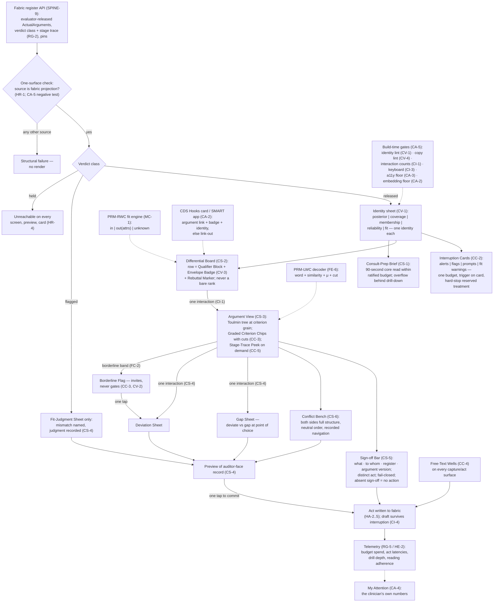

# Primer LBP — The Clinician UI

> **Justification fabric.** The butterfly's body is the justification fabric plus the deterministic evaluator: *every claim is an argument; only arithmetic releases.* One argument object renders in three registers to three faces; the fabric is append-only, hash-chained, and version-pinned so any decision replays bit-for-bit. Two wings paint the body — the **Left Wing** (MAK-LWC) senses in degrees, the **Right Wing** (MAK-RWC) judges in systems — and their coordination is the flight (MAK-MIF). The host is **MAK-FFC v1.1**: no primer here relaxes a corpus MUST. Regulatory content is governed by **REG-POSTURE v1.0** via **MAK-ANT** — assume inclusion, glass-box as the design target, ASSUME-REG-001..007 open pending counsel. This primer's position: *the pixel-and-keystroke realisation of the Clinician Face — a governed component library and screen set that renders evaluator-released argument objects in five non-blending signal identities, costs one interaction per honest act, and computes nothing clinical of its own.*

## LBP1. What this is

The clinician UI is the interaction-level companion to MAK-HDC: the screen set, component library, interaction laws, and density/embedding/accessibility rules that make the Clinician Face survive a nine-minute consultation (MAK-LBP Thesis; Part 0). Its unit is the **governed component** — a member of one library with the *identity sheet* compiled in (CC-1), where the identity sheet is the versioned design artifact that gives each of the five typed signals — posterior, coverage, membership, reliability, fit — exactly one visual identity, one label vocabulary, one placement grammar (CV-1, realising MAK-HDC HR-2 and MAK-CEC OM-3). Its defining property, inherited from the face law it implements: **every widget renders evaluator-released argument objects and nothing else** (MAK-HDC HR-1, the one-surface law; MAK-LBP LLM contract clause 4). The UI performs no inference, computes no envelope, decodes no linguistic term, and produces no verdict — those arrive from the engine plane through the fabric's register API (MAK-FFC SPINE-9; MAK-CEC RG-1/2) and from the wings' render paths (MAK-LWC FE-6; MAK-RWC MC-1). What the UI adds is the doctrine in one sentence: *ninety seconds to the picture, one interaction to the basis, one interaction to disagree, and five signals that never wear each other's clothes* (MAK-LBP Part 1). Visual identity — brand, exact type, colour values — is deliberately unfixed; the laws constrain structure, identity separation, and behaviour (Part 0).

*Trace: MAK-LBP Thesis; Part 0; Part 1; CV-1, CC-1; MAK-HDC HR-1/HR-2; MAK-CEC OM-3, RG-1/2; MAK-FFC SPINE-9.*

## LBP2. Scope

**In scope** — the five MAK-LBP requirement families this primer owns:

- **CV-1..5 · Clinical identity system.** Five signals, five identities, identity sheet as a versioned artifact whose violation is a build failure (CV-1); degree never wears verdict's clothes — chip + term + graphic, never traffic-light, ratified cut shown where release binarised, borderline flag styled as an invitation (CV-2); envelope badge at weight parity, adjacent, before drill-down (CV-3); build-time microcopy lint against the prohibited-vocabulary list (CV-4); the conflation test kit shipped with the identity system and re-run on any identity-sheet change (CV-5).
- **CS-1..6 · Screen set.** Consult-Prep Brief within the ratified reading budget, ninety-second core read, overflow behind drill-down (CS-1); Differential Board rows carrying the three inseparables — qualifier, envelope badge, rebuttal marker — never a bare rank (CS-2); Argument View as the Toulmin tree at criterion grain with encoding traces, guideline citation and version, evidence tier, graded chips with cuts, stage trace on demand (CS-3); the three act sheets under one interaction grammar with auditor-view preview and the deviate-versus-gap distinction at the point of choice (CS-4); the Sign-off Bar as the only release control — distinct, attributable, fail-closed (CS-5); Conflict Bench at full argument structure in ratified neutral order with recorded navigation (CS-6).
- **CC-1..5 · Component library.** One governed library with identity sheet compiled in; lint, identity conformance and accessibility as tested component properties; fork-by-copy is a violation (CC-1); Interruption Cards as the single presentation system for all interruption classes, trigger on the card, hard stops in a reserved treatment (CC-2); Graded Criterion Chip and Borderline Flag implementing MAK-LWC FC-1/2/5 verbatim — flag invites, never gates (CC-3); Free-Text Wells standing on every capture and act surface, never validated away or shrunk for completion metrics (CC-4); Stage-Trace Peek as the five-stage strip shared with the auditor face (CC-5).
- **CI-1..5 · Interaction laws.** The one-interaction law measured and enforced; interaction-count regressions block release (CI-1); in-consultation input confined to the recorded acts plus free-text annotation (CI-2); keyboard-first parity with visible focus (CI-3); state never silently lost or silently acted — drafts survive, navigation warns once, nothing commits on timeout, focus loss, or navigation (CI-4); legible offline degradation — current versus cached with age, queued acts visible, no stale envelope or rebuttal without its age (CI-5).
- **CA-1..5 · Density, embedding, accessibility.** Layered density with layer discipline versioned in the design system (CA-1); the embedding floor — CDS Hooks card or SMART app carries argument link, envelope badge, identity styling, else reduces to a link-out (CA-2); the accessibility floor — WCAG 2.2 AA equivalent, never colour-only, legible at minimum display and 200% scaling, screen-reader complete including chip and badge semantics, functional in the low-resource profile (CA-3); My Attention as the clinician's own lens on budget spend and suppression rules (CA-4); the UI conformance suite as release gate with results as conformity-file artifacts (CA-5).

**Out of scope** — each exclusion names its owner. This primer has no direct border with a 02_ primer: its upward border is the face law (PRM-HDC) and its downward border is the stack (PRM-LEG); every engine-plane and knowledge-plane dependency reaches it through those two or through the wings.

- What the face *does* — workflow placement, rendering law, clinical acts as fabric writes, attention governance, team modes, evaluation programme (PRM-HDC; MAK-HDC HW/HR/HA/HG/HT/HE). This primer realises those duties at the pixel; it never restates or relaxes them. Where MAK-LBP's Part 7 map names an HDC requirement as realised by a screen or component, this primer cites the map, not a new requirement.
- The frontend stack, tokens pipeline, offline scaffolding, CI wiring (PRM-LEG; MAK-LEG L1-1 default, L1-2 binding). MAK-LBP Part 0 states that nothing here presumes a framework; PRM-LEG's L1-2 names this primer's CA-5 and CA-2 as the leg's acceptance tests.
- Linguistic logic of any kind — encoding, decoding, similarity floor, codebooks, membership sketches' mathematics (PRM-LWC; MAK-LWC FS-4/5, FE-6). The Graded Criterion Chip *calls* the CWW render path and renders what it returns; MAK-LWC FE-6 forbids private linguistic logic in renderers.
- Envelope computation, gap-report semantics, conflict-record materialisation, meta-prompt gating rules (PRM-RWC; MAK-RWC MS-1/2/5, ME-1, MC-6). The UI renders the envelope status the fit engine emits (MC-1) and records the acts the clinician takes.
- The verdict, the stage trace, the five-signal types, the single gate (PRM-CEC; MAK-CEC RG-1/2, OM-3, OM-5). The Stage-Trace Peek renders RG-2 content; the one-surface negative tests in CA-5 prove that nothing else reaches a pixel.
- Suppression-rule governance and class-weight ratification (MAK-ABC AG family, per MAK-LBP Part 7 row HG-3; MAK-HDC HG-3). My Attention *surfaces* the rules in force (CA-4); it does not govern them.
- The patient UI and its sibling laws (PRM-PRB; MAK-PRB PC-1, PI-1, PS-4). CC-1 and CI-4 cite PRB sibling laws by ID for symmetry only.
- The auditor face's rendering, including the shared trace strip's auditor-side use (PRM-ABC; MAK-ABC AL-2). CC-5 requires the *same* rendering; PRM-ABC owns its side.
- Evaluation study design and independent-evaluator rules (PRM-HDC; MAK-HDC HE-1/HE-3). This primer ships the CV-5 conflation kit and the CA-5 suite as instruments; it does not run or interpret the studies.
- Regulatory classification, intended-purpose wording, and the treatment of embedded delivery under REG-POSTURE (PRM-ANT; REG-KEEP-002/003 cited by ID only).

*Trace: MAK-LBP Part 0; Part 7 realization map; LLM usage contract clauses 2–4; MAK-LWC FE-6; MAK-HDC Part 0; MAK-LEG L1-2; Appendix A census.*

## LBP3. Breadth and depth of content required

Twenty-six requirements (CV 5 · CS 6 · CC 5 · CI 5 · CA 5; 21 MUST, 5 SHOULD, 0 MAY — MAK-LBP Appendix A), of which the Part 3 screen inventory enumerates **ten screens** (Consult-Prep Brief, Differential Board, Argument View, Deviation Sheet, Gap Sheet, Fit-Judgment Sheet, Conflict Bench, Sign-off Bar, Self-Description Panel, My Attention) and the Part 4 component inventory **ten components** (Graded Criterion Chip, Borderline Flag, Envelope Badge, Qualifier Block, Rebuttal Marker, Stage-Trace Peek, Act Sheets ×3, Sign-off Bar, Interruption Cards, Free-Text Wells). Inventories are informative catalogues; requirements govern (Part 3/4 headnotes). Every screen carries an HDC anchor and every component a source spec in a wing or engine corpus — the UI invents no clinical behaviour.

To be real rather than a demo, the UI needs: **the identity sheet ratified as a versioned artifact** with one identity per signal and the conflation kit run against it before any face release (CV-1, CV-5; MAK-HDC HE-3); **a ratified reading budget per encounter class** — MAK-HDC HW-3 owns the ratification, CS-1 renders within it, and the ninety-second core read is the corpus's stated structure; **the prohibited-vocabulary list** derived from MAK-LWC FS-3 via FC-6 and MAK-HDC HR-5, compiled as a build-time lint (CV-4); **ratified interruption class weights** from MAK-HDC HG-1's governed change process before Interruption Cards can rank (CC-2); **the deterministic evaluator's verdict stream with stage traces** as the sole data source, meaning the UI cannot be demonstrated against engine output, only against released arguments (MAK-HDC HR-1; MAK-CEC RG-2); and **at least one delivery vector integration proven under the embedding floor** — CDS Hooks card or SMART app (CA-2; MAK-HDC Part 8 ELSM-H01/H02). The corpus is explicit that the face's open questions — μ-literacy, five-signal conflation rates, gap-report elicitation quality — are unmeasured in the literature and that MAK-HDC HE-1 produces the first evidence (MAK-HDC Part 8 research plane); the CV-5 kit is therefore an instrument this component must build before the numbers exist.

Depth constraint from the corpus: MAK-LBP is written to be handed to a design-and-build team with visual identity unfixed (Part 0). Every law here is structural — identity separation, interaction count, layer discipline, fail-closed control — and is testable without a brand. That is what lets CA-5 be a CI suite rather than a design review.

*Trace: MAK-LBP Appendix A; Part 3 and Part 4 inventories; Part 0; CV-1, CV-4, CV-5, CS-1, CC-2, CA-2, CA-5; MAK-HDC HW-3, HG-1, HR-1, HE-3, Part 8.*

## LBP4. Building in a silo

Almost the whole UI can be built against fixtures, because MAK-HDC HR-1 defines its only input as evaluator-released argument objects read through the fabric's register API:

- **Component library + identity sheet** (CC-1, CV-1). Inputs mockable: a fixture set of ActualArgument objects with verdicts and stage traces in the MAK-CEC RG-2 shape, one per signal combination (posterior only; posterior + coverage; graded criterion with cut; envelope in / out(attrs) / unknown; reliability stated / unstated). Stub: the `cdss-spine` argument schema (CONTRACT-ARG-1, Proposed per Primer A §A10) and register-render contract (Arch §14.2) — until pinned, validate against a local copy and record the pin as a placeholder. The identity sheet compiles to design tokens; identity conformance is a component test (each signal-rendering component declares which identity it consumes and the test asserts no token from another identity is reachable).
- **Conflation test kit** (CV-5). Standardised screens and tasks as a Storybook-class catalogue plus a scoring protocol; runnable with in-house participants for instrument validation, though the numbers that count are MAK-HDC HE-1's.
- **Microcopy lint** (CV-4). A prose linter with the prohibited-vocabulary list as its rule set, run over the copy deck and component strings in CI. Stub: the ratified list — seed from MAK-LWC FC-6's derivation (FS-3 vocabulary: no confidence/probability language for μ or fit; no "overall score").
- **Screens** (CS-1..6). All ten render from fixtures. The reading-budget check (CS-1) is a static measurement over the rendered brief per encounter-class fixture; the inseparables check (CS-2) is a render test asserting qualifier, badge, and marker exist in each row.
- **Interaction-count harness** (CI-1) and **keyboard parity** (CI-3). Browser-automation tests that count interactions from each fixture recommendation to its argument tree, from each element to each act sheet, from each claim to its rebuttals, under both pointer and keyboard-only operation. Regression = release blocker.
- **State discipline** (CI-4). Draft persistence, navigate-away warning, and the no-commit-on-timeout/focus-loss/navigation properties are unit-testable against a mocked fabric write.
- **Offline legibility** (CI-5). Cache-age rendering and queued-act indicators are testable with a mocked transport.
- **Accessibility floor** (CA-3). Automated WCAG checks per component and per screen; 200% scaling and minimum-display snapshots; screen-reader semantics of chip and badge as ARIA assertions.
- **Embedding floor** (CA-2). CDS Hooks card rendering testable in the public sandbox against a mock CDS service emitting cards with argument links; SMART launch testable against a mock FHIR server.

What cannot be built in the silo: the Graded Criterion Chip's *content* (requires PRM-LWC's decoder via FE-6 — stub returns `{word, similarity, μ, cut}` in the decode-trace shape); envelope status (requires PRM-RWC's fit engine — stub returns MC-1's three states with attributes); the verdict stream itself (PRM-CEC); the sign-off write, act writes, and their auditor-view preview (require `cdss-fabric` and PRM-ABC's rendering of the record); ratified class weights for Interruption Cards (MAK-HDC HG-1 governance); the ratified reading budget (MAK-HDC HW-3); and real EHR host embedding. These are LBP5 edges.

*Trace: MAK-HDC HR-1; MAK-CEC RG-2; CC-1, CV-1, CV-4, CV-5, CS-1, CS-2, CI-1, CI-3, CI-4, CI-5, CA-2, CA-3; MAK-LWC FE-6; MAK-RWC MC-1; Arch §14.2.*

## LBP5. Folding it in

Integration contract — consumes and emits, with the counterpart edge named.

**Consumes**

| From | What | Interface | Counterpart edge |
|---|---|---|---|
| `cdss-fabric` (PRM-CEC evaluator output via the fabric) | Evaluator-released ActualArguments with verdict class and complete stage trace; pinned versions; applicable rebuttals; ConflictRecords | Fabric register API, clinical-register projection (MAK-FFC SPINE-9); read-only | MAK-HDC HR-1 (one surface); MAK-CEC RG-1/2 (verdict + stage trace as argument content). **Checked:** RG-2 makes the stage trace "renderable per register" — CC-5's strip has a source. No mismatch |
| PRM-LWC (CWW render path) | Decoded codebook word, similarity, μ per term, ratified cut, membership sketch data, trend descriptors | Call to the decoder (MAK-LWC FE-6); decode trace already in the argument | MAK-LWC FE-6 "register renderers call it; they never implement private linguistic logic"; PRM-LWC LWC5 emits to "PRM-HDC … via the single CWW render path". **Checked:** PRM-LWC names the face primers, not PRM-LBP, as the caller — see finding LBP-F4 |
| PRM-RWC (fit engine) | Envelope status per recommendation — in / out with named attributes / unknown; self-description content (envelopes, remodelling, drift notices) | Argument content (fit signal typed per OM-3) | MAK-RWC MC-1 (status computed from MS-1 against grounds); MS-6 self-description. **Checked:** MC-1's parity clause is CV-3 verbatim |
| PRM-HDC (face law) | Ratified reading budget per encounter class; ratified interruption class weights; prohibited-vocabulary list; identity checklist | Governance artifacts, versioned | MAK-HDC HW-3, HG-1, HR-5, HR-2. **Checked:** all four are HDC MUSTs with governance located in HDC; LBP renders within them |
| PRM-LEG (stack) | Frontend default, token pipeline, CI wiring, offline scaffolding | MAK-LEG L1-1 default; L1-2 binding | MAK-LEG L1-2 names MAK-LBP CA-5 and CA-2 as acceptance tests. **Checked:** consistent |
| MAK-ANT / REG-POSTURE | REG-KEEP-002 (basis reachable), REG-KEEP-003 (fail-closed sign-off) as interaction obligations | Cited by ID | MAK-LBP frontmatter `governed_by`; MAK-ANT concordance rows for REG-KEEP-002/003 → HR-3, HA-1. **Checked:** resolves |

**Emits**

| To | What | Interface | Counterpart edge |
|---|---|---|---|
| `cdss-fabric` | The recorded acts as fabric writes: sign-off (attributed, argument version signed), deviation, gap report, fit-judgment, conflict navigation (choice + reasons + residue), free-text annotation preserved verbatim | Fabric write API; every act carries identity, register, pins | MAK-HDC HA-1..6 (the acts and their records); MAK-FFC SPINE-8 (Deviation object). **Checked:** CS-4/CS-5/CC-4 supply every field HA-1..6 names |
| PRM-ABC (auditor face) | Nothing directly — the auditor reads the fabric. The UI's *preview* of the auditor view (CS-4) must match PRM-ABC's rendering of the same record | Preview rendered from the same argument pair | MAK-ABC AL-2 (argument pair + stage trace). **Checked:** CC-5 requires the same trace rendering as the auditor face — one shared component, owner to be ruled (finding LBP-F5) |
| Telemetry (MAK-CEC RG-5 schema) | Interruption-budget spend by class, act latencies, drill-down depth, reading-budget adherence, free-text counts, interaction counts | Unified telemetry schema, auditor system lens only | MAK-HDC HE-2; MAK-RWC MS-3 (circumrational telemetry via CC-4). **Checked:** HE-2 forbids individual surfacing without MA-6; CA-4 shows the clinician *their own* numbers, which HG-5 permits |
| PRM-HDC evaluation programme | The CV-5 conflation kit and CA-5 suite results as conformity-file artifacts | CI artifacts | MAK-HDC HE-1 (conflation rate measure), HE-4 (suite). **Checked:** CA-5 is HE-4 "realized as the UI's suite" per MAK-LBP Part 7 |
| EHR hosts | CDS Hooks cards carrying argument link + envelope badge + identity styling, or SMART app launch; link-out where the host cannot carry the laws | CDS Hooks 2.0.1 card; SMART App Launch | MAK-HDC Part 8 ELSM-H01/H02. **Checked:** card schema constraints vs CA-2 — finding LBP-F3 |
| PRM-LEG | The acceptance tests the leg must pass (CA-5, CA-2) | CI suite | MAK-LEG L1-2. **Checked:** consistent |

**Fabric binding (MAK-FFC).** This component supplies no argument slot. It is the clinical-register *projection surface* of complete argument objects (MAK-FFC SPINE-3 — compress or re-order, never add, remove, or reweight) and the *writer of the face's recorded acts* — sign-off, Deviation (SPINE-8), gap report, fit-judgment, conflict navigation — each an ActualArgument or Deviation entering the append-only fabric (SPINE-1, SPINE-4). It never supplies a Claim, Warrant, Qualifier, or Rebuttal; it renders them. Coordination doctrine per MAK-HDC's beat map: MAK-MIF beat 1 (borderline flag + fit-judgment flow, one interaction each — CC-3, CS-4), beat 2 (boundary work captured; encoding traces reachable — CC-4, CS-3), beat 4 (side-by-side conflicts, navigation recorded — CS-6), beat 5 (multi-author states, band views, dissent preserved — CS-6 per MAK-LBP Part 7 HT row).

*Trace: MAK-HDC HR-1, HA-1..6, HE-2/4, Part 7 beat map, Part 8; MAK-CEC RG-1/2/5, OM-3; MAK-LWC FE-6; MAK-RWC MC-1, MS-3/6; MAK-FFC SPINE-1/3/4/8/9; MAK-LEG L1-2; MAK-ABC AL-2; MAK-LBP Part 7.*

## LBP6. Definition of done

Per release, all of (this list is MAK-LBP CA-5 made itemised, plus the fail-closed and state properties it presupposes):

1. **Identity-system conformance green** — every component that renders a signal declares exactly one identity; no token, label, or placement from another identity is reachable in its render; the identity sheet is versioned and any change re-runs the conflation kit (CV-1, CV-5; MAK-HDC HR-2, HE-3).
2. **Degree and fit never in verdict's clothes** — no traffic-light treatment reaches a membership or fit render; every binarised graded criterion shows its ratified cut; the borderline flag's treatment is distinct from every alert class (CV-2, CV-3, CC-3; MAK-LWC FC-1/2).
3. **Microcopy lint clean** — copy deck and component strings pass the prohibited-vocabulary lint with zero hits; "overall score" phrasing absent everywhere (CV-4; MAK-HDC HR-5).
4. **One-interaction measurements pass** — from every fixture recommendation to its argument tree, from every element to each act sheet, from every claim to its rebuttals: exactly one interaction under pointer and under keyboard; any regression blocks (CI-1, CI-3, CS-3, CS-4).
5. **One-surface negative tests pass** — no widget has a data path other than the fabric register API; a fixture that injects engine output or pre-verdict state fails structurally (CA-5; MAK-HDC HR-1; MAK-CEC OM-5).
6. **Verdict-fidelity tests pass** — held content is unreachable from every screen, preview, and card; flagged content is reachable only through the Fit-Judgment Sheet (CA-5; MAK-HDC HR-4, HA-4).
7. **Sign-off isolation holds** — the Sign-off Bar is the only release control; it is never default-focused, never keyboard-fallthrough, never bundled into navigation; absent sign-off nothing acts; nothing commits on timeout, focus loss, or navigation; drafts survive interruption (CS-5, CI-4; MAK-HDC HA-1; REG-KEEP-003).
8. **Interruption budget enforced at the pixel** — every interruption renders as an Interruption Card with its trigger on the card; hard stops use the reserved treatment and nothing else can imitate it; rendered spend never exceeds the ratified budget in fixture runs (CC-2; MAK-HDC HG-1/2/4).
9. **Accessibility floor met** — WCAG 2.2 AA-equivalent automated checks pass per component and screen; legibility snapshots at minimum display and 200% pass; chip and badge semantics complete for screen readers; low-resource profile functional (CA-3; MAK-HDC HR-5).
10. **Embedding floor met per delivery vector** — every CDS Hooks card carries argument link, envelope badge, and identity styling, or the integration reduces to a link-out; a card rendering a naked recommendation string fails the test (CA-2).
11. **Free-Text Wells standing** — every capture and act surface has its well; no release shrinks, hides, or removes one; wells are counted in telemetry (CC-4; MAK-HDC HA-6).
12. **Suite results filed** — CA-5 results are conformity-file artifacts attached to the release (CA-5; MAK-HDC HE-4).

Items 1–12 test MUSTs. The SHOULDs — CV-5 kit shipped, CS-6 Conflict Bench, CC-5 shared trace strip, CI-5 offline legibility, CA-4 My Attention — are release-noted with reason if absent, never silently omitted.

*Trace: MAK-LBP CA-5 and the requirements it cites; CV-1..4, CS-3/4/5, CC-2/3/4, CI-1/3/4, CA-2/3; MAK-HDC HR-1/2/4/5, HA-1/4/6, HG-1/2/4, HE-3/4; MAK-CEC OM-5; REG-KEEP-003.*

## LBP7. Internal operations diagram



## LBP8. Execution layer

**Executable contract from the corpus.** MAK-LBP v1.0 gives no code-shaped contract; it specifies the render *input* by reference — evaluator-released argument objects with verdict class and stage trace (MAK-HDC HR-1; MAK-CEC RG-2) — and the render *output* by law (CV-1..4, CS-1..6). The only enumerated executable in the volume is the conformance suite (CA-5), reproduced here as its test classes, verbatim in content: identity-system conformance and conflation kit (CV-1/5) · one-interaction measurements (CI-1) · one-surface negative tests (no side-channel widget — HDC HR-1) · verdict-fidelity tests (held content unreachable, flagged content only via the Fit-Judgment Sheet) · sign-off isolation tests (CS-5) · interruption-budget enforcement (CC-2) · keyboard parity (CI-3) · embedding-floor tests per delivery vector (CA-2). The render-input shape is *proposed* below for the recon register, not asserted:

```text
// PROPOSED (RECON-LBP-001) — the clinical-register projection this UI consumes.
// Field names are placeholders until CONTRACT-ARG-1 and the register-render
// contract (Arch §14.2) are pinned in cdss-spine.
interface ClinicianRenderInput {
  argument:    ActualArgument            // all six Toulmin elements (SPINE-2); pins (SPINE-5)
  verdict:     "released" | "flagged"    // "held" never reaches this interface (HR-4)
  stage_trace: StageTrace                // completeness → thresholds → envelope → conflicts → verdict (RG-2)
  signals: {                             // typed, non-coercible (OM-3); each renders in exactly one identity (CV-1)
    posterior?:   Posterior
    coverage?:    ConformalSet           // set + stated coverage (QU-1)
    membership?:  DecodeTrace[]          // word, similarity, μ, cut — from the FE-6 decoder, never computed here
    reliability?: ZReliability | "unstated"
    fit:          "in" | { out: Attribute[] } | "unknown"   // MC-1
  }
  rebuttals:   Rebuttal[]                // confirmed findings applicable to this claim (MC-5)
  conflicts?:  ConflictRecord[]          // rendered side by side, neutral order (CS-6)
}
```

**First executable properties (seed for the I registry, UI subset — CA-5):** (1) ∀ rendered recommendation: the DOM path from it to its argument tree is exactly one interaction, under pointer and keyboard (CI-1, CI-3). (2) ∀ Differential Board row: Qualifier Block, Envelope Badge, and Rebuttal Marker nodes are present; no node renders a rank or score alone (CS-2). (3) ∀ signal-rendering component: the set of design tokens it resolves is a subset of exactly one identity's token set (CV-1). (4) ∀ fixture with `verdict: held`: no screen, preview, or card contains its content (HR-4 via CA-5). (5) ∀ fixture with `verdict: flagged`: the only route to its content passes through the Fit-Judgment Sheet (CA-5). (6) Sign-off is unreachable by default focus, tab fallthrough, or navigation shortcut; a session that ends by timeout, focus loss, or navigation leaves zero fabric writes (CS-5, CI-4). (7) ∀ act-sheet draft: interruption then resume yields byte-identical draft content (CI-4). (8) ∀ interruption rendered: it is an Interruption Card carrying a fabric-grounded trigger; the hard-stop treatment's token set is disjoint from every other class (CC-2). (9) ∀ CDS Hooks card emitted: it contains an argument link, an envelope badge, and identity-styled content, or it is a link-out (CA-2). (10) Copy lint returns zero hits over the release's string table (CV-4).

**Asset library** — every requirement family maps to at least one row. MAK-LBP has **no execution-sourcing annex of its own** (its Sources section points to MAK-HDC Part 8 for delivery vectors and to the evidence base); rows are therefore seeded from MAK-HDC Part 8 (verified 2026-09-01), MAK-ELSM v1.1, and MAK-LEG Leg 1, and **UI/accessibility/testing assets were selected and verified this run, 2026-09-02**, method stated. GitHub release-page dates as rendered by the fetch tool were inconsistent with known cadences for two repos; where that happened, currency is taken from the npm registry version and the GitHub page is used only for licence and archival status. Verdict vocabulary per MAK-ELSM: ADOPT / ADAPT / STUDY / BUILD / WATCH; DEAD-REPLACE for archived assets.

| Asset | Type | Satisfies | Licence | Currency | Verified (method · date) | Verdict |
|---|---|---|---|---|---|---|
| [WCAG 2.2](https://www.w3.org/TR/WCAG22/) | standard | CA-3, CI-3 | W3C document licence | W3C Recommendation; current edition 12 Dec 2024 | w3.org/TR/WCAG22 fetched · 2026-09-02 | **ADOPT (AA as CA-3's floor)** |
| WAI-ARIA Authoring Practices (APG) | guidance | CI-3 keyboard patterns; CA-3 semantics | W3C | living document | carried from WCAG context; not separately fetched | **ADOPT as pattern reference** |
| [axe-core](https://github.com/dequelabs/axe-core) | library (a11y rules engine) | CA-3, CA-5 (floor tests), CC-1 (a11y as component property) | MPL-2.0 | **v4.13.0** on npm | npm registry fetched (version + licence) · GitHub page (not archived) · 2026-09-02 | **ADOPT — automated floor; manual WCAG checks still required for screen-reader completeness** |
| [Playwright](https://github.com/microsoft/playwright) | tool (browser automation) | CI-1 interaction counts, CI-3 keyboard parity, CA-5 negative tests, CA-2 card tests | Apache-2.0 | **v1.62.1** on npm (`@playwright/test`) | npm registry fetched · GitHub releases page (date rendering unreliable, version confirmed) · 2026-09-02 | **ADOPT** |
| [React Aria Components](https://react-spectrum.adobe.com/react-aria/) (Adobe) | library (accessible primitives) | CI-3, CA-3 (keyboard + ARIA behaviour under the identity sheet) | Apache-2.0 | **v1.21.0** on npm | npm registry fetched · 2026-09-02 | **ADAPT — unstyled behaviour layer; styling owned by the identity sheet; framework-contingent on PRM-LEG L1-1** |
| [Style Dictionary](https://github.com/style-dictionary/style-dictionary) | tool (design-token build) | CV-1 identity sheet as versioned tokens; CA-1 layer discipline as tokens | Apache-2.0 | **v5.5.2** on npm | npm registry fetched · 2026-09-02 | **ADOPT — identity sheet compiles through it; the sheet itself is BUILD** |
| W3C Design Tokens Community Group format | draft spec | CV-1 token interchange | W3C CG | draft; not fetched this run | not verified | **WATCH — use via Style Dictionary; do not pin the draft** |
| [Storybook](https://storybook.js.org) | tool (component catalogue) | CC-1 library, CV-5 kit screens, CC-5 shared strip | MIT | **v10.5.10** on npm | npm registry fetched · 2026-09-02 | **ADOPT — catalogue + a11y addon as the CC-1 property harness** |
| [Vale](https://github.com/errata-ai/vale) | tool (prose linter) | CV-4 prohibited-vocabulary lint | MIT (per repo; not surfaced on releases page — confirm) | **v3.19.0** per releases page | GitHub releases fetched (date rendering unreliable) · 2026-09-02 | **ADAPT — rule set is BUILD; confirm licence before CI dependency** |
| [CDS Hooks](https://cds-hooks.hl7.org) specification | standard | CA-2 card vector; MAK-HDC HW-1 placement | HL7 | **2.0.1 (STU 2 Release 2)** — Standard for Trial Use, not normative | cds-hooks.hl7.org fetched · 2026-09-02 | **ADOPT (vector) / ADAPT (card content per CA-2; see LBP-F3)** |
| [cds-hooks/sandbox](https://github.com/cds-hooks/sandbox) | tool (mock EHR) | CA-2, CA-5 embedding-floor tests | Apache-2.0 | 40★ · not archived | GitHub page fetched · 2026-09-02 (matches MAK-HDC Part 8 ELSM-H01, 2026-09-01) | **ADOPT (test harness)** |
| [smart-on-fhir/client-js](https://github.com/smart-on-fhir/client-js) | library (SMART App Launch client) | CA-2 SMART vector; CI-5 offline age semantics ride on its FHIR reads | Apache-2.0 | **v2.6.3** (24 releases) · 350★ | GitHub page fetched · 2026-09-02 (matches ELSM-H02) | **ADOPT** |
| [openmrs/openmrs-esm-core](https://github.com/openmrs/openmrs-esm-core) | framework (EHR microfrontends) | CA-2 host candidate; CA-3 low-resource profile design mine | open source (per HDC) | v10.0.0 Jun 2026 · active | carried forward from MAK-HDC Part 8 ELSM-H03 (verified 2026-09-01) | **STUDY / ADAPT (host integration)** |
| Tailwind CSS · React · Next.js · TypeScript | stack defaults | CC-1 library substrate; CV-1 tokens in Tailwind config | MIT | per PRM-LEG | carried from MAK-LEG L1-1 (SHOULD default); not re-verified here — PRM-LEG owns | **ADOPT-BY-DEFAULT (substitutable under MAK-LEG LS-1)** |
| Service-worker / PWA tooling (Workbox-class) | library | CI-5 offline degradation; MAK-HDC HW-5 | MIT | not verified this run | PRM-LEG owns the offline scaffolding (MAK-LEG L1-1) | **ADAPT — cache must render age and never serve pre-verdict content (MAK-LEG L4-2)** |
| **Identity sheet + five-signal token sets** | build | CV-1, CV-2, CV-3, CA-1 | — | no precedent — MAK-HDC Part 8 build list names the five-identity renderer as a build | HDC §Part 8 confirmed; this run's search found no clinical five-signal design system | **BUILD** |
| **Conflation test kit** | build | CV-5; MAK-HDC HE-1 conflation measure | — | no instrument exists — HDC Part 8: conflation rates unmeasured | HDC Part 8 research plane | **BUILD** |
| **Prohibited-vocabulary rule set** | build | CV-4 | — | derived from MAK-LWC FS-3 via FC-6 and MAK-HDC HR-5 | this primer LBP4 | **BUILD (rules); Vale as engine** |
| **Argument View renderer at criterion grain** | build | CS-3, CS-2, CC-3, CC-5 | — | MAK-HDC Part 8 build list | HDC Part 8 confirmed | **BUILD** |
| **Act Sheets (×3) with auditor preview + Sign-off Bar** | build | CS-4, CS-5, CI-4, CC-4 | — | MAK-HDC Part 8 build list (acts as one-interaction recorded acts) | HDC Part 8 confirmed | **BUILD** |
| **Interruption Cards + budget renderer** | build | CC-2, CA-4 | — | MAK-HDC Part 8 build list (unified attention budget) | HDC Part 8 confirmed | **BUILD** |
| **Consult-Prep Brief under reading budget** | build | CS-1, CA-1 | — | MAK-HDC Part 8 build list (Consult-Prep composer as fabric projection) | HDC Part 8 confirmed | **BUILD (render side; composition is HW-2, server-side)** |
| **Interaction-count + one-surface + verdict-fidelity harness** | build (assembled) | CI-1, CA-5 | — | assembled on Playwright | this primer LBP4 | **BUILD** |
| **CDS Hooks card adapter with embedding floor** | build (assembled) | CA-2 | — | assembled on CDS Hooks 2.0.1 + sandbox | this primer; LBP-F3 | **BUILD** |

**Coverage check (P5):** CV-1..5 → identity sheet build, Style Dictionary, conflation kit build, Vale + rule set, Storybook. CS-1..6 → Argument View build, Brief build, Act Sheets + Sign-off build, fixtures via CONTRACT-ARG-1 (RECON-LBP-001), Conflict Bench inside the Argument View build. CC-1..5 → Storybook + axe-core (library properties), Interruption Cards build, React Aria (behaviour), Argument View build (chip, flag, strip), Act Sheets build (wells). CI-1..5 → Playwright harness build, React Aria (keyboard), state-discipline tests inside the Act Sheets build, service-worker tooling. CA-1..5 → Style Dictionary (layer tokens), CDS Hooks + sandbox + client-js + adapter build, WCAG 2.2 + axe-core, Interruption Cards build (My Attention), Playwright harness. **26/26 covered; 9 rows are BUILD.**

**Sourcing landmines, this run:** MAK-LBP has no sourcing annex — every UI-tooling row above is this primer's selection, not the corpus's, and is substitutable under MAK-LEG LS-1; GitHub release-page dates were unreliable through the fetch tool for Playwright and Vale (versions confirmed via npm; dates not relied on); Vale's licence was not surfaced on the page fetched — confirm before CI dependency; CDS Hooks is STU (trial use), not a normative HL7 standard — pin the version in the card adapter and treat schema change as a spine-class event; React Aria's value is contingent on PRM-LEG's React default holding — if the leg is substituted, the behaviour layer is re-sourced, the identity sheet is not.

**Proposed tolerances (flag: clinical sign-off required; none is a corpus number except where stated):** the ninety-second core read is corpus structure (CS-1) — the per-encounter-class length ceiling it renders within is MAK-HDC HW-3's to ratify; five-signal conflation rate ceiling ≤ 5% cross-signal misidentification on the CV-5 kit before any identity-sheet change ships (instrument to be built; MAK-HDC HE-1 owns the measure); interaction count is exactly 1 (corpus number, CI-1) with a harness tolerance of zero; keyboard-parity coverage 100% of acts, drill-downs, and navigations (corpus scope, CI-3); first meaningful render of the Consult-Prep Brief ≤ 2 s p95 on the minimum supported device profile; offline cache-age display granularity ≤ 1 minute (CI-5).

*Trace: MAK-LBP CA-5 (verbatim test classes); Part 0 stack note; Sources; MAK-HDC Part 8 ELSM-H01..H03 and build list; MAK-ELSM verdict vocabulary; MAK-LEG L1-1/L1-2, LS-1, L4-2; MAK-CEC RG-2, OM-3, QU-1; external verification as tabled.*

## Production topology annotation

*Per Architecture §11 and §14.5 (MET-1, Proposed):* the row "Clinician face + UI (MAK-HDC/LBP)" enters at **L2 as a v0 verbatim render surface**, carries the **one-surface law at L3**, **team modes at L4**, and is **full at L5**; it has no L1 presence. Reconcile with MAK-HDC HR-1 (a MUST from the first face release) as follows: the L2 v0 surface renders only gate-passing verbatim content from the release spine — which *is* evaluator-released content — so HR-1 holds by construction at L2 in narrowed scope; L3 adds the CA-5 one-surface *negative tests* and the full identity system as the first externally showable clinical prototype (Arch §11.2 L3); CS-6 Conflict Bench multi-author states and MAK-HDC HT band views wait for L4. Tier pipeline applies in full from first release (Arch §11.1); the CA-5 suite runs in Tier 1+2 CodeBuild as the repo's own gauntlet and again in Tier 3 on the assembly. J-tier: the UI is present in **every tier**; in a **J-3** build (MAK-CEC RG-6; MAK-J3 GPP-5/6/8) the posterior, coverage, and membership signals are structurally absent, so the identity system must render correctly with only fit and reliability populated, and the Graded Criterion Chip and Qualifier Block are absent from the J-3 component manifest — a negative test the CA-5 suite must carry per build tier. See finding LBP-F1.

## Register topology annotation

*Per Architecture §12 (R1–R28) and §14.3 (R29–R30, Proposed):* **Owns:** none. **Writes:** R2 (artifact manifest on every UI release — component library version, identity-sheet version, token build hash); R3 (SBOM per build, per-tier manifest diff — RG-6); R13 (acceptance telemetry — the recorded acts and interaction events this UI emits, written by the runtime; MAK-HDC HE-2 schema); R25 (build evidence — this run's verification table and CA-5 results as build evidence). **Reads:** R1 (argument and template versions rendered in the Sign-off Bar and Argument View — CS-5, CS-3); R11 (decision log is *not* read directly — the UI reads the fabric projection; noted to prevent a second path); R14 (lockfile pins); R30 (posture — CA-2 delivery-vector treatment follows REG-POSTURE gates). **Gap proposals:** GAP-LBP-001 — CA-5 results are "conformity-file artifacts" (also MAK-HDC HE-4, MAK-CEC RG-8 pattern); R25 holds build evidence but the conformity-file role belongs to R23 (Dossier Evidence Register) under MAK-ABC AX-3's retention rules; propose CA-5 results write R25 and are *mapped* into R23 by the regulatory owner, not double-written. GAP-LBP-002 — interruption-budget spend by class (MAK-HDC HG-1 "fabric-visible telemetry"; HE-2) has no register home; same shape as GAP-LWC-001 (drift telemetry) — propose one telemetry register decision covering both, or an R13 extension. GAP-LBP-003 — the identity sheet is a "versioned design artifact" (CV-1) whose violation is a build failure; it needs a version-registry entry (R1) and an artifact manifest (R2) so every render can pin it; propose it is treated as a knowledge-plane-adjacent artifact stored per MAK-LEG L5-2 (immutable per version, hash-addressed).

<!-- ECOSYSTEM-V2-BLOCK: LBP v1.0 -->
## LBP9. Build Execution Extension (Ecosystem v2.0)

**1. Mini-North-Star.** WHAT: the `cdss-ui-clinician` repository — Labial-Palps component library with the identity sheet compiled in, the ten screens, the CA-5 conformance suite as CI acceptance tests (Arch §14.2 row), and the CV-5 conflation kit. WHY: the surface where a competent clinician who has never seen the system can, within one consultation, find the basis of any recommendation, disagree with it honestly, and leave a record (MAK-LBP Thesis). Endpoint: L2 v0 verbatim render surface; L3 one-surface law and identity system (Production topology annotation). Derives from and cites SPINE §13.1 and MAK-HDC HR-1/HA-1.

**2. Doctrine classification.** Everything in this component renders or records; nothing proposes and nothing releases. The CA-5 suite, the identity and copy lints, and the interaction-count harness are arithmetic. Release is PRM-CEC's evaluator (RG-1); the UI's Sign-off Bar records the human act that REG-KEEP-003 requires and never performs the action itself (MAK-HDC HA-1).

**3. Scoped recon register.**
| ID | Verify | Tag |
|---|---|---|
| RECON-LBP-001 | `cdss-spine` ActualArgument schema (CONTRACT-ARG-1) and register-render contract pinned; the `ClinicianRenderInput` shape in LBP8 reconciled to them | E:REPO (cdss-spine tag); E:DOC Arch §14.2 |
| RECON-LBP-002 | Ratified reading budget per encounter class (MAK-HDC HW-3) and ratified interruption class weights (HG-1) exist as versioned artifacts the UI can pin | E:DOC PRM-HDC; governance record |
| RECON-LBP-003 | Prohibited-vocabulary list ratified (MAK-HDC HR-5 / MAK-LWC FC-6 derivation) and its owner named — PRM-HDC or PRM-LWC | E:DOC PRM-HDC, PRM-LWC |
| RECON-LBP-004 | CDS Hooks 2.0.1 card schema fields (summary, detail, indicator, source, suggestions, links) mapped to CA-2 obligations; `indicator` never carries a signal identity — finding LBP-F3 | E:WEB cds-hooks.hl7.org (fetched 2026-09-02); ruling |
| RECON-LBP-005 | Shared Stage-Trace strip ownership — `cdss-ui-clinician` or a shared package consumed by both faces (CC-5; MAK-ABC AL-2) — finding LBP-F5 | E:DOC PRM-ABC; Arch §10 |
| RECON-LBP-006 | Vale licence; React Aria contingency on PRM-LEG L1-1; per-tier component manifest for J-3 (absent chip and qualifier block) | E:WEB; E:DOC PRM-LEG, MAK-CEC RG-6 |
| RECON-LBP-007 | DEC-status of Arch §14.5 "Clinician face + UI" row and the L2 v0 scope — finding LBP-F1 | E:DOC Arch §14; MET-2 queue |

**4. Work register seed (L2/L3-equivalent; schema per master v2 Phase 6; estimates ranged with confidence).**
```yaml
TASK-LBP-001:
  story: STORY-LBP-001 (five signals render as five identities, and a build breaks if they blend)
  component: ui-identity
  title: Identity sheet as versioned tokens + identity-conformance component test (CV-1, CV-2, CV-3)
  purpose_chain: {what: "token sets per signal via Style Dictionary; component-level test asserting single-identity token reachability; traffic-light and 'overall score' negative fixtures", why: "OM-3 survives contact with pixels only here; CV-1 makes violation a build failure", endpoint_ref: "L3 exit: identity system live on the first externally showable prototype; SPINE-NS WHY"}
  evidence_refs: [E:DOC MAK-LBP CV-1/2/3, MAK-HDC HR-2, MAK-CEC OM-3; RECON-LBP-001]
  definition_of_ready: ["identity sheet v0 authored (five identities, placement grammar, label vocabulary)", "token pipeline chosen per PRM-LEG"]
  steps: ["token sets per identity", "compile via Style Dictionary", "component test: resolved tokens ⊆ one identity", "negative fixtures: blended gauge, traffic-light μ, footnoted envelope — all fail", "version + manifest emit (R1/R2)"]
  test_plan: "property (LBP8 prop 3); negative fixtures fail; snapshot per identity"
  observability: "CI artifact: identity-conformance report per component"
  definition_of_done: ["all signal components pass", "negative fixtures fail", "identity sheet versioned and pinned in renders"]
  estimate: {optimistic: 4d, likely: 7d, pessimistic: 12d, confidence: medium}
  depends_on: []
```
```yaml
TASK-LBP-002:
  story: STORY-LBP-002 (any recommendation to its basis, and to an honest disagreement, in one interaction)
  component: ui-harness
  title: Interaction-count, one-surface, verdict-fidelity and sign-off-isolation harness (CI-1, CI-3, CA-5, CS-5, CI-4)
  purpose_chain: {what: "Playwright suite over fixture arguments: counts, keyboard-only runs, side-channel injection, held/flagged reachability, sign-off focus/fallthrough/timeout", why: "CA-5 is the release gate and MAK-LEG L1-2 names it as the leg's acceptance test", endpoint_ref: "L3 exit: one-surface law; every CA-5 class green"}
  evidence_refs: [E:DOC MAK-LBP CA-5, CI-1, CI-3, CI-4, CS-5; MAK-HDC HR-1, HR-4, HA-1; RECON-LBP-001]
  definition_of_ready: ["fixture set of released / flagged / held arguments in CONTRACT-ARG-1 shape (local copy acceptable, pin recorded)", "TASK-LBP-001 tokens available"]
  steps: ["fixture loader", "interaction counter (pointer + keyboard)", "side-channel injection fixture → structural failure", "held/flagged reachability crawl", "sign-off isolation: default focus, tab order, timeout/focus-loss/navigation → zero writes", "draft-survival test", "report as conformity-file artifact"]
  test_plan: "zero regressions from count 1; zero held-content hits; zero writes on non-act session ends; zero false-passes on injection fixtures"
  observability: "CI artifact per class; counters ui.interaction_count per route"
  definition_of_done: ["all eight CA-5 classes present and green", "results filed to R25 (GAP-LBP-001)", "wired as release gate"]
  estimate: {optimistic: 5d, likely: 9d, pessimistic: 15d, confidence: medium}
  depends_on: [TASK-LBP-001]
```
```yaml
TASK-LBP-003:
  story: STORY-LBP-003 (a card in the EHR is never a naked sentence)
  component: ui-embed
  title: CDS Hooks card adapter with embedding floor + sandbox test (CA-2)
  purpose_chain: {what: "card builder emitting argument link, envelope badge, identity styling within the 2.0.1 card schema; link-out fallback; sandbox integration test", why: "MAK-HDC HW-1's deployment vector must not strip the laws (CA-2 embedding floor)", endpoint_ref: "L4 limited pilot: first EHR embedding; CA-5 embedding-floor class"}
  evidence_refs: [E:DOC MAK-LBP CA-2, MAK-HDC Part 8 ELSM-H01/H02; RECON-LBP-004; E:WEB CDS Hooks 2.0.1 (2026-09-02)]
  definition_of_ready: ["RECON-LBP-004 ruling on indicator-field use recorded (LBP-F3)", "SMART launch path available for the Argument View"]
  steps: ["card mapping per ruling", "naked-string negative fixture fails", "link-out path when host cannot carry badge", "sandbox run against mock CDS service", "SMART deep-link to Argument View"]
  test_plan: "every emitted card passes LBP8 prop 9; sandbox render inspected in CI screenshot"
  observability: "counter ui.card.linkout_rate; card-schema version pinned in manifest"
  definition_of_done: ["embedding-floor class green", "CDS Hooks version pinned", "link-out path exercised"]
  estimate: {optimistic: 3d, likely: 5d, pessimistic: 9d, confidence: low}
  depends_on: [TASK-LBP-001, TASK-LBP-002]
```

**5. Orchestration hooks.** `WF-LBP-1` release: build → identity lint + copy lint (TASK-LBP-001; CV-1/CV-4) → component a11y properties (axe-core; CA-3) → CA-5 harness (TASK-LBP-002) → embedding-floor class (TASK-LBP-003) → SBOM + per-tier component manifest diff (R3; RG-6) → manifest emit (idempotent by library artifact hash; retry 1; timeout 30m). Emits `EVT-LBP-1 ui-clinician.release`, consumed by WF-SPINE-1; consumes `EVT-SPINE-1 lockfile.pinned` (Arch §13.6) and PRM-CEC's template-pin refresh so the Argument View's guideline citation and version (CS-3) never lag a pin. `WF-LBP-2` identity change: any identity-sheet diff → conflation kit run (CV-5) → HE-3 gate record before merge.

**6. Observer checkpoint spec.** At L2 exit: v0 verbatim render surface demonstrably reads only fabric projections (side-channel injection fixture fails in CI evidence). At L3 exit: all eight CA-5 classes green in CI artifacts; identity sheet versioned in R1/R2; interaction counts recorded at 1 for every route; CV-5 kit exists with a documented protocol. At L4: team-mode states on the Conflict Bench (CS-6; MAK-HDC HT-1/3) and first embedding-floor run against a real host recorded. Admissible: R1, R2, R3, R25 rows, CI artifacts; never individual-clinician telemetry (MAK-HDC HE-2).

**7. Implementer Contract binding.** Tickets execute under IMPL (SPINE §13.2). Component HALT triggers: any ticket that would (a) give a widget a data path other than the fabric register API — a cache of engine output, a convenience score, an un-evaluated preview → HALT: MAK-HDC HR-1 / CA-5; (b) draw one gauge, colour scale, or composite over two signals, or use traffic-light treatment for μ or fit → HALT: CV-1/CV-2, MAK-CEC OM-3; (c) add a second release-capable control, bundle sign-off into navigation, default-focus it, or commit anything on timeout, focus loss, or navigation → HALT: CS-5/CI-4, MAK-HDC HA-1, REG-KEEP-003; (d) add friction, nagging, or confirmation loops to deviation, gap, or fit-judgment, or shrink a Free-Text Well → HALT: CS-4/CC-4, MAK-HDC HA-2/3/4/6, MAK-FFC CF-3; (e) implement any linguistic decode, similarity, or membership computation in the UI → HALT: MAK-LWC FE-6; (f) render a hypothesis row with a bare rank or score → HALT: CS-2, MAK-FFC SPINE-1; (g) add a screen reachable in-consultation that demands structured entry beyond the recorded acts → HALT: CI-2, MAK-HDC HW-1 (see LBP-F2 on the act list).

**8. Gaps and register proposals.** GAP-LBP-001 (conformity-file home, R25 → R23 mapping), GAP-LBP-002 (interruption-budget telemetry register, joint with GAP-LWC-001), GAP-LBP-003 (identity sheet as a pinned artifact) as in the Register topology annotation. GAP-LBP-004 — Architecture §14.4 gives the namespace prefix **UIC** for this repo; the brief assigns TASK-LBP-nnn for this primer; propose the ratified build namespace is UIC (TASK-UIC-n) and LBP IDs here are interim aliases, as PRM-LWC did for FUZ. GAP-LBP-005 — Arch §14.5's "Clinician face + UI" row cites MAK-HDC/LBP jointly; propose the row is split on ratification so PRM-HDC's face-law entry (HR-1 at L2) and this primer's UI entry (CA-5 suite at L3) are separately checkpointed.

<!-- MET-1 METAMORPHOSIS & HARDENING ANNEX — APPENDED 2026-09-02. Pure append per X1 discipline. Status: Proposed (ratification via MET-2 decision queue); Hardening state: PENDING in R29 — nothing here is HARDENED. -->
## LBP10. Metamorphosis & Hardening Annex — fabric binding + validity findings + updated execution block

**Fabric binding (MAK-FFC).** Restated from LBP5: this component supplies no argument slot; it is the clinical-register projection surface (SPINE-3) and the writer of the face's recorded acts (SPINE-1/4/8). Coordination doctrine: MAK-MIF beats 1, 2, 4, 5 per MAK-HDC's beat map.

**Validity findings (P4 — recorded, not resolved; host law governs; operator decides).**

- **LBP-F1 · Level alignment of the one-surface law (P4-e, Architecture ↔ MAK-HDC/LBP).** Architecture §14.5 enters the clinician face + UI at L2 as a "v0 (verbatim render surface)" and places "one-surface law" at L3. MAK-HDC HR-1 is a MUST for every clinician-facing display element with no level qualifier, and MAK-LBP CA-5 makes its negative tests a release gate. Not a contradiction if L2's v0 renders only release-spine gate-passing content (which is evaluator-released by Arch §1's own mechanism) and L3 adds the *tests*; it is a contradiction if L2 v0 is read as permitting any non-fabric data path. Default proposal: the Production topology annotation's reading — HR-1 holds by construction at L2, is proven by CA-5 at L3. *Cites: Arch §14.5 row "Clinician face + UI"; MAK-HDC HR-1; MAK-LBP CA-5.* Operator ruling requested (RECON-LBP-007).
- **LBP-F2 · The in-consultation act list widens across three volumes (P4-e, MAK-FFC ↔ MAK-HDC ↔ MAK-LBP).** MAK-FFC CF-1 (MUST): the face "MUST NOT demand in-consultation data entry beyond confirmation and deviation actions." MAK-HDC HW-1 (MUST, "CF-1 carried"): input "is limited to confirmation, sign-off, deviation, gap report, and conflict navigation … and nothing else." MAK-LBP CI-2 (MUST, "HW-1 realized"): the recorded acts "confirm, sign off, deviate, report gap, judge fit, navigate conflict — plus free-text annotation (CC-4)." Each list is longer than the last, and HW-1 omits fit-judgment although MAK-HDC HA-4 (MUST) requires a recorded fit-judgment to proceed on flagged content and HA-6 (MUST) requires free text to be captured. Reading that keeps host law intact: gap report, fit-judgment, and conflict navigation are SPINE-8 deviation-class acts (departures from a GenericArgument or a choice between them) and free-text annotation is HA-6 boundary work, not "data entry"; sign-off is the terminal act REG-KEEP-003 imposes on every pathway. On that reading CI-2 is the complete enumeration and HW-1's list is under-inclusive relative to HDC's own Part 4. Default proposal: build to CI-2; file an additive erratum request to MAK-HDC HW-1 adding "fit-judgment" and "free-text annotation (HA-6)"; no MAK-FFC change needed. *Cites: MAK-FFC CF-1; MAK-HDC HW-1, HA-4, HA-6; MAK-LBP CI-2, CC-4.*
- **LBP-F3 · The CDS Hooks card cannot carry the full identity system (P4-x / P4-e, CA-2 ↔ CDS Hooks 2.0.1).** CA-2 requires every card to carry an argument link, an envelope badge, and identity-system styling, else reduce to a link-out. The CDS Hooks 2.0.1 card (fetched 2026-09-02) is `summary` (short text), `detail` (markdown), `indicator` (a three-level severity field), `source`, `suggestions`, `links`. Host EHRs render `indicator` as a colour-coded severity — a traffic-light metaphor by construction. If `indicator` were mapped to μ or fit it would violate CV-2 (degree never wears verdict's clothes) and CV-3 (weight parity as a badge, not a footnote). Default proposal: `indicator` maps only to interruption class weight per CC-2 (hard-stop → `critical`; advisory → `info`/`warning`), never to any of the five signals; envelope status renders as text in `summary` with its named attributes and as a styled badge only where the host renders `detail` markdown; where the host renders `summary` alone, the card is a link-out with the envelope status in the summary text. *Cites: MAK-LBP CA-2, CV-2, CV-3, CC-2; CDS Hooks 2.0.1 card schema (cds-hooks.hl7.org, 2026-09-02); MAK-HDC Part 8 ELSM-H01 "ADAPT (card content must carry argument links, not naked text)".* Ruling requested (RECON-LBP-004).
- **LBP-F4 · Who calls the decoder (P4-i, PRM-LWC ↔ this primer).** PRM-LWC LWC5 emits "register-specific codebook words and μ graphics via the single CWW render path (FE-6)" to "PRM-HDC / PRM-TXC / PRM-ABC" — the face-law primers — and states "face renderers call the decoder." MAK-HDC is face *behaviour*; the renderer that makes the call is this UI (CC-3 implements FC-1/2/5). Not a contradiction — HDC governs the duty, LBP performs it — but the interface owner should be named once: propose PRM-LWC's emit row reads "PRM-HDC (law) via PRM-LBP (renderer)". *Cites: PRM-LWC LWC5 emit table; MAK-LWC FE-6; MAK-LBP CC-3; MAK-HDC Part 0 scope note.*
- **LBP-F5 · Ownership of the shared Stage-Trace strip (P4-i, MAK-LBP ↔ MAK-ABC).** CC-5 requires "the same rendering the auditor face uses"; MAK-ABC AL-2 requires the stage trace on the auditor's argument pair. Two repos rendering one strip identically without a shared package is fork-by-copy, which CC-1 names a conformance violation. Propose a shared trace-strip package owned by whichever face primer ships first, consumed by both; RECON-LBP-005.
- **LBP-F6 · Register homes (P4-i).** Conformity-file artifacts (CA-5), interruption-budget telemetry (CC-2/CA-4 via MAK-HDC HG-1/HE-2), and the identity sheet as a pinned artifact (CV-1) have no register in Arch §12.2 or §14.3. GAP-LBP-001..003.
- **LBP-F7 · External currency (P4-x).** WCAG 2.2 is a W3C Recommendation (current edition 12 Dec 2024) — CA-3 cites the right standard; CDS Hooks 2.0.1 is STU 2 Release 2 (trial use) — pin, WATCH; axe-core 4.13.0, Playwright 1.62.1, React Aria Components 1.21.0, Style Dictionary 5.5.2, Storybook 10.5.10 confirmed via npm this run; GitHub date rendering was unreliable for Playwright and Vale (versions used, dates not); Vale licence not surfaced on the fetched page — confirm; openmrs-esm-core carried from MAK-HDC Part 8 (one day old), not re-fetched.

| Execution field | Content |
|---|---|
| Execution purpose | Run the clinician UI as the clinical-register projection surface and the writer of recorded acts — five identities, one interaction, fail-closed sign-off, no computation of its own |
| Inputs / prerequisites | Evaluator-released ActualArguments with verdict class and stage trace via the fabric register API (CONTRACT-ARG-1 + register-render contract, RECON-LBP-001); decode traces from PRM-LWC's FE-6 path; envelope status from PRM-RWC (MC-1); ratified reading budget, class weights, prohibited-vocabulary list, identity checklist from PRM-HDC (RECON-LBP-002/003); stack per PRM-LEG L1-1 |
| Steps | 1 read projection → 2 one-surface check (structural) → 3 verdict-class routing (held never; flagged → Fit-Judgment Sheet only) → 4 resolve identity tokens per signal (CV-1) → 5 render Brief within budget (CS-1) / Board with inseparables (CS-2) → 6 one interaction to Argument View (CS-3) → 7 chips call decoder; badges render fit; strip renders stage trace → 8 act sheets with auditor preview (CS-4) → 9 Sign-off Bar (CS-5) → 10 write act to fabric with identity, register, pins → 11 emit telemetry (RG-5/HE-2) → 12 My Attention renders the clinician's own numbers (CA-4) |
| Tools / repos / environments | Repo `cdss-ui-clinician` (Arch §14.2; namespace UIC per GAP-LBP-004); Style Dictionary + Storybook + axe-core + Playwright + React Aria (this primer's selections, substitutable under MAK-LEG LS-1); CDS Hooks 2.0.1 + sandbox, smart-on-fhir/client-js for CA-2; per-tier component manifest (J-3 build lacks chip and qualifier block — RG-6) |
| Outputs & acceptance | Rendered clinical register; recorded acts as fabric entries; CA-5 conformity-file artifacts; CV-5 kit and its runs. Acceptance = LBP6 items 1–12 **plus** the fabric-replay test (a rendered screen re-renders byte-identically from the same argument + identity-sheet pins) and the SPINE-3 invariance test (the projection adds, removes, or reweights no argument content) |
| Dependencies / handoffs | Upstream: `cdss-fabric` (projection + writes), PRM-CEC (verdicts), PRM-LWC (decoder), PRM-RWC (fit), PRM-HDC (governance artifacts), PRM-LEG (stack). Downstream: PRM-ABC (reads the acts; shares the trace strip — LBP-F5), PRM-HDC evaluation programme (CV-5, CA-5 artifacts), EHR hosts (CA-2). Contract changes are spine PRs that visibly break this consumer |
| Evidence to collect | R2 manifests with identity-sheet version; R3 SBOM + tier manifest diffs; R13 acceptance telemetry (acts, interaction events); R25 CA-5 results and this run's verification table (mapped to R23 per GAP-LBP-001); HE-1 study results consumed, never held here |
| Failure handling / rollback | Fabric projection unavailable → render cached content **with age visible**, queue acts, never render a stale envelope or rebuttal without age (CI-5); decoder unavailable → chip renders "graded value unavailable" in the membership identity, never a binary substitute (CC-3, FC-1); fit engine unavailable → envelope "unknown" at weight parity (CV-3, MC-1); nothing ever commits on failure paths (CI-4); rollback = redeploy prior lockfile pin (R14), identity sheet pinned per release |
| Ownership & status | Repo: `cdss-ui-clinician` (Proposed, Arch §14.2); component owner [NEEDS DEFINITION]. Status: New (Proposed) — L2 v0, L3 one-surface law and identity system |
| Source & research traceability | MAK-LBP v1.0 Parts 0–7 and Appendices A–B (all 26 IDs); MAK-HDC v1.0 HW-1/2/3/5, HR-1..6, HA-1..6, HG-1/2/4/5, HT-1/3, HE-1..4, Part 7 maps, Part 8 annex; MAK-FFC v1.1 SPINE-1/2/3/4/5/8/9, CF-1/3; MAK-LWC v1.1 FC-1/2/5/6, FS-3, FE-6; MAK-RWC v1.1 MC-1/2/3/4/5, MS-3/6; MAK-CEC v1.1 OM-3/5, QU-1, RG-1/2/5/6/8; MAK-MIF beats 1/2/4/5; MAK-LEG L1-1/L1-2, LS-1, L4-2, L5-2; MAK-ABC AL-2, AX-3; MAK-ANT concordance (REG-KEEP-002/003 by ID); MAK-ELSM verdict vocabulary; Architecture §11, §12.2, §13.6, §14.2–14.5; Primer A §A9/§A10 (skeleton); PRM-LWC (exemplar, LWC5 edge); external verification 2026-09-02 as tabled in LBP8 |

---

## Appendix A — ID census (additive)

Declared by MAK-LBP v1.0 Appendix A: **26**. Mapped in this primer: **26**.

| Family | Declared | Mapped in | Gap |
|---|---|---|---|
| CV-1..5 | 5 | LBP2 in-scope; LBP4; LBP5; LBP6 items 1, 2, 3; LBP8 (rows + props 3, 10); LBP9 TASK-LBP-001 | none |
| CS-1..6 | 6 | LBP2; LBP4; LBP5 (acts emit); LBP6 items 2, 4, 6, 7; LBP8 (rows + props 1, 2, 6); LBP7 | none |
| CC-1..5 | 5 | LBP2; LBP4; LBP5 (CC-3 decoder edge, CC-5 auditor edge); LBP6 items 1, 2, 8, 11; LBP8 (rows + prop 8) | none |
| CI-1..5 | 5 | LBP2; LBP4; LBP6 items 4, 7; LBP8 (rows + props 1, 6, 7); LBP10 failure handling (CI-5) | none |
| CA-1..5 | 5 | LBP2; LBP4; LBP5 (CA-2 host edge; CA-5 to HDC evaluation); LBP6 items 5, 6, 9, 10, 12; LBP8 (rows + props 4, 5, 9) | none |

Every ID appears in LBP2 in-scope; every MUST appears in LBP6; every family has at least one LBP8 asset row. HDC/FFC/LWC/RWC/CEC IDs are cited from their hosts via MAK-LBP's Part 7 map; none is re-minted.

## Appendix B — Self-audit checks (additive) — run 2026-09-02

1. **Section skeleton** — all eleven exemplar sections present in order (LBP1–LBP8, Production topology, Register topology, LBP9, LBP10). **Pass.**
2. **Epigraph** — confirmed text verbatim, position clause varied only in the final sentence. **Pass.**
3. **ID census parity** — 26 declared, 26 mapped (Appendix A). **Pass.**
4. **Scope-out ownership** — every LBP2 exclusion names an owner. **Pass** (10 exclusions, 10 owners; no direct 02_ border, stated).
5. **Trace presence** — every section LBP1–LBP8 ends with a trace line or carries inline IDs. **Pass.**
6. **Asset coverage** — every requirement family has ≥1 LBP8 row; every row has a verification method and date or a named carry-forward source. **Pass** (24 rows; 9 BUILD; 10 verified this run; 3 carried; 2 not verified and marked WATCH/owner-elsewhere).
7. **Identity compliance** — nothing in this document blends two signals, uses confidence/probability vocabulary for μ or fit, or describes a traffic-light treatment as acceptable (CV-1/CV-2/CV-4 applied to the primer). **Pass** — the CDS Hooks `indicator` discussion (LBP-F3) maps it to interruption class only.
8. **Subordination** — no statement relaxes a MAK-HDC, MAK-FFC, or MAK-LBP MUST; findings are recorded, not resolved; LBP-F2 builds the filed position (CI-2) and requests an erratum rather than harmonising. **Pass.**
9. **Cross-doc resolution** — every MAK-LBP, MAK-HDC, MAK-FFC, MAK-LWC, MAK-RWC, MAK-CEC, MAK-LEG, MAK-ABC, MAK-MIF ID cited resolves in its volume (grep-checked against staged files); REG-POSTURE items cited by ID only; Architecture sections cited exist. **Pass.**
10. **Additive discipline** — v1.0; no prior text. Change policy states additive-only. **Pass.**

## Assumptions & confidence

- **Assumed:** Arch §14.5's L2 "v0 verbatim render surface" is read as fabric-fed by construction (LBP-F1), so HR-1 is never suspended at any level. *Confidence: medium* — the row is Proposed and jointly cites HDC/LBP.
- **Assumed:** LBP-F2 resolves by an additive erratum to MAK-HDC HW-1 rather than by narrowing MAK-LBP CI-2. *Confidence: medium-high* — HDC's own HA-4/HA-6 MUSTs require the acts CI-2 adds.
- **Assumed:** the CDS Hooks `indicator` field is ruled a class-weight carrier only (LBP-F3). *Confidence: medium* — the alternative (never populate it) is also CV-conformant; default stated.
- **Assumed:** PRM-LEG's React default holds, making React Aria the behaviour layer. *Confidence: medium* — MAK-LEG L1-1 is SHOULD; the identity sheet and CA-5 harness do not depend on it.
- **X8 verdicts:** WCAG 2.2 ADOPT *high*; axe-core, Playwright, Style Dictionary, Storybook, React Aria *high* on version/licence (npm), *medium* on activity (GitHub dates unreliable this run); CDS Hooks / sandbox / client-js *high* (fetched, matching HDC's day-old annex); Vale ADAPT *medium* until licence confirmed; openmrs-esm-core *medium* — carried, not re-fetched; all BUILD verdicts *high* — MAK-HDC Part 8's build list and this run's search found no clinical five-signal design system, conflation instrument, or argument renderer at criterion grain.
- **Tolerances in LBP8** are proposals flagged for clinical sign-off except the corpus's own structural numbers (ninety-second core read; interaction count of one).
