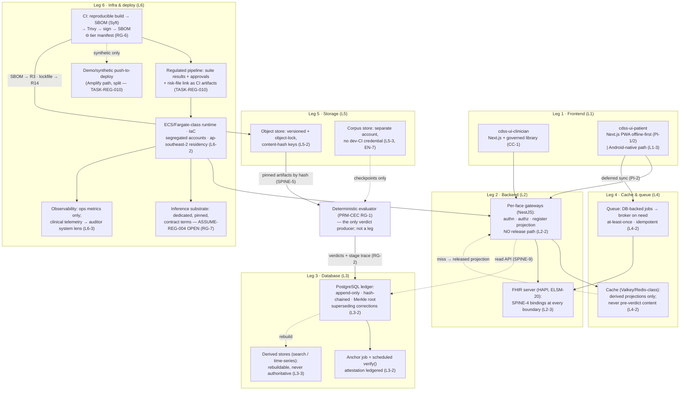

# Primer LEG — The Reasonable Default Stack

> **Justification fabric.** The butterfly's body is the justification fabric plus the deterministic evaluator: *every claim is an argument; only arithmetic releases.* One argument object renders in three registers to three faces; the fabric is append-only, hash-chained, and version-pinned so any decision replays bit-for-bit. Two wings paint the body — the **Left Wing** (MAK-LWC) senses in degrees, the **Right Wing** (MAK-RWC) judges in systems — and their coordination is the flight (MAK-MIF). The host is **MAK-FFC v1.1**: no primer here relaxes a corpus MUST. Regulatory content is governed by **REG-POSTURE v1.0** via **MAK-ANT** — assume inclusion, glass-box as the design target, ASSUME-REG-001..007 open pending counsel. This primer's position: *the six legs are what the body stands on between flights — replaceable technology under ten immovable bindings; this primer treats the bindings as the definition of done and every named default as an asset with a dated verdict, never as law.*

## LEG1. What this is

The stack is the one component of the butterfly that carries no clinical meaning of its own and touches everything that does. MAK-LEG's thesis is that the series' architecture is deliberately technology-agnostic and that an implementation team still needs a day-one answer for six legs — frontend, backend, database, cache and queue, storage, infrastructure and deploy — chosen "for boringness, hireability, and fit with the components the sourcing record verified." Its cardinal law is structural rather than technological: **defaults are defaults; bindings are law** (LS-1). Every leg is read as three layers — a SHOULD-level default that is "a reasonable example, not an authoritative ruleset" (MAK-LEG frontmatter `authority_note`), MUST-level bindings that restate series law at stack level (pins that replay, one gate to the faces, tamper-evident ledger storage, tier manifests in CI, an offline floor the patient face never falls through — LS-2), and notes on alternatives, tier consequences and REG-POSTURE dependencies. The polyglot floor is fixed by verified components, not by taste: JVM for the CQL translator, clinical-reasoning and HAPI (ELSM-01/02/20), Python for the engine plane (ELSM-12/14), TypeScript for the application layer, every boundary crossing through the MAK-CEC engine contract (LS-3, OM-2/OM-7). The strategic fact behind all of it, established twice by the sourcing record: **the moat is the fabric, not the stack** (MAK-LEG Part 1).

*Trace: MAK-LEG Thesis; Part 0 three-layer reading; Part 1; LS-1, LS-2, LS-3; frontmatter `authority_note` and `subordinate_to`.*

## LEG2. Scope

**In scope** — the seven MAK-LEG requirement families this primer owns:

- **LS-1..4 · Stack laws.** Defaults-are-defaults, bindings-are-law, substitution recorded with rationale (LS-1); the stack emits the series' evidence by construction — pins and replay, single gate, tier manifests with SBOM diffs, unified telemetry, conformity-file retention (LS-2); polyglot bounded by contract — JVM + Python + TypeScript, no clinical logic reimplemented across languages (LS-3); boring-technology bias with the runtime-technology count as a reviewed metric (LS-4).
- **L1-1..3 · Frontend.** Default React + Next.js + TypeScript + Tailwind as two governed component libraries over shared tokens (L1-1); whatever is chosen passes the UI corpora's bindings — offline-first lossless capture, one-surface law and verdict fidelity, structural bright line, WCAG 2.2 AA, CDS Hooks/SMART embedding floor (L1-2); Android-native patient vehicle for low-resource deployments from the same content artifacts (L1-3).
- **L2-1..3 · Backend.** Default NestJS + TypeScript as per-face gateways over the fabric's single read API, REST default, GraphQL on demonstrated need (L2-1); no clinical logic outside compiled artifacts, no release-capable path in the API layer, contract types uncoerced (L2-2); FHIR at every boundary via HAPI or an equivalent conformant server, SPINE-4 bindings as the interchange contract (L2-3).
- **L3-1..3 · Database.** Default PostgreSQL / Aurora PostgreSQL, one engine (L3-1); ledger properties hold whatever is chosen — append-only, hash-chained, Merkle-verifiable, externally anchored, superseding corrections, bit-for-bit replay, remodeling ledger on the same footing, verification exercised on schedule (L3-2); specialised stores only as derived, disposable, never-authoritative projections (L3-3).
- **L4-1..3 · Cache & queue.** Default managed Redis; queueing starts database-backed and graduates to a broker only on need (L4-1); caches derived-only, never pre-verdict or held content, at-least-once idempotent queues, no clinical decision in a consumer (L4-2); edge sync with additive conflict resolution for offline-heavy deployments (L4-3).
- **L5-1..3 · Storage.** Default S3-class object storage as the artifact economy's warehouse — versioned, lifecycle-ruled, jurisdiction-pinned (L5-1); immutable-per-version artifacts addressed by content hash, conformity retention under the obligations register, custody-honouring exports (L5-2); the firewalled evaluation corpus in physically or account-separated storage (L5-3).
- **L6-1..4 · Infrastructure & deploy.** Default AWS managed services, Docker under IaC, ECS/Fargate-class runtime, the Amplify split path (L6-1); reproducible containerised builds with SBOM diffed against tier manifests, gated regulated pipeline, contractually pinned inference substrate, synthetic-only line pre-GATE-002, data residency per jurisdiction (L6-2); observability on the unified telemetry schema with the auditor face as the only clinical-telemetry surface (L6-3); in-country or on-premise substitution as the expected low-resource case (L6-4).

**Out of scope** — each exclusion names its owner:

- The engine contract, five-signal registry, deterministic evaluator and tier manifests themselves (PRM-CEC; MAK-CEC OM-2/OM-3/RG-1/RG-6). This primer makes the stack *evidence* them (LS-2); it never defines them.
- The argument, deviation and register-render schemas and the fabric service (Architecture §14.2 `cdss-fabric`, contracts in `cdss-spine`; MAK-FFC SPINE-1..9). The stack hosts the ledger; the fabric decides what enters it.
- UI conformance suites, register lint, identity sheet, component libraries (PRM-PRB PA-6/PC-1; PRM-LBP CA-5/CC-1/CV-1). L1-2 makes those suites the frontend leg's acceptance tests; it does not author them.
- Guideline compilation and knowledge-plane admission (Primer D registry gateway; Architecture §14.2 `cdss-compiler`; MAK-CEC CP-1). The storage leg holds the artifacts; the compiler and registry govern what they are.
- Evidence duties, conformity bundles and the obligations register (PRM-ABC AX-1..4). L5-2 retains what AX-3 demands; AX-3 decides what that is.
- Regulatory classification, the Baseten/Ketryx contract terms and assumption closure (PRM-ANT; REG-POSTURE TASK-REG-009..013, ASSUME-REG-004/006 — OPEN, cited never closed, per MAK-ANT AN-3).
- Model governance, cards, posture decision (Primer J; R4, R19). L6-2's "pinned inference substrate" is an infrastructure property Primer J's cards reference.
- Living-evaluation mechanisms, tolerances and change control over infrastructure configuration (Primer I; Architecture §11.4 "service choices are Primer-I-changeable configuration").

*Trace: MAK-LEG Part 0 substitution rule; Part 8 binding map; Appendix A census; MAK-ANT AN-3; Architecture §11.4, §14.2.*

## LEG3. Breadth and depth of content required

Twenty-three requirements (LS 4 · L1 3 · L2 3 · L3 3 · L4 3 · L5 3 · L6 4; 10 MUST, 8 SHOULD, 5 MAY) — the smallest volume in the set by count and, per its own Appendix B check 8, structurally two-layered: every leg has at least one SHOULD default and at least one MUST binding, and "no leg's law depends on its default." That structure sets the depth this primer needs: **the MUST layer must be exhaustively testable; the SHOULD layer must be exhaustively verified.**

Breadth on the binding side is the set of corpus requirements the ten MUSTs cite, every one of which the stack must be able to *evidence*: SPINE-4/5/9 (ledger, pins, single read API); MAK-CEC RG-1/4/5/6/7 and OM-2/3/5, CP-1 (single gate, replay harness, telemetry schema, tier manifests, substrate bindings, contract types, single compilation path); MAK-PRB PI-1/2, PA-1, PS-4, PA-6 and MAK-LBP CA-2, CA-5 (the UI suites); MAK-RWC MA-1 (remodeling ledger); MAK-ABC AX-3, AE-1 (retention, reconstruction); MAK-TXC TC-1/3 (custody, routing); MAK-FFC EN-7 (firewall); REG-POSTURE TASK-REG-009..013, REG-KEEP-004 (stack tasks, synthetic-only line). MAK-LEG Appendix B check 6 requires each to resolve in its host volume — this run checked all of them against the staged files (LEG Appendix B check 9).

Breadth on the default side is the six named example stacks plus the alternatives the corpus itself names (Android-native path, immudb, RabbitMQ or SQS, in-country cloud) and the REG-POSTURE substrate decisions already taken (Baseten Sydney, Ketryx-on-Jira, the Amplify split). Depth here is the P5 duty: every named technology verified for currency, licence and maintenance signal as of this run — the corpus's own Part 8 "Sources" line rests on MAK-ELSM's 2026-08-29 verification and the 2026-09-01 wing/eye annexes, so several rows were three to five days old and one (Redis) carried a licence state the sourcing record never examined (finding LEG-F2).

Depth constraint from the corpus: the Mākoha programme is "already AWS-resident" (MAK-LEG Part 7) and the architecture pins ap-southeast-2 for data residency (Architecture §11.1), yet L6-4 makes in-country substitution "the recorded, expected case rather than an exception." The stack must therefore be specified as a *shape* (containers, IaC, object store with lock, relational ledger, cache) that a ministry data centre can instantiate, not as an AWS bill of materials — which is exactly why the bindings, not the defaults, are the definition of done.

*Trace: MAK-LEG Appendix A census and B checks 6/8; Parts 2–7 bindings; Part 7 rationale; Part 8 Sources; Architecture §11.1; L6-4.*

## LEG4. Building in a silo

Unlike a clinical component, most of the stack can be stood up before any argument exists — but only in the shape the bindings dictate. What is buildable alone:

- **The tier-1+2 build lane** (LS-2, L6-2): Dockerfiles per service, reproducible builds, Syft-generated CycloneDX/SPDX SBOM per artifact manifest, Trivy scan, image signing, SBOM diff against a *stub* tier manifest (J-1 / J-2 / J-3 denylists seeded from MAK-ELSM §08). Mockable: the tier manifests themselves (PRM-CEC owns; use the ELSM §08 seed as fixture). Testable: a build that adds `mapie` or `pgmpy` to a J-3 image fails CI.
- **The ledger substrate** (L3-2): PostgreSQL schema with an application-level hash chain (each row carries `prev_hash`, `row_hash`), a Merkle root per epoch, an anchoring job that writes the root to an external target, and a scheduled `verify()` that recomputes the chain and reports. Mockable: the argument schema (CONTRACT-ARG-1 pin from `cdss-spine` — Proposed) as any JSON payload; the external anchor as a second account's object-locked bucket. Property tests: a mutated row is detected; a superseding correction leaves the original readable; replay of an epoch from pins is byte-identical.
- **The artifact warehouse** (L5-2, L5-3): versioned, object-locked bucket in compliance mode, content-hash key scheme, lifecycle rules, retention class per artifact type (knowledge-plane artifact · conformity bundle · replay corpus · export), and a second account with independent IAM for the evaluation corpus. Testable: an attempted overwrite of a versioned artifact fails; a dev-CI role cannot list the corpus bucket.
- **The per-face gateway skeleton** (L2-1, L2-2): NestJS modules for authn/authz/register projection over a *mock* fabric read API returning fixture arguments already marked released/held/flagged; negative tests that no controller, resolver or middleware contains a threshold or a release decision. Stub: PRM-CEC's evaluator as a fixture service that only ever emits verdicts, never accepts a render request (OM-5).
- **The cache layer** (L4-2): Valkey/Redis-class cache fronting the gateway, keyed by (argument id, pins, register) and populated only from evaluator-released projections; a negative test that a held fixture never appears in cache.
- **The queue contract** (L4-2): database-backed job table with at-least-once delivery and idempotency keys, exercised by a sync-fixture that duplicates and reorders deliveries and asserts no loss, no duplication, additive conflict records (MAK-PRB PI-2).
- **Two frontend shells** (L1-1): Next.js applications importing empty governed component libraries and the shared token package, with the register lint and identity-sheet checks wired as CI steps against fixture components — the *shape* PRM-PRB PC-1 and PRM-LBP CC-1 require, with no components yet.
- **Segregated accounts and IaC** (L6-2; Architecture §11.1 Tier 3): Organizations with per-environment accounts, no network path staging→production, cfn-guard/cdk-nag on every template, reachability analysis as a CI check.

What cannot be built in the silo: the actual tier manifests (PRM-CEC RG-6), the argument schema and fabric service (`cdss-spine` / `cdss-fabric`), the UI suites that are L1-2's acceptance tests (PRM-PRB, PRM-LBP), the unified telemetry schema the dashboards consume (RG-5, PRM-CEC), the obligations register that sets retention rules (PRM-ABC AX-3), the inference substrate contract (REG-POSTURE TASK-REG-009, ASSUME-REG-004) and the Ketryx configuration (KTX-001..012, ASSUME-REG-006). These are LEG5 edges.

*Trace: MAK-LEG L2-2, L3-2, L4-2, L5-2, L5-3, L6-2; MAK-ELSM §08 denylist seed; Architecture §10 (`cdss-spine` contracts), §11.1 Tiers 1–3; MAK-PRB PI-2.*

## LEG5. Folding it in

Integration contract — consumes and emits, with the counterpart edge named. The stack is unusual: it *hosts* most of what it touches, so several "emits" rows are hosting duties rather than data flows.

**Consumes**

| From | What | Interface | Counterpart edge |
|---|---|---|---|
| PRM-CEC (engine plane) | Tier manifests per build (J-1/J-2/J-3 SBOM allow/deny lists); the unified telemetry schema as a versioned artifact | Manifest file consumed by CI SBOM-diff; schema consumed by dashboards | MAK-CEC RG-6 ("every build's SBOM diffs against its tier's manifest in CI"), RG-5. **Checked:** RG-6 names the CI diff; MAK-CEC does not name a register home for the manifest — see GAP-LEG-001 / finding LEG-F6 |
| `cdss-spine` (Architecture §10) | Argument/Deviation/register-render schemas; artifact manifest format; the integration lockfile | Pinned `cdss-spine@vX` dependency in every service | Architecture §10 contracts list; §14.2 new contracts. **Checked:** FML artifact spec is "dormant until FZ-2 ratifies" — storage leg must not presume it |
| PRM-PRB / PRM-LBP (UIs) | The two conformance suites (PA-6, CA-5) as CI acceptance tests; component libraries; identity sheet and register lint | CI jobs in `cdss-ui-patient` / `cdss-ui-clinician` | MAK-PRB PA-6, MAK-LBP CA-5 (both "results are conformity-file artifacts"); Architecture §14.2 ("MAK-LBP conformance suite = CI acceptance tests"). **Checked:** consistent |
| PRM-ABC (auditor face) | Retention rules per artifact class (obligations register); conformity-bundle definitions; gate-bundle definitions | Retention policy as configuration consumed by lifecycle rules | MAK-ABC AX-3, AX-4. **Checked:** AX-3 makes obligation status "generated, not asserted" — L5-2's retention must be queryable, not just applied |
| PRM-ANT / REG-POSTURE | Stack tasks TASK-REG-009..013; the GATE-002 synthetic-only line; Ketryx schema KTX-001..012; STD-007..012 security standards | Cited by ID; carried in the maintained carrier map (MAK-ANT AN-5, "Legs volume (stack tasks 009–013)") | MAK-ANT Part 3 carrier map rows TASK-REG and STD. **Checked:** the carrier map names the Legs volume as primary carrier of 009–013 and of STD bindings — this primer is that carrier's build face |
| Primer D / `cdss-registry` | Signed artifact bundles and hash manifests to be warehoused | Object store write with content-hash key | Primer D §D2 (hash-manifest generation, artifact signing); Architecture §11.4 ("S3 versioned, object-lock + KMS signing + cosign"). **Checked:** consistent with L5-2 |
| Primer J | Model cards naming the inference substrate and pinned weights | Card field → substrate binding | Primer J posture; Architecture §14.6 C-03/DEC-03. **Checked:** Architecture §11.4 still names Bedrock via PrivateLink for harness/K/L calls — see finding LEG-F1 |

**Emits**

| To | What | Interface | Counterpart edge |
|---|---|---|---|
| R3 SBOM Register, R14 Lockfile Register (Architecture §12.2) | Signed SBOM per artifact; tier-diff result; lockfile pin-set per deploy | Append writes from CI (Tier 1+2) and CodePipeline (Tier 3) | Architecture §12.2 rows 3 and 14; WF-SPINE-1 `sign_and_record` writes R14. **Checked:** consistent |
| `cdss-fabric` (hosting duty) | The ledger substrate with tamper evidence, anchoring and scheduled verification (L3-2) | PostgreSQL schema + anchor job + `verify()` attestation | Architecture §14.2 `cdss-fabric` "ledger substrate per DEC-04". **Checked:** DEC-04 is an open decision — see finding LEG-F7 |
| R11 Decision Log (hosting duty) | Object-locked append store for every render attempt | S3 object-lock bucket or ledger table | Architecture §12.2 row 11 "append (object-lock)". **Checked:** consistent with L5-2 write-once semantics |
| Per-face gateways → PRM-HDC / PRM-TXC / PRM-ABC | Register-scoped projections of evaluator-released arguments over one read API (L2-1) | REST default; GraphQL per-surface on need | MAK-FFC SPINE-9 (one read API, derived caches); MAK-CEC OM-5 (no engine path to a face). **Checked:** consistent — the gateway is a projection, never a producer |
| PRM-CEC evaluator | Nothing. The API layer holds no release-capable path (L2-2) | — | MAK-CEC RG-1 "sole path"; RG-8 single-gate negative tests. **Checked:** the negative test lives in PRM-CEC's suite; the stack supplies the fixture environment |
| PRM-ABC system lens | Operational metrics only, on the unified telemetry schema (L6-3) | CloudWatch/Grafana-class dashboards | MAK-FFC AF-8 / EN-9; MAK-CEC RG-5 "rendered only on the auditor face's system lens". **Checked:** consistent — infrastructure dashboards carry no clinical-decision analytics |
| PRM-ABC obligations register | Standing evidence queries answered from the stack: SBOM presence, retention state, anchor-check results, residency configuration | Query interface over R3 / storage inventory / anchor ledger | MAK-ABC AX-3. **Checked:** the anchor-check result has no register home — GAP-LEG-002 |
| Primer I | Contract-violation alarms (I-5) and infrastructure change events for Primer-I change control | Runtime assertions → R18; IaC diffs as change records | Architecture §11.1 Tier 5 ("contract-violation alarms (I-5)"), §11.4 ("Primer-I-changeable configuration"). **Checked:** consistent |
| `cdss-corpus` (L5-3) | An account-separated store with independent access control in which dev-side CI holds no credential | Separate AWS account; IAM boundary | Architecture §10 `cdss-corpus` isolation note; §11.4 "the corpus repo/store lives in its own account". **Checked:** consistent with L5-3 and EN-7 |

**Fabric binding (MAK-FFC).** The stack supplies **no argument slot** — not claim, grounds, warrant, backing, qualifier or rebuttal — and that absence is its conformance property: L2-2 forbids any release-capable path in the API layer, L4-2 forbids a cache from serving pre-verdict content, and L3-2 makes the ledger the fabric's append-only, hash-chained substrate (SPINE-4) with the pins SPINE-5 demands. It is the body's skeleton, not its voice. Coordination doctrine: MAK-MIF beat 3 (old decisions replay against old meanings — the pin-and-replay obligation the database and storage legs carry) and beat 6 (every low-resource deployment running on self-report and cheap sensors — the offline floor and in-country substitution the frontend, queue and infrastructure legs carry: L1-2, L1-3, L4-3, L6-4).

*Trace: MAK-LEG Part 8 binding map; L2-1/2, L3-2, L4-2, L5-2/3, L6-2/3; MAK-FFC SPINE-4/5/9, AF-8, EN-7/9; MAK-CEC RG-1/5/6/8, OM-5; MAK-ABC AX-3/4; MAK-ANT Part 3; Architecture §10, §11.1, §11.4, §12.2, §14.2, §14.6; MAK-MIF §03 beats 3/6.*

## LEG6. Definition of done

Per MAK-LEG's authority note, **the bindings are the definition of done; defaults are not.** A release of the stack is done when, for every leg, all of:

1. **Substitution ledger complete** — every leg's chosen technology is recorded with rationale, and every departure from a named default is a recorded choice, not a deviation; no choice violates a binding, and the binding's cited corpus requirement is named in the record (LS-1; MAK-LEG Part 0 substitution rule).
2. **Evidence-by-construction demonstrated** — one sentinel decision replays bit-for-bit from its pins on the assembled stack (SPINE-5, RG-4); the single-gate negative tests pass with the stack's caches, queues and gateways in the loop (RG-1, RG-8); every build's SBOM diffs against its tier manifest in CI with a recorded pass (RG-6; TASK-REG-011); telemetry flows on the versioned schema (RG-5); conformity artifacts are retained and retrievable (MAK-ABC AX-3) (LS-2).
3. **Polyglot boundary audit clean** — every runtime boundary carries the engine contract types without coercion (OM-2/OM-3); a static sweep finds no clinical logic reimplemented in a second language or outside compiled knowledge-plane artifacts (CP-1, EN-3); the runtime-technology count is recorded and reviewed (LS-3, LS-4).
4. **Frontend passes the UI suites** — PRM-PRB PA-6 (register lint, two voices, bright line incl. notification payloads, tired-thumb, library integrity, resumability and offline-loss, floor, localisation) and PRM-LBP CA-5 (identity/conflation kit, one-interaction, one-surface negatives, verdict fidelity, sign-off isolation, interruption budget, keyboard parity, embedding floor per delivery vector) are green as CI acceptance tests; WCAG 2.2 AA equivalent evidenced on both faces (L1-2; PS-4, PI-1/2, PA-1, CA-2). Where L1-3's Android vehicle ships, the same suites run on it from the same content artifacts.
5. **API layer holds no release path** — no controller, resolver or middleware contains a threshold, rule or verdict; every face request resolves against evaluator-released content with pins intact; a fixture "held" argument is unreachable through every gateway route (L2-2; RG-1, CP-1, OM-2/OM-3).
6. **FHIR at every boundary** — a conformant FHIR server fronts clinical resources and the SPINE-4 bindings (GuidanceResponse, Provenance, AuditEvent, DetectedIssue, Consent, QuestionnaireResponse) are the only interchange contract; no bespoke clinical schema is exposed at an integration boundary (L2-3; ELSM-20).
7. **Ledger properties verified on schedule** — append-only with hash chain and Merkle verification; external anchoring on a ratified cadence; corrections as superseding entries; the remodeling ledger (MAK-RWC MA-1) on the same footing; the anchor-check and replay attestation run as scheduled jobs whose results are ledgered, and a mutated-row fixture is detected (L3-2; SPINE-4/5, MAK-ABC AE-1).
8. **Derived stores provably disposable** — any search index or time-series store rebuilds from the ledger to an identical state and no face reads it directly (L3-3; SPINE-9).
9. **Cache and queue hygiene** — no fabric content exists only in a cache; a held or pre-verdict fixture never appears in any cache or notification payload; sync and telemetry queues survive a duplicate-and-reorder fixture with zero loss and zero duplication and additive conflict records; no consumer contains a clinical decision (L4-2; SPINE-9, RG-1, OM-5, MAK-PRB PI-2). Where L4-3 edge sync ships, conflicts resolve additively with review flags, never by overwrite.
10. **Artifacts immutable and hash-addressed** — every knowledge-plane artifact version is write-once (object-lock or equivalent) and addressed by content hash where a pin references it; an overwrite attempt fails; conformity artifacts sit under the obligations register's retention rules; patient exports honour custody and routing law (L5-2; SPINE-5, AX-3, MAK-TXC TC-1/3). Where L5-3 ships, the corpus store is account-separated and dev-side CI provably holds no credential (EN-7, RG-3).
11. **Infrastructure gates enforced** — builds reproducible and containerised with SBOM in CI; the regulated pipeline blocks deploy without suite results, approvals and risk-file linkage as CI artifacts (TASK-REG-010; KTX-010); runtime model substrates carry contractual version-stability and change-notice terms before any regulated use, with ASSUME-REG-004 recorded as OPEN in every dependent statement (RG-7; MAK-ANT AN-3); environments enforce the synthetic-only line pre-GATE-002 (REG-KEEP-004; AN-7); data residency is pinned per deployment jurisdiction and verifiable from configuration (L6-2).
12. **Observability lens discipline** — infrastructure dashboards carry operational metrics only; clinical telemetry renders solely on the auditor face's system lens (L6-3; AF-8/EN-9, RG-5).
13. **Portability proven, not assumed** — the stack deploys from IaC to at least one non-default target (a second cloud region at minimum, an in-country or on-premise equivalent where a deployment demands it) with every binding test above green, and the substitution is recorded as the expected case (L6-4; XC-3/XC-4, MAK-TXC TC-3).

SHOULD- and MAY-level defaults (L1-1, L2-1, L3-1, L4-1, L5-1, L6-1, L6-3's tooling, L1-3, L3-3, L4-3, L5-3, L6-4) are not release-gating in themselves; their departures are recorded under item 1.

*Trace: MAK-LEG LS-1..4, L1-2, L2-2/3, L3-2/3, L4-2/3, L5-2/3, L6-2/3/4; Part 0 substitution rule; Part 8 binding map; MAK-FFC SPINE-4/5/9, EN-3/7, AF-8/EN-9, XC-3/4; MAK-CEC RG-1/3/4/5/6/7/8, OM-2/3/5, CP-1; MAK-PRB PA-6; MAK-LBP CA-5; MAK-ABC AX-3, AE-1; MAK-TXC TC-1/3; REG-POSTURE TASK-REG-010/011, REG-KEEP-004; MAK-ANT AN-3, AN-7.*

## LEG7. Internal operations diagram



## LEG8. Execution layer

**Executable contract.** MAK-LEG gives no code-level contract; its executable artifact is the **stack-to-series binding map** (Part 8), reproduced verbatim because it is the table every substitution is checked against:

| Leg | Default (suggestion) | The law it must satisfy (authoritative) |
|---|---|---|
| 1 · Frontend | React/Next.js · TypeScript · Tailwind | MAK-PRB PA-6 + MAK-LBP CA-5 suites; bright line structural; offline floor; embedding floor |
| 2 · Backend | Node.js/NestJS · TS · REST (GraphQL on need) | No clinical logic outside compiled artifacts (CP-1); single gate (RG-1); FHIR at boundaries (SPINE-4); typed signals uncoerced (OM-3) |
| 3 · Database | PostgreSQL / Aurora | Tamper-evident append-only ledger with anchoring + replay (SPINE-4/5); QLDB avoided (retired); derived stores never authoritative (SPINE-9) |
| 4 · Cache & queue | Redis · RabbitMQ/SQS if needed | Caches derived-only; no pre-verdict content served; idempotent lossless sync (PI-2); no decisions in consumers (OM-5) |
| 5 · Storage | S3-class object storage | Immutable versioned artifacts, hash-addressed pins (SPINE-5); conformity retention (AX-3); custody-honouring exports (TC) |
| 6 · Infra & deploy | AWS managed · Docker | SBOM + tier manifests in CI (RG-6); gated regulated pipeline (TASK-REG-010); pinned inference substrate under contract (RG-7, ASSUME-REG-004); synthetic-only pre-GATE-002 |

**Proposed machine-readable substitution record (this primer's shape for LS-1; Proposed, `cdss-spine` contract candidate):**

```yaml
StackChoice:
  leg: L1 | L2 | L3 | L4 | L5 | L6
  default_named: string            # the MAK-LEG example
  chosen: {name, version, licence}
  substitution: boolean            # true if chosen ≠ default
  rationale: string                # required when substitution = true (LS-1)
  bindings_satisfied: [MAK-LEG L?-2 ...]   # every MUST of the leg, each with test ref
  reg_dependencies: [ASSUME-REG-004 | ASSUME-REG-006 | none]  # status always OPEN until AN-3 closure
  recorded: {date, by, register: R25}
```

**First executable properties (seed for the I registry, stack subset):** (1) ∀ build: `sbom(build) ⊖ tier_manifest(tier)` is empty for denylisted namespaces, and a build seeded with `mapie` fails the J-3 lane (RG-6, LS-2). (2) ∀ ledger epoch: `verify(chain)` recomputes to the anchored Merkle root; a single mutated byte is detected (L3-2). (3) ∀ correction: the superseded entry remains readable and the superseding entry references it (L3-2, SPINE-4). (4) ∀ artifact version: a second write to the same key fails; `hash(object) == key` (L5-2). (5) ∀ cache key: the cached projection equals the evaluator-released projection for the same pins; a fixture marked `held` never has a cache entry (L4-2). (6) ∀ queue delivery sequence with duplicates and reorderings: consumer state equals the canonical state; conflicts produce two records plus a review flag, never one (L4-2, PI-2). (7) ∀ gateway route: a static and a dynamic sweep find no threshold, rule or verdict token; a `held` fixture returns no content on any route (L2-2). (8) ∀ deployment: residency configuration resolves to the declared jurisdiction region and no resource exists outside it (L6-2).

**Asset library** — every requirement family maps to at least one row. Seeded from MAK-LEG Parts 2–7 and Part 8 Sources, MAK-ELSM v1.1 (verified 2026-08-29), MAK-CEC/MAK-TXC Part 9 annexes (2026-09-01) and Architecture §11.1/§11.4; **every default technology named in the six legs re-verified this run, 2026-09-02**, method stated. Verdict vocabulary per MAK-ELSM: ADOPT / ADAPT / STUDY / BUILD / WATCH; **DEAD-REPLACE** for retired assets. A verdict on a default is a recorded choice under LS-1 — never a rewrite of the corpus.

| Asset | Type | Satisfies | Licence | Currency | Verified (method · date) | Verdict |
|---|---|---|---|---|---|---|
| [Next.js](https://nextjs.org) | framework (L1 default) | L1-1; L1-2 via PWA/SSR scaffolding | MIT | **16.3.4 (LTS) · 31 Aug 2026**; 15.x support ends **21 Oct 2026** | endoflife.date API fetched · 2026-09-02 | **ADOPT — pin 16 LTS; 15 is DEAD-REPLACE at L2 exit** |
| [React](https://react.dev) | library (L1 default) | L1-1 | MIT | 19.2.8 · 21 Jul 2026 | endoflife.date API fetched · 2026-09-02 | **ADOPT** |
| [TypeScript](https://www.typescriptlang.org) | language (L1/L2 default) | L1-1, L2-1, LS-3 (TS presence) | Apache-2.0 | 7.0.2 latest on npm | npm registry `typescript/latest` fetched · 2026-09-02 | **ADOPT** — 7.x is a major bump; pin per lockfile, verify NestJS/Next peer ranges (RECON-LEG-003) |
| [Tailwind CSS](https://tailwindcss.com) | library (L1 default) | L1-1 (identity system in tokens — MAK-LBP CV-1) | MIT | 4.3.3 · 16 Jul 2026 | endoflife.date API fetched · 2026-09-02 | **ADOPT** |
| [ohs-foundation/android-fhir](https://github.com/google/android-fhir) (redirects from google/) | SDK (L1-3 alternative) | L1-3, L4-3; MAK-TXC TL-1/2 | Apache-2.0 | 599★; **repo moved to the `ohs-foundation` org**; last tagged SDC release 1.3.1 · 20 Nov 2024; commits active (2,426) | GitHub repo + releases pages fetched · 2026-09-02; carried from ELSM-04 (2026-08-29) | **ADOPT / WATCH — org move must be recorded in ELSM (finding LEG-F4); release cadence slow, commit activity fine** |
| [opensrp/fhircore](https://github.com/opensrp/fhircore) | product (L1-3 alternative) | L1-3, L4-3, L6-4; XC-3 | Apache-2.0 | 68★ · v2.2.2; **release date reads 10 Nov 2024 on the releases page vs "Nov 2025" in ELSM-05/T02** | GitHub releases + repo page fetched · 2026-09-02 | **ADOPT / STUDY — currency discrepancy to resolve (LEG-F4); device-integration features excluded in J-3 (GPP-6)** |
| [Node.js](https://nodejs.org) | runtime (L2 default) | L2-1, LS-3 | MIT | 24.20.0 (Active LTS) · 26 Aug 2026; 26 becomes LTS 28 Oct 2026; **20.x EOL 30 Apr 2026** | endoflife.date API fetched · 2026-09-02 | **ADOPT — pin 24 LTS; 20 DEAD-REPLACE** |
| [NestJS](https://nestjs.com) | framework (L2 default) | L2-1 (per-face gateways) | MIT | @nestjs/core 12.0.1 latest on npm | npm registry fetched · 2026-09-02 (endoflife.date has no entry) | **ADOPT** |
| [HAPI FHIR](https://github.com/hapifhir/hapi-fhir) (jpaserver-starter) | server (L2-3 default) | L2-3; SPINE-4 data-plane bindings; LS-3 JVM presence | Apache-2.0 | v8.10.0 · 21 May 2026 (v8.10.1 Jul 2026) | GitHub API `releases/latest` + releases page · 2026-09-02; ELSM-20 carried | **ADOPT** |
| [PostgreSQL](https://www.postgresql.org) | database (L3 default) | L3-1, L3-2 substrate | PostgreSQL Licence | 18.6 · 11 Aug 2026 (EOL Nov 2030); 17.11; 16.15 | endoflife.date API fetched · 2026-09-02 | **ADOPT — pin 17 or 18** |
| Aurora PostgreSQL | managed DB (L3-1 AWS default) | L3-1; ELSM-19 pattern | AWS service terms | Aurora PG 18.4 and 17.10 · 21 Aug 2026 | AWS release-notes page fetched · 2026-09-02 | **ADOPT (AWS default); L6-4 substitution = plain PostgreSQL** |
| Aurora/PostgreSQL + hash-chain / transparency-log pattern (trillian / rekor designs) | pattern (L3-2) | L3-2; SPINE-4/5 | Apache-2.0 references | active | carried from ELSM-19 (2026-08-29) — pattern, not a package | **ADOPT PATTERN → the ledger is a BUILD on it** |
| [codenotary/immudb](https://github.com/codenotary/immudb) | database (L3 alternative) | L3-2 | **BUSL-1.1 (not OSI)** | 9.0k★ · v1.11.1 · 26 Jun 2026 · active | GitHub repo + releases pages fetched · 2026-09-02 | **ADAPT — only if BUSL clears legal review (ELSM landmine unchanged)** |
| AWS QLDB | managed ledger | — | — | **RETIRED — end of support 31 Jul 2025** | carried from ELSM-18; InfoQ coverage located via search · 2026-09-02 | **DEAD-REPLACE (AVOID) — Part 8 map says "QLDB avoided (retired)"** |
| [Redis](https://redis.io) | cache (L4 default) | L4-1 | **≥ 8.0: tri-licence RSALv2 / SSPLv1 / AGPLv3; ≤ 7.2.x BSD-3** | 8.10.1 · 17 Aug 2026 | `redis/redis` LICENSE.txt fetched (quote: "your choice of (a) RSALv2; or (b) SSPLv1; or (c) AGPLv3") + endoflife.date · 2026-09-02 | **ADAPT — licence review before any redistributable SaMD image; AGPLv3 option means source-availability obligations; see LEG-F2** |
| [Valkey](https://valkey.io) (ElastiCache for Valkey) | cache (L4-1 substitute) | L4-1, L4-2 | BSD-3 (Linux Foundation) | 9.1.1 · 21 Jul 2026; ElastiCache offers Valkey, Redis OSS, Memcached (Serverless: Valkey ≥ 7.2) | endoflife.date API + AWS ElastiCache docs fetched · 2026-09-02 | **ADOPT as the managed "Redis-class" default — satisfies L4-1 as a recorded substitution (LS-1)** |
| [RabbitMQ](https://www.rabbitmq.com) | broker (L4 default "if needed") | L4-1 | MPL-2.0 | 4.3.5 · 13 Aug 2026 | endoflife.date API fetched · 2026-09-02 | **ADOPT on demonstrated need only (L4-1 "graduates")** |
| Amazon SQS | broker (L4-1 AWS alternative) | L4-1, L4-2 (at-least-once native) | AWS service terms | current managed service | AWS docs — not separately fetched; named in MAK-LEG L4-1 | **ADOPT (AWS default when a broker is needed); L6-4 substitution = RabbitMQ** |
| **Database-backed job table with idempotency keys** | build (L4-1 starting point) | L4-1, L4-2 | — | no dependency required; PostgreSQL primitives | this primer LEG4 | **BUILD — the corpus's "start with database-backed jobs"** |
| Amazon S3 with Object Lock (compliance mode) + Versioning | object store (L5 default) | L5-1, L5-2; R11 substrate | AWS service terms | Object Lock requires Versioning; compliance mode blocks root deletes during retention | AWS S3 Object Lock user guide fetched · 2026-09-02 | **ADOPT — compliance mode for knowledge-plane artifacts and R11; governance mode only for dev** |
| KMS signing + [sigstore/cosign](https://github.com/sigstore/cosign) | signing (L5-2, L6-2) | L5-2 (hash-addressed pins), L6-2 (signed images/SBOMs) | Apache-2.0 | cosign v3.1.1 · 9 Jun 2026 (Rekor v2 default; v4 flag removals announced) | GitHub releases page fetched · 2026-09-02; Architecture §11.4 | **ADOPT — pin 3.x; RECON on v4 flag removals** |
| Separate AWS account for `cdss-corpus` store | topology (L5-3) | L5-3; EN-7, RG-3 | — | Organizations feature | Architecture §10, §11.4 (2026-09-01 doc) | **ADOPT (topology, not a package)** |
| Docker Engine / [moby](https://github.com/moby/moby) | container runtime (L6 default) | L6-1, L6-2 | Apache-2.0 | v29.6.0 · 18 Jun 2026 | GitHub releases page fetched · 2026-09-02 | **ADOPT** |
| AWS ECS / Fargate | runtime (L6-1 default) | L6-1 | AWS service terms | current managed service | Architecture §11.4 "ECS Fargate stateless services (Lambda acceptable at L1–2 scale)" — not separately fetched | **ADOPT (AWS default); L6-4 substitution = any OCI orchestrator** |
| AWS CodeBuild / CodePipeline (Tier 1–3 lane) | CI/CD (L6-2 regulated pipeline) | L6-2; TASK-REG-010 gated path; R3/R14 writers | AWS service terms | current managed services | Architecture §11.1 (2026-09-01) — not separately fetched | **ADOPT as the regulated pipeline — see LEG-F5 on its relation to Amplify** |
| AWS Amplify Hosting | hosting (L6-1 "split path") | L6-1 demo/synthetic lane only | AWS service terms | active; Next.js SSR supported; no deprecation notice | AWS Amplify Hosting user guide fetched · 2026-09-02 | **ADOPT for synthetic/demo push-to-deploy only; never the regulated lane (TASK-REG-010)** |
| [anchore/syft](https://github.com/anchore/syft) (CycloneDX/SPDX SBOM) | tool (L6-2) | L6-2, LS-2; RG-6 diff input; TASK-REG-011 | Apache-2.0 | v1.46.0 · 26 Jun 2026 (SPDX 3 support) | GitHub releases page fetched · 2026-09-02; Architecture §11.1 | **ADOPT** |
| [aquasecurity/trivy](https://github.com/aquasecurity/trivy) | scanner (L6-2) | L6-2; TASK-REG-012 inputs | Apache-2.0 | v0.74.0 · 14 Aug 2026 | GitHub releases page fetched · 2026-09-02; Architecture §11.1 | **ADOPT** |
| [open-policy-agent/opa](https://github.com/open-policy-agent/opa) | policy engine | L2-2 gate policy substrate (Primer D chain); L6-2 IaC guard | Apache-2.0 | v1.17.0 · 28 May 2026 | GitHub releases page fetched · 2026-09-02; Architecture §11.4 | **ADOPT (registry gate chain owner: Primer D)** |
| **Tier-manifest SBOM-diff CI step** | build (L6-2, LS-2) | RG-6; TASK-REG-011; GPP-8 denylist | — | seed denylist from MAK-ELSM §08 | this primer LEG4; PRM-CEC owns manifests | **BUILD (assembled from Syft + diff)** |
| **Hash-chained ledger + anchor job + `verify()` attestation** | build (L3-2) | L3-2; SPINE-4/5; MA-1; AE-1 | — | pattern per ELSM-19; no package | this primer LEG4 | **BUILD — the one stack component no one sells** |
| **Substitution record (`StackChoice`) + runtime-technology-count metric** | build (LS-1, LS-4) | LS-1, LS-4 | — | contract candidate for `cdss-spine`; metric from SBOM inventory | this primer LEG8 | **BUILD** |
| Baseten dedicated deployments (Sydney) | inference substrate (L6-2 via RG-7) | L6-2; TASK-REG-009; **ASSUME-REG-004 OPEN** | commercial | Docs: "Regional environments require initial configuration by Baseten. Contact support to confirm availability for the region you need" — **Sydney not listed publicly** | Baseten regional-environments docs fetched · 2026-09-02 | **WATCH — binding contingent on written confirmation; never described as settled (MAK-ANT AN-3)** |
| Ketryx (on Jira) | lifecycle system of record (L6-2 via RG-7; KTX-001..012) | L6-2; TASK-REG-011 SBOM ingestion (KTX-012); **ASSUME-REG-006 OPEN** | commercial; free tier "pre-market companies that have raised less than $2M" | pricing page confirms free tier; validation evidence "provided upon request"; the "validated out of the box" phrase not on the public page | ketryx.com/pricing fetched · 2026-09-02 | **WATCH — WATCH-REG-004 tier decision stands; KTX bindings carried by ID only** |
| CloudWatch / Grafana-class dashboards | observability (L6-3 default) | L6-3; RG-5 consumer (ops lens) | AWS terms / AGPLv3 (Grafana OSS) | managed services | Architecture §11.4 names QuickSight; MAK-LEG L6-3 names CloudWatch/Grafana-class — not separately fetched | **ADOPT (any); lens discipline is the binding, tooling is free** |
| ACSC Essential Eight ML2+, ISO 27001:2022 Annex A, TGA Essential Principles cybersecurity, Privacy Act APP 11 | control frameworks (Tier 4 yardstick) | L6-2 hardening; STD-007..012 via MAK-ANT AN-4 | — | cyber.gov.au fetch blocked by robots.txt this run; search located the current maturity-model page | WebSearch · 2026-09-02; Architecture §11.1 Tier 4 | **ADOPT as yardstick; currency check is MAK-ANT AN-4's duty (WATCH-REG-005), recorded here as not independently re-fetched** |

**Coverage check (P5):** LS-1..4 → StackChoice/technology-count build, Syft + tier-diff build, Docker, Node/HAPI/PostgreSQL as the polyglot floor (LS-3 JVM + Python + TS). L1-1..3 → Next.js, React, TypeScript, Tailwind, android-fhir, fhircore; L1-2's acceptance tests are PRM-PRB/PRM-LBP suites (owned there). L2-1..3 → Node.js, NestJS, HAPI FHIR, OPA (gate policy). L3-1..3 → PostgreSQL, Aurora PostgreSQL, ledger-pattern build, immudb (alternative), QLDB (DEAD-REPLACE); derived stores per L3-3 are deployment-specific and unnamed by the corpus — no row needed until one is chosen. L4-1..3 → Redis (ADAPT), Valkey (ADOPT), RabbitMQ, SQS, job-table build; L4-3 edge sync → android-fhir engine sync. L5-1..3 → S3 Object Lock, KMS + cosign, separate-account topology. L6-1..4 → Docker, ECS/Fargate, CodeBuild/CodePipeline, Amplify (demo lane), Syft, Trivy, cosign, Baseten (WATCH), Ketryx (WATCH), CloudWatch/Grafana-class, control frameworks; L6-4 substitution = plain PostgreSQL + RabbitMQ + any OCI orchestrator + S3-compatible store with lock semantics. **23/23 covered; 36 rows; 4 BUILD; 2 DEAD-REPLACE; 2 WATCH on assumption-gated services.**

**Sourcing landmines carried forward, with this run's status:** QLDB retired — *unchanged, DEAD-REPLACE*; immudb BUSL-1.1 — *unchanged, ADAPT pending legal*; cqf-ruler legacy — *out of scope here (PRM-CEC)*; **new this run:** Redis ≥ 8 tri-licence including AGPLv3 (LEG-F2); android-fhir org move to `ohs-foundation` (LEG-F4); fhircore release-date discrepancy between ELSM and the releases page (LEG-F4); Next.js 15 support end 21 Oct 2026 and Node 20 EOL 30 Apr 2026 (pin 16 / 24); Baseten Sydney availability not publicly listed (ASSUME-REG-004 remains OPEN — this is consistent with the annex, not a new closure).

**Proposed tolerances (flag: operator / security sign-off required; none is a corpus number):** anchor cadence for the ledger Merkle root ≤ 24 h with a per-release anchor; scheduled `verify()` at least daily, result ledgered; object-lock retention for knowledge-plane artifacts ≥ 10 years or the obligations-register rule, whichever is longer (AX-3 decides); SBOM-diff pass = zero denylisted namespaces, zero unpinned versions; runtime-technology count reviewed at every level exit with a ceiling of three application runtimes (JVM, Python, Node) plus native Android where L1-3 ships.

*Trace: MAK-LEG Part 8 map (verbatim), Parts 2–7 defaults and alternatives, Part 1 LS-3 verified components; MAK-ELSM ELSM-04/05/17/18/19/20 and §08 denylist; Architecture §11.1, §11.4; external verification 2026-09-02 as tabled.*

## Production topology annotation

*Per Architecture §11 and §14.5:* the stack has no capability row of its own because it is the substrate every row deploys onto — which makes **every level's tier ceiling a binding on the stack** (Architecture §11.2: "the tiers never relax as levels advance"). Reconciled level by level:

- **L1 Glass-Box Core (tier ceiling 1+2; single dev/staging account).** Even the prototype ships through Tier 1+2: containerised, Syft SBOM per artifact, Trivy, image signing (LS-2, L6-2). The fabric's "v0 schema" (§14.5) means the PostgreSQL ledger table exists with hash chain from L1 — anchoring may be stubbed, verification must not be. No cache or broker is required (L4-1 starts database-backed). Registers R1–R9 open; R3 is the stack's first register duty. GATE-000 does not block this synthetic-scope engineering (§14.6).
- **L2 Signed Content Loop (tier ceiling 3).** The storage leg goes live in full: S3 versioned + object-lock, KMS/cosign signing, hash-addressed artifacts (L5-2); decision logs open (R11) on object-lock; the integration lockfile drives Tier-3 deploys to an isolated staging VPC with cfn-guard/cdk-nag, WAF and segregated accounts with no path to production (L6-2). Clinician face v0 (§14.5) means the first Next.js shell and gateway carry evaluator-released verbatim content only (L2-2). GATE-001 lands beside L1/L2.
- **L3 Honest Uncertainty + Coded Intake (tier ceiling 4).** First externally showable prototype: both UI repos active (patient face restricted to the intake/consent subset — §14.5 note ¹, ASSUME-REG-003), so L1-2's suites become CI acceptance tests here; cache layer earns its place (L4-2 negative tests mandatory before it does); Tier 4 hardening — Inspector, Access Analyzer zero-tolerance, fail-safe fault injection against **Essential Eight ML2+, ISO 27001 Annex A, TGA Essential Principles cybersecurity, APP 11** (§11.1 Tier 4). **GATE-002 must precede any non-synthetic input at any level** (REG-KEEP-004; MAK-ANT AN-7) — the stack enforces the synthetic-only line environmentally until then (L6-2).
- **L4 Full Lattices at Scale (tier ceiling 5, limited release).** Tier 5 production telemetry (GuardDuty, Security Hub, Config auto-remediation, CloudTrail org trail) beside decision-log stream, contract-violation alarms (I-5, R18) and clinical monitoring — with L6-3's lens discipline: Security Hub watches infrastructure; only the auditor face sees clinical telemetry. Multi-domain storage; first corpus checkpoint (C) requires L5-3's account separation proven; inference substrate binding (RG-7) must be contractually pinned before any regulated use — ASSUME-REG-004 OPEN.
- **L5 Target State (tier ceiling 5, GA).** Multi-region DR posture (§11.2) — the first mandatory exercise of L6-4's portability property; dossier assembly from registers the stack hosts; negative audits as scheduled jobs. GATE-004 joins L5's definition of done (§14.6).

**J-tier:** the stack serves all three tiers and is itself tier-neutral; its J-tier obligation is RG-6's SBOM diff per build lane (J-1 / J-2 / GPP channel per Architecture §14.2) with the MAK-ELSM §08 denylist as the J-3 seed. **Conflict flag:** Architecture §11.4 names Bedrock via PrivateLink for harness/K/L calls and §14.6 carries this as C-03 / DEC-03 ESCALATED against REG-POSTURE TASK-REG-009 — see finding LEG-F1.

## Register topology annotation

*Per Architecture §12 (R1–R28) and §14.3 (R29–R30, Proposed):* the stack **hosts** most registers (it is the substrate of every append-only ledger and object-locked store) but **owns** none. **Writes:** R3 SBOM Register (every build, LS-2/L6-2 — the stack's primary register duty); R14 Integration Lockfile Register (every Tier-3 deploy, via WF-SPINE-1); R25 Build Evidence & Assumptions Ledger (this run's verification table and every `StackChoice` substitution record under LS-1). **Hosts (substrate, not writer):** R11 Decision Log (object-lock), R13 Acceptance Telemetry, R18 Contract-Violation Log, R20/R27 append-only ledgers, and the fabric ledger itself (SPINE-4 — the fabric is R-less in §12.2; see LEG-F6). **Reads:** R1 Version Registry (pins to resolve at deploy), R14 (rollback), R19 (posture — which build lanes exist), R30 Regulatory Posture Register (ASSUME-REG-004/006 status before any substrate statement). **Gap proposals:** GAP-LEG-001 — tier manifests (RG-6) have no register home; propose an R3 extension (manifest + diff result stored beside each SBOM) or a new "Tier Manifest Register" owned by PRM-CEC, versioned. GAP-LEG-002 — ledger anchor-check and replay-attestation results (L3-2 "run on schedule, not on faith") have no register; propose an append-only "Ledger Attestation Register" owned by `cdss-fabric`, or an R11 extension; MAK-ABC AX-3's standing evidence queries need it. GAP-LEG-003 — the data-residency / repository-routing policy (L6-2, MAK-TXC TC-3 "a versioned artifact") has no register home; propose a versioned row under R30 or a "Residency Policy Register" owned by governance. GAP-LEG-004 — the `StackChoice` substitution record (LS-1) lands in R25 as an interim; if R25 proves too coarse, a versioned "Stack Choice Register" owned by `cdss-spine`.

<!-- ECOSYSTEM-V2-BLOCK: LEG v1.0 -->
## LEG9. Build Execution Extension (Ecosystem v2.0)

**1. Mini-North-Star.** WHAT: the six-leg substrate — containerised services under IaC, per-face gateways over one read API, a hash-chained PostgreSQL ledger with anchoring and scheduled verification, an object-locked hash-addressed artifact warehouse, derived-only caches and idempotent queues, and a Tier 1–5 pipeline that emits SBOMs diffed against tier manifests — instantiable on AWS ap-southeast-2 by default and on an in-country equivalent by recorded substitution. WHY: the body needs something to stand on that can never become a second path, a second truth, or an unreplayable past. Endpoint: L1 Tier 1+2 lane live; L2 storage and staging live; L3 both UI shells under suites; L5 portability exercised (Production topology annotation). Derives from and cites SPINE §13.1 WHERE row and MAK-LEG LS-2.

**2. Doctrine classification.** Everything in this primer is arithmetic or infrastructure: SBOM diffs, hash verification, object-lock, IaC guards, gateway negative tests. Nothing here proposes or releases clinical content — L2-2 and L4-2 exist precisely to keep it that way. The one propose/test element is the technology choice itself (LS-1/LS-4), which is a recorded human decision.

**3. Scoped recon register.**
| ID | Verify | Tag |
|---|---|---|
| RECON-LEG-001 | DEC-03 ruling — inference substrate (Bedrock via PrivateLink per Arch §11.4 vs Baseten Sydney per TASK-REG-009); whether authoring-time harness/K/L calls and regulated runtime inference are ruled separately — finding LEG-F1 | E:DOC Arch §14.6; REG-POSTURE §5.1; MET-2 queue |
| RECON-LEG-002 | DEC-04 ruling — fabric ledger substrate (Aurora PostgreSQL + transparency-log pattern per L3-1/ELSM-19, or immudb pending BUSL review) — finding LEG-F7 | E:DOC Arch §14.2; MAK-ELSM 04 |
| RECON-LEG-003 | TypeScript 7.x peer-dependency compatibility with pinned Next.js 16 / NestJS 12; Node 24 LTS baseline | E:WEB at ticket start |
| RECON-LEG-004 | Redis ≥ 8 tri-licence exposure for any redistributable image vs Valkey (BSD-3) on ElastiCache — legal reading before L3 cache goes live — finding LEG-F2 | E:WEB (redis.io/legal/licenses); legal |
| RECON-LEG-005 | Baseten regional availability for Sydney dedicated deployments — written confirmation only (ASSUME-REG-004; never self-closed per MAK-ANT AN-3) | E:WEB + E:DOC R30 |
| RECON-LEG-006 | Tier-manifest register home (GAP-LEG-001) and the J-3 denylist seed's current contents (MAK-ELSM §08) | E:DOC MAK-CEC RG-6; PRM-CEC |
| RECON-LEG-007 | android-fhir org move (`ohs-foundation`) and fhircore release-date discrepancy — ELSM erratum proposal — finding LEG-F4 | E:WEB; E:DOC MAK-ELSM Appendix A |
| RECON-LEG-008 | Amplify's role after TASK-REG-010: whether the demo lane remains Amplify while the regulated lane is CodePipeline (Arch §11.1), or Amplify is retired — finding LEG-F5 | E:DOC Arch §11.1; REG-POSTURE §5.2 |

**4. Work register seed (L1/L2-equivalent; schema per master v2 Phase 6; estimates ranged with confidence).**
```yaml
TASK-LEG-001:
  story: STORY-LEG-001 (every build proves what it contains and which tier it may enter)
  component: stack-ci
  title: Tier 1+2 build lane — reproducible container build, Syft SBOM, Trivy, cosign signing, SBOM ⊖ tier-manifest diff
  purpose_chain: {what: "shared CI action importable by every repo", why: "LS-2 evidence-by-construction and RG-6 tier placement begin at L1; a prototype without its SBOM is off-plan", endpoint_ref: "L1 exit: R3 open and populated; Arch §12.3 per-repo write duty"}
  evidence_refs: [E:DOC MAK-LEG LS-2, L6-2; MAK-CEC RG-6; REG-POSTURE TASK-REG-011; MAK-ELSM §08 denylist seed; RECON-LEG-006]
  definition_of_ready: ["stub tier manifests (J-1/J-2/J-3) as fixtures from ELSM §08", "cdss-governance shared-action skeleton available"]
  steps: ["deterministic Dockerfile per service (pinned base digests)", "Syft CycloneDX + SPDX per image", "Trivy fail-on-critical", "cosign sign + attest SBOM", "diff SBOM against lane manifest; fail on denylisted namespace", "write R3 row keyed by version stamp"]
  test_plan: "manufactured violation: image with `mapie` in J-3 lane fails; identical inputs → identical image digest; SBOM present for every artifact in manifest"
  observability: "per-build structured log: digest, SBOM hash, diff result, lane"
  definition_of_done: ["shared action imported by ≥1 repo", "negative fixture fails", "R3 rows written with version stamp", "results are conformity-file artifacts"]
  estimate: {optimistic: 4d, likely: 7d, pessimistic: 12d, confidence: medium}
  depends_on: []
```
```yaml
TASK-LEG-002:
  story: STORY-LEG-002 (nothing that entered the ledger can be changed unnoticed, and any decision replays)
  component: stack-ledger
  title: Hash-chained PostgreSQL ledger substrate with Merkle epochs, external anchoring and scheduled verify() attestation
  purpose_chain: {what: "schema + anchor job + verifier for cdss-fabric to write into", why: "L3-2 makes tamper evidence and scheduled verification a stack property; QLDB is gone and no package does this", endpoint_ref: "L1 fabric v0 schema (Arch §14.5); L2 exit trace replay byte-identical"}
  evidence_refs: [E:DOC MAK-LEG L3-1, L3-2; MAK-FFC SPINE-4/5; MAK-ELSM ELSM-18/19; MAK-ABC AE-1; RECON-LEG-002]
  definition_of_ready: ["DEC-04 ruling or interim Aurora/PostgreSQL choice recorded as StackChoice", "argument payload schema pin or local placeholder (CONTRACT-ARG-1)"]
  steps: ["append-only table with prev_hash/row_hash and trigger-enforced no-UPDATE/DELETE", "epoch Merkle root computation", "anchor job writing root to a second-account object-locked bucket", "verify() recompute + compare, result written to attestation store (GAP-LEG-002 interim: R25)", "supersession pattern for corrections", "replay fixture from pins"]
  test_plan: "mutated-row fixture detected; superseded entry readable; replay byte-identical; anchor mismatch alarms"
  observability: "counter ledger.epochs_anchored; gauge ledger.verify_lag; alarm on verify failure (I-5 class)"
  definition_of_done: ["property tests 2–3 (LEG8) green", "anchor + verify scheduled and ledgered", "cdss-fabric can write with no schema of its own (Arch §14.2 isolation note)"]
  estimate: {optimistic: 5d, likely: 9d, pessimistic: 15d, confidence: medium}
  depends_on: [TASK-LEG-001]
```
```yaml
TASK-LEG-003:
  story: STORY-LEG-003 (a face can only ever be shown what the evaluator released)
  component: stack-gateway
  title: Per-face gateway skeleton (NestJS) over the fabric read API with derived-only cache and release-path negative tests
  purpose_chain: {what: "authn/authz/register-projection modules, Valkey-class cache, static+dynamic no-release-path sweep", why: "L2-2 and L4-2 are where second paths hide; the negative tests must exist before the first real argument flows", endpoint_ref: "L2 clinician face v0 verbatim render (Arch §14.5); RG-8 single-gate negatives"}
  evidence_refs: [E:DOC MAK-LEG L2-1, L2-2, L4-1, L4-2; MAK-FFC SPINE-9; MAK-CEC RG-1, RG-8, OM-3, OM-5; RECON-LEG-003, RECON-LEG-004]
  definition_of_ready: ["fixture evaluator service emitting released/held/flagged arguments", "cache licence ruling recorded (Valkey default per LEG-F2)"]
  steps: ["NestJS modules per face: authn, authz, register projection", "REST endpoints over read API; GraphQL absent until need is demonstrated and recorded", "cache keyed (argument id, pins, register), populated only from released projections", "static sweep for threshold/rule/verdict tokens in controllers/resolvers/middleware", "dynamic sweep: held fixture unreachable on every route; never cached"]
  test_plan: "properties 5 and 7 (LEG8); OM-3 typed-signal passthrough uncoerced (schema round-trip test)"
  observability: "cache hit ratio per register; count of rejected held-fetch attempts (should be zero in prod, non-zero in test)"
  definition_of_done: ["negative sweeps green and wired as CI gate", "no GraphQL surface without a recorded need", "PRM-HDC verbatim render surface consumes it at L2"]
  estimate: {optimistic: 4d, likely: 6d, pessimistic: 10d, confidence: medium}
  depends_on: [TASK-LEG-001]
```

**5. Orchestration hooks.** `WF-LEG-1` build lane: build → SBOM → scan → sign → tier-diff → R3 write (idempotent by image digest; retry 1; timeout 20m) — emits `EVT-LEG-1 stack.sbom.recorded`, consumed by WF-SPINE-1 `pin` and by PRM-ABC's AX-3 evidence query. `WF-LEG-2` ledger attestation: nightly anchor → verify → attestation write (idempotent by epoch root; retry 2; on verify failure: alarm I-5 class, no compensation — a failed verify is evidence, never rolled back) — emits `EVT-LEG-2 stack.ledger.attested`. `WF-LEG-3` regulated deploy: lockfile pin-set → Tier-3 staging → gauntlet → approvals-as-artifacts → Tier-4/5 promote (never partial; per WF-SPINE-1) — emits `EVT-LEG-3 stack.deploy.promoted`, writes R14.

**6. Observer checkpoint spec.** At L1 exit: R3 populated for every artifact in R2; negative SBOM fixture fails in CI logs; ledger property tests 2–3 green. At L2 exit: object-lock compliance mode verified on artifact and R11 buckets (an overwrite attempt is in the CI log as a failure); first lockfile deploy in R14; segregated-account reachability report shows no staging→production path. At L3 exit: both UI suites (PA-6, CA-5) as CI gates; cache negative tests green; Tier-4 fault-injection report. At L4: RG-7 substrate binding recorded with ASSUME-REG-004 status quoted from R30, not asserted. Admissible: R3, R14, R25 rows; CI artifacts; IaC diff records; attestation store rows.

**7. Implementer Contract binding.** Tickets execute under IMPL (SPINE §13.2). Component HALT triggers: any ticket that would (a) place a rule, threshold or verdict in a controller, resolver, middleware or queue consumer → HALT: L2-2 / L4-2 / CP-1 / OM-5; (b) let a cache or notification payload carry pre-verdict or held content → HALT: L4-2 / MAK-PRB PS-4; (c) write an artifact version without object-lock or to a non-hash key where a pin references it → HALT: L5-2 / SPINE-5; (d) deploy a regulated build without SBOM tier-diff or without approvals as CI artifacts → HALT: L6-2 / RG-6 / TASK-REG-010; (e) admit non-synthetic data to any environment before GATE-002 → HALT: L6-2 / REG-KEEP-004 / AN-7; (f) describe ASSUME-REG-004 or -006 as closed in any config, doc or commit message → HALT: MAK-ANT AN-3; (g) expose a bespoke clinical schema at an integration boundary → HALT: L2-3 / SPINE-4.

**8. Gaps and register proposals.** GAP-LEG-001 (tier-manifest register), GAP-LEG-002 (ledger attestation register), GAP-LEG-003 (residency/routing policy register), GAP-LEG-004 (StackChoice register) as in the Register topology annotation. GAP-LEG-005 — Architecture §14.4's PFX set gains {FAB, UIC, UIP, GPP} but no stack prefix; propose **LEG** (TASK-LEG-n as used here, interim until ratified). GAP-LEG-006 — Architecture §10 lists no repository for the FHIR data-plane server (L2-3) or for infrastructure-as-code; propose `cdss-dataplane` (HAPI deployment + SPINE-4 profile bindings) and `cdss-infra` (IaC, tier-lane CI actions, tier-manifest diff step) as additive §10 rows, or record that `cdss-fabric` and `cdss-governance` absorb them.

<!-- MET-1 METAMORPHOSIS & HARDENING ANNEX — APPENDED 2026-09-02. Pure append per X1 discipline. Status: Proposed (ratification via MET-2 decision queue); Hardening state: PENDING in R29 — nothing here is HARDENED. -->
## LEG10. Metamorphosis & Hardening Annex — fabric binding + validity findings + updated execution block

**Fabric binding (MAK-FFC).** Restated from LEG5: the stack supplies no argument slot; it is the append-only, hash-chained, version-pinned substrate (SPINE-4/5) and the single read API's carrier (SPINE-9), structurally barred from producing or caching a verdict (L2-2, L4-2). Coordination doctrine: MAK-MIF beats 3 and 6.

**Validity findings (P4 — recorded, not resolved; host law governs; operator decides).**

- **LEG-F1 · Inference substrate (P4-e, Architecture ↔ MAK-LEG/REG-POSTURE).** Architecture §11.4 names "Amazon Bedrock via PrivateLink" for harness/K/L LLM calls; MAK-LEG L6-1/L6-2 and MAK-CEC RG-7 bind runtime inference to dedicated deployments with contractual version-stability (Baseten Sydney per TASK-REG-009, ASSUME-REG-004 OPEN); MAK-ANT AN-8 quarantines "Bedrock-runtime assumptions" as a superseded framing. Architecture §14.6 already carries this as conflict C-03, ESCALATED as DEC-03. Not silently harmonised here. *Default proposal:* rule the two uses separately — authoring-time harness/K calls (propose/test, outside the supplied artifact) may remain Bedrock-via-PrivateLink under Primer-I change control; any runtime inference on the release path (Primer L, J-2) must satisfy L6-2/RG-7 and therefore waits on ASSUME-REG-004. *Cites: Arch §11.4, §14.6 (C-03/DEC-03); MAK-LEG L6-2; MAK-CEC RG-7; REG-POSTURE TASK-REG-009; MAK-ANT AN-8.* RECON-LEG-001.
- **LEG-F2 · Redis licence (P4-x, external currency).** MAK-LEG L4-1 names "Redis (managed)" and its Part 8 Sources rest on MAK-ELSM, which never examined Redis. This run fetched `redis/redis` LICENSE.txt: Redis ≥ 8.0 is offered under "your choice of (a) RSALv2; or (b) SSPLv1; or (c) AGPLv3", with 7.2.x and earlier BSD-3. For a managed cache consumed over the network this is operationally benign, but for any redistributable SaMD image or in-country deployment (L6-4) the AGPLv3 option carries source-availability obligations and RSALv2/SSPLv1 are not OSI licences. Valkey 9.1.1 (BSD-3, Linux Foundation) is offered natively on ElastiCache and satisfies every L4 binding. *Verdict, not rewrite:* Valkey is ADOPT as the managed Redis-class default under the LS-1 substitution rule; Redis is ADAPT pending legal reading. The corpus's default stands as written; the recorded choice differs. *Cites: MAK-LEG L4-1, LS-1; redis/redis LICENSE.txt and endoflife.date fetched 2026-09-02; AWS ElastiCache docs fetched 2026-09-02.* RECON-LEG-004.
- **LEG-F3 · Patient-face frontend scope (P4-e, MAK-LEG ↔ Architecture).** L1-1 describes the frontend as "the two governed component libraries (MAK-PRB PC-1; MAK-LBP CC-1)" as if symmetric. Architecture §14.2 marks `cdss-ui-patient` "scope beyond intake/consent/logistics **Blocked** on ASSUME-REG-003" and §14.5 enters the patient face at L3 as "intake/consent subset¹ (the J-3-safe subset only)". Not a contradiction — L1-1 is a SHOULD default about structure, the architecture is an entry schedule — but the frontend leg's DoD item 4 must run PA-6 against the subset actually shipped and record the scope restriction in the StackChoice for L1. *Cites: MAK-LEG L1-1; Arch §14.2, §14.5; REG-POSTURE ASSUME-REG-003 (OPEN).*
- **LEG-F4 · Low-resource vehicle currency (P4-x, MAK-ELSM ↔ this run).** `google/android-fhir` now redirects to `ohs-foundation/android-fhir` (org move; 599★, Apache-2.0, commits active, last tagged SDC release 1.3.1 on 20 Nov 2024). `opensrp/fhircore` v2.2.2 is dated 10 Nov 2024 on the GitHub releases page, whereas MAK-ELSM ELSM-05 and MAK-TXC ELSM-T02 record "Nov 2025" (re-verified 2026-09-01). One of the two readings is wrong; this primer records both and does not adjudicate. L1-3 is MAY and unaffected in force; the ADOPT verdicts stand with WATCH. *Cites: MAK-LEG L1-3; MAK-ELSM ELSM-04/05; MAK-TXC Part 9 ELSM-T01/T02; GitHub pages fetched 2026-09-02.* RECON-LEG-007 proposes an additive ELSM erratum.
- **LEG-F5 · Two pipelines (P4-e, MAK-LEG ↔ Architecture).** L6-1 names "the Amplify split path per REG-POSTURE — demo/synthetic push-to-deploy, regulated releases through the gated pipeline". Architecture §11.1 describes the regulated lane entirely as CodeBuild/CodePipeline with no Amplify anywhere. Consistent if read as: Amplify *is* the demo lane (REG-POSTURE §5.2 "fine for the synthetic demo"), CodePipeline *is* the regulated lane. The risk is a demo lane that quietly gains a production endpoint; DoD item 11 therefore requires the regulated pipeline to be the only path to any account holding non-synthetic data. *Cites: MAK-LEG L6-1, L6-2; REG-POSTURE TASK-REG-010, §5.2; Arch §11.1.* RECON-LEG-008.
- **LEG-F6 · Register homes for stack evidence (P4-i).** RG-6 tier manifests, L3-2 anchor/replay attestations and TC-3/L6-2 residency policy have no register in Arch §12.2 or §14.3; the fabric ledger itself (SPINE-4) is hosted but not a numbered register. GAP-LEG-001..003. *Cites: MAK-CEC RG-6; MAK-LEG L3-2, L6-2; MAK-TXC TC-3; Arch §12.2, §14.3.*
- **LEG-F7 · Ledger substrate decision pending (P4-e).** L3-1 defaults to Aurora PostgreSQL with the ELSM-19 pattern; Architecture §14.2 leaves the `cdss-fabric` ledger substrate "per DEC-04". This primer builds the default (TASK-LEG-002) as an interim StackChoice and records that DEC-04 may substitute immudb if BUSL-1.1 clears legal review (ELSM-17 ADAPT). Either satisfies L3-2. *Cites: MAK-LEG L3-1, L3-2; Arch §14.2; MAK-ELSM ELSM-17/19.* RECON-LEG-002.
- **LEG-F8 · Version horizon (P4-x).** Next.js 15 support ends 21 Oct 2026; Node 20 reached EOL 30 Apr 2026; TypeScript is at 7.0.2. The corpus names no versions (correctly — LS-4 says LTS). Pins proposed: Next 16, Node 24 (26 from Oct 2026), TypeScript per RECON-LEG-003. *Cites: MAK-LEG LS-4, L1-1, L2-1; endoflife.date and npm fetched 2026-09-02.*

| Execution field | Content |
|---|---|
| Execution purpose | Stand the butterfly up: six replaceable legs under ten immovable bindings — a substrate that can never become a second path, a second truth, or an unreplayable past, deployable on AWS ap-southeast-2 by default and in-country by recorded substitution |
| Inputs / prerequisites | Tier manifests and telemetry schema (PRM-CEC, RG-5/6); `cdss-spine` contracts and lockfile (Arch §10); UI suites as acceptance tests (PRM-PRB PA-6, PRM-LBP CA-5); retention rules (PRM-ABC AX-3); DEC-03 and DEC-04 rulings (RECON-LEG-001/002) or recorded interim choices; ASSUME-REG-004/006 status read from R30, never asserted; licence rulings for Redis/Valkey and immudb |
| Steps | 1 record StackChoice per leg (LS-1) → 2 Tier 1+2 lane: build, SBOM, scan, sign, tier-diff, R3 (TASK-LEG-001) → 3 ledger substrate with anchor + verify (TASK-LEG-002) → 4 object-locked hash-addressed warehouse + separate corpus account (L5-2/3) → 5 gateways over read API with derived-only cache and negative sweeps (TASK-LEG-003) → 6 DB-backed queue with idempotency; broker only on recorded need (L4-1/2) → 7 two UI shells importing governed libraries; suites as CI gates (L1-1/2) → 8 Tier 3 staging via lockfile, segregated accounts, IaC guards → 9 Tier 4 hardening against Essential Eight ML2+/ISO 27001/TGA EP cyber/APP 11 → 10 Tier 5 telemetry with lens discipline (L6-3) → 11 portability exercise (L6-4) |
| Tools / repos / environments | Proposed repos `cdss-infra` (IaC, CI actions, tier-diff) and `cdss-dataplane` (HAPI + SPINE-4 bindings) — GAP-LEG-006; existing `cdss-fabric` (ledger writer), `cdss-ui-clinician`, `cdss-ui-patient`, `cdss-governance` (shared CI). Defaults with verdicts per LEG8: Next 16 / React 19 / TS / Tailwind 4; Node 24 / NestJS 12; PostgreSQL 17–18 on Aurora; Valkey on ElastiCache (Redis ADAPT); RabbitMQ or SQS on need; S3 Object Lock compliance mode + KMS/cosign; Docker 29 / ECS Fargate; CodeBuild/CodePipeline regulated lane, Amplify demo lane; Syft, Trivy, OPA; Baseten and Ketryx as assumption-gated WATCH |
| Outputs & acceptance | Per build: signed image, SBOM, tier-diff result, R3 row. Per deploy: lockfile pin-set, R14 row, approvals as artifacts. Per day: ledger anchor + verify attestation. Per release: StackChoice records complete. Acceptance = LEG6 items 1–13 **plus** the fabric-replay test on the assembled stack (one sentinel decision byte-identical from pins) and the single-gate negative test with caches, queues and gateways in the loop (RG-8) |
| Dependencies / handoffs | Upstream: PRM-CEC (manifests, schema, evaluator fixture), `cdss-spine` (contracts), Primer D (artifact bundles), PRM-ABC (retention), PRM-ANT/R30 (assumption status), Primer J (substrate card). Downstream: every component deploys onto this; PRM-ABC queries it; Primer I changes its configuration. Contract changes arrive as spine PRs that visibly break the gateways in CI |
| Evidence to collect | R3 SBOMs + tier-diff results; R14 lockfile deploys; R25 StackChoice records and this run's verification table; ledger attestation rows (GAP-LEG-002 interim in R25); object-lock overwrite-failure logs; reachability-analysis reports; UI suite results (conformity-file artifacts); Tier-4 fault-injection reports; residency configuration snapshots (GAP-LEG-003) |
| Failure handling / rollback | Verify() failure → I-5 alarm, no rollback (a failed verify is evidence); tier-diff failure → build rejected, never promoted; cache unavailable → gateway reads the ledger directly (SPINE-9 derived-cache rule makes this safe); queue backlog → deferred sync persists locally (PI-1/2), never dropped; deploy rollback = redeploy prior lockfile pin-set (R14) — old artifact versions remain object-locked; substrate contract failure (ASSUME-REG-004 unmet) → regulated inference disabled, synthetic lane unaffected |
| Ownership & status | Repos: `cdss-infra`, `cdss-dataplane` (proposed, GAP-LEG-006); component owner [NEEDS DEFINITION]; regulatory carrier per MAK-ANT Part 3 ("Legs volume — stack tasks 009–013; STD bindings"). Status: New (Proposed) — Tier 1+2 lane from L1; storage L2; UIs L3; portability L5 |
| Source & research traceability | MAK-LEG v1.0 Parts 0–8 and Appendices A–B (all 23 IDs); MAK-FFC v1.1 SPINE-4/5/9, EN-3/7/9, AF-8, XC-3/4; MAK-CEC v1.1 OM-2/3/5/7, CP-1, RG-1..8; MAK-PRB PA-6, PC-1, PI-1/2, PS-4, PA-1; MAK-LBP CA-2/5, CC-1, CV-1; MAK-ABC AX-1..4, AE-1; MAK-TXC TC-1/3, TL-1/2; MAK-RWC MA-1, MX-4; MAK-ANT AN-3/4/5/7/8, Part 3 carrier map; REG-POSTURE TASK-REG-009..013, KTX-001..012, REG-KEEP-004, GATE-000..004, ASSUME-REG-003/004/006 (OPEN), WATCH-REG-004/005, STD-007..012; MAK-ELSM ELSM-01/02/04/05/12/14/17/18/19/20, §08; MAK-MIF beats 3/6; Architecture §10, §11.1–11.5, §12.1–12.3, §13.3, §14.2–14.6; external verification 2026-09-02 as tabled in LEG8 |

---

## Appendix A — ID census (additive)

Declared by MAK-LEG v1.0 Appendix A: **23**. Mapped in this primer: **23**.

| Family | Declared | Mapped in | Gap |
|---|---|---|---|
| LS-1..4 | 4 | LEG2 in-scope; LEG6 items 1, 2, 3; LEG8 (StackChoice, Syft/tier-diff, polyglot rows); LEG9 | none |
| L1-1..3 | 3 | LEG2; LEG4 (shells); LEG5 (UI suites consume); LEG6 item 4; LEG8 (Next/React/TS/Tailwind, android-fhir, fhircore); LEG10 F3/F4 | none |
| L2-1..3 | 3 | LEG2; LEG4 (gateway skeleton); LEG5 (gateway emits, FHIR); LEG6 items 5, 6; LEG8 (Node/NestJS/HAPI); TASK-LEG-003 | none |
| L3-1..3 | 3 | LEG2; LEG4 (ledger); LEG5 (hosting duty); LEG6 items 7, 8; LEG8 (PostgreSQL/Aurora/pattern/immudb/QLDB); TASK-LEG-002; LEG10 F7 | none |
| L4-1..3 | 3 | LEG2; LEG4 (cache, queue); LEG6 item 9; LEG8 (Redis/Valkey/RabbitMQ/SQS/job-table); LEG10 F2 | none |
| L5-1..3 | 3 | LEG2; LEG4 (warehouse); LEG5 (R11 hosting, corpus account); LEG6 item 10; LEG8 (S3 Object Lock, cosign, account separation) | none |
| L6-1..4 | 4 | LEG2; LEG4 (accounts, IaC); LEG5 (R3/R14 emits, substrate); LEG6 items 11, 12, 13; LEG8 (Docker, ECS, CodePipeline, Amplify, Syft, Trivy, Baseten, Ketryx, dashboards, frameworks); Production topology annotation; LEG10 F1/F5 | none |

Every ID appears in LEG2 in-scope; every MUST appears in LEG6; every family has at least one LEG8 asset row. MUST/SHOULD/MAY split (10/8/5) matches MAK-LEG Appendix A; LEG6 gates on the ten MUSTs and records the thirteen SHOULD/MAY departures under item 1.

## Appendix B — Self-audit checks (additive) — run 2026-09-02

1. **Section skeleton** — all eleven exemplar sections present in order (LEG1–LEG8, Production topology, Register topology, LEG9, LEG10). **Pass.**
2. **Epigraph** — confirmed text verbatim, final position sentence varied only. **Pass.**
3. **ID census parity** — 23 declared, 23 mapped (Appendix A). **Pass.**
4. **Scope-out ownership** — every LEG2 exclusion names an owner. **Pass** (8 exclusions, 8 owners).
5. **Trace presence** — every section LEG1–LEG8 ends with a trace line or carries inline IDs. **Pass.**
6. **Asset coverage** — every requirement family has ≥1 LEG8 row; every row has a verification method and date. **Pass** (36 rows; 4 BUILD; 2 DEAD-REPLACE; 2 WATCH).
7. **Two-layer integrity applied to the primer** — LEG6 gates only on MUST bindings; no default is treated as law; every default carries a verdict, not a mandate (MAK-LEG Appendix B check 8 and `authority_note` honoured). **Pass.**
8. **Assumption honesty** — ASSUME-REG-003/004/006 described as OPEN everywhere they appear; Baseten and Ketryx rows carry their contingency; no closure asserted (MAK-ANT AN-3; MAK-LEG Appendix B check 7). **Pass.**
9. **Cross-doc resolution** — every MAK-FFC, MAK-CEC, MAK-PRB, MAK-LBP, MAK-ABC, MAK-TXC, MAK-RWC, MAK-ANT, MAK-ELSM, MAK-MIF ID and every REG-POSTURE ID cited resolves in its volume; every Architecture section and 02_ primer section cited exists. **Pass** (checked against staged files; REG-POSTURE cited by ID only, never reproduced).
10. **Additive discipline** — v1.0; no prior text. Change policy states additive-only; defaults re-verdicted only in LEG8, never edited in the corpus. **Pass.**

## Assumptions & confidence

- **Assumed:** DEC-03 resolves by separating authoring-time (Bedrock-permitted under Primer-I change control) from runtime inference (Baseten-class, ASSUME-REG-004-gated). *Confidence: medium* — the escalation is open; the default is stated in LEG-F1.
- **Assumed:** DEC-04 ratifies Aurora/PostgreSQL + transparency-log pattern as the fabric ledger substrate; immudb remains the BUSL-gated alternative. *Confidence: medium-high* — it is L3-1's default and ELSM-19's verdict.
- **Assumed:** the operator accepts Valkey as the recorded substitution for "Redis (managed)" under LS-1. *Confidence: high* on the licence facts (fetched this run); *medium* on the choice — a managed Redis under AWS terms is also defensible for a non-redistributed deployment.
- **X8 verdicts:** Next.js / React / Tailwind / Node / PostgreSQL / Aurora PG / RabbitMQ / Valkey / Redis (currency + licence) / HAPI / immudb / Syft / Trivy / cosign / OPA / Docker *high* (fetched this run, dated); TypeScript / NestJS *high* on version, *medium* on peer compatibility (RECON-LEG-003); S3 Object Lock / ElastiCache engines / Amplify / Baseten docs / Ketryx pricing *high* on what the pages say, *low* on what they do not (Sydney availability; tier limits) — those remain OPEN assumptions by design; ECS/Fargate, SQS, CodeBuild/CodePipeline, CloudWatch/QuickSight *medium* — named managed services not separately fetched, carried from Architecture §11.1/§11.4 (2026-09-01); android-fhir / fhircore *medium* — verified alive, but a currency discrepancy with ELSM is unresolved (LEG-F4); Essential Eight / ISO 27001 / APP 11 *medium* — primary page fetch blocked by robots.txt, currency is MAK-ANT AN-4's ledgered duty; all BUILD verdicts *high* — the corpus and ELSM both establish there is nothing to buy.
- **Tolerances in LEG8** are proposals flagged for operator/security sign-off; none is a corpus number.
