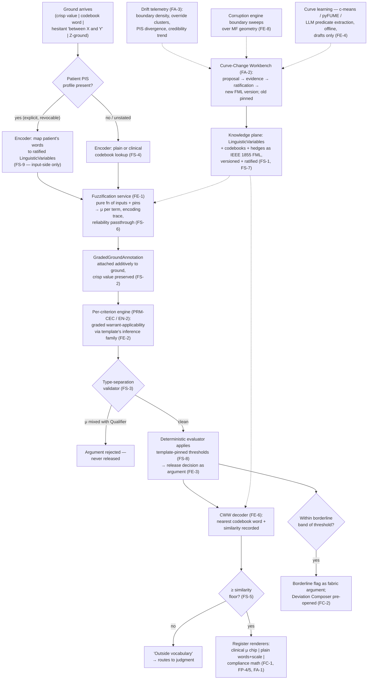

# Primer LWC — The Fuzzy Spine

> **Justification fabric.** The butterfly's body is the justification fabric plus the deterministic evaluator: *every claim is an argument; only arithmetic releases.* One argument object renders in three registers to three faces; the fabric is append-only, hash-chained, and version-pinned so any decision replays bit-for-bit. Two wings paint the body — the **Left Wing** (MAK-LWC) senses in degrees, the **Right Wing** (MAK-RWC) judges in systems — and their coordination is the flight (MAK-MIF). The host is **MAK-FFC v1.1**: no primer here relaxes a corpus MUST. Regulatory content is governed by **REG-POSTURE v1.0** via **MAK-ANT** — assume inclusion, glass-box as the design target, ASSUME-REG-001..007 open pending counsel. This primer's position: *the linguistic layer of the knowledge plane — a governed, versioned vocabulary of graded clinical meaning that annotates grounds and warrant-applicability, never belief; native to the J-1 deterministic runtime, and structurally absent from J-3.*

## LWC1. What this is

The fuzzy spine is one new plane inside the MAK-FFC architecture: a **linguistic layer** in the knowledge plane whose unit is the *LinguisticVariable* — a named clinical vague term ("elderly", "elevated BP", "severe pain") with its universe of discourse, term set, membership functions, permitted hedges, authorship, evidence backing, ratification record and version, serialised in IEEE 1855-2016 FML (FS-1). Its per-face expression is the *codebook* — the ratified vocabulary each register may speak (FS-4) — and its runtime is a pure, versioned fuzzification service (FE-1) whose output is μ-vectors pinned to membership-function versions, attached to grounds as additive annotation (FS-2). Its defining property, and the corpus's cardinal law: **fuzzy machinery grades meaning, never belief** (A1, FS-3). μ lives on grounds and warrant-applicability; probability and conformal coverage own the Qualifier; nothing fuzzy releases to a face except through the deterministic evaluator as argument content (FE-3, MAK-FFC SPINE-7). It is deliberately not a learned component — it carries zero learned parameters (A4), which is why it may sit inside the J-1 runtime at all.

*Trace: MAK-LWC Thesis; Part 1 axioms A1–A4; Part 2 layered figure; FS-1, FS-2, FS-3, FS-4, FE-1, FE-3.*

## LWC2. Scope

**In scope** — the six MAK-LWC requirement families this primer owns:

- **FS-1..9 · Fuzzy Spine.** LinguisticVariable artifacts and FML serialisation (FS-1); μ-vector grounds annotation, pinned and additive (FS-2); end-to-end type separation with a rejecting validator (FS-3); per-register codebooks from one meaning set (FS-4); the guaranteed linguistic round trip with similarity floor and "outside vocabulary" routing (FS-5); the Z-ground schema for reliability-bearing self-report (FS-6); ratified hedge operators (FS-7); every release-converting threshold living in the GenericArgument template (FS-8); patient-owned personalised-semantics profiles, input-side only (FS-9).
- **FC-1..7 · Clinician Face, fuzzy-scoped.** Graded criterion chips (FC-1); the borderline flag as a fabric argument (FC-2); separated applicability and belief channels (FC-3); ratified trend descriptors (FC-4); accessibility floor for μ encodings (FC-5); prohibited-vocabulary lint on microcopy (FC-6); fuzzy-specific face evaluation measures (FC-7).
- **FP-1..8 · Patient Face, fuzzy-scoped.** Linguistic intake as first-class data (FP-1); the reliability dial (FP-2); explicit, revocable PIS calibration (FP-3); the membership-scale visual (FP-4); plain-register words-and-pictures with no belief-language (FP-5); low-resource linguistic-primary profiles (FP-6); release discipline inheriting MAK-FFC PF-8 (FP-7); linguistic-equity evaluation (FP-8).
- **FA-1..7 · Auditor Face, fuzzy-scoped.** Membership math on demand (FA-1); the Curve-Change Workbench as the sole curve-change path (FA-2); semantic drift telemetry that informs but never triggers (FA-3); the versioned graded-state compliance projection (FA-4); FML diffs with sentinel-replay impact preview (FA-5); boundary-sweep findings queue (FA-6); governed clinician-level lenses (FA-7).
- **FE-1..9 · Engines, fuzzy plane.** Pure fuzzification service (FE-1); inference and defuzzifier as template metadata (FE-2); grades land only as warrant-applicability content (FE-3); curve learning as proposal-only (FE-4); one-directional, double-counting-safe coupling to the Bayesian engine (FE-5); the CWW render path as the single linguistic logic (FE-6); trigger-gated interval type-2 (FE-7); the corruption engine's boundary-sweep class (FE-8); vectorised, budgeted runtime cost (FE-9).
- **FX-1..3 · Cross-cutting.** Standards bindings (FX-1); J-tier placement (FX-2); the validation harness inside the evaluation firewall (FX-3).

**Out of scope** — each exclusion names its owner:

- Diagnostic probability, priors, likelihood ratios and posteriors (Primer A — the engine; FE-5 governs only the one-directional coupling map). Conformal coverage and set construction (Primer F). The Qualifier itself is never fuzzy territory (FS-3).
- Which GenericArgument applies, and its release evaluation (PRM-CEC — the engine plane's deterministic evaluator; MAK-FFC SPINE-7). This primer supplies graded applicability *into* the evaluator and reads thresholds *from* the pinned template (FS-8, FE-3); it never evaluates or releases.
- Rendering surfaces and interaction design beyond the fuzzy-specific components inventoried in LWC3 (PRM-HDC, PRM-TXC, PRM-ABC for face law; PRM-LBP, PRM-PRB for UI). FC/FP/FA here are fuzzy-scoped families and do not substitute for MAK-FFC's CF/PF/AF or the face primers' families.
- The knowledge-plane substrate — versioning, signing, the PR gateway through which FML artifacts enter (Primer D and Primer B; MAK-FFC EN-3 guideline-compiler path). This primer defines *what* a LinguisticVariable is; the registry defines *how* any knowledge-plane artifact is admitted and pinned.
- Generic corruption-engine machinery (Primer G). This primer contributes one perturbation class — boundary sweeps over membership geometry (FE-8) — and consumes its findings (FA-6).
- Regulatory classification and intended-purpose wording (PRM-ANT; REG-POSTURE v1.0). FX-2 records the J-tier consequence; it does not argue the classification.
- Value-to-weight mappings and preference elicitation (MAK-FFC PF-3 exclusively; FS-9 is confined to *encoding a patient's own words*).

*Trace: MAK-LWC Part 0 scope statement; FS-3, FS-8, FS-9, FE-3, FE-5; Appendix A census.*

## LWC3. Breadth and depth of content required

Forty-three requirements (FS 9 · FC 7 · FP 8 · FA 7 · FE 9 · FX 3; 35 MUST, 7 SHOULD, 1 MAY), of which the component inventories in MAK-LWC Parts 3–5 enumerate **fifteen named components** across the three faces: five clinician (Graded Criterion Chips, Borderline Flag, Applicability Column, Trend Descriptors, MDT Band View), five patient (Linguistic Intake Controls, Reliability Dial, Personal Scale Calibration, Membership Scale Visual, Plain Trend Cards), five auditor (Membership Math View, Curve-Change Workbench, Semantic Drift Telemetry, Boundary-Sweep Findings, Graded-State Compliance Projector).

To be real rather than a demo, the layer needs: **at least one clinical domain's LinguisticVariables ratified end to end** — MAK-LWC's phased plan (LW-P0) names one guideline domain's templates carrying FS-8 thresholds as the exit gate; **three codebooks** (clinical, plain, compliance) derived from that one meaning set (FS-4); **a ratified hedge inventory** kept deliberately small (FS-7); **a golden linguistic corpus per LinguisticVariable** with expert-labelled expected term assignments (FX-3 i), and **a ratified round-trip word-recovery floor** (FX-3 ii, FS-5). The corpus is explicit that the field's validation evidence is missing — μ-misreading rates in live decision UIs are unmeasured (Open research agenda) — so FC-7's pass ceiling must be ratified *before* pilot, from a baseline study this component runs.

Depth constraint from the corpus: the Mākoha stack is the reference implementation context, not a constraint (Part 0) — the layer must be specifiable without assuming any particular engine, which is why every threshold lives in the template (FS-8) and every method choice in template metadata (FE-2).

*Trace: MAK-LWC Appendix A; Parts 3–5 component inventories; Part 7 phased execution plan LW-P0; FX-3; Open research agenda.*

## LWC4. Building in a silo

Everything in the linguistic layer proper can be built with no dependency on any other primer's output, because FE-1 defines it as a pure function of inputs and pins:

- **LinguisticVariable schema + FML pipeline** (FS-1, FX-1). Inputs mockable: a hand-authored FML file for one domain. Stub: the registry PR gateway (Primer D) — write to a local signed directory with the same hash-manifest shape.
- **Fuzzification service** (FE-1) implementing the contract in MAK-LWC Part 6 verbatim: `CrispOrLinguisticGround × LinguisticVariable[] → GradedGroundAnnotation`. Property-test monotonicity, boundary values, hedge composition against the golden corpus. No upstream needed.
- **Type-separation validator** (FS-3). A schema validator over the ActualArgument shape that rejects any object mixing μ, activation, posterior, coverage or Z-reliability. Stub: the `cdss-spine` argument schema (CONTRACT-ARG-1, Proposed per Primer A §A10) — until pinned, validate against a local copy and record the pin as a placeholder.
- **Codebooks and the CWW encoder/decoder** (FS-4, FS-5, FE-6). The decoder with similarity floor is a confirmed build (MAK-LWC §9.6); it needs only the FML artifact and a codebook file.
- **Z-ground schema** (FS-6) and **PIS profile store** (FS-9): data-plane schemas, testable in isolation; the "unstated ≠ sure ≠ unsure" rule (FP-2) is a unit test.
- **Boundary-sweep generator** (FE-8): given an FML artifact, emit adversarial cases across supports, crossover points and threshold neighbourhoods. Stub: Primer G's rulebook (R8) — emit in G's perturbation-function shape so the class slots in later.
- **FML diff + sentinel replay** (FA-5): diff two FML versions; replay a fixture decision set under both; enumerate flips. Needs only two FML files and a fixture.

What cannot be built in the silo: the three face renderers (they depend on PRM-HDC/TXC/ABC surfaces), the Curve-Change Workbench's ratification workflow (depends on MAK-FFC AF-5's governance roles), the FE-5 coupling map (depends on Primer A's likelihood schema), and semantic drift telemetry (depends on live override and PIS aggregates). These are LWC5 edges.

*Trace: MAK-LWC Part 6 fuzzification service contract; FE-1; §9.6 confirmed build list; LW-P0.*

## LWC5. Folding it in

Integration contract — consumes and emits, with the counterpart edge named.

**Consumes**

| From | What | Interface | Counterpart edge |
|---|---|---|---|
| Primer B / Primer D (knowledge plane) | Ratified LinguisticVariable artifacts, codebooks, hedge inventory — as signed, versioned FML entering through the registry PR gateway (MAK-FFC EN-3) | Registry serving API; version pins from R1 | Primer D §D2 in-scope "fragment schema … content-as-code repo and PR approval gateway"; Primer B §B1 knowledge-plane artifacts. **Checked:** D admits *fragments*; a LinguisticVariable is a new artifact type — see finding LWC-F2 |
| PRM-CEC (engine plane) | Pinned GenericArgument template carrying FS-8 thresholds and FE-2 method metadata | Template read at evaluation time | MAK-FFC EN-2 per-criterion engines; PRM-CEC owns template resolution |
| Data plane (grounds preparation) | Crisp, linguistic, hesitant or Z-ground inputs with modality recorded (FP-1, FP-2) | `FuzzificationService.inputs` | PRM-TXC / PRM-PRB intake controls write the ground; this layer annotates it |
| Patient (via PRM-TXC / PRM-PRB) | PIS calibration profile, explicit and revocable (FS-9, FP-3) | Patient-owned data-plane record | PRM-TXC owns consent and custody; this layer reads the profile only at encode time |
| Primer A (engine) | Nothing at runtime. The coupling is one-directional *toward* A (FE-5) | — | Primer A §A2 out-of-scope "free-text interpretation … the engine consumes concepts only" — graded grounds are a new concept shape; see finding LWC-F3 |

**Emits**

| To | What | Interface | Counterpart edge |
|---|---|---|---|
| Data plane | `GradedGroundAnnotation` — μ-vectors, encoding trace, reliability passthrough, pins — attached additively to the ground (FS-2) | FHIR Observation components/extensions referencing FML artifact + version (FX-1) | MAK-FFC SPINE-4 data-plane bindings |
| PRM-CEC (per-criterion engines → deterministic evaluator) | Graded warrant-applicability as ActualArgument content and evaluation-trace entries (FE-3); decode traces (FE-6) | Argument object fields typed non-coercibly (FS-3) | MAK-FFC SPINE-1/2/7; PRM-CEC evaluator applies FS-8 thresholds |
| Primer A (engine) | Graded grounds as likelihood inputs under a template-declared coupling map, never both crisp and graded into one likelihood (FE-5) | Coupling map is template content; replays with it | Primer A §A8 trace schema `findings[]` has `status: present/absent/uncertain` — no μ field; see finding LWC-F3 |
| PRM-HDC / PRM-TXC / PRM-ABC | Register-specific codebook words and μ graphics via the single CWW render path (FE-6); the borderline flag as a fabric argument (FC-2) | Face renderers call the decoder; they never implement private linguistic logic | Face primers' rendering law consumes; PRM-HDC HR/HW families |
| Primer G (corruption engine) | The boundary-sweep perturbation class over every ratified MF (FE-8) | Perturbation functions in G's rulebook shape (R8) | Primer G rulebook; findings return as rebuttals (FA-6, MAK-FFC EN-5) |
| PRM-ABC (auditor face) | Membership math traces (FA-1); drift telemetry per LinguisticVariable (FA-3); FML diffs and flip previews (FA-5); the versioned compliance projection (FA-4) | Read model over fabric + telemetry | PRM-ABC AL/AR/AG families; MAK-FFC AF-5 governs ratification |
| Primer I (living evaluation) | Fuzzy property subset: monotonicity where MF is monotone; round-trip floor; flip-count under perturbation (FX-3) | Property registry rows (R7) | Primer I mechanisms 1–2 |

**Fabric binding (MAK-FFC).** This component supplies *grounds gradedness* (μ-vectors on grounds, SPINE-1's grounds slot) and *warrant-applicability grades* (graded preconditions inside GenericArguments, MAK-FFC EN-2). It never supplies the Qualifier (FS-3) and never releases (FE-3). Coordination doctrine: MAK-MIF beat 1 (the borderline patient — graded criterion fit routes to judgment), beat 2 (the full translation loop — linguistic in, linguistic out), beat 3 (meaning under governance — the curve-change workbench), beat 6 (reliability-aware listening — Z-grounds).

*Trace: MAK-LWC Part 2 layered figure; Part 6 service contract; FS-2, FS-3, FE-3, FE-5, FE-6, FE-8, FX-1; MAK-MIF §03 beats 1/2/3/6; Primer A §A2, §A8; Primer D §D2.*

## LWC6. Definition of done

Per release, all of:

1. **FS conformance suite green** — every FS-1..9 MUST has an executable check; FS-3's validator rejects a fixture set of mixed-type arguments with zero passes (MAK-LWC LW-P0 exit).
2. **Round-trip floor ratified and met** — encode→decode word-recovery rate on the golden corpus at or above the ratified floor; outputs below the similarity floor surface as "outside vocabulary", never as invented words (FS-5, FX-3 ii).
3. **Sentinel replay clean** — a fixture decision set replays identically under the pinned FML version; any curve-change proposal ships with its flip enumeration (FA-5).
4. **Thresholds in templates, not code** — a static check finds no α-cut, activation floor or similarity floor outside a pinned GenericArgument template (FS-8).
5. **Boundary-sweep class delivered to G** and any unacknowledged cliff finding blocks the release per MAK-FFC EN-5 (FE-8, FA-6).
6. **Tier denylist holds** — the fuzzy-inference namespaces appear on the J-3 SBOM denylist and GPP-CONF negative tests pass (FX-2; MAK-J3 GPP-8; MAK-ELSM §08).
7. **Coupling hygiene** — no fixture passes where a ground's crisp value and its μ both enter one likelihood, and no posterior feeds a μ (FE-5).
8. **No silent calibration** — PIS profiles change only by explicit patient action; a leakage audit finds no PIS influence on thresholds, weights or another patient's encoding (FS-9, FP-3, FX-3).
9. **Copy lint clean** — clinician and plain codebooks pass the prohibited-vocabulary lint; no belief-language attaches to μ anywhere in copy, tables or examples (FC-6, FP-5; MAK-LWC Appendix B check 5 applied to the product).
10. **Face-study gates** for releases touching a face: FC-7's μ-misreading ceiling met with independent clinicians; FP-8 linguistic-equity baseline recorded (LW-P1, LW-P2 exits).

*Trace: MAK-LWC Part 7 phased execution plan exit gates; FS-3, FS-5, FS-8, FS-9, FE-5, FE-8, FX-2, FX-3, FC-6, FC-7, FP-5, FP-8; Appendix B.*

## LWC7. Internal operations diagram



## LWC8. Execution layer

**Fuzzification service contract** (verbatim from MAK-LWC Part 6, the executable spec):

```text
interface FuzzificationService {
  inputs:  CrispOrLinguisticGround      // value | codebook word | hesitant expression | Z-ground
  context: LinguisticVariable[]         // pinned versions, jurisdiction lineage resolved
  emit():  GradedGroundAnnotation {
    memberships: { term: string, mu: number }[]   // per applicable term
    encoding:    EncodingTrace                     // modality, PIS profile version if applied
    reliability: ZReliability | "unstated"         // FS-6 passthrough, never transformed
    pins:        VersionSet                        // MF versions, codebook version
  }
}
```

**Data-plane binding (FX-1):** gradedness travels as FHIR `Observation` components/extensions referencing the FML artifact identifier and version; Z-ground reliability as a paired component; nothing fuzzy stored without pins. **Serialisation:** IEEE Std 1855-2016 FML canonical; IEC 61131-7 FCL and FIS import-only.

**First executable properties (seed for the I registry, fuzzy subset — FX-3, FE-1):** (1) ∀ monotone MF: input ordering preserved in μ. (2) Boundary values of each support yield μ ∈ {0, 1} exactly. (3) Hedge composition is deterministic and matches the ratified hedge algebra. (4) encode(decode(x)) recovers x's codebook word at or above the ratified floor. (5) ∀ argument: no field typed μ/activation coexists with a Qualifier-typed field in the same slot (FS-3). (6) Perturbing an MF parameter within the ratified band produces the flip count the FA-5 preview enumerated, exactly. (7) A Z-ground with reliability "unstated" produces identical downstream treatment to one with the field absent (FP-2). (8) Re-annotation under a new MF version leaves the prior annotation intact (FS-2).

**Asset library** — every requirement family maps to at least one row. Seeded from MAK-LWC Part 9 (verified 30 Aug – 1 Sep 2026) and MAK-ELSM v1.1; **every row re-verified this run, 2026-09-02**, method stated. Verdict vocabulary per MAK-ELSM: ADOPT / ADAPT / STUDY / BUILD / WATCH; **DEAD-REPLACE** added for archived assets.

| Asset | Type | Satisfies | Licence | Currency | Verified (method · date) | Verdict |
|---|---|---|---|---|---|---|
| IEEE Std 1855-2016 — Fuzzy Markup Language | standard | FS-1, FX-1, FA-5 | IEEE | 2016 current; **revision under discussion** (StandICT working group) | IEEE Xplore 7479441; StandICT revision page · web · 2026-09-02 | **ADOPT as format; WATCH revision** |
| [sotillo19/JFML](https://github.com/sotillo19/JFML) | library (Java) | FS-1 parse/build/import/export | per repo (verify) | IEEE Access 2018; Univ. Córdoba | MAK-LWC §9.2 (2026-08-30); repo existence confirmed via search · 2026-09-02 | **ADOPT as reference implementation** |
| [cmencar/py4jfml](https://github.com/cmencar/py4jfml) | library (Python wrapper) | FS-1 from Python | not surfaced (verify) | FUZZ-IEEE 2019; **repo located this run** — resolves MAK-LWC landmine "activity not verified"; commit history blocked to fetch | GitHub search + IEEE Xplore 8858811 · 2026-09-02 | **STUDY — repo exists; activity unverified; fetch commit log before dependency** |
| [fuzzylite/pyfuzzylite](https://github.com/fuzzylite/pyfuzzylite) | library (Python, vectorised) | FE-1, FE-2, FE-9 | GPL-3.0 + commercial dual | **v8.0.6** (14 Sep; 8.0.5 Jun) — ~12 months since last release | GitHub releases page fetched · 2026-09-02 | **ADAPT — licence review before LW-P0 freeze** |
| [scikit-fuzzy](https://github.com/scikit-fuzzy/scikit-fuzzy) | library (Python) | LW-P0 spikes; FE-4 c-means default | BSD | **v0.5.0 · 22 Aug 2024** — 2 years since release; repo active per LWC | PyPI fetched · 2026-09-02 | **ADOPT (prototyping + c-means); WATCH release cadence** |
| [aresio/simpful](https://github.com/aresio/simpful) | library (Python) | FS-1 authoring surface; FE-2 templates | AFL-3.0 | maintained; IJCIS 2020 | MAK-LWC §9.1 (2026-08-30) — carried forward, 3 days old | **ADOPT** |
| [Haghrah/PyIT2FLS](https://github.com/Haghrah/PyIT2FLS) | library (Python) | FE-7 (trigger-gated) | MIT | v0.8.6 Apr 2025 | MAK-LWC §9.1 — carried forward | **STUDY — gated on FE-7 trigger** |
| [LUCIDresearch/JuzzyPython](https://github.com/LUCIDresearch/JuzzyPython) | library (Python) | FE-7 general type-2 semantics | **none surfaced** | active, 172 commits | MAK-LWC §9.1 — carried forward | **STUDY — licence must be confirmed before any use beyond reading** |
| [FisPro](https://github.com/cran/FisPro) | tool + R pkg | FS-1 drafting; FA-2 workbench design reference | per CRAN | v1.1.4; INRAE, long-maintained | MAK-LWC §9.2 — carried forward | **STUDY/ADOPT (authoring-side)** |
| [CaroFuchs/pyFUME](https://github.com/CaroFuchs/pyFUME) | library (Python) | FE-4 draft-curve generator | GPL-3.0 | 208 commits; FUZZ-IEEE 2020 | MAK-LWC §9.3 — carried forward | **ADAPT — offline only; GPL review** |
| [Valdecy/pyDecision](https://github.com/Valdecy/pyDecision) | library (Python) | FA-5 impact ranking; MDT scoring (FC MDT view) | per repo | 395 commits, active | MAK-LWC §9.4 — carried forward | **ADAPT — no hesitant-fuzzy variants; FP-1 HFLTS remains BUILD** |
| [SamvelMK/FCMpy](https://github.com/SamvelMK/FCMpy) | library (Python) | guideline-compilation authoring aids | per repo | PeerJ CS 2022 | MAK-LWC §9.2 — carried forward | **STUDY (authoring-time only)** |
| ANFIS lineage (twmeggs/anfis, PyTorch ports) | repos | FE-4 alternatives | various | **dormant** per LWC | MAK-LWC §9.3 | **STUDY — literature with code** |
| **CWW decoder with similarity floor** | build | FS-5, FE-6 | — | no OSS precedent (MAK-LWC §9.6; targeted search) | LWC §9.6 confirmed; spec = Mendel perceptual-reasoning papers | **BUILD** |
| **Z-ground schema + capture** | build | FS-6, FP-2 | — | no maintained Z-number library in any ecosystem | LWC §9.6 confirmed | **BUILD — spec from Aliev / Wang / Alam review** |
| **Membership-credibility & drift telemetry** | build | FA-3 | — | Pei et al. 2024 supplies mathematics; no implementation | LWC §9.6 confirmed | **BUILD** |
| **PIS calibration service** | build | FS-9, FP-3 | — | Li et al. 2016 model; no public reference implementation | LWC §9.6 confirmed | **BUILD — consistency-driven optimisation reproducible from paper** |
| **FML-native fuzzification microservice** | build (assembled) | FE-1 | — | assembled from pyfuzzylite/simpful + FML | LWC §9.6 | **BUILD** |
| **Curve-Change Workbench** | build (assembled) | FA-2, FA-5 | — | FisPro as authoring reference; governed service itself is a build | LWC §9.6 | **BUILD** |
| **Type-separation validator** | build | FS-3 | — | schema-level; depends on CONTRACT-ARG-1 pin | this primer LWC4 | **BUILD** |
| **Boundary-sweep perturbation class** | build (G extension) | FE-8, FA-6 | — | emits in Primer G rulebook shape | this primer LWC4; Primer G | **BUILD** |
| Fan et al. 2026 — LLM fuzzy predicates + symbolic verification | research | LW-P5 evaluation bar | — | **no public code confirmed** | MAK-LWC §9.7 | **WATCH — do not schedule LW-P5 against availability** |
| Demo-grade medical fuzzy repos (e.g. Fuzzy_Diabetes_Detection) | repos | onboarding; negative examples | various | student-grade | MAK-LWC §9.5 | **STUDY — never import governance-free pattern (FS-1 prohibition)** |

**Coverage check (P5):** FS-1..9 → FML standard, JFML/py4jfml, simpful, FisPro, validator build, Z-ground build, PIS build, decoder build. FC-1..7 → decoder build (render path), pyDecision (MDT), face-study instrument (FX-3). FP-1..8 → Z-ground build, PIS build, decoder build; HFLTS/ELICIT encoding = BUILD (no OSS). FA-1..7 → workbench build, FML diff (JFML), drift-telemetry build, pyDecision. FE-1..9 → pyfuzzylite, simpful, scikit-fuzzy, pyFUME, PyIT2FLS/JuzzyPython, boundary-sweep build. FX-1..3 → IEEE 1855, FHIR bindings (Primer D infrastructure), validation harness (build, inside Primer C's firewall). **43/43 covered; 9 rows are BUILD.**

**Sourcing landmines carried forward from MAK-LWC, with this run's status:** licence gradient across the stack (GPL dual / GPL-3.0 / AFL-3.0 / BSD / MIT) — route legal review before LW-P0 dependency freeze, *unchanged*; JuzzyPython licence not in repo, *unchanged*; Py4JFML — *repo now located (cmencar/py4jfml), activity still unverified*; Fan 2026 no public code, *unchanged*.

**Proposed tolerances (flag: clinical sign-off required):** round-trip word-recovery floor ≥ 0.95 on golden corpus; similarity floor for "outside vocabulary" routing ratified per LinguisticVariable, default 0.80 cosine-equivalent on term FOU; FC-7 μ-misreading ceiling ≤ 10% in the pre-pilot study (instrument to be built — Open research agenda); FE-9 per-decision fuzzy evaluation budget ≤ 5 ms p99 excluding I/O.

*Trace: MAK-LWC Part 6 contract; Part 9 §9.1–9.7 and landmines; FX-1, FX-3; MAK-ELSM verdict vocabulary; external verification as tabled.*

## Production topology annotation

*Per Architecture §11 and §14.5 (MET-1, Proposed):* the fuzzy layer enters at **L4 per DEC-05 ratification** and is "per DEC-05" at L5 — it has no L1–L3 presence in the architecture's capability matrix. MAK-LWC's own phased plan (LW-P0 … LW-P5) is component-internal and is *not* level-aligned; reconcile as follows: LW-P0 (linguistic layer, fuzzification service) may run in the harness as propose/test from L3 with no release-path exposure; LW-P1 onward (any face rendering of μ) waits for L4 entry and DEC-05. Tier pipeline applies in full from first release (Architecture §11.1). J-tier: native J-1, available J-2, structurally absent J-3 (FX-2). See finding LWC-F1.

## Register topology annotation

*Per Architecture §12 (R1–R28) and §14.3 (R29–R30, Proposed):* **Owns:** none. **Writes:** R1 (FML artifact and codebook version stamps on every annotation and decode trace); R2 (artifact manifest on every FML emit); R7 (fuzzy property subset, FX-3); R12 (curve-change adjudication records — FA-2 ratification and FA-5 flip enumerations are the change-control record); R25 (build evidence — this run's verification table). **Reads:** R1, R8 (G rulebook for boundary-sweep pairing, FE-8), R14 (lockfile pins), R30 (posture — FX-2 tier placement follows it). **Gap proposals:** GAP-LWC-001 — semantic drift telemetry (FA-3) has no register home; propose either an R13 extension (acceptance telemetry already carries clinician actions) or a new register; operator decision. GAP-LWC-002 — PIS profiles are patient-owned data-plane records, not register rows; confirm custody sits with PRM-TXC under MAK-FFC PF-3/PF-4, not with any register.

<!-- ECOSYSTEM-V2-BLOCK: LWC v1.0 -->
## LWC9. Build Execution Extension (Ecosystem v2.0)

**1. Mini-North-Star.** WHAT: the FML-native fuzzification service emitting `GradedGroundAnnotation`, the type-separation validator, the CWW decoder with similarity floor, and the fuzzy property suite. WHY: the linguistic layer that lets the fabric carry graded meaning without ever confusing fit with belief. Endpoint: enters at L4 per DEC-05 (Production topology annotation); LW-P0 harness spikes from L3. Derives from and cites SPINE §13.1 and MAK-FFC EN-2/EN-3.

**2. Doctrine classification.** Fuzzification, decoding, validation and property checks are arithmetic (zero learned parameters — A4); curve *learning* (FE-4) proposes; nothing here releases — release is PRM-CEC's evaluator applying FS-8 thresholds.

**3. Scoped recon register.**
| ID | Verify | Tag |
|---|---|---|
| RECON-LWC-001 | `cdss-spine` ActualArgument schema (CONTRACT-ARG-1) pinned with non-coercible μ / activation / Qualifier / Z-reliability types | E:REPO (cdss-spine tag) |
| RECON-LWC-002 | Registry PR gateway admits an FML artifact type (Primer D §D2 currently names *fragments*) — finding LWC-F2 | E:DOC D2, D8; E:REPO |
| RECON-LWC-003 | pyfuzzylite commercial-licence terms vs GPL-3.0 for a shipped runtime; pyFUME GPL exposure for the offline drafts pipeline | E:WEB required at ticket start |
| RECON-LWC-004 | py4jfml commit history and licence (blocked to fetch this run) | E:WEB |
| RECON-LWC-005 | DEC-05 ratification status and its conditions (Architecture §14.5) | E:DOC Arch §14; MET-2 queue |
| RECON-LWC-006 | Primer A `findings[]` schema extension for graded grounds (FE-5 coupling) — finding LWC-F3 | E:DOC A8; E:REPO cdss-engine |

**4. Work register seed (LW-P0-equivalent; schema per master v2 Phase 6; estimates ranged with confidence).**
```yaml
TASK-LWC-001:
  story: STORY-LWC-001 (a ground carries its graded meaning, pinned and replayable)
  component: fuzzy-core
  title: Implement FML-native fuzzification service per MAK-LWC Part 6 contract
  purpose_chain: {what: "pure service + property tests", why: "FE-1 is the layer's runtime; everything downstream consumes its annotation", endpoint_ref: "LW-P0 exit: FS-1..8 suite green; SPINE-NS WHY"}
  evidence_refs: [E:DOC MAK-LWC Part 6, FE-1, FS-2; RECON-LWC-001, RECON-LWC-003]
  definition_of_ready: ["one domain's FML artifact authored and signed locally", "runtime licence ruling recorded"]
  steps: ["load FML + pins", "encode by modality (crisp | word | hesitant | Z-ground)", "compute μ per term", "emit annotation with encoding trace + reliability passthrough", "property suite (LWC8 props 1–3, 7, 8)"]
  test_plan: "unit + property; golden corpus term-assignment agreement; failure case: unknown FML version hard-fails"
  observability: "per-call structured log with pins; counter fuzz.calls; latency histogram against FE-9 budget"
  definition_of_done: ["properties green", "identical inputs+pins → identical annotation (byte-equal)", "typed errors only"]
  estimate: {optimistic: 3d, likely: 5d, pessimistic: 9d, confidence: medium}
  depends_on: []
```
```yaml
TASK-LWC-002:
  story: STORY-LWC-001
  component: fuzzy-validator
  title: Type-separation validator over ActualArgument (FS-3)
  purpose_chain: {what: "schema validator rejecting any μ/activation ↔ Qualifier mixing", why: "the cardinal law needs a machine that enforces it", endpoint_ref: "LW-P0 exit; A1"}
  evidence_refs: [E:DOC FS-3, MAK-DOT §03; RECON-LWC-001]
  definition_of_ready: ["CONTRACT-ARG-1 pinned or local copy recorded as placeholder"]
  steps: ["type registry: μ, activation, defuzzified, posterior, coverage, Z-reliability as distinct non-coercible types", "validator over argument object", "fixture set of 30+ mixed-type arguments, all rejected"]
  test_plan: "zero false-accepts on mixed fixtures; zero false-rejects on clean fixtures"
  observability: "rejection log with offending field path"
  definition_of_done: ["fixture suite green", "wired as pre-release check in fabric CI (PRM-CEC hand-off)"]
  estimate: {optimistic: 2d, likely: 3d, pessimistic: 5d, confidence: high}
  depends_on: [TASK-LWC-001]
```
```yaml
TASK-LWC-003:
  story: STORY-LWC-002 (every fuzzy output decodes to a word a person recognises)
  component: fuzzy-cww
  title: CWW decoder with similarity floor and "outside vocabulary" routing (FS-5, FE-6)
  purpose_chain: {what: "codebook-pinned decoder emitting word + similarity into the trace", why: "confirmed BUILD — no OSS precedent; A3 round trip is a contract", endpoint_ref: "LW-P0 exit: round-trip floor ratified and met"}
  evidence_refs: [E:DOC FS-4, FS-5, FE-6, MAK-LWC §9.6; Mendel perceptual-reasoning papers]
  definition_of_ready: ["three codebooks for one domain derived from one LinguisticVariable set", "similarity metric and floor proposed for ratification"]
  steps: ["FOU resemblance metric", "nearest-word decode", "floor check → OOV routing", "decode trace emit"]
  test_plan: "round-trip on golden corpus ≥ floor; OOV fixtures never render a word"
  observability: "counter cww.oov_rate per LinguisticVariable — the FA-3 seed metric"
  definition_of_done: ["floor met", "no orphan output in fixture run", "single render path — face renderers have no private linguistic logic"]
  estimate: {optimistic: 4d, likely: 7d, pessimistic: 12d, confidence: low}
  depends_on: [TASK-LWC-001]
```

**5. Orchestration hooks.** `WF-LWC-1` release: build → FS conformance suite → round-trip floor → sentinel replay → boundary-sweep class handed to G (`EVT-LWC-1 fuzzy.sweep-class.emit`) → G suite → manifest emit (idempotent by FML artifact hash; retry 1; timeout 30m). Emits `EVT-LWC-2 fuzzy.release`, consumed by WF-SPINE-1 and PRM-CEC's template-pin refresh.

**6. Observer checkpoint spec.** At LW-P0 exit: FS suite results and round-trip floor evidence from CI artifacts; validator fixture run shows zero false-accepts. At L4 entry (DEC-05): FA-5 flip preview present for the first curve change; first drift-telemetry series flowing to the auditor read model. Admissible: R1, R7 run outputs, R12 adjudication records, CI artifacts.

**7. Implementer Contract binding.** Tickets execute under IMPL (SPINE §13.2). Component HALT triggers: any ticket that would (a) place a threshold in code or config rather than a template → HALT: FS-8; (b) render μ, activation or defuzzified value in belief vocabulary → HALT: A1/FS-3; (c) apply a PIS profile beyond encoding that patient's own inputs → HALT: FS-9; (d) admit a learned curve to runtime without workbench ratification → HALT: FE-4/FA-2.

**8. Gaps and register proposals.** GAP-LWC-001 (drift telemetry register home) and GAP-LWC-002 (PIS custody) as in the Register topology annotation. GAP-LWC-003 — Architecture §14.4 namespace law gains {FAB, UIC, UIP, GPP} but no fuzzy prefix; propose **FUZ** for build IDs (TASK-FUZ-n once ratified; TASK-LWC-n used here as interim). GAP-LWC-004 — Architecture §14.5 cites the fuzzy layer as "FZ-1..6"; on MAK-LWC ratification the FZ set is superseded (MAK-LWC frontmatter `absorbs`) and the row should cite MAK-LWC FS/FC/FP/FA/FE/FX; propose an additive erratum to §14.5.

<!-- MET-1 METAMORPHOSIS & HARDENING ANNEX — APPENDED 2026-09-02. Pure append per X1 discipline. Status: Proposed (ratification via MET-2 decision queue); Hardening state: PENDING in R29 — nothing here is HARDENED. -->
## LWC10. Metamorphosis & Hardening Annex — fabric binding + validity findings + updated execution block

**Fabric binding (MAK-FFC).** Restated from LWC5: this component supplies grounds gradedness and warrant-applicability grades; never the Qualifier; never a release. Coordination doctrine: MAK-MIF beats 1, 2, 3, 6.

**Validity findings (P4 — recorded, not resolved; host law governs; operator decides).**

- **LWC-F1 · Level alignment (P4-e, Architecture ↔ MAK-LWC).** Architecture §14.5 enters the fuzzy layer at L4 "per DEC-05 ratification" with no L1–L3 presence. MAK-LWC Part 7's phased plan (LW-P0..P5) is level-agnostic and its LW-P1 (clinician gradedness) would render μ to a face. Not a contradiction — the corpus is the component's internal plan, the architecture is the programme's entry schedule — but the two must be pinned together: proposed reconciliation is in the Production topology annotation (LW-P0 as harness propose/test from L3; face rendering waits for L4). *Cites: Arch §14.5 row "Fuzzy layer"; MAK-LWC Part 7 table.*
- **LWC-F2 · Artifact type at the registry gateway (P4-e, MAK-LWC ↔ Primer D).** FS-1 makes the Guideline Compiler path (MAK-FFC EN-3) the only entry for LinguisticVariables, and they must be signed, versioned knowledge-plane artifacts. Primer D §D2 scopes the PR gateway and release gates to *fragments* with dose bounds and AMT coding. A LinguisticVariable is not a fragment. Either D's fragment schema gains an artifact-type discriminator admitting FML, or the compiler (`cdss-compiler`, Arch §14.2) becomes the gateway for knowledge-plane artifacts with D's signing reused. *Cites: MAK-LWC FS-1; Primer D §D2 in-scope; Arch §14.2 `cdss-compiler` row.* Operator ruling requested; default proposal: artifact-type discriminator in D, because the five gates (hash, tier, dates, bounds, context) apply to FML artifacts unchanged except "bounds", which for an MF is its support.
- **LWC-F3 · Engine input shape (P4-e, MAK-LWC ↔ Primer A).** FE-5 couples graded grounds into likelihood inputs under a template-declared map. Primer A §A8's trace schema types findings as `status: present | absent | uncertain` with no μ field, and §A2 scopes the engine to consuming "concepts only." Not a contradiction — FE-5 is one-directional and template-governed, exactly the shape A permits for new inputs — but `findings[]` needs an optional `graded: {term, mu, fml_version}` extension, and the coupling map needs a home in the template schema PRM-CEC owns. *Cites: MAK-LWC FE-5; Primer A §A2, §A8.*
- **LWC-F4 · Register home for drift telemetry (P4-i).** FA-3 mandates continuous per-LinguisticVariable telemetry as workbench evidence; no register in Arch §12.2 or §14.3 holds it. GAP-LWC-001.
- **LWC-F5 · External currency (P4-x).** IEEE 1855-2016 has a revision under discussion (StandICT); FS-1/FX-1 cite the 2016 edition — correct today, WATCH. scikit-fuzzy's last release is August 2024; adopted for prototyping and c-means only, where a two-year cadence is acceptable; not on the runtime path. py4jfml located but its activity is unverified — STUDY until RECON-LWC-004 closes.

| Execution field | Content |
|---|---|
| Execution purpose | Run the fuzzy spine as the fabric's grounds-gradedness and warrant-applicability supplier — pure, pinned, decoded to ratified words, never the Qualifier, never a release |
| Inputs / prerequisites | Ratified FML artifacts + codebooks via the knowledge-plane gateway (LWC-F2 ruling); CONTRACT-ARG-1 pin (RECON-LWC-001); pinned GenericArgument templates carrying FS-8 thresholds and FE-2 method metadata (from PRM-CEC); grounds with modality recorded (from PRM-TXC/PRM-PRB intake); optional PIS profile (patient-owned) |
| Steps | 1 ingest ground → 2 resolve pins (FML, codebook, PIS version) → 3 encode by modality → 4 fuzzify (FE-1) → 5 attach annotation additively (FS-2) → 6 hand graded applicability to per-criterion engines (EN-2) → 7 validator (FS-3) → 8 evaluator applies template thresholds (FS-8, PRM-CEC) → 9 decode to codebook word with similarity, OOV routing (FS-5, FE-6) → 10 render via single path to faces; borderline flag as argument (FC-2) → 11 boundary-sweep class to G (FE-8); drift telemetry to workbench (FA-3) |
| Tools / repos / environments | Proposed repo `cdss-fuzzy` (service + validator + decoder; FML artifacts live in the knowledge plane, never here); pyfuzzylite or simpful runtime per RECON-LWC-003 licence ruling; JFML/py4jfml for FML I/O; scikit-fuzzy + pyFUME offline for FE-4 drafts; FisPro as workbench authoring reference. J-3 build: `cdss-fuzzy` inference namespaces on the SBOM denylist (FX-2) |
| Outputs & acceptance | `GradedGroundAnnotation` per ground; graded warrant-applicability + decode traces in the argument; borderline-flag arguments; boundary-sweep class; drift series. Acceptance = LWC6 items 1–9 **plus** fabric-replay test (annotation + decode replay byte-identical from pins) and the FS-3 refusal test (a mixed-type argument cannot proceed) |
| Dependencies / handoffs | Upstream: knowledge plane (B/D or compiler per LWC-F2), PRM-CEC templates, intake (TXC/PRB). Downstream: PRM-CEC evaluator, Primer A via FE-5 map (LWC-F3), faces via decoder, G via sweep class, PRM-ABC via math view / telemetry / diffs, Primer I via property subset. Contract changes are spine PRs that visibly break this consumer |
| Evidence to collect | R1 pins on every annotation and decode trace; R7 fuzzy property runs; R12 curve-change adjudications with FA-5 flip enumerations; R25 this run's verification table; FC-7 / FP-8 study results (firewalled, FX-3) |
| Failure handling / rollback | "Outside vocabulary" is a legal output (FS-5) and routes to judgment; fuzzification unavailable → crisp-only degrade with I-5 contract violation logged (graded paths must exist per template — FC-1 render mandate is not waived, so the degrade is visible); rollback = redeploy prior FML pin (R14) — old versions remain pinned to their decisions (FA-2) |
| Ownership & status | Repo: `cdss-fuzzy` (proposed); component owner [NEEDS DEFINITION]. Status: New (Proposed) — enters at L4 per DEC-05 |
| Source & research traceability | MAK-LWC v1.1 Parts 1–9 and Appendices A–B (all 43 IDs); MAK-FFC v1.1 SPINE-1/2/3/4/5/7/8, EN-2/3/5, CF-2/3/7, PF-2/3/5/6/8, AF-3/5/7/8, XC-1/3/4; MAK-DOT FZ-1..6 (absorbed, Part 8 map); MAK-MIF beats 1/2/3/6; MAK-J3 GPP-8; MAK-ELSM §08 denylist and verdict vocabulary; Primer A §A2/A8/A10; Primer D §D2; Primer G rulebook; Primer I mechanisms 1–2; Architecture §11, §12.2, §14.2–14.5; external verification 2026-09-02 as tabled in LWC8 |

---

## Appendix A — ID census (additive)

Declared by MAK-LWC v1.1 Appendix A: **43**. Mapped in this primer: **43**.

| Family | Declared | Mapped in | Gap |
|---|---|---|---|
| FS-1..9 | 9 | LWC2 in-scope; LWC4; LWC5; LWC6 items 1, 2, 4, 8; LWC8 | none |
| FC-1..7 | 7 | LWC2; LWC5 (FC-2 emit); LWC6 items 9, 10; LWC8 | none |
| FP-1..8 | 8 | LWC2; LWC5 (FP-1/2 consume); LWC6 items 8, 9, 10; LWC8 | none |
| FA-1..7 | 7 | LWC2; LWC5 (emit to PRM-ABC); LWC6 items 3, 5; LWC8 | none |
| FE-1..9 | 9 | LWC2; LWC4; LWC5; LWC6 items 5, 7; LWC8 | none |
| FX-1..3 | 3 | LWC2; LWC5 (FX-1 binding); LWC6 items 6, 8; LWC8 | none |

Every ID appears in LWC2 in-scope; release-testable MUSTs appear in LWC6; every family has at least one LWC8 asset row. Absorbed FZ-1..6 are cited via MAK-LWC Part 8 only; not re-minted.

## Appendix B — Self-audit checks (additive) — run 2026-09-02

1. **Section skeleton** — all eleven exemplar-A sections present in order (LWC1–LWC8, Production topology, Register topology, LWC9, LWC10). **Pass.**
2. **Epigraph** — CG-1 text verbatim, position clause present. **Pass.**
3. **ID census parity** — 43 declared, 43 mapped (Appendix A). **Pass.**
4. **Scope-out ownership** — every LWC2 exclusion names an owner. **Pass** (7 exclusions, 7 owners).
5. **Trace presence** — every section LWC1–LWC8 ends with a trace line or carries inline IDs. **Pass.**
6. **Asset coverage** — every requirement family has ≥1 LWC8 row; every row has a verification method and date. **Pass** (23 rows; 9 BUILD).
7. **Axiom compliance** — nothing in this document renders μ, activation or a defuzzified value as probability or confidence (A1 applied to the primer). **Pass** — LWC8 tolerances use "floor", "ceiling", "budget", never "confidence".
8. **Subordination** — no statement relaxes a MAK-FFC or MAK-LWC MUST; findings are recorded, not resolved. **Pass.**
9. **Cross-doc resolution** — every MAK-FFC, MAK-LWC, MAK-MIF, MAK-J3, MAK-ELSM ID cited resolves in its volume; every Primer A/D/G/I section cited exists. **Pass** (checked against staged files).
10. **Additive discipline** — v1.0; no prior text. Change policy states additive-only. **Pass.**

## Assumptions & confidence

- **Assumed:** DEC-05 will ratify fuzzy-layer entry at L4 substantially as Arch §14.5 proposes. *Confidence: medium* — it is marked Proposed.
- **Assumed:** LWC-F2 resolves by extending Primer D's artifact schema rather than by routing FML through `cdss-compiler` alone. *Confidence: low-medium* — either is coherent; default stated.
- **X8 verdicts:** pyfuzzylite ADAPT *high* (release confirmed this run); scikit-fuzzy ADOPT-prototyping *high*; simpful / pyFUME / PyIT2FLS / FisPro / pyDecision / FCMpy *medium* — carried forward from a 3-day-old verification, not re-fetched this run; py4jfml STUDY *medium* — existence confirmed, activity not; JuzzyPython *low* until licence confirmed; all BUILD verdicts *high* — MAK-LWC's targeted search and this run's found no precedent.
- **Tolerances in LWC8** are proposals flagged for clinical sign-off; none is a corpus number.
