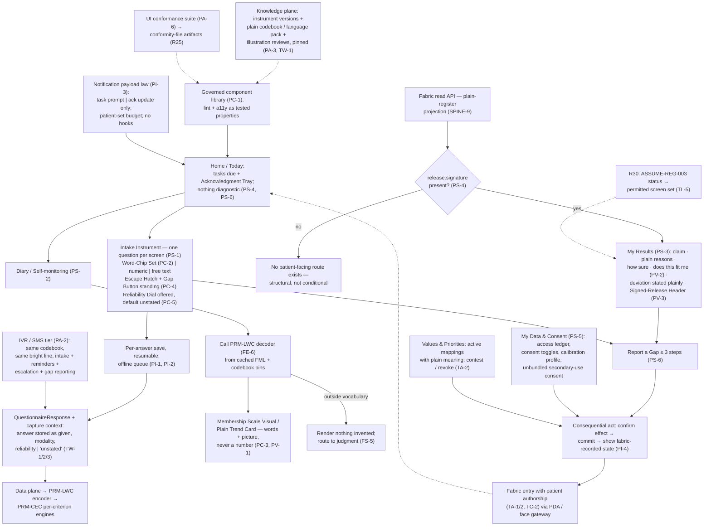

# Primer PRB — The Proboscis (Patient UI)

> **Justification fabric.** The butterfly's body is the justification fabric plus the deterministic evaluator: *every claim is an argument; only arithmetic releases.* One argument object renders in three registers to three faces; the fabric is append-only, hash-chained, and version-pinned so any decision replays bit-for-bit. Two wings paint the body — the **Left Wing** (MAK-LWC) senses in degrees, the **Right Wing** (MAK-RWC) judges in systems — and their coordination is the flight (MAK-MIF). The host is **MAK-FFC v1.1**: no primer here relaxes a corpus MUST. Regulatory content is governed by **REG-POSTURE v1.0** via **MAK-ANT** — assume inclusion, glass-box as the design target, ASSUME-REG-001..007 open pending counsel. This primer's position: *the patient's hand on the instrument — a governed component library and screen set that captures without coercion, reflects the patient's own data at once, shows only signed content across a structural bright line, and works at the tired-thumb floor; it composes what the faces and wings define and implements no linguistic, evaluative, or clinical logic of its own.*

## PRB1. What this is

The proboscis is the Patient UI: the pixel-and-utterance realization of the Patient Face that MAK-TXC specifies (MAK-PRB Part 0 — "every requirement here realizes named TXC requirements … TXC governs on any apparent conflict"). Its units are a **plain design language** (PV), a **screen set** of nine screens (PS), a **single governed component library** of ten components (PC), **interaction laws** for capture, offline, notification and consequential acts (PI), and an **accessibility and localization floor** that is the release gate (PA). Its defining property, from the corpus Thesis: the UI is *an instrument of capture before it is a display* — "nearly everything the system knows arrives through these screens, in the words patients actually use" — and its one test is that "a tired person with a cheap phone, low literacy, and thirty seconds of patience can answer honestly, see their own data reflected, and never be lied to by simplification." Three facts govern it (Part 1): intake ergonomics are the primary design surface; the plain register is a translation with rules, not a simplification (the UI "cannot invent softer content, only plainer words for the same content"); and the floor is the product. Everything it renders about gradedness, fit, or belief is computed elsewhere — the CWW decoder (MAK-LWC FE-6), the fit machinery (MAK-RWC MP-1), the deterministic evaluator (MAK-FFC SPINE-7) — and arrives as released argument content or as the patient's own data. Visual identity is deliberately unfixed by the corpus (Part 0); the laws constrain structure, vocabulary and behaviour, not taste.

*Trace: MAK-PRB Thesis; Part 0; Part 1; Part 3–4 inventories; PV-1, PS-4, PC-1, PC-3, PA-1.*

## PRB2. Scope

**In scope** — the five MAK-PRB requirement families this primer owns:

- **PV-1..5 · Plain design language.** Ratified plain codebook enforced by build lint — no percentages, probabilities, μ, scores or blended confidence anywhere patient-visible (PV-1); two uncertainty voices visually and verbally distinct, never sharing a component (PV-2); content classes visually typed — patient's own data vs signed, attributed released content (PV-3); the tired-thumb test as a design gate (PV-4); words carry the interface, pictures carry the meaning, locality-reviewed illustrations, no decorative imagery on clinical surfaces (PV-5).
- **PS-1..6 · Screen set.** One question per screen with linguistic answers at parity, hesitant input, standing free text and "none of these", reliability dial offered never demanded (PS-1); immediate offline diary reflection from the clinician's artifacts (PS-2); My Results renders only released argument objects in the plain register with deviations stated plainly (PS-3); the bright line structural across every patient-reachable surface including notification payloads (PS-4); My Data & Consent as working controls, unbundled secondary-use consent (PS-5); three-step Gap Report with acknowledgment tray states (PS-6).
- **PC-1..5 · Component library.** Single governed library, fork-by-copy a conformance violation (PC-1); Word-Chip Set renders pack terms only, out-of-vocabulary routes to the escape hatch verbatim (PC-2); Membership Scale Visual and Plain Trend Card as the only gradedness renderings, identical artifacts to the clinician view (PC-3); Gap Button and Escape Hatch standing, never hidden, disabled or removed for completion metrics (PC-4); Reliability Dial defaults to unstated, renders as invitation (PC-5).
- **PI-1..5 · Interaction laws.** Resumable, lossless, per-answer capture (PI-1); offline as first-class state with additive conflict resolution (PI-2); notification payload law and patient-set budget, no engagement hooks (PI-3); consequential acts confirm before and show fabric-recorded state after (PI-4); error and empty states teach, expose no internals (PI-5).
- **PA-1..6 · Accessibility & localization floor.** WCAG 2.2 AA equivalent, never colour-only, 200% scaling, screen-reader complete, offline-first at stated floors, tested per release (PA-1); IVR/SMS modality parity with the same codebook and bright line (PA-2); localization as a knowledge-plane act, no runtime machine translation of ratified vocabulary (PA-3); meta-rational functions hold at the floor (PA-4); designed helper mode (PA-5); the UI conformance suite as release gate producing conformity-file artifacts (PA-6).

**Out of scope** — each exclusion names its owner:

- **Face law** — what the patient face does, its rendering law, custody doctrine, floor requirements and evaluation programme (TW/TR/TA/TC/TL/TE): **PRM-TXC**. This primer realizes those requirements at the pixel; it never restates or reinterprets them. **There is no direct 02_ primer border for this component**: MAK-PRB's neighbours are Mākoha volumes, not stack primers. Where a 02_ primer's machinery touches this UI, it does so through PRM-TXC (face law) or PRM-LEG (stack).
- **The frontend stack binding** — React/Next.js/TypeScript/Tailwind defaults (MAK-LEG L1-1), the L1-2 bindings and the Android-native vehicle option (L1-3): **PRM-LEG**. This primer names what the library must satisfy (MAK-PRB Part 0 "nothing here presumes a framework"); PRM-LEG names what it runs on.
- **Linguistic logic** — codebooks, the CWW decoder with similarity floor, hedge algebra, PIS encoding, μ computation (MAK-LWC FS-4/FS-5/FS-9/FE-1/FE-6): **PRM-LWC**. MAK-LWC FE-6 is explicit: "Register renderers call it; they never implement private linguistic logic." The Word-Chip Set, Reliability Dial, Membership Scale Visual and Plain Trend Card are renderer shells over PRM-LWC's decoder and Z-ground schema.
- **Fit semantics, gap analytics, envelope status computation** (MAK-RWC MS-1/MP-1/MP-2/MA-2): **PRM-RWC**. The Fit Badge and Gap Button render and file; they do not judge fit or analyse gaps.
- **Argument evaluation and release** — which argument applies, whether it releases, the verdict stream (MAK-CEC RG-1; MAK-FFC SPINE-7): **PRM-CEC**. **The clinician sign-off act** that makes content releasable (MAK-HDC HA-1) and its UI: **PRM-HDC / PRM-LBP**. This UI has no release-capable code path (MAK-LEG L2-2 at the stack).
- **Data-plane custody enforcement** — FHIR Consent enforcement, AuditEvent capture, the access-ledger read model, repository routing policy (MAK-TXC TC-1/TC-3; MAK-FFC PF-4): **PRM-TXC** (Personal Data Agent as a face function) on the HAPI FHIR data plane (MAK-ELSM ELSM-20; MAK-LEG L2-3). This UI renders the controls and shows enforcement state (PS-5, PI-4); it does not enforce.
- **Patient council** (MAK-TXC TA-4): governance stage owned by **MAK-ABC AG-4 / PRM-ABC**, as MAK-PRB Part 7 itself records ("out of UI scope").
- **Telemetry schema and the face evaluation programme** (MAK-TXC TE-1..3; MAK-CEC RG-5): **PRM-TXC / PRM-CEC / PRM-ABC**. This UI emits instrumentation under the unified schema; it renders none of it to patients.
- **Regulatory classification of the patient surface** (ASSUME-REG-003, TASK-REG-004): **PRM-ANT**. This primer carries the consequence — separability (MAK-TXC TL-5) and the L3 intake/consent subset (Arch §14.5) — and never argues or closes the assumption (MAK-ANT AN-3).
- **Visual identity** — brand, exact type, colour values: the corpus is silent by design (MAK-PRB Part 0). No primer owns it; it is an operator/design-team artifact constrained by PV-1..5 and PA-1.

*Trace: MAK-PRB Part 0, Parts 2–6, Part 7 realization map; MAK-TXC Part 0; MAK-LWC FE-6; MAK-LEG L1-1..3, L2-2; Arch §14.2 `cdss-ui-patient` row; Appendix A census.*

## PRB3. Breadth and depth of content required

Twenty-seven requirements (PV 5 · PS 6 · PC 5 · PI 5 · PA 6; 22 MUST, 5 SHOULD, 0 MAY — MAK-PRB Appendix A). The inventories enumerate **nine screens** (Home/Today, Intake Instrument, Diary/Self-monitoring, My Results, How sure / Does this fit me, My Data & Consent, Values & Priorities, Report a Gap, Settings & Accessibility — Part 3) and **ten components** (Word-Chip Set, Reliability Dial, Membership Scale Visual, Plain Trend Card, Fit Badge, Gap Button, Escape Hatch, Acknowledgment Tray, Consent Toggle, Signed-Release Header — Part 4), each with a named source spec in MAK-LWC, MAK-RWC or MAK-TXC. Every MAK-TXC requirement is realized or explicitly routed out (Part 7 realization map, 28/28 rows).

To be real rather than a demo, the UI needs: **one deployment language's ratified pack** — plain codebook, instrument text, illustration reviews — installed as a knowledge-plane artifact (PA-3; MAK-TXC TL-2/TL-4), because the Word-Chip Set cannot render without one (PC-2); **a working PRM-LWC decoder and Z-ground schema** behind the four linguistic components (PC-3, PC-5; MAK-LWC FE-6, FS-6); **a signed-release feed** from the fabric's plain-register projection, since My Results renders nothing else (PS-3; MAK-FFC SPINE-9); **the conformance suite running in CI** with all eight named check classes (PA-6) — register lint, two-voices separation, bright-line structural tests including notification payloads, tired-thumb gates, library integrity, resumability and offline-loss, floor tests, pack integrity; and **stated device and bandwidth floors** to test against (PA-1; MAK-TXC TL-1 — the corpus mandates that floors be *stated*, and states none; see PRB8 proposed tolerances). The corpus carries **no phased plan of its own** and no sourcing annex — depth and schedule come from MAK-TXC Part 8 and from Architecture §14.5, whose patient-face row admits only the "intake/consent subset¹ (J-3-safe)" at L3 and defers the rest to ASSUME-REG-003 (finding PRB-F2). The evidence base is thin where it matters most: patient-facing explanation comprehension "has no analogue of the Spitzer RCT" and the linguistic-equity hypothesis is unmeasured (MAK-TXC Part 8 research plane) — MAK-TXC TE-1 produces the first evidence, and this UI is its instrument.

Depth constraint: the UI is a *register projection with lint* (Part 1). It may compress and re-order (MAK-FFC SPINE-3) and nothing else; every simplification it is tempted to make is a SPINE-3 violation, and the register-fidelity audit (MAK-TXC TE-3) exists to catch exactly that.

*Trace: MAK-PRB Appendix A; Parts 3–4 inventories; Part 7; PA-3, PA-6, PC-2, PS-3; MAK-TXC Part 8; MAK-FFC SPINE-3; Arch §14.5.*

## PRB4. Building in a silo

The library and most screens are buildable against fixtures, because every input is either patient-entered data or a pinned artifact:

- **Component library skeleton + lint + accessibility properties** (PC-1, PV-1, PA-1). Inputs mockable: a hand-authored plain codebook pack (term list + hedges + prohibited-vocabulary list) in the shape PRM-LWC's FS-4 codebook will take. Stub: the pack loader. The lint is a pure function over copy strings and component props; the a11y properties run in Storybook + axe with no backend.
- **Intake Instrument screen** (PS-1, PC-2, PC-4, PC-5, PI-1). Inputs: a FHIR SDC Questionnaire fixture (MAK-TXC TW-1 instruments are knowledge-plane artifacts). Stub: PRM-LWC's encoder — the UI stores the chosen chip word, hedge, or hesitant pair *as given* (MAK-TXC TW-2); encoding to μ is not this component's job, so nothing upstream is needed to test capture fidelity. Per-answer persistence and resume are local (IndexedDB + service worker).
- **Diary + Membership Scale Visual + Plain Trend Card shells** (PS-2, PC-3). Inputs: a pinned FML artifact + plain codebook + a decode-trace fixture. Stub: the FE-6 decoder as a fixture function returning `{word, similarity, pins}`. The shell renders what the decoder returns; it must fail closed on a missing pin (renders nothing, never a made-up word — MAK-LWC FS-5 orphan-output ban).
- **My Results + Signed-Release Header + Fit Badge + content-class typing** (PS-3, PV-3, PV-2). Inputs: a released ActualArgument fixture in the plain-register projection with `release.signer`, `qualifier` (plain hedge), `envelope` (fit), `deviation` fields. Stub: the fabric read API (MAK-FFC SPINE-9). The structural test — no route accepts an argument lacking a signature — is a type-level property testable against fixtures alone.
- **Notification payload schema + bright-line harness** (PS-4, PI-3). Pure schema + negative tests; no backend.
- **My Data & Consent, Values, Gap Report, Acknowledgment Tray** (PS-5, PS-6, PI-4). Inputs: access-ledger, consent-state, values-mapping and gap-report-state fixtures. Stub: the Personal Data Agent API (PRM-TXC TC-1) with a recorded-state echo so PI-4's "renders its fabric-recorded state afterward" is testable as a contract.
- **Offline behaviour + additive sync** (PI-2). Two-device fixture producing conflicting diary edits; the both-kept-and-flagged merge is local logic.
- **Localization pack loader** (PA-3). Two fixture packs; test that no string renders outside the pack and no runtime translation call exists in the bundle.

What cannot be built in the silo: the real decoder and Z-ground writes (PRM-LWC), real released arguments (PRM-CEC evaluator → fabric → SPINE-9 projection), the sign-off act (PRM-HDC/PRM-LBP), data-plane consent enforcement and the access ledger (PRM-TXC on HAPI), the IVR/SMS tier's carrier integration (PA-2), the Android vehicle's SDC composition (PRM-LEG L1-3), and the TE-1 evaluation with real patients (PRM-TXC; GATE-002). These are PRB5 edges.

*Trace: MAK-PRB PS-1..6, PC-1..5, PI-1..4, PA-3; MAK-TXC TW-1/TW-2; MAK-LWC FS-5, FE-6; MAK-FFC SPINE-9.*

## PRB5. Folding it in

Integration contract — consumes and emits, with the counterpart edge named and checked.

**Consumes**

| From | What | Interface | Counterpart edge |
|---|---|---|---|
| Knowledge plane (Primer B / Primer D; `cdss-compiler`) | Versioned instruments (SDC Questionnaires with target population, validation status, known gaps), plain-codebook and language packs, illustration review records | Signed artifacts pinned in R1; installed per jurisdiction under lineage rules (PA-3) | MAK-TXC TW-1, TL-2/TL-4; MAK-FFC PF-1, EN-3. **Checked:** MAK-LWC FS-1 routes LinguisticVariables/codebooks through the EN-3 gateway — PRM-LWC finding LWC-F2 (artifact type at the registry) applies to language packs too; this primer inherits that ruling |
| PRM-LWC (fuzzy plane) | Decoded codebook word + similarity + pins for every graded rendering; the Z-ground reliability vocabulary; the patient's PIS profile plain meaning | Single CWW render path (MAK-LWC FE-6): `decode(argumentField, codebook, pins) → {word, similarity | "outside vocabulary", trace}`; Z-ground schema (FS-6) | MAK-LWC FE-6, FS-5, FS-6, FP-3/FP-4/FP-5. **Checked:** PRM-LWC §LWC5 Emits row "PRM-HDC / PRM-TXC / PRM-ABC … Face renderers call the decoder; they never implement private linguistic logic" — PRM-PRB is the concrete caller; PRM-LWC names PRM-TXC/PRM-PRB as intake writers in its Consumes table. Aligned |
| Fabric read API (MAK-FFC SPINE-9; `cdss-fabric`) | Released ActualArgument objects in the plain-register projection: claim, plain reasons, qualifier as plain hedge, envelope status, deviation + reason, releasing clinician + date | Register-scoped projection; `release.signature` mandatory at the type level | MAK-TXC TR-1, TR-3; MAK-HDC HA-1 (sign-off is the releasing act); MAK-FFC SPINE-3, PF-2/PF-8. **Checked:** Arch §14.2 lists a "register-render contract (SPINE-3 invariance, testable)" entering `cdss-spine` — this UI is its plain-register consumer; contract not yet pinned (RECON-PRB-003) |
| PRM-RWC via fabric | Envelope status per argument and per instrument item (Fit Badge content); gap-report disposition states | Argument fields; acknowledgment state feed | MAK-RWC MP-1, MP-2; MAK-TXC TA-1, TR-4. **Checked:** MP-2 requires the report to "visibly acknowledge receipt" — PS-6's tray states (received / being reviewed / outcome) need a disposition feed no volume names as an interface; see GAP-PRB-001 |
| PRM-TXC Personal Data Agent (data plane, HAPI — ELSM-20) | Access ledger entries (who, what, when, under which argument), consent state, routing explanation, export bundles | PDA read/write API (shape unspecified in any volume — RECON-PRB-005) | MAK-TXC TC-1..4; MAK-FFC PF-4. **Checked:** MAK-TXC Part 8 lists the PDA as a BUILD with no maintained OSS champion (fasten-onprem archived — re-verified 2026-09-02); the UI's consent controls are blocked on that build |
| Regulatory posture (R30; PRM-ANT) | ASSUME-REG-003 status; the scope the UI may ship | R30 read at release | MAK-ANT AN-3, AN-7; Arch §14.2 "scope beyond intake/consent/logistics **Blocked** on ASSUME-REG-003" |
| PRM-LEG | Stack defaults and L1-2 bindings; the vehicle decision per deployment (web PWA vs Android-native, L1-3) | Recorded choice per LS-1 | MAK-LEG L1-1..3. **Checked:** L1-2 restates PI-1/2, PA-1, PS-4 and WCAG 2.2 AA as stack MUSTs — aligned; L1-3's two-vehicle option strains PC-1's "single governed library" — finding PRB-F5 |

**Emits**

| To | What | Interface | Counterpart edge |
|---|---|---|---|
| Data plane (grounds preparation → PRM-LWC encoder → PRM-CEC) | QuestionnaireResponse with capture context (device class, assistance, modality) and linguistic answers stored as given: term, hedge, hesitant `{lower, upper}`, numeric, or free text; reliability dial value or `"unstated"` | FHIR QuestionnaireResponse (MAK-FFC SPINE-4 bindings) + modality/reliability components | MAK-TXC TW-1/TW-2/TW-3; MAK-LWC FP-1/FP-2; MAK-CEC OM-3 (reliability is a distinct non-coercible type). **Checked:** PRM-LWC Consumes row "Data plane (grounds preparation) … PRM-TXC / PRM-PRB intake controls write the ground; this layer annotates it" — aligned |
| Fabric (`cdss-fabric`) | Patient acts as fabric entries with patient authorship: gap reports (+ optional free text), values structures, consent changes, calibration revocations, escape-hatch content verbatim | Fabric write via PDA / face gateway (MAK-LEG L2-1); never a release-capable path | MAK-TXC TA-1/TA-2/TA-3, TC-2; MAK-RWC MP-2/MP-3/MP-5; MAK-HDC HA-6 (escape-hatch text reaches Consult-Prep) |
| Patient (the UI's own surfaces) | Immediate reflection of the patient's own data (diary, scale visual, trend card) — never diagnostic content pre-release | Local render from cached pins, offline | MAK-TXC TW-4, TR-3; MAK-LWC FP-4, FP-7 |
| Notification channels (push, SMS, IVR, email digest) | Task prompts and acknowledgment updates only; payload schema forbids argument content | Payload schema (PRB8) | MAK-PRB PS-4, PI-3, PA-2; MAK-TXC TR-3 |
| PRM-ABC / PRM-CEC telemetry (RG-5) | Modality mix, escape-hatch and gap-report rates, dial usage, acknowledgment latencies, offline sync success, IVR completion, floor-conformance metrics | Unified telemetry schema; auditor system lens only | MAK-TXC TE-2; MAK-CEC RG-5; MAK-FFC AF-8 |
| CI / conformity file (R25; MAK-ABC AX-3) | PA-6 suite results as conformity-file artifacts; SBOM (R3); manifest (R2) | Shared CI actions (`cdss-governance`) | MAK-PRB PA-6; MAK-TXC TE-4; MAK-CEC RG-8; MAK-LEG LS-2 |
| PRM-TXC evaluation programme | Instrumentation for TE-1 (comprehension, linguistic equity by literacy band, gap-report usability, calibration uptake/revocation) | Study instruments firewalled from the design team | MAK-TXC TE-1; MAK-LWC FP-8 |

**Fabric binding (MAK-FFC).** This component supplies **no argument slot**. It supplies *grounds* — the patient's answers with modality, reliability and capture context (SPINE-1's grounds slot, upstream of PRM-LWC's gradedness annotation) — and *patient-authored fabric entries* (gap reports, values, consent acts). Downstream, it is the **plain-register renderer** of released argument objects (SPINE-3 second register), permitted to compress and re-order, forbidden to add, remove or reweight. It never supplies the Qualifier, never evaluates, never releases (SPINE-7; MAK-LEG L2-2). Coordination doctrine: MAK-MIF beat 2 (the full translation loop — intake encodes without coercion; feedback decodes to owned words; what encoding lost is preserved as escape-hatch text) and beat 6 (reliability-aware listening — the dial writes (restriction, reliability); unstated stays unstated; honesty is never punished), per MAK-TXC's beat map.

*Trace: MAK-PRB Parts 3–6; MAK-TXC Part 7 realization + beat map; MAK-LWC FE-6, FS-6, FP-1/2/4/5/7; MAK-RWC MP-1/2/5; MAK-FFC SPINE-1/3/4/7/9, PF-4/PF-8; MAK-LEG L1-2/L1-3/L2-1/L2-2; Arch §14.2; PRM-LWC §LWC5.*

## PRB6. Definition of done

Per release, all of:

1. **Register lint clean** — the patient copy corpus (screens, components, notifications, share surfaces, IVR prompts, error/empty states) contains no percentage, probability, μ, numeric score or blended-confidence rendering; the lint is a CI gate and its pass is a conformity artifact (PV-1; MAK-TXC TR-2; PA-6).
2. **Two voices separated** — fit-uncertainty and degree-uncertainty are distinct component types with distinct phrasing and iconography; a static check finds no component accepting both (PV-2; MAK-TXC TR-4).
3. **Bright line structural** — negative tests prove no patient-reachable route (screen, preview, widget, share card, digest, push, SMS, IVR prompt) can render an argument lacking `release.signature`; notification payloads validate against a schema with no clinical-content field (PS-4, PI-3, PA-2; MAK-TXC TR-3; MAK-HDC HA-1).
4. **Content classes typed** — every released element carries the Signed-Release Header (clinician identity + date); every patient-own-data element carries the reflection treatment; no element renders untyped (PV-3, PS-3).
5. **Capture stored as given** — fixture run: hedged, hesitant, "none of these", free-text and skipped answers persist verbatim with modality recorded; no averaging, coercion or discard; dial declined → `"unstated"`, treated identically to absent downstream (PS-1, PC-2, PC-5; MAK-TXC TW-2/TW-3; MAK-LWC FP-2).
6. **Standing components never hidden** — Gap Button on every instrument item and rendered argument; Escape Hatch on every structured input; a static check finds no configuration flag, menu nesting or A/B variant that removes either (PC-4; MAK-TXC TA-1/TA-3; MAK-RWC MA-3).
7. **Single library, no forks** — every screen imports components only from the governed library; fork-by-copy detection passes; every component's lint and a11y properties run and pass in the component harness (PC-1; PA-6).
8. **Resumable, lossless, offline-first** — process kill after any answer, airplane mode across a full diary flow, and a two-device conflict fixture all pass: zero loss, resume at point of departure, both conflicting records kept and flagged; diary reflection renders offline from cached pins (PI-1, PI-2, PS-2; MAK-TXC TL-1, TW-4).
9. **Consequential acts confirmed and reflected** — consent change, revocation, gap report and values change each state their effect before commit and render the fabric-recorded state after; secondary-use consent is a separate flow and declining it changes nothing about care function (PI-4, PS-5; MAK-TXC TC-1/TC-2/TC-4).
10. **Floor met** — axe-core + manual WCAG 2.2 AA pass on every screen; no colour-only encoding; full function at the stated smallest device and 200% text; screen-reader walk-through complete; meta-rational functions (gap, fit badge, escape hatch, tray) work offline at the floor; IVR/SMS tier covers intake, reminders, escalation and gap reporting with codebook terms (PA-1, PA-2, PA-4, PV-4; MAK-TXC TL-1/TL-2/TL-3; MAK-LWC FC-5).
11. **Pack integrity** — the shipped language pack is a pinned knowledge-plane artifact with locality review recorded; no string renders outside it; no runtime translation dependency exists in the bundle (PA-3; MAK-TXC TL-4).
12. **Scope matches posture** — the release's screen set matches the scope R30 permits under ASSUME-REG-003 (L3: intake/consent/logistics subset; results and diagnostic content only per ruling); nothing in the release or its docs describes the assumption as closed (Arch §14.2/§14.5; MAK-ANT AN-3; MAK-TXC TL-5).

*Trace: MAK-PRB PA-6 (the suite's eight check classes are items 1–3, 7, 8, 10, 11); PV-1..4, PS-1..5, PC-1..5, PI-1..4, PA-1..4; MAK-TXC TE-4; Arch §14.2.*

## PRB7. Internal operations diagram



## PRB8. Execution layer

**Executable contract from the corpus.** MAK-PRB gives no code-level contract; its executable spec is the conformance suite's check list, quoted verbatim from PA-6: *"register lint (PV-1), two-voices separation (PV-2), bright-line structural tests including notification payloads (PS-4), tired-thumb gates (PV-4), component-library integrity (PC-1), resumability and offline-loss tests (PI-1/2), floor tests (PA-1/2), and localization-pack integrity (PA-3). Results are conformity-file artifacts."* Two schemas are proposed here to make PS-4/PI-3 testable (flag: **Proposed**, for `cdss-spine`; not corpus text):

```text
NotificationPayload {                       // PS-4, PI-3 — the ONLY shape any channel may carry
  kind:      "task-prompt" | "ack-update"   // closed enum; no "result", no "risk", no free text
  task_ref?: InstrumentVersionRef           // for task-prompt: which instrument/diary is due
  ack_ref?:  { report_id, state: "received" | "being-reviewed" | "outcome-available" }
  channel:   "push" | "sms" | "ivr" | "email"
  budget:    PatientNotificationBudgetRef   // patient-set; quiet by default
}                                           // structurally: no field can hold argument content

PatientProjection<ReleasedArgument> {       // PS-3, PV-3 — the only argument type the UI can receive
  release:   { signer: ClinicianId, signed_at, argument_version }   // REQUIRED, non-optional
  claim, plain_reasons[], how_sure: PlainHedge, fit: EnvelopePlain,
  choices[], deviation?: { present: true, plain_reason }
  decode_traces[]                           // from PRM-LWC FE-6; the UI adds none
}
```

**First executable properties (seed for the I registry — PA-6):** (1) ∀ patient route: input type is `PatientProjection<ReleasedArgument>`; no route accepts an unreleased or unsigned argument (PS-4). (2) Copy lint over the whole patient string corpus finds no `%`, no numeric probability, no μ, no "score"/"confidence" (PV-1). (3) `FitVoice` and `DegreeVoice` are disjoint component types; no component's props accept both (PV-2). (4) Kill the process after any answer → resume shows every prior answer, byte-equal (PI-1). (5) With network disabled, a diary entry renders the Membership Scale Visual from cached pins in the same artifact the clinician view uses (PS-2, PC-3). (6) Two offline edits to one diary record → both persist, one review flag, zero overwrites (PI-2). (7) Dial declined → stored `"unstated"`; downstream render identical to field absent (PC-5; MAK-LWC FP-2). (8) Every `NotificationPayload` validates against the closed schema; a payload with any extra field fails at build (PI-3). (9) Injecting a term outside the pinned pack into the Word-Chip Set fails at build; at runtime an out-of-pack answer routes to the Escape Hatch verbatim (PC-2). (10) No screen imports a component from outside the library path; component count in the library equals the ratified inventory (PC-1).

**Asset library** — every requirement family maps to at least one row. MAK-PRB carries **no sourcing annex**; seeded from MAK-TXC Part 8 (ELSM-T01..T04, verified 2026-09-01) and MAK-ELSM v1.1 (2026-08-29), extended for UI tooling the corpora do not name. **Verified this run, 2026-09-02**: npm registry metadata (version, publish date, licence) for JavaScript packages; GitHub repository pages via fetch for repo status; W3C TR for WCAG. GitHub omits the year on release dates within the last twelve months — where noted, the year is inferred, not read. Verdict vocabulary per MAK-ELSM: ADOPT / ADAPT / STUDY / BUILD / WATCH; **DEAD-REPLACE** for archived assets.

| Asset | Type | Satisfies | Licence | Currency | Verified (method · date) | Verdict |
|---|---|---|---|---|---|---|
| WCAG 2.2 (W3C) | standard | PA-1, PV-4, PC-3 (FC-5 inheritance) | W3C | Recommendation; latest revision **12 Dec 2024**; WCAG 3.0 "multi-year effort" in parallel | w3.org/TR/WCAG22 fetched · 2026-09-02 | **ADOPT — cite 2.2 AA; WATCH 3.0** |
| [ohs-foundation/android-fhir](https://github.com/ohs-foundation/android-fhir) — Structured Data Capture library (formerly google/android-fhir) | library (Kotlin) | PS-1, PI-1, PI-2, PA-1 — the Android vehicle (MAK-LEG L1-3) | Apache-2.0 | SDC **1.3.1**, released 20 Nov (year not shown; 2025 inferred); 2,426 commits; 599★; not archived; **repository now under the Open Health Stack Foundation org** — google/ URL redirects | repo + releases pages fetched · 2026-09-02 | **ADOPT (Android vehicle)** — carried from MAK-TXC ELSM-T01 / MAK-ELSM ELSM-04; org change is finding PRB-F3 |
| [opensrp/fhircore](https://github.com/opensrp/fhircore) | app / platform | PA-1..4 reference deployment; PA-5 (CHW helper pattern) | Apache-2.0 | **v2.2.2 · 10 Nov 2025**; 136 releases; 1,901 commits; 68★; not archived; ~10 months since last tag | repo page fetched · 2026-09-02 (one fetch of the releases page rendered "2024" — repo landing page is authoritative; RECON-PRB-002) | **STUDY / ADOPT (reference)** — carried from MAK-TXC ELSM-T02; WATCH cadence; device-integration excluded in J-3 (GPP-6) |
| [aehrc/smart-forms](https://github.com/aehrc/smart-forms) · `@aehrc/smart-forms-renderer` (CSIRO AEHRC) | library (React) | PS-1 web SDC rendering; PI-1 form state | Apache-2.0 | **1.4.0 · 2026-07-03**; 4,726 commits; 59★; not archived; Australian, SMART-on-FHIR | npm + repo fetched · 2026-09-02 | **ADAPT — SDC renderer behind the Word-Chip Set; linguistic/hesitant item types are an extension (RECON-PRB-007)** |
| [lhncbc/lforms](https://github.com/lhncbc/lforms) (NLM) | library (web) | PS-1 alternative renderer | per LICENSE.md (NLM terms — confirm) | **43.1.0 · 2026-08-10** | npm fetched · 2026-09-02 | **STUDY (alternative)** |
| WHO SMART Guidelines IGs + DAKs | content | PA-3, MAK-TXC TL-4 localization pattern | CC/Apache mix | programme active; site "Last updated: November 2025"; L2 DAK / L3 FHIR layers | smart.who.int fetched · 2026-09-02 | **ADOPT** — carried from MAK-TXC ELSM-T04 / MAK-ELSM ELSM-06 |
| [dequelabs/axe-core](https://github.com/dequelabs/axe-core) + `@axe-core/playwright` | testing | PA-1, PA-6 floor tests | MPL-2.0 | **4.13.0 · 2026-08-05 / 2026-08-11** | npm fetched · 2026-09-02 | **ADOPT** |
| [microsoft/playwright](https://github.com/microsoft/playwright) | testing | PA-6; PV-4 (device emulation, 200% text, one-handed reach); PI-1/PI-2 (offline, kill/resume) | Apache-2.0 | **1.62.1 · 2026-07-30** | npm fetched · 2026-09-02 | **ADOPT** |
| Storybook + `@storybook/addon-a11y` | component harness | PC-1 (properties per component) | MIT | **10.5.10 · 2026-08-20** | npm fetched · 2026-09-02 | **ADOPT** |
| `react-aria-components` (Adobe) | accessible primitives | PC-1, PA-1 (default primitives under MAK-LEG L1-1 React default; substitutable per LS-1) | Apache-2.0 | **1.21.0 · 2026-09-01** | npm fetched · 2026-09-02 | **ADOPT (default primitives)** |
| [radix-ui/primitives](https://github.com/radix-ui/primitives) | accessible primitives | PC-1 alternative | MIT | **1.1.23 · 2026-07-24** (react-dialog) | npm fetched · 2026-09-02 | **STUDY (alternative)** |
| [GoogleChrome/workbox](https://github.com/GoogleChrome/workbox) | service worker toolkit | PI-1, PI-2, PA-1 offline-first (web vehicle) | MIT | **7.4.1 · 2026-05-04** | npm fetched · 2026-09-02 | **ADOPT** |
| [dexie/Dexie.js](https://github.com/dexie/Dexie.js) | IndexedDB wrapper | PI-1 per-answer persistence, PI-2 queue | Apache-2.0 | **4.4.5 · 2026-08-14** | npm fetched · 2026-09-02 | **ADOPT** |
| PouchDB | offline DB (alternative) | PI-1/PI-2 | Apache-2.0 | **9.0.0 · 2024-06-21** — 26 months since release | npm fetched · 2026-09-02 | **WATCH — do not select over Dexie** |
| [yjs/yjs](https://github.com/yjs/yjs) | CRDT | PI-2 (MAK-LEG L4-3 "CRDT-style additive merge") | MIT | **13.6.32 · 2026-08-04** | npm fetched · 2026-09-02 | **STUDY — PI-2 requires both records kept + flagged, not a merged value; CRDT merge alone does not satisfy it** |
| i18next | i18n loader | PA-3 pack loading (strings only) | MIT | **26.4.1 · 2026-09-01** | npm fetched · 2026-09-02 | **ADAPT — loader for ratified packs; never runtime MT; interpolation disabled on codebook terms** |
| `@fluent/bundle` (Mozilla Fluent) | i18n (alternative) | PA-3 | Apache-2.0 | **0.19.1 · 2025-04-02** — 17 months | npm fetched · 2026-09-02 | **STUDY** |
| [rapidpro/rapidpro](https://github.com/rapidpro/rapidpro) (UNICEF / Nyaruka) | IVR + SMS flow platform | PA-2 modality tier | **AGPL-3.0** | 23,422 commits; 904★; not archived; 2,027 tags (latest date not surfaced) | repo + LICENSE fetched · 2026-09-02 | **ADAPT — AGPL ruling required (RECON-PRB-004); flows must speak codebook terms and carry the payload law** |
| [fastenhealth/fasten-onprem](https://github.com/fastenhealth/fasten-onprem) | PHR | PS-5 design mine | GPL-3.0 | **ARCHIVED 18 Jul 2026**, read-only; 2.8k★ | repo fetched · 2026-09-02 | **STUDY (cautionary)** — carried from MAK-TXC ELSM-T03 / ELSM-21; archive re-confirmed |
| HAPI FHIR jpaserver-starter | data plane (Consent, AuditEvent, QuestionnaireResponse) | PS-5, PI-4 backing store (not this repo) | Apache-2.0 | carried forward from MAK-ELSM ELSM-20 (verified 2026-08-29) | not re-fetched this run | **ADOPT (upstream; PRM-TXC/PRM-LEG own the binding)** |
| **Word-Chip Set + "between X and Y" hesitant gesture** | build | PS-1, PC-2 | — | FHIR SDC has no linguistic/hesitant item type; no OSS precedent found (targeted search) | this primer PRB4 | **BUILD** |
| **Reliability Dial** (writes Z-ground reliability) | build | PC-5, PS-1 | — | no Z-number UI precedent (MAK-LWC §9.6 confirms no library) | MAK-LWC §9.6 (2026-08-30); PRM-LWC | **BUILD** |
| **Membership Scale Visual + Plain Trend Card shells** | build | PC-3, PS-2 | — | renderer shells over PRM-LWC decoder; no private logic | this primer PRB4 | **BUILD (thin)** |
| **Fit Badge, Gap Button, Escape Hatch, Acknowledgment Tray, Signed-Release Header, Consent Toggle, content-class typing** | build | PC-4, PS-3, PS-5, PS-6, PV-3, PI-4 | — | no precedent for patient gap reporting with acknowledgment loop (MAK-TXC Part 8 build list) | MAK-TXC Part 8 (2026-09-01) | **BUILD** |
| **Plain-register lint** over the ratified codebook pack | build | PV-1, PA-6 | — | no OSS lint for a governed clinical vocabulary; rule host TBD | this primer | **BUILD** |
| **Bright-line structural harness + NotificationPayload schema** | build | PS-4, PI-3, PA-2, PA-6 | — | schema proposed above | this primer | **BUILD** |
| **Additive sync-conflict handler (both kept, flagged)** | build | PI-2 | — | MAK-LEG L4-3 pattern; yjs STUDY only | this primer | **BUILD** |
| **Tired-thumb gate instrument** (reach map, single primary action, 30-s happy path, reading-level check) | build | PV-4, PA-6 | — | Playwright device emulation supplies mechanics; reading-level tool unverified | this primer | **BUILD** |
| **Helper mode** (assistance recorded in capture context; patient voice distinct; session-bounded access) | build | PA-5 | — | fhircore CHW pattern as design reference | MAK-TXC Part 8; fhircore fetched 2026-09-02 | **BUILD** |
| **Language-pack installer + locality-review record** | build (over knowledge plane) | PA-3 | — | depends on LWC-F2 artifact-type ruling | PRM-LWC §LWC10 | **BUILD** |
| **UI conformance suite** (assembled) | build | PA-6 | — | Playwright + axe + Storybook + lint + schema tests | this primer | **BUILD (assembled)** |

**Coverage check (P5):** PV-1..5 → WCAG 2.2, axe-core, Playwright, plain-register lint build, content-class typing build, two-voices static check (property 3), locality-reviewed illustrations via pack build. PS-1..6 → android-fhir SDC / smart-forms / lforms, workbox + Dexie, Word-Chip build, results/tray/consent builds, bright-line harness. PC-1..5 → react-aria-components (radix alt.), Storybook a11y, Word-Chip build, scale-visual shells, Reliability Dial build, standing-component static check. PI-1..5 → workbox, Dexie (PouchDB WATCH), yjs STUDY + additive-conflict build, NotificationPayload build, PDA contract (HAPI carried), error/empty-state copy under lint. PA-1..6 → WCAG 2.2, axe-core, Playwright, fhircore reference, RapidPro (AGPL ruling), WHO SMART, i18next (Fluent alt.), helper-mode build, pack installer build, conformance suite build. **27/27 covered; 11 rows are BUILD (three thin shells).** Verified this run: 17 external rows; carried forward: 1 (HAPI, 4 days old).

**Sourcing landmines carried forward, with this run's status:** fasten-onprem archived (MAK-ELSM; MAK-TXC ELSM-T03) — *re-confirmed 18 Jul 2026; PDA remains BUILD*; fhircore device-integration features excluded from J-3 builds (MAK-ELSM §08) — *unchanged; and its release cadence is now ~10 months — WATCH*; **new:** google/android-fhir has moved to the `ohs-foundation` GitHub organization — every series citation of the google/ URL still resolves by redirect but should be updated additively (PRB-F3); **new:** RapidPro is AGPL-3.0 — the IVR/SMS tier's licence exposure needs a ruling before adoption; **new:** PouchDB's last release is June 2024 — do not select.

**Proposed tolerances (flag: operator and clinical sign-off required; none is a corpus number):** smallest supported device = 320 CSS px viewport width, 4.5-inch class, Android Go-class RAM; text scaling floor 200% (WCAG 1.4.4, corpus-stated) with no horizontal scroll; primary-action target ≥ 48 × 48 CSS px within the lower two-thirds of the viewport (WCAG 2.2 SC 2.5.8 minimum is 24 × 24 — proposed floor exceeds it); first-load budget ≤ 500 KB compressed on a 50 kbps link, subsequent screens served from cache; offline queue retention ≥ 30 days with no silent expiry; reading level for English packs ≤ Grade 6 equivalent (the corpus says "ratified reading level for the deployment language" — the level is ratified per pack, not fixed here); notification budget default ≤ 1 prompt/day, quiet hours on by default; acknowledgment tray shows "received" within 5 s of a queued report being synced. The thirty-second happy path and one-primary-action-per-screen are corpus text (PV-4), not tolerances.

*Trace: MAK-PRB PA-6, PV-1..5, PS-1..6, PC-1..5, PI-1..5, PA-1..5; MAK-TXC Part 8; MAK-ELSM §01, §04, §06, §08, landmines; MAK-LEG L1-1..3, L4-3; external verification as tabled.*

## Production topology annotation

*Per Architecture §11 and §14.5 (MET-1, Proposed):* the patient face + UI (MAK-TXC/PRB) row enters at **L3 as the "intake/consent subset¹" — footnote ¹ "the J-3-safe subset only"**; **L4 "per ASSUME-REG-003"**; **L5 "per posture"**. Arch §14.2 marks the `cdss-ui-patient` repo's scope beyond intake/consent/logistics as **Blocked on ASSUME-REG-003**. MAK-PRB has no phased plan of its own (finding PRB-F2); reconcile as follows. **PRB-P0 (L3):** governed library, lint, conformance suite; Intake Instrument, Home/Today, My Data & Consent, Settings & Accessibility, Report a Gap on instrument items, Acknowledgment Tray, helper mode — the GPP-4 subset ("intake instruments, consent management, access ledger, and logistics"). **PRB-P1 (L4, on ASSUME-REG-003 ruling and R30 entry):** Diary/Self-monitoring reflection (PS-2/PC-3), My Results (PS-3), How sure / Does this fit me (PV-2), Values & Priorities, Fit Badge on results — every screen that renders clinical or monitoring content to the patient. **PRB-P2 (L5):** IVR/SMS tier parity (PA-2), multi-language packs, TE-1 evaluation instruments. Gate dependencies per MAK-ANT AN-7: GATE-000 blocks P1 scope (it is the counsel opinion that closes ASSUME-REG-003); GATE-002 precedes any identifiable patient data in any environment — all P0/P1 development runs on synthetic fixtures until then (REG-KEEP-004). Tier pipeline applies in full from first release (§11.1). **J-tier:** J-1/J-2 carry the full face; **J-3 (GPP channel) carries P0 only** — MAK-J3 GPP-4 forbids rendering "monitoring feedback" to patients, which excludes PS-2's diary reflection from the J-3 artifact (finding PRB-F1); the `profile: GPP` stamp (Arch §14.2) must switch those renderers structurally absent, with GPP-CONF negative tests.

## Register topology annotation

*Per Architecture §12 (R1–R28) and §14.3 (R29–R30, Proposed):* **Owns:** none. **Writes:** R2 (artifact manifest per library/screen-set release); R3 (SBOM per build, per MAK-LEG L6-2); R7 (the PA-6 property subset, PRB8 properties 1–10); R13 — *not written*: acceptance telemetry is clinician actions; patient acts go to the fabric ledger, not a register (see gap); R25 (build evidence — this run's verification table; PA-6 conformity-file results per MAK-ABC AX-3). **Reads:** R1 (instrument, pack, FML and codebook pins on every render), R14 (lockfile pins), R30 (posture — ASSUME-REG-003 status determines the shipped screen set, PRB6 item 12), R17 — *not read*: the det-coder dictionary is clinician-side. **Gap proposals:** GAP-PRB-001 — gap-report and dispute *disposition states* (PS-6 tray: received / being reviewed / outcome) have no register home and no named interface; the report itself is a fabric entry (MAK-TXC TA-1) but its lifecycle state is neither in R11 (decision log) nor R13; propose an append-only Patient-Act Disposition Ledger, or an R12 extension, owner `cdss-fabric`. GAP-PRB-002 — notification payloads and delivery (PS-4/PI-3) need an auditable log to evidence the payload law post hoc; no register holds channel deliveries; propose append-only, runtime-owned, opening with PRB-P0. GAP-PRB-003 — PI-2 sync-conflict flags ("both records kept, flagged for review") need a review queue with a home; propose an R13-adjacent append register or a fabric annotation class. GAP-PRB-004 — language-pack locality-review records (PA-3) are ratification evidence; propose R12 (adjudication) as their home, consistent with PRM-LWC's use of R12 for curve-change ratification.

<!-- ECOSYSTEM-V2-BLOCK: PRB v1.0 -->
## PRB9. Build Execution Extension (Ecosystem v2.0)

**1. Mini-North-Star.** WHAT: the governed Proboscis component library with lint and accessibility as tested properties, the P0 screen set (Intake, Home, My Data & Consent, Gap Report, Settings, helper mode), the NotificationPayload schema and bright-line harness, and the PA-6 conformance suite emitting conformity-file artifacts. WHY: the instrument through which nearly all of the system's grounds arrive in the patient's own words, built so that any answer to ASSUME-REG-003 is survivable without architectural surgery. Endpoint: L3 intake/consent subset (Production topology annotation); P1 screens on the R30 ruling. Derives from and cites SPINE §13.1, MAK-TXC TW/TC/TL, MAK-FFC PF-1/PF-4/PF-6.

**2. Doctrine classification.** Lint, schema validation, structural bright-line tests and conformance checks are arithmetic. The UI *proposes nothing and releases nothing*: it captures grounds and renders released content. No learned component exists in this repo; the plain-register projection it renders is produced upstream by the evaluator and decoder.

**3. Scoped recon register.**
| ID | Verify | Tag |
|---|---|---|
| RECON-PRB-001 | ASSUME-REG-003 status and any interim counsel guidance in R30; the exact P0 screen set counsel will accept as "intake/consent/logistics" | E:DOC MAK-ANT annex ASSUME-REG-003, TASK-REG-004; R30 |
| RECON-PRB-002 | Canonical org and release year for android-fhir SDC 1.3.1 (ohs-foundation vs google redirect); fhircore v2.2.2 date (one fetch rendered 2024, landing page 2025) | E:WEB required at ticket start |
| RECON-PRB-003 | `cdss-spine` register-render contract (SPINE-3 invariance) and `PatientProjection<ReleasedArgument>` shape — pinned or placeholder; PRM-LWC decoder API (FE-6) version | E:REPO (cdss-spine tag); E:DOC PRM-LWC §LWC8 |
| RECON-PRB-004 | RapidPro AGPL-3.0 exposure for the IVR/SMS tier vs alternatives (managed telephony flows; MAK-LEG LS-4 boring bias) | E:WEB; legal |
| RECON-PRB-005 | Personal Data Agent API shape (access ledger read model, consent write, routing explanation) from PRM-TXC | E:DOC PRM-TXC; E:REPO |
| RECON-PRB-006 | Vehicle decision per deployment — web PWA vs Android-native (MAK-LEG L1-3) — and its consequence for PC-1 (finding PRB-F5) | E:DOC PRM-LEG; operator |
| RECON-PRB-007 | HL7 SDC extension path for linguistic answers (term + hedge + hesitant range) as first-class QuestionnaireResponse answers without coercion (MAK-TXC TW-2) | E:WEB (HL7 SDC IG); E:DOC PRM-LWC FS-6 |

**4. Work register seed (PRB-P0; schema per master v2 Phase 6; estimates ranged with confidence).**
```yaml
TASK-PRB-001:
  story: STORY-PRB-001 (every patient screen composes from one governed, linted, accessible library)
  component: ui-patient-lib
  title: Governed component library skeleton with register lint and a11y properties (PC-1, PV-1, PA-1)
  purpose_chain: {what: "library package + Storybook harness + lint + axe properties + fork-by-copy check", why: "PC-1 makes every later screen a composition, and PV-1's lint must exist before any copy is written", endpoint_ref: "L3 entry: PA-6 suite green on P0 screens; SPINE-NS WHY"}
  evidence_refs: [E:DOC MAK-PRB PC-1, PV-1, PA-1, PA-6; MAK-LEG L1-1/L1-2; RECON-PRB-003, RECON-PRB-006]
  definition_of_ready: ["one plain-codebook pack fixture (terms, hedges, prohibited list) in FS-4 shape", "vehicle decision recorded per RECON-PRB-006"]
  steps: ["design tokens + primitives (react-aria-components default)", "ten inventory components as typed shells", "lint: prohibited-vocabulary + numeric/percent regex over all patient strings", "axe + keyboard + 200% properties per component", "fork-by-copy static check (imports only from library path)"]
  test_plan: "property suite per component; lint zero findings on fixture copy; negative fixtures (a '%', a 'μ', a 'score') fail the build"
  observability: "CI artifact: lint report + axe report per component version; counter ui.lint.violations"
  definition_of_done: ["all ten components present with properties green", "lint wired as CI gate", "PRB8 properties 2, 3, 10 executable"]
  estimate: {optimistic: 5d, likely: 8d, pessimistic: 14d, confidence: medium}
  depends_on: []
```
```yaml
TASK-PRB-002:
  story: STORY-PRB-002 (a patient answers in their own words, is never coerced, and never loses an answer)
  component: ui-patient-intake
  title: Intake Instrument screen — Word-Chip Set, Escape Hatch, Gap Button, Reliability Dial, per-answer resumable capture (PS-1, PC-2, PC-4, PC-5, PI-1)
  purpose_chain: {what: "one-question-per-screen flow over an SDC Questionnaire fixture, answers stored as given with modality + reliability, offline queue", why: "intake is the primary design surface (Part 1) and the P0 scope counsel is most likely to accept", endpoint_ref: "L3 exit: capture-as-given fixtures pass; PRB6 items 5, 6, 8"}
  evidence_refs: [E:DOC MAK-PRB PS-1, PC-2, PC-4, PC-5, PI-1; MAK-TXC TW-1/2/3; MAK-LWC FP-1/FP-2; RECON-PRB-007]
  definition_of_ready: ["TASK-PRB-001 done", "SDC Questionnaire fixture with target population + known gaps", "hesitant-answer representation agreed with PRM-LWC (RECON-PRB-007)"]
  steps: ["SDC renderer adapter (smart-forms) behind Word-Chip Set", "chips render pack terms + hedges only; out-of-pack → Escape Hatch verbatim", "'between X and Y' gesture → {lower, upper} stored, never averaged", "dial: default unstated, invitation copy, value echoed back", "Dexie per-answer persistence + workbox offline queue; resume at departure point", "capture context: device class, assistance, modality"]
  test_plan: "fixtures: hedged, hesitant, none-of-these, free-text, skipped, dial-declined — all persist verbatim; kill/resume; airplane mode; no route to a diagnostic surface exists"
  observability: "telemetry per RG-5: modality mix, escape-hatch rate, dial usage, resume events — auditor lens only"
  definition_of_done: ["PRB8 properties 4, 7, 9 green", "Gap Button + Escape Hatch present on every item (static check)", "zero coercion in fixture run"]
  estimate: {optimistic: 6d, likely: 10d, pessimistic: 18d, confidence: medium}
  depends_on: [TASK-PRB-001]
```
```yaml
TASK-PRB-003:
  story: STORY-PRB-003 (no patient-reachable surface can show a diagnosis before a clinician signs it)
  component: ui-patient-brightline
  title: Bright-line structural harness + NotificationPayload schema + PA-6 suite assembly (PS-4, PI-3, PA-2, PA-6)
  purpose_chain: {what: "type-level PatientProjection<ReleasedArgument>, closed NotificationPayload schema, negative route tests across screen/preview/widget/share/digest/push/SMS/IVR, suite runner emitting conformity artifacts", why: "TR-3 is a UI law here (PS-4) and TL-5 separability depends on the line being structural, not conditional", endpoint_ref: "L3 exit: PA-6 suite green; PRB6 items 1–3"}
  evidence_refs: [E:DOC MAK-PRB PS-4, PI-3, PA-2, PA-6; MAK-TXC TR-3, TL-5, TE-4; MAK-HDC HA-1; MAK-CEC RG-8; RECON-PRB-003]
  definition_of_ready: ["TASK-PRB-001 done", "register-render contract pinned or placeholder recorded (RECON-PRB-003)"]
  steps: ["PatientProjection type with non-optional release.signature", "NotificationPayload closed enum schema", "route enumeration + negative tests per surface class (MAK-PRB Appendix B check 8 list)", "IVR/SMS prompt fixtures pass the same lint and payload law", "suite runner: lint, two-voices, bright-line, tired-thumb, library integrity, resumability/offline, floor, pack integrity → R25 artifacts"]
  test_plan: "an unsigned argument fixture cannot reach any route (compile-time + runtime); a payload with a 'result' field fails; suite artifact schema validates"
  observability: "CI artifact per release: PA-6 results bundle; alarm on any bright-line negative test regression"
  definition_of_done: ["PRB8 properties 1, 8 green", "all eight PA-6 check classes wired", "conformity-file artifact emitted and registered in R25"]
  estimate: {optimistic: 5d, likely: 8d, pessimistic: 13d, confidence: high}
  depends_on: [TASK-PRB-001]
```

**5. Orchestration hooks.** `WF-PRB-1` release: build → lint → component properties (Storybook + axe) → PA-6 suite (Playwright: bright-line, tired-thumb, offline/resume, floor, pack integrity) → SBOM diff vs tier manifest (RG-6; `profile: GPP` builds assert PS-2/PS-3 renderers absent) → manifest emit (idempotent by artifact hash; retry 1; timeout 30m). Emits `EVT-PRB-1 ui-patient.release`, consumed by WF-SPINE-1 and the integration lockfile (R14). `EVT-PRB-2 ui-patient.pack-installed` on each language-pack installation (R1 pin + locality-review record per GAP-PRB-004).

**6. Observer checkpoint spec.** At L3 entry (P0): PA-6 results bundle in R25 with all eight check classes; zero bright-line negative-test failures; capture-as-given fixture run evidenced; shipped screen set equals the P0 subset and R30 shows ASSUME-REG-003 OPEN with no dependent statement describing it otherwise. At L4 entry (P1, on ruling): register-fidelity audit (MAK-TXC TE-3) sample present; first TE-2 telemetry series flowing to the auditor lens; Signed-Release Header present on 100% of released elements in a rendered sample. Admissible: R1, R7 run outputs, R25 artifacts, R30 entries, CI artifacts.

**7. Implementer Contract binding.** Tickets execute under IMPL (SPINE §13.2). Component HALT triggers: any ticket that would (a) create a patient-reachable route, preview, widget, share card, digest, or notification that can carry argument content lacking sign-off → HALT: PS-4 / MAK-TXC TR-3 / MAK-HDC HA-1; (b) render a percentage, probability, μ, score or blended confidence anywhere patient-visible → HALT: PV-1 / MAK-TXC TR-2; (c) implement codebook lookup, decoding, hedge logic or μ computation inside a component rather than calling the PRM-LWC decoder → HALT: PC-3 / MAK-LWC FE-6; (d) hide, disable, nest or remove the Gap Button or Escape Hatch, or make the Reliability Dial required or default it to a value → HALT: PC-4 / PC-5 / MAK-TXC TA-3 / TW-3; (e) average, round or coerce a hedged or hesitant answer at capture → HALT: PS-1 / MAK-TXC TW-2; (f) ship a P1 screen (results, diary reflection, fit-on-results, values) into an L3 or J-3 build, or describe ASSUME-REG-003 as closed → HALT: MAK-ANT AN-3 / MAK-TXC TL-5 / MAK-J3 GPP-4; (g) add a streak, shaming or re-engagement mechanic → HALT: PI-3.

**8. Gaps and register proposals.** GAP-PRB-001..004 as in the Register topology annotation (disposition ledger; notification delivery log; sync-conflict review queue; pack locality-review home). GAP-PRB-005 — Architecture §14.4 gives PFX **UIP** for this repo; build IDs here use TASK-PRB-n as interim and should re-mint as TASK-UIP-n on ratification (mirrors PRM-LWC GAP-LWC-003). GAP-PRB-006 — MAK-PRB has no phasing table, which MAK-ANT AN-7 requires of "every volume"; the P0/P1/P2 plan in the Production topology annotation is proposed as an additive erratum to MAK-PRB (finding PRB-F2). GAP-PRB-007 — the J-3 `profile: GPP` stamp needs a UI-side consequence: a build-time capability manifest listing which renderers are compiled in, diffed in CI like the SBOM (MAK-CEC RG-6 pattern) — proposed for `cdss-spine`.

<!-- MET-1 METAMORPHOSIS & HARDENING ANNEX — APPENDED 2026-09-02. Pure append per X1 discipline. Status: Proposed (ratification via MET-2 decision queue); Hardening state: PENDING in R29 — nothing here is HARDENED. -->
## PRB10. Metamorphosis & Hardening Annex — fabric binding + validity findings + updated execution block

**Fabric binding (MAK-FFC).** Restated from PRB5: this component supplies grounds (patient answers with modality, reliability and capture context) and patient-authored fabric entries; it renders the plain register of released arguments under SPINE-3; it supplies no argument slot, never the Qualifier, never a release. Coordination doctrine: MAK-MIF beats 2 and 6.

**Validity findings (P4 — recorded, not resolved; host law governs; operator decides).**

- **PRB-F1 · Diary reflection inside the J-3 profile (P4-e, MAK-PRB ↔ MAK-J3).** MAK-PRB PS-2 and PC-3 (realizing MAK-TXC TW-4, MAK-FFC PF-5) mandate immediate diary reflection — the membership-scale visual and plain trend card — as a MUST on every build. MAK-J3 GPP-4 (folded as MAK-FFC Annex 1) states the J-3 patient face "MUST NOT render … monitoring feedback to patients." Both are MUSTs; they cannot both hold in a J-3 artifact. Not a contradiction in the host (MAK-FFC XC-2 makes the exempt-tier channel a MAY, and MAK-J3 is v0.9-proposed), but the `cdss-ui-patient` build must have a profile switch under which PS-2/PC-3 renderers are structurally absent, with GPP-CONF negative tests, and MAK-PRB's conformance suite must accept that absence as conformant *for the GPP profile only*. *Cites: MAK-PRB PS-2, PC-3; MAK-J3 GPP-4; MAK-FFC XC-2; Arch §14.2 GPP channel row, §14.5 footnote ¹.* Default proposal: per-profile capability manifest (GAP-PRB-007); MAK-PRB additive erratum noting the J-3 carve-out.
- **PRB-F2 · No phasing table in MAK-PRB (P4-e, MAK-PRB ↔ MAK-ANT AN-7 and Arch §14.5).** MAK-ANT AN-7 requires that "every volume's phasing table marks its gate dependencies." MAK-PRB v1.0 has no phase plan and no gate marks; Arch §14.5 supplies the level entry (L3 intake/consent subset, L4 per ASSUME-REG-003). The P0/P1/P2 plan in this primer's Production topology annotation is the proposed reconciliation, marking GATE-000 (P1 scope) and GATE-002 (identifiable data). *Cites: MAK-ANT AN-7; MAK-PRB Part 7 (no phase table); Arch §14.2, §14.5.* Operator ruling requested: adopt as MAK-PRB additive erratum (GAP-PRB-006).
- **PRB-F3 · Repository provenance drift (P4-x).** MAK-ELSM ELSM-04 and MAK-TXC ELSM-T01 cite `google/android-fhir`; this run finds the canonical repository under the **Open Health Stack Foundation** organization (`ohs-foundation/android-fhir`), with the google/ URL redirecting and Google's own documentation linking to ohs-foundation. Licence (Apache-2.0) and activity are unchanged; the SDC 1.3.1 release year is not displayed by GitHub and is inferred as 2025. Not a verdict change; a provenance-accuracy item for the ELSM/TXC annexes and a supplier-assessment item under REG-POSTURE OBL-005 (third-party platform assessment) if the Android vehicle ships. *Cites: MAK-ELSM ELSM-04; MAK-TXC Part 8 ELSM-T01; fetches of 2026-09-02.*
- **PRB-F4 · Register homes for patient-act dispositions, notification deliveries and sync conflicts (P4-i).** PS-6, PI-3 and PI-2 each generate audit-bearing state that no register in Arch §12.2 or §14.3 holds. GAP-PRB-001..003.
- **PRB-F5 · "Single governed library" across two vehicles (P4-e, MAK-PRB ↔ MAK-LEG).** MAK-PRB PC-1 requires "a single governed library" from which "every patient surface composes." MAK-LEG L1-3 (MAY) permits the Android-native path as the patient face's primary vehicle alongside the web frontend, requiring only that conformance "run on both vehicles from the same content artifacts." A Kotlin SDC composition and a React library are two libraries. Not a contradiction — PC-1's purpose (register fidelity, testable properties, no fork-by-copy) is satisfiable per vehicle — but the reading must be fixed: *one governed library per vehicle, both bound to the same content artifacts, the same lint rules and the same PA-6 suite, with no component in either vehicle outside its library.* *Cites: MAK-PRB PC-1; MAK-LEG L1-3.* Default proposal as stated; RECON-PRB-006 records the vehicle decision per deployment.
- **PRB-F6 · Additive conflict resolution is not a CRDT merge (P4-e, MAK-PRB ↔ MAK-LEG L4-3).** MAK-PRB PI-2 requires sync conflicts to "resolve additively (both records kept, flagged for review) rather than by overwrite." MAK-LEG L4-3 offers "CRDT-style additive merge for diary data" as a MAY, with the same both-kept proviso. A CRDT produces one converged value; PI-2 wants two records and a flag. No conflict in law — L4-3 restates PI-2's proviso — but the X8 verdict on yjs is STUDY, not ADOPT, and the both-kept handler is a BUILD. *Cites: MAK-PRB PI-2; MAK-LEG L4-3.*
- **PRB-F7 · External currency (P4-x).** WCAG 2.2 is current (Recommendation revised 12 Dec 2024; 3.0 is multi-year — ADOPT 2.2, WATCH 3.0). fhircore's last tagged release is ~10 months old (10 Nov 2025) — STUDY/ADOPT as reference, WATCH cadence. PouchDB (June 2024) is not selected. RapidPro's AGPL-3.0 needs a ruling before the IVR/SMS tier adopts it (RECON-PRB-004). fasten-onprem's archive (18 Jul 2026) is re-confirmed — the PDA is a build.
- **PRB-F8 · TA-5 dispute entry has no PRB carrier (P4-i, informative).** MAK-PRB Part 7 routes MAK-TXC TA-5 (MAY) to "Acknowledgment Tray states; dispute flow reachable from My Results," but no PV/PS/PC/PI/PA requirement carries a dispute flow; the screen inventory does not list one. Acceptable for a MAY; recorded so the tray's state enum (GAP-PRB-001) reserves a dispute class rather than discovering it later. *Cites: MAK-TXC TA-5; MAK-PRB Part 7 row TA-5; MAK-FFC AF-6.*

| Execution field | Content |
|---|---|
| Execution purpose | Run the Patient UI as the face's capture instrument and plain-register renderer — governed library, nine screens, structural bright line, tired-thumb floor; no linguistic, evaluative or clinical logic of its own |
| Inputs / prerequisites | Pinned instruments, plain-codebook and language packs from the knowledge plane (PA-3; LWC-F2 ruling for artifact type); PRM-LWC decoder API and Z-ground schema (RECON-PRB-003); `cdss-spine` register-render contract and `PatientProjection<ReleasedArgument>` (RECON-PRB-003); PDA API from PRM-TXC (RECON-PRB-005); R30 posture entry (RECON-PRB-001); vehicle decision (RECON-PRB-006); stack defaults per MAK-LEG L1-1 |
| Steps | 1 load pins (instrument, pack, FML, codebook) → 2 render one question per screen from the governed library → 3 store answer as given with modality, reliability, capture context; persist per answer; queue offline → 4 emit QuestionnaireResponse to the data plane → 5 on diary entry call decoder from cached pins; render scale visual / trend card → 6 read released arguments only via the plain-register projection; render with Signed-Release Header, two voices, deviation plainly → 7 patient acts confirm → commit → show fabric-recorded state → 8 notifications via closed payload schema under patient budget → 9 emit RG-5 telemetry to the auditor lens → 10 PA-6 suite per release → R25 |
| Tools / repos / environments | Repo `cdss-ui-patient` (Arch §14.2; PFX UIP per §14.4). Web vehicle: React/Next.js/TypeScript/Tailwind default (MAK-LEG L1-1), react-aria-components, workbox, Dexie, i18next-as-loader, Storybook + axe, Playwright. Android vehicle (L1-3): ohs-foundation/android-fhir SDC, fhircore lineage as reference. IVR/SMS: RapidPro pending AGPL ruling. J-3 build: `profile: GPP` capability manifest with PS-2/PS-3 renderers absent (GAP-PRB-007) |
| Outputs & acceptance | Library + screen-set release; QuestionnaireResponses with capture context; patient-act fabric entries; NotificationPayloads; RG-5 telemetry; PA-6 conformity-file bundle. Acceptance = PRB6 items 1–12 **plus** the SPINE-3 refusal test (a rendered argument compared to its clinical-register twin shows nothing added, removed or reweighted — MAK-TXC TE-3 sample) and the bright-line refusal test (an unsigned argument cannot reach any route) |
| Dependencies / handoffs | Upstream: knowledge plane (B/D/compiler), PRM-LWC decoder + Z-ground, fabric read API (`cdss-fabric`, SPINE-9), PRM-TXC PDA on HAPI, R30 via PRM-ANT, PRM-LEG stack. Downstream: data plane → PRM-LWC encoder → PRM-CEC; fabric (patient acts) → PRM-HDC Consult-Prep (escape-hatch text, HA-6) and PRM-RWC gap analytics; PRM-ABC telemetry lens; PRM-TXC TE-1 instruments. Contract changes are spine PRs that visibly break this consumer |
| Evidence to collect | R25: PA-6 bundles per release, this run's verification table; R7: property runs (PRB8 1–10); R1/R2: pins and manifests on every release and pack install; R30: posture reads at release; GAP-PRB-001..003 ledgers once opened; TE-1/TE-2 outputs (firewalled; auditor lens) |
| Failure handling / rollback | Decoder unavailable or pin missing → render nothing for the graded element and log an I-5 contract violation (never an invented word — FS-5); fabric read unavailable → My Results shows the offline state and last released content with its pins, never a stale unsigned draft; network loss is a first-class state (PI-2), not an error; sync conflict → both records kept + flag (PI-2); notification schema violation → payload dropped and alarmed; rollback = redeploy prior lockfile pin (R14) — packs and instruments stay pinned to the versions they were captured under |
| Ownership & status | Repo: `cdss-ui-patient` (Arch §14.2, Proposed); component owner [NEEDS DEFINITION]. Status: New (Proposed) — L3 intake/consent subset; scope beyond it **Blocked on ASSUME-REG-003** |
| Source & research traceability | MAK-PRB v1.0 Parts 0–7 and Appendices A–B (all 27 IDs); MAK-TXC v1.0 TW-1..5, TR-1..5, TA-1..5, TC-1..4, TL-1..5, TE-1..4, Part 7 maps, Part 8 annex; MAK-FFC v1.1 SPINE-1/3/4/7/9, PF-1..8, XC-2/XC-3, AF-6/AF-8; MAK-LWC v1.1 FP-1..8, FS-5/FS-6, FC-5, FE-6; MAK-RWC v1.1 MP-1..6, MA-3; MAK-CEC v1.1 OM-3, RG-5/RG-6/RG-8; MAK-HDC v1.0 HA-1/HA-6; MAK-ABC v1.0 AG-4, AX-3; MAK-LEG v1.0 LS-1, L1-1..3, L2-1..3, L4-2/L4-3, L6-2; MAK-ANT v1.0 AN-3/AN-7 and annex IDs ASSUME-REG-003, TASK-REG-004, GATE-000/002, REG-KEEP-003/004, OBL-005; MAK-J3 GPP-4/GPP-6; MAK-MIF beats 2/6; MAK-ELSM ELSM-04/05/06/20/21, §08; PRM-LWC §LWC5, §LWC10 (LWC-F2); Architecture §11, §12.2, §14.2–14.6; external verification 2026-09-02 as tabled in PRB8 |

---

## Appendix A — ID census (additive)

Declared by MAK-PRB v1.0 Appendix A: **27**. Mapped in this primer: **27**.

| Family | Declared | Mapped in | Gap |
|---|---|---|---|
| PV-1..5 | 5 | PRB2 in-scope; PRB4; PRB5 (PV-2/3 consume); PRB6 items 1, 2, 4, 10; PRB8 | none |
| PS-1..6 | 6 | PRB2; PRB4; PRB5 (PS-2/3/4/5/6 emit and consume); PRB6 items 3, 4, 5, 8, 9; PRB8 | none |
| PC-1..5 | 5 | PRB2; PRB4; PRB5 (PC-3 decoder call); PRB6 items 5, 6, 7, 10; PRB8 | none |
| PI-1..5 | 5 | PRB2; PRB4; PRB5 (PI-3 payload, PI-4 acts); PRB6 items 3, 8, 9; PRB8 (PI-5 under lint row and copy) | none |
| PA-1..6 | 6 | PRB2; PRB4 (PA-3); PRB5 (PA-2 IVR, PA-6 CI); PRB6 items 10, 11, and item list itself (PA-6); PRB8 | none |

Every ID appears in PRB2 in-scope; every MUST appears in PRB6; every family has at least one PRB8 asset row. MAK-TXC, MAK-LWC, MAK-RWC, MAK-J3 and MAK-FFC IDs are cited through their owning volumes only; nothing is re-minted.

## Appendix B — Self-audit checks (additive) — run 2026-09-02

1. **Section skeleton** — all eleven sections present in order (PRB1–PRB8, Production topology, Register topology, PRB9, PRB10) plus Appendices A/B and Assumptions. **Pass.**
2. **Epigraph** — CG-1 text verbatim; only the final position clause varies. **Pass.**
3. **ID census parity** — 27 declared, 27 mapped (Appendix A). **Pass.**
4. **Scope-out ownership** — every PRB2 exclusion names an owner or states the corpus is silent by design (visual identity). **Pass** (10 exclusions; 9 owners + 1 declared-silent).
5. **Trace presence** — every section PRB1–PRB8 ends with a trace line or carries inline IDs. **Pass.**
6. **Asset coverage** — every requirement family has ≥1 PRB8 row; every row has a verification method and date or a named carried-forward source with its date. **Pass** (30 rows; 11 BUILD; 17 verified this run; 1 carried).
7. **Register-law compliance applied to the primer** — no percentage, probability, μ or score appears in any patient-facing copy example in this document; the corpus's prohibited vocabulary is quoted only as lint targets. **Pass.**
8. **Subordination** — no statement relaxes a MAK-PRB, MAK-TXC or MAK-FFC MUST; the J-3 carve-out (PRB-F1) is recorded as a finding, not applied; ASSUME-REG-003 is never described as closed (MAK-ANT AN-3). **Pass.**
9. **Cross-doc resolution** — every MAK-PRB, MAK-TXC, MAK-FFC, MAK-LWC, MAK-RWC, MAK-CEC, MAK-HDC, MAK-ABC, MAK-LEG, MAK-ANT, MAK-J3, MAK-MIF and MAK-ELSM ID cited resolves in its volume (checked by grep against the staged corpus files); PRM-LWC sections cited exist; Architecture §11/§12.2/§14.2–14.6 exist. **Pass.**
10. **Additive discipline** — v1.0; no prior text. Change policy states additive-only; the P0/P1/P2 plan and the two schemas are marked Proposed. **Pass.**

## Assumptions & confidence

- **Assumed:** counsel's answer to ASSUME-REG-003 will accept the GPP-4 subset (intake, consent, access ledger, logistics) as the L3 patient scope, as Arch §14.5 footnote ¹ presumes. *Confidence: medium* — it is the only subset any series document names, but the assumption is OPEN and no primer may close it.
- **Assumed:** PRB-F1 resolves by a per-profile capability manifest rather than by MAK-J3 relaxing GPP-4's "monitoring feedback" clause. *Confidence: medium* — MAK-J3 is v0.9-proposed; either is coherent; default stated.
- **Assumed:** the web PWA is the first vehicle and Android-native (L1-3) follows for named national deployments; PC-1 reads as one governed library per vehicle (PRB-F5). *Confidence: medium.*
- **X8 verdicts:** WCAG 2.2, axe-core, Playwright, Storybook, react-aria-components, workbox, Dexie, i18next ADOPT/ADAPT *high* (registry metadata fetched this run); android-fhir SDC ADOPT *high* on activity and licence, *medium* on release year and org transition (RECON-PRB-002); fhircore STUDY/ADOPT *medium* (10-month cadence; one conflicting date fetch); smart-forms ADAPT *medium-high*; RapidPro ADAPT *low-medium* until the AGPL ruling; HAPI carried *medium* (4 days old, not re-fetched); all BUILD verdicts *high* — MAK-TXC Part 8's build list and MAK-LWC §9.6 independently find no precedent for the listening components, and this run's targeted search found no SDC linguistic/hesitant item type.
- **Tolerances in PRB8** are proposals for operator and clinical sign-off; the corpus states "stated bandwidth and device floors" must exist and states none. The thirty-second happy path, one primary action per screen, 200% scaling and WCAG 2.2 AA are corpus text, not proposals.
- **Schemas in PRB8** (`NotificationPayload`, `PatientProjection<ReleasedArgument>`) are proposed `cdss-spine` contracts, not corpus text; the corpus supplies the law (PS-4, PI-3, PS-3) and the conformance check list (PA-6) verbatim.
