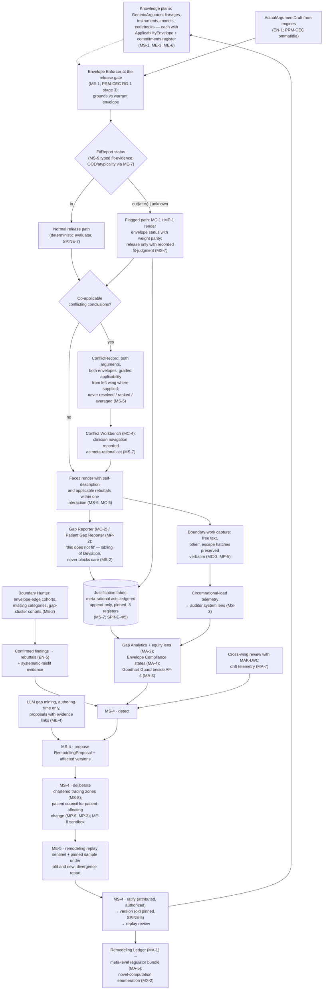

# Primer RWC — Meta-Rationality

> **Justification fabric.** The butterfly's body is the justification fabric plus the deterministic evaluator: *every claim is an argument; only arithmetic releases.* One argument object renders in three registers to three faces; the fabric is append-only, hash-chained, and version-pinned so any decision replays bit-for-bit. Two wings paint the body — the **Left Wing** (MAK-LWC) senses in degrees, the **Right Wing** (MAK-RWC) judges in systems — and their coordination is the flight (MAK-MIF). The host is **MAK-FFC v1.1**: no primer here relaxes a corpus MUST. Regulatory content is governed by **REG-POSTURE v1.0** via **MAK-ANT** — assume inclusion, glass-box as the design target, ASSUME-REG-001..007 open pending counsel. This primer's position: *the judgment-of-systems layer that computerizes the occasions of meta-rational judgment and never the judgment — envelopes as data, gaps as fabric objects, conflicts held not averaged, every ontology change through one governed lifecycle — hosted by the fabric and never forked from it.*

## RWC1. What this is

The meta-rational spine is a set of cross-face capabilities layered onto the MAK-FFC justification fabric, not a fork of it: ApplicabilityEnvelope, GapReport, RemodelingProposal, ConflictRecord and TradingZoneArtifact are fabric entries under the same append-only, version-pinned, argued discipline as clinical claims (MAK-RWC Part 2; MAK-FFC SPINE-4/5). Where the sibling wing governs the semantics of *degree* inside a fixed ontology, this wing governs the *fit, change and plurality of ontologies themselves* (Part 0). Its defining property is the corpus's division of labour, stated as doctrine: meta-rationality cannot be computerized, but its occasions can be detected and its acts recorded — so the system computerizes envelope-checking (MS-1, ME-1), gap detection (MS-2, MS-3), conflict materialization (MS-5) and remodeling bookkeeping (MS-4, ME-5), and humans supply the judgment those mechanisms exist to serve (Part 1: *"computerize the occasions of meta-rational judgment, never the judgment"*). Every such act — a gap report, an envelope change, a conflict navigation, a trust-override — is ledgered with the same discipline as a rational one (MS-7). The regulatory consequence is the corpus's sharpest: under REG-POSTURE the glass-box test (REG-FIND-004) is a systems-judgment test, and this layer — envelope discipline, remodeling ledger, novel-computation enumeration (MX-2) — is where the architecture meets it (Thesis; REG-KEEP-002).

*Trace: MAK-RWC Thesis; Part 0; Part 1 working definitions; Part 2 layered figure; MS-1, MS-2, MS-4, MS-5, MS-7, ME-1, MX-2; REG-FIND-004, REG-KEEP-002 (cited by ID per MAK-ANT).*

## RWC2. Scope

**In scope** — the six MAK-RWC requirement families this primer owns:

- **MS-1..9 · Meta-rational Spine.** Machine-readable ApplicabilityEnvelope on every knowledge-plane element, "envelope unknown" as a recordable state (MS-1); GapReport as a first-class fabric object distinct from Deviation, never blocking care (MS-2); circumrational-load telemetry to the auditor system lens (MS-3); the single governed remodeling lifecycle detect → propose → deliberate → ratify → version → replay, of which MAK-FFC AF-5/PF-3 and MAK-LWC FS-5 ratifications are instances (MS-4); plural systems coordinating only through ConflictRecords — never resolved, ranked, averaged or suppressed (MS-5); the system's limits as queryable, fabric-generated content (MS-6); meta-rational acts ledgered in all three registers (MS-7); chartered trading zones (MS-8); the wing-coordination contract typing *degree* and *fit* distinctly (MS-9).
- **MC-1..7 · Clinician Face, meta-rational-scoped.** Envelope status with weight parity to the recommendation (MC-1); one-interaction gap reporting, deviate-versus-gap rendered plainly (MC-2); boundary work as legitimate work (MC-3); the Conflict Workbench with recorded synthesis (MC-4); the system arguing against itself within one interaction (MC-5); evidence-gated, rare meta-prompts governed like CF-5 (MC-6); meta-rational outcome measures in face evaluation (MC-7).
- **MP-1..6 · Patient Face, meta-rational-scoped.** Honest plain-register applicability (MP-1); patient gap reports with authorship and visible acknowledgment (MP-2); values mappings as remodeling through the full MS-4 lifecycle (MP-3); fit-uncertainty and degree-uncertainty worded distinctly (MP-4); no coercive formalization — escape hatches preserved verbatim (MP-5); patient-council stage for patient-affecting remodeling (MP-6).
- **MA-1..7 · Auditor Face, meta-rational-scoped.** The remodeling ledger reconstructing why the ontology is what it is at any date (MA-1); gap analytics with an equity lens routed as a safety finding (MA-2); the Goodhart guard — metrics as versioned argued artifacts, gaming detection beside AF-4 (MA-3); out-of-envelope release as distinct compliance states derived from ME-1 records (MA-4); the meta-level regulator bundle (MA-5); meta-rational acts never punished by default (MA-6); scheduled cross-wing review (MA-7).
- **ME-1..8 · Engines, meta-rational plane.** Envelope check at the release gate with a flagged path that cannot be bypassed silently (ME-1); boundary-hunting perturbation classes feeding EN-5 and MS-4 (ME-2); the compiler's ontological-commitments register (ME-3); authoring-time LLM gap mining under human ratification (ME-4); remodeling replay gating ratification (ME-5); model applicability as versioned machine-checkable data (ME-6); OOD/atypicality signals routed as typed fit-evidence (ME-7); the what-if sandbox inside the firewall (ME-8).
- **MX-1..5 · Cross-cutting.** REG-POSTURE governs; flag-and-route on divergence (MX-1); the glass-box discipline — every released computation is a named published instrument or an explicitly labelled Mākoha-novel computation (MX-2); the meta-rational layer in the low-resource profile (MX-3); toolchain bindings to Ketryx-on-Jira / Baseten / split pipeline as defaults contingent on ASSUME-REG closures (MX-4); the two-wing conformance suite with adversarial confusion cases (MX-5).

**Out of scope** — each exclusion names its owner:

- Degree semantics — membership functions, codebooks, hedges, Z-grounds, the CWW round trip and every μ rendering (PRM-LWC; MAK-LWC FS/FC/FP/FA/FE/FX). MS-9 governs only the *typing and routing* between the wings; this primer never grades.
- The release pipeline itself, its stage order and the single-gate negative tests (PRM-CEC; MAK-CEC RG-1/RG-8). ME-1 supplies the envelope check that PRM-CEC executes as RG-1 stage 3; this primer never produces a verdict.
- Deviation machinery — the Deviation object, Deviation Composer and compliance states AF-3 already defines (MAK-FFC SPINE-8, CF-3, AF-3; realized in `cdss-fabric` per Arch §14.2). MS-2's GapReport is Deviation's *sibling*, not its replacement (MC-2).
- Rendering surfaces and interaction design beyond the meta-rational components inventoried in RWC3 (PRM-HDC, PRM-TXC, PRM-ABC for face law; PRM-LBP, PRM-PRB for UI). MC/MP/MA here are meta-rational-scoped families and never substitute for MAK-FFC CF/PF/AF or the face primers' families.
- The knowledge-plane substrate — signing, versioning, the PR gateway through which envelopes and compiled commitments enter (Primer D; `cdss-compiler`, Arch §14.2; MAK-FFC EN-3). This primer defines *what* an ApplicabilityEnvelope and a commitments register are; the registry and compiler define how artifacts are admitted and pinned.
- Learned-artifact admissibility — model cards, census, training-data rulings (Primer J). ME-6 states what applicability data a model version must ship; Primer J's card is where it lives (see RWC-F6).
- Change-release plumbing — which mechanisms gate which change class (Primer I). MS-4 and ME-5 define the *remodeling* change class and its replay evidence; Primer I binds it (see RWC-F5).
- Regulatory classification, intended-purpose wording and the REG-POSTURE text itself (PRM-ANT; MAK-ANT AN-1..12). MX-1 is carried series-wide as MAK-ANT's flag-and-route rule; this primer cites REG-* IDs and never reproduces them.
- Generic corruption-engine machinery and rulebook (Primer G; MAK-CEC AD family). This primer contributes the boundary-hunting perturbation classes (ME-2) and consumes their findings (MC-5, MS-6).

*Trace: MAK-RWC Part 0 scope and fold-in discipline; LLM usage contract rules 2–3; MS-9; ME-1; MC-2; Part 8 fold-in map; Appendix A census.*

## RWC3. Breadth and depth of content required

Forty-two requirements (MS 9 · MC 7 · MP 6 · MA 7 · ME 8 · MX 5; 31 MUST, 10 SHOULD, 1 MAY), of which the component inventories in MAK-RWC Parts 3–6 enumerate **twenty-four named components**: six clinician (Envelope Renderer, Gap Reporter, Conflict Workbench, Self-Description Panel, Boundary-Work Capture, Meta-Prompt Governor), six patient (Fit Renderer, Patient Gap Reporter, Escape-Hatch Capture, Values Remodeling Gateway, Fit-vs-Degree Renderer, Patient Council Interface), six auditor (Remodeling Ledger, Gap Analytics, Goodhart Guard, Envelope Compliance Monitor, Regulator Trading Zone, Cross-Wing Review), six engine (Envelope Enforcer, Boundary Hunter, Commitments Register, Remodeling Replayer, Model Applicability Data, Fit-Signal Router).

To be real rather than a demo, the layer needs: **every deployed element enveloped or explicitly envelope-unknown** for one compiled guideline domain — MAK-RWC's phased plan names this as the R0 exit; **the flagged path proven closed** — out-of-envelope release impossible without a recorded fit-judgment (R1 exit, ME-1/MS-7); **gap reports flowing end to end to MA-2 analytics with no punishment path** (R2 exit, MA-6 audit); **one governed remodeling ratified with replay evidence and both versions replayable** (R3 exit, MS-4/ME-5); **a boundary-hunter finding driving an envelope narrowing through MS-4 end to end** (R4 exit); and **an external reviewer reconstructing the ontology's history and every novel computation from exports alone** (R5 exit, MA-5/MX-2). The corpus's four working definitions (envelope, gap report, remodeling, trading zone — Part 1) are normative vocabulary and must appear as schema, not prose: the corpus is explicit that "envelopes are data, not prose" (MS-1) and that self-description is "never hand-maintained marketing prose" (MS-6).

Depth constraints from the corpus's open research agenda: no validated instrument exists for structured "this doesn't fit" capture (MC-2/MP-2's one-interaction bound and locus taxonomy are hypotheses); MC-7's reliance-calibration metric needs an operationalization study; MS-4's stage economics have no evidence base — R3 must be instrumented to produce one; the envelope formalism (MS-1/ME-6) needs a schema expressive enough for population descriptors and failure regions yet checkable at release time; and MA-5's meta-level bundle has no precedent as conformity material — its reception is tested through GATE-000 counsel engagement (TASK-REG-002) and the Lumos pathway (TASK-REG-015).

*Trace: MAK-RWC Appendix A; Parts 3–6 component inventories; Part 1 working definitions; Part 7 phased execution plan R0–R5; Open research agenda.*

## RWC4. Building in a silo

Most of the spine's data structures and checks are pure and can be built with no dependency on any other primer's output:

- **ApplicabilityEnvelope schema + validator** (MS-1). Inputs mockable: hand-authored envelopes for one guideline domain's GenericArguments and instruments. The validator's two hard rules are unit tests: no element without an envelope or an explicit `unknown` state; `unknown` never renders as universality. Stub: the registry PR gateway (Primer D) — a local signed directory with the same hash-manifest shape.
- **Envelope Enforcer** (ME-1) implementing the fit-enforcement contract in MAK-RWC Part 6 verbatim: `(ActualArgumentDraft, ApplicabilityEnvelope) → FitReport{in | out(attrs[]) | unknown}`. Pure function of grounds + envelope + pins; property-test that `out`/`unknown` never yields a normal-path result. Stub: PRM-CEC's RG-1 pipeline — emit the FitReport in the `Ommatidium.fit` shape (MAK-CEC Part 2) so stage 3 slots in later.
- **GapReport and ConflictRecord object schemas** (MS-2, MS-5). Data-plane schemas: structured locus, free text, author identity; both sides' arguments and envelopes with no rank/score field. The "filing never blocks" and "never resolve/average" rules are negative tests over fixtures. Stub: the `cdss-spine` ActualArgument schema (CONTRACT-ARG-1, Proposed per Primer A §A10) as the argument reference type; see RWC-F4.
- **Type-separation of fit vs degree** (MS-9). A schema validator over `FitReport.signals` that rejects any μ, activation or posterior typed field — the mirror of PRM-LWC's FS-3 validator (TASK-LWC-002), and the two suites together are MX-5's seed.
- **Commitments register in the compiler** (ME-3). Given a compiled GenericArgument bundle and its source guideline's stated exclusions, emit the register and fail compilation when the register omits a stated exclusion. Needs only ELSM-01/02 outputs and a fixture guideline.
- **Remodeling lifecycle state machine + ledger schema** (MS-4, MA-1). Six stages, none skippable, each stage record attributed and version-pinned; a fixture that attempts edit-in-place or configuration change fails. Deliberation content (MS-8 trading zones) is mockable as charter files.
- **Remodeling Replayer** (ME-5). Replay a fixture decision set under two ontology versions; enumerate divergences. Needs only two template versions and a fixture; later rides PRM-CEC's single RG-4 harness.
- **Envelope compliance states** (MA-4). Derive the three states from ME-1 records only; a fixture that supplies no enforcement record must yield no state (never retrospective inference).
- **Self-description assembler** (MS-6). Pure projection over envelopes, EN-5 rebuttal fixtures, drift fixtures and ledger fixtures; property: identical fabric inputs and pins → byte-identical self-description.

What cannot be built in the silo: the six face-renderer components per face (they depend on PRM-HDC/TXC/ABC surfaces and PRM-LBP/PRB components); the Boundary Hunter's perturbation content (depends on Primer G's rulebook R8 and the corruption engine's harness — MAK-CEC AD-1); the Fit-Signal Router (depends on Primer F / MAK-CEC QU-2 conformal outputs and an OOD detector); MA-2 analytics and MS-3 telemetry (depend on live gap-report and boundary-work streams); the Values Remodeling Gateway (depends on MAK-FFC PF-3 custody in PRM-TXC); MX-4 toolchain bindings (depend on ASSUME-REG-004/006 closures). These are RWC5 edges.

*Trace: MAK-RWC Part 6 fit-enforcement contract; MS-1, MS-2, MS-4, MS-5, MS-6, MS-9, ME-1, ME-3, ME-5, MA-4; Part 7 R0–R1; MAK-CEC Part 2 Ommatidium contract.*

## RWC5. Folding it in

Integration contract — consumes and emits, with the counterpart edge named.

**Consumes**

| From | What | Interface | Counterpart edge |
|---|---|---|---|
| Primer D / `cdss-compiler` (knowledge plane) | Compiled GenericArgument bundles with per-warrant envelope and commitments register (ME-3), entering through the registry PR gateway (MAK-FFC EN-3) | Registry serving API; version pins from R1 | MAK-CEC CP-1 requires "the applicability envelope with stated exclusions (MS-1, ME-3)" per warrant node and CP-6 fails compilation without it — **checked, consistent**. Primer D §D8 fragment schema carries `jurisdiction`, `age_band` and context exclusions but no ApplicabilityEnvelope — see finding RWC-F7 |
| Primer J (model governance) | Model applicability data per model version: training-population descriptors, validation cohorts, subgroup performance, known failure regions (ME-6) | Machine-checkable card fields; card is the rendering, data is the source of truth | Primer J §J9 card template has `scorecard[].stratum` and `intended_use.out_of_scope` but no population descriptor or failure-region block — see finding RWC-F6 |
| PRM-CEC (engine plane) | Conformal nonconformity extremes, large prediction sets, OOD detector scores as typed fit-evidence (ME-7); confirmed boundary-hunter findings (ME-2) | `FitReport.signals` (typed per MS-9); rebuttal objects (EN-5) | MAK-CEC QU-2 "conformal double duty is typed … never as mere low confidence"; AD-3 routes systematic-misfit findings → MS-4 detection — **checked, consistent** |
| PRM-LWC (sibling wing) | Graded applicability where the left wing supplies it, for the Conflict Workbench (MC-4) and the Fit-vs-Degree renderer (MP-4); left-wing drift telemetry for cross-wing review (MA-7) | Argument content typed μ (MAK-LWC FS-3), never entering `FitReport` | MAK-LWC FS-3 type separation + MS-9 = MAK-CEC OM-3 plane law — **checked, consistent**; PRM-LWC GAP-LWC-001 (drift telemetry register home) pairs with GAP-RWC-002 below |
| PRM-TXC / PRM-PRB, PRM-HDC / PRM-LBP (faces, UIs) | Gap reports, escape-hatch content, "other/none-of-these" selections, boundary-work free text, trust-override events (MS-2, MS-3, MC-3, MP-5) | Fabric write via face gateway; patient authorship carried (MP-2) | MAK-HDC HA-3 carries MC-2; MAK-TXC carries MP-2/MP-5 — **checked, consistent** |
| PRM-ANT (regulatory sensing) | REG-FIND-001..008, REG-KEEP-001..004, FORK-REG-001, GATE-000..004, ASSUME-REG-001..007 status; KTX-001..012, TASK-REG-009/010 (MX-1, MX-4) | R30 Regulatory Posture Register (Arch §14.3, Proposed) | MAK-ANT carries MX-1 series-wide as its flag-and-route requirement and logs S-1 (PCCP) / S-2 (TGA AI guidance) from MAK-RWC Part 9 — **checked, consistent** |

**Emits**

| To | What | Interface | Counterpart edge |
|---|---|---|---|
| PRM-CEC (deterministic evaluator) | The envelope check as RG-1 stage 3: `FitReport` per draft; `out`/`unknown` → flagged path requiring a recorded fit-judgment (ME-1, MS-7); ConflictRecords for stage 4 (MS-5) | Fit-enforcement contract (RWC8, verbatim); DetectedIssue-bound ConflictRecord (SPINE-6) | MAK-CEC RG-1 stages 3–5 and RG-2 "for flagged releases, the recorded human fit-judgment (MS-7)" — **checked, consistent**; stage order (thresholds before envelope) is PRM-CEC's law and this primer takes no position |
| Fabric (`cdss-fabric`) | GapReport, RemodelingProposal, ConflictRecord, TradingZoneArtifact, envelope-change and fit-judgment entries — append-only, attributed, version-pinned, renderable in three registers (MS-7) | Fabric write API; FHIR Provenance/AuditEvent bindings (SPINE-4; ELSM-20) | Arch §14.2 lists ActualArgument/GenericArgument and Deviation schemas entering `cdss-spine`; no GapReport/Envelope/ConflictRecord/RemodelingProposal schema — see finding RWC-F4 |
| PRM-HDC / PRM-TXC / PRM-ABC | Envelope status (MC-1, MP-1), gap affordances (MC-2, MP-2), conflict rendering (MC-4), self-description (MS-6, MC-5), meta-prompt rules (MC-6); remodeling ledger, gap analytics, Goodhart flags, envelope states, meta-level bundle (MA-1..5) | Read model over fabric + telemetry; register-scoped projections (SPINE-9) | MAK-HDC HR-3/HA-4 consolidate MC-1 with weight parity; MAK-TXC carries MP-1 envelope status in register fidelity; MAK-ABC carries MA-1 and MA-4's three envelope states "derived from gate records, never retrospective inference" — **checked, consistent** |
| Primer G / MAK-CEC AD | Boundary-hunting perturbation classes: atypical presentations, envelope-edge cohorts, missing-category constructions, cohorts matching MA-2 gap clusters (ME-2) | Perturbation functions in G's rulebook shape (R8) | MAK-CEC AD-1 "map ii" consolidates ME-2 — **checked, consistent** |
| Primer I (living evaluation) | The remodeling change class: MS-4 lifecycle records + ME-5 divergence report as mandatory ratification input; envelope changes as remodeling (risk register "envelope inflation") | Adjudication records (R12); replay via MAK-CEC RG-4 | Primer I §I8 binding table has no ontology/envelope change class; I10 adds "GenericArgument compilation release" and "deviation-taxonomy change" only — see finding RWC-F5 |
| PRM-LWC (sibling wing) | Fit-side typing of the MS-9 contract; joint cross-wing review findings routed to MS-4 detection (MA-7); MX-5 adversarial confusion cases | MX-5 suite inside the firewall (MAK-CEC RG-3) | MAK-LWC FX-3 harness is the sibling precedent MX-5 cites — **checked, consistent** |
| Primer J (model governance) | Envelope narrowings and confirmed-misfit findings as refresh triggers for the affected model version (ME-6 ↔ J refresh law "keyed to the version registry, never the calendar") | Version-registry events (R1) | Primer J §J2(b) refresh law — **checked, consistent** |
| PRM-ANT | Update-note pattern for superseded framings (MAK-RWC Part 7); logged signals S-1/S-2 | MAK-ANT Part 4 signal log | MAK-ANT AN family states MX-1 once, series-wide — **checked, consistent** |

**Fabric binding (MAK-FFC).** This component supplies *new fabric object classes* (GapReport, ConflictRecord, RemodelingProposal, TradingZoneArtifact, ApplicabilityEnvelope — SPINE-4 entries under MS-7), feeds the *Rebuttal slot* (envelope narrowings and boundary-hunter findings via EN-5 — SPINE-2 extended per MAK-RWC Part 8), and joins the Qualifier with a typed *fit status* (ME-1; SPINE-2 "qualifier joined by fit status"). It never supplies a Claim and never releases: the envelope check is a stage the deterministic evaluator executes (SPINE-7 extended — "computerize the occasions of judgment, never the judgment"). Coordination doctrine: MAK-MIF beat 4 (conflict with a metric — surfaced unresolved, choice recorded), beat 5 (disagreement held, not averaged — trading zones and deliberation records), beat 7 (the adversary's map — boundary hunter and Goodhart guard), beat 8 (the LLM on a leash — ME-4 gap mining, proposal-only); beats 1–3 are shared with PRM-LWC (ME-1 flagged path and MS-9 routing; MS-3 load telemetry; MS-4 lifecycle and MA-7 cross-wing review).

*Trace: MAK-RWC Part 2 layered figure; Part 6 fit-enforcement contract; Part 8 FFC fold-in map and MAK-MIF beat map; MS-2, MS-5, MS-7, MS-9, ME-1, ME-2, ME-3, ME-5, ME-6, ME-7, MA-1, MA-4, MA-7, MX-1, MX-5; MAK-CEC Part 2 (Ommatidium), RG-1/RG-2/RG-4, QU-2, AD-1/AD-3, CP-1/CP-6; Primer D §D8; Primer I §I8/§I10; Primer J §J2/§J9; Arch §14.2; MAK-ANT Part 3–4.*

## RWC6. Definition of done

Per release, all of:

1. **MS conformance suite green** — every MS-1..9 MUST has an executable check; no deployed knowledge-plane element lacks an envelope or an explicit `unknown` state, and `unknown` never renders as universality (MS-1; R0 exit).
2. **Flagged path closed** — a fixture set of out-of-envelope and envelope-unknown drafts yields zero normal-path releases; every flagged release carries an MS-7 fit-judgment entry; a build in which the flagged path can be bypassed silently fails CI (ME-1; MX-5 routing green; R1 exit).
3. **Gap reports go somewhere** — gap reports from clinician and patient (MC-2, MP-2) reach MA-2 analytics end to end with authorship and demographic context under consent; receipt is visibly acknowledged; filing never blocks care and never requires resolution (MS-2); an MA-6 audit finds no path from gap reports, deviations, escape-hatch use or fit-judgments into individual performance management, credentialing or sanction (R2 exit).
4. **Boundary work preserved** — free text, "other/none-of-these" and out-of-form annotations are captured verbatim, rendered downstream, and counted in MS-3 telemetry; no validation error, block or silent discard on them; no completion metric is optimized by removing an escape hatch (MC-3, MP-5).
5. **One lifecycle, no side doors** — every ontology-layer change (envelope, template, instrument, codebook, values mapping, metric definition) carries all six MS-4 stage records; a fixture attempting edit-in-place, configuration or runtime-learning change fails; MP-3 values mappings and MA-3 metric changes are shown to pass through MS-4, not parallel mechanisms (MS-4, MP-3, MA-3, MX-5).
6. **Replay gates ratification** — no ontology change ratifies without an ME-5 divergence report over the sentinel set and a pinned historical sample; post-ratification both versions replay bit-for-bit (ME-5; SPINE-5; R3 exit).
7. **Conflicts held** — every pair of co-applicable conflicting conclusions is a ConflictRecord carrying both arguments and both envelopes; no rank, score, average or suppression field exists; a clinician's navigation is recorded as an MS-7 act (MS-5, MC-4).
8. **Compiler refuses omission** — a compiled GenericArgument whose source states exclusions absent from the commitments register fails compilation (ME-3); every model version ships machine-checkable applicability data consumed by MS-1 envelopes (ME-6).
9. **Envelope compliance states derived, not inferred** — MA-4's three states derive only from ME-1 enforcement records; a fixture with no record yields no state; the states export with AF-7/MA-5 bundles.
10. **Glass-box enumerable** — the auditor face enumerates every Mākoha-novel computation in the release; none presents under a published instrument's name or blends into one (MX-2); the MA-5 meta-level bundle is not presented while Appendix B checks or ME-5 replays are failing (MA anti-requirement).
11. **Regulatory hygiene** — no statement in the release's documents contradicts a REG-FIND without a flagged update note; no ASSUME-REG item is described as closed without written external attestation in R30 (MX-1); MX-4 bindings are labelled contingent on their ASSUME-REG closures.
12. **Face-study gates** for releases touching a face: MC-7's meta-rational outcome measures (gap-report rate and disposition, reliance calibration, conflict-navigation quality, envelope comprehension) with independent evaluators; low-resource gap-report streams receive the MA-2 equity lens by default (MX-3).

*Trace: MAK-RWC Part 7 phased execution plan exit gates R0–R5; MS-1, MS-2, MS-4, MS-5, ME-1, ME-3, ME-5, ME-6, MC-2, MC-3, MC-4, MC-7, MP-2, MP-3, MP-5, MA-3, MA-4, MA-5, MA-6, MX-1, MX-2, MX-3, MX-5; Auditor Face anti-requirements.*

## RWC7. Internal operations diagram



## RWC8. Execution layer

**Fit-enforcement contract** (verbatim from MAK-RWC Part 6, the executable spec):

```text
// Extends the MAK-FFC engine contract (EN-1); nothing here replaces it.
interface EnvelopeCheckedRelease {
  draft:    ActualArgumentDraft        // per EN-1, all six Toulmin elements
  envelope: ApplicabilityEnvelope      // per MS-1, machine-readable, pinned
  fit:      FitReport {
    status:     in | out(attrs[]) | unknown
    signals:    OODScore? | atypicality? | gapReports[]   // typed fit-evidence (MS-9)
  }
  // Release semantics (deterministic, per SPINE-7):
  //   in       → normal release path
  //   out/unknown → flagged path only: release requires a recorded human
  //                 fit-judgment (MS-7); silent release is a build error
}
```

**ApplicabilityEnvelope fields (MS-1, stated in the corpus as a field list, not a schema — schema shape is this primer's proposal, flagged):** target population, validated context, validation status and evidence tier, known exclusions, known gaps; plus `state: enveloped | unknown` and pins. The corpus gives no wire format; the open research agenda names the envelope formalism as unresolved. **Data-plane bindings (MAK-FFC SPINE-4, MS-7):** ConflictRecords as FHIR `DetectedIssue` (SPINE-6); meta-rational acts as `Provenance`/`AuditEvent`-bound fabric entries; GapReport binding is `{{UNSOURCED — operator to confirm}}` (the corpus binds Deviation and conflict, not the gap object).

**First executable properties (seed for the I registry, meta-rational subset):** (1) ∀ knowledge-plane element: envelope present or `state = unknown`; never absent (MS-1). (2) `status ∈ {out, unknown}` ⇒ verdict ∈ {held, flagged}; a released verdict with no MS-7 fit-judgment entry is a build error (ME-1). (3) ∀ ConflictRecord: both arguments and both envelopes present; no field typed rank/score/weight; conflicts materialized = conflicts rendered (MS-5). (4) Filing a GapReport changes no draft's verdict and blocks no workflow step (MS-2, MC-2). (5) `FitReport.signals` accepts no field typed μ/activation/posterior; `GradedGroundAnnotation` accepts no field typed fit — the MX-5 confusion fixtures (degree-mimics-gap, gap-mimics-degree, both) all route correctly (MS-9). (6) An ontology version with fewer than six MS-4 stage records cannot be pinned by a template (MS-4). (7) Post-ratification, a pinned historical decision replays bit-for-bit under its superseded version (ME-5; SPINE-5). (8) A compiled bundle whose source exclusions ∉ commitments register fails compilation (ME-3). (9) Identical ME-1 enforcement records ⇒ identical MA-4 states; no record ⇒ no state (MA-4). (10) Identical fabric inputs + pins ⇒ byte-identical MS-6 self-description.

**Asset library** — every requirement family maps to at least one row. Seeded from MAK-RWC Part 9 (carried ELSM-01..23 verified 2026-08-29; refresh rows ELSM-R01..R04 verified 2026-09-01) and MAK-ELSM v1.1; **eight rows re-fetched this run, 2026-09-02**, method stated; others carried forward with their source date. Verdict vocabulary per MAK-ELSM: ADOPT / ADAPT / STUDY / BUILD / WATCH; **DEAD-REPLACE** added for archived assets.

| Asset | Type | Satisfies | Licence | Currency | Verified (method · date) | Verdict |
|---|---|---|---|---|---|---|
| [SeldonIO/alibi-detect](https://github.com/SeldonIO/alibi-detect) (ELSM-R01) | library (Python) | ME-7 OOD detector layer; MA-7 drift | **BUSL-1.1 since v0.11.5 (22 Jan 2024); change licence Apache-2.0 four years after each release** — MAK-RWC Part 9 lists Apache-2.0 | v0.13.0 · 11 Dec 2025 · active | GitHub releases + raw LICENSE + PyPI fetched · 2026-09-02 | **ADAPT — licence review before any production use; corpus row is wrong (RWC-F2)** |
| [evidentlyai/evidently](https://github.com/evidentlyai/evidently) (ELSM-R02) | library (Python) | MS-3 telemetry scaffolding; MA-7 | Apache-2.0 (confirmed) | 0.7.21 · 10 Mar 2026 per PyPI (GitHub releases page rendered the year as 2025 — PyPI taken as authoritative) | PyPI + GitHub releases fetched · 2026-09-02 | **ADOPT — argument-aware telemetry and fabric coupling remain BUILD on top** |
| [mlcommons/medperf](https://github.com/mlcommons/medperf) (ELSM-R03) | platform | ME-6 subgroup/site validation evidence; MC-7 | Apache-2.0 (confirmed) | 169★ · 301 commits · active (MLCommons) | GitHub repo page fetched · 2026-09-02 | **ADAPT / STUDY** |
| [openregulatory/templates](https://github.com/openregulatory/templates) (ELSM-R04) | document templates | MX-4 document-layer conformity; MA-5 | **CC BY-NC-SA 4.0** (LICENSE.md fetched) — non-commercial | 159★ · 58 commits · active | GitHub + raw LICENSE.md fetched · 2026-09-02 | **STUDY — NC licence bars adoption inside a commercial SaMD QMS without a separate grant (RWC-F3)** |
| [TweetyProjectTeam/TweetyProject](https://github.com/TweetyProjectTeam/TweetyProject) (ELSM-07) | library (Java) | MS-5 conflict semantics behind ConflictRecords (evaluator only) | LGPL-3.0 from v1.6; GPL-3.0 before | v1.31 · 14 Jul 2026 · active | GitHub releases fetched · 2026-09-02 | **ADAPT — pin ≥ 1.6** |
| [scikit-learn-contrib/MAPIE](https://github.com/scikit-learn-contrib/MAPIE) (ELSM-12) | library (Python) | ME-7 nonconformity extremes as fit-signals | BSD-3-Clause | **1.5.0 · 5 Aug 2026** · very active | PyPI fetched · 2026-09-02 | **ADOPT (J-1/J-2 only; EXCLUDED from J-3 per MAK-ELSM §08)** |
| [Giskard-AI/giskard](https://github.com/Giskard-AI/giskard) (ELSM-15) | library (Python) | ME-2 boundary-hunter harness scaffolding; MA-3 experiments | Apache-2.0 | **3.0.0 · 26 Aug 2026 — fresh rewrite focused on agentic/LLM systems, reduced dependencies** | PyPI fetched · 2026-09-02 | **WATCH — confirm tabular metamorphic/scan features survive v3 before depending (RWC-F9)** |
| FDA PCCP final guidance — *Marketing Submission Recommendations for a PCCP for AI-Enabled Device Software Functions* | regulatory instrument (US) | MS-4 stage vocabulary; ME-5 verification methods; MA-5 bundle design | — | Final; Federal Register availability notice 4 Dec 2024 (2024-28361) | Federal Register listing via web search · 2026-09-02 (FDA page URL in corpus not fetched — 404 on guessed slug) | **STUDY — US-only; confers nothing at the TGA** |
| TGA AI guidance ("same rules, smarter tools"), 22 Apr 2026 | regulatory instrument (AU) | MS-4 (functional updates as regulatory events); MS-6/ME-6/MA-5 transparency; REG-KEEP-004 reading | — | Current | Allens practitioner analysis (22 Apr 2026) fetched · 2026-09-02 — **secondary source**; TGA primary page not fetched | **ADOPT as governance precedent; PRM-ANT owns the citation surface (MAK-ANT S-2)** |
| cqframework/clinical_quality_language + clinical-reasoning (ELSM-01/02) | library | ME-3 compiler substrate the commitments register annotates | Apache-2.0 | active; clinical-reasoning v4.7.0 May 2026 | carried forward from MAK-RWC Part 9 / MAK-ELSM §01 (verified 2026-08-29) | **ADOPT** |
| WHO SMART Guidelines IGs (ELSM-06) | content | MS-4/XC-4 source ontologies; MX-3 | CC/Apache mix | active program | carried forward from MAK-ELSM §01 (2026-08-29) | **ADOPT** |
| google/android-fhir + opensrp/fhircore (ELSM-04/05) | SDK / app | MX-3 offline meta-rational profile (on-device intake + gap reporting) | Apache-2.0 | fhircore v2.2.2 Nov 2025 (re-verified 2026-09-01) | carried forward from MAK-RWC Part 9 §refresh (2026-09-01) | **ADOPT / STUDY** |
| Trusted-AI/adversarial-robustness-toolbox (ELSM-16) | library | ME-2 perturbation ammunition | MIT | active (LF AI) | carried forward from MAK-ELSM §03 (2026-08-29) | **ADOPT (CI only)** |
| CLArg-group/argumentative-llms (ELSM-09); ArgTumour/ArgEval pattern | research code | ME-4 gap-mining pattern ("LLM proposes, formal layer decides") | see repo | research-grade | carried forward from MAK-ELSM §02/§05 (2026-08-29) | **ADAPT — authoring-time only** |
| Aurora PostgreSQL + transparency-log pattern (ELSM-19); HAPI FHIR jpaserver-starter (ELSM-20) | pattern / server | MS-7 ledger substrate; MA-1 remodeling ledger on the same store; Provenance/AuditEvent | Apache-2.0 refs | active | carried forward from MAK-ELSM §04 (2026-08-29); QLDB (ELSM-18) remains **DEAD-REPLACE** | **ADOPT PATTERN** |
| Ketryx-on-Jira (KTX-001..012) | commercial SaaS | MX-4 lifecycle system of record for MS-4 gates | commercial | — | not verified this run; contingent on ASSUME-REG-006 per MAK-RWC Part 9 | **WATCH — default, not architecture (MX-4)** |
| **ApplicabilityEnvelope schema + Envelope Enforcer** | build | MS-1, ME-1, MC-1, MP-1 | — | no public precedent for envelope enforcement at a release gate (MAK-RWC Part 9 build list) | Part 9 targeted search (2026-09-01); this primer RWC4 | **BUILD — schema shape flagged for ratification** |
| **GapReport object + Gap Analytics with equity lens** | build | MS-2, MC-2, MP-2, MA-2, MC-3, MP-5 | — | no precedent (Part 9 build list) | Part 9; this primer RWC4 | **BUILD** |
| **Governed remodeling lifecycle service + Remodeling Ledger** | build | MS-4, MS-8, MA-1, MP-3, MP-6 | — | no precedent; PCCP is the regulatory analogue, not code | Part 9; this primer RWC4 | **BUILD — Ketryx binding is the record store, not the mechanism** |
| **Remodeling Replayer** | build (assembled) | ME-5 | — | rides MAK-CEC RG-4 single replay harness | this primer RWC4/RWC5 | **BUILD** |
| **ConflictRecord schema + Conflict Workbench** | build | MS-5, MC-4 | — | TweetyProject supplies semantics, not the record or surface | this primer RWC4 | **BUILD** |
| **Goodhart Guard** | build | MA-3 | — | no precedent (Part 9 build list) | Part 9 | **BUILD** |
| **Commitments register (compiler extension)** | build | ME-3 | — | annotation lift over ELSM-01/02 | this primer RWC4 | **BUILD** |
| **Fit-Signal Router + fit/degree type validator** | build (assembled) | ME-7, MS-9, MP-4, MX-5 | — | assembled from MAPIE + alibi-detect (licence-gated) | this primer RWC4 | **BUILD** |
| **Circumrational-load telemetry + Self-Description assembler + Envelope Compliance states + meta-level bundle + novel-computation enumerator** | build | MS-3, MS-6, MC-5, MC-6, MA-4, MA-5, MX-2 | — | evidently scaffolding; content is a build | this primer RWC4 | **BUILD** |
| **Model applicability data schema** | build | ME-6 | — | Primer J card extension (RWC-F6); medperf for evidence | this primer RWC5 | **BUILD** |
| **Boundary-hunting perturbation classes** | build (G extension) | ME-2 | — | emits in Primer G rulebook shape | this primer RWC4; MAK-CEC AD-1 | **BUILD** |
| Deployment-monitoring research plane — Weng 2025 (CTS), Subasri 2025 (JAMA Netw Open), Santos Silva 2025 (JBI), Prinster 2025 (WCTM), Timans 2025, Nguyen 2025 (D3M), Kwon 2026 (Sci Rep) | research | ME-7 alarm discipline; MA-7 review mathematics; MA-2 equity lens | — | 2025–26 | carried forward from MAK-RWC Part 9 refresh (2026-09-01); not re-fetched | **STUDY / WATCH — candidate mathematics, no code adopted** |
| Chapman meta-rationality corpus; GAAM (Stranieri 2006) | theory | MS-1..9 foundations; MS-2 sibling-object grain | — | — | MAK-RWC Part 1 and Part 8 sources | **STUDY — GAAM collaboration remains the highest-leverage de-risking move (open agenda)** |

**Coverage check (P5):** MS-1..9 → envelope build, GapReport build, telemetry build, remodeling build, ConflictRecord build + TweetyProject, self-description build, ledger pattern (ELSM-19/20), trading-zone charters (remodeling build), fit/degree validator. MC-1..7 → envelope build (MC-1), GapReport build (MC-2/3), Conflict Workbench build (MC-4), self-description build (MC-5/6), medperf + face-study instrument (MC-7). MP-1..6 → envelope build (MP-1), GapReport build (MP-2/5), remodeling build (MP-3/6), fit/degree validator (MP-4). MA-1..7 → remodeling ledger build (MA-1), gap analytics build (MA-2), Goodhart build (MA-3), compliance-states build (MA-4), bundle build + openregulatory STUDY + PCCP/TGA precedent (MA-5), MA-6 = negative audit over the GapReport/analytics build, alibi-detect + evidently + research plane (MA-7). ME-1..8 → Envelope Enforcer (ME-1), ART + Giskard + perturbation-class build (ME-2), CQL stack + commitments build (ME-3), argumentative-llms pattern (ME-4), Replayer (ME-5), applicability-data build + medperf (ME-6), MAPIE + alibi-detect + router build (ME-7), sandbox rides MAK-CEC RG-3 firewall (ME-8 — MAY, no dedicated row; Replayer reused). MX-1..5 → PRM-ANT/R30 (MX-1), enumerator build (MX-2), android-fhir/fhircore (MX-3), Ketryx WATCH + openregulatory STUDY (MX-4), fit/degree validator + MX-5 suite build (MX-5). **42/42 covered; 12 rows are BUILD.**

**Sourcing landmines carried forward from MAK-RWC Part 9, with this run's status:** QLDB retired, immudb BUSL, cqf-ruler legacy, fasten-onprem archived, Babylon patent, Carneades dormancy — *unchanged, carried*; TweetyProject GPL-3.0 pre-1.6 — *confirmed, pin ≥ 1.6*; Bedrock → Baseten migration (TASK-REG-009, ASSUME-REG-004 open) — *unchanged; Arch §11.4 still names Bedrock (conflict C-03, ESCALATED DEC-03)*; Ketryx commercial, ASSUME-REG-006 — *unchanged*; alibi-detect and evidently ship no clinical perturbation classes or argument-aware telemetry — *unchanged*. **New this run:** alibi-detect is BUSL-1.1, not Apache-2.0 (RWC-F2); openregulatory/templates is CC BY-NC-SA 4.0 (RWC-F3); Giskard 3.0 is a rewrite (RWC-F9); PCCP is US-only and the TGA guidance has no PCCP-equivalent — *carried from Part 9 refresh landmines, unchanged*.

**Proposed tolerances (flag: clinical and governance sign-off required; none is a corpus number):** MC-2/MP-2 one-interaction bound = one tap/click from any screen with the element in focus pre-populated; MS-4 aged-queue SLA — any RemodelingProposal without a stage transition in 90 days surfaces as an owned anomaly on the auditor lens (MA anti-requirement "aged and owned"); MC-6 meta-prompt budget per clinician-session ratified alongside CF-5 suppression budgets, default ≤ 1 per encounter absent live conflict; MA-2 equity-lens trigger — gap-report rate in any ratified subgroup ≥ 2× the deployment baseline over a rolling 30-day window; MC-7 reliance-calibration floor — out-of-envelope scrutiny rate (drill-down or gap/deviation action) ≥ in-envelope rate + 20 percentage points in the pre-pilot study.

*Trace: MAK-RWC Part 6 contract; Part 7 risk register and open agenda; Part 9 carried inventory, build list, refresh pass, landmines; Appendix C register; MAK-ELSM verdict vocabulary and §08; external verification as tabled.*

## Production topology annotation

*Per Architecture §11 and §14.5 (MET-1, Proposed):* the meta-rational layer has **no row of its own** in §14.5's additional capability rows — its machinery is spread across the Fabric row (evaluator wrap live at L2; deviation composer L3; compliance projector L4), the Guideline Compiler row (v0 at L3, multi-domain L4) and the three face rows (L2–L4). MAK-RWC's own phased plan (R0 … R5) is component-internal and not level-aligned; reconcile as follows: **R0 (envelope substrate, ME-3 in the compiler)** rides the compiler's L3 v0 entry, with MS-1 schema work permissible in the harness from L2 as propose/test (synthetic-only per GATE-002 / REG-KEEP-004); **R1 (fit enforcement, ME-1 as RG-1 stage 3)** lands with MAK-CEC CE-P2 "gate complete" and the clinician face's one-surface law at L3 — the first externally showable prototype therefore carries envelope status (MC-1) and the flagged path; **R2 (gap machinery)** at L3 beside the deviation composer, with patient-side MP-2/MP-5 confined to the J-3-safe intake/consent subset until ASSUME-REG-003 closes (Arch §14.5 footnote 1); **R3 (remodeling lifecycle, MA-1 ledger, ME-5, MX-4 Ketryx binding)** at L4 with the compliance projector, review workflows and J enforcement — GATE-000 must be closed before the regulated-tooling configuration MX-4 names (Arch §14.6); **R4–R5 (vigilance, pluralism, meta-level evidence)** at L4 limited release → L5, where MA-5's bundle joins the dossier assembly and GATE-004 (ARTG inclusion) is L5's definition of done. Tier pipeline applies in full from first release (§11.1). J-tier: the layer is native to J-1 and J-2 (no learned parameters in enforcement, ledger or replay; ME-4/ME-7 consumers are the only learned inputs and they propose only); in J-3 the envelope and gap machinery are lawful and useful (named instruments carry envelopes; gap reports are not diagnosis) but ME-7's conformal/OOD inputs are structurally absent (MAK-ELSM §08 EXCLUDED rows; MAK-J3 GPP-8) — MAK-RWC Part 8 carries Annex 1 unchanged and this primer adds no GPP narrowing. See finding RWC-F1.

## Register topology annotation

*Per Architecture §12 (R1–R28) and §14.3 (R29–R30, Proposed):* **Owns:** none — every meta-rational artifact is a fabric entry (MS-7) and the fabric's ledger substrate is `cdss-fabric`'s under DEC-04. **Writes:** R1 (envelope version and commitments-register version stamps on every FitReport and self-description); R2 (manifest on every envelope/commitments bundle emit); R7 (meta-rational property subset, RWC8); R12 (MS-4 deliberation records and ME-5 divergence reports — the remodeling adjudication is change control); R25 (build evidence — this run's verification table); R30 reads-and-cites only (regulatory owner writes). **Reads:** R1, R4 (model cards for ME-6 applicability data), R8 (G rulebook for ME-2 class pairing), R11 (decision log for MA-4 derivation where fragments release), R13 (acceptance telemetry — MS-3 override/deviation components), R14, R19 (posture state for MX-4), R30 (REG-* status for MX-1). **Gap proposals:** GAP-RWC-001 — the remodeling ledger (MA-1) is a read model over fabric entries, but the RoR law ("if it is not in a register, it did not happen") wants a register home for ontology-version lineage; propose R12 extension (adjudication log already carries change-control records) with a `change_class: ontology` discriminator, or a new register; operator decision. GAP-RWC-002 — circumrational-load telemetry (MS-3) and gap analytics (MA-2) have no register home; pair with PRM-LWC GAP-LWC-001 (drift telemetry) and MAK-CEC RG-5's unified telemetry schema — propose one telemetry register for both wings rather than two. GAP-RWC-003 — trading-zone charters (MS-8) are versioned configuration with no register; propose a spine-owned versioned register or an R26/R25 sub-table; operator decision. GAP-RWC-004 — the Regulatory Posture Register R30 is Proposed; MX-1's "never mark an ASSUME-REG closed" rule needs R30 ratified to be machine-checkable.

<!-- ECOSYSTEM-V2-BLOCK: RWC v1.0 -->
## RWC9. Build Execution Extension (Ecosystem v2.0)

**1. Mini-North-Star.** WHAT: the ApplicabilityEnvelope schema and Envelope Enforcer emitting `FitReport`, the GapReport and ConflictRecord objects, the six-stage remodeling lifecycle with ledger and replayer, the fit/degree type validator, and the meta-rational property suite. WHY: the layer that lets the fabric know its own envelope, invite the report that the map has failed, and change the map without losing the audit trail — the glass-box test met as systems-judgment (REG-FIND-004). Endpoint: R0–R1 at L3 with the compiler v0 and the complete gate; R3 at L4 (Production topology annotation). Derives from and cites SPINE §13.1 and MAK-FFC SPINE-6/7, EN-3, AF-5.

**2. Doctrine classification.** Envelope checking, conflict materialization, replay, state derivation and self-description assembly are arithmetic (no learned parameters); LLM gap mining (ME-4), OOD detectors (ME-7) and the boundary hunter propose; nothing here releases — release is PRM-CEC's evaluator, and the flagged path releases only on a recorded human act (MS-7). Meta-rational judgment itself is never computerized (Part 1) — every mechanism arranges evidence for it.

**3. Scoped recon register.**
| ID | Verify | Tag |
|---|---|---|
| RECON-RWC-001 | `cdss-spine` contracts gain ApplicabilityEnvelope, GapReport, ConflictRecord, RemodelingProposal schemas beside CONTRACT-ARG-1 and the Deviation schema (Arch §14.2) — finding RWC-F4 | E:REPO (cdss-spine tag); E:DOC Arch §14.2 |
| RECON-RWC-002 | Primer D fragment schema / compiler bundle schema carry an envelope discriminator or reference — finding RWC-F7 (pairs with PRM-LWC RECON-LWC-002) | E:DOC D2, D8; E:REPO |
| RECON-RWC-003 | alibi-detect BUSL-1.1 terms vs production OOD use; commercial licence quote or alternative detector — finding RWC-F2 | E:WEB required at ticket start |
| RECON-RWC-004 | Primer I binding table gains the ontology/envelope remodeling change class — finding RWC-F5 | E:DOC I8, I10 |
| RECON-RWC-005 | Primer J card schema gains `applicability:` block (population descriptors, validation cohorts, subgroup performance, failure regions) — finding RWC-F6 | E:DOC J9; E:REPO cdss-governance |
| RECON-RWC-006 | GATE-000 / ASSUME-REG-004 / ASSUME-REG-006 status in R30 before any MX-4 tooling ticket | E:DOC R30; PRM-ANT |
| RECON-RWC-007 | Giskard 3.x feature parity for tabular metamorphic scans — finding RWC-F9 | E:WEB |
| RECON-RWC-008 | TGA AI guidance (22 Apr 2026) primary text fetched and logged in MAK-ANT Part 4 (this run used a secondary source) | E:WEB; PRM-ANT |

**4. Work register seed (R0/R1-equivalent; schema per master v2 Phase 6; estimates ranged with confidence).**
```yaml
TASK-RWC-001:
  story: STORY-RWC-001 (no element is deployed without knowing what it was validated for)
  component: meta-envelope
  title: ApplicabilityEnvelope schema, validator, and compiler commitments register (MS-1, ME-3)
  purpose_chain: {what: "envelope schema in cdss-spine + validator + ME-3 register emitted by cdss-compiler", why: "MS-1 is the layer's substrate; ME-1, MC-1, MP-1, MA-4, MS-6 all consume it", endpoint_ref: "R0 exit: every deployed element enveloped or explicitly unknown; SPINE-NS WHY"}
  evidence_refs: [E:DOC MAK-RWC MS-1, ME-3, Part 1 definitions; MAK-CEC CP-1/CP-6; RECON-RWC-001, RECON-RWC-002]
  definition_of_ready: ["one guideline domain compiled via ELSM-01/02", "envelope field list ratified (schema shape flagged in RWC8)"]
  steps: ["schema: population, context, validation status + tier, exclusions, gaps, state, pins", "validator: absent → fail; unknown → recordable state", "compiler pass: source exclusions → commitments register", "compile-fail on omitted stated exclusion", "property suite (RWC8 props 1, 8)"]
  test_plan: "fixture domain with 3 stated exclusions: omit one → compile fails; envelope-less element → deploy fails; unknown-state element → renders 'envelope unknown' in a test renderer, never as universal"
  observability: "counter envelope.unknown_count per release; compile-failure log with offending exclusion"
  definition_of_done: ["properties green", "commitments register byte-identical on recompile", "typed errors only"]
  estimate: {optimistic: 4d, likely: 7d, pessimistic: 12d, confidence: medium}
  depends_on: []
```
```yaml
TASK-RWC-002:
  story: STORY-RWC-002 (an out-of-envelope recommendation cannot release silently)
  component: meta-enforcer
  title: Envelope Enforcer emitting FitReport per the MAK-RWC Part 6 contract (ME-1, MS-9)
  purpose_chain: {what: "pure fit function + typed FitReport + fit/degree type validator", why: "the flagged path is where 'computerize the occasions, never the judgment' becomes code", endpoint_ref: "R1 exit: out-of-envelope release impossible without recorded judgment; MX-5 routing green"}
  evidence_refs: [E:DOC MAK-RWC ME-1, MS-7, MS-9, Part 6 contract; MAK-CEC RG-1 stage 3, RG-2, OM-3; RECON-RWC-001]
  definition_of_ready: ["TASK-RWC-001 done", "PRM-CEC RG-1 stage-3 interface pinned or local stub recorded"]
  steps: ["grounds vs envelope → in | out(attrs[]) | unknown", "typed signals slot: OOD / atypicality / gapReports only", "validator rejects μ/activation/posterior in FitReport", "flagged-path verdict requires MS-7 fit-judgment reference", "MX-5 confusion fixtures (degree-mimics-gap, gap-mimics-degree, both)"]
  test_plan: "30+ fixtures: zero normal-path releases for out/unknown; zero false-rejects on in; all confusion fixtures route correctly; negative test: no code path from out/unknown to released without MS-7 entry"
  observability: "counters fit.in / fit.out / fit.unknown per warrant; flagged-without-judgment alarm (must be zero)"
  definition_of_done: ["fixture suite green", "wired as RG-1 stage 3 in PRM-CEC hand-off", "identical inputs+pins → identical FitReport"]
  estimate: {optimistic: 3d, likely: 5d, pessimistic: 9d, confidence: medium}
  depends_on: [TASK-RWC-001]
```
```yaml
TASK-RWC-003:
  story: STORY-RWC-003 (the ontology changes without losing its history)
  component: meta-remodeling
  title: Six-stage remodeling lifecycle state machine, ledger schema, and replay gate (MS-4, MA-1, ME-5)
  purpose_chain: {what: "state machine with attributed, pinned stage records; ledger read model; replay-gated ratify", why: "AF-5, PF-3 and MAK-LWC FS-5 ratifications are instances — one lifecycle, no side doors", endpoint_ref: "R3 exit: first governed remodeling ratified with replay evidence, both versions replayable"}
  evidence_refs: [E:DOC MAK-RWC MS-4, MS-8, MA-1, ME-5; MAK-FFC AF-5, SPINE-5; MAK-CEC RG-4; RECON-RWC-004, RECON-RWC-006]
  definition_of_ready: ["TASK-RWC-001 done", "trading-zone charter fixture files", "R12 change_class discriminator proposal filed (GAP-RWC-001)"]
  steps: ["stages detect → propose → deliberate → ratify → version → replay, none skippable", "stage records: evidence refs, participants, authority, version delta", "ME-5 divergence report as mandatory ratify input", "old version pinned; replay both", "ledger read model: reconstruct element history at any date"]
  test_plan: "fixture attempting edit-in-place / config change / runtime-learning change fails; fixture without divergence report cannot ratify; post-ratification replay of 20 pinned decisions under superseded version byte-identical"
  observability: "aged-queue metric per proposal (RWC8 tolerance); replay divergence count per ratification"
  definition_of_done: ["state machine negative tests green", "ledger reconstructs fixture history", "Primer I change-class row filed (RWC-F5)"]
  estimate: {optimistic: 6d, likely: 10d, pessimistic: 18d, confidence: low}
  depends_on: [TASK-RWC-001]
```

**5. Orchestration hooks.** `WF-RWC-1` release: build → MS conformance suite → flagged-path negative tests → MX-5 routing suite (joint with PRM-LWC fixtures) → boundary-hunting classes handed to G (`EVT-RWC-1 meta.hunt-class.emit`) → G suite → manifest emit (idempotent by envelope-bundle hash; retry 1; timeout 30m). `WF-RWC-2` remodeling: detect → propose → deliberate → replay (RG-4) → ratify → version → `EVT-RWC-2 ontology.version.ratified` (consumers: PRM-CEC template-pin refresh, Primer I adjudication log R12, Primer J refresh triggers, MA-1 ledger; delivery at-least-once, dedup by version hash). Emits `EVT-RWC-3 meta.release`, consumed by WF-SPINE-1.

**6. Observer checkpoint spec.** At R0/L3 entry: envelope-coverage report from CI shows zero envelope-less deployed elements; compiler fixture shows the omitted-exclusion failure. At R1/L3 exit: flagged-path negative tests and MX-5 suite results from CI artifacts; zero flagged-without-judgment events in R13-equivalent telemetry. At R3/L4: first MS-4 lifecycle with all six stage records and an ME-5 divergence report present in R12; both versions replay. Admissible: R1, R7 run outputs, R12 records, R25, CI artifacts. The Observer never adjudicates a clinical fit-judgment (Part 1 boundary).

**7. Implementer Contract binding.** Tickets execute under IMPL (SPINE §13.2). Component HALT triggers: any ticket that would (a) let an out-of-envelope or envelope-unknown draft reach a normal-path release, or add a second release path → HALT: ME-1 / SPINE-7; (b) rank, average, score or suppress one side of a ConflictRecord → HALT: MS-5 / SPINE-6; (c) change an envelope, template, instrument, metric or values mapping by configuration, edit-in-place or runtime learning → HALT: MS-4; (d) type a fit signal as μ/activation/confidence or a degree signal as a gap → HALT: MS-9; (e) route gap reports, deviations or escape-hatch use into individual performance management without a governed process → HALT: MA-6; (f) present a novel computation under a published instrument's name → HALT: MX-2; (g) mark any ASSUME-REG item closed → HALT: MX-1 (per MAK-RWC LLM contract rule 4).

**8. Gaps and register proposals.** GAP-RWC-001 (remodeling-ledger register home), GAP-RWC-002 (joint wing telemetry register, pairs with GAP-LWC-001), GAP-RWC-003 (trading-zone charter register), GAP-RWC-004 (R30 ratification) as in the Register topology annotation. GAP-RWC-005 — Architecture §14.4 namespace law gains {FAB, UIC, UIP, GPP} but no meta-rational prefix; propose **MRL** (meta-rational layer) for build IDs (TASK-MRL-n once ratified; TASK-RWC-n used here as interim, mirroring PRM-LWC's FUZ proposal). GAP-RWC-006 — Architecture §14.5 has no level × capability row for the meta-rational layer; propose an additive row per the Production topology annotation (RWC-F1).

<!-- MET-1 METAMORPHOSIS & HARDENING ANNEX — APPENDED 2026-09-02. Pure append per X1 discipline. Status: Proposed (ratification via MET-2 decision queue); Hardening state: PENDING in R29 — nothing here is HARDENED. -->
## RWC10. Metamorphosis & Hardening Annex — fabric binding + validity findings + updated execution block

**Fabric binding (MAK-FFC).** Restated from RWC5: this component supplies new fabric object classes (GapReport, ConflictRecord, RemodelingProposal, TradingZoneArtifact, ApplicabilityEnvelope) under MS-7, feeds the Rebuttal slot via EN-5, and joins the Qualifier with a typed fit status (ME-1); never a Claim; never a release. Coordination doctrine: MAK-MIF beats 4, 5, 7, 8 (primary); 1, 2, 3 shared with PRM-LWC.

**Validity findings (P4 — recorded, not resolved; host law governs; operator decides).**

- **RWC-F1 · Level alignment (P4-e, Architecture ↔ MAK-RWC).** Architecture §14.5 adds capability rows for the fabric, compiler, faces, fuzzy layer and GPP artifact, but none for the meta-rational layer; MAK-RWC's R0–R5 plan is level-agnostic. Not a contradiction — the layer's machinery is distributed across the fabric, compiler and face rows — but ME-1 (a release-gate stage) and MS-1 (a deployment precondition) have no stated entry level, so a build could reach L3's "first externally showable clinical prototype" without envelope status on any recommendation. Proposed reconciliation is in the Production topology annotation (R0/R1 at L3 with compiler v0 and the complete gate; R3 at L4). *Cites: Arch §14.5 rows; MAK-RWC Part 7 phasing table; MAK-CEC CE-P2.* Default proposal: additive §14.5 row "Meta-rational layer (MS/ME): — | schema in harness | envelopes + flagged path (R0–R2) | remodeling lifecycle (R3–R4) | meta-level evidence (R5)".
- **RWC-F2 · alibi-detect licence (P4-x, P1).** MAK-RWC Part 9 refresh row ELSM-R01 and Appendix C record alibi-detect as Apache-2.0, verdict ADOPT. The repository LICENSE (fetched 2026-09-02) is Business Source License 1.1, effective from v0.11.5 (22 Jan 2024), with Apache-2.0 as the change licence four years after each release; PyPI's classifier agrees. The corpus statement is false as of the corpus's own verification date, not merely stale. This primer records ADAPT with licence review and does not edit the corpus; the correction belongs in a MAK-RWC v1.2 additive erratum to Part 9 and Appendix C (self-audit check 11). *Cites: MAK-RWC Part 9 ELSM-R01, Appendix C; alibi-detect LICENSE and PyPI, 2026-09-02.*
- **RWC-F3 · openregulatory/templates licence (P4-x).** MAK-RWC Part 9 records "license per repo LICENSE.md" and verdict ADAPT. LICENSE.md (fetched 2026-09-02) is CC BY-NC-SA 4.0 — non-commercial. For a commercial SaMD's QMS documents the templates may be studied and independently re-authored, not adopted or adapted without a separate grant. This primer records STUDY. *Cites: MAK-RWC Part 9 ELSM-R04; LICENSE.md, 2026-09-02.*
- **RWC-F4 · Spine contracts for the new object classes (P4-e, MAK-RWC ↔ Architecture).** MS-2, MS-5 and MS-4 make GapReport, ConflictRecord and RemodelingProposal first-class fabric objects, and MS-1 makes ApplicabilityEnvelope machine-readable data on every element. Arch §14.2 lists the ActualArgument/GenericArgument schema, the Deviation object schema, the register-render contract, the FML artifact spec and the GPP stamp as the contracts entering `cdss-spine` — none of the four right-wing objects. Not a contradiction (the list is Proposed and additive) but a gap: without spine schemas the objects would be minted in `cdss-fabric`, breaching register law §12.1(1) (schemas live in `cdss-spine`, never duplicated). *Cites: MAK-RWC MS-1, MS-2, MS-4, MS-5; Arch §14.2, §12.1(1).* Default proposal: four additive contract entries (CONTRACT-ENV-1, CONTRACT-GAP-1, CONTRACT-CONF-1, CONTRACT-REMODEL-1, names provisional) beside CONTRACT-ARG-1.
- **RWC-F5 · Remodeling as a Primer I change class (P4-e, MAK-RWC ↔ Primer I).** MS-4 defines one lifecycle for every ontology-layer change and ME-5 makes a replay divergence report a mandatory ratification input. Primer I §I8's binding table and §I10's added classes (fabric schema change, GenericArgument compilation release, deviation-taxonomy change, register-render contract change, FML membership-function change, GPP capability-matrix change) contain no "envelope change / ontology remodeling" class; I10's FML class is governed by AF-5 per FZ-4, which MS-4 says is an *instance* of the lifecycle, not a parallel mechanism. Compatible in doctrine (I's mechanism 3 at ontology scope *is* ME-5), but the binding is unwritten, and an unmapped change class is off-plan by Primer I's own rule. *Cites: MAK-RWC MS-4, ME-5; Primer I §I5, §I8, §I10.* Default proposal: one row "Ontology / envelope / metric remodeling (MS-4)" → G suite (ME-2 classes) + differential = ME-5 replay via RG-4 + distributional gate + MS-4 deliberation record in R12; the FML class becomes a sub-row.
- **RWC-F6 · Model applicability data in the J card (P4-e, MAK-RWC ↔ Primer J).** ME-6 requires every model version to ship training-population descriptors, validation-cohort characteristics, subgroup performance and known failure regions as machine-checkable data consumed by MS-1 envelopes and ME-1, with prose cards a rendering of that data. Primer J §J9's card template is YAML (machine-readable) and carries `scorecard[].stratum` and `intended_use.out_of_scope`, but no population descriptor, cohort or failure-region block, and Primer J's refresh law is version-keyed, which ME-6 needs. Not a contradiction; a schema extension. *Cites: MAK-RWC ME-6; Primer J §J2(b), §J9.* Default proposal: an `applicability:` block in the card mirroring the MS-1 field list, with the card's `signoff` covering it.
- **RWC-F7 · Envelope at the registry gateway (P4-e, MAK-RWC ↔ Primer D).** MS-1 says an element without an envelope is not deployable; Primer D §D8's fragment schema carries `jurisdiction`, `bounds.age_band` and context exclusions (a partial envelope in substance) but no ApplicabilityEnvelope object or `unknown` state, and D's five gates do not check one. Same shape as PRM-LWC's LWC-F2 (artifact type at the gateway). *Cites: MAK-RWC MS-1, ME-3; Primer D §D2, §D8; Arch §14.2 `cdss-compiler` row.* Default proposal: fragments and compiled bundles carry an `envelope_ref` resolving to a spine-schema envelope (RWC-F4), and D's context gate reads it — one ruling with LWC-F2 rather than two.
- **RWC-F8 · Stack framing drift (P4-e, MAK-RWC ↔ Architecture §11.4).** MX-4 and MAK-RWC Part 7 update note 4 read runtime inference under the Bedrock → Baseten Sydney migration (TASK-REG-009, contingent on ASSUME-REG-004); Arch §11.4 still names Bedrock and §14.6 records the conflict as C-03, ESCALATED (DEC-03). Recorded, not resolved; MX-1 requires the divergence be flagged, which §14.6 does. *Cites: MAK-RWC MX-4, Part 7 note 4; Arch §11.4, §14.6; MAK-ANT AN quarantine rule for superseded framings.*
- **RWC-F9 · External currency (P4-x).** Giskard 3.0.0 (26 Aug 2026) is "a fresh rewrite focused on dynamic testing of agentic systems with reduced dependencies"; MAK-ELSM's ADOPT for the corruption-engine harness assumed tabular metamorphic and drift scanning — WATCH until RECON-RWC-007 confirms parity. MAPIE 1.5.0 (5 Aug 2026) confirms the corpus's "very active". TweetyProject v1.31 (14 Jul 2026) confirmed. The FDA PCCP guidance was verified through the Federal Register listing, not the FDA page (corpus-guessed URL 404); the TGA AI guidance was verified through a practitioner analysis dated 22 Apr 2026, not the TGA primary text (RECON-RWC-008). evidently's release date differs between the GitHub releases rendering (2025) and PyPI (10 Mar 2026); PyPI taken as authoritative.
- **RWC-F10 · Census version stamp (P1 hygiene, MAK-RWC internal).** MAK-RWC Appendix A's JSON carries `"version": "1.0"` while the document is v1.1 and Appendix C carries `"version": "1.1"`. No requirement is affected (the 42 IDs are unchanged); noted for a v1.2 additive erratum.

| Execution field | Content |
|---|---|
| Execution purpose | Run the meta-rational layer as the fabric's envelope, gap, conflict and remodeling supplier — arithmetic occasions for human judgment, every act ledgered, never a claim, never a release |
| Inputs / prerequisites | Compiled GenericArgument bundles with envelopes and commitments registers via the knowledge-plane gateway (RWC-F7 ruling); spine schemas for the four object classes (RWC-F4; RECON-RWC-001); model applicability data from J cards (RWC-F6); typed fit-signals from PRM-CEC QU-2; gap reports, boundary work and fit-judgments from the faces; REG-* status from R30 (MX-1) |
| Steps | 1 compile → commitments register + envelope per warrant (ME-3, MS-1) → 2 draft arrives at gate → 3 envelope check → FitReport (ME-1) → 4 in → normal path; out/unknown → flagged path with MC-1/MP-1 render and MS-7 fit-judgment → 5 co-applicable conflicts → ConflictRecord, never resolved (MS-5) → 6 faces render self-description and rebuttals (MS-6, MC-5) → 7 gap reports and boundary work captured (MS-2, MC-2/3, MP-2/5) → 8 telemetry to auditor lens (MS-3) → 9 analytics with equity lens, envelope states, Goodhart guard (MA-2/3/4) → 10 detect → propose → deliberate (MS-8, MP-6) → replay (ME-5) → ratify → version → replay review (MS-4) → 11 ledger and meta-level bundle (MA-1, MA-5); novel computations enumerated (MX-2) |
| Tools / repos / environments | Proposed repo `cdss-meta` (enforcer, lifecycle state machine, replayer adapter, validators; schemas live in `cdss-spine`, ledger substrate in `cdss-fabric`); ELSM-01/02 for ME-3 substrate; TweetyProject ≥ 1.6 for conflict semantics; MAPIE + (licence-gated) alibi-detect for ME-7 inputs; evidently for MS-3 scaffolding; Ketryx-on-Jira as MX-4 record store contingent on ASSUME-REG-006. J-3 build: ME-7 conformal/OOD namespaces on the SBOM denylist (MAK-ELSM §08) |
| Outputs & acceptance | `FitReport` per draft; GapReport, ConflictRecord, RemodelingProposal, fit-judgment and envelope-change fabric entries; commitments registers; divergence reports; MA-4 states; self-description; meta-level bundle. Acceptance = RWC6 items 1–12 **plus** fabric-replay test (FitReport and self-description byte-identical from pins) and the flagged-path refusal test (no out/unknown draft proceeds without an MS-7 entry) |
| Dependencies / handoffs | Upstream: compiler/registry (D, `cdss-compiler`), Primer J cards, PRM-CEC signals, faces' capture surfaces, PRM-ANT/R30. Downstream: PRM-CEC RG-1 stage 3–4, fabric, faces (HDC/TXC/ABC), Primer G via hunt classes, Primer I via the remodeling change class, Primer J via refresh triggers, PRM-LWC via MX-5 and MA-7. Contract changes are spine PRs that visibly break this consumer |
| Evidence to collect | R1 envelope/commitments pins on every FitReport; R7 meta-rational property runs; R12 MS-4 stage records and ME-5 divergence reports; R25 this run's verification table; MC-7 study results (firewalled, MAK-CEC RG-3); R30 attestations cited, never written |
| Failure handling / rollback | `unknown` is a legal, renderable fit state (MS-1) and routes to the flagged path; enforcer unavailable → hold, never normal-path release (ME-1 — degrade is visible, I-5 contract violation logged); gap-report path unavailable → queue locally and acknowledge on sync (MX-3 offline-first), never drop (MP-2 anti-requirement); rollback = redeploy prior ontology version pin (R14) — superseded versions remain pinned to their decisions and replayable (MS-4, SPINE-5) |
| Ownership & status | Repo: `cdss-meta` (proposed); component owner [NEEDS DEFINITION]; clinical-safety owner for MA-2 findings [NEEDS DEFINITION]. Status: New (Proposed) — enters at L3 per RWC-F1 reconciliation, pending DEC queue |
| Source & research traceability | MAK-RWC v1.1 Parts 0–9 and Appendices A–C (all 42 IDs); MAK-FFC v1.1 SPINE-1..9, CF-2/3/5/7, PF-1/2/3/6, AF-1..8, EN-1..9, XC-1..4 via the Part 8 fold-in map; MAK-LWC FS-3/FS-5/FX-3, FA-5..7; MAK-MIF beats 1–8 (4/5/7/8 primary); MAK-CEC OM-3, CP-1/CP-6, QU-2, AD-1/AD-3, RG-1..5; MAK-ELSM §01–§08 and verdict vocabulary; MAK-ANT AN family, S-1/S-2; REG-POSTURE IDs REG-FIND-001..008, REG-KEEP-001..004, FORK-REG-001, GATE-000..004, ASSUME-REG-001..007, KTX-001..012, TASK-REG-002/009/010/015 (cited, never reproduced); Primer D §D2/§D8; Primer I §I5/§I8/§I10; Primer J §J2/§J9; Primer A §A9/§A10 (skeleton); Architecture §11, §12, §13.3, §14.2–14.6; external verification 2026-09-02 as tabled in RWC8 |

---

## Appendix A — ID census (additive)

Declared by MAK-RWC v1.1 Appendix A: **42**. Mapped in this primer: **42**.

| Family | Declared | Mapped in | Gap |
|---|---|---|---|
| MS-1..9 | 9 | RWC2 in-scope; RWC4; RWC5; RWC6 items 1, 3, 4, 5, 7, 11; RWC8 | none |
| MC-1..7 | 7 | RWC2; RWC5 (emit to faces); RWC6 items 3, 4, 7, 12; RWC8 | none |
| MP-1..6 | 6 | RWC2; RWC5 (consume/emit); RWC6 items 3, 4, 5; RWC8 | none |
| MA-1..7 | 7 | RWC2; RWC5 (emit to PRM-ABC; MA-7 to PRM-LWC); RWC6 items 3, 5, 9, 10, 12; RWC8 | none |
| ME-1..8 | 8 | RWC2; RWC4; RWC5; RWC6 items 2, 6, 8, 9; RWC8 | none |
| MX-1..5 | 5 | RWC2; RWC5 (MX-1 to PRM-ANT; MX-5 to PRM-LWC); RWC6 items 2, 5, 10, 11, 12; RWC8 | none |

Every ID appears in RWC2 in-scope; every release-testable MUST appears in RWC6; every family has at least one RWC8 asset row (ME-8, a MAY, rides the Replayer row and MAK-CEC RG-3). Absorbed MAK-FFC IDs are cited via MAK-RWC Part 8 only; REG-POSTURE IDs are cited, never reproduced; nothing is re-minted.

## Appendix B — Self-audit checks (additive) — run 2026-09-02

1. **Section skeleton** — all eleven exemplar sections present in order (RWC1–RWC8, Production topology, Register topology, RWC9, RWC10). **Pass.**
2. **Epigraph** — CG-1 text verbatim, position clause present and derived from the MAK-RWC Thesis and Part 1. **Pass.**
3. **ID census parity** — 42 declared, 42 mapped (Appendix A). **Pass.**
4. **Scope-out ownership** — every RWC2 exclusion names an owner. **Pass** (9 exclusions, 9 owners).
5. **Trace presence** — every section RWC1–RWC8 ends with a trace line or carries inline IDs. **Pass.**
6. **Asset coverage** — every requirement family has ≥1 RWC8 row; every row has a verification method and date. **Pass** (28 rows; 12 BUILD; 8 fetched this run; 1 UNSOURCED marker in the data-plane binding paragraph, flagged for operator).
7. **Routing-rule compliance** — nothing in this document presents an ontology-fit problem as a degree problem or vice versa, and no materialized conflict, gap report or remodeling proposal is resolved by generation (MAK-RWC LLM contract rule 3 applied to the primer). **Pass** — findings propose defaults for operator ruling; none is marked resolved.
8. **Subordination and regulatory precedence** — no statement relaxes a MAK-FFC or MAK-RWC MUST; no REG-FIND is contradicted; no ASSUME-REG is described as closed; REG-POSTURE text is cited by ID, never reproduced. **Pass.**
9. **Cross-doc resolution** — every MAK-FFC, MAK-RWC, MAK-LWC, MAK-CEC, MAK-MIF, MAK-J3, MAK-ELSM, MAK-ANT ID cited resolves in its volume; every Primer A/D/I/J section cited exists; MAK-RWC Appendix A census JSON stamped "1.0" inside a v1.1 document noted as RWC-F10. **Pass** (checked against staged files).
10. **Additive discipline** — v1.0; no prior text. Change policy states additive-only. **Pass.**

## Assumptions & confidence

- **Assumed:** the MET-2 decision queue accepts an additive §14.5 row placing R0–R2 at L3 and R3 at L4 (RWC-F1). *Confidence: medium* — the fabric and compiler rows already imply it; nothing is ratified.
- **Assumed:** RWC-F4 and RWC-F7 resolve as one ruling with PRM-LWC's LWC-F2 (spine schemas for new artifact/object types; an envelope reference at the registry gateway) rather than per-object patches. *Confidence: low-medium* — either is coherent; default stated.
- **Assumed:** the remodeling change class lands in Primer I's binding table (RWC-F5) with ME-5 mapped to mechanism 3 at ontology scope via MAK-CEC RG-4. *Confidence: medium* — I10 already treats FML change this way under AF-5, which MS-4 subsumes.
- **X8 verdicts:** alibi-detect ADAPT *high* (LICENSE fetched — the corpus row is wrong); openregulatory STUDY *high* (LICENSE.md fetched); evidently ADOPT *high*; MAPIE ADOPT *high*; TweetyProject ADAPT *high*; medperf ADAPT/STUDY *medium* (activity inferred from commit count, no dates rendered); Giskard WATCH *medium* (rewrite confirmed, feature parity unverified); PCCP STUDY *high* (Federal Register listing), TGA guidance *medium* (secondary source only — RECON-RWC-008); carried ELSM rows *medium* (1–4 days old, not re-fetched); Ketryx WATCH *low* (not verified; commercial; ASSUME-REG-006 open); all BUILD verdicts *high* — MAK-RWC Part 9's targeted search and MAK-ELSM's methodology note found no precedent, and this run found none.
- **Tolerances in RWC8** and the ApplicabilityEnvelope schema shape are proposals flagged for sign-off; none is a corpus number or corpus schema.
- **GapReport data-plane binding** is unsourced in the corpus and marked `{{UNSOURCED — operator to confirm}}`; the natural candidate (FHIR `DetectedIssue` or a `Provenance`-bound custom resource) is not asserted here.
