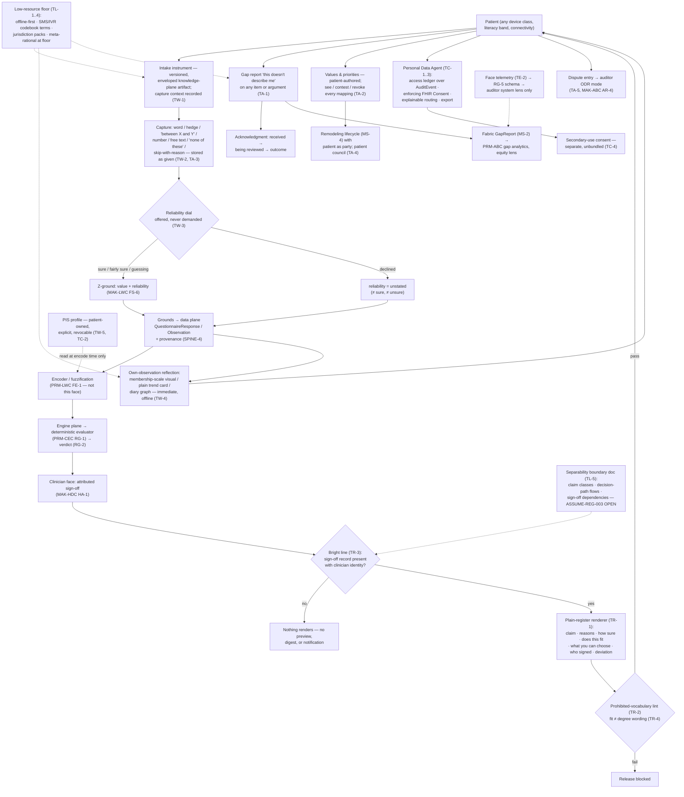

# Primer TXC — The Patient Face

> **Justification fabric.** The butterfly's body is the justification fabric plus the deterministic evaluator: *every claim is an argument; only arithmetic releases.* One argument object renders in three registers to three faces; the fabric is append-only, hash-chained, and version-pinned so any decision replays bit-for-bit. Two wings paint the body — the **Left Wing** (MAK-LWC) senses in degrees, the **Right Wing** (MAK-RWC) judges in systems — and their coordination is the flight (MAK-MIF). The host is **MAK-FFC v1.1**: no primer here relaxes a corpus MUST. Regulatory content is governed by **REG-POSTURE v1.0** via **MAK-ANT** — assume inclusion, glass-box as the design target, ASSUME-REG-001..007 open pending counsel. This primer's position: *the face where nearly all grounds originate and where the north star is tested — it listens without coercing, reflects the patient's own data without diagnosing, renders the signed argument in a second register never a softer one, leaves the patient holding custody, and is built separable so that any answer to ASSUME-REG-003 is implementable without surgery.*

## TXC1. What this is

The patient face is the consolidated Patient Face of the triple-facing CDSS — MAK-FFC Part 4's host face (PF-1..8), MAK-LWC Part 4's fuzzy face (FP-1..8) and MAK-RWC Part 4's meta-rational face (MP-1..6) stated as one buildable face (MAK-TXC Part 0; Part 7 consolidation map). Its unit of work is the *ground*: routine and condition-specific capture happens here, before the encounter, with capture context recorded (TW-1), and the patient's actual speech — single terms, ratified hedges, hesitant "between X and Y", free text, "none of these", stated unsureness — is stored as given, never averaged or coerced to a point (TW-2, TW-3). Its rendering law is register fidelity: every patient-visible recommendation is the same argument object the clinician signed, decoded to the plain register with qualifier, envelope status and deviation intact — never a sanitized fork (TR-1, MAK-FFC PF-2/SPINE-3) — in words and pictures, never scores (TR-2). Its defining property, and the corpus's bright line: **the patient's own observations reflect back immediately; anything diagnostic waits for an attributed clinician signature** (TR-3; MAK-FFC PF-8; MAK-HDC HA-1; REG-KEEP-003). Its custody law makes the patient an auditor of their own record — access ledger, enforcing consent, explainable routing, patient-custodied meta-data (TC-1..3). Its floor is the product (TL-1..4), and its regulatory shape is deliberately open: TL-5 builds the face separable because ASSUME-REG-003 is a counsel question no design document may close (MAK-ANT AN-3).

*Trace: MAK-TXC Thesis; Part 1 "What consolidation adds" laws (i)–(iv); TW-1/2/3, TR-1/2/3, TC-1..3, TL-1, TL-5; MAK-FFC PF-2/PF-8; MAK-HDC HA-1.*

## TXC2. Scope

**In scope** — the six MAK-TXC requirement families this primer owns:

- **TW-1..5 · Intake & self-monitoring.** Capture before the encounter with versioned, enveloped instruments and recorded capture context (TW-1); the patient's speech as first-class data, stored as given, with "none of these" and skip-with-reason on every item (TW-2); the reliability dial offered never demanded, "unstated" treated as neither sure nor unsure, never punitive (TW-3); immediate offline-capable feedback on the patient's own data from the same artifacts the clinician sees (TW-4); explicit, revocable, input-side-only PIS calibration (TW-5).
- **TR-1..5 · Plain-register rendering law.** Same argument object, plain register, qualifier + envelope + deviation intact (TR-1); words and pictures never scores, with the prohibited-vocabulary lint as a release check (TR-2); the bright line between own-observations and diagnostic content, releasing clinician identified, no preview/digest/notification crossing it (TR-3); fit-uncertainty worded distinctly from degree-uncertainty (TR-4); reachable plain-register self-description generated from fabric data (TR-5).
- **TA-1..5 · Patient acts.** Gap reports with authorship, consented demographic context and visible acknowledgment (TA-1); values as patient-authored structured data passing the full remodeling lifecycle with the patient as party (TA-2); escape-hatch content preserved, rendered to Consult-Prep, counted, never optimised away (TA-3); patient-council stage for patient-affecting remodeling (TA-4); patient-initiated dispute entry routed to the auditor face's ODR mode (TA-5).
- **TC-1..4 · Custody & consent.** The Personal Data Agent's complete access ledger and data-plane-enforced granular consent (TC-1); patient-custodied meta-data — PIS profiles, reliability components, gap reports, values — visible, exportable, revocable where they grant (TC-2); policy-driven, explainable, ledgered repository routing (TC-3); secondary-use consent separate and unbundled, tested as a conformance property (TC-4).
- **TL-1..5 · Low-resource floor.** Accessibility floor as release gate with SMS/IVR fallback (TL-1); linguistic intake as the low-resource primary modality with per-jurisdiction codebook and instrument packs (TL-2); meta-rational functions offline and at the device floor with the equity lens by default (TL-3); WHO SMART artifact-layer alignment including plain-codebook packs (TL-4); separability pending ASSUME-REG-003 (TL-5).
- **TE-1..4 · Evaluation.** Real-patient evaluation across literacy bands and device classes with independent evaluators (TE-1); face telemetry under the unified RG-5 schema, auditor system lens only (TE-2); per-release register-fidelity audits (TE-3); the face conformance suite as release gate with conformity-file artifacts (TE-4).

**Out of scope** — each exclusion names its owner:

- Interaction and presentation — screens, components, tired-thumb gate, notification payload law, resumability, localisation mechanics (PRM-PRB; MAK-TXC Part 0 "Interaction-level specification belongs to the Proboscis volume"). PRM-PRB's Part 7 realization map is the counterpart to every TXC ID; this primer specifies face *behaviour*, PRM-PRB specifies how it feels in the hand.
- The clinician sign-off act itself (PRM-HDC — MAK-HDC HA-1). This face *consumes* released, attributed arguments; it never produces a release and never renders a diagnostic claim ahead of one (TR-3).
- Evaluation and release of any argument (PRM-CEC — MAK-CEC RG-1 single gate, RG-2 verdict ledger). The face reads verdicts; it holds no engine, no threshold, no second gate (MAK-CEC OM-5 anti-requirement "never a second gate … 'preview' path").
- The mathematics of gradedness and reliability — LinguisticVariables, fuzzification, the CWW decoder, Z-ground schema, PIS calibration algorithm (PRM-LWC — MAK-LWC FS-1..9, FE-1, FE-6). This face captures the ground with its modality and reliability recorded and holds custody of the PIS profile (TC-2); PRM-LWC encodes.
- Envelope computation, gap analytics, the remodeling lifecycle and trading-zone charters (MAK-RWC MS-1/MS-2/MS-4/MS-8; PRM-ABC for the ledger, analytics and dispute workflow — MAK-ABC AR-4, AT-1, AG-4). This face files gap reports and disputes and renders envelope status; it does not aggregate, adjudicate or ratify.
- Values-to-weight mappings taking effect (MAK-FFC PF-3 ratification in the knowledge plane; PRM-CEC template resolution). TA-2 governs authorship, visibility, contest and revocation from the patient's side only.
- Knowledge-plane admission of instruments, plain codebook packs and plain-register templates — versioning, signing, PR gateway (Primer D; MAK-FFC EN-3; `cdss-compiler` per Arch §14.2). See finding TXC-F3.
- Runtime LLM elicitation and patient-facing composed documents (Primer L — L7 patient sheets, L8 structured intake agent; Class 4+, L5 only, Blocked on ASSUME-REG-003 per Primer L §L10). See finding TXC-F4.
- Regulatory classification of the patient surface (PRM-ANT; REG-POSTURE ASSUME-REG-003 / TASK-REG-004). TL-5 records the design consequence; it never argues the classification.
- Stack choices — frontend, Android-native vehicle, cache/queue, storage (PRM-LEG; MAK-LEG L1-2, L1-3, L4-2, L5-2 bindings). This primer cites the bindings it must satisfy; it chooses no leg.

*Trace: MAK-TXC Part 0; LLM usage contract rule 5; Part 7 consolidation map; MAK-PRB Part 7 realization map; MAK-CEC OM-5, RG-1; MAK-LWC FS-9; MAK-FFC PF-3; Primer L §L10; Appendix A census.*

## TXC3. Breadth and depth of content required

Twenty-eight requirements (TW 5 · TR 5 · TA 5 · TC 4 · TL 5 · TE 4; 21 MUST, 6 SHOULD, 1 MAY). MAK-TXC carries no component inventory of its own; the inventories it consolidates enumerate **seventeen named components** across the three source faces: six host (Intake Instruments, Self-Monitoring Loop, Values & Priorities Module, Personal Data Agent, Argument Renderer plain register, Low-Resource Delivery Profile — MAK-FFC Part 4), five fuzzy (Linguistic Intake Controls, Reliability Dial, Personal Scale Calibration, Membership Scale Visual, Plain Trend Cards — MAK-LWC Part 4), six meta-rational (Fit Renderer, Patient Gap Reporter, Escape-Hatch Capture, Values Remodeling Gateway, Fit-vs-Degree Renderer, Patient Council Interface — MAK-RWC Part 4). PRM-PRB's component library (ten components, MAK-PRB Part 4) is the interaction-grain realisation of these; this primer owns their behaviour, not their pixels.

To be real rather than a demo the face needs: **one clinical domain's intake instruments as versioned, enveloped knowledge-plane artifacts** (TW-1; MAK-RWC MS-1 — an instrument without an envelope is not deployable); **a ratified plain codebook for that domain** and the prohibited-vocabulary lint over it (TR-2; MAK-LWC FS-4/FP-5); **at least one released argument class** flowing from MAK-HDC HA-1 sign-off to the plain renderer, so TR-1 and TE-3 can be tested against real objects rather than fixtures; **a working Personal Data Agent** — access ledger over AuditEvent, enforcing FHIR Consent, explainable routing policy as a versioned artifact (TC-1, TC-3); **the SMS/IVR tier speaking codebook terms** (TL-1, TL-2); and **a stated device and bandwidth floor tested per release** (TL-1). The corpus is explicit that the face's validation evidence is missing: the linguistic-equity hypothesis is unmeasured in CDSS settings and patient-facing explanation comprehension has no analogue of the Spitzer RCT — TE-1 produces first evidence, and Part 8 makes pre-registration in the low-resource pilot a duty (MAK-TXC Part 8 "Face-relevant research plane"; MAK-FFC open research agenda "gap-closing measurement").

Depth constraint from the corpus: the face's regulatory treatment is open (ASSUME-REG-003), so every element is classified at design time into one of two content classes — the patient's own observations, and clinician-released diagnostic content — and the boundary between them is documented as structure, not policy (TR-3, TL-5). A second constraint: MAK-TXC has no phased execution plan of its own; MAK-FFC's `P3 · Patient face` and `P5 · Low-resource profile` rows and Architecture §14.5 supply the phasing (see Production topology annotation and finding TXC-F1).

*Trace: MAK-TXC Appendix A; MAK-FFC Part 4 component inventory; MAK-LWC Part 4 component inventory; MAK-RWC Part 4 component inventory; MAK-PRB Part 4; MAK-RWC MS-1; MAK-TXC Part 8; MAK-FFC Part 7 phased plan.*

## TXC4. Building in a silo

Most of the face is buildable against synthetic material because its verifiers are local and arithmetic:

- **Ground capture pipeline** (TW-1, TW-2, TW-3). Inputs mockable: one domain's FHIR Questionnaire with linguistic answer options (word-chips, hedges, hesitant range, free text, "none of these", skip-with-reason) and a reliability vocabulary. Output: `QuestionnaireResponse` + `Observation` with capture-context and modality recorded, hesitant answers stored as ranges, reliability as a paired component or "unstated" (MAK-FFC SPINE-4 bindings; MAK-LWC FS-6). Coercion tests (TE-4) are unit tests: no path averages a range, no path treats "unstated" as a value. Stub: the fuzzification service (PRM-LWC FE-1) — the face stores the ground; annotation is downstream.
- **Bright-line enforcer** (TR-3). A content-class discriminator over everything patient-reachable: own-observation projections pass; anything typed as claim/recommendation/risk passes only when it carries a MAK-HDC HA-1 sign-off record with the releasing clinician's identity. Negative tests attempt every bypass (preview, digest, notification payload, cache — MAK-PRB PS-4 enumerates the surface classes). Stub: fabric read API (MAK-FFC SPINE-9) with fixture arguments in released / held / flagged states (MAK-CEC RG-2).
- **Plain-register renderer + lint** (TR-1, TR-2, TR-4). Given a released ActualArgument fixture and a plain codebook, render claim / reasons / how-sure / does-this-fit / what-you-can-choose / who-signed / any deviation; run the prohibited-vocabulary lint (no percentages, probabilities, μ, scores, blended confidence); render fit and degree in separate components. The register-fidelity audit (TE-3) is a content-parity diff against the clinical render — buildable with fixtures. Stub: the CWW decoder (PRM-LWC FE-6) for decoded gradedness words — until it exists, use a fixture codebook mapping.
- **Personal Data Agent** (TC-1, TC-3). Access ledger as a projection over `AuditEvent` bound to argument context; consent as FHIR `Consent` with provision-level granularity, enforced at the data-plane read path; routing policy as a versioned artifact with ledgered decisions. Custody tests (TE-4): a revoked consent stops the read; the ledger shows the attempt. No upstream needed beyond a FHIR server.
- **Meta-data custody** (TC-2, TW-5, TC-4). Patient data view listing PIS profile, reliability components, gap reports, values; export bundle; revocation with plain-language effect statement; secondary-use consent as a separate object whose absence changes nothing in care paths (conformance test).
- **Gap reporter and escape-hatch capture** (TA-1, TA-3). File a GapReport (MAK-RWC MS-2 object) against an instrument item or rendered argument with patient authorship; acknowledgment states received / being reviewed / outcome; escape-hatch content stored verbatim and counted. Stub: gap analytics and disposition (PRM-ABC AT-1) — acknowledge receipt locally, mock disposition.
- **Floor harness** (TL-1, TL-2, TL-3). Offline-first capture with deferred sync; IVR/SMS flows speaking codebook terms; device and bandwidth floor tests. Stub: the low-resource delivery vehicle — android-fhir SDC / fhircore (X8) run against the same Questionnaire artifacts.

What cannot be built in the silo: the live TR-1 path (depends on MAK-HDC HA-1 sign-off producing attributed released arguments); envelope status and fit wording (depend on MAK-RWC MS-1 envelopes from `cdss-compiler`); values mappings taking effect (TA-2 — MAK-FFC PF-3 ratification in the knowledge plane); gap-report disposition and dispute workflow (PRM-ABC AT-1, AR-4); patient-council stage (TA-4 — MAK-ABC AG-4 charter); face telemetry under the unified schema (TE-2 — MAK-CEC RG-5 artifact); real-patient evaluation (TE-1 — requires GATE-002, see finding TXC-F6). These are TXC5 edges.

*Trace: MAK-TXC TW-1..3, TR-1..4, TC-1..4, TA-1/3, TL-1..3, TE-3/4; MAK-FFC SPINE-4/SPINE-9; MAK-LWC FS-6, FE-1, FE-6; MAK-RWC MS-1/MS-2; MAK-CEC RG-2/RG-5; MAK-PRB PS-4; MAK-HDC HA-1.*

## TXC5. Folding it in

Integration contract — consumes and emits, with the counterpart edge named and checked.

**Consumes**

| From | What | Interface | Counterpart edge |
|---|---|---|---|
| PRM-HDC (clinician face) | Released, attributed argument objects — the only source of diagnostic, risk or recommendation content this face may render (TR-1, TR-3) | Fabric read API, register-scoped plain projection (MAK-FFC SPINE-9); sign-off record with clinician identity and signed argument version | MAK-HDC HA-1: "no recommendation becomes … patient-visible diagnostic statement without an attributed clinician sign-off recorded in the fabric with the argument version signed." **Checked:** HA-1 names this face's bright line from the releasing side; TR-3 names it from the receiving side; the two agree on fail-closed default (no action absent sign-off). Match |
| PRM-CEC (engine plane) | Verdict stream — released / held / flagged with stage trace (RG-2); fit report content (MS-9 typed); the RG-5 telemetry schema artifact this face emits under (TE-2) | Fabric read of RG-2 verdicts; RG-5 schema version pinned | MAK-CEC RG-1 "sole path by which any draft becomes face-visible content"; OM-5 anti-requirement against any "preview" path. **Checked:** TR-3's "no preview, digest, or notification crosses the line" is the face-side restatement of OM-5. Match |
| Primer D / `cdss-compiler` (knowledge plane) | Versioned, enveloped intake instruments (TW-1); plain codebook and instrument packs per jurisdiction/language (TL-2, TL-4); plain-register templates (TA-4); routing policy artifact (TC-3) | Registry serving API; version pins from R1 | Primer D §D2 scopes the PR gateway to *fragments*; Arch §14.2 `cdss-compiler` "outputs enter through the registry PR gateway … same as fragments". **Checked:** a FHIR Questionnaire, a codebook pack and a plain-register template are not fragments — the same artifact-type question PRM-LWC raised as LWC-F2; see finding TXC-F3 |
| PRM-LWC (fuzzy layer) | Decoded plain-codebook words and membership-scale artifacts via the single CWW render path (TW-4, TR-2); the ratified reliability vocabulary (TW-3); the PIS encoder that reads — never writes — the patient's profile (TW-5) | Decoder call (MAK-LWC FE-6); Z-ground schema (FS-6) | PRM-LWC §LWC5 Emits row "Register-specific codebook words and μ graphics via the single CWW render path … Face renderers … never implement private linguistic logic." **Checked:** match. PRM-LWC §LWC5 Consumes row "PRM-TXC owns consent and custody; this layer reads the profile only at encode time" — confirmed by TC-2; see finding TXC-F2 for the citation correction |
| PRM-ABC (auditor face) | Gap-report dispositions (TA-1 acknowledgment "disposition"); dispute workflow state (TA-5); patient-council review records (TA-4) | Fabric read of MS-7 meta-rational acts | MAK-ABC AR-4 (dispute mode "reachable from … patient record challenges (MAK-TXC TA-5)"); AT-1 gap analytics; AG-4 "patient-affecting changes include the patient-council stage (MAK-TXC TA-4)". **Checked:** all three cite TXC IDs back. Match |
| MAK-RWC via `cdss-compiler` | ApplicabilityEnvelope per instrument and per warrant (MS-1) for fit rendering (TR-1 envelope status, TR-4) | Envelope fields on the pinned artifact | MAK-RWC MP-1 "The plain register MUST NOT omit envelope status that the clinical register carries." Match |
| PRM-ANT (regulatory sensing) | ASSUME-REG-003 status; GATE-000/GATE-002 positions (TL-5, TE-1) | R30 Regulatory Posture Register read | MAK-ANT Part 3 carrier map: "TASK-REG-001..020 … MAK-TXC TL-5 (004)"; "ASSUME-REG-001..007 … (TL-5 for 003)". **Checked:** the wrapper names this primer's owning ID. Match |
| Primer L (runtime LLM) | Nothing before L5 and ASSUME-REG-003 closure. If L8 activates: pre-populated *unconfirmed* intake chips as grounds with capture context; if L7 activates: clinician-signed patient sheets as released content | Grounds with `modality = llm-elicited`, capture context recorded (TW-1); L7 output enters through the TR-3 released-content path only | Primer L §L2 L8 "Nothing the patient enters reaches the engine unconfirmed"; §L10 "patient-face work beyond the J-3-safe subset … is Blocked." **Checked:** consistent; the non-coercion constraint L8 must inherit is recorded as finding TXC-F4 |

**Emits**

| To | What | Interface | Counterpart edge |
|---|---|---|---|
| Data plane / fabric grounds | Grounds: `QuestionnaireResponse`, `Observation` with capture context, modality, hesitant ranges preserved, reliability component or "unstated" (TW-1..3); escape-hatch content verbatim (TA-3) | FHIR resources per MAK-FFC SPINE-4 bindings; Z-ground shape per MAK-LWC FS-6 | MAK-FFC SPINE-1 grounds slot ("Data plane resources, each with provenance and capture context"); MAK-CEC Ommatidium `inputs: Grounds[] — graded annotations attached (FE-1), reliability preserved (FS-6)`. **Checked:** the engine plane expects reliability *preserved*, matching TW-3's passthrough. Match |
| PRM-HDC (Consult-Prep) | Intake, monitoring, escape-hatch content and gap reports as Consult-Prep inputs (TA-3 "rendered to the clinician in Consult-Prep") | Fabric projection | MAK-HDC HW-2 "The Consult-Prep brief is a projection of the fabric: intake, monitoring, history …"; HA-6 "free text, 'other' selections … preserved verbatim, rendered downstream" (TA-3 names HA-6 as its mirror). Match |
| Fabric (meta-rational acts) | GapReports with patient authorship (TA-1); values as structured Goals and contest/revoke acts (TA-2); dispute positions in the plain register (TA-5) | MAK-RWC MS-2 GapReport object; MS-7 ledgering; MAK-FFC PF-3 Goals | MAK-RWC MS-2 "any authenticated face-side actor (clinician, patient, auditor) can attach 'this does not fit'"; MP-3 patient as party. Match |
| Data plane (custody) | FHIR `Consent` objects, granular and revocable; secondary-use consent as a separate object (TC-1, TC-4); routing decisions ledgered (TC-3); export bundles (TC-2) | MAK-FFC SPINE-4 `Consent`; `AuditEvent` read-side | MAK-FFC PF-4 "consent controls that the data plane actually enforces"; MAK-LEG L5-2 "patient-exportable data honouring custody and routing law (MAK-TXC TC-1/3)". Match |
| PRM-LWC (PIS custody edge) | The patient's PIS profile — created, edited, revoked only by explicit patient action (TW-5, TC-2); read by the encoder at encode time only | Patient-owned data-plane record; revocation propagates as a new version, old pinned | PRM-LWC GAP-LWC-002 asks to "confirm custody sits with PRM-TXC under MAK-FFC PF-3/PF-4". **Confirmed here** (TC-2 makes PIS profiles patient-custodied meta-data); see finding TXC-F2 |
| PRM-ABC / auditor system lens | Face telemetry under the unified schema: modality mix, escape-hatch and gap-report rates by instrument and population, reliability-dial usage, acknowledgment latencies, floor-conformance metrics (TE-2); linguistic-equity and calibration uptake/revocation measures (TE-1) | MAK-CEC RG-5 schema; AF-8 system lens only | MAK-CEC RG-5 "circumrational load (MAK-RWC MS-3)"; MAK-RWC MA-2 equity lens; MAK-FFC AF-8. **Checked:** RG-5's enumerated streams do not name patient-face modality/floor metrics — an extension of the schema artifact, not a conflict; register home is GAP-TXC-001 |
| Conformity file | TE-4 suite results; TE-3 register-fidelity audit results; TL-1 floor test results | Conformity-file artifacts per MAK-CEC RG-8 pattern | MAK-PRB PA-6 realises TE-4 at the UI grain; MAK-ABC AX-3 obligations register retention. Match |

**Fabric binding (MAK-FFC).** This component supplies the *grounds* slot (SPINE-1: patient-reported and self-monitored data with provenance, capture context, modality and reliability) and the fabric's patient-authored meta-rational objects (GapReports per MAK-RWC MS-2; Goals per MAK-FFC PF-3; Consent per SPINE-4). It supplies no claim, no warrant, no qualifier and no release; it renders the plain register under SPINE-3's invariance (compress and re-order, never add, remove or reweight) and only after the releasing act of MAK-HDC HA-1 (PF-8, TR-3). Coordination doctrine: MAK-MIF beat 2 (the full translation loop — intake encodes without coercion; feedback decodes to owned words; what encoding lost is preserved) and beat 6 (reliability-aware listening — the dial writes (restriction, reliability); unstated stays unstated; honesty never punished), per MAK-TXC's own beat map.

*Trace: MAK-TXC Part 7 beat map; TW-1..5, TR-1..5, TA-1..5, TC-1..4, TE-1/2/4; MAK-FFC SPINE-1/3/4/9, PF-3/4/8, AF-8; MAK-HDC HA-1, HA-6, HW-2; MAK-CEC OM-5, RG-1/2/5/8; MAK-RWC MS-1/2/7, MP-1/3, MA-2; MAK-ABC AR-4, AT-1, AG-4; MAK-LEG L5-2; MAK-ANT Part 3; Primer D §D2; Primer L §L2, §L10; PRM-LWC §LWC5, GAP-LWC-002.*

## TXC6. Definition of done

Per release, all of:

1. **Bright-line suite green** — negative tests attempt every patient-reachable route (screen, preview, digest, notification payload, IVR prompt, share surface, cache) with a held/flagged/un-signed argument and none renders diagnostic content; every released render carries the releasing clinician's identity (TR-3; MAK-FFC PF-8; MAK-HDC HA-1; MAK-CEC OM-5; TE-4).
2. **Coercion suite green** — hedged, hesitant, "none of these", skip-with-reason and free-text answers replay byte-identical from storage; no path averages a range or maps an escape hatch to a category; capture context and modality present on every ground (TW-1, TW-2, TA-3; TE-4).
3. **Reliability discipline** — "unstated" produces identical downstream treatment to an absent reliability field; no fixture down-weights a "guessing" ground's worth; the dial is never a required field (TW-3; MAK-LWC FS-6/FP-2).
4. **Register-fidelity audit passes** — a sampled set of released arguments rendered in clinical and plain registers shows content parity (nothing added, removed or reweighted), with envelope status and deviation presence checked explicitly; any failure blocks the release (TR-1, TE-3; MAK-FFC SPINE-3/PF-2; MAK-RWC MP-1).
5. **Plain-register lint clean** — no percentage, probability, μ value, score or blended confidence anywhere patient-visible; fit and degree render as distinct components with distinct wording (TR-2, TR-4; MAK-LWC FP-5; MAK-RWC MP-4).
6. **Custody suite green** — every read of the patient's record appears in the access ledger bound to its AuditEvent and argument context; a revoked consent stops the read and the ledger shows the attempt; PIS profile, reliability components, gap reports and values appear in the data view, export with the record, and revoke where they grant with the effect stated before confirmation; secondary-use consent declined changes no care path (TC-1, TC-2, TC-4; TE-4).
7. **Routing explainable** — every repository routing decision is ledgered against a versioned policy artifact and renders in the plain register (TC-3).
8. **Acts acknowledged** — every gap report and dispute entry has a visible acknowledgment state; no report can be closed without a disposition visible to the patient; every values mapping is visible with contest/revoke available at every lifecycle stage (TA-1, TA-2, TA-5; MAK-RWC MP-2/MP-3).
9. **Floor gate passes** — WCAG conformance, offline capture with deferred sync, stated device and bandwidth floors tested, SMS/IVR tier covering intake, reminders, escalation and gap reporting with codebook terms; gap button, fit rendering, escape hatches and acknowledgment loops function at the floor (TL-1, TL-2, TL-3; MAK-FFC PF-6/XC-3; MAK-RWC MX-3).
10. **Separability documented** — the release's boundary document enumerates the face's claim classes, its data flows into the decision path and its release dependencies on sign-off; ASSUME-REG-003 is cited as OPEN; the J-3-safe subset (intake, consent, access ledger, logistics) is separately buildable and its SBOM carries no diagnostic-render namespace (TL-5; MAK-J3 GPP-4; MAK-ANT AN-3).
11. **Telemetry flowing** — face telemetry emitted under the pinned RG-5 schema version to the auditor system lens only, with the equity lens applied to low-resource gap-report streams (TE-2, TL-3; MAK-CEC RG-5; MAK-FFC AF-8).
12. **Evaluation gates for releases touching real patients** — TE-1's programme (comprehension, linguistic equity, gap-report usability, calibration uptake/revocation) run by evaluators independent of the design team, only after GATE-002 (TE-1; MAK-FFC CF-7 independence; MAK-ANT AN-7).

*Trace: MAK-TXC TE-4's enumerated test classes (bright-line, coercion, custody, floor, lint) plus TE-1/TE-3; every item cites the MUST(s) it tests; MAK-FFC Part 7 `P3` exit ("PF-6 accessibility floor passes; PF-2 register-fidelity audit passes").*

## TXC7. Internal operations diagram



## TXC8. Execution layer

**Executable contracts from the corpus.** MAK-TXC gives no code-level contract of its own; its executable content is (a) the data-plane bindings it inherits — intake as `QuestionnaireResponse`, permissions as `Consent`, access as `AuditEvent`, lineage as `Provenance` (MAK-FFC SPINE-4, verbatim list) — and (b) the Z-ground schema it writes into (MAK-LWC FS-6: value component paired with an optional reliability component from a ratified vocabulary, default "unstated"). The following capture record is therefore **Proposed** (this primer), assembled from those bindings, not a corpus text:

```text
// PROPOSED — PRM-TXC. Realises TW-1/2/3 over MAK-FFC SPINE-4 bindings and MAK-LWC FS-6.
record PatientGround {
  resource:        QuestionnaireResponse.item | Observation      // SPINE-4 binding
  instrument_pin:  {artifact_id, version, envelope_ref}         // TW-1; MAK-RWC MS-1 envelope
  capture_context: {device_class, assistance, modality, channel} // TW-1 (modality ∈ word|hedge|hesitant|numeric|free_text|none_of_these|skip_with_reason|ivr|sms)
  value:           Crisp | CodebookWord | HesitantRange{lo, hi} | FreeText | Sentinel(none_of_these|skip{reason})  // TW-2 — stored as given
  reliability:     "sure" | "fairly sure" | "guessing" | "unstated"   // TW-3; FS-6 vocabulary; never transformed here
  pis_version:     string | null                                 // TW-5 — which PIS profile version the encoder MAY read; the face never applies it
  content_class:   "own_observation"                             // TR-3 — grounds are never diagnostic content
  provenance:      Provenance                                    // SPINE-4
}
```

**Content-class discriminator (TR-3, Proposed):** every patient-reachable payload carries `content_class ∈ {own_observation, released_argument, task_prompt, acknowledgment, custody}`; `released_argument` is valid only with `{signoff_ref, clinician_id, signed_argument_version}` (MAK-HDC HA-1). Absence of the field is a schema violation, not a default.

**First executable properties (seed for the I registry, patient-face subset — TE-4):** (1) ∀ hesitant answer `{lo, hi}`: storage and every downstream read return `{lo, hi}`, never a scalar (TW-2). (2) ∀ ground with `reliability = unstated` ⇒ downstream treatment identical to a ground with the field absent (TW-3; MAK-LWC FP-2). (3) ∀ payload reaching a patient surface with `content_class = released_argument` ⇒ a sign-off record with clinician identity resolves in the fabric (TR-3). (4) ∀ released argument: plain-render content set = clinical-render content set under SPINE-3's invariance test (TR-1, TE-3). (5) ∀ patient-visible string: lint finds no token from the prohibited-vocabulary list (TR-2). (6) ∀ Consent revocation at time t ⇒ no read succeeds after t and the ledger shows every attempt (TC-1). (7) Secondary-use consent state toggled ⇒ care-path behaviour byte-identical (TC-4). (8) ∀ gap report: an acknowledgment state exists within the ratified latency and no transition to "closed" lacks a disposition (TA-1). (9) Completion-rate metric computed with and without escape hatches present differs only by honest counts — removing a hatch is a build failure (TA-3; MAK-RWC MA-3). (10) The J-3-safe build's SBOM contains no plain-argument-renderer namespace (TL-5; GPP-4/GPP-8).

**Asset library** — every requirement family maps to at least one row. Seeded from MAK-TXC Part 8 (verified 2026-09-01) and MAK-ELSM v1.1 (verified 2026-08-29); **load-bearing rows re-verified this run, 2026-09-02**, method stated; new candidate rows are marked as this primer's proposals. Verdict vocabulary per MAK-ELSM: ADOPT / ADAPT / STUDY / BUILD / WATCH; **DEAD-REPLACE** for archived assets.

| Asset | Type | Satisfies | Licence | Currency | Verified (method · date) | Verdict |
|---|---|---|---|---|---|---|
| [google/android-fhir](https://github.com/google/android-fhir) — Structured Data Capture library (ELSM-04 / ELSM-T01) | library (Kotlin, offline-first) | TW-1 intake engine on-device, skip logic, validation; TL-1 offline | Apache-2.0 | Repo active (2,426 commits, 599★, OHS Foundation); **Data Capture Library 1.3.1 — 20 Nov 2024** is the latest SDC release (~21 months) | GitHub repo + releases page fetched · 2026-09-02 | **ADOPT; WATCH release cadence** — confirm SDC 1.3.x supports the hesitant/"between" answer shape or plan a BUILD extension (finding TXC-F5) |
| [opensrp/fhircore](https://github.com/opensrp/fhircore) (ELSM-05 / ELSM-T02) | deployed product (Kotlin) | TL-1..4 — the low-resource profile as a maintained WHO-SMART-on-Android product; device-integration features excluded per tier rules (MAK-CEC RG-6, GPP-6) | Apache-2.0 | **v2.2.2 · 10 Nov 2025**; active (1,901 commits, 68★, Ona); minimum Android 8.0 (API 26) | GitHub repo fetched · 2026-09-02 (confirms MAK-TXC Part 8 re-verification of 2026-09-01) | **ADOPT / STUDY** — API 26 minimum is a candidate device floor (proposed tolerance below) |
| HL7 FHIR Structured Data Capture IG | standard (IG) | TW-1 Questionnaire/QuestionnaireResponse semantics; TL-4 artifact alignment | HL7 (CC0 IG) | **v4.0.0 STU 4 on FHIR R4** current published; 4.0.0-ci-build in development | hl7.org/fhir/uv/sdc + build.fhir.org fetched · 2026-09-02 | **ADOPT** |
| HL7 FHIR `Consent`, `AuditEvent`, `Provenance` | standard (resources) | TC-1, TC-3, TC-4 — SPINE-4 bindings | HL7 | R5 `Consent` FMM 2 (Trial Use), with `provision` and `policyBasis` elements; R4 remains the SDC/android-fhir base — version choice is a PRM-LEG binding | hl7.org/fhir/R5/consent.html fetched · 2026-09-02 | **ADOPT (R4 or R5 per LEG ruling); WATCH** — Consent maturity is low; granular provision semantics must be conformance-tested, not assumed (TE-4 custody tests) |
| HAPI FHIR jpaserver-starter (ELSM-20) | server | TC-1 AuditEvent/Consent/Provenance persistence; data plane for grounds | Apache-2.0 | very active per MAK-ELSM (2026-08-29) | carried forward from MAK-ELSM §04 (verified 2026-08-29) | **ADOPT** |
| WHO SMART Guidelines IGs + national adaptation layers (ELSM-06 / ELSM-T04) | content program | TL-2, TL-4; TW-1 instrument source material for LMIC jurisdictions | CC/Apache mix | Registry page "Last updated: November 2025"; ANC IG published Feb 2021 with Digital Adaptation Kit | smart.who.int fetched · 2026-09-02 | **ADOPT** |
| W3C WCAG 2.2 | standard | TL-1 accessibility floor (MAK-PRB PA-1 binds "2.2 AA equivalent") | W3C | **W3C Recommendation, 12 Dec 2024** — current version | w3.org/TR/WCAG22 fetched · 2026-09-02 | **ADOPT** |
| [rapidpro/rapidpro](https://github.com/rapidpro/rapidpro) — *new candidate, not in any corpus annex* | platform (Python/Django) | TL-1, TL-2 SMS/IVR tier for intake, reminders, escalation, gap reporting | **AGPL-3.0** (LICENSE file fetched) | active (23,422 commits, 904★, 2,027 tags; UNICEF/Nyaruka) | GitHub repo + LICENSE fetched · 2026-09-02 | **ADAPT — legal review of AGPL network-copyleft before any dependency; STUDY until ruled** (finding TXC-F5) |
| [fastenhealth/fasten-onprem](https://github.com/fastenhealth/fasten-onprem) (ELSM-21 / ELSM-T03) | self-hosted PHR | TC-1 design mine only | GPL-3.0 | **ARCHIVED 18 Jul 2026, read-only** (notice confirmed); 2.8k★ | GitHub repo fetched · 2026-09-02 | **DEAD-REPLACE → STUDY (cautionary)**; the Personal Data Agent is BUILD |
| **Personal Data Agent** (access ledger + enforcing consent + explainable routing) | build | TC-1, TC-3 | — | no maintained OSS champion after fasten archive (MAK-ELSM landmine; MAK-TXC Part 8 build list) | MAK-TXC §8 build list; this run confirms no successor located | **BUILD** — spec from Stranieri PCA (IEEE Access 2018) + repository allocation (HIJ 2020) |
| **Patient-custodied meta-data view + export + revocation** | build | TC-2, TW-5 (custody side), TC-4 | — | no precedent | MAK-TXC §8 ("PIS calibration with custody semantics") | **BUILD** |
| **Plain-register renderer + prohibited-vocabulary lint + fit/degree components** | build | TR-1, TR-2, TR-4, TE-3 | — | decoder core is PRM-LWC's confirmed BUILD (FS-5/FE-6); the register renderer and lint are this face's | MAK-TXC §8; MAK-LWC §9.6 | **BUILD** |
| **Bright-line release discipline as tested structure** (content-class discriminator + negative suite) | build | TR-3, TE-4, TL-5 | — | no precedent; MAK-J3 GPP-10 negative-test pattern is the design source | MAK-TXC §8 build list | **BUILD** |
| **Patient gap reporter with acknowledgment loop** | build | TA-1, TA-3 (escape-hatch capture), TL-3 | — | no precedent (MAK-RWC Part 9 absence finding, carried via MAK-TXC §8) | MAK-TXC §8 | **BUILD** |
| **Values & Priorities module (patient side: authorship, visibility, contest, revoke)** | build | TA-2, TA-4 (council interface) | — | MAK-FFC open agenda: "no validated elicitation instrument" | MAK-FFC Part 7 research agenda | **BUILD — elicitation-only until PF-3 ratification path exists (MAK-FFC `P3` → `P4`)** |
| **Dispute entry (plain register) → ODR** | build (thin) | TA-5 | — | workflow itself is PRM-ABC AR-4's build | MAK-ABC AR-4 | **BUILD (entry surface only)** |
| **Self-description projection (plain register)** | build (thin) | TR-5 | — | generated from MAK-RWC MS-6 fabric data | MAK-RWC MS-6 | **BUILD (projection only)** |
| **Face telemetry emitter under RG-5** | build | TE-2 | — | RG-5 schema is PRM-CEC's artifact; patient streams are an extension | MAK-CEC RG-5 | **BUILD** — schema extension proposed (GAP-TXC-001) |
| **Real-patient evaluation programme + pre-registration** | study instrument | TE-1 | — | no analogue of the Spitzer RCT for patients (MAK-TXC §8) | MAK-TXC §8 research plane | **BUILD (protocol) — gated on GATE-002** |
| Blake & Kerr 2014 / Blake, Kerr & Gammack 2016 (267-user intake + diary evidence) | research | TW-1, TW-4, TL-1 design source | — | published | carried from MAK-TXC Part 7 sources; MAK-FFC Part 8 | **STUDY** |
| Stranieri PCA (IEEE Access 2018), repository allocation (HIJ 2020), medical ODR (2020) | research | TC-1..3, TA-5 design source | — | published (DOIs in MAK-FFC Part 8) | carried from MAK-FFC Part 8 sources | **STUDY** |
| Li et al. 2016 PIS; Pei et al. 2024 credibility; Z-number medical corpus | research | TW-3, TW-5 mathematics (owned by PRM-LWC) | — | published | carried from MAK-LWC Part 8/9 via PRM-LWC | **STUDY (via PRM-LWC)** |

**Coverage check (P5):** TW-1..5 → android-fhir SDC, SDC IG, WHO SMART IGs, fhircore, Blake evidence; TW-3/TW-5 mathematics via PRM-LWC (Z-ground build, PIS build) with custody build here. TR-1..5 → plain-register renderer + lint build, bright-line build, self-description projection build, PRM-LWC decoder. TA-1..5 → gap reporter build, values module build, dispute entry build, Stranieri ODR. TC-1..4 → FHIR Consent/AuditEvent/Provenance, HAPI FHIR, Personal Data Agent build, meta-data custody build, fasten-onprem as cautionary study. TL-1..5 → fhircore, android-fhir, WHO SMART, WCAG 2.2, RapidPro candidate, bright-line build (TL-5 separability). TE-1..4 → evaluation programme build, telemetry emitter build, renderer parity audit, bright-line suite. **28/28 covered; 10 rows are BUILD (two thin).**

**Sourcing landmines carried forward, with this run's status:** fasten-onprem archived — *confirmed 18 Jul 2026; the custody space still has no maintained OSS champion*; fhircore device-integration features must be excluded in J-3 builds (MAK-ELSM §08) — *unchanged*; android-fhir SDC library release cadence — *new this run: last SDC release Nov 2024 although the repo is active; watch and pin*; RapidPro AGPL-3.0 — *new this run: network copyleft is incompatible with an unreviewed SaMD dependency; legal ruling before adoption*; FHIR Consent maturity (FMM 2 in R5) — *new this run: granular enforcement is a conformance obligation the standard does not guarantee*.

**Proposed tolerances (flag: clinical and product sign-off required; none is a corpus number):** TE-3 register-fidelity sample ≥ 50 released arguments per release, parity 100% (any delta blocks); TA-1 acknowledgment: automatic "received" ≤ 60 s online / at next sync offline, disposition visible ≤ 30 days; TL-1 device floor Android 8.0 / API 26 (fhircore's minimum) and a bandwidth floor of 2G-class ≤ 50 kbps with full intake completing offline; TE-1 comprehension floor ≥ 80% correct on plain-register argument items in every literacy band, linguistic-vs-numeric completion gap reported not gated; TR-2 lint false-negative rate 0 on a seeded corpus of 200 prohibited tokens.

*Trace: MAK-TXC Part 8 verified entries and build list; MAK-FFC SPINE-4; MAK-LWC FS-6, FP-2; MAK-CEC RG-5/RG-8; MAK-ELSM §01, §04, §08 and landmines; MAK-PRB PA-1; external verification as tabled.*

## Production topology annotation

*Per Architecture §11 and §14.5 (MET-1, Proposed):* the row "Patient face + UI (MAK-TXC/PRB)" enters at **L3 as the intake/consent subset¹ — "the J-3-safe subset only"**, is **"per ASSUME-REG-003" at L4**, and **"per posture" at L5**; it has no L1–L2 presence. Architecture §14.2 states the same for the repo: `cdss-ui-patient` "scope beyond intake/consent/logistics **Blocked** on ASSUME-REG-003". The J-3-safe subset is defined by MAK-J3 GPP-4: "intake instruments, consent management, access ledger, and logistics; it MUST NOT render clinical recommendations, diagnoses, risk information, or monitoring feedback to patients." Reconciled against MAK-TXC's families: **L3 may build** TW-1, TW-2, TW-3, TW-5 (capture side), TC-1, TC-2, TC-3, TC-4, TL-1, TL-2, TL-4 (pack installation), TL-5 and the TE-4 suites over them. **Blocked at L3 and gated on ASSUME-REG-003 at L4:** TW-4 (self-monitoring feedback — GPP-4 names "monitoring feedback" as excluded from the exempt subset), TR-1..5 (any rendering of released arguments), TA-1 on rendered arguments (gap reports on *instrument items* remain in-subset), TA-2 display of mappings, TA-5, TL-3's envelope rendering, TE-1 and TE-3. MAK-TXC itself has no phased plan; MAK-FFC's `P3 · Patient face` (intake, self-monitoring, plain renderer, PDA, values elicitation-only) and `P5 · Low-resource profile` are the corpus-level phases and are level-agnostic — see finding TXC-F1. Tier pipeline applies in full from first release (Architecture §11.1). Gates: GATE-000 (counsel) governs the L4 decision; GATE-002 precedes any identifiable patient data, so TE-1's real-patient programme cannot start before it (MAK-ANT AN-7; REG-KEEP-004). **J-tier:** the full face is J-1/J-2 content ("per posture"); in J-3 only the GPP-4 subset exists and its build must be structurally absent of the renderer (GPP-8) — TL-5's separability is what makes this a build configuration rather than surgery.

## Register topology annotation

*Per Architecture §12.2 (R1–R28) and §14.3 (R29–R30, Proposed):* **Owns:** none. **Writes:** R1 (instrument, codebook-pack and routing-policy version stamps on every ground and render); R2 (artifact manifest on every face emit); R7 (patient-face property subset, TXC8 properties 1–10); R18 (contract-violation log — a bright-line breach or an un-linted patient string is an I-5 contract violation); R25 (build evidence — this run's verification table, the TL-5 boundary document); R13 (*proposed extension*, see GAP-TXC-001). **Reads:** R1, R14 (lockfile pins), R19 (posture decision — the L4 gate for TR/TW-4 scope), R30 (Regulatory Posture Register — ASSUME-REG-003 status carried by TL-5; MAK-ANT AN-3). **Not registers:** grounds, Consent, AuditEvent, GapReports, Goals and PIS profiles are data-plane and fabric objects, keyed by the R1 stamp but not register rows (Architecture §12.1 law 4). **Gap proposals:** GAP-TXC-001 — TE-2 face telemetry (modality mix, escape-hatch and gap-report rates, dial usage, acknowledgment latency, floor conformance) has no register home: R13 Acceptance Telemetry is "written by clinician actions"; propose either an R13 scope extension to "face actions" (patient included) or a sibling register, operator decision — the same shape as PRM-LWC GAP-LWC-001. GAP-TXC-002 — the TL-5 separability boundary document has no register home; propose it as a versioned artifact in R25 with a R30 cross-reference so a posture change re-opens it. GAP-TXC-003 — Architecture §14.4 grants prefix UIP for the patient UI; the face behaviour and the UI share `cdss-ui-patient`; propose UIP covers TASK IDs for both PRM-PRB and PRM-TXC work, with TASK-TXC-n used here as interim.

<!-- ECOSYSTEM-V2-BLOCK: TXC v1.0 -->
## TXC9. Build Execution Extension (Ecosystem v2.0)

**1. Mini-North-Star.** WHAT: the ground-capture pipeline with coercion and reliability discipline, the Personal Data Agent, the content-class discriminator with its bright-line negative suite, the plain-register renderer with lint and parity audit, and the gap reporter with acknowledgment loop. WHY: the face where the fabric's grounds originate and where the north star is tested — honest listening, honest reflection, and a bright line no release ever crosses. Endpoint: L3 for the J-3-safe subset; renderer scope enters at L4 per ASSUME-REG-003 (Production topology annotation). Derives from and cites SPINE §13.1 and MAK-FFC PF-1/PF-4/PF-8, SPINE-3.

**2. Doctrine classification.** Capture, storage-as-given, consent enforcement, the content-class check, register lint and parity diffing are arithmetic; nothing on this face proposes and nothing releases — release is MAK-HDC HA-1's act evaluated by PRM-CEC RG-1. The one probabilistic neighbour (Primer L L8 elicitation) is Blocked and, when unblocked, still reaches this face only as unconfirmed grounds.

**3. Scoped recon register.**
| ID | Verify | Tag |
|---|---|---|
| RECON-TXC-001 | Registry / compiler gateway admits FHIR Questionnaire, plain codebook pack and plain-register template artifact types (Primer D §D2 names *fragments*) — finding TXC-F3; joint with RECON-LWC-002 | E:DOC D2, Arch §14.2; E:REPO cdss-registry |
| RECON-TXC-002 | android-fhir SDC 1.3.1 answer-shape support for hesitant ranges and "none of these"/skip-with-reason sentinels; extension cost if absent | E:REPO (google/android-fhir datacapture) + silo spike |
| RECON-TXC-003 | RapidPro AGPL-3.0 exposure for a hosted SMS/IVR tier; alternative aggregator options | E:WEB + legal |
| RECON-TXC-004 | FHIR version binding (R4 vs R5) for Consent granularity vs SDC/android-fhir R4 base — PRM-LEG ruling | E:DOC LEG; E:REPO cdss-spine |
| RECON-TXC-005 | ASSUME-REG-003 / TASK-REG-004 status in R30; GATE-000 and GATE-002 positions | E:DOC MAK-ANT §7/§8; R30 |
| RECON-TXC-006 | RG-5 telemetry schema version and its extension path for patient-face streams (GAP-TXC-001) | E:DOC MAK-CEC RG-5; E:REPO cdss-spine |
| RECON-TXC-007 | MAK-HDC HA-1 sign-off record schema (fields this face must resolve for `released_argument`) | E:DOC HDC; E:REPO cdss-fabric |

**4. Work register seed (L3 J-3-safe-subset-equivalent; schema per master v2 Phase 6; estimates ranged with confidence).**
```yaml
TASK-TXC-001:
  story: STORY-TXC-001 (a patient's words arrive as data, uncoerced, with their stated reliability)
  component: patient-capture
  title: Ground-capture pipeline per TXC8 PatientGround record (TW-1, TW-2, TW-3)
  purpose_chain: {what: "capture service over SDC QuestionnaireResponse + Observation with modality, capture context, hesitant ranges, sentinels, reliability", why: "nearly all of the fabric's grounds originate here; coercion at capture is unrecoverable downstream", endpoint_ref: "L3 J-3-safe subset; MAK-FFC P3 exit; SPINE-NS WHY"}
  evidence_refs: [E:DOC MAK-TXC TW-1/2/3, MAK-FFC SPINE-4, MAK-LWC FS-6; RECON-TXC-002, RECON-TXC-004]
  definition_of_ready: ["one domain's Questionnaire authored with linguistic options and envelope", "reliability vocabulary pinned from PRM-LWC"]
  steps: ["SDC render + validation", "answer shapes: word | hedge | hesitant range | numeric | free text | none_of_these | skip{reason}", "reliability dial optional → unstated default", "capture context + modality stamp", "emit QuestionnaireResponse/Observation + Provenance with R1 pins", "property suite (TXC8 props 1, 2)"]
  test_plan: "coercion suite: 40 hedged/hesitant/sentinel fixtures replay byte-identical; unstated ≡ absent test; failure case: unknown instrument version hard-fails"
  observability: "counters capture.modality_mix, capture.dial_usage; structured log with pins (feeds TE-2 via GAP-TXC-001)"
  definition_of_done: ["properties 1–2 green", "no scalarisation path found by static check", "typed errors only"]
  estimate: {optimistic: 4d, likely: 7d, pessimistic: 12d, confidence: medium}
  depends_on: []
```
```yaml
TASK-TXC-002:
  story: STORY-TXC-002 (the patient holds the keys to their record)
  component: patient-data-agent
  title: Personal Data Agent — access ledger, enforcing consent, explainable routing (TC-1, TC-3), meta-data custody view (TC-2), unbundled secondary-use consent (TC-4)
  purpose_chain: {what: "ledger projection over AuditEvent bound to argument context; FHIR Consent enforced at the read path; routing policy as versioned artifact; data view + export + revocation", why: "custody is a face function, not a policy document (MAK-TXC Part 1 law iv); no maintained OSS precedent exists", endpoint_ref: "L3 J-3-safe subset (GPP-4 names consent + access ledger); SPINE-NS WHY"}
  evidence_refs: [E:DOC MAK-TXC TC-1..4, MAK-FFC PF-4, MAK-LEG L5-2; MAK-ELSM ELSM-21 landmine; RECON-TXC-004]
  definition_of_ready: ["FHIR version ruled (RECON-TXC-004)", "PIS profile record shape agreed with PRM-LWC"]
  steps: ["AuditEvent → ledger projection with argument context join", "Consent provisions enforced in data-plane read interceptor", "routing policy artifact + ledgered decisions + plain-register explanation", "data view: PIS, reliability components, gap reports, values; export bundle", "revocation with pre-commit effect statement", "secondary-use consent as separate object; care-path invariance test"]
  test_plan: "custody suite: revoke → read blocked + attempt ledgered; property 6, 7; export round-trip"
  observability: "ledger completeness counter; consent-enforcement denials logged to R18 as contract checks"
  definition_of_done: ["custody suite green", "every read has a ledger row", "secondary-use toggle changes no care path (byte-identical)"]
  estimate: {optimistic: 8d, likely: 14d, pessimistic: 24d, confidence: low}
  depends_on: [TASK-TXC-001]
```
```yaml
TASK-TXC-003:
  story: STORY-TXC-003 (nothing diagnostic reaches a patient before a named clinician signs it)
  component: patient-bright-line
  title: Content-class discriminator + bright-line negative suite (TR-3, TE-4, TL-5)
  purpose_chain: {what: "typed content_class on every patient-reachable payload; released_argument valid only with resolvable HA-1 sign-off record; negative suite over every surface class incl. notification payloads and caches", why: "the bright line is the face's defining property and TL-5's separability evidence; it must be structure, not policy", endpoint_ref: "L3 (structure present even while renderer scope is Blocked); L4 entry precondition; SPINE-NS WHY"}
  evidence_refs: [E:DOC MAK-TXC TR-3, TL-5, MAK-FFC PF-8, MAK-HDC HA-1, MAK-CEC OM-5, MAK-J3 GPP-4/GPP-10, MAK-PRB PS-4; RECON-TXC-005, RECON-TXC-007]
  definition_of_ready: ["HA-1 sign-off record schema pinned or local placeholder recorded", "surface-class list agreed with PRM-PRB (PS-4)"]
  steps: ["content_class enum in cdss-spine contract", "sign-off resolver", "surface-class negative tests: screen, preview, digest, push payload, SMS/IVR prompt, share, cache", "J-3-safe build variant with renderer namespace absent; SBOM diff (property 10)", "TL-5 boundary document generated from the discriminator's type inventory"]
  test_plan: "zero false-accepts on 30 held/flagged/unsigned fixtures across all surface classes; zero false-rejects on own-observation fixtures; SBOM diff clean on J-3 variant"
  observability: "any discriminator rejection at runtime → R18 contract violation + alarm"
  definition_of_done: ["negative suite green", "boundary document produced and filed to R25", "ASSUME-REG-003 cited OPEN in the document"]
  estimate: {optimistic: 4d, likely: 6d, pessimistic: 10d, confidence: medium}
  depends_on: [TASK-TXC-001]
```

**5. Orchestration hooks.** `WF-TXC-1` release: build → coercion + reliability suites → custody suite → bright-line negative suite → plain-register lint → register-fidelity parity audit (skipped with a recorded reason while renderer scope is Blocked) → floor tests → J-3-variant SBOM diff → manifest emit (idempotent by artifact hash; retry 1; timeout 30m). Emits `EVT-TXC-1 patient-face.release`, consumed by WF-SPINE-1 and PRM-PRB's PA-6 suite; consumes `EVT-HDC signoff.recorded` (name per PRM-HDC) to admit released arguments. `EVT-TXC-2 gap-report.filed` → PRM-ABC gap analytics.

**6. Observer checkpoint spec.** At L3 exit (J-3-safe subset): coercion, custody and bright-line suites green from CI artifacts; TL-5 boundary document present in R25; no renderer namespace in the J-3 variant's SBOM (R3). At L4 entry: R30 shows ASSUME-REG-003 attested (or the decision recorded that the subset stays); first register-fidelity audit on real released arguments; first TE-2 series flowing. Admissible: R1, R3, R7 run outputs, R18, R25, R30, CI artifacts.

**7. Implementer Contract binding.** Tickets execute under IMPL (SPINE §13.2). Component HALT triggers: any ticket that would (a) render claim, recommendation or risk content to a patient surface without a resolvable HA-1 sign-off record → HALT: TR-3 / MAK-FFC PF-8; (b) average, round or categorise a hedged, hesitant or escape-hatch answer at capture → HALT: TW-2 / TA-3; (c) treat "unstated" reliability as a value or down-weight a "guessing" ground → HALT: TW-3; (d) apply a PIS profile, infer values or semantics from behaviour, or alter any weighting from the patient side → HALT: TW-5 / TA-2 / MAK-FFC PF-3; (e) render a percentage, probability, μ, score or blended confidence patient-visibly → HALT: TR-2; (f) describe ASSUME-REG-003 as closed or build renderer scope into the J-3 variant → HALT: TL-5 / MAK-ANT AN-3 / GPP-4; (g) bundle secondary-use consent with care consent or remove an escape hatch to lift completion → HALT: TC-4 / TA-3.

**8. Gaps and register proposals.** GAP-TXC-001 (patient-face telemetry register home), GAP-TXC-002 (TL-5 boundary document home), GAP-TXC-003 (UIP prefix covering face + UI) as in the Register topology annotation. GAP-TXC-004 — MAK-TXC has no phased execution plan and therefore no gate-dependency table as MAK-ANT AN-7 requires of "every volume's phasing table"; propose the Production topology annotation's L3/L4 split plus GATE-000/GATE-002 dependencies as the additive erratum to MAK-TXC Part 7 (finding TXC-F1). GAP-TXC-005 — MAK-CEC RG-5's enumerated telemetry streams omit the patient-face metrics TE-2 mandates; propose an additive schema extension in `cdss-spine` (finding TXC-F7).

<!-- MET-1 METAMORPHOSIS & HARDENING ANNEX — APPENDED 2026-09-02. Pure append per X1 discipline. Status: Proposed (ratification via MET-2 decision queue); Hardening state: PENDING in R29 — nothing here is HARDENED. -->
## TXC10. Metamorphosis & Hardening Annex — fabric binding + validity findings + updated execution block

**Fabric binding (MAK-FFC).** Restated from TXC5: this component supplies grounds (with provenance, capture context, modality, reliability) and the patient-authored fabric objects — GapReports, Goals, Consent; never a claim, warrant, qualifier or release; renders the plain register under SPINE-3 invariance only after MAK-HDC HA-1. Coordination doctrine: MAK-MIF beats 2 and 6.

**Validity findings (P4 — recorded, not resolved; host law governs; operator decides).**

- **TXC-F1 · Level alignment and the missing phase table (P4-e, Architecture ↔ MAK-TXC ↔ MAK-FFC).** Architecture §14.5 enters the patient face at L3 as "the J-3-safe subset only" and gates the rest on ASSUME-REG-003 at L4; MAK-FFC Part 7 `P3 · Patient face` builds "Intake instruments, self-monitoring loop, plain-register renderer, Personal Data Agent, values module (elicitation only)" with exit "PF-6 accessibility floor passes; PF-2 register-fidelity audit passes"; MAK-TXC has no phase table at all. Not a contradiction — `P3` is level-agnostic and MAK-TXC defers phasing — but MAK-ANT AN-7 requires every volume's phasing table to mark gate dependencies, and the `P3` exit (a PF-2 register-fidelity audit) presupposes renderer scope that Architecture Blocks at L3. Default proposal (Production topology annotation): split `P3` into a J-3-safe L3 slice (intake, PDA, floor, bright-line structure) and an L4 slice (renderer, self-monitoring feedback, values display, TE-3 audit) conditioned on R30's ASSUME-REG-003 record. *Cites: Arch §14.2 `cdss-ui-patient` row, §14.5 row "Patient face + UI"; MAK-FFC Part 7 `P3`; MAK-TXC Part 7 (no phase table); MAK-ANT AN-7; MAK-J3 GPP-4.*
- **TXC-F2 · PIS custody edge — confirmed, with a citation correction (P4-e, PRM-LWC ↔ MAK-TXC).** PRM-LWC GAP-LWC-002 asks to "confirm custody sits with PRM-TXC under MAK-FFC PF-3/PF-4, not with any register." Confirmed: MAK-TXC TC-2 makes "PIS calibration profiles, reliability components, gap reports, and values structures" patient-custodied meta-data — visible, exportable, revocable — and TW-5 carries FP-3 "in force." The correction: PIS custody rides **PF-4** (Personal Data Agent) via TC-2, not PF-3 — MAK-LWC FS-9 states that "value-to-weight mappings remain governed by MAK-FFC PF-3 exclusively" and confines PIS to input-side encoding; citing PF-3 for PIS custody risks blurring the very boundary FS-9 draws. Proposal: PRM-LWC's next additive revision cites GAP-LWC-002 as resolved by MAK-TXC TC-2 under PF-4. *Cites: PRM-LWC §Register topology GAP-LWC-002, §LWC5 Consumes row; MAK-TXC TC-2, TW-5; MAK-LWC FS-9, FP-3; MAK-FFC PF-3, PF-4.*
- **TXC-F3 · Artifact type at the knowledge-plane gateway (P4-e, MAK-TXC ↔ Primer D / Arch §14.2).** TW-1 makes instruments "versioned knowledge-plane artifacts carrying target population, validation status, and known gaps"; TL-2/TL-4 make codebook and instrument packs installable "under knowledge-plane lineage rules"; TA-4 names plain-register templates as remodeling objects. Primer D §D2 scopes the PR gateway and five gates to *fragments* (dose bounds, AMT coding); Arch §14.2 routes `cdss-compiler` outputs through the same gateway. A FHIR Questionnaire with an ApplicabilityEnvelope, a codebook pack and a plain-register template are three further non-fragment artifact types — the same structural question PRM-LWC filed as LWC-F2 for FML. Default proposal, aligned with LWC-F2's: an artifact-type discriminator in D's schema, since hash / tier / dates / context gates apply unchanged and "bounds" for an instrument is its envelope (MS-1). Operator ruling requested jointly with LWC-F2 (RECON-TXC-001 = RECON-LWC-002). *Cites: MAK-TXC TW-1, TL-2, TL-4, TA-4; Primer D §D2, §D8; Arch §14.2; MAK-RWC MS-1; PRM-LWC LWC-F2.*
- **TXC-F4 · Runtime LLM elicitation must inherit non-coercion (P4-e, MAK-TXC ↔ Primer L).** Primer L's L8 structured intake agent elicits patient history conversationally and delivers "pre-populated unconfirmed chips"; L7 composes patient-facing safety-netting sheets under a mandatory clinician-review step. Both are Class 4+, L5-only and Blocked on ASSUME-REG-003 (§L10) — consistent with TL-5 and TR-3 (L7 output is released content; L8 output is grounds). The gap: MAK-TXC is silent on LLM-mediated capture, and Primer L's realisation contract constrains the *question* (interrogative form, no advice) but not the *answer path* — TW-2's storage-as-given and TW-3's optional dial must hold for an LLM-structured reply, i.e. the coder must not collapse "somewhere between mild and moderate, I think" into a chip. Default proposal: when L8 unblocks, its reply path emits `PatientGround` records with `modality = llm-elicited`, the raw utterance preserved as free text (TA-3) and the dial offered per turn; add a corruption row in Primer L's G family for "LLM-structured reply scalarises a hedged answer." *Cites: Primer L §L2 (L7, L8), §L8 realisation contract, §L10; MAK-TXC TW-2, TW-3, TA-3, TR-3, TL-5; MAK-FFC EN-6.*
- **TXC-F5 · External currency (P4-x).** android-fhir's repository is active but its Structured Data Capture library's last release is 1.3.1 (20 Nov 2024) — ~21 months; ADOPT stands because the SDC IG (STU 4, R4) is stable, but hesitant-range and sentinel answer shapes (TW-2) may require an extension (RECON-TXC-002). fhircore v2.2.2 (10 Nov 2025) confirms MAK-TXC's 2026-09-01 re-verification. fasten-onprem's archive (18 Jul 2026) is confirmed; the Personal Data Agent remains BUILD. RapidPro is a new SMS/IVR candidate not in any corpus annex and is AGPL-3.0 — STUDY until legal rules (RECON-TXC-003). FHIR R5 `Consent` is FMM 2; TC-1's "consent controls the data plane actually enforces" is therefore a conformance obligation this face proves, not one the standard guarantees. WCAG 2.2 is the current W3C Recommendation (12 Dec 2024), matching MAK-PRB PA-1. *Cites: TXC8 asset table; MAK-TXC Part 8; MAK-ELSM ELSM-04/05/21; MAK-PRB PA-1.*
- **TXC-F6 · Real-patient evaluation vs the identifiable-data gate (P4-e, MAK-TXC ↔ REG-POSTURE).** TE-1 mandates evaluation "with real patients across literacy bands and device classes (never proxy-only)"; REG-KEEP-004 / GATE-002 forbid identifiable clinical data before controls operate, TASK-REG-014 places the patient surface's IEC 62366-1 analysis last, and MAK-ANT Part 4 S-2 notes synthetic-only is "generally not validation evidence." Not a contradiction — TE-1 is *what* evidence counts, GATE-002 is *when* it may be collected — but TE-1 has no gate marker (see TXC-F1). Default proposal: TE-1 protocol pre-registered before GATE-002 (a build deliverable, X8 row), fieldwork after it; the J-3-safe subset's usability may be evaluated with consented non-clinical participants earlier, labelled development evidence, never validation. *Cites: MAK-TXC TE-1; REG-POSTURE REG-KEEP-004, GATE-002, TASK-REG-014 (via MAK-ANT); MAK-ANT AN-7, Part 4 S-2.*
- **TXC-F7 · Telemetry schema and register home (P4-i, MAK-TXC ↔ MAK-CEC ↔ Arch §12.2).** TE-2 requires face telemetry "under the unified schema" (MAK-CEC RG-5), but RG-5's enumerated streams (cost/latency, calibration, drift, circumrational load, abstention, campaign coverage) do not name modality mix, dial usage, acknowledgment latency or floor conformance; and no register in Arch §12.2/§14.3 holds patient-face telemetry (R13 is written by clinician actions). GAP-TXC-001, GAP-TXC-005. *Cites: MAK-TXC TE-2; MAK-CEC RG-5; Arch §12.2 R13.*
- **TXC-F8 · Own-observation feedback in the exempt subset (P4-e, MAK-TXC ↔ MAK-J3).** TR-3 and TW-4 treat the patient's own observations as content that "reflects back immediately"; MAK-J3 GPP-4 excludes "monitoring feedback to patients" from the J-3 profile, and Arch §14.2 Blocks scope beyond "intake/consent/logistics." Not a contradiction — GPP is a narrowed profile and TXC LLM-contract rule 3 keeps the two content classes distinct — but a team could read TW-4's "own data, not diagnostic" as automatically J-3-safe. It is not: in the J-3 variant TW-4 is structurally absent; in J-1/J-2 it renders immediately. The content-class discriminator (TXC8) carries this as `own_observation` remaining a *distinct* class from `task_prompt`/`custody`, so the exempt build can exclude it by type. *Cites: MAK-TXC TR-3, TW-4; MAK-J3 GPP-4, GPP-8, §3 capability matrix; Arch §14.2.*

| Execution field | Content |
|---|---|
| Execution purpose | Run the patient face as the fabric's grounds supplier and plain-register projection — capture as given, custody with the patient, reflection of own data, release-gated rendering of signed arguments, separable pending ASSUME-REG-003 |
| Inputs / prerequisites | Versioned, enveloped instruments + codebook packs + plain-register templates via the knowledge-plane gateway (TXC-F3 ruling); reliability vocabulary and decoder from PRM-LWC; HA-1 sign-off record schema (RECON-TXC-007); RG-2 verdicts and RG-5 schema from PRM-CEC; FHIR version ruling (RECON-TXC-004); R30 posture status (RECON-TXC-005) |
| Steps | 1 install instrument/pack pins → 2 capture (word / hedge / range / number / free text / sentinel) with context + modality → 3 offer dial; store reliability or "unstated" → 4 emit grounds to data plane (SPINE-4) → 5 reflect own observations immediately (TW-4; J-1/J-2 only) → 6 receive released argument with sign-off record → 7 content-class check (TR-3) → 8 plain render + lint + fit/degree separation (TR-1/2/4) → 9 patient acts: gap report, values, dispute, consent, revocation — each acknowledged and ledgered → 10 telemetry to auditor lens (TE-2) → 11 suites + parity audit + floor tests as release gate (TE-3/4) |
| Tools / repos / environments | `cdss-ui-patient` (Arch §14.2 — Proboscis library + patient face; PRM-PRB co-owner); android-fhir SDC + fhircore for the low-resource vehicle (MAK-LEG L1-3 MAY); HAPI FHIR data plane; PDA, bright-line, renderer, gap reporter as builds; SMS/IVR aggregator per RECON-TXC-003; J-3 variant with renderer namespaces on the SBOM denylist (GPP-8; MAK-ELSM §08) |
| Outputs & acceptance | `PatientGround` records; Consent/AuditEvent/routing ledger entries; GapReports, Goals, dispute positions; plain-register renders with lint + parity evidence; TL-5 boundary document; TE-2 series. Acceptance = TXC6 items 1–11 **plus** fabric-replay test (a plain render replays byte-identical from the pinned argument + codebook) and the TR-3 refusal test (an unsigned argument cannot reach any surface class) |
| Dependencies / handoffs | Upstream: knowledge plane (D / compiler per TXC-F3), PRM-HDC sign-off, PRM-CEC verdicts + schema, PRM-LWC decoder + vocabulary, PRM-ANT posture. Downstream: engine plane (grounds), PRM-HDC Consult-Prep, PRM-ABC analytics/dispute/council, PRM-PRB (implements), conformity file. Contract changes are spine PRs that visibly break this consumer |
| Evidence to collect | R1 pins on every ground and render; R7 property runs; R18 contract violations (bright-line, lint); R25 build evidence + TL-5 boundary document; R30 posture reads; TE-4 suite and TE-3 audit results as conformity artifacts; TE-1 protocol pre-registration and results (post-GATE-002) |
| Failure handling / rollback | Fail-closed on the bright line (no sign-off → nothing renders; MAK-HDC HA-1 default); offline is a legal state with deferred sync, never data loss (TL-1; MAK-PRB PI-2); decoder unavailable → own-observation reflection degrades to the diary graph with an I-5 contract violation logged (TW-4 "diary-graph pattern everywhere else"); consent enforcement failure → reads blocked, incident; rollback = redeploy prior instrument/codebook pins (R14) — old versions stay pinned to their grounds |
| Ownership & status | Repo: `cdss-ui-patient` (Proposed, Arch §14.2); component owner [NEEDS DEFINITION]. Status: New (Proposed) — J-3-safe subset enters at L3; renderer scope **Blocked** on ASSUME-REG-003 |
| Source & research traceability | MAK-TXC v1.0 Parts 0–8 and Appendices A–B (all 28 IDs); MAK-FFC v1.1 SPINE-1/3/4/7/9, PF-1..8, CF-7, AF-6/8, EN-6, XC-3/4, Part 7 `P3`/`P5`, MAK-J3 GPP-4/8/10 (Annex 1); MAK-LWC FS-6/FS-9, FP-1..8, FE-6; MAK-RWC MS-1/2/4/6/7/9, MP-1..6, MX-3, MA-2/3; MAK-CEC OM-3/5, RG-1/2/5/6/8; MAK-HDC HA-1, HA-6, HW-2; MAK-ABC AR-4, AT-1, AG-4, AX-3; MAK-PRB PS-4, PA-1, PA-6, Part 7; MAK-LEG L1-2/L1-3/L4-2/L5-2; MAK-MIF beats 2/6; MAK-ANT AN-3/AN-7, Part 3 carrier map, Part 4 S-2, REG-POSTURE ASSUME-REG-003 / TASK-REG-004 / TASK-REG-014 / GATE-000 / GATE-002 / REG-KEEP-003 / REG-KEEP-004 (cited by ID); MAK-ELSM §01/§04/§08, ELSM-04/05/06/20/21; Primer D §D2/§D8; Primer L §L2/§L8/§L10; PRM-LWC §LWC5, GAP-LWC-001/002, LWC-F2; Architecture §11, §12.1–12.2, §14.2–14.6; external verification 2026-09-02 as tabled in TXC8 |

---

## Appendix A — ID census (additive)

Declared by MAK-TXC v1.0 Appendix A: **28**. Mapped in this primer: **28**.

| Family | Declared | Mapped in | Gap |
|---|---|---|---|
| TW-1..5 | 5 | TXC2 in-scope; TXC4; TXC5 (emit grounds, consume decoder/PIS); TXC6 items 2, 3; TXC8 record + rows | none |
| TR-1..5 | 5 | TXC2; TXC4; TXC5 (consume released arguments); TXC6 items 1, 4, 5; TXC8 (discriminator, renderer, self-description rows) | none |
| TA-1..5 | 5 | TXC2; TXC4; TXC5 (emit meta-rational acts; consume PRM-ABC dispositions); TXC6 item 8; TXC8 rows | none |
| TC-1..4 | 4 | TXC2; TXC4; TXC5 (emit custody objects; PIS edge); TXC6 items 6, 7; TXC8 rows | none |
| TL-1..5 | 5 | TXC2; TXC4 (floor harness); TXC6 items 9, 10; TXC8 rows; Production topology annotation | none |
| TE-1..4 | 4 | TXC2; TXC5 (emit telemetry, conformity file); TXC6 items 1–6, 11, 12; TXC8 rows; findings TXC-F6/F7 | none |

Every ID appears in TXC2 in-scope; every MUST appears in TXC6; every family has at least one TXC8 asset row. Source IDs PF-1..8, FP-1..8, MP-1..6 are cited via MAK-TXC's Part 7 consolidation map and their host volumes only; none is re-minted.

## Appendix B — Self-audit checks (additive) — run 2026-09-02

1. **Section skeleton** — all eleven exemplar sections present in order (TXC1–TXC8, Production topology, Register topology, TXC9, TXC10). **Pass.**
2. **Epigraph** — CG-1 text verbatim, position clause present and varied only in the final sentence. **Pass.**
3. **ID census parity** — 28 declared, 28 mapped (Appendix A). **Pass.**
4. **Scope-out ownership** — every TXC2 exclusion names an owner. **Pass** (10 exclusions, 10 owners).
5. **Trace presence** — every section TXC1–TXC8 ends with a trace line or carries inline IDs. **Pass.**
6. **Asset coverage** — every requirement family has ≥1 TXC8 row; every row has a verification method and date; 8 rows re-fetched this run. **Pass** (24 rows; 10 BUILD).
7. **Axiom compliance** — nothing in this document renders μ, reliability or a fit signal as probability or confidence, and no patient-visible example uses a score (MAK-LWC A1 and MAK-TXC TR-2 applied to the primer). **Pass** — tolerances use "floor", "sample", "latency", never "confidence" for signals.
8. **Subordination** — no statement relaxes a MAK-FFC, MAK-TXC, MAK-LWC or MAK-RWC MUST; ASSUME-REG-003 is nowhere described as closed; findings are recorded, not resolved. **Pass.**
9. **Cross-doc resolution** — every MAK-FFC, MAK-TXC, MAK-LWC, MAK-RWC, MAK-CEC, MAK-HDC, MAK-ABC, MAK-PRB, MAK-LEG, MAK-J3, MAK-MIF, MAK-ANT/REG-POSTURE and MAK-ELSM ID cited resolves in its volume; every Primer A/D/L section and Architecture § cited exists. **Pass** (checked against staged files).
10. **Additive discipline** — v1.0; no prior text. Change policy states additive-only. **Pass.**

## Assumptions & confidence

- **Assumed:** ASSUME-REG-003 remains OPEN through L3 and the J-3-safe subset (GPP-4's list) is the correct reading of Architecture's "intake/consent/logistics." *Confidence: high* on the reading; *none* on the outcome — it is a counsel decision (MAK-ANT AN-3).
- **Assumed:** TXC-F1's split of MAK-FFC `P3` into L3/L4 slices will be accepted as an additive erratum rather than a re-phasing. *Confidence: medium.*
- **Assumed:** TXC-F3 resolves jointly with LWC-F2 by an artifact-type discriminator in Primer D's schema. *Confidence: low-medium* — routing through `cdss-compiler` alone is equally coherent; default stated.
- **X8 verdicts:** android-fhir ADOPT/WATCH *high* (fetched); fhircore ADOPT/STUDY *high* (fetched; matches TXC Part 8); SDC IG, WCAG 2.2, FHIR Consent *high* (fetched); WHO SMART ADOPT *high* (fetched); fasten DEAD-REPLACE *high* (archive notice fetched); HAPI FHIR *medium* — carried from MAK-ELSM (2026-08-29), not re-fetched; RapidPro *low* — new candidate, licence blocks adoption until ruled; all BUILD verdicts *high* — MAK-TXC's, MAK-RWC's and MAK-ELSM's targeted searches and this run found no maintained precedent for the PDA, gap reporter or bright-line structure.
- **Tolerances in TXC8** are proposals flagged for clinical and product sign-off; none is a corpus number. The API 26 device floor is borrowed from fhircore's stated minimum, not from any Mākoha volume.
- **Unsourced items:** none knowingly left; the `PatientGround` record and content-class discriminator are marked Proposed (this primer), not corpus text.
