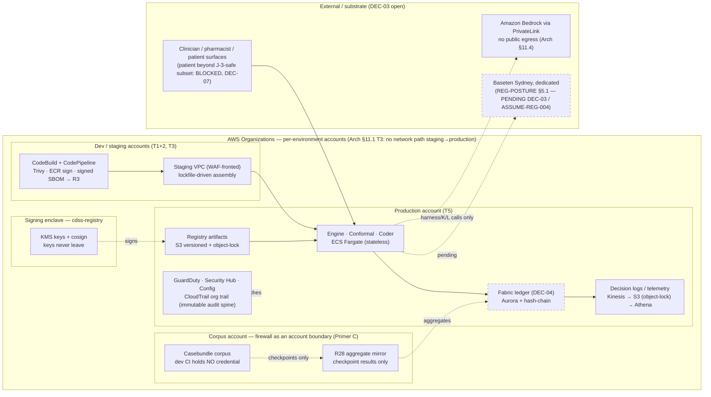

# SEC-2 — Threat model and data-flow map

SEC-1 is faithful to Arch §11.1 and to REG-POSTURE's findings but names no threat
model, no data-flow map, and does not carry encryption, SBOM or CAPA (they live in
Arch §11.4 and DEPLOY-1 step 2 only). Survey-2 row BSQ-0404 asks for the document the
security surface hangs from before GATE-002 (identifiable-data line) and before
`TASK-REG-016` (independent penetration test) can be scoped. This is that document.

## §1 Data-flow diagram

Canonical source: `09_diagrams/data_flow_v1.mermaid` (IMAGO-5; inlined in
`cdss_diagrams_v3.html` block 5; parse PASS, mermaid 10.9.8 via jsdom — see
`09_diagrams/INDEX.md` §3). Reproduced here for the reader; the 09_ file governs.

**Trust boundaries (the rows §3 hangs from):**

| # | Boundary | Declared where | Preserved by |
|---|---|---|---|
| B-1 | Per-environment account boundary; no network path staging → production | Arch §11.1 T3; SEC-1 "per-environment accounts under Organizations" | Organizations; automated reachability analysis (T3) |
| B-2 | Corpus account firewall — dev CI holds no credential; checkpoints only | Arch §10 (cdss-corpus isolation note); §11.4; SEC-1 "corpus firewall as an account boundary" | restricted credentials; R28 mirror carries aggregates only |
| B-3 | Registry signing enclave — keys never leave cdss-registry | Arch §10; SEC-1 "signing keys never leave cdss-registry" | KMS + cosign (§11.4) |
| B-4 | Substrate egress — Bedrock via PrivateLink, no public egress; Baseten dedicated pending DEC-03 | Arch §11.4; REG-POSTURE §5.1; C-03/C-16 | PrivateLink; DEC-03 rules the runtime path |
| B-5 | Face ingress — clinician/pharmacist surfaces; patient surface beyond the J-3-safe subset BLOCKED | Arch §11.2; ASSUME-REG-003 / DEC-07; L10 | WAF (T3); five gates; DEC-07 interim rule |
| B-6 | Immutable audit spine and append-only ledgers | SEC-1 "CloudTrail organisation trail as the immutable audit spine"; Arch §11.4 S3 object-lock; SPINE-4 | object-lock; hash-chain (DEC-04) |
| B-7 | Build supply chain (T1+2) | Arch §11.1 T1+2 | git-secrets; Trivy; ECR scan-on-push + signing; signed SBOM |

## §2 Asset table

| Asset | Data class | Where it lives | Boundary |
|---|---|---|---|
| Synthetic casebundles / EVAL fixtures (dev-side) | synthetic; EVAL/DEV provenance-tagged | dev accounts; `cdss-harness` loaders refuse EVAL | B-1, B-7 |
| Casebundle corpus (real evaluation cases) | EVAL — firewalled | corpus account only | **B-2** |
| Identifiable clinical data | **none before GATE-002** (REG-KEEP-004); after GATE-002 only under Phase-2 controls | production account, ap-southeast-2 (data residency, Arch §11.1) | B-1, B-5, B-6 |
| Signing keys | secrets | KMS in cdss-registry account | **B-3** |
| Registry fragments (signed) | ratified clinical content pointers | S3 versioned + object-lock | B-3, B-6 |
| Decision logs (R11), telemetry (R13), contract violations (R18), fabric ledger | append-only ledgers | Kinesis → S3 object-lock; Aurora hash-chain (DEC-04) | B-6 |
| Prompts / prompt-cards (K8/R22) | instruction-bearing artifacts | signed registry; `cdss-llm-lattice` | B-3, B-4 |
| SBOM per artifact (R3) | supply-chain evidence | per-repo CI → R3 | B-7 |
| Lockfile pin-set (R14) | provenance / rollback key | integration repo | B-7, B-1 |

## §3 STRIDE per boundary (TM-nn)

Each row: threat · existing control (cited) · gap → TASK-REG id or [NEEDS DEFINITION].
S = Spoofing, T = Tampering, R = Repudiation, I = Information disclosure, D = Denial of service, E = Elevation of privilege.

| TM | Boundary | STRIDE | Threat | Existing control (source) | Gap → |
|---|---|---|---|---|---|
| `TM-01` | B-1 | E | Staging workload reaches production resources | Organizations per-env accounts; automated reachability analysis (Arch §11.1 T3); IAM Access Analyzer zero-tolerance on cross-account findings (T4) | none named as gap; verify in `TASK-REG-016` scope |
| `TM-02` | B-1 | I | Non-synthetic data enters a dev/staging account before GATE-002 | REG-KEEP-004 synthetic-only until controls operate; GATE-002 identifiable-data line (SEC-1) | data-class tagging enforcement at ingress → `TASK-REG-010` (gated pipeline split) |
| `TM-03` | B-2 | I | Dev CI obtains a corpus credential (MET-1 §9.4(a) stop-the-line) | separate account + restricted credentials; dev CI credential-free (Arch §10) | scheduled negative audit that no dev principal holds a corpus role → RoR negative audit (Arch §12.1(5)); [NEEDS DEFINITION — job owner] |
| `TM-04` | B-2 | T | Corpus content exfiltrated via the R28 mirror | R28 carries aggregates only (Arch §12.2 row 28); Observer reads registers only (§13.7) | aggregate-shape validator on the replication job → [NEEDS DEFINITION — cdss-corpus owner] |
| `TM-05` | B-3 | S | Fragment signed with a key outside the enclave | keys never leave cdss-registry; cosign (Arch §11.4) | key-custody procedure and rotation → [NEEDS DEFINITION — security owner]; ISO/IEC 27001 A.8.24 / ISO 27799 mapping (`STD-024`, `STD-010`) |
| `TM-06` | B-3 | T | Unsigned or tampered fragment renders | five-gate chain incl. hash gate (Primer D8; Arch §3); verbatim render only from registry | covered; G suite rows attack it at 100% (DEPLOY-2 §2) |
| `TM-07` | B-4 | I | Prompt or clinical context leaves via public egress to a model endpoint | Bedrock via PrivateLink, no public egress (Arch §11.4); prompts from signed registry | Baseten runtime path is **pending DEC-03**; `ASSUME-REG-004` (Sydney, dedicated, change-notice) OPEN → `TASK-REG-009` |
| `TM-08` | B-4 | T | Substrate model version changes silently under a pinned argument | SPINE-5 pins; R1 version stamps; REG-POSTURE §5.1 version-stability terms | contractual change-notice → `ASSUME-REG-004` / `TASK-REG-013` supplier assessment |
| `TM-09` | B-5 | S | Unauthenticated or wrongly-authorised face access | WAF (T3); SOC 2 CC controls (T1+2 PR templates); Essential Eight ML2+ (T4) | identity provider and MFA decisions → [NEEDS DEFINITION — security owner]; `OBL-015` MFA-backed signatures (v1.2) |
| `TM-10` | B-5 | E | Patient surface exposes decision-support output beyond the J-3-safe subset | ASSUME-REG-003 / DEC-07 interim rule: Blocked; L10 double gate | structural-absence proof in the patient-UI build (GPP-8 / NDG-5 pattern) → DEPLOY-2 §6 analogue for the patient face — [NEEDS DEFINITION — DEC-07] |
| `TM-11` | B-5 | D | Face or engine outage degrades to unsafe silence | declared fail-safe paths (J cards); fault-injection of every fail-safe = pen-test script (Arch §11.1 T4; SEC-1); abstention is a legal output (A10) | `TASK-REG-016` executes the script; RTO/RPO undefined → G-09 / proposed DEC-23 |
| `TM-12` | B-6 | R | A release decision cannot be attributed to a person | decision-log stream (D8); CloudTrail org trail; `OBL-015` e-record/e-signature integrity (ISO 13485 §4.2.5; Part 11 form) | signature manifestation and audit-trail verification of the tooling → `KTX-014` (vendor-stated, verify) |
| `TM-13` | B-6 | T | Ledger entry altered after the fact | S3 object-lock (Arch §11.4); SPINE-4 hash-chain; corrections supersede, never edit | DEC-04 (Aurora + hash-chain) Open — until ruled, object-lock streams are the control |
| `TM-14` | B-7 | T | Malicious dependency or image enters a build | Trivy; ECR scan-on-push + image signing; signed SBOM Syft/CycloneDX (Arch §11.1 T1+2) | SBOM → Ketryx SOUP items (`TASK-REG-011`; `OBL-004`; IMDRF N73 in `STD-026`) |
| `TM-15` | B-7 | I | Secret committed to a repository | git-secrets pre-commit (T1+2) | covered; add to `TASK-REG-016` scope |
| `TM-16` | all | I/T | Known vulnerability unhandled or undisclosed to users | Inspector (T4); GuardDuty/Security Hub/Config (T5); ISO/IEC 29147/30111 (`STD-009`, REG-FIND-007) | vulnerability handling + CVSS + CAPA procedure → `TASK-REG-012` / `OBL-008`; user disclosure duty `OBL-009` → [NEEDS DEFINITION — disclosure channel] |
| `TM-17` | all | E | Supplier (AWS, substrate, third-party AI provider on the demo surface) breaches contractual security expectations | `OBL-005/006`; `OBL-013` (public surface routing to third-party AI inventoried as supplier) | supplier assessments → `TASK-REG-013`; demo-surface triage → `TASK-REG-021` |
| `TM-18` | all | R | Clinical-runtime behaviour not observable beside the security feeds | decision-log stream, contract-violation alarms (I-5), in-clinic model monitoring as first-class telemetry (Arch §11.1 T5; SEC-1) | covered at design; instantiation per level (Arch §11.2) |

## §4 Cross-reference table — what SEC-1 omits, carried in by reference

| Topic | Where it is already specified | Standard / obligation hook (REG-POSTURE v1.2) | Owning task |
|---|---|---|---|
| **Encryption at rest** | Arch §11.4: S3 versioned + object-lock, KMS signing | `STD-010` ISO 27799 (what you cite to the TGA), `STD-024` ISO/IEC 27001 Annex A (what you implement — SEC-1 retains it), `STD-008` IEC 81001-5-1 | [NEEDS DEFINITION — security owner]; scope into `TASK-REG-016` |
| **Encryption in transit** | not stated in Arch §11 or SEC-1 — recorded as a gap, not asserted | `STD-024` A.8.24 cryptography; `OBL-009` EP 12.1(5) | [NEEDS DEFINITION — security owner] |
| **SBOM** | Arch §11.1 T1+2 (signed SBOM Syft/CycloneDX per manifest → R3); DEPLOY-1 step 2 | `OBL-004`; `STD-026` (IMDRF N73); REG-POSTURE §6.5 (SOUP and SBOM) | `TASK-REG-011` |
| **Vulnerability handling / CAPA** | DEPLOY-1 step 2 (vuln handling + CVSS + CAPA) | `OBL-008`; `STD-009` 29147/30111; `REG-FIND-007` | `TASK-REG-012` (procedure stub OPS-1.1 PROC-11) |
| **Supplier assessment** | SEC-1 (Baseten-or-substrate, AWS); `OBL-013` public surfaces | `OBL-005`, `OBL-006` | `TASK-REG-013` |
| **Threat-model method** | this document | `STD-017` AAMI TIR57 (KTX-007 STRIDE item types reference it); `STD-007` SW96 | Security owner |
| **Penetration test** | SEC-1 (independent party; fault-injection script) | `OBL-007`; `STD-012` UL 2900-2-1 | `TASK-REG-016` — scope in §5 |

## §5 Penetration-test scope statement for `TASK-REG-016` (derived from §3)

Independent of the development team (`OBL-007`). Yardstick `STD-012`. In scope: every
declared fail-safe under fault injection (Arch §11.1 T4 — J-card fail-safes, coder
abstention, gate outage, LLM timeout) [TM-11]; boundary crossings B-1 (staging→prod
reachability) [TM-01], B-2 (any dev principal reaching a corpus credential) [TM-03],
B-3 (signing outside the enclave; unsigned fragment reaching a render) [TM-05, TM-06],
B-4 (public egress from any model call path) [TM-07], B-5 (authentication and
authorisation of face access; patient-surface capability absence) [TM-09, TM-10], B-7
(secret-in-repo, unsigned image promotion) [TM-14, TM-15]; ledger immutability [TM-13].
Out of scope: corpus content (never opened dev-side); clinical validity (GATE-003
evidence, not security). Evidence: report filed as GATE-003 evidence (`TASK-REG-016`),
findings into CAPA (`OBL-008`).

## §6 ID census and self-audit (run 2026-09-05)

- Census: TM-01..TM-18 = 18 = `req_count`; boundaries B-1..B-7 = 7.
- Every trust boundary in Arch §11.5 / §11.1 appears in §1 — PASS (accounts, corpus account, signing, substrate, faces, audit spine, supply chain).
- Every SEC floor topic (secrets, access, encryption, SBOM, vulnerability handling, supplier assessment, incident/CAPA) has ≥1 TM row — PASS (TM-05/15; TM-09; TM-05/§4; TM-14; TM-16; TM-17; TM-16/§4).
- Every cited control exists in SEC-1 or Arch §11 (grep) — PASS; every STD/OBL/TASK-REG id resolves in REG-POSTURE v1.2 — PASS (both ends).
- mermaid parse of `09_diagrams/data_flow_v1.mermaid` — PASS (sprint-1 `mermaid_parse.json`).
- No boundary weakened; DEC-03 both drawn; no regulatory position asserted — PASS.
